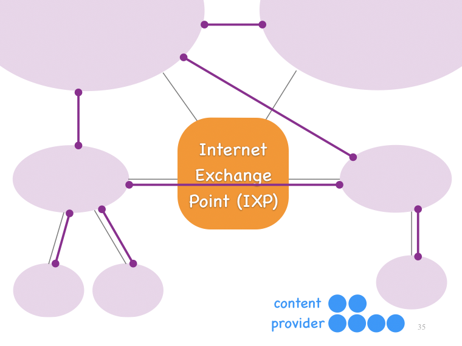

#[COM-208] Computer Networks - Introduction

[TOC]

## 1.	Distributed applications

- **end-systems** or **end-hosts** : all the devices that use the Internet for their communication (ex: laptop, iPhone, WoW servers, web cams, (certain) pacemakers, ...)

  The goal of the Internet is to enable end-systems to communicate with each other. They do that by running what we call *distributed applications*

- A **distributed application** is multiple pieces of code running on multiple end-systems

  This is the opposite of a local application, which runs on a single computer

- Harder to develop than a local application because you need to take account for all combinations of end-systems' behaviours

- There are existing functions provided by the operating system, forming an **Application Programming Interface** (**API**), very helpful when creating a distributed application

- When developing a distributed application, a **communication protocol** (a specification of all the possible sequences of messages that the communicating entities can exchange) needs to be designed

  If the protocol is violated, then both entities will stop communicating

##2.	What's underneath distributed applications?

- **packet switches** are devices that enable the end-systems to communicate with each other

  The *DSL modem* or *cable modem* or *wireless router* at home is an example of a packet switch

- **links** connect the packet switches to the end-systems and among themselves

- **Internet Service Providers** (**ISPs**) own and manage all these packet switches and links

  All the ISPs in the world are interconnected in a sort of hierarchy -- lots of small ISPs connect to bigger ISPs, which connect to even bigger ISPs

  When an ISP faces technical problems (e.g., a network link has failed), it may not have an incentive to reveal that to another ISP because each ISP is its own separate administrative and economic entity

  For example, when packets from this source to this destination are lost, the two involved ISPs do not collaborate to diagnose the problem. This partly explains why sometimes you have bad Internet connectivity, you report it to your ISP, yet the problem persists for many hours

> Q : What's between an end-system and a switch ?
>
> A : Let's see with what follows

**2.1.1 Internet with phone lines**

One option is that the home PC is connected to a **DSL modem**, which is connected to the household **phone line**, which goes to a place called a **central office** (located within a few km from the household)

Inside the central office, the phone line is terminated at a device called a **DSLAM** (DSL Access Multiplexer), which is connected to a **switch**, which is connected to the rest of the **Internet**

**Digital Subscriber line** (**DSL**) is a technology used by phone companies to connect households to the Internet

In Switzerland, DSL is being replaced by **fiber** achieving a higher data rate

> **Q** : Why use phone lines to connect households to the Internet?
>
> **R** : They were already here, why not use them?

---

**2.1.2 Internet with TV lines**

Another option is that the home PC is connected to a **cable modem**, which is connected to the household **cable TV line**, which goes to a **fiber node** and then to a place called **cable head end** (located within a few km from the household)

Inside the cable head end, the fiber is terminated at a device called a **CMTS** (Cable Modem Termination System), which is connected to a **switch**, which is connected to the rest of the **Internet**

---

**2.1.3 Difference between DSL and cable**

Unlike DSL, cable is a **shared medium** (many end-systems may share the same link and all the end-systems that are connected to the same tree have to share the last hop to the cable head end) and a **broadcast medium** (when the cable head end transmits a piece of data, that goes to *every single household* that is connected to that cable head end (but hidden to everyone except the person requesting the data))

In contrast, with DSL, each household has its own separate phone line to the central office and when a household PC downloads something from the Internet, that goes only to that household

> **Q** : Why was cable designed to be a shared broadcast medium?
>
> **R** : TV

---

**2.1.4 Internet with Ethernet**

**Ethernet** is a technology used to connect end-systems and switches to one another

In many universities, companies, and data-centers, the networks is organised in a **hierarchy**:

- there are many workstations connected to small switches,
- then many small switches connected to medium switches,
- then many medium switches connected to big switches

---

**2.1.5 And much more...**

There are several other kinds of technologies used to interconnect end-systems and packet switches :

- Radio
- Satellite
- ...

##3.	Who owns what?

###3.1   Three-levels hierarchy

As said, a big chunk of the switches and links on the Internet are owned and managed by Internet service providers (ISPs); let's focus for a moment only on ISPs

It was stated earlier that ISPs were organised in a hierarchy, what does it mean?

Consider **access ISPs** (these are ISPs, like Swisscom and Cablecom, that directly interface with end-systems and provide Internet connectivity). Every access ISP in the world needs to be connected to every other access ISP in the world, this three-level hierarchy was imagined :

- At the bottom we have lots and lots of access ISPs, 
- which connect to fewer regional ISPs, 
- which connect to even fewer tier-1 ISPs.

The tier-1 ISPs are directly connected to each other.

This is not only a physical, but also an economic hierarchy:

- The access ISPs pay the regional ISPs for connectivity, so access and regional ISPs have a customer-provider relationship.
- The regional ISPs pay the tier-1 ISPs for connectivity, so regional and tier-1 ISPs also have a customer-provider relationship.
- The Tier-1 ISPs are nobody’s customers, but of course they need to exchange traffic with each other, 
   and they do that under  special **peering agreements**. 
- A peering agreement can be as simple as nobody pays anyone and we agree to exchange traffic such that our customers can exchange traffic…
   - Or much more sophisticated, for instance, specifying how much one peer will pay the other as a function of the imbalance of the traffic rate flowing in each direction.

But, the picture is not that simple. Some regional ISPs may be directly connected to each other. For instance, consider two regional ISPs that are both located in Switzerland. Suppose their customers exchange a lot of traffic. The two regional ISPs may decide that, instead of paying their tier-1 ISPs to exchange all that traffic, they are better off connecting directly to each other and exchanging that traffic for free. In this case, we call these two regional **ISPs peers**. 

###3.2	IXPs

Many ISPs that have a direct business relationship are actually not directly connected to each other physically. Instead, they are directly connected physically to something that is called an **Internet eXchange Point** (**IXP**), which is essentially a giant switch that provides physical connections (important : they are companies themselves).

> **Q** : Why does this happen?
>
> **R** : Because it is simpler logistically for an ISP to draw a single cable to an IXP, than to draw one cable to  each ISP it has a business relationship with

### 3.3	Google

And then, there is Google. Once upon a time, Google was a set of servers that provided the search-engine service, which were connected to an access ISP, like all the other end-systems.

However, as the company grew and offered more services, it became increasingly important to serve its content quickly to its users, so it connected itself directly to large ISPs, in a way, becoming itself the access ISP for its servers

And then it grew even more, until it essentially built its own, almost global network, which connects directly to other ISPs, Internet eXchange Points, even access ISP (other content providers are adopting this model as well)

Some people argue that in a few decades, there will be no regional or tier-1 ISPs. Instead, there will only be the access ISPs and they will all be connected to Google, Facebook, Netflix, and all the major content providers

> **Q** : Why are the access ISPs included in the picture, why do we not say that Google will replace all the     	  ISPs? 
>
> **R** : They are managing these very specific infrastructures (antens, …)

> **Q** : Would this be a good scenario or a bad scenario for Internet users?
>
> **R** : Yes it’s a great thing because the content provider will be closer to the customer. No because the content provider will have total freedom (ex: slow down communications towards another content provider))... A lot of other statements can be made

**Summary**

But that’s not where we are today. Today we still have a three-level hierarchy of ISPs:

- At the bottom, we have access ISPs (phone companies, cable companies, universities and so on), which provide connectivity to the end-systems (our laptops and smart phones).
- On top we have fewer and bigger regional ISPs.
- And on top we have even fewer and bigger tier-1 ISPs, which are connected to each other.

Sometimes regional ISPs connect directly to each other and bypass their tier-1 ISPs for economic reasons. And sometimes ISPs connect to each other not directly, but through and Internet eXchange Point (IXP). And then we have a few big content providers that have built their own networks and are peering with ISPs at all levels of the hierarchy.

##4.	How does it work?

The Internet architecture is based on **layers** :

- **application layer** : all the applications that use the Internet for their communications
- **transport layer** : moves data between end-systems
- **network layer** : moves data across the Internet
- **link layer** : moves data across a local network
- **physical layer** : moves data across a physical link

First of all, a message always consists of data and a **header**. The header is what we call **meta-data**, i.e., information that helps interpret the data, for example, the length of the data that follows.

The principle is that each layer touches only the header of that same layer:

-  It may add a new header (and this is a process called **encapsulation**).
- It may remove the current header (and this is a process called **decapsulation**).
- Or it may simply read the header that was added at the same layer running at a different computer or switch.

**Example**

For instance, suppose this is an EPFL web server. So, it is one of the computers that may respond if you type in your browser www.epfl.ch

Every computer has a **network interface**. This is not like the interface between two layers, it is rather the interface between the computer and the rest of the world. Whenever an entity wants to communicate with this EPFL web server, it must *name* this network interface.

Different entities use different names to name this network interface:

- A human uses a **DNS name**. In fact, the same network interface can have multiple DNS names or **aliases**
- The network layer of another computer or a packet switch uses an **IP address**. In fact, the same network interface can have multiple IP addresses
- The link layer of another computer or a packet switch uses a **MAC address**
- The OS running on the EPFL web server itself uses a **local network-interface name**

All these names refer to the same thing: the network interface of this EPFL web server

Now consider the web process running at the application layer of this EPFL web server. So, this is the program that processes web requests and constructs the corresponding responses. The transport layer of the EPFL web server itself uses a **local port number** (an integer) to name this process

The application layer of another computer that wants to communicate with this web process, uses a **process name** (tuple) :

- The first part is a DNS name that names the target network interface.
- The second part is a port number that names the specific process running in the application layer of the computer that owns the target network interface.

Alternatively, a process name may look like this:

- The first part is an IP address naming the target network interface.
- The second part is again a port number naming the target process.

**Summary** :

- All these names (DNS name, IP address, MAC address or local OS name) refer to the same *network interface*
- *Processes* are names as tuples: first a name that specifies the target network interface, then a port number that specifies the target process

 

##5.	How to evaluate it ?

- **packet loss** : percentage of packets lost from source to destination
- **packet delay** : time it takes for (the last piece of information of) a packet to get from source to destination
  - matters when end-systems need to exchange small messages fast, e.g., in the context of an interactive application, like voice or gaming
  - **transmission delay** : time to push all bits of the packet onto the link
    - transmission delay = (packet size) / (link transmission rate)
  - **propagation delay** : time for the last bit of the packet to reach the destination
    - propagation delay = (link length) / (link propagation speed)
- **average throughput** : average rate at which source sends data to destination in [bps] (bits/second)
  - matters when end-systems need to exchange a lot of data, e.g., you are downloading the new Ubuntu distribution to your laptop

Packet delay **will** vary depending of what stands between the source and destination, if there's just a link, then : *packet delay = transmission delay + propagation delay*.

In the case of a **store & forward switch**, *packet delay = transmission delay of 1st link + propagation delay of 1st link + queuing delay + processing delay + transmission delay of 2nd link + propagation delay of 2nd link*

The **queuing delay** is the time a bit waits before being processed by the switch if other packets arrived earlier (may vary based on multiple unpredictable factors). If the queue can fit $N+1$ packets, the maximum delay a packet may experience is $N \cdot L/R$ ($L/R$ is the transmission delay)

Suppose we now want to transfer a file (composed of packets of size $L$) of size $F$ bits from source to destination, two end-systems directly connected through a physical link of rate $R$ [bps]

- *transfer time = transmission delay of 1st packet + transmission delay of 2nd packet + ... + transmission delay of N-th packet + propagation delay of the link*. 

  This is equal to $L/R + L/R + ... + L/R + prop.delay = F/R + prop.delay \approx F/R$

- *throughoutput* $= \frac{F}{F/R} = R$

Let's now add a store & forward switch between the source and destination

- *transfer time = transmission delay of 1st packet on 1st link + transmission delay of 2nd packet on 1st link + ... + transmission delay of N-th packet on 1st link + propagation delay of 1st link + transmission of N-th packet on 2nd link + propagation delay of 2nd link*. 

  This is equal to $F/R + prop.delay(1) + L/R' + prop.delay(2) \approx F/R$

- *throughoutput* $= min \{R, R'\} = R$

## 6.	How do end-systems share it?

Consider two end-systems connected through one packet switch. Suppose that the source sends a packet to the destination. When the packet arrives at the switch, the switch typically stores it in a queue (also called buffer). Then, the switch consults something that is called the **forwarding table** (storing meta-data) to decide what to do with the packet, where to send it next.

There are 2 main methods used by switches (one cannot have both at the same time)

- **Packet switching**

  Packets are treated **on demand**. Once the packet arrives at the switch, the switch decides whether it has enough resources (e.g., enough queue space) to store and process this packet. If the switch decides that it does have the resources to forward this packet, it looks up in this data structure where to send it next.

- **Connection switching**

  The source first talks to the switch and asks him "please **reserve enough resources** (enough queue space) to forward all my packets without queuing delays and without packet loss". The switch decides whether it has the necessary resources (e.g., queue space) to store and process all the packets that will belong this connection. 

Connection switching offers predictable performance while packet switching ensures an efficient use of ressource (not reserving ressources for packets that may never arrive and thus, not not working on full efficiency). Unlike connection switching, performances is unpredictable for packet switching (if too much data for the switch arrives at the same time, packets will get dropped (destroyed)). Someone could send enormous quantity of data through a switch with packet switching and thus clog the queue (thus not allowing other sources to send data without losses)

## ---

##A.	Useful bash commands

- **ping** : checks connectivity to a host
  - `$ ping <host>` (ex : `$ ping www.epfl.ch`)
  - `$ ping -s <packetsize> <host>` : specifies the packet size sent each ping request (8 bytes of protocol are added), default : *56 bytes* (ex : `$ ping -s 92 www.youtube.com`)
  - `$ ping -i <interval> <host>` : specifies interval between each ping request, default : *1s* (ex : `$ ping -i 3 104.20.229.42`)
- **host** : translates DNS names to IP adresses
  - `$ host <host>` (ex: `$ host www.epfl.ch`)
- **ifconfig** : find out the MAC and IP address of the network interface(s) on your computer
  - `$ ifconfig [interfaceargument]` (look for `en0:`, then `ether` for MAC address and `inet` for IP address), (ex : `$ ifconfig en0`)
- **netstat** : print the various data related to the network configuration of a station
  - `$ netstat` : check whom you are communicating with
  - `$ netstat -i` : allows to print the state of the network interfaces (e.g. `eth0` or `lo`)
  - `$ netstat -r` : displays the kernel routing table
  - `$ netstat -n` : prints addresses as dotted quad IP numbers rather than the symbolic host and network names
- **traceroute** : traces the route that an IP packet follows from your station to another internet host
  - `$ traceroute <host>`
- **telnet** (*obsolete*) : used to connect from one host to another (remote login) via the internet network
  - `$ telnet <host> [port]`
- **ssh** : used for remote administration of the SSH server computer via terminal console, thus it is used as an alternative to **telnet**
  - `$ ssh -l <username> <hostname>` or
  - `$ ssh <username@hostname>`
- **netperf** : tests for both unidirectional throughput and end-to-end latency
  - `$ netperf <host> [message_size [count]]` (*didn't manage to make it work*)
- **nslookup** : used to find out the corresponding IP address of a host name
  - `$ nslookup <host>` : non-interactive mode
  - `$ nslookup`: interactive mode (*seems to break terminal display after exiting*)
- **dig** : used for querying DNS nameservers for information about host addresses, mail exchanges, nameservers, and related information
  - `$ dig`
- **grep** : searches text files for a pattern and prints all lines that contain that pattern (use **fgrep** if you search for a mixed string)

