# [COM-208] Computer Networks - Layers

[TOC]

## 1.	Application layer (lectures 3-4)

We will be talking a lot about “pieces of code running on end-systems”, so we need to give them a name. We call them **processes**. Informally, a process is a piece of code that is running on an end-system and belongs to the application layer. Two processes (on different computers) can communicate using special "addresses" constituted of two parts :

- an **IP address** which identifies a network interface ($\approx$ street address)
- a **port number** which identifies a particular process ($\approx$ appartment number)

### 1.1	Design of a distributed application

Designing a distributed application in 3 parts :

- Design the **architecture**
- Design the **communication protocol**
- Choose the **transport service**

#### 1.1.1 Design the architecture

One popular approach is the **client-server architecture** (CS), where we have client processes and server processes. The **client** generates requests for service. The **server** is answering service requests (and reachable at a fixed, known process address and always running on some machine)

- Clear separation of roles
- Servers run on dedicated infrastructures

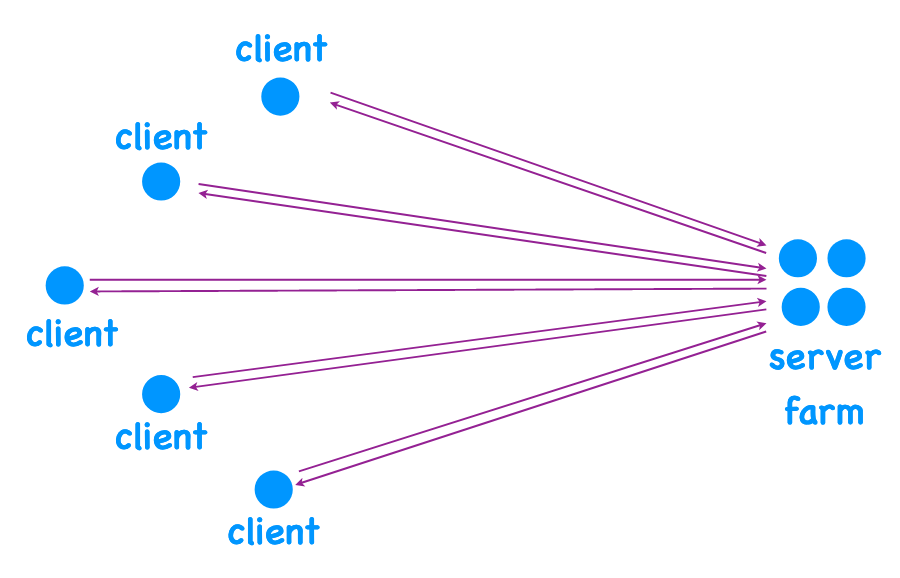

Another approach is the **peer-to-peer architecture** (P2P), where we have only peer processes. A peer is a process that may both generate and answer requests

- A peer may act as both server and client
- Runs on personally owned end-systems, e.g. PC, smartphone, ... (no dedicated infrastructures)

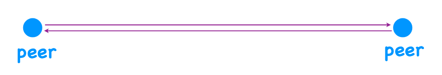

**Which one to choose ?**

Short answer : It depends

Web server is always there, peer-to-peer is a bit less predictable. Peer-to-peer scales better...

What about **security**?

- In principle, when using ptp, many people are collaborating : if something is not what it is expected (e.g. when you try to dl the latest star wars movie), they will “flag” it as dangerous

- With client-server, it is generally safer if you trust the company providing it

#### 1.1.2 Design the communication protocol

The second question in designing an application is the **communication protocol** (what sequences of messages the client, server, or peer processes may exchange

> This is not covered by the course

#### 1.1.3 Choose the transport service

The last question is the **transport service** (when a process delivers a message to the transport layer (in other words, calls the “send” function), what could it expect?). Here are a few options:

- **Reliable data delivery** (can never be 100%, but for example for mails, we get a message if the mail didn’t reach its destination)
- **Reliable performance** (e.g. minimum throughput or maximum end-to-end packet delay)
- **Reliable security**
  - Confidentiality : the message is only revealed to the destination
  - Authenticity : the message indeed comes from the claimed source
  - Data integrity : the message wasn't changed along the way

- `TCP` offers reliable data delivery
  - `TCP`  will keep retransmitting the packet until it has done its best to get it to the destination
  - `TCP` running on destination keeps a record with information about the source, while the `TCP` code running at the process keeps a record with information about the destination. This is why we say that `TCP` is a **connection-oriented** or **stateful** protocol, because the `TCP` code keeps track of things at the other end
  - Idea : "connection-oriented" $\approx$ "remembers something about you"
- `UDP` offers only detection of packet corruption
  - In contrast to `TCP`, `UDP` is a **connection-less** or **stateless** protocol
- No widely deployed protocol offers reliable performance

There is no official transport-layer technology that provides security guarantees. However, because many applications do need that kind of service, they ended up implementing it themselves. For example, an application can itself encrypt a message before passing it down, as opposed to expecting the transport layer to do it. And because many applications used similar security-related functions, like encryption, a sub-layer emerged within the application layer, which is called the **Secure Sockets Layer** (SSL). (SSL is a library providing functions like : `hash`, `encrypt`, `decrypt`, `authenticate`, …)

### 1.2	Examples

#### 1.2.1 Example : The Web

- Design the **architecture** : clearly client-server (client : web browser)

- Design the **communication protocol** : `HTTP` (client sends `HTTP` requests, server answers with `HTTP `responses)

  - `HTTP` requests (e.g. `GET`, `POST`, ... (`HEAD`, `PUT`, `DELETE`))
  - `HTTP` responses (e.g. `OK`, ... (`Not found`, `Moved permanently`,  `Bad request`, ...))
  - Most common exchange :
    - Web client requests the base file of a web page (`HTTP GET request`)
    - Web server sends it (`HTTP GET Response`)
    - Web client reads the base file, identifies all the objects that it needs to show the page and requests each of these objects one by one (`HTTP GET request`)
  - `HTTP` **was** designed to be a connectionless protocol. Now **cookies** exist (stores information on web browser (eventually on web server)). The next time a page is loaded, the web browser can send a cookie containing information (e.g. Name of user) to the web server which will use it (e.g. display a welcome message with your name)

- Choose the **transport service** : `TCP` is used for the web

  > see slide 42 of lecture 3 for more details

  - The client-side `TCP` establishes a connection with the server-side `TCP`
  - The client-side `TCP` encapsulates the `HTTP GET request` and sends it over the Internet. The server-side `TCP` decapsulates the `HTTP GET request` and passes it up to the web server
  - The web server forms an `HTTP GET response` and passes it down to the server-side `TCP`. The server-side `TCP` encapsulates the `HTTP GET response` and sends it over the Internet
  - The client-side `TCP` receives the response, decapsulates it, and passes it up to the web client

  

  - it takes **1 RTT** (round-trip time) for `TCP` to establish the connection

#### 1.2.2 Example : DNS

**Recap :**

- An **interface** is the point where two entities meet and interact
- An **application programming interface** (API) is a particular type of interface : the one between the application and transport layers. It consists of a set of functions
- A **network interface** is a particular type of interface : the one between an end-system and the network
- A **DNS name** identifies a particular network interface
- A **URL** identifies a web project (consists of two parts : a DNS name and a file name)
- A **process address** identifies a process (consists of two parts : an IP address and a port number)

- Web requests revisited
  - Enter a URL into web client (`http://www.epfl.ch/index.html`)
  - Web client extracts DNS name (`www.epfl.ch`)
  - Translates DNS name to IP address (`104.20.228.42`)
  - Forms web-server process address (`104.20.228.42, 80`)

We will now focus on **how to translate a DNS name into an IP address** (point 3)

- Design the **architecture** : client-server

  - Suppose we have a web browser that wants to contact the epfl web server. The end-system that runs the web-browser process also runs a **DNS client process**. So, the web browser talks to the DNS client, and says “I need the IP address of www.epfl.ch."The DNS client sends this request to another process, running on a different end-system, that is called a **DNS server**. The DNS server responds to the DNS client with the requested IP address, the DNS client forwards the response to the web browser, and, at that point, the web browser, can form the process address of the epfl web server

  - Inside a DNS server, we would find a database mapping a lot of DNS names to IP addresses

  - DNS servers are organised in a *hierarchy* (**root servers**, **TLD** (top-level domain) **servers**, **authorative servers**) :

    - A TLD is a name that constitutes the last part of a DNS name (e.g. `.com`, `.ch`, ...)
    - A lower-level domain is a name that consitutes the last two parts of a DNS name (e.g. `yahoo.com`, `epfl.ch`, ...)

  - Each node in the hierarchy only knows how to reach its children

    - A root server knows how to reach TLD servers for all TLDs
    - A `.ch` TLD server knows how to reach authoritative servers for all the `.ch` domains
    - An `epfl.ch` authoritative server knows all the mappings for all the DNS names that belong to EPFL

  - Each DNS client knows the IP address of at least one “local” DNS server (a DNS server that is physically close to the DNS client)

  - Procedure : When the DNS client wants to resolve a DNS name, it asks a local DNS server :

    - The local DNS server may not know the IP address of www.epfl.ch, but it certainly knows the IP address of a root server
    - The root server may not know the IP address of www.epfl.ch, but it certainly knows the IP address of a `.ch` TLD server
    - The `.ch` TLD server also may not know the IP address of www.epfl.ch, but it certainly knows the IP address of an `epfl.ch` authoritative server
    - The `epfl.ch` authoritative server certainly knows the IP address for www.epfl.ch, because that is its job

  - Getting the answer : (recursive or iterative request)

    

      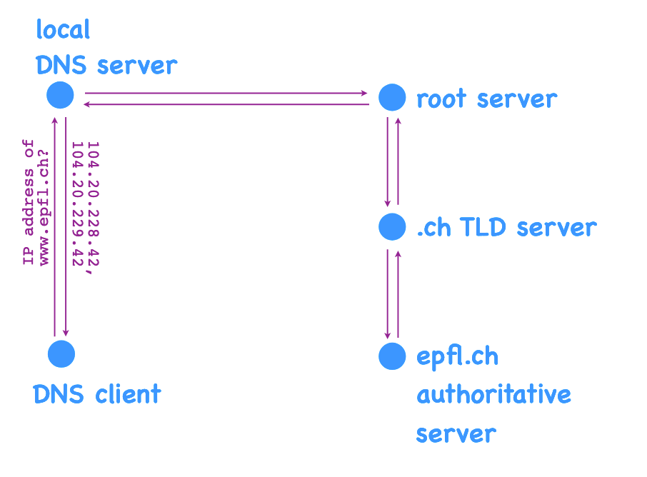
      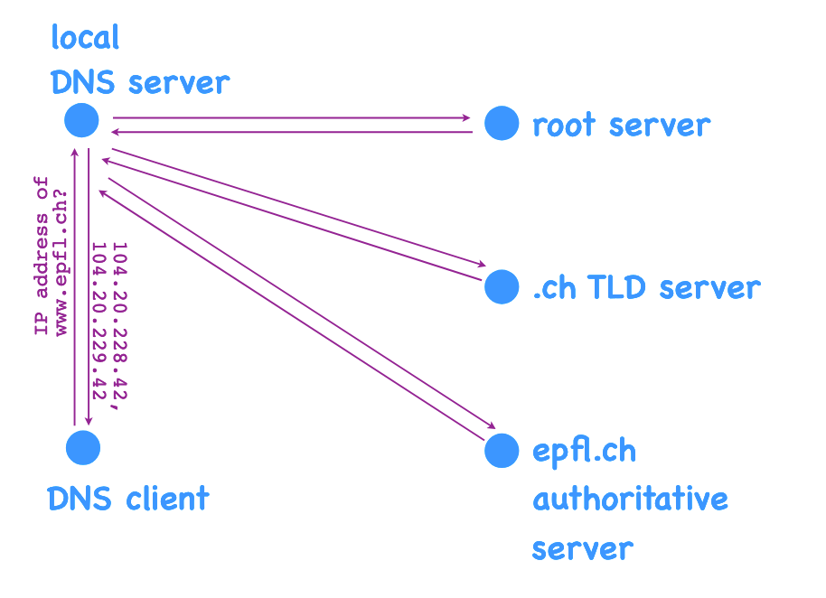
    

    
  - DNS caching : the fact that (local, root or TLD) DNS servers keep frequently requested addresses is called **DNS caching**. It reduces delay and load on all levels. DNS caching relies on **expiration dates** to make sure the addresses they give aren't out of date. *Mapping cannot change until expiration date*

    - Expiration date on mapping (if a root server knows the address of e.g. www.epfl.ch, it knows the address is still valid because the expiration data isn't over)
    - Caching : how to prevent **stale data** (not up to date) :
      - dynamic check for staleness (conditional `GET requests` for web caches, we ask if we need to update what we have cached)
      - limit data update rate (expiration date for DNS, it wouldn't make sens to use dynamic check : requests are too small for it to be useful)

- Design the **communication protocol** : DNS protocol elements :

  > see lecture 4, slides 32-33

- Choose the **transport service** : `UDP` (`TCP` does not make any sense, the cost of the connection is too much for such a small amount of information)

**How can one attack the DNS system ?**

- **Impersonation** : Persa impersonates the local DNS server, she answers the request from the DNS client with another address. The real DNS server also responds but if Persa's answer arrives faster at the DNS client, the DNS client accepts it as correct and discards the responds of the local DNS server
- **Denial-of-service** : Denis sends a lot of useless traffic to root and TLD servers. If Denis manages to overload these servers, then the entire Internet suffers, as DNS clients cannot resolve DNS names (modulo the mappings they and the local DNS servers have already cached)
- **Cache trashing** : Trish sends many DNS requests to the local DNS server for unpopular DNS names. As a result, she causes the cache of the local DNS server to fill up with the corresponding mappings, potentially evicting the useful mappings that most of the DNS server’s clients care for

#### 1.2.3 Example : BitTorrent

- Design the **architecture** : Peer-to-peer (P2P)

  > see lecture 4, slides 47-48 for animation

  

  > We say that peer-to-peer **scales better** than client-server, what does it mean?

  Let's imagine that Alice ($A$) has a file (let’s say a movie) she wants to share with her 3 friends ($B$, $C$, $D$)

  - **CS** : Alice would have to create 3 copies of the file and distribute them among her 3 friends
    $$
    D_{CS} \ge max \{ \frac{3F}{u_A}, \frac{F}{d_{min}} \}
    $$

  - **P2P** : Alice cuts the file into chunks and sends one chunk to each friend, then all the friends exchange chunks in rounds until everyone has all the chunks
    $$
    D_{P2P} \ge max \{ \frac{F}{u_A}, \frac{F}{d_{min}}, \frac{3F}{u_A+u_B+u_C+u_D}\}
    $$

  with $u_A$ Alice's upload rate, $d_{min}$ the lowest download rate of her 3 friends

  If we replace "3" friends by $N$ friends, we are left with the dominant terms only (as $N$ grows)

  - **CS** :
    $$
    D_{CS} \ge \color{lightgrey}{max \{} \frac{NF}{u_A} \color{lightgrey}{, \frac{F}{d_{min}}\} }
    $$

  - **P2P** : 
    $$
    D_{P2P} \ge \color{lightgrey}{max \{ \frac{F}{u_A}, \frac{F}{d_{min}},} \frac{NF}{u_A+ \sum_{i=1}^N u_i} \color{lightgrey}{\}}
    $$
    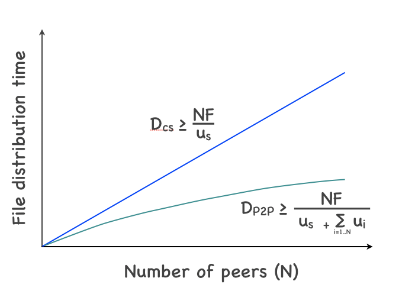
    
    This graph shows why P2P "scales better" than CS
    
    > NOTE : $D_{P2P}$ still *INCREASES*, the time it takes doesn't diminish but *grows slower* (CS is linear and P2P is sub-linear)

- Design the **communication protocol**

  > This is not covered by the course

- Choose the **transport service**

  > This is not covered by the course

## 2.	Transport layer (lecture 5 && 7)

First a process creates a message, then the transport layer adds a transport-layer header, and then the network layer adds a network-layer header. Of the various header fields that the transport and network layer add, we will focus on the source and destination IP addresses and the source and destination port numbers. These fields together specify a packet’s source and destination end-systems and processes.

Let’s also introduce two new terms:

- A **segment** is a packet whose outermost header is a transport-layer header (app-layer message + TL header)
- A **datagram** is a packet whose outermost header is a network-layer header (app-layer message + TL header + NL header)

**Process-to-process communication**

- At the sender side, we have **multiplexing**: upon receiving a message from a process, the transport layer creates new packets (segments) and identifies the correct IP addresses and ports for them
- At the receiver side, we have **demultiplexing**: upon receiving a packet (segment) from the network layer, the transport layer identifies the correct destination process

### 2.1	UDP vs TCP

#### 2.1.1 UDP

Characteristics of **UDP sockets**:

- Each `UDP` socket has a unique (IP address, port number) tuple representing the source (passed by the application layer)
- A process may use the same `UDP` socket to communicate with many remote processes

Suppose a process S wants to use `UDP` as its transport-layer protocol to send a message to another process:

- First, the process asks the transport layer to open a  `UDP` socket. In response, the transport layer creates a  `UDP` socket and associates it with this process
- Second, the process asks the transport layer to bind the socket to a particular IP address and port number. In response, the transport layer adds this information to the socket
- At this point, the process is ready to send a message through this socket: it provides the message, the destination IP address, and the destination port number. In response, the transport layer creates a packet (a segment) to send over the Internet…
- If the process does not need the socket any more, it asks the transport layer to close it. In response, the transport layer deletes the socket

Now consider the receiving end : a process R wants to use `UDP` to receive a message from another process:

- First, the process asks the transport layer to open a `UDP` socket. In response, the transport layer creates a `UDP` socket and associates it with this process
- Second, the process asks the transport layer to bind the socket to a particular IP address and port number. In response, the transport layer adds this information to the socket
- At this point, the process is ready to receive a message through this socket: it provides the number of bytes that it wants to receive.
- If a packet arrives from the network layer, the transport layer reads the destination IP address and port number, uses them to identify the destination process, and passes the requested number of bytes from the message to the destination process
- If the process does not need the socket any more, it asks the transport layer to close it. In response, the transport layer deletes the socket

---

#### 2.1.2 TCP

Characteristics of **TCP sockets** :

- Listening & connection sockets are different sockets!
- Each connection socket has a unique (local IP, local port, remote IP, remote port) tuple (of size 4)
- A process *must* use a different TCP connection socket per remote process

Suppose a process S wants to use `TCP` as its transport-layer protocol to send a message to another process:

- //TODO 5_Transport-layer : slide 9

Now consider the receiving end : a process R wants to use `TCP` to receive a message from another process:

- //TODO 5_Transport-layer : slide 10-11

### 2.2	Reliable data transfer
> See 2.3

- **Checksum** ($C$) is a redundant information (e.g., the binary sum of all data bytes) which is added by the sender to each segment. It is used by the receiver to **detect data corruption** (the receiver computes $C'$, if $C' \ne C$, then the segment was corrupted)

- **Acknowledgment** (`ACK` (positive) or `NACK` (negative)) is a **feedback** from the receiver to the sender. The receiver adds `ACK` to each segment and it is used by the sender to **detect and overcome data corruption** (if the sender gets `NACK`, it will retransmit the data)

- **Sequence number** (`SEQ n`, n $\in \N$) is an **identifier** for data that the sender adds to each segment. The receiver uses it to **disambiguate data**. For example, the sender sends data with `SEQ 0`, the receiver then answers with either `ACK 0` if no problems were encountered or `NACK 0` otherwise. If the acknowledgment itself was corrupted, the question of what should the sender do becomes harder (it doesn't know if it was corrupted or not since the answer is unreadable)

- **Timeout** is the no arrival of an expected `ACK` which can be due to a segment lost or delayed or the `ACK` for a segment lost or delayed. It is used by the sender to **overcome data loss** : if the sender times out, it retransmits

This method of transfering information works, but it is very time inefficient as seen below (e.g., for a packet of size $L = 1000$ [bytes] over a link of transmission rate $R = 1$ [Gbps], the transmisison delay $= L/R = 8$ [$\mu$s] and the propagation delay is 15 [ms]. This means that transmission is 0.008 [ms] while RTT is 30 [ms]... $\implies$ busy for $\frac{d_{trans}}{d_{trans}+ RTT} =$ 0.00027%) :

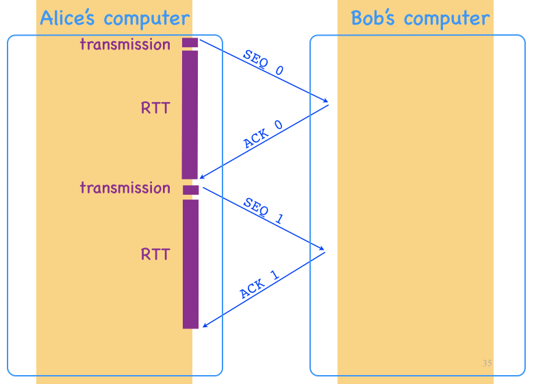

The method we have just seen is called **stop-and-wait**, this is a poor sender utilisation, a better way would be the **pipelining** method : the sender sends up to $N$ un-`ACK`ed segments where $N$ is the (sliding) **window size**. As before, as soon as the receiver receives `SEQ n`, it sends the answer `ACK n`. As soon as the sender receives the answer `ACK n`, it advances its window by one (allowing the next packet be sent) and sends the next packet (`SEQ n+1`). This time, Alice's computer is busy for $\frac{N \cdot d_{trans}}{d_{trans}+ RTT}$ instead of $\frac{d_{trans}}{d_{trans}+ RTT}$. Multiple methods of pipelining exist :

- **Go-back-N** :
  - the receiver accepts no out-of-order segments
  - `ACK`s are **cumulative**, meaning that `ACK 10` tells that all segments until and included 10 have been correctly received
  - when the sender retransmits, it retransmits all un-`ACK`ed segments (if the sender times out for `SEQ 2` with a window of size 4, it will retransmit sequences 2 to 5)
- **Selective repeat** :
  - the receiver accepts $N-1$ out-of-order segments
  - `ACK`s are **selective**, meaning that `ACK 10` tells that segment 10 has been correctly received
  - when the sender retransmits, it retransmits only *one* segment

> Note : we receiver only answers with `ACK n`, not `NACK`s are used!

### 2.3	RDD in-depth

We discussed how the family of Go-back-N and Selective Repeat protocols do RDD, but not how `UDP` or `TCP` does it

#### 2.3.1	UDP

`UDP` provides one RDD service: detection of corruption. For that, it uses **checksums**: the sender includes in every segment a checksum (as part of the UDP header), and the receiver uses the checksum to ensure that — with a high probability — the segment was not corrupted

#### 2.3.2	TCP

TCP uses all the RDD elements already discussed : checksums, `ACK`s, `SEQ`s, timeouts and retransmissions

##### SEQs and ACKS

 The process runing on Alice's computer sends one data byte (the character “A”) to Bob's process. She creates a segment carrying the data byte with `SEQ 0`. Bob receives it, extracts the data byte and delivers it the the process. He answers by creating a segments acknowledging the reception which has `ACK 1` and one data byte ("B"). Alice receives the segment

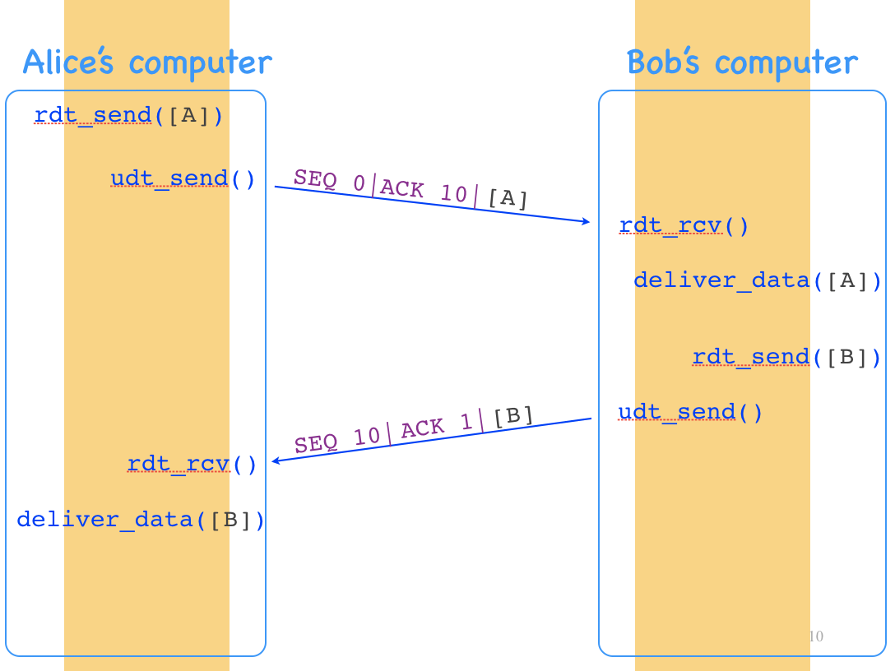

- Bob’s `ACK` number does not signal what he received, but what he is expecting: he received data byte 0, and he is expecting data byte 1, this is why he is sending `ACK 1` $\implies$ TCP uses **cumulative ACKs**, each one signalling the next data byte expected by the receiver

- All TCP segments carry a `SEQ` and an `ACK`. Even if it does not seem necessary. E.g., the segment from Alice to Bob carries `ACK 10` (10 arbitrary), even if Alice does not have new feedback to send to Bob

> - `SEQ`: # of the first data byte
> - `ACK`: # of the next data byte the receiver is expecting
> - Both **always** present

  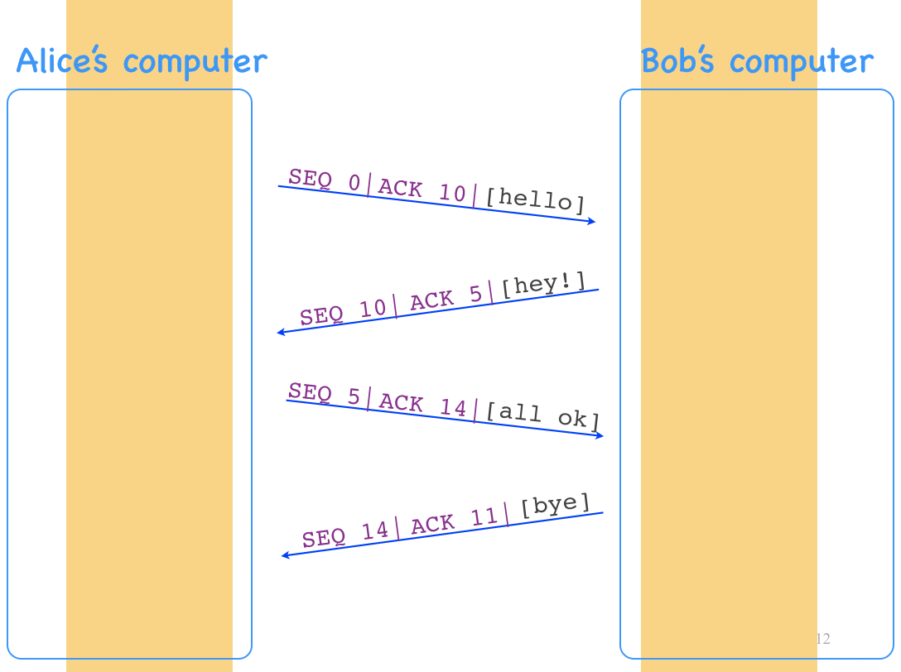
  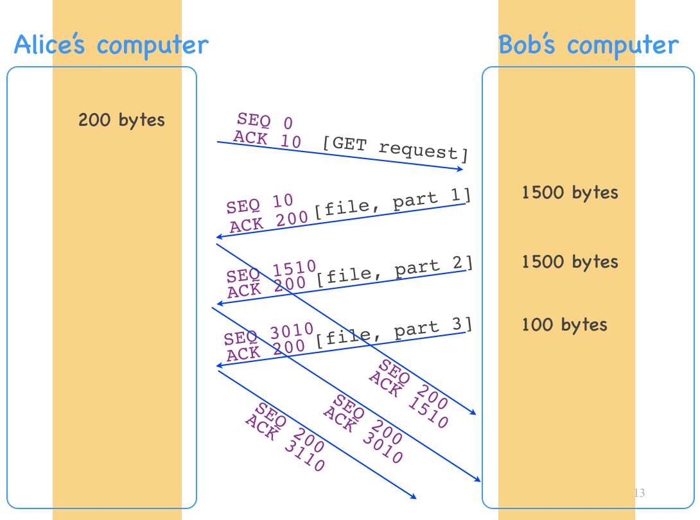

---

##### Timeouts and retransmissions

When `TCP` times out, it retransmits **one** segment, which is the one with the oldest unacknowledged `SEQ`

> **Q** : How long should the timeout be?
>
> **A** : A bit longer than the round-trip time (RTT) from the sender to the receiver and back

**Fast retransmit** : Alice sends 5 segments, and the 2nd one is lost. As a result, Bob sends 3 duplicate `ACK`s (`ACK 1`). When Alice receives these answers, she guesses that the 2nd segments was lost, hence she does not need to wait for a timeout, she can immediatly retransmit $\implies$ this is called fast retransmission

In total, we have seen two retransmission triggers :

- timeouts $\implies$ retransmisson of oldest unacknowledged segment
- 3 duplicate `ACK`s ($=$ 4 times the same `ACK` in total) $\implies$ fast retransmit of oldest unacknowldged segment

> **Note**: `TCP` is a mix between GBN and SR (cumulative `ACK`s but retransmits one segment on timeout)

---

##### Connection setup and teardown 

Alice’s process creates a connection socket and sends a connection setup request to Bob (special segment carrying `SYN` flag with a `SEQ` and `ACK` even though it's irrelevant).

If Bob's process accepts the request, it creates a connection socket for communicating with Alice’s process and sends a special segment that also carries the `SYN` flag. It also carries a `SEQ` (that has nothing to do with Alice’s `SEQ`) and an `ACK` (which is Alice’s `SEQ + 1`, i.e., it acknowledges that Bob received the connection setup request and is not expecting the first data byte).

When Alice receives Bob’s response, she allocates a send and a receive buffer for this particular `TCP` connection. Then she sends another segment that may carry data.

When Bob receive’s Alice’s 2nd segment, he also allocates a send and a receive buffer for this particular `TCP` connection. Only at this point we can say that Alice and Bob have established a `TCP` connection.

When Alice doesn't need to send data anymore, she sends a special segment to Bob that carries the `FIN` flag. When Bob receives it, he acknowledges it like any other segment. When Bob’s process does not need to send any more data to Alice’s process, Bob also sends a special segment to Alice that carries the `FIN` flag. When Alice receives it, she acknowledges it like any other segment. At this point, we say that Alice and Bob have closed their `TCP` connection.

  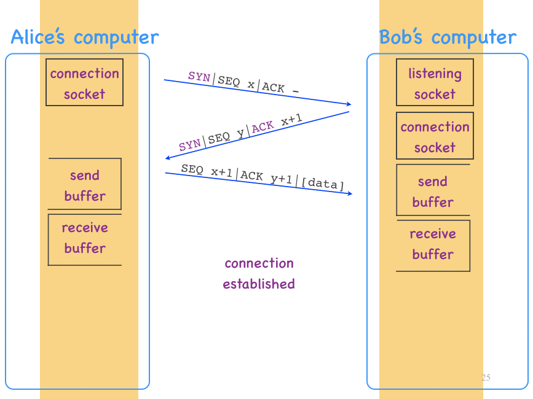
  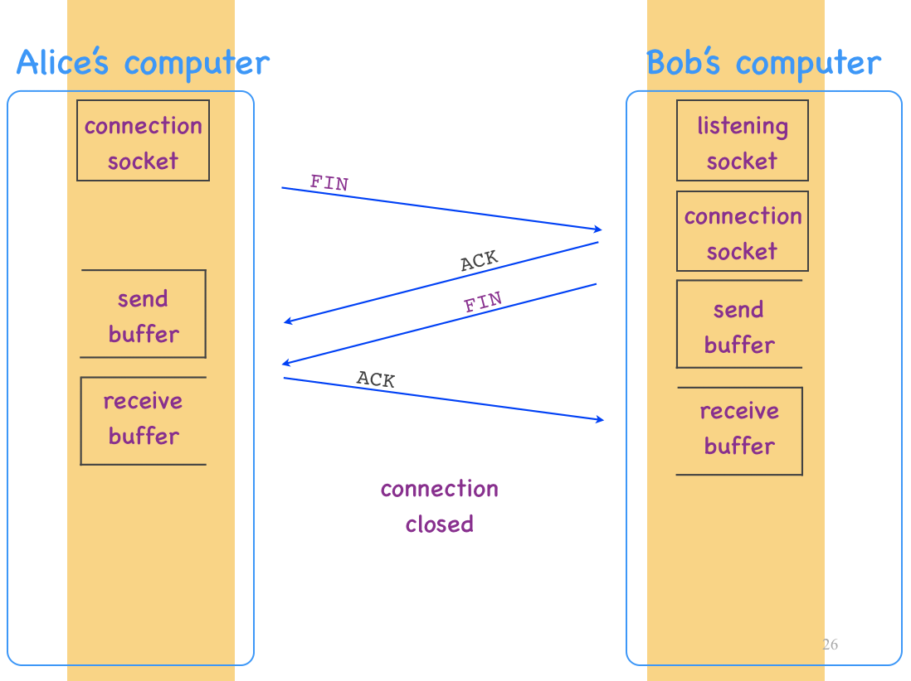

---

##### Connection hijacking

Consider the scenario where Alice’s web client and Bob’s web server have established a `TCP` connection. Alice sends an `HTTP GET` request. An attacker, Jack, decides to send a file to Alice impersonate Bob by answering Alice with a wrong file. If Jack's answer arrives before Bob's, then Bob's answer will be marked as duplicate and be dropped by Alice. 

The reason this can happen comes from the fact that `TCP` headers are predicatable $\implies$ easy to fake (if Jack knows the size of Alice’s `HTTP GET` request, he can guess what the `ACK` number on Bob’s 2nd segment will be. If Jack can also guess Bob’s initial sequence number, then he can reconstruct exactly the `TCP` headers of Bob’s 2nd segment).

To counter this, the initial sequence number is unpredictable (both Alice and Bob choose some random sequence number that would be hard for Jack to guess).

> Note : Jack is a hijacker, he is not in the path between Alice and Bob (he cannot intercept their communication)

---

##### Connection setup (`SYN`) flooding

Any end-system that uses `TCP` maintains a piece of memory — a buffer — for storing information on incomplete connections. 

An attacker can send a lot of `SYN` segments (without ever completing any connection), thereby causing Bob’s incomplete-connection buffer to overflow. If that happens, then Bob must drop any new connection setup request $\implies$ cannot accept any new `TCP` connections.

One way to prevent this attack is to remove the incomplete-connection buffer from the picture. Instead, Bob embeds in his initial sequence number enough information that, when Alice sends her 2nd segment, Bob can determine whether he previously agreed to this connection, just by looking at the `ACK` number on Alice’s 2nd segment:

- Bob keeps a secret known only to him. 
- He sets his initial sequence number `y` to `hash(secret, Alice’s IP)`.
- When Bob receives Alice’s 2nd segment, he reads the `ACK number (y+1)`, subtracts 1, and checks whether it is equal to `hash(secret, Alice’s IP)`.

Of course, Denis can still send a lot of `SYN` segments to Bob. However Bob does not rely on the incomplete-connection buffer, Denis cannot prevent Bob from accepting new `TCP` connections (at least by overflowing his buffer)

---

##### Flow control

The goal of flow control is to protect a receiver from being overwhelmed by a sender. To achieve it, the receiver communicates to the sender up to how many bytes the sender can send to it. This number is equal to the free space in the receiver’s receive buffer. This information is stored in a `TCP` header field called “receiver window” (e.g. `rx-win 100` means that the receiver can accept 100 bytes). 

It is possible that the receiver window “closes”, which means that the receiver tells the sender that it cannot send any more bytes (for the moment). If this happens, the sender needs to periodically probe the receiver, i.e., send a segment that carries no data or new `ACK`, just to elicit another segment in response, such that the receiver can communicate the new receiver-window value.

---

##### Congestion control

**Goal** : Not overwhelm the network

> **Goal** : Not overwhelm the network
>
> if not done :
>
> - long queuing delays
> - ressource waste

We have Alice and Bob that are connected through a network of packet switches with a bottleneck link of transmission rate $R$ (Alice's maximum throughput to Bob is $R$).

If we add a second source/destination pair to the picture (*image on the left*) and if both sources send at the same rate, and if the network is fair, then Alice’s throughput will be at most $R/2$. Suppose that both sources send packets at maximum rate $R/2$ ($\implies$ traffic arrives at the bottleneck queue at rate $R$). If that happens, we have long queuing delays.

Now consider the scenario where Alice’s transport layer has sent 3 packets to Bob which are all waiting inside the bottleneck queue for transmission (*image on the right*). If Alice’s transport sends a 4th packet, there is no room left in the queue, and the packet is dropped.

At some point, Alice’s transport layer times out waiting for an `ACK` for this packet, and she retransmits; and this time the packet gets through. So, Alice’s transport layer had to transmit packet #4 twice for it to get through ($\implies$ if Alice transmits at rate $R/2$, then part of the rate is spent on retransmissions and he effective throughput $\lt R/2$. **Effective throughput**. is the rate at which she gets unique data across excluding retransmissions).

  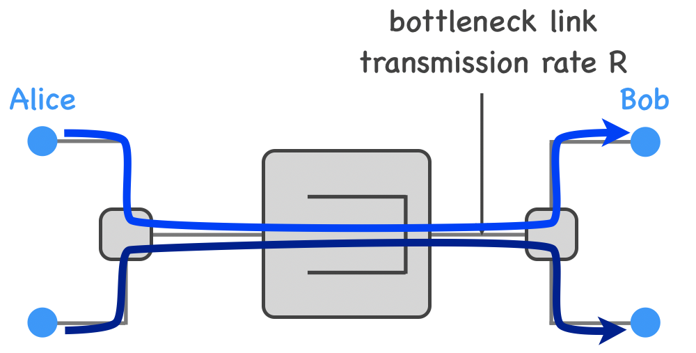
  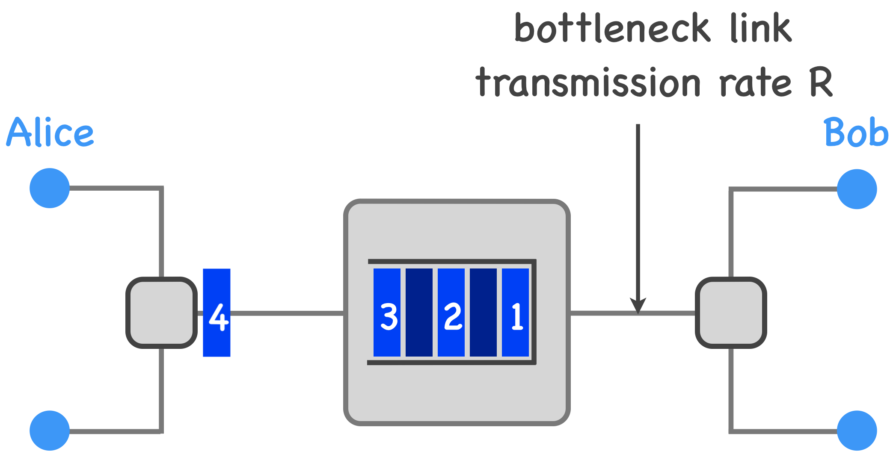

Moreover, long delays lead to unnecessary retransmissions. Suppose Alice’s transport layer times out on packet 4, and she retransmits... but packet 4 was just being delayed inside the bottleneck queue...

**How to prevent it ? $\implies$ "congestion window"**

> NOT FINISHED => done until l.7, slide 48

## 3.	Network layer (lectures 8 - 9 - 10)

3 basic functions of NL : (first relies on FT while 2 others populate them)

- Forwarding : local on a router, determines on which link to send a packet with a certain header value following a forwarding table (entries entered manually or by routing algorithms)

- Routing : algorithms (centralized (network controller) or on each router (more popular)) that populate the forwarding tables

- Connection setup : path-wide process that populates forwarding tables with special connection-setup traffic

Virtual-circuit networks : created by routers if a "connection-setup request" is accepted. They store the in-link, out-link, VC-in, VC-out and forward the request to next router eventually reaching destination. Destination sends back a "connection-setup ACK" packet that goes in reverse order, with this, all the routers can fill the VC-out field (= VC-in of next link from source to dest). When source receives the ACK, the connection is established. To send info, each packet has a `VC #` which is set to the VC-in of the next router. Each router updates the `VC #` to their VC-out (corresponding to the next router VC-in)

- Good : performance guaranteed (connection-setup request asks for $X$ Mbps throughput)
- Bad : vulnerable to attacks, need to maintain a lot of state (enormous database)

### 3.1	Datagram networks & IP forwarding

NL does not provide reliability but **best-effort delivery**

E.g. : Internet (mostly a datagram network)

- Datagram network :
  - Uses IP addresses instead of `VC #`. Each router knows how on which link to send a packet based on its IP. Fortunately, a router doesnt need to know every single path to every IP in the world. Routers maintain a map from a **range** (can be represented by a sequence of 0s and 1s (binary) followed by a sequence of stars called IP prefixes (***RIGHT??? not sure***)) of IP to output link number (opposed to 1 IP to 1 output link). Each range can also have "special cases", aka IP not in the range, but still with the same output link. If an IP could fit into 2 ranges, then the choice is made based on the "longest prefix matching" principle
  - Makes FT smaller and routers simpler
  - The more "exceptions" in ranges, the larger the FT. This is why it is important that IP addresses that belong to the same range correspond to end-systems that are mostly located in the enarby geographical areas. Address proximity implies location proximity (typically)

###3.2	IP addresses format

Recall : an IP prefix is a range of IP addresses

`11011111 00000001 000000001 00000000` is denoted `223.1.1.0 / 24` for `11011111 00000001 00000001 ********` or equivalently `223.1.1.*`. 24 is the **mask**

`223.1.1.74 / 24`===`223.1.1.0 / 24`===`223.1.1.113 / 24`===`223.1.1.*`. They all represent the same IP prefix

Another example : `223.1.1.0 / 8` is the same as `223.*.*.*`

Another exmaple : `223.1.1.0 / 8` is the same as `11011111 0000**** ******** ********` which is from `223.0.0.0` to `223.15.255.255`

The internet is orgranised in **IP subnets**, it has router at its border with other IP subnets. Each IP subnet is assigned an IP prefix. All end systems in the IP subnet have the same IP prefix (the one from the subnet)

If a router receives a packet with IP destination that belongs to its subnet, it forwards the packet in its subnet. Otherwise it forwards the packet to the corresponding subnet

Each subnet is characterised by a maximum transfer unit (MTU) which is the max packet size that the subnet supports. If packet size is larger, the router located at the edge of a subnet receiving the packet must fragment the packet into smaller cuts (header is copied on each smaller packet). Routers do not reassemble packets, the destination end-system does it

How to avoid running out of IP addresses :

- new version : IPv6
- NAT (network address translation) performed by routers (called NAT gateways) at the edge of subnets (they translate IP addresses and TCP ports)

###3.3	IP routing

IP routing : does thanks to IP routing protocols

Each link has a cost (based on propagation delay, money cost or traffic). The cost of a path is the sum of all its links. The best path from source router to destination router is the path with the minimum cost

Least-cost path routing : e.g., using Dijkstra's algorithm (centralised : all routers exchange information about their links and neighbors). Generally each router runs its algorithm, however we could also imagine having a separate computer, the **network controller** to run the algorithm

Idea of algorithms we could use :

- Djikstra :

  - *inputs* : router graph & link costs
  - *output* : least-cost path from source $u$ to every other router

  

  - at each step, the algorithm considers a new router
  - It checks wheter it can improve the previously computer paths by routing through this new router
  - it ends when no improvement is possible

- Bellman-Ford (distance-vector routing protocol) : (table from : neighbors, to : all)

  - *inputs* : local link costs & neighbour messages
  - *outputs* : least-cost path to every other router

  

  - distributed algorithm : they all work together

  

  - all neighbors exchange information
  - each router checks wheter it can improve current paths by leveraging the new information
  - ends when no improvement possible

> CARE : with Bellman-Ford, we can get routing loops that can take very long to resolve. Solution, use a **poisoned reverse** which basically : if z routes to x through y, z advertises to y that its cost to x is infinite; y never decides to route to x through z $\implies$ the algorithm re-converges quickly

###3.4	Summary and precision

As we have seen :

- FT map IP prefixes to output link

- Routing provides a map destination **router** to next hop

How do we link them together? Each router announces the IP prefix it can route to. They give the IP prefix of their subnet

Example : The internet. This is a problem since there are millions of routers : a link-state routing algorithm like Djikstra would cause flooding coz every router must collect information from every other router in the network. A distance-vector algorithm like Bellman-Ford wouldn't converge fast enough. A last problem could be administrative, an ISP may want to least-cost path inside its own network.

The current internet architecture solves these through hierarchy : the Internet is divided in ASes, **autonomous systems**. Each AS runs its own routing algorithm among its local routers. Each AS may run any intra-AS routing algorithm it wants (e.g. Dijkstra, Bellman-Ford, ...). Intra-AS rounting is opposed to inter-AS routing (between ASes). There is only one inter-AS routing protocol on the internet : BGP. There are multiple intra-AS routing protocols on the internet

Quick important small points:

- Link-state vs distance-vector?
  - Link-state converge faster while distance-vector require fewer messages

- Each router on the internet speaks at least one inter-AS protocol and one intra-AS protocol
- NL over the internet involve both end-systems and routers

###3.5	Network Security

We will now discuss how network protocols can provide three basic security properties: **confidentiality** (only sender and receiver understand the content of the message), **authenticity** (the message is from who it claims to be), and **integrity** (message didn't change along the way)

####3.5.1 Building blocks

- **encryption** (**plaintext** $\rightarrow$ **ciphertext**), **decryption** (ciphertext $\rightarrow$ plaintext). Ciphertext should ideally not reveal information about the plaintext
  - **Symmetric-key cryptography** : Alice and Bob **share** a common secret key known only to them :
    - `key(plaintext) = ciphertext`
    - `key(key(plaintext)) = key(ciphertext) = plaintext`
    - Challenge : how to share the key?
  - **Asymmetric-key cryptography** : Alice and Bob use **different** keys : a public key (`key+`) and a private key `key-` :
    - `key+(plaintext) = ciphertext`
    - `key-(key+(plaintext)) = key-(ciphertext) = plaintext`
    - `key+(key-(plaintext)) = plaintext`
    - *disadvantage*: more computationally expensive than symmetric-key cryptography due to complex encryption / decryption algorithms
- **cryptographic has functions** : takes as input a message and produces a **hash** (a piece of data) that is **smaller** than the input and ideally reveals no information about the input :
  - Maps larger input space to smaller hash space
  - Should be hard to identify two inputs that lead to the same hash

####3.5.2 Providing security properties

- Confidentiality :
  - Symmetric-key cryptography : Eve cannot decrypt the message she might be listening to without the shared key
  - Asymmetric-key cryptography : Eve cannot decrypt the message she might be listening to without Bob's private key
- Authenticity :
  - Symmetric-key cryptography 
  - Asymmetric-key cryptography

