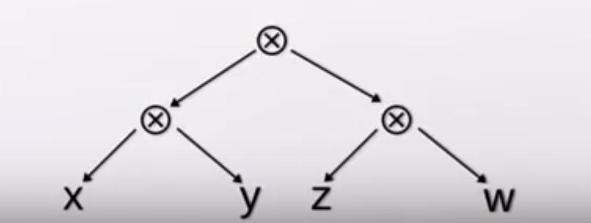
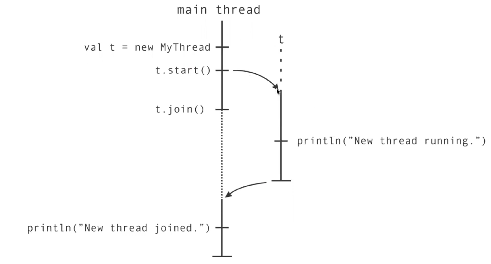
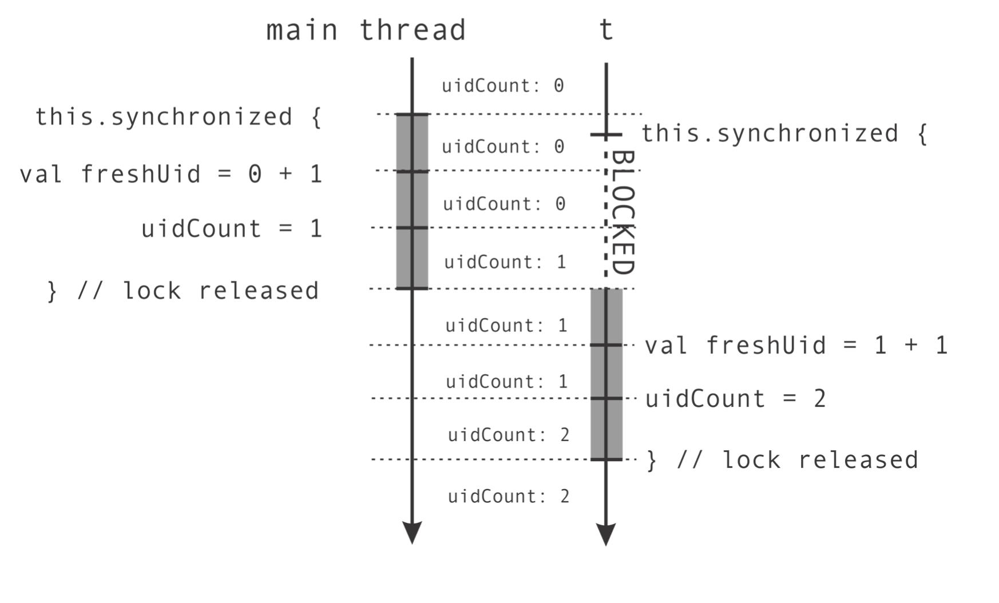
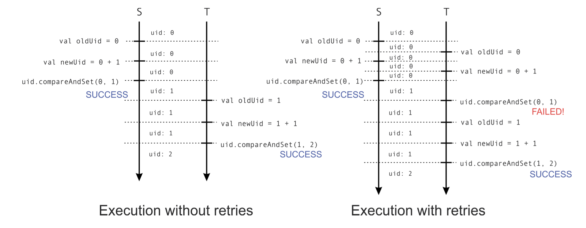
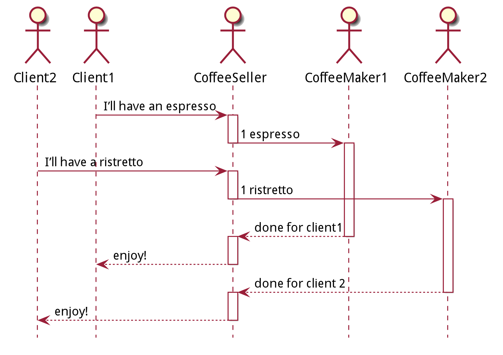
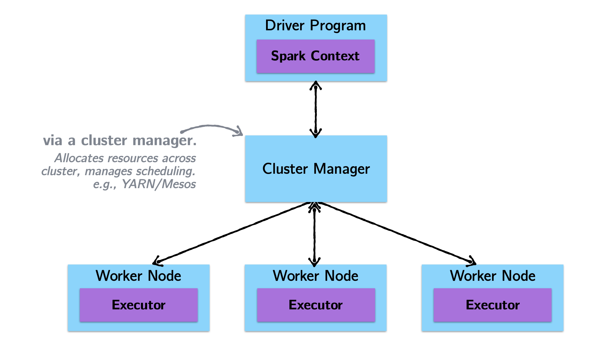
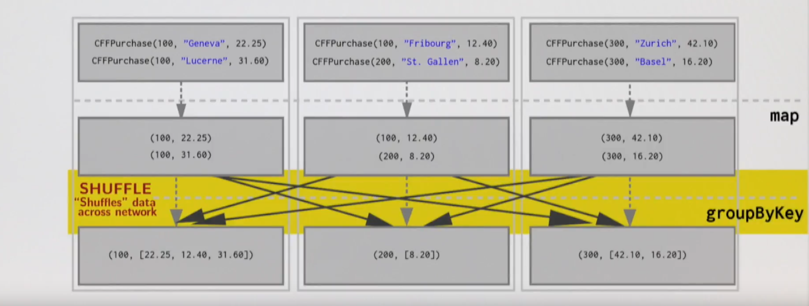
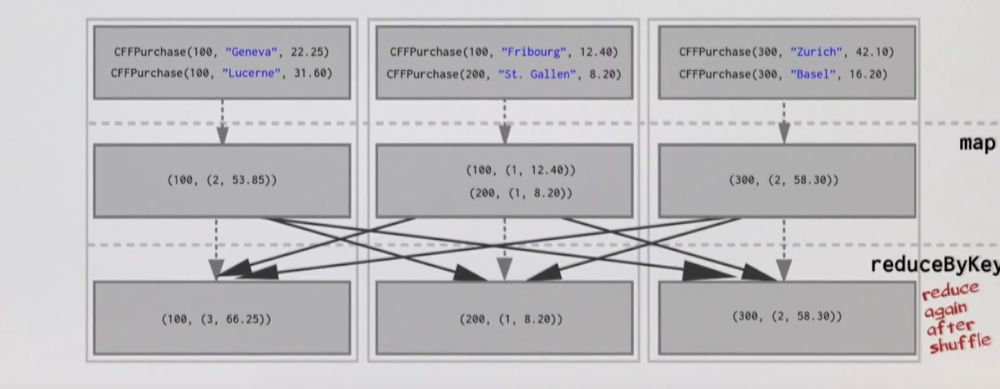
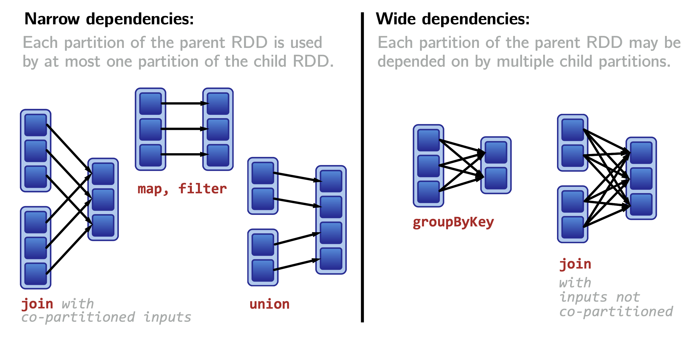
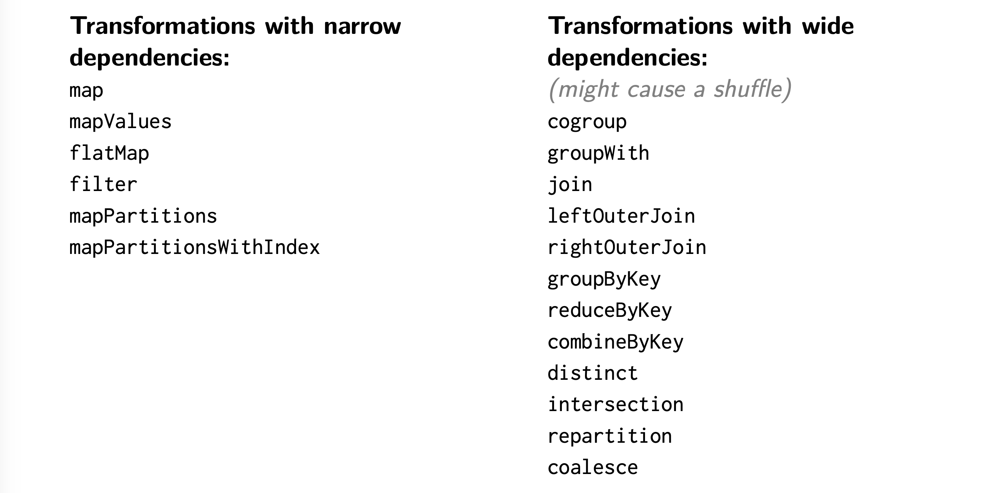

# [CS-206] Parallelism & Concurrency

[TOC]

## Lectures

### Parallelism I

- [Introduction to Parallel Computing](https://www.youtube.com/watch?v=94O72nyNFY0)
- [Parallelism on the JVM I](https://www.youtube.com/watch?v=I8w-q1TPtjA)
- [Parallelism on the JVM II](https://www.youtube.com/watch?v=BbVWGWTNAXw)
- [Running Computations in Parallel](https://www.youtube.com/watch?v=KkMZGJ3M2-o)
- [Monte Carlo Method to Estimate Pi](https://www.youtube.com/watch?v=VBCf-aTgpPU)
- [First-Class Tasks](https://www.youtube.com/watch?v=mrVVaXCuhBc)
- [How Fast are Parallel Programs?](https://www.youtube.com/watch?v=Lpnexp_Qxgo) (todo)
- [Benchmarking Parallel Programs](https://www.youtube.com/watch?v=LvS_kjCssfg) (todo)

### Parallelism II

- [Parallel Sorting](https://www.youtube.com/watch?v=AcuvVgQbphg)
- [Data Operations and Parallel Mapping](https://www.youtube.com/watch?v=ghYtMLrphZw)
- [Parallel Fold (Reduce) Operation](https://www.youtube.com/watch?v=hEBgyhIoWww)
- [Associativity I](https://www.youtube.com/watch?v=q-Cl3whISCY)
- [Associativity II](https://www.youtube.com/watch?v=XBjqYavDUB8)
- [Parallel Scan (Prefix Sum) Operation](https://www.youtube.com/watch?v=CYr3YaQiMwo)

### Parallelism III

- [Data-Parallel Programming](https://www.youtube.com/watch?v=WW7TabCiOV8)
- [Data-Parallel Operations I](https://www.youtube.com/watch?v=Vd35YQ8DEO4)
- [Data-Parallel Operations II](https://www.youtube.com/watch?v=dcMgKtuAh3s)
- [Scala Parallel Operations](https://www.youtube.com/watch?v=NjkxjAT7ohE)
- [Splitters and Combiners](https://www.youtube.com/watch?v=Redz85Nlle4)

### Parallelism IV

- [Implementing Combiners](https://www.youtube.com/watch?v=dTP0ntniB2I)
- [Parallel Two-phase Construction](https://www.youtube.com/watch?v=XcMtq3OdjQ0)
- [Conc-Tree Data Structure](https://www.youtube.com/watch?v=cUXHXKL8Xvs)
- [Amortized, Constant-Time Append Operation](https://www.youtube.com/watch?v=Ic5DUZLITVI)
- [Conc-Tree Combiners](https://www.youtube.com/watch?v=aLfFlCC1vjc)

### Concurrency I

- [Youtube link](https://www.youtube.com/watch?v=hwdtuzx2GvU&feature=emb_logo)

### Concurrency II

- [Youtube link](https://www.youtube.com/watch?v=jcdJU6a3ArE)

### Concurrency III

- [Youtube link](https://www.youtube.com/watch?v=XznYvMjA-7s)

### Actors I

- [Introduction: Why Actors](https://www.youtube.com/watch?v=ZQAe9AItH8o)
- [The Actor Model](https://www.youtube.com/watch?v=c49tDZuFtPA)

### Actors II

- [Message Processing Semantics](https://www.youtube.com/watch?v=Uxn1eg6R0Fc)
- [Designing Actor Systems](https://www.youtube.com/watch?v=uxeMJLo3h9k) (not watched)
- [Testing Actor Systems](https://www.youtube.com/watch?v=T_2nwLr-H2s) (not watched)

### Spark I

- [Introduction to Spark](https://www.youtube.com/watch?v=bfMbJ8NzTZI)
- [Latency : Spark vs Hadoop](https://www.youtube.com/watch?v=igNIz2Ent5E)
- [Basics of RDDs](https://www.youtube.com/watch?v=EuVmW62aIXI)
- [Transformations and actions](https://www.youtube.com/watch?v=qJlfATheS38)
- [Evaluations in Spark](https://www.youtube.com/watch?v=0pVYuuUrN74)
- [Spark cluster topology](https://www.youtube.com/watch?v=lS4vRzwrmtU)

### Spark II

- [Reduction operations](https://www.youtube.com/watch?v=JhF0_Ka_iqU)
- [Distributed Key-Value Pairs (Pair RDDs)](https://www.youtube.com/watch?v=kIUzgweDMUs)
- [Operations on Pair RDDs](https://www.youtube.com/watch?v=ovf0GFbnp5g)
- [Join on Pair RDDs](https://www.youtube.com/watch?v=kYpaZpj4qTM)

### Spark III

- [Shuffling](https://www.youtube.com/watch?v=LrgA4PrKrks)
- [Partitioning](https://www.youtube.com/watch?v=sTcki6mxjcA)
- [Optimizing with partitioners](https://www.youtube.com/watch?v=4Vfp5kp2jnE)
- [Wide vs narrow dependencies](https://www.youtube.com/watch?v=L9BnaYp10c8)


## Parallelism I : Introduction to Parallel Programming

### First example: `pNorm`

$$
||a||_p := 
\bigg(\sum_{i=0}^{N-1} \lfloor |a_i|^p \rfloor \bigg)^{1/p} = \space
\bigg(\sum_{i=0}^{m-1} \lfloor |a_i|^p \rfloor + \sum_{i=m}^{N-1} \lfloor |a_i|^p \rfloor\bigg)^{1/p}
$$


```scala
def sumSegment(a: Array[Int], p: Double, s: Int, t: Int): Int = {
  // returns the sum of the p-th power of each element between s and t-1
}

def pNorm(a: Array[Int], p: Double): Int = {
  power(sumSegment(a, p, 0, a.length), 1/p)
}

def pNormTwoParts(a: Array[Int], p: Double): Int = {
  val m = a.length / 2
  val (sum1, sum2) = (sumSegment(a, p, 0, m), sumSegment(a, p, m, a.length))
  power(sum1 + sum2, 1/p)
}
```

We can turn `pNormTwoParts` into a parallel variant of this function by adding the keyword `parallel`

```scala
def pNormTwoPartsParallel(a: Array[Int], p: Double): Int = {
  val m = a.length / 2
  val (sum1, sum2) = parallel(sumSegment(a, p, 0, m), sumSegment(a, p, m, a.length))
  power(sum1 + sum2, 1/p)
}

// We are not bound to executing in parallel with two array segments only
def pNormFourPartsParallel(a: Array[Int], p: Double): Int = {
  val m1 = a.length / 4; val m2 = a.length / 2, val m3 = 3 * a.length / 4
  val ((sum1, sum2), (sum3, sum4)) = parallel(
    parallel(sumSegment(a, p, 0, m1), sumSegment(a, p, m1, m2)), 
    parallel(sumSegment(a, p, m2, m3), sumSegment(a, p, m3, a.length))
  )
  
  power(sum1 + sum2 + sum3 + sum4, 1/p)
}
```

```scala
def parallel[A, B](taskA: => A, taskB: => B): (A, B) = { ... }
```


### Estimating $\pi$ using Monte-Carlos' method

Imagine a circle of radius $r=1$ inside a square of length $l = 2$, the ratio of the area of the circle and the one of the square is
$$
\lambda = \frac{\text{Area of the circle}}{\text{Area of the square}} = \frac{\pi}{4}
$$ {  }
An estimation of $\pi$ could then be $4 \times \lambda$

```scala
import scala.util.Random
def mcCount(iter: Int): Int = {
  val randomX = new Random
  val randomY = new Random
  var hits = 0
  for (i <- 0 until iter) {
    val x = randomX.nextDouble		// in [0, 1]
    val y = randomY.nextDouble
    if (x * x + y * y < 1) then hits += 1
  }
  hits
}

def monteCarloPiSeq(iter: Int): Double = 4.0 * mcCount(iter) / iter
```

```scala
def monteCarloPiParallel(iter: Int): Double = {
  val ((pi1, pi2), (pi3, pi4)) = parallel(
    parallel(mcCount(iter/4), mcCount(iter/4)), 
    parallel(mcCount(iter/4), mcCount(iter - 3 * (iter / 4)))	// if 4 doesnt divide iter
  )
  4.0 * (pi1 + pi2 + pi3 + pi4) / iter
}
```


### Parallelism using `task`

```scala
def task(c: => A): Task[A]

trait Task[A] {
  def join: A
}

implicit def getJoin[T](x: Task[T]): T = x.join
```

We can rewrite our `pNormFourPartsParallel` using `tasks` instead of `parallel`

```scala
def pNormFourPartsParallel(a: Array[Int], p: Double): Int = {
  val m1 = a.length / 4; val m2 = a.length / 2, val m3 = 3 * a.length / 4

  val t1 = task {sumSegment(a, p, 0, m1)}
  val t2 = task {sumSegment(a, p, m1, m2)}
  val t3 = task {sumSegment(a, p, m2, m3)}
  val t4 = task {sumSegment(a, p, m3, a.length)}
  
  power(t1.join + t2.join + t3.join + t4.join, 1/p)
}
```


## Parallelism II : Basic Task Parallel Algorithms

We will se how to transform `map`, `fold` and `reduce` from sequential to parallel

- `map` :

  ```scala
  List(1, 3, 8).map(x => x * x) == List(1, 9, 64)
  ```

- `fold` :

  ```scala
  List(1, 3, 8).fold(100)((s, x) => s + x) == 112
  ```

- `scan` :

  ```scala
  List(1, 3, 8).scanLeft(100)((s, x) => s + x) == List(100, 101, 104, 112)
  ```

  

### Merge Sort in parallel

```scala
def parallelMergeSort(xs: Array[Int], maxDepth: Int): Unit = {
  val ys = new Array[Int](xs.length)
  
  def sort(from: Int, until: Int, depth: Int): Unit = {
    if (depth == maxDepth) then quickSort(xs, from, until - from)	// base case
    else
    	val mid = (from + until) / 2
    	parallel(
      	sort(mid, until, depth + 1),
        sort(from, mid, depth + 1)
      )
    
    	// merge the two segments
    	val flip = (maxDepth - depth) % 2 == 0
    	val src = if flip then ys else xs
    	val dst = if flip then xs else ys
    	
    	merge(src, dst, from, mid, until)		// sequential, implementation not specified
  }
  
  sort(0, xs.length, 0)
}
```


### `map` on an array

```scala
def mapSegSeq[A, B](inp: Array[A], left: Int, right: Int, f: A => B, out: Array[B]) =
  // Writes to out(i) for left <= i < right
  var i = left
  while (i < right)
    out(i) = f(inp(i))
    i += 1


def mapSegSeq[A, B](inp: Array[A], left: Int, right: Int, f: A => B, out: Array[B]): Unit =
	// Wrties to out(i) for left <= i < right
	if (right - left < threshold) then mapSegSeq(inp, left, right, f, out)
	else
		val mid = left (right - left) / 2
		parallel(mapSeqPar(inp, left, mid, f, out), mapSeqPar(inp, mid, right, f, out))
```


### `map` on a tree

```scala
sealed abstract class Tree[A] { val size: Int }
case class Leaf[A](a: Array[A]) extends Tree[A] {
  override val size = a.size
}
case class Node[A](l: Tree[A], r: Tree[A]) extends Tree[A] {
  override val size = l.size + r.size
}
```

*Note* : We assume our trees are balanced

```scala
def mapTreePar[A:Manifest, B:Manifest](t: Tree[A], f: A => B): Tree[B] = t match
	case Leaf(a) => {
  	val len = a.length
    val b = new Array[B](len)		// new array with same same as array a stored in leaf
    
    var i = 0;
    while (i < len)
    	b(i) = f(a(i))
    	i += 1
    
    Leaf(b)
  }
	case Node(l, r) => {
      val (lb, rb) = parallel(mapTreePar(l, f), mapTreePar(r, f))
    	Node(lb, rb)
	}
```


### Parallel `fold`/`reduce`

```scala
List(1, 3, 8).foldLeft(100)((s, x) => s - x) == ((100 - 1) - 3) - 8 == 88
List(1, 3, 8).foldRight(100)((s, x) => s - x) == 1 - (3 - (8 - 100)) == -94
	// 1 :: 3 :: 8 :: Nil ====> 1 - (3 - (8 - 100))
List(1, 3, 8).reduceLeft((s, x) => s - x) == (1 - 3) - 8 == -10
List(1, 3, 8).reduceRight((s, x) => s - x) == 1 - (3 - 8) == 6
	// 1 :: 3 :: 8 :: Nil ====> 1 - (3 - 8)
```

*Note* : To enable parallel operations, we look at associative operations (addition and string concatenation)

We can encode an expression
$$
(x \,\otimes y) \,\otimes (z \,\otimes w)
$$
in a tree where nodes are the binary operators ($\otimes$) and values ($x, y, ...$) are stored in the leaves



```scala
sealed abstract class Tree[A]
	case class Leaf[A](value: A) extends Tree[A]
	case class Node[A](left: Tree[A], right: Tree[A]) extends Tree[A]
```

```scala
def reduceSeq[A](t: Tree[A], f: (A, A) => A): A = t match
	case Leaf(v) => v
	case Node(l, r) => f(reduceSeq[A](l, f), reduceSeq[A](r, f))		// Node -> f 
```

```scala
def reducePar[A](t: Tree[A], f: (A, A) => A): A = t match
	case Leaf(v) => v
	case Node(l, r) => 
		val (lV, rV) = parallel(reducePar[A](l, f), reducePar[A](r, f))
    f(lV, rV)
```

If we wanted to `reduce` on an array, our function would look as follows

```scala
def reduceSeg[A](inp: Array[A], left: Int, right: Int, f: (A, A) => A): A =
	if (right - left < threshold) then
		var res = inp(left)
		var i = left + 1
		
		while (i < right)
			res = f(res, inp(i))
			i += 1

		res
	else
		val mid = left + (right - left) / 2
		val (a1, a2) = parallel(reduceSeg(inp, left, mid, f), reduceSeg(inp, mid, right, f))
		f(a1, a2)


def reduce[A](inp: Array[A], f: (A, A) => A): A = reduceSeg(inp, 0, inp.length, f)
```


### Parallel `scan`

```scala
List(1, 3, 8).scanLeft(100)(_ + _) == List(100, 101, 104, 112)
List(a1, a2, a3).scanLeft(a0)(f) == List(b0, b1, b2, b3)
	// b0 = a0, b1 = f(b0, a1), b2 = f(b1, a2), b3 = f(b2, a3)
List(1, 3, 8).scanRight(100)(_ + _) == List(112, 111, 108, 100)
```

Assuming `out.length >= inp.length + 1` and `f` associative, we have

```scala
def scanLeft[A](inp: Array[A], a0: A, f: (A, A) => A, out: Array[A]): Unit =
	out(0) = a0
	
	var i = 1
	while (i < inp.length)
		out(i) = f(out(i - 1), in(i - 1))
		i += 1

// Note : we could store the value of out(i) to reuse it for the next iteration of the while loop => O(log n)
def scanLeftSeq[A](inp: Array[A], a0: A, f: (A, A) => A, out: Array[A]): Unit =
	out(0) = a0
	var a = a0
	var i = 0

	while (i < inp.length)
		a = f(a, inp(i))
		i += 1
		out(i) = a
```

We want to create an parallel algorithm running in time $O(\log n)$ given infinite parallelism... At first, the task seems impossible. The idea is to do more work! (more `f` applications, giving up on reusing all intermediate results but improving parallelism)

Can we define `scanLeft` using a version of `map` and `reduce` ?

```scala
def reduceSeg1[A](inp: Array[A], left: Int, right: Int, a0: A, f: (A, A) => A): A
def mapSeg1[A](inp: Array[A], left: Int, right: Int, fi: (Int, A) => B, out: Array[B]): Unit

def scanLeft1[A](inp: Array[A], a0: A, f: (A, A) => A ,out: Array[A]) =
	val fi = { (i: Int, v: A) => reduceSeg1(inp, 0, i, a0, f) }
	mapSeg1(inp, 0, inp.length, fi, out)
	
	// map always gives as many elements as the input, so we additionally 
	// compute the last element
	val last = inp.length - 1
	out(last + 1) = f(out(last), inp(last))
```

In the previous solution `scanLeft1`, we do **not** reuse any computation, can we reuse some of it?

```scala
// Trees storing input collection only have values in leaves
sealed abstract class Tree[A]
	case class Leaf[A](a: A) extends Tree[A]
	case class Node[A](l: Tree[A], r: Tree[A]) extends Tree[A]

// Trees storing intermediate values also have (res) values in nodes
sealed abstract class TreeRes[A] { val res: A}
	case class LeafRes[A](override val res: A) extends Tree[A]
	case class NodeRes[A](
    l: TreeRes[A], override val res: A, r: Tree[A]
  ) extends TreeRes[A]
```

```scala
// reduceRes in parallel
def upsweep[A](t: Tree[A], f: (A, A) => A): TreeRes[A] = t match
	case Leaf(v) => LeafRes(v)
	case Node(l, r) => 
		val (tL, tR) = parallel(upsweep(l, f), upsweep(r, f))
		NodeRes(tL, f(tL.res, tR.res), tR)


def downsweep[A](t: TreeRes[A], a0: A, f: (A, A) => A): Tree[A] = t match
	case LeafRes(a) => Leaf(f(a0, a))
	case NodeRes(l, _, r) =>
		val (tL, tR) = parallel(downsweep[A](l, a0, f), downsweep[A](r, f(a0, l.res), f))
		Node(tL, tR)
```

```scala
// scanLeft on trees : final definition
def scanLeft[A](t: Tree[A], a0: A, f: (A, A) => A): Tree[A] = 
	val tRes = upsweep(t, f)
	val scan1 = downsweep(tRes, a0, f)
	prepend(a0, scan1)


def prepend[A](x: A, t: Tree[A]): Tree[A] = t match
	case Leaf(v) => Node(Leaf(x), Leaf(v))
	case Node(l, r) => Node(prepend(x, l), r)
```

*Note* : Defining parallel `scan` when the entire collection is an array $\implies$ watch end of [video](https://youtu.be/CYr3YaQiMwo?t=1098)


### Associativity

Commutativity of `f` does not imply associativity, it implies it if we have an additional property. Define

```scala
E(x, y, z) = f(f(x, y) ,z)
```

We say arguments of `E` can rotate if `E(x, y, z) = E(y, z, x)`, that is

```scala
f(f(x, y), z) = f(f(y, z), x)
```

**Claim** : if `f` is commutative and arguments of `E` can rotate then `f` is also associative : proof

```scala
f(f(x, y), z) = f(f(y, x), z) = f(z, f(y, x)) = f(f(z, y), x) = f(f(y, z), x)
```


## Parallelism III : Data-Parallelism

### Data parallel operations

In Scala, most collection operations can become data-parallel. the `.par` call converts a sequential collection to a parallel collection

```scala
(1 until 1000).par
	.filter(n => n % 3 == 0)
	.count(n => n.toString == n.toString.reverse)
```

However, some operations are *not* parallelizable

```scala
// Does NOT work since `reduceLeft`, `foldLeft`, `reduceRight` and `foldRight` need to be sequential
def sum(xs: Array[Int]): Int = xs.par.foldLeft(0)(_ + _)

// We can however correct that using `fold`
def foldLeft[B](z: B)(f: (B, A) => B): B
def fold(z: A)(f: (A, A) => A): A

def sum(xs: Array[Int]): Int = xs.par.fold(0)(_ + _)
def max(xs: Array[Int]): Int = xs.par.fold(Int.MinValue)(math.max)
// math.max === ((acc, n) => if (acc > n) acc else n)
```

In order for the `fold` operation to work, the 2 conditions must be met :

- associativity : `f(a, f(b, c)) == f(f(a, b), c)`
- Identity for `z` : `f(z, a) == f(a, z) == f(a)`

However, note that `z` *must* be of the same type as the elements in the collection `fold` is called upon (see definition of `fold` just above), that's why this doesn't compile

```scala
// DOES NOT compile
Array('E', 'P', 'F', 'L').par
	.fold(0)((count, c) => if (isVowel(c)) count += 1 else count)

// Does not compile since z = 0 is of type Int and the elements of the array of type Char
```

Let's see a more powerful data-parallel operation `aggregate` which is a combination of `foldLeft` and `fold`

```scala
def aggregate[B](z: B)(f: (B, A) => B, g: (B, B) => B): B
```

```scala
Array('E', 'P', 'F', 'L').par
	.aggregate(0)(
    (count, char) => if (isVowel(char)) count += 1 else count, 
  	(count1, count2) => count1 + count2
  )

// A is the type Char
// B is the type Int
```


### Scala parallel operations

Traits `ParIterable[T]`, `ParSeq[T]`, `ParSet[T]` and `ParMap[K, V]` are the parallel counterparts of different sequential collections traits

For code that is agnostic about parallelism, there exists a separate hierarchy of generic collection traits `GenIterable[T]`, `GenSeq[T]`, `GenSet[T]` and `GenMap[K, V]`. Generic collection traits allow us to write code that is unaware of parallelism

Parallel Scala collections include `ParArray[T]`, `ParRange`, `ParVector[T]` (and `immutable.ParHashSet[T]`, `immutable.ParHashMap[K, V]`, `mutable.ParHashSet[T]`, `mutable.ParHashMap[K, V]` and `ParTrieMap[K, V]`). For other collections, `par` creates the closest parallel collection (e.g. `List` $\implies$ `ParVector`)


### Splitters and combiners

Each `Iterable` collection creates its own `Iterator` object

```scala
trait Iterator[A] {
  def next(): A
  def hasNext: Boolean
}
```

```scala
// Exercise : Implement `foldLeft` on an iterator

def foldLeft[B](z: B)(f: (B, A) => B): B =
	var s = z
	while (hasNext) 
		s = f(s, next())
	s
```

`Splitter` is a counter part of `Iterator` used for parallel programming

```scala
trait Splitter[A] extends Iterator[A] {
  def split: Seq[Splitter[A]]
  def remaining: Int
}
```

```scala
// Exercise : Implement `fold` on a splitter

def fold(z: A)(f: (A, A) => A): A =
	if (remaining < threshold) foldLeft(z)(f)
	else
		val children = for (child <- split) yield task { child.fold(z)(f) }
		children.map(_.join()).foldLeft(z)(f)
```

`Builder` is an abstraction used for the creation of new collections

```scala
// A is the type of the elements that we can add to the Builder
// Repr denotes the type of the collection that is being created
trait Builder[A, Repr] {
  def +=(elem: A): Builder[A, Repr]
  def result: Repr										// returns a collection
}

// Note : calling result leaves the Builder in an undefined state! (Can't use it anymore)
```

```scala
// Exercise : Implement `filter` on a Builder

def filter(p: T => Boolean): Repr =
	val b = newBuilder
	for (x <- this) if (p(x)) b += x
	b.result
```

`Combiner` is a parallel version of a `Builder`

```scala
trait Combiner[A, Repr] extends Builder[A, Repr] {
  def combine(that: Combiner[A, Repr]): Combiner[A, Repr]
}

// Note : calling combine leaves both combiners in an undefined state!
```

For a `Combiner` to be efficient, the `combine` method must run in time $O(\log n + \log m)$ when combining 2 data structures of sizes $n$ and $m$. Let's implement a combiner for arrays!

This is a tricky case since simply merging 2 arrays would take time $O(n+m) > O(\log n + \log m)$

```scala
// Note : This part about combiners is part of "Parallelism IV : DS for PC"
class ArrayCombiner[T <: AnyRef: ClassTag](val parallelism: Int) {
  private var numElems = 0
  private val buffers = new ArrayBuffer[ArrayBuffer[T]]
  buffers += new ArrayBuffer[T]
}


def +=(x: T) = {
  buffers.last += x
  numElemnts += 1
  this
}

def combine(that: ArrayCombiner[T]) = {
  buffers ++= that.buffers
  numElems += that.numElems
  this
}

def result: Array[T] = {
  val array = new Array[T](numElems)
  val step = math.max(1, numElems / parallelism)
  val starts = (0 until numElements by step) :+ numElems
  val chunks = starts.zip(starts.tail)
  val tasks = for ((from, end) <- chunks) yield task {
    copyTo(array, from, end)
  }
  task.foreach(_.join)
  array
}
```


## Parallelism IV : Data-Structures for Parallel Computing

### Conc-lists / Conc-trees

Let's implement the `filter` operation on lists and trees.

```scala
def filter[T](lst: List[T])(p: T => Boolean): List[T] = lst match {
  case x :: xs if p(x) => x :: filter(xs)(p)
  case x :: xs => filter(xs)(p)
  case Nil => Nil
}

def filter[T](t: Tree[T])(p: T => Boolean): Tree[T] = t match {
  case Node(lt, rt) => Node(parallel(filter(lt)(p), filter(rt)(p)))
  case Leaf(e) if p(e) => t
  case Leaf(e) => Empty
  case Empty => Empty
}
```

Trees are not good for parallelism unless they are balanced. Let's devise a data type called `Conc` which represents balanced trees :

- A `<>` node can never contain `Empty` as its subtree
- The `level` difference between the `left` and `right` subtree of a `<>` node is always 1 or less

```scala
// In parallel programming, this data type is known as the conc-list
sealed trait Conc[+T] {
  def level: Int				// longest path from root to a leaf
  def size: Int					// number of elements in the subtree
  def left: Conc[T]
  def right: Conc[T]
}

// The conc data type has the following subclasses
case object Empty extends Conc[Nothing] {
  def level = 0
  def size = 0
}

case Single[T](val x: T) extends Conc[T] {
  def level = 0
  def size = 1
}

case class <>[T](left: Conc[T], right: Conc[T]) extends Conc[T] {
  val level = 1 + math.max(left.level, right.level)
  val size = left.size + right.size
}
```

```scala
def <>(that: Conc[T]): Conc[T] = {
  if (this == Empty) that
  else if (that == Empty) this
  else concat(this, that)
}

// With the "helper" concat
def concat[T](xs: Conc[T], ys: Conc[T]): Conc[T] = {
  val diff = ys.level - xs.level
  if (diff >= -1 && diff <= 1) new <>(xs, ys)
  else if (...) {
    // If concatenation introduces a level difference > 1 for 
    // some left and right trees. This is the second rule from above
  }
}
```


### Constant time `append` in Conc-Trees

We introduce a new type of node, the `Append` node. The difference is that we don't ask for rule 2 to be satisfied (aka, the `level` difference between `left` and `right` subtrees can be > 1)

```scala
case class Append[T](left: Conc[T], right: Conc[T]) extends Conc[T] {
  val level = 1 + math.amx(left.level, right.level)
  val size = left.size + right.size
}

// With this new type, here's one possible implementation of AppendLeaf (O(1))
def appendLeaf[T](xs: Conc[T], y: T): Conc[T] = Append(xs, new Single(y))

// Unfortunately, a tree like this is obviously unbalanced
// Can we still do O(log n) concatenation? No...
```

Instead, we will follow a 3rd rule we introduce : if there are $n$ elements in the tree, then there are at most $O(\log n)$ `Append` nodes

```scala
def appendLeaf[T](xs: Conc[T], ys: Single[T]): Conc[T] = xs match {
  case Empty => ys
  case xs: Single[T] => new <>(xs, ys)
  case _ <> _ => new Append(xs, ys)
  case xs: Append[T] => append(xs, ys)
}

// append essentially implements counting in a binary number system
@tailrec prive def append[T](xs: Append[T], ys: Conc[T]): Conc[T] = { ... }
```


### Combiners based on Conc-trees

We will call this new `combiner` implementation as a `ConcBuffer`

```scala
class ConcBuffer[T: ClassTag](val k: Int, private var conc: Conc[T]) {
  private var chunk: Array[T] = new Array(k)
  private var chunkSize: Int = 0								// Index of the first empty entry
}

final def +=(elem: T): Unit = { ... }

// New node type similar to Single[T] but holding an array of elements
class Chunk[T](val array: Array[T], val size: Int) extends Conc[T] {
  def level = 0
}

// With this new node type, the expand method becomes simple
// It pushes the array on a tree and rallocates a new array for new values
private def expand() {
  conc = appendLeaf(conc, new Chunk(chunk, chunksize))
  chunk = new Array(k)
  chunkSize = 0
}

final def combine(that: ConcBuffer[T]): ConcBuffer[T] = { ... }

def result: Conc[T] = { ... }
```


## Concurrency I : Concurrent Programming

**Concurrent programming** expresses a program as a set of concurrent operations that execute during overlapping time intervals and that need to coordinate in some way (basically, how to implement parallelism)


### `thread` and `synchronized`

Creating a `thread`:

1. Create an instance of a `Thread` subclass
2. Invoke its `start` method

The call `thread.join()` lets the calling thread wait until `thread` has terminated



We can pause the currently running thread by calling its `sleep` method

```scala
val t = thread {
  Thread.sleep(1000)
  log("New thread running.")
  Thread.sleep(1000)
}
t.join()

// We used a helper method to simplify thread creation (no need for start)
def thread(b: => Unit) = {
  val t = new Thread {
    override def run() = b
  }
  t.start()
  t
}
```

A program like this one (below) is not necessarely deterministic (if run on multiple threads)

```scala
object ThreadsGetUID extends App {
	var uidCount = 0
	def getUniqueId() = {						// sychronised here!
		val freshUID = uidCount + 1
		uidCount = freshUID
		freshUID
}
```

To solve this problem, we use the keyword `synchronized` between "=" and "{" in the last example. It means they will all be (atomically) be executed at the same time and that no one can see intermediate states. It basically functions as a lock

```scala
def synchronized[T](block: => T): T
// Note : the Scala typechecker treats it as if it was a method of type AnyRef
```



Problem : every object can serve as a lock, so future Scala will treat `sychronized` as a method of a trait `Monitor` : only instances of `Monitor` can serve as locks


### Example : Bank transfers

```scala
private val transfers = mutable.ArrayBuffer[String]() 
private val log = new Monitor {}
def logTransfer(name: String, n: Int) = log.synchronized {
  transfers += s”transfer to account $name = $n”
}


class Account(val name: String, initialBalance: Int) extends Monitor { 
  private var myBalance = initialBalance
	def balance = myBalance								// getter
	def add(n: Int) = synchronized {
    myBalance += n
    if (n > 10) logTransfer(name, n)		// Not a prlbem to have sync into sync
  }
def getUID = ThreadsGetUID.getUniqueId() }	// basically a unique ID for a thread


// This is the way to transfer money so that there will be no deadlocks or errors
def transfer(a: Account, b: Account, n: Int) = {
  def adjust() { a.add(n); b.add(-n) }
  
  // We use the ID to prevent deadlocks (both threads waiting 
  // on each other to release the monitor)
	if (a.getUID < b.getUID)
		a.synchronized { b.synchronized { adjust() } }
  else
		b.synchronized { a.synchronized { adjust() } }
}


// Then, the log will yield the same amount of money as their starting
// money for both Jane and John
val jane = new Account(”Jane”, 1000)
val john = new Account(”John”, 2000)
val t1 = thread { for (i <- 0 until 100) transfer(jane, john, 1) } 
val t2 = thread { for (i <- 0 until 100) transfer(john, jane, 1) } 
t1.join() 
t2.join()
log(s”john = ${john.balance}, jane = ${jane.balance}”)
```


### Example : One-place buffer

We use two classes of threads, _producers_ and _consumers_

- producers send an element to the buffer
- consumers take an element from the buffer

At most one elment can be in the buffer at any one time : if buffer is full, then producers have to wait. If buffer is empty, then consumers have to wait

```scala
class OnePlaceBuffer[Elem] extends Monitor {
  private var elem: Elem = _
  private var full: Boolean = false
  
  def put(e: Elem): Unit = synchronized {
    if (full) ???
    else { elem = e; full = true }
  }
  
  def get(): Elem = synchronized {
    if (!full) ???
    else { full = false; elem }
  }
}
```

One way to implement the `???` is by **polling** (or busy waiting) using a while loop. Problem : uses a looot of computer ressources

There is a set of primitives that help us implement that a bit better : Wait and notify. `Monitor`s can do more than just locking with `synchronized`, they also offer the following methods :

- `wait()` : suspends the current thread
- `notify()` : wakes up one other thread waiting on the current object
- `notifyAll()` : wakes up all other threads waiting on the curent object

Our implementation then becomes

```scala
class OnePlaceBuffer[Elem] extends Monitor {
  private var elem: Elem = _
  private var full: Boolean = false
  
  def put(e: Elem): Unit = synchronized {
    while (full) wait()													// Note : if -> while
    elem = e; full = true; notifyAll()
  }
  
  def get(): Elem = synchronized {
    while (!full) wait
    full = false; notifyAll(); elem
  }
}
```

*Notes* : 

- `wait`, `notify` and `notifyAll` should only be called from within a `synchronized` on `this`
- `wait` will release the lock, so other threads can enter the monitor
- `notify` and `notifyAll` schedule other threads for exectuion after the calling thread has released the lock (has left the monitor)


Smarter systems have been created called a `Signal` (in other languages)

```scala
class Signal {
  def wait(): Unit				// wait for someone to send
  def send(): Unit				// wakes up the first waiting thread
}
```

```scala
class OnePlaceBuffer[Elem] extends Monitor {
  private var elem: Elem = _
  private var full: Boolean = false
  val isEmpty, isFull = new Signal
  
  def put(e: Elem): Unit = synchronized {
    while (full) isEmpty.wait()
    isFull.send()
    elfull = true; elem = e
  }
  
  def get(): Elem = synchronized {
    while (!full) isFull.wait()
    isEmpty.send()
    full = false; elem
  }
}
```


### Volatile variables

Some we need only safe publication instead of atomic publication. In these situations, there's a cheaper solution that using `synchronized` : we use a *volatile field* :

- Assignments to the variable will not be reordered with respect to other statements in the thread
- Assignments to the variable are visible immediately to all other threads

```scala
@volatile var found = _
val t1 = thread { ...; found = true }
val t2 = thread { while (!found) ... }
```

Let's assume we want to search in parallel a number of pages for an occurence of a pattern. Once a pattern is found, all threads should stop working

```scala
class Page(val txt: String, var position: Int) = ...
```

```scala
object Volatile extends App {
  val pages = for (i <- 1 to 5) yield
  	new Page("Na" * (100 - 20*i) + " BatMan!", -1)

  @volatile var found = false
  for (p <- pages) yield thread {
    var i = 0
    while (i < p.txt.length && !found)
      if (p.txt(i) == '!') {
        p.position = i
        found = true
      }
    else i += 1
  }
	while (!found) Thread.'yield'()
  log(s"results: ${pages.map(_.position)}")
} 	
```

If we left out the `@volatile` : the main thread could run an arbitrary long time until all other threads have finished (even forever)


## Concurrency II :

### Atomic variables

Alternative to `synchronized`, `wait`, `notify` and `notifyAll`

An **atomic variable** is a memory location that supports **linearizable operations** (an operation that appears simultaneously with the rest of the system. We also say the operation is performed **atomically**). Classes that create atomic variables are defined in package

```scala
java.util.concurrent.atomic
```

They include `atomicInteger`, `atomicLong`, `atomicBoolean`, `atomicReference`

Atomic operations are usually all based on the **compare-and-swap** (CAS) primitive available as `compareAndSet` method on atomic variable. It is usually implemented by the underlying hardware as a machine instruction, but we can think of its implementation as follows

```scala
class AtomicLong {
  ...
  def compareAndSet(expect: Long, update: Long) = this.synchronized {
    if (this.get == expect) { this.set(update); true }
    else false
  }
}
```



Locks as implemented by `synchronized` are convenient in concurrent programming, but they are also problematic :

- possibility of deadlocks
- possibility of delaying other threads if executing big amount of code

With atomic variables and their **lock-free operations**, we can avoid these problems

> An operation is **lock-free** if whenever there is a set of threads executing op, at least one thread completes the operation after a finite amount of steps, regardless of the speed in which the different threads progress


### Lazy values

```scala
lazy val x: T = E
```

We now look at how to implement them so that several threads can use a `lazy val` so that :

- the first thread that demands a `lazy val` computes it
- other threads will block until the value is computed by the first thread
- that way, every `lazy val` initializer is executed at most once

```scala
@volatile private var x_defined = false
private var x_cached: T = _
def x: T = {
  if (!x_defined) this.synchronized {
    if (!x_defined) { x_cached = E; x_defined = true }
  }
  x_cached
}
```

This pattern is called **double locking**. How does it work? If `x_defined` is set, some thread must have completed the `synchronized` to do this

This implementation comes with its own problems : it's not lock free and is prone to deadlocks

An (better) alternative implementation of lazy values uses two flag bits per lazy value

```scala
private var x_evaluating = false
private var x_defined = false
private var x_cached = _
```

```scala
def x: T = {
  if (!x_defined) { 
    this.synchronized { if (x_evaluating) then wait() else x_evaluating = true }
    
    if (!x_defined) then {
      x_cached = E
      this.synchronized { x_evaluating = false; x_defined = true; notifyAll() }
    }
  }
  x_cached
}

// This is basically the implemented version of lazy val. The only difference
// is that they use a different method than this.synchronized but way more
// complicated
```


### Concurrent queues

- `append` needs access to the end of the queue
- `remove` needs access to the head of the queue

A queue has two fields :

- `head` points to a dummy node _before_ the first element
- `last` points to the last element (or dummy node if the queue is empty)

```scala
// SEQUENTIAL queue implementation

final def append(elem: T): Unit = {
  val last1 = new Node[T](null)
  last1.elem = elem
  val prev = last
  last = last1
  prev.next = last1
}

final def remove(): Option[T] = {
  if (head.eq(last)) None
  else
  	val first = head.next
  	head = first
  	Some(first.elem)
}
```

 How could we make that concurrent?

Idea : make `head` and `last` atomic. $\implies$ Problem : `append` needs to atomically update _two_ variables

```scala
last = last1
prev.next = last1
```

But CAS can only work on one variable at a time!

```scala
@tailrec final def append(elem: T): Unit = {
  val last1 = new Node[T](null)
  last1.elem = elem
  
  val prev = last.get
  if (last.compareAndSet(prev, last1)) then prev.next = last1
  else append(elem)										// else repeat
}

@tailrec final def remove(): Option[T] = {
  if (head.eq(last)) None
  else
  	val hd = head.get
  	val first = hd.next
  	if (first != null && head.compareAndSet(hd, first)) then Some(first.elem)
  	else remove()											// else repeat
}

// NOTE : according to our definition, this implementation is NOT lock free
// if we are put on schedule by OS at the "then" at line 15
```

Multiple implementations in package `java.util.concurrent` implement interface `BlockingQueue`

- `ArrayBlockingQueue` : bounder queue, similar to the one-place-buffer in section "Concurrency I"
- `LinkedBlockingQueue` : unbounded queue, similar to our implementation just before


## Concurrency III :

We will talk about **asynchronous execution** (execution of another computing unit without waiting for its termination $\implies$ better ressource efficiency)



### From synchronous to asynchronous type signatures 

A synchronous type signature can be turned into an asynchronous type signature by returning `Unit` and taking as parameter a **continuation** defining what to do after the return value has been computed

```scala
def program(a: A): B												// Synchronous
def program(a: A, k: B => Unit): Unit				// Asynchronous
```

Then how do we combine asynchronous programs?

```scala
def makeCoffee(coffeeDone: Coffee => Unit): Unit = ...
def makeTwoCoffees(coffeesDone: (Coffee, Coffee) => Unit): Unit = ??? // Chiant
```

In synchronous programs, failures are handled with exceptions

```scala
def makeCoffee(coffeeDone: Try[Coffee] => Unit): Unit = ...

// If there is an exception, we cant just use `throw NoBeans` for example, instead
// we make use of the Try class, we can use :
Success(coffee)
Failure(NoBeans)
```


### From Continuation passing style to `Future`

```scala
def program(a: A, k: B => Unit): Unit							// Continuation style
def program(a: A): (B => Unit) => Unit						// Future style

// By introducing a type alias
type Future[+T] = (T => Unit) => Unit
def program(a: A): Future[B]

// We can also add failure handling
type Future[+T] = (Try[T] => Unit) => Unit
```

```scala
trait Future[+T] extends ((Try[T] => Unit) => Unit) {
  def onComplete(k: Try[T] => Unit): Unit					// apply renamed
}
```

```scala
def makeCoffee(): Future[Coffee] = ...
def coffeeBreak(): Unit = {
	makeCoffee().onComplete {
    case Success(coffee) => drink(coffee)
    case Failure(reason) => ...
  }
  chatWithColleagues()
}
```

Transformation operations on `Future`

```scala
// Simplified API of future
trait Future[+A] {
  def onComplete(k: Try[T] => Unit): Unit
  
  // transform successful results
  def map[B](f: A => B): Future[B]
  def flatMap[B](f: A => Future[B]): Future[B]
  def zip[B](fb: Future[B]): Future[(A, B)]			// if they are both successful
  
  // transform failures
  def recover(f: Exception => A): Future[A]
  def recoverWith(f: Exception => Future[A]): Future[A]
}
```

Let's see the `map` and `flatMap` operations on `Future`. It transforms a successful `Future[A]` into a `Future[B]` by applying a fuction `f: A => B` after the `Future[A]` has been completed. `flatMap` is the same idea but applies a function `f: A => Future[B]`

```scala
def grindBeans(): Future[GroundCoffee]
def brew(groundCoffee: GroundCoffee): Coffee

def makeCoffee(): Future[Coffee] = 
	grindBeans().map(groundCoffee => brew(groundCoffee))
```

Let's see the `zip` operation on `Future` which joins two successful `Future[A]` and `Future[B]` values into a single successful `Future[(A, B)]` value. It returns a failure if any of the two `Future` values failed and does not create any dependency between the two `Future` values

```scala
def makeTwoCoffees(): Future[(Coffee, Coffee)] =
	makeCoffee().zip(makeCoffee())
```


## Actors I :

The **Actor Model** represents objects and their interactions, resembling human organization and built upon the laws of physics

An **actor** :

- is an object with identity
- has a behaviour
- only interacts using asynchronous message passing


```scala
type Receive = PartialFunction[Any, Unit]

trait Actor {
  def receive: Receive
  ...
}

// example
class Counter extends Actor {
  var count = 0
  def receive = {
    case "incr" => count += 1
  }
}
```

Actors can send messages to addresses `ActorRef` they know. The `!` operator is used to send messages

```scala
class Counter extends Actor
  var count = 0
  def receive = {
    case "incr" => count += 1
    case ("get", customer: ActorRef) => customer ! count		// "!" is pronounced [til]
  }
}
```

Note that each `Actor` knows its own address and sending a message from one `Actor` to the other picks up the sender's address implicitly

```scala
trait Actor {
  implicit val self: ActorRef
  def sender: ActorRef
}

abstract class ActorRef {
  def !(msg: Any)(implicit sender: ActorRef = Actor.noSender): Unit
  def tell(msg: Any, sender: ActorRef) = this.!(msg)(sender)
}
```

Knowing this, we can make the Counter `Actor` a bit nicer

```scala
class Counter extends Actor
  var count = 0
  def receive = {
    case "incr" => count += 1
    case "get"  => sender ! count 
  }
}
```


The `Actor` type describes the behaviour, the execution is done by its `ActorContext`

```scala
trait Actor {
  ...
  implicit val context: ActorContext
}

trait ActorContext {
  def become(behavior: Receive, discardOld: Boolean = true): Unit
  def unbecome(): Unit
  
  def actorOf(p: Props, name: String): ActorRef				// creates an actor
  def stop(a: ActorRef): Unit													// stops an actor (applied to self often)
}
```

```scala
class Counter extends Actor
  def counter(n: Int): Receive = {
    case "incr" => context.become(counter(n + 1))
    case "get"  => sender ! n
  }
	def receive = counter(0)
}
```


## Actors II :

Access to `Actor`s' states are **only** possible using messages and messages can **only** be sent to known addresses (`ActorRef`) :

- every `Actor` knows its own address (`self`)
- creating an `Actor` returns its address
- addresses can be sent within messages (e.g. `sender`)

An `Actor` is effectively single-threaded :

- messages are received sequentially
- behavior change is effective before processing the next message
- processing one message is the atomic unit of execution


Message delivery guarantees : all communication is inherently unreliable since the order in which messages are processed is mostly undefined


## Spark I :

Distribution introduces important concerns beyond what we had to worry about when dealing with parallelism in the shared memory case :

- Partial failure : crash failure of a subset of the machines involved in a distributed computation
- Latency : certain operations have a much higher latency than other operations due to network communication
- ...


### Resilient Distributed Datasets (RDDs)

RDDs are Spark's distributed collection abstraction and are at the core of Spark.

RDDs seems a lot like immutable sequential or parallel Scala collections

```scala
abstract class RDD[T] {
  def map[U](f: T => U): RDD[U] = ...
  def flatMap[U](f: T => TraversableOnce[U]): RDD[U] = ...
  def filter(F: T => Boolean): Rdd[T] = ...
  def reduce(f: (T, T) => T): T = ...
  ...
}

// + fold + aggregate + ...
```

Given `val encyclopaedia: RDD[String]`, say we want to search all of encyclopaedia for mentions of EPFL, and count the number of pages that mention them. Note that this is the same as with regular collections

```scala
val res = encyclopaedia.filer(page => page.contains("EPFL")).count()
```

If we want to count the number of each work present in encyclopaedia, we would proceed like this

```scala
val count = encyclopaedia.flatMap(line => line.split(" "))
												 .map(word => (word, 1))
												 .reduceByKey(_ + _)
```


RDDs can be created in two ways :

- transforming an existing RDD
- from a `SparkContext` (or `SparkSession`) object

The **SparkContext** object cant be thought of as the handle to the Spark cluster. It represents the connection between the Spark cluster and the running application. It defines a handful of methods which can be used to create and populate a new RDD :

- `parallelize` : convert a local Scala collection to an RDD
- `textFile` : read a text file from HDFS or a local file system and return an RDD of String 


### Transformations and actions

In the regular Scala collection, we have **transformers** that return a new collections as a result (e.g. `map`, `filter`) and **accessors** that return a single value as a result (e.g. `reduce`,  `aggregate`). In Spark, we have **transformations** that return a new RDD as a result and **actions** that compute a result based on an RDD and either return or save to an external storage ssytem (e.g. HDFS)

> **Careful** : transformations are **lazy** (their result RDD is **not** immediately computed) and actions are **eager** (their result is immediately computed)
>
> Common transformations in the wild : `map`, `flatMap`, `filter`, `distinct`

```scala
val largeList: List[String] = ...
val wordsRdd = sc.parallelize(largeList) 			// sc is a SparkContext
val lengthsRdd = wordsRdd.map(_.length)
// at this point, nothing happens in the cluster since map is lazy!
val totalChars = lengthsRdd.reduce(_ + _)
// we use an action : result is computed immediately
```


Example of transformations

```scala
// Apply f to each element
map[B](f: A => B): RDD[B]
// Apply f to each element and flatten the resulting collection
flatMap[B](f: A => TraversableOnce[B]): RDD[B]
// Apply p (predicate) to each element
filter(p: A => Boolean): RDD[A]
// Return RDD with duplicates removed
distinct(): RDD[B]


/* These transformations combine two RDDs */

// Return an RDD containing elements from both RDDs
union(other: RDD[T]): RDD[T]
// Return an RDD containing elements only found in both RDDs
intersection(other: RDD[T]): RDD[T]
// Return an RDD with the contents of the other RDD removed
substract(other: RDD[T]): RDD[T]
// Cartesian product with the other RDD
cartesian[U](other: RDD[U]): RDD[(T, U)]
```

Examples of actions

```scala
// Return all elements from RDD
collect(): Array[T]
// Return the number of elements in RDD
count(): Long
// Return the first num elements of RDD
take(num: Int): Array[T]
// Combine the elements together using op function and return result
reduce(op: (A, A) => A): A
// Apply f to each element in the RDD
foreach(f: T => Unit): Unit


/* These actions are unrelated to regular Scala collections */

// Return an array with a random sample of num elements of the dataset, with or witout replacement
takeSample(withRepl: Boolean, num: Int): Array[T]
// Return the first n elements of the RDD using either their natural order or a custom comparator
takeOrdered(num: Int)(implicit ord: Ordering[T]): Array[T]
// Write the elements of the dataset as a text file in the local filesystem or HDFS
saveAsTextFile(path: String): Unit
// Write the elements of the dataset as a Hadoop SequenceFile in the local filesystem or HDFS
saveAsSequenceFile(path: String): Unit
```

```scala
// Example : lastYearsLogs contains logs collected over the previous year. Assuming the dates come in the form YYYY-MM-DD:HH:MM:SS and errors are logged with a prefix that includes the word "error" : determine the number of errors that were logged in December 2016

val lastYearsLogs: RDD[String] = ...
lastYearsLogs.filter(log => log.contains("2016-12")).filter(log => log.contains("error")).count()
// or
lastYearsLogs.filter(log => log.contains("2016-12") && log.contains("error")).count()
```


### Evaluation in Spark (unlike Scala Collections)

By default, RDDs are recomputed each time you run an action on them. This can be expensive if you need to sue a dataset more than once. Spark allows you to control what is cached in memory. To tell Spark to cache an RDD in memory, simply call `persist()` or `cache()` on it

```scala
val lastYearsLogs: RDD[String] = ...
val logsWithErrors = lastYearsLogs.filter(_.contains("ERROR")).persist()
val firstLogsWithErrors = logsWithErrors.take(10) // at this point, persist() did nothing
// If we add another instruction using logsWithErrors, caching logsWithErrors becomes useful and the computation of numErrors is done much faster
val numErrors = logsWithErrors.count()
```


### Spark cluster topology




## Spark II :

### Reduction operations

```scala
// Example of reduction (tacos is a List[Taco])
val cost = tacos.foldLeft(0.0)((sum, taco) => sum + taco.price)
```

In Spak, `fold`, `reduce` and `aggregate` are defined (so `foldLeft` and `foldRight` are **not** defined because of the fact they cannot be parallelized!!!)


### Distributed Key-Value Pairs

Distributed key-value pairs (**Pair RDD**s) are a popular way of representing and organising large quantity of data. It is similar to a **map** in the regular Scala Collection. These pair RDDs (`RDD[(K, V)]`) have special methods (see later for a list of important ones)

```scala
def groupByKey(): RDD[(K, Iterable[V])]
def reduceByKey(func: (V, V) => V): RDD[(K, V)]
def join[W](other: RDD[(K, W)]): RDD[(K, (V, W))]
// ...
```

We can create a pair RDD from already-existing non-pair RDDs for example using the map operation on RDDs

```scala
val rdd: RDD[WikipediaPage] = ...
val pairRDD = rdd.map(wikipage => (wikipage.title, wikipage.text)).groupByKey()

// Note : the following is of type RDD[(String, String)]
val temp: RDD[(String, String)] = rdd.map(wikipage => (wikipage.title, wikipage.text))
val pairRDD2: RDD[(String, List[String])] = temp.groupByKey()
```


Here are the important operations defined on pair RDDs (but **not** available on regular RDDs). These operations are used on `RDD[(K, V)]`

```scala
// === Transformations === //

// Groups all values that have the same key (K)
def groupByKey(): RDD[(K, Iterable[V])]
// Groups by key and reduces them (more efficient than using groupByKey and a reduce operation)
def reduceByKey(func: (V, V) => V): RDD[(K, V)]
// Applies a function to the values only in a pair RDD
// Note : is a shorthand for rdd.map { case (x, y): (x, f(y)) }
def mapValues[U](f: V => U): RDD[(K, U)]
// Returns an RDD with the keys of each tuple
def keys: RDD[K]

// Returns a new RDD containing combined pairs whose keys are present in both input RDDs
def join[W](other: RDD[(K, W)]): RDD[(K, (V, W))]
// Outer joins return a new RDD containing combined pairs whose keys don't have to be present in both input RDDs. We can decide which keys are most essential to keep (the left or right RDD in the join expression)
def leftOuterJoin[W](other: RDD[K, W]): RDD[K, (V, Option[W])]
def rightOuterJoin[W](other: RDD[K, W]): RDD[K, (Option[V], W)]


// === Action === //

// Counts the number of elements per key
def countByKey(): Map[K, Long]
```

And here are a few examples using those operations

```scala
// --- GroupByKey --- //

case class Event(organizer: String, name: String, budget: Int)
val eventsRdd: RDD[(String, Int)] = sc.parallelize(...).map(event => (event.organizer, event.budget))
val groupedRdd: RDD[(String, List[Int])] = eventsRdd.groupByKey()
// Note : groupedRdd is an unevaluated RDD since groupByKey is a transformation!!
groupedRdd.collect().foreach(println)

// --- reduceByKey --- //

val budgetsRdd: RDD[(String, Int)] = eventsRdd.reduceByKey(_ + _)
// Note : again, reduceByKey is a transformation, not an action!
budgetsRdd.collect().foreach(println)

// --- other example --- //
val intermediateT: RDD[(String, (Int, Int))] = eventsRdd.mapValues(b => (b, 1))
val intermediate:  RDD[(String, (Int, Int))] = 
	intermediateT.reduceByKey(((b1, nEv1), (b2, nEv2)) => (b1 + b2, nEv1 + nEv2))
val avgBudgets: RDD[(String, Int)] = intermediate.mapValues((totBud, nEvents) => totBud / nEvents)
avgBudgets.collect().foreach(println)

// --- keys --- //
case class Visitor(ip: String, timestamp: String, duration: String)
val visits: RDD[(String, String)] = sc.textfile(...).map(v => (v.ip, v.duration))
val numUniqueVisits: Long =  visits.keys.distinct().count()
```

```scala
// --- Inner Join --- //

// Join operations are used to combine two Pair RDDs into a Pair RDD. There are two types : inner joins (join) and outer joins (leftOuterJoin and rightOuterJoin)

// The int is the customer ID, the string is its name followed by the kind of subscription he has at CFF
val as = List((101, ("Devaud", AG)), (102, ("Sommer", DemiTarif)), (103, ("Raulin", DemiTarif)))
val abos = sc.parallelize(as)
// List of where id n went
val ls = List((101, "Bern"), (101, "Thun"), (102, "Lausanne"), (102, "Genève"), (102, "Nyon"))
val locations = sc.parallelize(ls)

// Note : val abos: RDD[(Int, (String, Abonnement))]
// Note : val locations: RDD[(Int, String)]

val trackedCustomers: RDD[(Int, ((String, Abonnement), String))] = abos.join(locations)
trackedCustomers.collect().foreach(println)
// Note : customer 103 disappeared! (his ID is in abos, but not in locations)


// --- Outer Join --- //
// We want to know for which subscribers the CFF has managed to collect location information (it is possible that someone is in abos but not in locations)
val infoCustomers: RDD[(Int, ((String, Abonnement), Option[String]))] = abos.leftOuterJoin(locations)
infoCustomers.collect().foreach(println)

// Note : if we used abos.rightOuterJoin(locations), customer 103 would still be missing!
```


## Spark III :

### Shuffling : why is it important

When we use a `groupBy` or `groupByKey`, our RDD become a `ShuffledRDD` (remember that the data is distributed!)

Moving data from one note to another to be "grouped with" its key is called **shuffling**. Shuffles happen and can be enormous hit to because it means that Spark must send data from one node to another. Why? Latency!

```scala
case class CFFPurchase(customerId: Int, destination: String, price: Double)

val purchasesRdd: RDD[CFFPurchase] = sc.textFile(...)

// Goal : calculate how many trips and how much money was spent by each individual customer
val moneyTripsRdd: RDD[(Int, (Double, Int))] = purchasesRdd
	.map((id, d, p) => (id, (p, 1)))
	.reduceByKey(((p1, n1), (p2 ,n2)) => (p1 + p2, n1 + n2))
	.collect()
```

Here's a visualisation of a slightly different output (using `groupByKey` instead of `reduceByKey`), but the shuffling part is still here!



And here's why `reduceByKey` is more efficient : the network traffic is reduced (since we already reduce things in the node before sending it on the network)




### Partitioning

The data within an RDD is split into several **partition**

Partitions never span multiple machines. Each machine contains one or more partitions and the number of partitions to use is configurable. By default, it equals the total number of cores on all executor nodes

There are two kinds of partitioning available in Spark : **Hash partitioning** and **Range partitioning**

> Customizing a partitioning is only possible on Pair RDDs!


Back to the Shuffling example, given a pair RDD that shoudl be grouped

```scala
val purchasesPerCust = purchasesRdd.map(p => (p.customerId, p.price)).groupByKey()
```

`groupByKey` first computes (per tuple `(k, v)`) its partition `p`. This is hash partitioning

```scala
p = k.hashCode() % numPartitions
```

Then, all tuples in the same partition p are sent to the machine hosting `p`

Pair RDDs may contain keys that have an ordering defined (e.g. `Int`, `Char`, `String`). For such RDDs, range partitioning may be more efficient. Using a partitioner, keys are partitioned according to

1. an ordering for keys
2. a set of sorted ranges of keys

**Note** : tuples with keys in the same range appear on the same machine


Here's a partition example : consider a Pair RDD with keys `[8, 96, 240, 400, 401, 800]` and a desired number of partitions of 4. Furthermore, support that `hashCode()` is the identity (`n.hashCode() == n`)

```scala
p = k.hashCode() % numPartitions 		// k % 4
// Results in 5 numbers in partition 0, 1 in partition 1 and 0 in partition 2 and 3
// This is NOT what we want! The goal of partitioning is to spread data evenly!

// Maybe we should try a range partitioning since we now that
//		1) keys are non negative
//		2) 800 is the biggest key in the rdd
//
//		==> set of ranges : [1, 200], [201, 400], [401, 600], [601, 800]
// Results : 2 numbers in partition 0 and 1 and 1 number in partition 2 and 3
// This is already much more balanced
```


There are two ways of creating RDDs with specific partitioning :

1. Call `partitionBy` on a RDD providing an explicit `Paritioner`
2. Using tranformations that return RDDs with specific partitioners

```scala
val pairs = parchasesRdd.map(p => (p.customerId, p.price))

// we want 8 partitions and an RDD that we want partitioned
val tunedPartitioner = new RangePartitioner(8, pairs)
val partitioned = pairs.partitionBy(tunedPartitioner).persist()

// Note : without persist(), this data would be shuffled and partitioned again and again and again on the network
```

> **Note** : the result of `partitionBy` should always be **persisted**

For the second point, here are operations on Pair RDDs that hold to (and propagate) a partitioner :

|                                |                                             |
| ------------------------------ | ------------------------------------------- |
| cogroup                        | foldByKey                                   |
| groupWith                      | combineByKey                                |
| join                           | partitionBy                                 |
| leftOuterJoin / rightOuterJoin | sort                                        |
| groupByKey                     | (flat)mapValues (if parent has partitioner) |
| reduceByKey                    | filter (if parent has partitioner)          |

Note that `map` and `flatMap` are **not** in this list. Therefore, if possible, we prefer using `mapValues` instead of `map`


### Optimizing with Partitioners

Let's take our example of `groupByKey` vs `reduceByKey` back :

Using range partitioners, we can optimize it so that it does not involve any shuffling over the network at all

```scala
val pairs = purchasesRdd.map(p => (p.customerId, p.price))
val tunerPartitioner = new RangePartitioner(8, pairs)

val partitioned = pairs.partitoinBy(tunedPartitioner).persist()

val purchasesPerCust = partitioned.map(p => (p._1, (1, p._2)))
val purchases = purchasesPerCust.reduceByKey((v1, v2) => (v1._1 + v2._1, v1._2 + v2._2))
```

After some tests, this approach is about 9x faster than the `groupByKey` approach and about 2.5x faster than the `reduceByKey`approach


### Wide vs narrow dependencies

Computations on RDDs are represented as a **lineage graph** : a directed acyclic graph representing the computation done on the RDD

RDDs are made up of 2 important parts (but there are 4 parts in total) :

- **Partitions** : atomic pieces of the dataset (one or many per compute node)
- **Dependencies** : models relationship between this RDD and its partitions with the RDD(s) it was derived from

The two other parts are : a **function** for computing the dataset based on its parent RDDs and **metadata** about its partitioning scheme and data placement

> Recall that : a shuffle can occur when the resulting RDD depends on other elements from the same RDD or another RDD

In fact, RDD dependencies encode when data must move across the network


Transformations cause shuffles and have two kinds of dependencies :

- **narrow dependencies** : each partition of the parent RDD is used by at most one partition of the child RDD
- **wide dependencies** : each partition of the parent RDD may be depended on by multiple child partitions

Narrow dependencies are fast, no shuffle necessary and optimizations like pipelining is possible. On the other hand, wide dependencies are slow and require all or some data to be shuffled over the network

Here's visually a few examples of dependencies (light blue is an RDD, dark blue is a partition within an RDD)



In the **general case**, here's a list of methods and their dependency type




There is a `dependencies` methods on RDDs which returns a sequence of `Dependency` objects which are actually the dependencies used by Spark's scheduler to know how this RDD depends on other RDDs. The sorts of dependency objects the `dependencies`method may return include :

- Narrow dependency objects :
  - `OneToOneDependency`
  - `PruneDependency`
  - `RangeDependency`
  - ...
- Wide dependency objects :
  - `ShuffleDependency`
  - ...

There's also a `toBebugString` method on RDDs which prints out a visualisation of the RDD's lineage and other informations pertinent to scheduling


