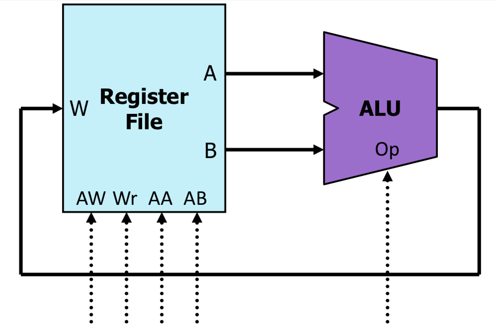
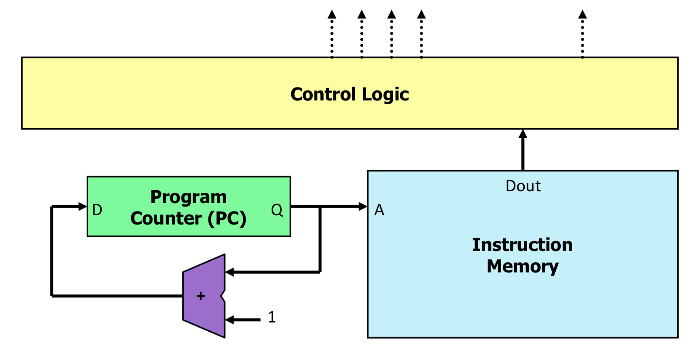
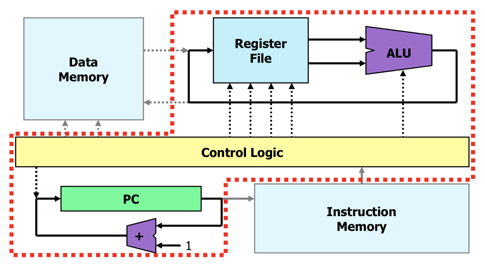
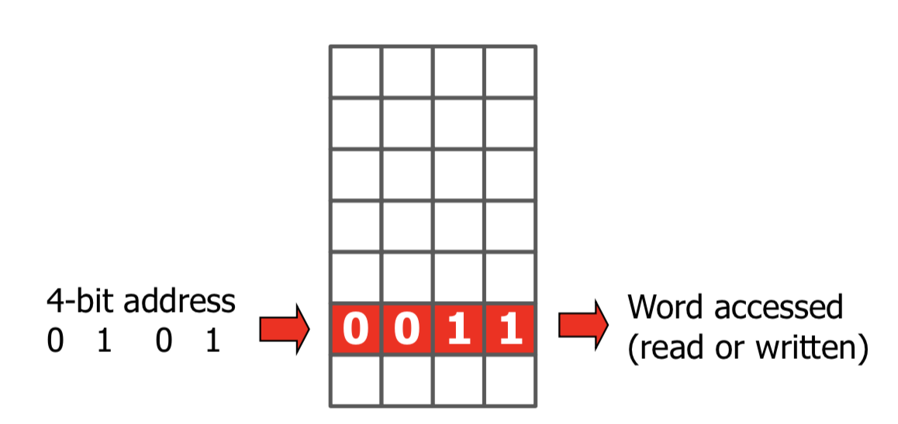

# [CS-208] Summary Computer Architecture

[TOC]

## 0.	Introduction

**Course program**

- **Processor Architecture**
  - What is a processor? What is its basic structure? How does it work?
  - How is a processor *really* programmed?
- **Computer Arithmetic**
  - What are the basic representations for numbers?
  - How are basic arithmetic components built?
  - What are overflows? How can they be detected?
- **Memory Hierarchy**
  - Memory is slow. How do I avoid slowing down the whole system?
  - Memory is expensive and limited. How do I cheat the programmeer into believing that memory is (almost) infinite?

---


**What we have seen so far**

- A language to describe digital logic functionality : **VHDL**
- Some important classes of digital building blocks :
  - **Sequential** building blocks : Flip-flops and **registers** (collection of flip-flops)
    - capability to memorize stuff
    - clock input (output changes when clock goes up)
  - **Combinational** logic
  - **Memories** : for storing information more efficiently than registers
- Software tools to program an FPGA (**Quartus**)
- Software tools to test the functionality of design (**Modelsim**)


## 1.	Introduction to OS

### 1.1	Timeline of computer history

- 1837	:	**Analytical engine** (by Charles Babbage) 
  - the input was provided via **punched cards**
  - for the output, the machine had a **printer**, a **curve plotter** and a **bell**. It was also able to punch numbers onto cards to be read later
  - using standard **base**-10 fixed point arithmetic
- 1938	:	**Electronic Discrete Variable Automatic Computer** (EDVAC)
  - first stored-program computer
  - no OS but **machine language**
- 1953	:	**IBM-704**
  - programming languages FORTRAN and LISP
  - magnetic tapes as memory
  - batch processing OS
- 1960	:	**IBM-7090**
  - Large-scale scientific and technological applications
- 1964	:	**PDP-7**
  - C, Unix
- 1976	:	**Very-large-scale integration** (VLSI), creating an integrated circuit (IC) by combining billions of transistors or devices into a single chip


### 1.2	What is an OS?

- OS is a program itself
- OS is invoked upon powering up

- OS is software that provides abstractions to make hardware easier to use (one can read or write to a file, rather than a location on the disk)
- OS allocates hardware resources among programs (Multiple programs can run ”simultaneously”)
- Different types of OS :
  - Mac OS, Windows, Linux
  - QNX (OS for automobiles), Wear OS (watches), Glass OS (glasses)


> **Q**: What is an OS?
>
> **R** : OS = hardware abstraction + ressource management


##2.	Introduction to Processors

###2.1	Inside the processor

Processors are composed of two parts :

- **data path** is made of components that
  - perform arithmetic and logic operations : **A**rithmetic-**L**ogic **U**nit (ALU) with many functions (&, >>, +, etc.)
  - hold data : **Register file** (an array of registers)
- **control path** is made of components that control the datapath, memory, I/O devices according to the program instructions

There are two types of architectures inside a processor :

- **Harvard architectures** : data memory and instruction memory are physically separated (like we will see)
- **Von Neuman architectures** : instruction and data *share the same memory*

---


**Data path**

ALU takes input operands from the register file, the result of the computation is written to the register file

- `W` : **writing** : it takes one input value in the address `AW` 
- `AA` and `AB` : **reading** : 2 addresses, outputs the content of registers found on `A` and `B`
- `Wr` : if high, allows writing else nothing changes



---


**Control path**

Ensures correct reading and sequencing of the program

- Program counter `PC` adresses the instruction memory `A`
- Instruction memory outputs the instruction `Dout` at the address `A`
- Control logic parses (analyzes) the received instruction and produces contorl signals
- PC increases its value (+1) to prepare for the next instruction



---


**Data path + Control path**

- Control signals arriving to register file and ALU (datapath) are generated by the Control logic (Control path)
- Since programs normally need large datasets, we can add a **data memory**
- Registers can take values from the data memory
- The results of ALU operations can be stored in the data memory

This is basically a **simple processor**




###2.2	Communicate with the processor

Let's take a look at this piece of code, what does it do? *counts the number of 1's in data*

```c
int data = 0x123456;											// $r1
int result = 0;														// $r2
int mask = 1;															// $r3
int count = 0;														// $r4
int temp;																	// $r5

do {
  temp = data & mask;
  result = result + temp;
  data = data >> 1;
  count = count + 1;
} while (count != 32)
```

We can rewrite it assuming all variables are stored in registers, named somewhat funny why \$r1, \$r2, etc. (**r** is for **register**) as


These are **processor instructions**

```assembly
			mov		$r1,	0x123456								# $s1 <=> data
			mov		$r2,	0												# $s2 <=> result
      mov		$r3,	1												# $s3 <=> mask
      mov		$r4,	0												# $s4 <=> count
      																		# temp is not initialized, no need to put it here

loop:	and		$r5, $r1, $r3									# $r5 = $r1 & $r3
			add		$r2, $r2, $r5									# $r2 = $r2 + $r5
			srl		$r1, $r1, 1										# $r1 = $r1 >> 1
			add		$r4, $r4, 1										# $r4 = $r4 + 1
			bne		$r4, 32, loop									# $r4 != 32 -> loop
			# bne = branch not equal
end:
```


## 3.	Memory

Memory is an integrated circuit device capable of **storing information** temporarily or permanently. It is a 2D array of stored bits (not using registers, because they cost too much). This is a high-efficiency information storage :

- each row of bits is identified by an **address**
- bits identified by the same address form a **word**




