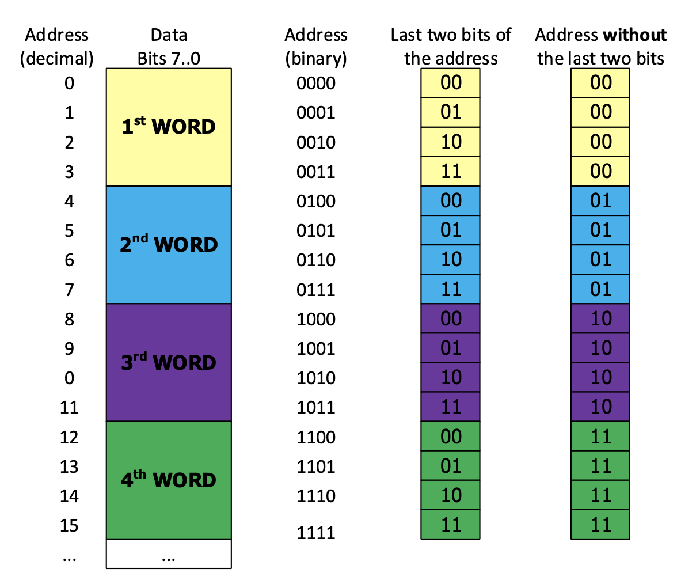
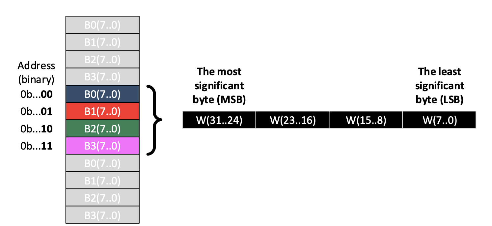
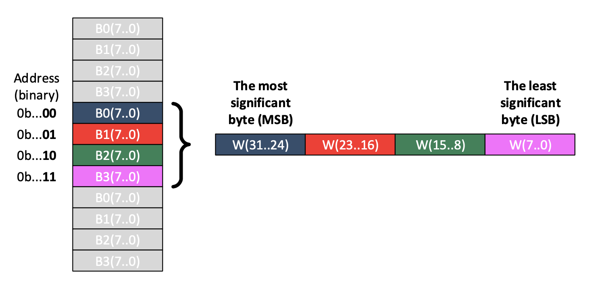
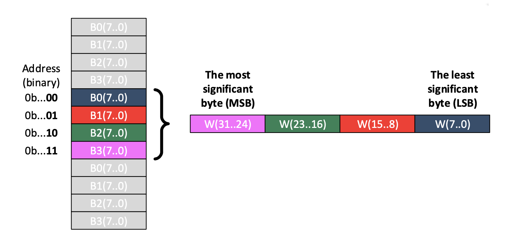
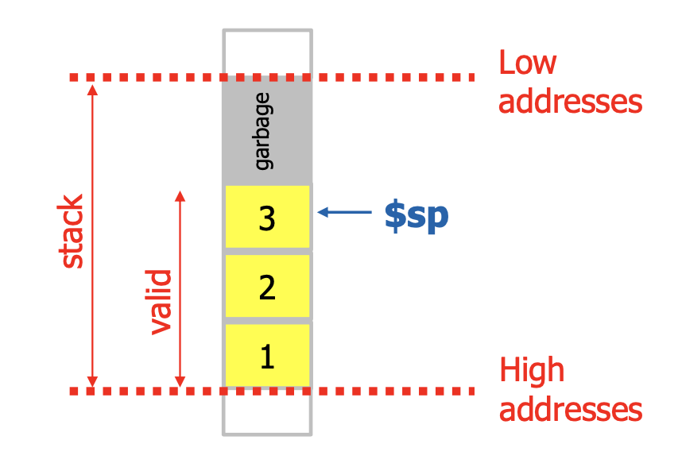
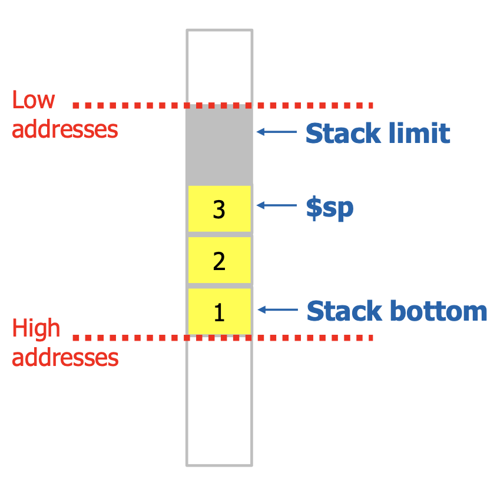
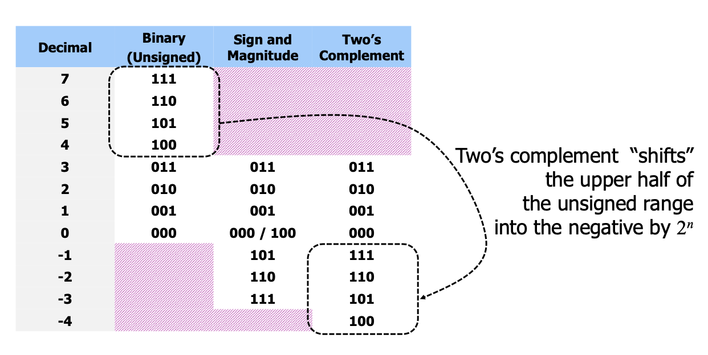

# [CS-208] Summary MIPS ISA

ISA = Instruction Set Architecture


## Registers

MIPS **register file** contains **32 registers** from `R0` to `R31` (sometimes denoted as `$0` instead of `R0`, for example). Registers are **32-bit wide**

Some registers have special functionality in hardware :

- Register `$0` is hard-wired to zero
- Register `$31` is used for function return address


**MIPS register conventions**

| NAME            | NUMBER  | USAGE                  |
| --------------- | ------- | ---------------------- |
| **$zero**       | 0       | Constant zero          |
| **\$v0 - \$v1** | 2 - 3   | Function return values |
| **\$a0 - \$a3** | 4 - 7   | Function arguments     |
| **\$t0 - \$t7** | 8 - 15  | Temporaries            |
| **\$s0 - \$s7** | 16 - 23 | Saved temporaries      |
| **\$t8 - \$t9** | 24 - 25 | Temporaries            |
| **\$k0 - \$k1** | 26 - 27 | Reserved for OS kernel |
| **$gp**         | 28      | Global pointer         |
| **$sp**         | 29      | Stack pointer          |
| **$fp**         | 30      | Frame pointer          |
| **$ra**         | 31      | Return address         |


## Instruction encoding

There are 3 **types** of instructions :

- **R-type** : register format (`opcode rd, rs, rt `)
- **I-type** : immediate format (`opcode rt, rs, imm`)
- **J-type** : jump format (`j target`)


When used to initialize registers with an imm value, I-format instructions can accommodate only 16-bits imm values. What if we’d like to initialize to a 32-bit imm value? 

```assembly
# Initialize register $t1 with a 32-bit immediate value 0x12345678

# Option 1 :
lui $t1, 0x1234
ori $t1, 0x5678

# Options 2 :
addi $t1, $zero, 0x1234
sll $t1, $t1, 16
ori  $t1, 0x5678
```


## Intruction classes

### Data operations

> Immediates are entered in base 10, but shown in base 16 (hexadecimal). Binaries are treated as two's complements

- \$t1 $= (77)_{10} = 0x4d = 0100 \, 1101_2$
- \$t2 $= (55)_{10} = 0x37 = 0011 \, 0111_2$ 
- \$t3 $= (-1)_{10} = 0xffffffff = 11...11_2$ (only for bitwise shifts)


- `addi` : add register with immediate

  ```assembly
  addi $t1, $zero, 77								# 0x00000000 + 0x0000004d => $t1 = 0x4d
  addi $t2, $zero, 55								# 0x00000000 + 0x00000037 => $t1 = 0x37
  ```

  Can't add to **immediates**! (would need to store the result of `$zero` and first immediate in a register, then add it with the second immediate)

- `add` : add two registers

  ```assembly
  add $t3, $t1, $t2									# $t3 = $t1 + $t2 => $t3 = 0x4d + 0x37 = 0x84
  ```

- `sub` : substract one register from another (negative in two's complement)

  ```assembly
  sub $t3, $t1, $t2									# $t3 = $t1 - $t2 => $t3 = 0x4d - 0x37 = 0x16
  sub $t3, $t2, $t1									# $t3 = $t2 - $t1 => $t3 = 0x37 - 0x4d = 0xffffffea
  ```

- `mul` and `div` are used for **mul**tiplication and **division** (Nios only)


- Bitwise operations : `and`, `or`, `xor`, `nor`

  ```assembly
  and $t4, $t1, $t2									# $t4 = $t1 AND $t2 => $t4 = 0000 0101b = 0x05
  or  $t4, $t1, $t2									# $t4 = $t1 OR  $t2 => $t4 = 0111 1111b = 0x7f
  xor $t4, $t1, $t2									# $t4 = $t1 XOR $t2 => $t4 = 0111 1010b = 0x7a
  nor $t4, $t1, $t2									# $t4 = $t1 NOR $t2 => $t4 = 11...1000 0000b = 0xffffff80
  ```

- Bitwise shifts : `sll`, `srl`, `sra` (logical shifts replace with `0`'s)

  ```assembly
  addi $t3, $zero, -1								# Sets $t3 to -1 = 0xffffffff = 11...11b
  
  sll $t4, $t3, 5										# $t4 = $t3 << 5  => $t4 = 0xffffffe0
  srl $t4, $t3, 5										# $t4 = $t3 >> 5  => $t4 = 0x07ffffff
  sra $t4, $t3, 5										# $t4 = $t3 >>> 5 => $t4 = 0xffffffff (MSBT (1) copied)
  ```

- Comparators : `slt`, `slti` (**s**et **o**n **l**ess **t**han [**i**mmediate]) (different names in Nios)

  ```assembly
  slt $t4, $t2, $t1									# $t4 = ($t2 < $t1) ? 1 : 0 => $t4 = 1
  slti $t4, $t2, 0x37								# $t4 = ($t2 < 0x37) ? 1 : 0 => $t4 = 0
  ```
  
> Examples : `arithmetic_examples.asm`

---


### Data transfer

- From register to register
- From memory location to register (**load**)
- From register to memore location (**store**)


**Memory initialization**

```assembly
# storing data in memory
.data
.byte 0x12 # address: 0 
.byte 0xFF # address: 1
.byte 0x3C # address: 2
.byte 0x11 # address: 3
.byte 0x54 # address: 4
.byte 0x42 # address: 5
.byte 0xA0 # address: 6
.byte 0xAA # address: 7
.byte 0x00 # address: 8
.byte 0xDE # address: 9
.byte 0xAD # address: 10
.byte 0xBE # address: 11
.word 0x135AA5EF

# storing program
.text
```


- **Load information** `l<b | h | w> rt, imm(rs)` $\implies$ `rt <= MEM[imm_s + rs]`
  
  - `lb` : load byte (8 bits) : (tips : `lb` extends the sign of MSB)
  
    ```assembly
    lb $t0, 0($zero)							# $t0 (7 downto 0) = MEM[0] (7 downto 0) => $t0 = 0x12
    lb $t1, 1($zero)							# $t1 (7 downto 0) = MEM[1] (7 downto 0) => $t1 = 0xffffffff
    ```
  
  - `lh` : load half-word (16 bits) : (tips : `lh` extends the sign of MSB $\oplus$ Memory address needs to be a multiple of 2)
  
    ```assembly
    lh $t2, 4($zero)							# $t2 (15 downto 0) = MEM[4] (15 downto 0) => $t2 = 0x4254 (2 bytes)
    ```
    
  - `lw` : load word (32 bits) : (tips : Memory address needs to be a multiple of 4)
  
    ```assembly
    lw $t3, 8($zero)							# 
    ```
  
- **Store information**

  - `sb` : store byte (8 bits)

    ```assembly
    sb $t0, 16($zero)							# 
    ```

  - `sh` : store half-word (16 bits)

    ```assembly
    sh $t1, 18($zero)							# 
    ```
  - `sw` : store word (32 bits)

    ```assembly
    sw $t1 20($zero)							# 
    ```

> Examples : `data_transfer_examples.asm`

---


### Program flow

- Conditional changes (branch) such as : `beq`, `bne`, `bgtz`, `blez`, ...
- Unconditional changes (jump) such as : `j`, `jal`, `jr`, ...

> Note : `jal` saves the address of the next instruction to execute after return from the function in `$ra` (register 31)

> Examples : `control_flow_examples.asm`


## Memory

Memory is organized in bytes (1B = 8b) 



> **Q** : How are the bytes inside a word related to the bytes in the memory? Is MSB equal to B0 or B3
>
> **A** : It is arbitrary, however, there is a convention, **endianess** which defines two possibilities : Big or little




| Endianess         | Characteristics                                              | Representation                                               |
| ----------------- | ------------------------------------------------------------ | ------------------------------------------------------------ |
| **BIG-Endian**    | The byte at the word address (`B0`) is the **MSB** of the word<br /><br />The MSB is the **BIG END** of the word |  |
| **little-Endian** | The byte at the word address (`B0`) is the **LSB** of the word<br /><br />The LSB is the **little end** of the word |  |

> Example : `endianess_examples.asm`


## Functions

When a **function** is called (by a **caller**) :

- the arguments are assigned
- program flow jumps to the body of the function (**callee**), and the code continues executing from there
- at the end of the function body, control flow returns to the function caller


Example in MIPS  

| List of tasks, step by step                                  | MIPS implementation                                          |
| ------------------------------------------------------------ | ------------------------------------------------------------ |
| Place parameters in a place where the function (**callee**) can access them | Registers 4 - 7 (`$a0` - `$a3`) are used to pass arguments to functions |
| Transfer control to the function                             | `jal functionLabel`<br />This also saves the return address in register 31 (`$ra`) |
| Provide some data storage for the function                   | Registers 8 - 15, 24, 25 (`$t0` - `$t9`) are used for temporary values |
| Perform desired task                                         | Function body                                                |
| Place result in a place where the **caller** can access them | Registers 2 and 3 (`$v0` and `$v1`) are used for keeping return values |
| Return control to the **caller**                             | `jr $ra`                                                     |


By convention :

- Some registers must have the same value just before and just after the function is called. We say that they are preserved on call (**callee-saved**). Functions may modify their values temporarily, but they have to change those values back to the initial ones before returning to the caller 
- Other registers are allowed to be permanently modified by the function. We say that they are not preserved on call (**caller-saved**) 

Registers 16 - 23 (`$s0` to `$s7`), the **saved temporaries** are the only callee-saved registers


> **Note** : End of a program
>
> ```assembly
> program_end:
> 	li $v0, 10								# 10 for exit (terminate execution)
> 	syscall										# end the program
> ```

> Examples : `function_examples.asm` and `function_examples2.asm`


## Stack

If a function requires more resources than registers available, or if the program has nested function calls (need to keep multiple return addresses in `$ra`... impossible), general purpose registers may not be sufficient. In that case, functions use a special region of memory called the **Stack**

Two main operations for working with a stack (same thing as a stack in high level programming) : `PUSH` and `POP`

In MIPS, the stack pointer (`$sp`, register 29) is by convention used for keeping the smallest address `addr` such that :

- any address $<$ `addr` is considered garbage, and 
- any address $\ge$ `addr` is considered valid 



(In MIPS, the stack pointer holds the most-recently occupied address)

**Stack limit** is the lowest valid stack address (If the stack pointer becomes smaller than stack limit, **stack overflow** occurs!)

**Stack bottom** is the highest valid stack address (When a stack is initialized, the stack pointer points to the stack bottom)




However, `PUSH` and `POP` operations are not implemented :

- `PUSH` : decrement `$sp`, store in memory at the address `$sp`

  ```assembly
  # Example, pushing register $r3 value on stack
  addi $sp, $sp, -4
  sw $r3, 0($sp)
  ```

- `POP` : load from the memory at address `$sp` and increment `$sp`

  ```assembly
  # Example, popping register $r3 value from the stack
  lw $r3, 0($sp)
  addi $sp, $sp, 4
  ```

> **Note** : `$sp` may change only in steps of 4 (bytes) to respect word-aligned memory access


If the function body modifies any of the registers declared "preserved on call" (saved temporaries), those registers must be saved on stack (pushed at the beginning of the function body, popped before returning from the function) 

In case of nested function calls, functions must save on stack the return address (kept by the register `$ra`) 


> Examples : `stack_examples.asm`


> Full program examples :
>
> - `recursion.asm`
> - `palindrome.asm`


## Integer numbers



Particularity of two's complements : $A + \overline A = -1 \implies -A = \overline A + 1$


> TODO : 8a1_CA => since "biased representation" until end of 8

> TODO : 9.1 and 9.2 (1Computer-Arithmetic-Fixed-Floating-Point-Numbers.pdf, 2FP_simple_example.asm)


## A. Temp : lecture notes 12.11.19 (week 9)

- fixed point notation :
  - result of the addition (without the point) is actually the same! We can use the same hardware
  - drawback : mitigated accuracy (see slide 6) $\implies$ the result is actually NOT the same
- floating point notation :
  - Engineering notation & Scientific notation
  - $X=M \cdot 2^E$ with $M$ the mantissa and $E$ the exponent
  - Dynamic range
  - /!\\ Floating point is NOT real (slides 14-15)
- IEEE 754 FP Standard 
  - $X=1.M \cdot 2^{E-B}$
  - special numbers :
    - 0 $\implies \langle s00 \dots000 \rangle$
    - $\pm \infin \implies \langle s11 \dots 100 \dots 000 \rangle$
    - 


