# [CS-208] Summary Memory - Caches

# 1.	Cache memory

- **SRAM** : Static Random Access Memory
  - **Static** : content last until power is lost
  - expensive, fast
  - Example : cache
- **DRAM** : Dynamic Random Access Memory
  - **Dynamic** : need to be refreshed regularly
  - cheap, slow
  - Example : main memory

Placement of instructions and data in memory :

- **Temporal locality** : data that has been used recently has high probability of being used again
- **Spatial locality** : data close in the memory of the data we are currently using is likely to be accessed in the future

### 1.1	Basic cache design

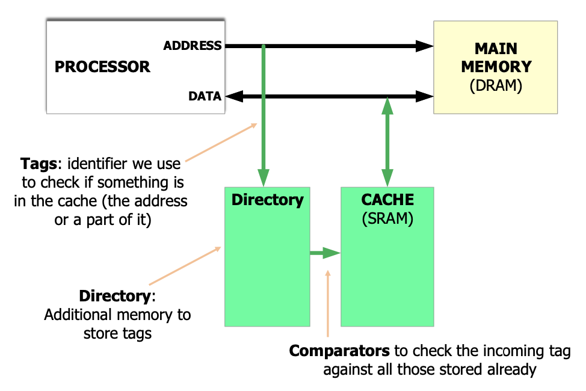

Cache holds the most recently accessed data/instructions. Cache is divided into units called **cache lines**. Each cache line has extra bits called **cache tag** which hold the main memory address (or part of it) called **tag** (id used to check if something is in the cache) of the data that is currently in the cache line. The **tag directory** is some additional memory used to store tags. Cache is on the path between the CPU and main memory

One cache line is a pair of one directory entry (tag) and data. Finding a piece of data in cache requires finding whether the corresponding tag is already present in the cache

When the data is found in the cache, it is a **hit**, otherwise, it's a **miss**. **Hit rate** is the number of hits over the number of cache accesses, **miss rate** is the number of misses over the total number of cache accesses (and miss rate = 1 - hit rate)

### 1.2	Cache hit/miss

- **Read Hit**
  - CPU requests memory read. Cache detects that the data is already in the cache
  - Main memory is not accessed (no need for it)
  - Cache sends the data to the CPU **fast**
- **Read Miss**
  - CPU requests memory read. Cache detects that the data is **NOT** in the cache
  - Main memory is accessed for the data
  - Data is stored in the cache **and** then passed to the CPU
  - CPU gets the data, but it was **slow**
- **Write Hit : write-through cache**
  - Data written both in cache and main memory
- **Write Hit : write-back cache**
  - Data updated only in the cache. To remember which blocks are obsolete in the main memory, cache has an additional bit : **dirty bit**. If set, then the corresponding line is obsolete in the memory
  - Before overwritting a dirty line from the cache, its content must be stored to memory
- **Write Miss : write allocate** (generally used by write-back caches)
  - On write miss, allocate the data in the cache, then signal a write hit
- **Write Miss : write no-allocate** (generally used by write-through caches)
  - On write miss, write the data to memory, do **not** allocate in the cache
  - Wait the next read miss to load data and allocate in the cache

### 1.3	Eviction policies

When there is no space for new piece of data, we must overwrite one of the existing lines

- Least recently used (LRU) : evicts the cache line that has not been accessed for the longest period of time
- Random : evicts a random line
- ...

### 1.4	Cache types 

#### Fully-associative cache

A word can go in whichever line of the cache. The **associativity** indicates the number of cache lines where one word of data can be placed; in this cache type, the associativity of a cache with $L$ lines is exactly $L$

When checking whether the data is already in the cache, the incoming tag needs to be compared (in parallel) with all existing tags in the directory

A special bit, the **valid bit** is added to every cache line to indicate whether the line content is relevant for the current program. At the beginning of the prorgam execution or at reset, valid bit is 0

Hit **only** if tag matches **and** valid bit is 1

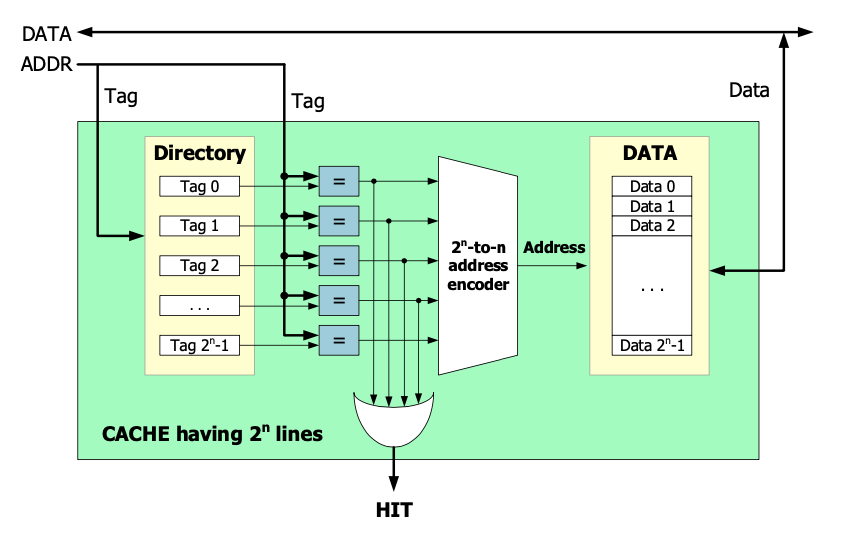

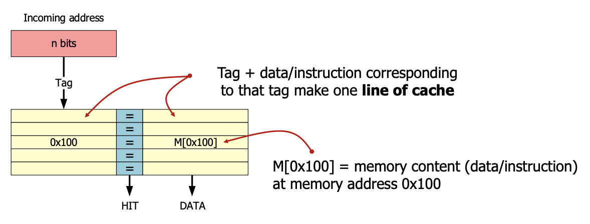

Explointing spatial locality (assuming memory is word addressed)

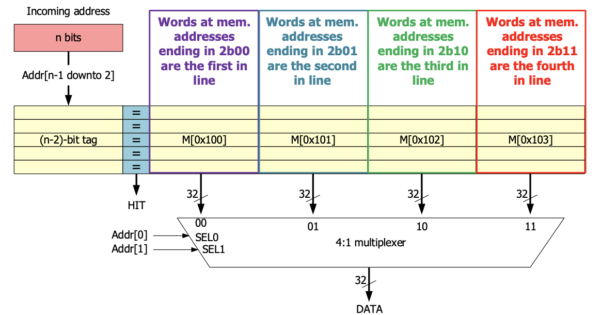

More generally, if $2^m$ words are loaded at a time and the memory is $n$-bits wide, then the last $m$ bits of the address are used to select a word from the cache line, the first $(n-m)$ bits of the address form the tag of that cache line

**Problem** of this cache : the cost of the $2^m$ comparators...

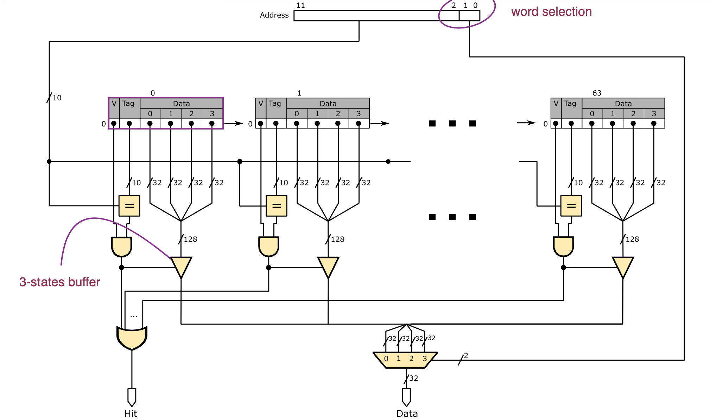

---

#### Direct-mapped cache

Here, a word is mapped to a single line of the cache, hence the associativity is 1

For a cache with capacity of $2^m$ words (assuming word aligned), $m$ address bits are used ot index the cache lines and $(n-m)$ bits make a tag. Each address directly maps to one cahce line. 

**Advantage** : an incoming tag needs to be compared with only one cache tag

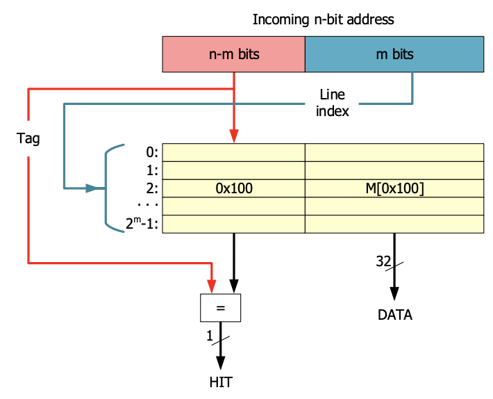

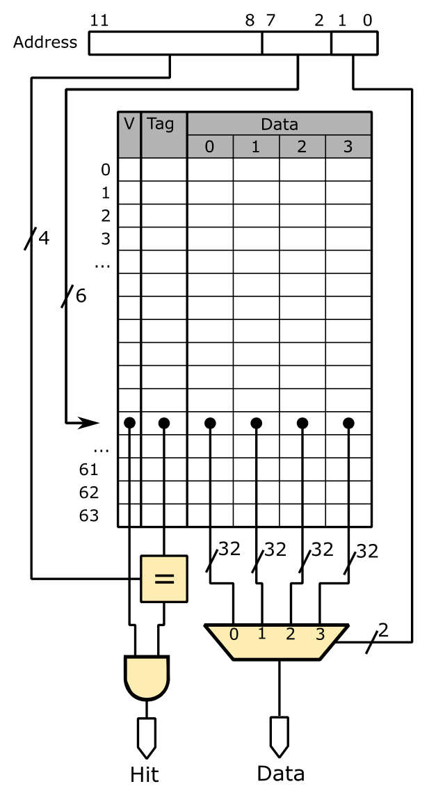

---

#### Set-associative cache

Here, a word is mapped to as many lines of cache as there are **ways** where the line have the same index

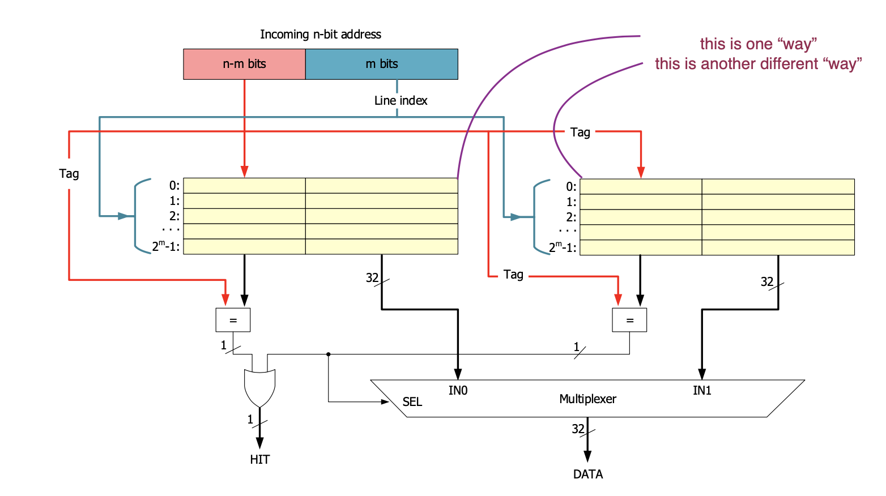

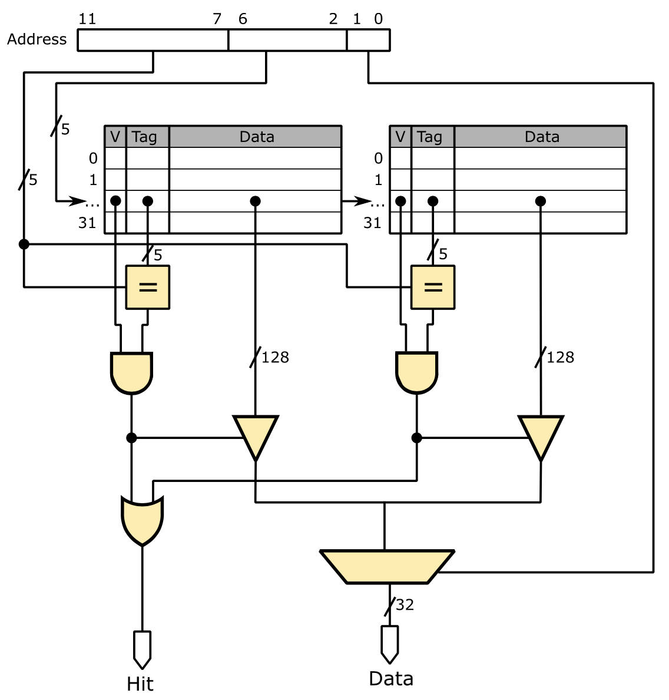

The **average latency** is calculated via
$$
\text{Latency}_{AVG} = \text{Latency}_{HIT} + \text{missRate} \times \text{LatencyPenalty}_{MISS}
$$

# [PacketPrep] Memory - Caches lectures

> This "summary" is based on the youtube channel [PacketPrep](https://www.youtube.com/channel/UC8FmKkoVFU20P6WnykizlUg), more precisely, a [playlist](https://www.youtube.com/playlist?list=PLPiOSvowot1Ky0_OiXzpA0vU09iI06lQb) on Computer Organization

## 1.	Memory hierarchy

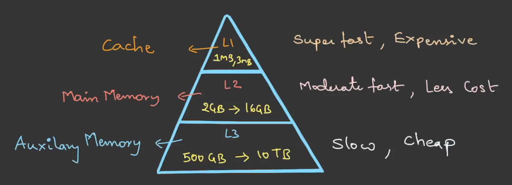

> **Note** : cache and main memory are **volatile**, meaning they lose whatever they may be storing when they are not supplied with power anymore
>
> **Note** : we could add another level to the pyramid (at the very top) which is : **register** (even faster and more expensive than cache)

We call a **hit** (**cache hit** for the cache and **page hit** for main memory) a successful access to the data (in any level). By opposition, for an unsuccessful data access attempt, we call this a **miss** (**cache miss** for the cache and **page miss** for main memory)

We call the **hit ratio** or **hit rate** $H$. The **miss ratio** or **miss rate** corresponds to $1-H$
$$
H = \frac{\text{# hits}}{\text{# attemps}} \\
1 - H = \frac{\text{# misses}}{\text{# attemps}}
$$

### 1.1	Searching data

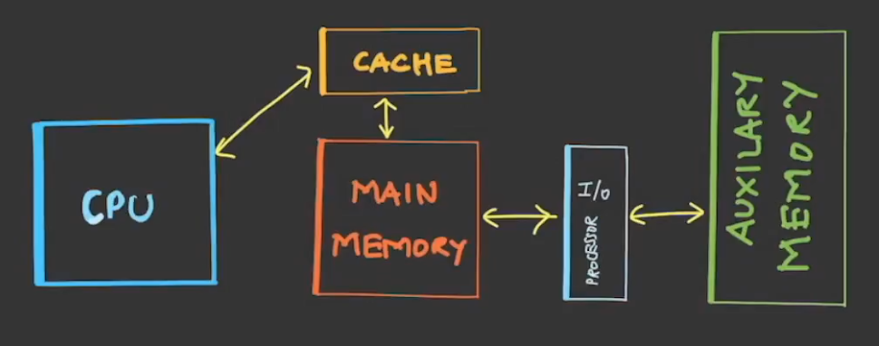

CPU first checks for data in the cache : if it is successful, we have a cache hit and the data is brought to the CPU. If we have a cache miss, then the CPU searches for the data in the main memory (page hit if successful, and data brought to CPU). If we have a page miss, then the CPU looks for the data in auxiliary memory (disk for example). Note that the latest systems also provide a direct path from CPU to main memory, allowing the CPU to search in both cache and main memory simultaneously, this is the difference between a **hierarchical access** (CPU can access data from L1) and a **simultaneous access** (CPU can access data from L1 and L2)

The **delay** that arises encouters a cache miss or a page miss is called **miss penalty** (or **miss time**), this is the extra time needed to bring the data from one level to another. Note the time will be different depending if we have hierarchical or simultaneous access

We can also calculate the **average memory access time** (AMAT) both in simultaneous and hierarchical access
$$
\text{AMAT} = \frac{
	\text{# hits} \times \text{hit_time} + \text{# misses} \times \text{miss_penalty}
	}{
	\text{# hits} + \text{# misses}
	}
	=
	H \times \text{hit_time} + (1-H) \times \text{miss_time}
$$

## 2.	Cache memory

We have a few main memory formulas ($MS$ is the **memory size**, $BS$ the **block size**, $NB$ the **number of blocks**, $BI$ the **block index**, $BO$ the **block offset** and $PA$ the **physical address**)
$$
MS = 2^{PA} \\
BS = 2^{BO} \\
NB = \frac{MS}{BS} = 2^{BI} \\
PA = BI + BO
$$
Additionally we get similar formulas for the cache ($CS$ is the **cache size**, $NL$ is the **number of lines**, $CI$ the **cache index** and $CA$ the **cache address**)
$$
CS = 2^{CA} \\
BS = 2^{BO} \\
NL = \frac{CS}{BS} = 2^{CI} \\
CA = CI + BO
$$

How to map the main memory with the cache? Three techniques :

- **direct mapping**
  - Can be though as a "many to one mapping"
  - Cache partitions are called **lines** and they have line numbers. Main memory partitions are called **blocks** and they have block numbers
  - Line numbers can be thought as labels, the logic is "block numbers' least significant bits are mapped to the line number corresponding" (e.g, for a MM with 16 blocks (0000, 0001, ..., 1111) and cache with 4 lines (00, 01, 10, 11), then line 0 can hold the block 0, 4, 8 or 12)
  - *advantage*: can easily locate the line in cache and check if data is available
  - *disadvantage*: restriction on the placement (block 0 can only go in line 0, even if other lines are free)
- **associative mapping**
  - A memory block can be placed in any cache line
  - *advantage*: flexibility on placement
  - *disadvantage*: not sure where the data items are (need to search every line for some data)
- **set associative mapping**
  - Combination of direct and associative mapping
  - Cache lines are grouped as **sets** where block numbers' least significant bits are matched with the set numbers (direct mapping). Inside the set, the block can go anywhere (e.g., it may have 2 slots where data can be stored

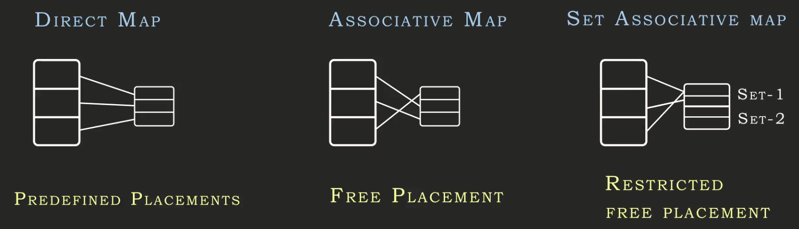

### 2.1	direct mapping

As said before, each memory block can only go in the cache line corresponding to its LSBs. Recall that each cache line can only hold one memory block at a time. For the CPU to understand which block is in the cache, it maintains some extra information : **tag bits**. The **tag size** corresponds to the "block index $-$ cache index". Tags hold the $TB$ MSBs of $CI$
$$
TB = PA - CA = BI - CI
$$
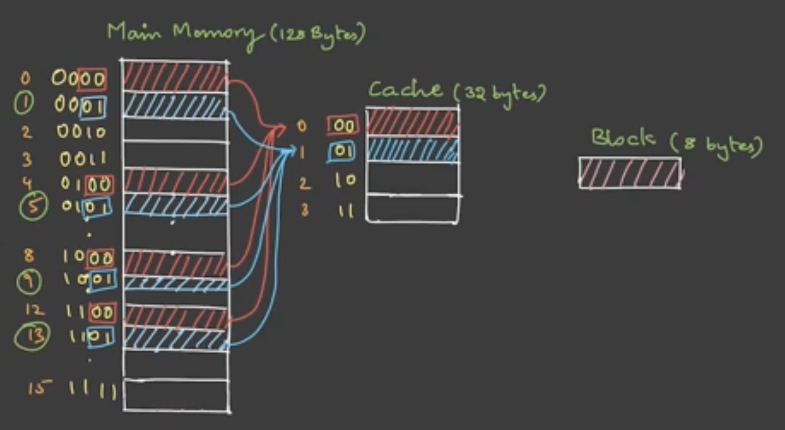

### 2.2	associative mapping

In **associative mapping** a memory block can be placed in any cache line. The complete block index $BI$ is copied in the tag bits. When CPU queries for an address, the whole cache is checked to see if the address is in it, if we have a miss, multiple strategies may be used to choose which cache line to overwrite (FIFO (first-in, first-out), LRU (least recently used), random)
$$
TB = BI
$$

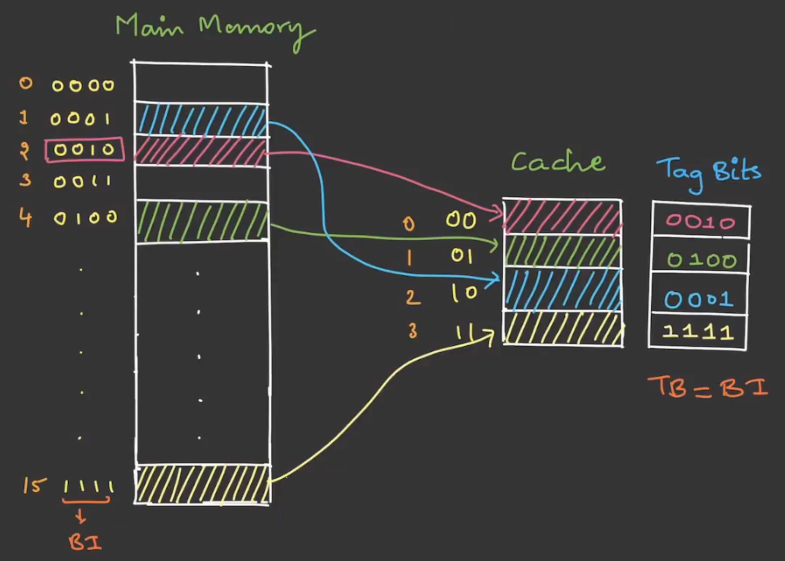

### 2.3	set associative mapping

> TODO vod 14

