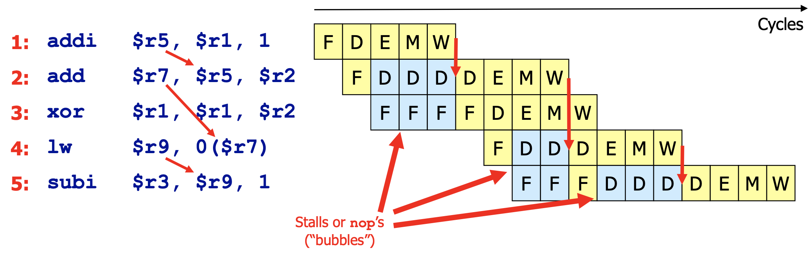
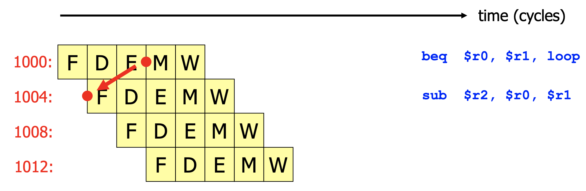

# [CS-209] Summary ArchSoC

[TOC]

## Part I : Computer Organization 

## Part II : Increasing Performances

### Performances

Using the `time` command in a Unix terminal :

```bash
> time latex iccad04 >& /dev/null				# mesures time needed for a task to be completed
0.79u 0.17s 0:01.20 80.0%
```

| Time            | Value [s] | Explanation                                                  |
| --------------- | --------- | ------------------------------------------------------------ |
| User CPU time   | 0.79      | CPU has spent 0.79s executing instructions of the program (latex) |
| System CPU time | 0.17      | CPU has spent 0.17s executing instructions from the OS <br />on behalf of my program (e.g. `malloc`) |
| Elapsed time    | 1.20      | the job was completed in 1.20s                               |
| Percentage      | 80 %      | 80% of the elapsed time has been spent on the given job, <br />the rest was used for System I/O, other jobs, other users, ... |

**Note** : User CPU time + System CPU time $\neq$ Elapsed time


We can mesure the **speedup** (how fast is system $X$ compared to system $Y$)
$$
\text{Speedup} = 
\frac{\text{Performance}_X}{\text{Performance}_Y} =
\frac{\text{Execution Time}_Y}{\text{Execution Time}_X}
$$
In hardware, the mesure of time is the **clock period** or **cycle**. We define CPI (**Cycles Per Instruction**) as the average number of cycles per instruction executed
$$
CPI = \bigg(\frac{\text{Execution Time}}{\text{Clock Period}}\bigg) / (\text{Total instruction count})
$$
and IPC (**Instructions Per Cycle**) the average instructions executed per cycle
$$
IPC = \frac{1}{CPI}
$$
**Note** : Our goal with parallelism is to reach $IPC < 1$
$$
\text{Performance} = 
\frac{1}{\text{Execution time}} =
\frac{f_{\text{clock}}}{\text{Instruction Count x CPI}} =
\frac{f_{\text{clock}}\text{ x IPC}}{\text{Instruction Count}}
$$


### Basic Pipelining

For that circuit to operate properly, it must be
$$
T_{CLK} \ge T_{\text{critical path}}
$$


Our solution : segment the circuit by adding intermediate registers. For this circuit to work properly, it must be
$$
T_{CLK} \ge T_{\text{NEW critical path}} \approx T_{\text{critical path}} / 3
$$


The time to compute a single operation is _roughly the same_ as in the original circuit, **but**, this time, we get a result every $T/N$ (throughput is multiplied by $N$)

**Note** : we can't add more and more intermediate registers because each register also has latency that would add up if we add too many

Pipelining is useful **only** if the activity in object needs to be repeated many times


### Pipelining the processor

#### Simple MIPS pipelining


Here's a simple 5-stage MIPS pipeline


Be careful! Both `fetch` and `memory` stages need access to memory. However, they can't both access it at the same time! To solve this problem, we use caches


**Attention** : ce simple modèle comporte une erreur! Imaginons que l'on ait un programme comme celui-ci

```assembly
1000: addi	$r0, $r0, 1
1004: sub		$r2, $r0, $r1
```

Alors un problème arrivera! On utilise `$r0` dans les deux instructions : quand la première exécution sera terminée, le résultat ne se sera pas encore propagé jusqu'au register file (`RF`) (opération effectuée au stade writeback `W`). Le decode (`D`) de l'instruction `1004` prendra alors une valeur erronée du `RF` pour le register `$r0`.

---


#### RAW, WAR and WAW dependences

- **R** : read
- **A** : after
- **W** : write

```assembly
divd		$f0, $f1, $f2
addd		$f3, $f0, $f4
subd		$f4, $f5, $f6
adddi		$f0, $f5, 10
```

- `addd`  has a **RAW** dependence on `divd` (`$f0`) $\implies$ True / Data dependences (most problematic)
- `subd` has a **WAR** dependence on `addd` (`$f4`) $\implies$Name dependences
- `adddi` has a **WAW** dependence on `divd` (`$f0`) $\implies$ Name dependences

---


#### Data Hazards solved : Stalling the CPU

A natural solution to this problem is **stalling the pipeline** : (solving **RAW** dependences). Stalling roughly means introducing `nop`'s instructions in the pipeline


Here's an example of a mini-program... The problem is that we loose 8 cycles doing basically nothing



Can we do better?

---


#### Data Hazards solved : Bypass path

Data are available at the **right time**, but in the **wrong place**. Solution : add a forwarding path (or bypass path) to bring it where it needs to be (`E`). There's a also a forwarding path between `W` and `D` : this is a special case :

- during `W` : registers are written in the **first half** of the cycle
- during `D` : registers are read in the **second half** of the cycle


**Summary of possible bypass** : `E` $\to$ `E` ,  `M` $\to$ `E` and  `W` $\to$ `D` 

Here's an example of an execution of a mini-programm: this time, we only loose 1 cycle!


---


#### Control Hazards

This time, imagine running a `branch` instruction

```assembly
beq		$r0, $r1, loop
```

This time, we do not know at which instruction to set the `PC` : `PC + 4` if the comparaison fails, or the address of the `loop` label if the comparaison succeeds



Our first instinct could be to come back to the stalling solution : adding stalling instructions after EVERY branch... Problem is : 2 cycles are lost EVERY branch


Alternatively, we can modify the definition of the architecture and decide that the two instructions following are executed in any case (branch taken or not). These instructions are called **delay slots** and make the code counter-intuitive. This solution is quite rare in current architectures. Note that it is possible to not find two instructions that would be independant to place in the delay slots : in this case, we would replace those by `nop`'s


**Note** : a better strategy is to **guess the branch outcome**. E.g. if the program has seen this exact branch $n$ times and was always taken, this time, the branch will also *probably* be taken. Branch predictors of modern processors are extremely sophisticated (dynamic predictors learn from previous executions of a branch) and can be correct up to 95-99% of the times. The quality of branche predictors has made architectures with delay slots extremely rare

---


#### Summary

> - **Data Hazards** (data dependences)
>   - Forwarding paths, wherever possible
>   - Stalls, in all other cases
> - **Control Hazards** (jumps and branches)
>   - Delay slots, if the architecture allows it
>   - Branch prediction, to try to do the right thing
>   - Stall, if not
> - **Structural Hazards** (conflicting need for a ressource)
>   - Rigid pipelines which cannot have structural hazards by construction
>   - Stalls, otherwise


### Dynamic Scheduling

The idea is to let the CPU reorder the program. For example, divisions take a lot of time (and use the ALU). During this, we could access the memory to load/store stuff while we are calculating the result of the division.

Another case would be this one :

```assembly
divd		$f0, $f2, $f4
addd		$f5, $f0, $f0
subd		$f9, $f8, $f7
```

Why not execute `subd` while `addd` waits for the result of `divd`?

The solution is to **split the tasks** in independant units / pipelines :

- fetch and decode
- execute
- Write back


A **reservation station** (RS) checks that the operands are available (RAW) and that the Execution unit (here ALU) is free (structural hazard), then starts the execution. A reservation station is specialised for the execution unit it is serving

La RS a pour but de choisir quelle instruction envoyer à l'unité d'exécution associée (suivant si les opérandes sont disponibles ou non)

La colonne "tag" donne l'étiquette (unique) de l'opération sur laquelle on attend pour pouvoir exécuter l'instruction de la ligne (évidemment, si toutes les opérandes sont disponibles, cette case est vide)

La RS est dépouvue d'ordre (ici, on voit que `ALU2` est une instruction décodée APRES `ALU3`) et toutes les RS sont "connectées" (les execution unit transmettent quelle étiquette vient d'être calculée)

Avec ce nouveau système (RS avec introduction d'étiquettes), on règle le problèmes des WAR et WAW (implicit register naming $\implies$  removing WAR and WAW hazards)


Ce nouveu système est intelligent et intuitif, mais ce dernier amène un nouveau problème au niveau des exceptions (precise exceptions vs imprecise exceptions)


Un **reordering buffer** (ROB) est placé juste avant le register file `RF`. Son but est de réorganiser les instructions dans l'ordre dans lesquelles les intstructions se sont présentées au fetch and decode. Le ROB est connectée à toutes les RS (dans le sens qu'elle voit le résultat de ces dernières : si le résultat de MUL2 a été calculé, le ROB va remplacer les "???" par ledit résultat)

Le ROB est implémenté comme une Queue. Chaque cycle, une nouvelle instruction est ajoutée à la fin (tail). Chaque cycle, le ROB regarde l'instruction stockée à la tête de queue (head) et se demande si tout à été calculé (pas de "???"); si oui, l'instruction complète est passée au `RF`, sinon, le ROB ne fait rien et attend le prochain cycle.

Le ROB est aussi appelé **Commit Unit**


### Superscalar Processor

**Idea :** start multiple computations per cycles. Here we add another ALU unit


There are a few more problems that we will look into. But **superscalar processors** are the *ultimate* version of a CPU in this course


### Alternative : VLIW

VLIM (**Very Long Instruction Word**) processors and static scheduling (also called EPIC (**Eplicitely Parallel Instruction Computing**)) are an alternative to superscalar processors. Now all the pressure in on the compiler


**Idée :** résoudre tous les problèmes de RAW, WAR and WAW. Pack instructions in operations (128-512 bits) and execute


## Part III : Cache Coherence

Maintenant que l'on a optimisé le parallelisme sur nos processeurs, la seule solution pour améliorer la performance est de mettre plusieurs CPU et de les faire travailler en parallèle


