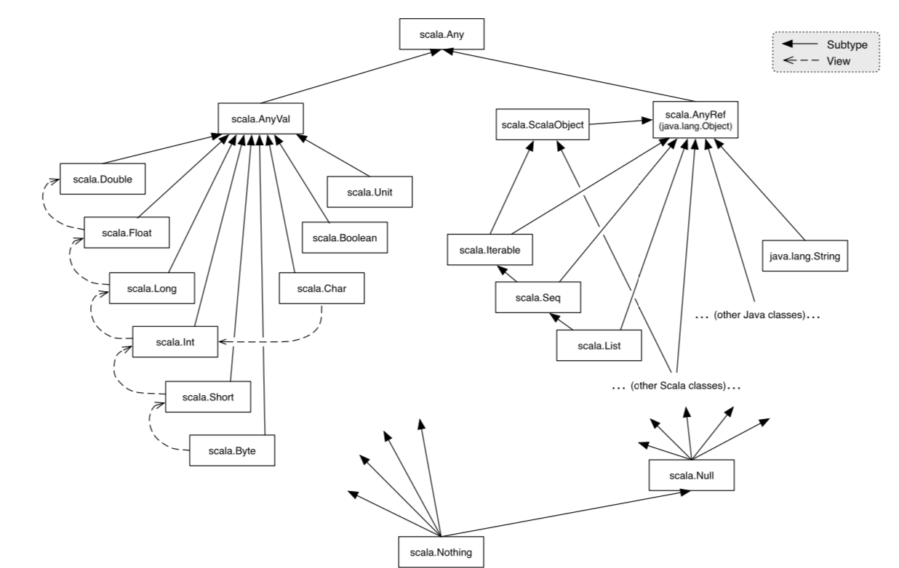

#[CS-210] Summary Scala

[TOC]

## 1.	Basic elements of [FP](https://www.coursera.org/learn/progfun1?)

```scala
87 + 145							// Calculator
def size = 2					// Defines a value
```


**Parameters**

Definitions can have *parameters*

```scala
def square(x: Double) = x * x			// Double is a parameter

square(2)								// 4.0
square(square(4))				// 256.0
```

---


**Semicolons**

In Scala, semicolons at the end of a line are optional in most cases, you could write

```scala
def x = 1;
```

but most people would omit the semicolon

On the other hand, if there are more than one statements on a line, they need to be separated by semicolons:

```scala
def y = x + 1; y * y
```

---


### 1.1	Evaluation

This scheme of expression evaluation is called the *substitution model*

Idea : **reduce an expression to a value**

Not every expression reduces to a value in a finite number of steps

```scala
def loop: Int = loop		// Example
```


**Evaluation of arithmetic expressions**

1. Take the leftmost operator
2. Evaluate its operands (left before right)
3. Apply the operator to the operands

```scala
def pi = 3.14
def radius = 10

// Example evaluation of
(2 * pi) * radius
(2 * 3.14) * radius
6.28 * radius
6.28 * 10
62.8
```

---


**Evaluation of functions**

```scala
def sumOfSquares(x: Double, y: Double) = square(x) + square(y)
```

Both strategies (CBV and CBN) reduce to the same final values as long as :

- the reduced expression consists of pure functions, and
- both evaluations terminate

If termination is not guaranteed, then

- CBV evaluation of an expression *e* terminates, **then** CBN evaluation of *e* terminates too
- The other direction is not true

````scala
def first(x: Int, y: Int) = x
def loop: Int = loop

first(1, loop)				// under CBV :	does NOT terminate
first(1, loop)				// under CBN :	terminates
````

---


**Call-by-value (CBV)**

1. Evaluate all function arguments (left to right)
2. Replace the function application by the function's right-hand side, and, at the same time,
3. Replace the formal parameters of the function by the actual arguments

```scala
// Example evaluation (call-by-value)
sumOfSquares(3, 2+2)
sumOfSquares(3, 4)					// 1
square(3) + square(4)				// 2 and 3
3 * 3 + square(4)
9 + square(4)
9 + 4 * 4
9 + 16
25
```

---


**Call-by-name (CBN)**

The interpreter applies the function to unreduced arguments

```scala
// Example evaluation (call-by-name)
sumOfSquares(3, 2+2)
square(3) + square(2+2)
3 * 3 + square(2+2)
9 + square(2+2)
9 + (2+2) * (2+2)
9 + 4 * (2+2)
9 + 4 * 4
9 + 16
25
```

---


**CBV vs CBN**

```scala
def test(x: Int, y: Int) = x * x

test(2, 3)				// same #steps
test(3+4, 8)			// better with CBV
test(7, 2*4)			// better with CBN
test(3+4, 2*4)		// same #steps
```

---


###1.2	Functions and simple rules

A *function parameter* can be specified after a colon following the parameter list

```scala
def power(x: Double, y: Int): Double = (...)
```

| Primitive type | Description                       |
| -------------- | --------------------------------- |
| Int            | 32-bit integers                   |
| Double         | 64-bit floating point numbers     |
| Boolean        | boolean values *true* and *false* |

---


**CBV and CBN in Scala**

Scala normally uses **call-by-value** but if the type of a function parameter starts with `=>` , then it uses **call-by-name**

````scala
def constOne(x: Int, y => Int) = 1
def loop: Int = loop

constOne(1+2, loop)
constOne(3, loop)
1

constOne(loop, 1+2)
constOne(loop, 1+2)
constOne(loop, 1+2)
...
````

---


**Conditionals**

To chose between two alternatives, scala uses the conditional expression **if-then-else**

```scala
def abs(x: Int) = if x >= 0 then x else -x
```

Here, `x >= 0` is a **predicate** of type Boolean


**Booleans**

| Boolean expressions | Description       |
| ------------------- | ----------------- |
| *true*, *false*     | Constants         |
| !a                  | Negation          |
| a && b              | Conjunction (AND) |
| a \|\| b            | Disjunction (OR)  |

---


**Value definitions**

As seen previously, function parameters can be passed **by value** or **by name**, then same distinction applies to definitions :

- the `def` form is "**by name**", the right hand side is evaluated on each use 
- the `val` form is "**by value**", the right hand side is evaluated at the point of the definition itself (instanciation)

````scala
def x = 2													// def and val are equivalent

def yName = square(x)							// def form is "by-name"
val yVal = square(x)							// val form is "by-value"
````

Both `yName` and `yVal` refer to 4 (and not `square(2)`)

The difference between `def` and `val` becomes apparent when the right hand side does not terminate

```scala
def loop: Boolean = loop

def x = loop											// ok
val x = loop											// infinite loop
```

---


**Recursion introduction**

Square root calculation example using [Newton's Method](https://en.wikipedia.org/wiki/Newton%27s_method)

```scala
def sqrt(x: Double): Double = ...
```


Let's define `sqrtIter`, a function which compute one iteration step. Here `sqrtIter` is **recursive**, recursive functions need an explicit return type in Scala. For non-recursive functions, the return type is optional.

```scala
def sqrtIter(guess: Double, x: Double): Double =					// Note the return type
	if isGoodEnough(guess, x) then guess
	else sqrtIter(improve(guess, x), x)
```

Second, define a function to improve the estimation and a test to check for a termination

```scala
def improve(guess: Double, x: Double) = (guess + x / guess) / 2

def isGoodEnough(guess: Double, x: Double) = abs(guess * guess - x) < 0.001
```

Last, define the `sqrt` function

```scala
de sqrt(x: Double): Double = sqrtIter(1.0, x)							// 1.0 is the first guess
```

---


**Blocks and lexical scope**

A block is delimited by **braces**. Blocks are themselves expression; a block can appear everywhere an expression can. The last element of a block is an expression that defines its value.

```scala
{ val x = f(3)
	x * x
}
```

**Note** : In Scala 3, braces are optional for a correctly indented code


**Block visibility**

- Definitions inside a block are visible only from within the block itself
- Definitions inside a block **shadow** definition of the same names outside the block

```Scala
val x = 0
def f(y: Int) = y + 1
																	// What is the value of result ?
val result = {
  val x = f(3)										// x = f(3) -> 3 + 1 -> 4				(shadowing)
  x * x														// x * x -> 4 * 4 -> 16
} + x															// result = 16 + 0 -> 16				(visibility outside block) 
```

Definitions of outer blocks are visible inside a block unless they are shadowed

---

**Nested functions**

In the last example ([Newton's Method](https://en.wikipedia.org/wiki/Newton%27s_method)), the functions `sqrtIter`, `improve` and `isGoodEnough` only matter for the implementation of `sqrt`, hence useless for the rest of the program. We would then prefer to write :

```scala
def sqrt(x: Double): Double = {
	def sqrtIter(guess: Double, x: Double): Double =				// we call them "nested functions"
		if isGoodEnough(guess, x) then guess
		else sqrtIter(improve(guess, x), x)

	def improve(guess: Double, x: Double) = 
		(guess + x / guess) / 2

	def isGoodEnough(guess: Double, x: Double) = 
		abs(guess * guess - x) < 0.001

	sqrtIter(1.0, x)
}
```

Furthermore, redundant occurences of the *x* parameter can be eliminated

```scala
def sqrt(x: Double): Double =
	def sqrtIter(guess: Double): Double =
		if isGoodEnough(guess) then guess
		else sqrtIter(improve(guess))

	def improve(guess: Double) = 
		(guess + x / guess) / 2

	def isGoodEnough(guess: Double) = 
		abs(guess * guess - x) < 0.001

	sqrtIter(1.0)
```

---


**End markers**

With heavily indented code, it may be hard to see where a construct ends, **end markers** are a tool to make this explicit :

- an end marker is followed by the name that’s defined in the definition that ends at this point
- an end marker *must* be aligned with the opening keyword (here `def`)

```scala
def f() = 

	...	
		...

end f
```

```scala
def sqrt(x: Double): Double =
	def sqrtIter(guess: Double): Double =
		if isGoodEnough(guess) then guess
		else sqrtIter(improve(guess))

	def improve(guess: Double) = 
		(guess + x / guess) / 2

	def isGoodEnough(guess: Double) = 
		abs(guess * guess - x) < 0.001

	sqrtIter(1.0)

end sqrt()
```

---


**Precedence rules**

The **precedence** of an operator is determined by its first character. The following table lists the characters in increasing order of priority precedence

```scala
(all letters), |, ^, &, < >, = !, :, + -, * / %, (all other special characters)
```

```scala
// Example
a + b ^? c ?^ d less a ==> b | c 
a + b ^? (c ?^ d) less a ==> b | c 
(a + b) ^? (c ?^ d) less a ==> b | c 
((a + b) ^? (c ?^ d)) less a ==> b | c 
((a + b) ^? (c ?^ d)) less (a ==> b | c)
((a + b) ^? (c ?^ d)) less ((a ==> b) | c)
```

---


**Tail recursion**

```scala
def gcd(a: Int, b: Int): Int =
	if b == 0 then a else gcd(b, a % b)

// Example execution of gcd(14, 21)
gcd(14, 21)
gcd(21, 14%21)
gcd(21, 14)
gcd(14, 21%14)
//...
gcd(14, 7)
//...
gcd(7, 0)
7
```

```scala
def factorial(n: Int): Int =
	if n == 0 then 1 else n * factorial(n - 1)

// Example execution of factorial (4)
factorial (4)
4 * factorial(3)
// ...
4 * (3 * (2 * (1 * factorial(0)))
4 * (3 * (2 * (1 * 1)))
24
```

In the first example, one stack frame is sufficient to calculate `gcd(14, 21)`. On the other hand, calculating `factorial(4)` requires multiple stack frames (needs to remember all previously calculated expressions).

If the function calls itself as its last action (like gcd), it is called **tail recursion**

In Scala, we can require that a function is tail-recursive using `@tailrec` . If the implementation of the function is not tail-recursive and the annotation is given, then an error is issued

```scala
@tailrec
def gcd(a: Int, b: Int): Int = ...
```


##2.	Higher-order functions

Functions that take other functions as parameters or that return functions as results are called **higher order functions**

```scala
def sum(f: Int => Int, a: Int, b: Int): Int =
    f(a) + f(b)
```

`A => B` is the type of a **function** that takes an argument of type `A` and returns a result of type `B`

---


**Anonymous Functions (lambdas)**

The type of the parameter can be omitted if it can be inferred by the compiler from the context

```scala
// Example of anonymous functions
(x: Int) => x * x * x								// function that raises its argument to the cube
(x: Int, y: Int) => x + y
```

```scala
def sumCubes(a: Int, b: Int) = sum(x => x * x * x, a, b)
```

---


**Functions returning functions**

```scala
def sum(f: Int => Int): (Int, Int) => Int =
    def sumF(a: Int, b: Int): Int =
			f(a) + 3 * f(b)
    sumF
```

We can then write

```scala
sum (x => x * x) (2, 3)						// 31 (sum (x => x * x) is a function!
																	// of type "(Int, Int) => Int")
```

We can rewrite the function `sum` as followed using the special Scala synthax

```scala
def sum(f: Int => Int)(a: Int, b: Int): Int =
	f(a) + 3 * f(b)
```

The type of `sum` is

```scala
(Int => Int) => (Int, Int) => Int
```


##3.	Classes, traits and enums

We want to design a "package" for doing rational arithmetic. A rational number $\frac{x}{y}$ is represented by two integers:

- its numerator $x$
- its denominator $y$

```scala
class Rational(x: Int, y: Int)
	def numer = x
	def denom = y
```

We have introduced a new **type** (`Rational`) and a **constructor** to create elements of this type

We can create an **object** of `Rational` by calling its constructor and call its **members** using `.`

```scala
val x = Rational(1, 2)

x.numer										// 1
x.denom										// 2
```

We can now define the arithmetic functions between rationals (addition, substraction, ...)

```scala
def addRational(r: Rational, s: Rational): Rational =
	Rational(
  	r.numer * s.denom + s.numer * r.denom,
  	r.denom * s.denom)

def makeString(r: Rational): String =
	s"${r.numer}/${r.denom}"									// equivalent to .format() in java
																						// s"..." is called an interpolated string
```

```scala
makeString(addRational(Rational(1, 2), Rational(2, 3)))			// 7/6
```

Here's what our class `Rational` looks like now (we have added **methods***, namely `add`, `mul` and `toString`)

```scala
class Rational(x: Int, y: Int)
	def numer = x
	def denom = y

	def add(r: Rational) =
    Rational(numer * r.denom + r.numer * denom,
             denom * r.denom)
	def mul(r: Rational) = ...
	...
	override def toString = s"$numer/$denom"				// redefines a method that already exists
end Rational																			// we need to use "override"
```

We can add **private members** (values or functions), here, we use `gcd` to simplify all fractions

```scala
class Rational(x: Int, y: Int)
	private def gcd(a: Int, b: Int): Int =
		if b == 0 then a else gcd(b, a % b) 
	private val g = gcd(x, y)

	val numer = x / g
	val denom = y / g
	...
```

On the inside of a class, the name `this` represents the object on which the current method is being executed. This is called **self reference**

```scala
class Rational(x: Int, y: Int)
    ...
    def less(that: Rational): Boolean =
      numer * that.denom < that.numer * denom
    def max(that: Rational): Rational =
      if this.less(that) then that else this
```

Let’s say our `Rational` class requires that the denominator is positive. We can enforce this by calling the **require function**. `require` is a predefined function, it takes a condition and an optional message string. If the condition passed is evaluated to `false`, and `IllegalArgumentException` is thrown with the given message

```scala
class Rational(x: Int, y: Int)
    require(y > 0, ”denominator must be positive”)
    ...
```

Besides require, there is also **assert**. `Assert` also takes a condition and an optional message string as parameters. If the assertion fails, then an `AssertionError` is thrown with the given message

- `require` is used to enforce a precondition on the caller of a function 
- `assert` is used as to check the code of the function itself.

```scala
val x = sqrt(y)
assert(x >= 0)
```

In Scala, a class implicitly introduces a constructor. This one is called the **primary constructor** of the class. The primary constructor

- takes the parameters of the class
- and executes all statements in the class body (such as the `require`)

Scala also allows the declaration of **auxiliary constructors**. These are methods named `this`

```scala
class Rational(x: Int, y: Int)
    def this(x: Int) = this(x, 1)
    ...

Rational(2)						// 2/1
```

In principle, the rational numbers defined by `Rational` are as natural as integers. But for the user of these abstractions, there is a noticeable difference :

-  you write `x + y` if `x` and `y` are integers, but
- you write `r.add(s)` if `r` and `s` are rational numbers

Operators such as `+` and `< ` count as identifiers in Scala (example of identifiers : `x1`, `*`, `+?%&`, `vector_++`, `counter_=`, ...)

```scala
def + (x: Rational): Rational = ...								// can now write "x + y" or "r.+(s)"
def < (x: Rational): Boolean = ...								// can now write "x < y" or "x.<(y)"
```

A method with a single parameter can be used as an **infix operator** if declared with `@infix`. Methods named with operators are `@infix` by default

```scala
@infix def max(that: Rational): Rational = ...		// can now write "r max s" or "r.max(s)"
```


`Nothing` is a subtype of every other type, there is no value of type `Nothing`. It is useful to signal abnormal termination or as an element type of empty collections

Scala’s exception handling is similar to Java’s.

```scala
throw Exc												// type of any throw is "Nothing"
```

Every reference class type also has `null` as a value (of class `Null`). `Null` is incompatible with subtypes of `AnyVal`.

```scala
val x = null         						// x: Null
val y: String = null 						// y: String
val z: Int = null    						// error: type mismatch
```

Be careful, what is the type of 

```scala
if true then 1 else false
```

*Answer* : `AnyVal` because it’s the closest common superclass of both Int and Boolean



---


### 3.1	Abstract classes

`IntSet` is an **abstract class**. Abstract classes can contain members that are missing implementation, therefore, no abstract class can be instantiated

```scala
abstract class IntSet {
	def incl(x: Int): IntSet
	def contains(x: Int): Boolean
}
```

Let's consider implementing sets as binary trees, don't need to override `contains` and `incl` since they come from an abstract class

`Empty()` extends the class `IntSet`, an object of type `Empty` can be used wherever an object of class `IntSet` is required. `Empty` is a **subclass** of `IntSet` which is the **superclass** of `Empty`. In Scala, a class can only have ONE superclass

```scala
class Empty() extends IntSet {
	def contains(x: Int): Boolean = false
	def incl(x: Int): IntSet = NonEmpty(x, Empty(), Empty())
}
```

One could argue there's really only one single empty set. It seems overkill to have the user create many instances of it. We can express this case better with an **object definition**. An object is a single thing compared to a class. This defines a **singleton object** named Empty. No other Empty instances can be (or need to be) created. We can then refer to empty using `Empty` instead of creating an empty set with `Empty()`

```scala
object Empty extends IntSet {														// no parentheses !
	def contains(x: Int): Boolean = false
	def incl(x: Int): IntSet = NonEmpty(x, Empty, Empty)
}
```

A non-abstract definition can be **redefined** in a subclass using `override`

```scala
abstract class Base {
	def foo = 1
	def bar: Int
}

class Sub extends Base {
  override def foo = 2
  def bar = 3
}
```

---


### 3.2	Traits and enums

**Traits**

Traits are Interfaces in Java. A class can inherit from multiple traits

```scala
class Square extends Shape, Planar, Movable ...
```

```scala
trait Planar {
	def height: Int
  def width: Int
  def surface = height * width
}
```

---


**Enums**

```scala
enum Color {
    case Red, Green, Blue, Magenta
}

> Color.values											// Array(Red, Green, Blue, Magenta)
> val c = Color.Green								// c : Color = Green
> c == Color.values(1)							// true
```

Cases can be distinguished using the **match** expression. Default cases are written iwth an underscore (e.g. `case _ => true`)

```scala
def isPrimary(color: Color): Boolean =
	color match
		case Red | Green | Blue => true
		case Magenta => false
```

Enumeration cases that pass parameters have to use an explicit extends clause

```scala
enum Vehicle(val numberOfWheels: Int) {
  case Unicycle extends Vehicle(1)
  case Bicycle  extends Vehicle(2)
  case Car      extends Vehicle(4)
}
```

---


### 3.3	Packages & Programs

Classes and objects are organized in **packages**. To place a class or object inside a package, use a package clause at the top of your source file

```scala
package progfun.examples

object Hello
	...

> scala progfun.examples.Hello
```

Say we have a class `Rational` in package `week3`.

```scala
val r = week3.Rational(1, 2)

// or
import week3.Rational
val r = Rational(1, 2)
```

**Imports** come in several forms:

```scala
import week3.Rational           // imports just Rational
import week3.{Rational, Hello}  // imports both Rational and Hello
import week3._                  // imports everything in package week3
```

---


**Programs**

It is also possible to create **standalone applications** in Scala, each contains an object with a `main` method

```scala
object Hello {
	def main(args: Array[String]) = println(”hello world!”)
}

> scala Hello														// can be runned from the command line once compiled
```

A stand-alone application is alternatively a function that’s annotated with `@main`

```scala
@main def hello(name: String) =
	println(s”Hello, $name!”)

> scala hello Bob
	-> Hello, Bob!
```


## 4.	Polymorphism

**Polymorphism** means that the function can be applied to arguments of many types. The two principal forms of polymorphism are :

- **subtyping **: instances of a subclass can be passed to a base class
- **generics** : instances of a function or class are created by type parameterization


### 4.1	Pattern matching & case classes

**Pattern matching** is a generalization of `switch` from C/Java to class hierarchies. It's expressed in Scala using the keyword `match`. It is followed by a sequence of `case` and `pat => expr`. A `MatchError` is thrown if no pattern matches the value of the selector. Pattern matching is a way better (in functional programming) than creating subclasses and redefining a function every time 

Patterns are constructed from :

- constructors, e.g. *Number*, *Sum*
- variables, e.g. *n*, *e1*,  ...
- wildcard pattern : _
- constants, e.g. *1*, *true*, ...

Variables always begin with a lowercase letter and may only appear once in a pattern (`Sum(x, x)` is **not** a valid pattern). Names of constants begin with a capital letter, with the exception of the reserved words *null*, *true*, *false*.


A **case class** definition is similar to a normal class definition, except that it is preceded by the modifier `case`

```scala
def eval(e: Expr): Int = e match
	case Number(n) => n
	case Sum(e1, e2) => eval(e1) + eval(e2)
```

Of course, it’s also possible to define the evaluation function as a method of the base trait

```scala
trait Expr {
  def eval: Int = this match
  	case Number(n) => n
  	case Sum(e1, e2) => e1.eval + e2.eval
  }
```


**Exo** : Implement an `eval` operation that takes an `Expr` as parameter and evaluates its value

```scala
def eval(e: Expr): Int = e match {
  case Number(n) => n
  case Sum(x, y) => eval(x) + eval(y)
  case Prod(x, y) => eval(x) * eval(y)
}
```

**Exo** : Implement a `show` operation that takes an `Expr` as parameter and returns a `String` representation of the operation

```scala
def show(e: Expr): String =
	e match {
    case Number(n) => n.toString()
    case Sum(e1, e2) => "(" + show(e1) + " + " + show(e2) + ")"
    case Prod(e1, e2) => show(e1) + " * " + show(e2)
}
```

---


### 4.2	Generics

Here’s an outline of a class hierarchy that represents lists of integers

```scala
trait IntList ...
class Node(val head: Int, val tail: IntList) extends IntList ... 
class Empty() extends IntList ...
```

It seems too narrow to define only lists with `Int` elements. We’d need another class hierarchy for `Double` lists, and so on, one for each possible element type. We can generalize the definition using a **type parameter**

```scala
x.isInstanceOf[T]							// return true if x is an instance of class T
x.asInstanceOf[T]							// type casts x into class T
```

```scala
trait List[T]
class Node[T](val head: T, val tail: List[T]) extends List[T]
class Empty[T]() extends List[T]

// Complete definition of List
trait List[T] {
  def isEmpty: Boolean
  def head: T
  def tail: List[T]
}
class Node[T](val head: T, val tail: List[T]) extends List[T] {
  def isEmpty = false
}
class Empty[T]() extends List[T] {
	def isEmpty = true
	def head = throw NoSuchElementException(”Nil.head”) 
  def tail = throw NoSuchElementException(”Nil.tail”)
}
```

---


**Generic functions**

Like classes, functions can have type parameters

```scala
def singleton[T](elem: T) = Cons[T](elem, Nil[T]())
```

We can then write

```scala
singleton[Int](1)
singleton[Boolean](true)
```

In most cases, type parameters can be left out (the compiler can usually deduce the correct type parameters)

```scala
singleton(1)
singleton(true)
```

Type parameters do not affect evaluation in Scala. We can assume that all type parameters and type arguments are removed before evaluating the program : this is called **type erasure**

---


**Type bounds**

Consider the method `assertAllPos` which

- takes an `IntSet`
- returns the `IntSet` itself if all its elements are positive
- throws an exception otherwise

For now, the best type we can give `assertAllPos` is

```scala
def assertAllPos(s: IntSet): IntSet = ...
```

One might want to express that `assertAllPos` takes Empty sets to Empty sets and NonEmpty sets to NonEmpty sets. A way to express this is using an **upper bound**. Here, `S <: IntSet` is an upper bound to the type parameter `S`

```scala
def assertAllPos[S <: IntSet](r: S): S = ...
```

- `S <: T` means `S` is a **subtype** of T
- `S >: T` means `S` is a **supertype** of T

It is also possible to mix a lower bound with an upper bound. This would restrict `S` to any type on the interval between `NonEmpty` and `IntSet`.

```scala
[S >: NonEmpty <: IntSet]
```


**//TODO ADD lecture 4_[...] slides 61/88 => 88** + 5 variance


## 5.	Lists

```scala
val fruit = List("apples", "oranges", "pears")
val nums = List(1, 2, 3, 4)
val diag3 = List(List(1, 0, 0), List(0, 1, 0), List(0, 0, 1))
val empty = List()
```

All lists are constructed from the **empty list** `Nil` and the constructor operation `::` (pronounced **cons**) : `x :: xs` gives a new list with the first element `x` followed by the elements of `xs`

```scala
val fruit = "apple" :: ("oranges" :: ("pears" :: Nil))
val nums = 1 :: (2 :: (3 :: (4 :: Nil)))
val empty = Nil
```

By convention, operators ending in `: ` associate to the right, so we can rewrite `nums` as

```scala
val nums = 1 :: 2 :: 3 :: 4 :: Nil
val nums = Nil.::(4).::(3).::(2).::(1)
```

Useful pattern matchings on lists

```scala
Nil														// The nil constant
p :: ps												// matches a list with head p and a tail ps
List(p1, ..., pn)							// same as p1 :: ... :: pn :: Nil
```


### 5.1	Operations on lists

```scala
xs.head												// first element of the list (exception if Nil)
xs.tail												// the list of all elements except the head
xs.isEmpty										// true if list is empty, false otherwise

xs.length											// length of the list
xs.last												// last element
xs.init 											// all elements except last one
xs.take(n)										// all n first elements (or list if n > list.length)
xs.drop(n)										// rest of the list after taking n elements
xs(n)													// element of list at index n

// Creating new lists
xs ++ ys											// list of all elements of xs followed by all elements of ys
xs.reverse										// list containing the elements of xs in reverse order
xs.updated(n, x)							// list containing same elements as xs but at index n where it contains x

// Finding elements
xs.indexOf(x)									// index of first element of xs equal to x, or -1 if x not in xs
xs.contains(x)								// same as indexOf(x) >= 0
```

```scala
xs.map(f)											// map f to every element of the list (cf. more info underneath)

xs.filter(p)									// only keep elements of the list that satisfy predicate p
xs.filterNot(p)								// only keep elements of the list that do not satisfy predicate p
xs.partition(p)								// same as (xs.filter(p), xs.filterNot(p))

xs.takeWhile(p)								// longest prefix of the list that satisfy predicate p
xs.dropWhile(p)								// remaining list after executing xs.takeWhile(p)
xs.span(p)										// same as (xs.takeWhile(p), xs.dropWhile(p))
```

```scala
// Mapping

def map[U](f: T => U): List[U] = this match
	case Nil		 => this
	case x :: xs => f(x) :: xs.map(f)

// Examples
def scaleList(xs: List[Double], factor: Double) = xs.map(x => factor * x)
def squareList(xs: List[Double]) = xs.map(x => x * x)
```

---


### 5.2	Reduction of lists

Combining the elements of a list using a given operator

```scala
sum(List(x1, ..., xn)) = 0 + x1 + ... + xn
product(List(x1, ..., xn)) = 1 * x1 * ... * xn
```

We can implement that using the usual recursive format (`mach`). A better way would be to use list reduction : `reduceLeft(op)` inserts a given binary operator (`op`) between adjacent elements of a list ( $(((x_1 \oplus x_2) \oplus x_3 )... )\oplus x_n$ )

```scala
def sum(xs: List[Int]) = (0 :: xs).reduceLeft((x, y) => x + y)
def product(xs: List[Int]) = (1 :: xs).reduceLeft((x, y) => x * y)
def product(xs: List[Int]) = (1 :: xs).reduceLeft(_ * _)
```

The function `reduceLeft(op)` is a special case of  `foldLeft(z)(op)` which takes an accumulator (`z`) which is returned when `foldLeft` is called on an empty list

```scala
List(x1, ..., xn).foldLeft(z)(op) = z.op(x1).op(x2). ... .op(xn)

def sum(xs: List[Int]) = xs.foldLeft(0)(_ + _)
def product(xs: List[Int]) = xs.foldLeft(1)(_ * _)
```

Their counter parts, `reduceRight(op)` and `foldRight(z)(op)` also exist. For operators that are associative and commutative, `foldLeft` and `foldRight` are equivalent

```scala
List(x1, ..., x{n-1}, xn).reduceRight(op) = x1.op(x2.op( ... x{n-1}.op(xn)))
List(x1, ..., xn).foldRight(z)(op) = x1.op(x2.op( ... xn.op(z)))
```

---


### 5.3	Induction on lists

This is called **structural induction**

Laws of `concat` (`++`) :

- assiociativity :  `(xs ++ ys) ++ zs = xs ++ (ys ++ zs)`
- neutral element `xs ++ Nil = xs = Nil ++ xs`

We want to prove those laws, to do that, we use **structural induction**. To prove a property `P(xs) \forall xs` with `xs` a list :

- base case : show that `P(Nil)` holds
- induction step : for a list `xs` and some element `x`, show that if `P(xs)` hold, then `P(x :: xs)`  also holds

> Example lecture 6b_Structural-induction


Structural induction is not limited to lists, it applies to any tree structure. The general induction principle is the following :

To prove a property $P(t)$ forall trees $t$ of a certain type :

- show that $P(l)$ holds forall leaves $l$ of a tree
- for each type of internal node $t$ with subtree $s_1, ..., s_n$, show that $P(s_1) \space \and \space ... \and \space P(s_n)) \implies P(t)$

> Example lecture 8a_Structural-induction-trees

---


### 5.4	Lazy lists

**Idea** : avoid computing the elements of a sequence until they are needed for the evaluation result (which might be never)

Lazy lists are defined from a constant `LazyList.empty` and a constructor `LazyList.cons`

```scala
val xs = LazyList.cons(1, LazyList.cons(2, LazyList.empty))
val ys = LazyList(1, 2, 3)

// from collection to LazyList
(1 to 1000).to(LazyList)

// Cons operator	(:: always produces a list, not a lazy list)
x #:: xs == LazyList.cons(x, xs)					// #:: can be used in pattern matching as well 
```

By default, Scala uses strict evaluation, we can force it to use **lazy evaluation**

```scala
lazy val x = expr

// Example																//> xzyz
def expr = {
  val x = {print("x"); 1}
  lazy val y = {print("y"); 2}
  def z = {print("z"); 3}
  
  z + y + x + z + y + x
} 
```

Elements of a lazy list are computed only when they are needed to produce a result, this opens the possibility to produce **infinite lists**

```scala
def from(n: Int): LazyList[Int] = n #:: from(n + 1)						// list of all integers from n
val naturals = from(0)																				// list of all natural numbers
```

> For an example, see 8d_Water-pouring-problem


## 6.	Other collections

Pairs and **tuples** : fields of a tuple can be accessed with names `_1`, `_2`, ...

**Vectors** are analogous to lists and support the same operations as lists (except `::`, instead, we have `x +: xs` and `xs :+ x` )

```scala
val nums = Vector(1, 2, 3, -88)
val people = Vector("Bob", "James", "Peter")
```

**Arrays** and **strings** support the same operations as Seq and can implicitely be converted to sequences when needed

```scala
val xs: Array[Int] = Array(1, 2, 3)
xs.map(x => 2 * x)

val ys: String = "Hello World!"
ys.filter(_.isUpper)
```

**Ranges** represent a sequence of evenly spaced integers

```scala
val r: Range = 1 until 5				// 1, 2, 3, 4
val s: Range = 1 to 5						// 1, 2, 3, 4, 5
1 to 10 by 3										// 1, 4, 7, 10
6 to 1 by -2										// 6, 4, 2
```

**Sets** are written analogously to sequences. They are unordered (no predefined order), no duplicate elements and the fundamental operation on Sets is `contains`

```scala
val fruit = Set("apple", "banana", "pear")
val s = (1 to 6).toSet

// no duplicate element
s.map(_ / 2)					// Set(2, 0, 3, 1)
// basic operation contains
s.contains(5)					// true
```

Some more operations on sequences :

```scala
xs.exists(p), xs.forall(p)
xs.zip(ys), xs.unzip
xs.flatMap(f)
xs.sum, xs.product
xs.max, xs.min
```

**Maps**

```scala
val romanNumerals = Map("I" -> 1, "V" -> 5, "X" -> 10)
val capitalOfCountry = Map("US" -> "Washington", "Switzerland" -> "Berne" )

capitalOfCountry("Switzerland")							// "Berne"
capitalOfCountry("Finland")									// NoSuchElementException: key not found: Finland

// reverse (key, value) ordering
val countryOfCapital = capitalOfCountry.map((k, v) => (v, k))

// Option
capitalOfCountry.get("US")									// Some("US")				-> Option value
capitalOfCountry.get("Finland")							// None							-> Option value

// pattern matching (using Option)
def showCapital(country: String) = capitalOfCountry.get(country) match
	case Some(c) => capital
	case None		 => "missing data"

// updating maps
m + (k -> v)																// add an entry (k, v) to the map or update value of key k to v
m ++ kvs																		// e.g. val mm = m ++ List(k1 -> v1, k2 -> v2, ...)

// sorted and groupyBy
val fruit = List("apple", "pear", "orange", "pineapple")
fruit.sortWith(_.length < _.length)					// List("pear", "apple", "orange", "pineapple")
fruit.sorted																// List("apple", "orange", "pear", "pineapple")
fruit.groupBy(_.head)												// Map(
																						// 	 "p" -> List("pear", "pineapple"), 
																						//	 "a" -> List("apple"), 
																						//	 "o" -> List("orange") )
```


## 7.	Type-directed programming

The compiler is able to infer types from values (`val x = 42` $\implies$ `x` is an `Int`). Can it do the opposite?

Consider a method `sort` that takes as parameter a `List[Int]` and returns another `List[Int]` containing the same elements but sorted. How to parametrize `sort` so that it can also be used for lists with elements other than `Int` such as `Double` or `String`

```scala
// Straightforward approach : polymorphism
def sort[A](xs: List[A]): List[A] = ...

// Flexible design : parametrization of sort
def sort[A](xs: List[A])(lessThan: (A, A) => Boolean): List[A] = {
  ...
  if lessThan(x, y) then ...
  ...
}

val xs = List(-5, 6, 3, 2, 7)
val strings = List("apple", "pear", "orange", "pineapple")

sort(xs)((x, y) => x < y)
sort(strings)((s1, s2) => s1.compareTo(s2) < 0)
```

There's already a class in the standard library that represents orderings : **Ordering**

```scala
import scala.math.Ordering

sort(xs)(Ordering.Int)
sort(xs)(Ordering.Int.reverse)
sort(strings)(Ordering.String)
```

We can reduce the boilerplate by making the ordering an **inferred parameter**. The compiler infers the argument based on its expected type. We use for this, the keyword `given` 

```scala
def sort[A](xs: List[A])(given ord: Ordering[A]): List[A] = ...

sort(xs)
sort(strings)

// compiler : sort(xs) => sort[Int](xs) => sort[Int](xs)(given Ordering.Int)
// The compiler finds Ordering.Int because it is obvious for him that he must use that one
```

`given` instances syntax reference

```scala
given Ordering[Int] {...}							// given instances can be anonymous
// can take type parameters and implicit parameters
given [A, B](given Ordering[A], Ordering[B]): Ordering[(A, B)] {...} 
given Ordering[Int] = ...							// an alias can be used to define a given instance
```

Because `given` arguments are not visible to the programmer it might be hard to see where they come from, to alleviate this problem, wildcard imports don't bring `given` instances to lexical scope

```scala
import scala.math.Ordering._					// does NOT import given instances of the Ordering
																			// object
import scala.math.Ordering.given			// instead explicitely import given instances
import scala.math.Ordering.{given Ordering[?]}
```

If the compiler does not find a `given` instance matching the queried type `T` in the lexical scope, it continues searching in the **companion objects** associated with `T`. Here, if a given instance of type `Bar[Y]` is required, the compiler will look into the companion objects `Bar`, `Y`, `Foo` and `X` (but not `Baz`)

```scala
trait Foo[A]
trait Bar[A] extends Foo[A]
trait Baz[A] extends Bar[A]
trait X
trait Y extends X
```

If there is no `given` instance matching the queried type, an error is reported

If more than one given instances are eligible, an **ambiguity** is reported. Several `given` instances matching the same type don't generate an ambiguity if one is **more specific** than the other. A `given a: A` is more specific than a `given b: B` if :

- type `A` is a subtype of `B`
- type `A` has more fixed parts ("less polymorphic parts")
- `a` is defined in a class or object which is a subclass of the class defining `b`
- `a` is in a closer lexical scope than `b`

> see 9a_Type-Directed-Programming for examples

At any point, one can query a `given` instance of a specific type by calling the `summon` operation

```scala
def summon[A](given value: A): value.type = value

scala> summon[Ordering[Int]]
res0: Ordering[Int] = scala.math.Ordering$Int$@73564ab0
```


We say that `Ordering` is a **type class**, they provide yet another form of polymorphism : The `sort` method can be called with a list containing elements of any type `A` for which there is a `given` instance of type `Ordering[A]`

Let's now focus on how to use (and reason about) type classes. Type classes are often accompanied by **laws** which describe properties that instances must satisfy

Example : laws of `Ordering` type class (which properties do we want to instances of the `Ordering` type class to satisfy so that we can implement the `sort` function?) : $x<y \space \and \space y < z \implies x < z$ (transitivity)


## ??.	Random things

### Option

```scala
trait Option[+A]
	case class Some[+A](value: A) extends Option[A]
	object None extends Option[Nothing]
```


### Try

```scala
abstract class Try[+T]
	case class Success[+T](x: T)				extends Try[T]
	case class Failure(ex: Exception)		extends Try[Nothing]

// For example
Try(expr)														// returns Success(someValue) or Failure(SomeException)
```


### Generators

```scala
trait Generator[+T]
	def generate: T

// e.g. Int generator
val integers = new Generator[Int]
	val rand = new java.util.Random
	def generate: Int = rand.nextInt()

// e.g. Boolean generator
val booleans = new Generator[Boolean]
	def generate: Boolean = integers.generate % 2 == 0

// e.g. (Int, Int) generator
val tupleInt = new Generator[(Int, Int)]
	def generate: (Int, Int) = (integer.generate, integer.generate)
```

 􏰔􏰍􏰐􏰑􏰍􏰒􏰓􏰍 􏰜􏰟 􏰍􏰗􏰍􏰒􏰘􏰤 􏰔􏰥􏰖􏰓􏰍􏰠 􏰙􏰒􏰋􏰍

### For-Expressions

For-expressions are another way of expressing a combination of `map` (and `flatMap` or `flatten`) and `filter`. The sequence must start with a generator

```scala
case class Person(name: String, age: Int)

// to obtain the name of persons over 20 years :
for 
	p <- persons				// generator
	if p.age > 20				// filter
yield p.name

// or alternatively
persons.filter(p => p.age > 20).map(p => p.name)
```

```scala
case class Book(title: String, authors: List[String])
val books: List[Book] = List(Book(title = "title", authors = List("author")), ...)

// find books whose author name is "Bird"
for
	b <- books
	a <- b.authors
	if a.startsWith("Bird")
yield b.title

// find books with word "Program" in title
for
	b <- books
	if b.title.contains("Program")
yield b.title

// finds authors who have written at least 2 books
val doubleAuthorDuplicate = 
  for
    b1 <- books
    b2 <- books
    if b1 != b2
    a1 <- b1.authors
    a2 <- b2.authors
    if a1 == a2
  yield a1
//val doubleAuthor = doubleAuthorDuplicate.distinct			// remove duplicates
val doubleAuthor = doubleAuthorDuplicate.toSet					// better alternative to remove duplicates
```


### Monads

A monad `M` is a parametric type `M[T]` with two operations,`flatmap` and `unit`, satisfying some laws

```scala
trait M[T] {
  def flatMap[U](f: T => M[U]): M[U]
}

def unit[T](x: T): M[T]							// returns a monad with element x, e.g. :
																		//    List is a monad and : unit(x) = List(x) 
																		//		Option is a monad and : unit(x) = Some(x)
```

To qualify as a monad, a type has to satisfy three laws :

```scala
// Associativity
m.flatMap(f).flatMap(g) == m.flatMap(f(_).flatMap(g))
// Left unit law
unit(x).flatMap(f) == f(x)
// Right unit law
m.flatMap(unit) == m
```

Monad-typed expressions are typically written as `for` expressions


## A.	Annexes

### Water Pouring problem

3 moves : `pour`,  `empty` and `fill`

Initial state : all glasses empty


```scala
type Glass = Int
type Content = Vector[Int]

class Pouring(capactity: Content) with

	enum Move with
		def apply(c: Content): Content = this match
			case Empty(glass) => c.updated(glass, 0)
			case Fill(glass) => c.updated(glass, capacity(glass))
			case Pour(from, to) => 
				val amount = c(from) min (capacity(to) -  c(to))
				c.updated(from, c(from) - amount).updated(to, c(to) + amount)

		case Empty(glass: Glass)
		case Fill(glass: Glass)
		case Pour(from: Glass, to: Glass)
	end Move

	val moves = 
		val glasses: Range = 0 until capacity.length
			(for g <- glasses yield Move.Empty(g))
		++ (for g <- glasses yield yield Move.Fill(g))
		++ (for g1 <- glasses; g2 <- glasses if g1 != g2 yield Move.Pour(g1, g2))

	class Path(history: List[Move], val endContent: Content) with
		def extend(move: Move) = Path(move :: history, move(endContent))
		override def toString = s"${history.reverse.mkString(" ")} --> $endContent"
	end Path

	val initialContent: Content = capacity.map(x => 0)
	val initialPath = Path(Nil, initialContent)

	def from(paths: Set[Path], explored: Set[Content]): LazyList[Set[Path]] =
		val extensions = 
			for
				path <- paths
				move <- moves
				next = path.extend(move)
				!explored.contains(next.endContent)
			yield next
	
		paths #:: from(extensions, explored ++ extensions.map(_.endContent))

	def solutions(target: Int): LazyList[Path] = 
		for
			paths <- from(Set(initialPath), Set(initialContent))
			path <- paths
			if path.endContent.contains(target)
		yield path

end Pouring


@main def Test =
	val problem = Pouring(Vector(4, 7))
	println(problem.moves)
	println(problem.solutions(6).head)
```


## A. Temp


```scala
val xs: List[Int] = List(1, 2, 3, 4, 5, 6, 7)
val ys: List[(Int, Int)] = List((1, 2), (4, 5), (5, 6), (6, 7))

xs.foldLeft(List[Int]())(_ ++ List[Int](_))			// creates xs

def addIntPlusOne(i: Int): List[Int] = List[Int](i + 1)
xs.foldLeft(List[Int]())(_ ++ addIntPlusOne(_))
```


