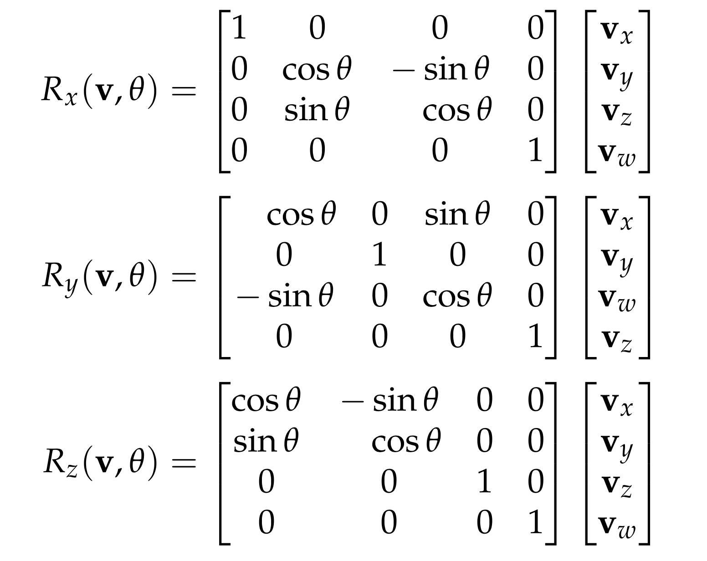

# [CS-211] Informatique Visuelle

## 1. From 3D to 2D

### Linear transformation matrices

**2D transformations :** $\quad \vec{p}' = M \vec{p}$
$$
M_{SCALING} = 
\begin{pmatrix}
2 & 0 \\
0 & 2
\end{pmatrix}

\\

M_{ROTATION} = 
\begin{pmatrix}
\cos{\theta} & -\sin{\theta} \\
\sin{\theta} & \cos{\theta}
\end{pmatrix}

\\

M_{SHEAR} = 
\begin{pmatrix}
1 & c \\
0 & 1
\end{pmatrix}
$$

**2D translation :**
$$
\begin{pmatrix} p_x' \\ p_y' \\ 1 \end{pmatrix} = 

\begin{pmatrix}
1 & 0 & t_x \\
0 & 1 & t_y \\
0 & 0 & 1
\end{pmatrix}

\begin{pmatrix} p_x \\ p_y \\ 1 \end{pmatrix}
$$

**3D transformations :**

Most of them are similar to 2D, except rotations

#### Camera models

There are two camera models : **orthographic** and **perspective**

## 2. Interaction styles

Voici les principaux styles d'interaction :

- Langage de commande (Terminal)
- WIMP (finder)
- Manipulation directe (drag & drop)
- Formulaires
- Réalité virtuelle (Minecraft, simulation d'un appartement, ...)
- Tangible (graspable)
- Réalité augmentée (superpose une information sur la réalité en temps réel)
- Contrôle vocal
- Contrôle gestuel
- Contrôle cérébral
- Interface bioniques (bras robotiques)
- Wearable (apple watches, exosquelettes, ...)
- Ambiant

## 3. Animation

### Animation paradigms

- Squash and stretch (ball animation)
- Staging
- Follow through and overlapping actions
- Pose-to-pose animation
- Arcs (gesture in arcs)
- Exaggeration (Jerry hitting Tom with a pan)
- Secondary action (cut something with a knife (second action) while saying "No! I'm not angry at you!")
- Appeal (use characters that the audience loves)

### Types of animations

- Descriptive animation (the animator fully controls the animation) :
  - (+) Complete control over the animation
  - (-) A lot of work
  - (-) Can be hard to create something realistic
- Interpolation
- Simulation (rigid bodies, articulated bodies, deformable bodies, unstructured bodies (fluids, plasticity))
- Motion capture

## 4. Vision humaine

### Oeil

- Pupille : règle la quantité de lumière qui rentre dans l'œil

- Cristallin : s'occupe de faire le zoom in/out

- Rétine : endroit où les images arrivent

  - Macula : petit renfoncement dans la rétine
    - Fovéa : partie au centre de la macula : très dense en récepteurs de lumière
    - Il y a deux sortes de récepteurs de lumière : les **cônes** et les **batonnets**
      - Les cônes (très denses) sont situés au centre de la fovéa
      - Les batonnets sont situés en périphérie des cônes

- Il y a un point aveugle dans l'oeil : un endroit où il ne voit pas

  

| Cônes                               | Batonnets                      |
| ----------------------------------- | ------------------------------ |
| situés au centre de la fovéa        | situés autour des cônes        |
| peu nombreux (6.5 millions)         | très nombreux (130 millions)   |
| 3 types (Rouge, Vert, Bleu)         | 1 seul type (Niveaux de gris)  |
| peu sensibles à la lumière          | très sensibles à la lumière    |
| un peu lents (3-4 images / seconde) | rapides (100 images / seconde) |

---

### Cerveau

> "On voit avec le cerveau"

- permet de percevoir des séries d'images comme un mouvement : effet beta (ou effet phi) => le cerveau crée un mouvement qui n'existe pas avec une suite d'images
- Priming effect

---

### Créer l'effet de profondeur en 2D

- Perspective
- Parallax
- Kinetic depth (faire bouger une image particulière nous donne l'impression qu'elle est en 3D)
- Occlusion (objets qui en cachent d'autres, ombres sur des objets plus lointains)
- Taille relative (un arbre au loin est plus petit qu'un arbre à 10 mètres)
- Rendering (lumière, texture, ombre)
- Finesse de la texture (les éléments proches sont plus détaillés)
- Brouillard de distance (dans les jeux, on met du brouillard sur les paysages lointains)

## 5. Cognition

- Mémoire à long terme : 3+ heures
- Mémoire à court terme : 2-3 heures

La capacité de notre mémoire de travail (CPU) est limitée à ~ 7 éléments. On appelle cela la **charge cognitive**. Elle peut être mesurée de plusieurs manières :

- Mesures physiologiques : mouvements oculaires, fréquence cardiaque, ...
- Mesures subjectives : questionnaire après la tâche
- Mesures de performances : dual task (deux tâches en même temps)

Le **Split Attention Effect** augment la charge mentale (e.g: dans un exercice de résolution de triangles, une solution où la méthode de résolution pour trouver les angles est directement inscrite dans le triangle engendrera moins de "demande cognitive" qu'une solution avec la méthode de résolution expliquée en français en dessous du triangle)

Alors combien d'informations est-il optimal de présenter dans un seul écran? $\implies$ _Le moins possible_

La charge cognitive va aussi être altérée avec, par exemple, l'expérience que l'on a avec une certaine application (dans le cas d'une app), ou alors avec la manière avec laquelle est affiche les informations (imagine l'app CFF qui retourne les résultats comme en RAW dans un .txt)
$$
\text{Charge cognitive} = \frac{\text{Quantite d'information}}{\text{Niveau d'expertise x Qualite du design}}
$$

L'écran est une extension de la mémoire de travail s'il présente simultanément l'ensemble des informations nécessaires à réaliser la tâche. On appelle cela la **cognition distribuée** (une partie de la charge de travail distribuée à un outil). Ici, un bûcheron ne peut couper un arbre seulement s'il excède un certain diamètre: pour diminuer la charge cognitive de prendre son mètre, calculer la circonférence et diviser par $\pi$, il a décidé de marquer son mètre tous les $\pi$. De cette manière, il n'a plus qu'a enrouler le mètre autour de l'arbre et de regarder le résultat inscrit

La mémoire à long terme est divisée en deux parties :

- les **connaissances déclaratives** : e.g. dites à un enfant : "le carré de l'hypothénuse d'un triangle rectangle vaut la somme des carrés des deux cathètes" ou "pour skier, fais passer ton centre de gravité plus vers l'avant" :
  - **mémoire sémantique** : Faits, concepts, définitions, modèles mentaux (la représentation que l'on a de quelque chose: un prof, un geek, un allemand, un avion, ...), ...
  - **mémoire épisodique** : Evénements passés ou imaginés
- les **connaissances procédurales** : e.g, essayez d'expliquer comment nouer ses lacets en parlant... Nouer ses lacets, changer de vitesse, ... sont des connaissances procédurales

Induction et discrimination : Voici des exemples et des contre-exemples de _Spook_, définissez ce qu'est un spook $\implies$ L'**induction** est le fait de créer un set de règles à partir d'exemples (e.g. s'il on rencontre 5 parisiens sympathiques, on aura l'idée que les parisiens en général sont sympathiques)

*Note* : L'induction (paticulier $\rightarrow$ général) est l'inverse de la déduction (général $\rightarrow$ particulier)

*Note* : L'analogie est le fait de passer d'un particulier à un autre (voir un spook reconnaître un nouveau spook à partir des exemples donnés)

La **métacognition** est la capacité de réfléchir sur notre propre raisonnement (e.g : Un bus peut contenir $20$ personnes. Si $90$ personnes doivent être transportées, de combien de bus avons nous besoin? La réponse est bien entendu $5$ alors que le résultat de la division $90 / 20$ vaut $4.5$) mais aussi le fait d'avoir la connaissance de nos connaissances ("je ne suis pas bon pour mémoriser les noms", "je suis prêt pour l'examen", "pour des problèmes de physique, je préfère faire un schéma", ...)

## 6. Visualisation de l'information

- **Visualiser** : 
  - Placer des données sur une image de base de telle sorte que les propriétés visuelles de l’image reflètent  les propriétés abstraites des données, en particulier les relations entre données
  - Créer une **grammaire visuelle** qui met en correspondance les variables des données et les composantes graphiques

Si les données sont trop compliquées (exemple : 26 composantes (axes) à représenter sur un graphe...), on peut utiliser PCA (principle component analysis) pour ne garder que "le plus important"

Lorsque l'on crée un graphe, il est important de garder à l'esprit plusieurs points :

- Choisir des unités qui conservent du sens à travers les comparaisons (e.g. on ne peut pas toujours comparer avec le prix, puisque la monnaie n'a pas la même valeurs suivant les pays (s'il on fait une comparaison sur les pays))
- Choisir des unités qui ont du sens pour le lecteur
- Choisir des intervalles pertinents (montrer tous les âges sur l'axe des X ou plutôt les grouper par groupe de 5?) et évaluer les effets du choix des intervalles (choisir des intervalles de 5 ans commençant à 20)

- Vérifier **l'intégrité graphique** (le fromage de droite est trompeur, il semblerait que la partie beige est plus grande qu'elle ne devrait l'être...)

- Minimiser le **chart junk** (éviter les éléments qui n'apportent pas d'informations et risquent de bruiter le message)

- Optimiser le **data ink ratio** (quel pourcentage des pixels correspond à une donnée? (si on l’efface, on perd de l’information))

- Montrer le contexte

  
 

Des fois, on est obligés de **tricher** pour montrer ce que l'on veut 

- (e.g. représenter la terre (sphère) sur une carte, plan du métro de Paris "normalisé" pour que tout tienne sur la page)
- **Jitter** : ajouter un bruit aléatoire aux données pour rendre tous les points visibles

## 7. Image processing

**Computer vision** is divided into three parts :

- **Image processing** : Edge detection, Line extraction, Filtering, Color conversion, ...
- **3D reconstruction** : Structure from motion, Nonrigid surface reconstitution, SLAM, Human pose estimation
- **Visual understanding** : Image recognition, Object detection, Semantic segmentation, Video captioning

Let's talk about edge detection first

- Un **edge** est une limite entre deux régions d'une image 
- Une **region** est une région homogène entre des edges

Pour détecter des edges, on veut trouver des **discontinuités** entre les objets dans l'image

On peut décrire un edge de plusieurs manières :

- Edge normal : Unit vector in the direction of maximum intensity change
- Edge direction : Unit vector perpendicular to the edge normal
- Edge position or center : Image location at which edge is located
- Edge strength : Speed of intensity variation across the edge

Pour trouver les edges dans une image, on utilise la notion de **gradient d'une image** (pour un signal, on calcule sa dérivée première). Un changement rapide dans l'image correspond à un gradient local élevé. Par exemple, avec une dimesion :
$$
\frac{df}{dx} \approx
\frac{f(x+dx) - f(x)}{dx} \approx
\frac{f(x+dx)-f(x-dx)}{2dx}
$$
Le **gradient d'une image**
$$
\Delta I = \bigg[\frac{\delta I}{\delta x}, \frac{\delta I}{\delta y} \bigg]
$$
pointe dans la direction de changement d'intensité la plus rapide. Cette fois, c'est en deux dimensions :
$$
\frac{df}{dx} \approx
\frac{f(x+dx, y) - f(x, y)}{dx} \approx
\frac{f(x+dx, y)-f(x-dx, y)}{2dx}
\\
\frac{df}{dy} \approx
\frac{f(x, y+dy) - f(x, y)}{dy} \approx
\frac{f(x, y+dy)-f(x, y-dy)}{2dy}
$$
On peut ensuite mesurer le constrast
$$
G = \sqrt{\frac{\partial I^2}{\partial x} + \frac{\partial I^2}{\partial y}}
$$
Ainsi que l'orientation de l'edge
$$
\theta = \arctan(\frac{\partial I}{\partial x}, \frac{\partial I}{\partial y})
$$

Problem : High frequencies lead to trouble with differentiation. Solution : Suppress high frequencies by processing the Fourier transform of the signal or convolving the signal with a low-pass filter. Ci-dessous, un exemple de convolution (l'image de base était **noisy**, on ne pouvait _juste_ calculer son gradient)

Un autre type de lissage peut utiliser le **filtre de Prewitt and Sobel**

On utilise assez fréquemment un **filtre gaussien** qui élimine les high frequency noise ($\sigma$ représente à quel point la courbe est "pointue")
$$
g_2(x, y) = \frac{1}{2 \pi \sigma^2} \exp(-(x^2 + y^2) / 2 \sigma^2)
$$
Note : on peut faire une convolution 2D avec deux convolutions 1D
$$
g_1(x) = \frac{1}{\sqrt{\pi} \sigma} \exp(-x^2 / \sigma^2) \\
g_2(x, y) = g_1(x) \cdot g_1(y)
$$
Note : la partie de droite est plus rapide à calculer
$$
\frac{\partial}{\partial x}(g *f) = \frac{\partial g}{\partial x} * f
$$

## 8. Shape and blob detection

There are two types : parametric shapes and blobs

### Parametric shape detection

*Idea*: cut the image into small pieces. Each cut will **vote** for an edge it sees. We keep the edges that have been voted the most

This idea is called the **Hough transform** for lines and works as follows :

1. Obtain **binary edge points** (gradient, threshold). E.g. we compute the gradient magnitude with Sobel and then threshold the get a **binary edge map** //TODO
   $$
   dst(x, y) = 
   \begin{cases} 
         maxVal \\
         \frac{100-x}{100} & 0\leq x\leq 100 \\
      \end{cases}
   $$

2. Obtain **candidate lines** (voting, accumulator)

   Polar formulation for a line :
   $$
   r = x \cos \theta + y \sin \theta
   $$
   If multiple points form a line, mapping their parameters ($\theta, r$) will result in an intersection

   

   To detect where the intersection is, we cut the sinusoid graph in multiple chuncks. We add 1 to the chunck (called **bin**) when we "draw" the line on the graph. We call that an **accumulator**

3. Select the final line (non-max suppression, local maxima)

   

   - **local maxima** : pixel location whose value is bigger than any of its neighbouring values
   - **non-max suppression** : keep local maxima that are large enough

---

### Hough transform for general shapes

> Note : Hough transform works for ANY shape for which we have a parametric representation

Equation of a circle :
$$
(x - x_0)^2 + (y-y_0)^2 = r^2
$$
Therefore, we have an accumulator with 3 parameters ($x_0, y_0, r$)

We could do the same for an ellipse :
$$
\frac{(x-x_0)^2}{a}+\frac{(y-y_0)^2}{b}=1
$$
Therefore, we have an accumulator with 4 parameters

For an arbitrary shape, we want to first encode it in the form of an **R-table** (set of possible positions of a reference point given boundary orientation)

1. Make an R-table for the shape to be located

   

2. Form an accumulator array of possible reference points initialized to zero

3. For each edge :

   - Compute the possible centers, that is, for each table entry, compute 
     $$
     x = x_e + r_\phi \cos(\alpha(\phi)) \\
     y = y_e + r_\phi \sin(\alpha(\phi))
     $$

   - Increment the accumulator array

**Note** : Hough transform is robust, but not flexible! Computational cost grrows exponentially with the number of model parameters. It only works for objects whose shape can be defined by a small number of parameters

---

### Blob detection

Example : how many apples on this tree?

Color segmentation :

- L'espace **RGB** est un **espace additif** (Red, Green, Blue)

- L'espace **HSV** est un **espace intuitif** (Hue, Saturation, Value)

---

### Blob detection : a simple strategy

1. Color segmentation (RBG, HSV) : create a binary image holding the area of interest
2. Connected components : connect the pixels to form blobs
   1. Get the neighbouring elements of the current element (grid 3x3 around the element)
   2. If there are no neighbour, uniquely label
   3. Find the neighbour with the smallest label and assign it
   4. Continue and finish the first pass
3. Do a second pass replacing each id with the smallest equivalent ID

This method is simple, but not perfect :

- some apples are "merged" together
- only works for objects with distinctive colors

---

### Scale space blob detection

works better than our simple strategy. Uses Laplacian

$\implies$ see slides

---

### Semantic segmentation

The simple solution would be to use a **classifier** which looks at the neigbours of a pixel, and classify them individually. We could use a **Markov Random field** to improve which connects each pixel to its neighbour and encourage smoothness in the labeling. For an even better segmentation, we use a **multi-scale CRF** which looks a bit more around the local neighbouring 

We could also use a **dense CRF** which connects each pixel to every other pixel and benefits from long range connections

Finally, we could also use a **fully-convolutional neural network**

Finally, a last method could be **weakly-supervised** : we give a bunch of classes that are on a picture (e.g. Road, car, building, tree, grass, sign, ...)

## 9. Mécaniques de jeu

**3 modèles :**

- Pay to play
- Free to play
- Pay to win

Quelle différence y a-t-il entre un jeu et un jouet?

- Jeu : les buts et règles sont inventés par le concepteur du jeu
- Jouet : le joueur invente ses propres buts

### Caractéristiques des jeux

- **Espace** :

  - discret : monopoly, échecs, ...
  - continu : billard, war, ski, course voitures, ...

  Structuré de différentes manières : linéaire (super mario), grille (minecraft), web (Zork) ou partition (civilisation)

  On se repère dans l'espace au moyen de plusieurs outils : boussole, carte, landmarks (repères), ...

- **Temps** :

  - discret : tour
  - continu : horloge, sablier, ...

- **Objets** (comment sont représentés les objets dans un jeu)

- **Personnages & avatars **:

  Question de réalisme : "The uncanny valley" :

  - quand on a un avatar qui ne ressemble pas du tout à un humain (wall E), tout va bien
  - lorsqu'on essaie de "recréer" un humain et que ce n'est pas parfait, quelque chose semble clocher, être faux

- **Actions** (jump, run, drop, speed up, buy, ...)

- **Règles**

- **Modes** (des règles différentes s'appliquent pendant différentes phases de jeu)

- **Skills** (équilibre en les compétences du joueur et celles de son personnages)

- **Chance**

- **Point de vue** (position de la caméra) :

  - caméra fixe : Zelda
  - Top down (vue aérienne)
  - Scroll latéral : Mario
  - Bird eye : Civilisation
  - First person : Overwatch
  - Over the shoulder (vue depuis l'épaule de l'avatar)
  - Caméra "lock-on" : mode Z de OoT (cible un ennemi)
  - Radar : Factorio map
  - Caméra contrôlable : Super mario 64

- **Vue** (choisir la meilleure vue au meilleur moment)

- **Roles** (différences des règles assignées aux joueurs)

- **Secrets** (qui voit quoi et quand? e.g. who's the murderer?)

- **Collaboration / Compétition**

- **Modélisation mutuelle** (mécanisme permettant au joueur A de prédire ce que va faire le joueur B)

- **Spectateurs** (twitch)

- **Triangularité** (jeu de pierre, papier, ciseaux : bien que ciseau bat papier et papier bat caillou, ciseau ne bat pourtant pas pierre)

- **Echapper à la réalité** (être dieu, un poisson, un milliardaire, un assassin, ...)

- **Scoreboard**

"Gamification" : utilisé pour transformer une activité "non-ludique" en activité ludique (e.g. faire avancer un petit cheval chaque fois qu'un enfant répond correctement à une table de multiplication)

### Pourquoi un jeu marche?

- L'Oeuf de Colomb : avoir l'idée toute simple à laquelle personne n'avait pensé
- Le flow : état mental d'une personne totalement "prise dans le jeu", immergée dans ce qu'elle fait

## 10. Usability

### Comment savoir si mon jeu est bien conçu?

Des gurus du computer design (Ben Schneiderman, Jakob Nielsen et Don Norman) ont établi des "règles d'or" constituant les principes du design

- Ben Schneiderman
  1. Consistency dans l'interface
  2. Use of shortcuts
  3. Offer informative feedback (j'ai bien effacé le fichier demandé, barre de téléchargement d'un fichier)
  4. Offer informative micro-feedback (changement de curseur sur un lien cliquable in browser)
  5. Design dialog to yield closure (plusieurs steps dans un processus dans lesquels on peut facilement naviguer (e.g. commande sur Amazon lors du paiement))
  6. Offer simple error handling
  7. Allow reversal of actions (undo)
  8. Support internal locus of control ("La limite de temps a été dépassée" => énervant lorsqu'on réserve un billet d'avion et qu'on doit recommencer)
  9. Reduce short-term memory load (max 7 +- 2 infos on the screen)
- Jakob Nielsen
  1. System status (status bar)
  2. Match between system and the real world
  3. User control and freedom
  4. Consistency and standards
  5. Error prevention
  6. Recognition rather than recall (cognitive load)
  7. Flexibility and efficiency of use (shortcuts)
  8. Aesthetic and minimalist design
  9. Help users recover from errors
  10. Help and documentation
- Don Norman
  1. Consistency : Détecter et appliquer des patterns
  2. Visibility (all actions visibles)
  3. Affordance : la forme de l'objet nous explique comment l'utiliser (tourner, enfoncer, flipper, ...)
  4. Mapping : lien entre action et son effet évident
  5. Feedback
  6. Constraints (e.g. une grille de dessin avec l'option "snap to grid")

Deux problèmes :

- Les principes sont partiellement contradictoires (montrer toutes les options possibles <=> minimiser les informations à l'écran)
- Les principes ne sont pas des solutions

Solution :

- Il faut **tester** son GUI sur des sujets de test (utilisateurs) :
  - Learnability : cb de temps un novice a-t-il besoin pour manipuler le logiciel
  - Efficiency : cb de temps nécessaire pour faire la tâche qu'il veut faire
  - Memorability : est-il facile d'y revenir si l'utilisateur ne l'utilise pas pendant un certain temps
  - Errors : cb d'erreurs
  - Satisfaction : est-ce agréable d'utiliser l'app

## 12. Eye tracking

- Eye-mind hypothesis : ce que je regarde = ce que je traite

mesurer la position de l'oeil :

- Electro-oculogramme : différence de potentiel entre la rétine et la cornée
- Méthodes optiques (led infrarouges) : détecte la réflexion sur la cornée (GLINT)

Utilité du tracking de l'oeil :

- Pédagogique : les élèves qui suivent les yeux du prof (recorded par un eye tracker) comprennent mieux la matière
- Marketing : quelle partie du rayon les clients regardent-ils?
- Sécurité : détecter les pertes d'attention (e.g. les pilotes d'avions, conducteurs, ...)
- Education : détecter le niveau d'expertise d'un individu
- Groupware : quantifier la qualité de l'interaction entre deux personnes
- Groupware : montrer le regard du partenaire (e.g. dans un jeu coop)
- Interface : contrôler une interface avec le regard

## 13. Etudes utilisateurs 

Comment savoir si une interface de type X est plus efficace qu'une interface de type Y ?

On compare la **variable dépendante** entre les deux interfaces (score, vitesse, #erreurs, plaisir, longévité, apprentissage, ...). Le type de l'interface est appelé la **variable indépendante**

On peut réaliser le test de plusieurs manières (deux **plans expérimentaux**) :

- **between subjects** : un groupe teste l'interfeace A, un autre groupe l'interface B
- **within subjects** : un groupe teste l'interface A puis l'interface B, l'autre l'inverse
  - besoin de moins de sujets
  - résultats assez compliqués
- **between subjects** à deux dimensions : e.g. on a deux interfaces (A, B) et trois niveaux des utilisateurs (novice, intermédiaire, expert). Il faut donc $2 \times 3=6$ groupes pour réaliser le test
- **between subjects** à $\ge3$ dimensions : ...
  - demandent beaucoup de sujets
  - produit des résultats difficiles à interpréter

Un **effet d'interaction** : effet de la VI-1 (variable indépendante 1) sur la VD (variable dépendante) dépend de la valeur de VI-2

Attention aux **biais expérimentaux** (conditions initiales équivalentes pour tous les groupes, objectivité du testeur, un élément non-contrôlé a-t-il pu influencer les résultats, ...). Finalement, attention aux effets suivants :

- Effet **Hawthorne** : le simple fait de participer à une expérience a une conséquence importante en terme de motivation
- Effet **Pygmalion** : la performance des sujets est fonction des attentes de l'expérimentateur

Il est donc utile de faire des expérience avec des méthodes en **double-aveugle** (ni l'expérimentateur, ni le sujet ne savent quel traitement est utilisé : e.g., on calcule la performance physique de quelqu'un en lui donnant différentes pilules (certaines le booster, d'autres sont placébo)). Ces expériences sont faciles à faire par exemple en médecine, mais plus dures pour nous en HCI

