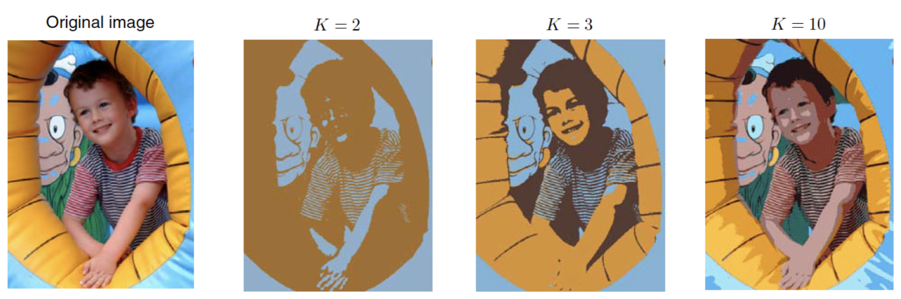
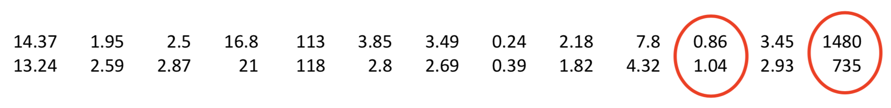

# [CS-233] Summary Machine Learning

[TOC]

## 1.	Introduction

**What is machine learning?**

- **Machine Learning** is the science of getting computers to learn and **act like humans** do, and **improve** their learning over time in autonomous fashion, by feeding them data and information in the form of observations and real-world interactions
- Machine learning algorithms seek to provide knowledge to computers through data, observations, and interaction with the world. It is then used to make **accurate predictions** given new observations
- Machine Learning is applied **statistics**

---


**Input : What data?**

| Data type   | Description                                                  |
| ----------- | ------------------------------------------------------------ |
| Attributes  | Data base, excel sheet, ...                                  |
| Text        | Movie review, Youtube commentaries, ...                      |
| Speech      | Sample of someone speaking                                   |
| Images      | [MNIST dataset](https://en.wikipedia.org/wiki/MNIST_database), ... |
| Data sample | ONE line of a data base (also called **example** or **point**), ONE image, ... |
| Data set    | Collection of multiple data samples                          |


- **Unsupervised data** : Each sample consists only of an observation, e.g., an image (without information about its content)
- **Supervised data** : Each sample comes with additional annotations, e.g., category label. There are two sets, the training set and the test set. They should never be mixed and inputs from the test set should not be used for the training part of the algorithm

---


**Output : What insight?**

- Understanding of a phenomenon
- Precise, concrete prediction. E.g., the category depicted by an image ([image recognition](http://scs.ryerson.ca/%7Eaharley/vis/fc/))
- [Text analysis](https://natural-language-understanding-demo.ng.bluemix.net)
- Image recognition ([Image captioning](https://azure.microsoft.com/en-us/services/cognitive-services/computer-vision/))
- Image recognition ([Human pose estimation](https://storage.googleapis.com/tfjs-models/demos/posenet/camera.html? source=post_page---------------------------))
- Image to image translation ([link](https://affinelayer.com/pixsrv/))
- Data visualisation ([link](http://colah.github.io/posts/2014-10-Visualizing-MNIST/))

---


**What algorithms?**

- **Supervised learning**
  - Relies on supervised data
  - The annotations typically correspond to the desired insight
  - Process :
    - Stage 1: **Training**: Use data with labels to optimize model parameters
    - Stage 2: **Testing**: Predict the output for a *new* data sample
- **Unsupervised learning**
  - Relies on unsupervised data
  - The goal is rather to analyze the observed data set
  - Process :
    - A single stage: Transform the data for further analysis (input data -> transformation -> transformed data)
  - Example : **Clustering** (identify groups without performing any data transformation)
- **Reinforcement learning**
  - Learn to react to the environment
  - Not covered in this course


##2.	Data representation

###2.1	Bag of words : "Bow" (for text)

**Idea** : For each sample, count the numbers of times each word in the dictionary appears

```python
(1) John likes to watch movies. Mary likes movies too.
(2) John also likes to watch football games.

BoW1 = {"John":1, "likes":2, "to":1, "watch":1, "movies":2, "Mary":1, "too":1}
BoW2 = {"John":1, "also":1, "likes":1, "to":1, "watch":1, "football":1, "games":1}
```

To "represent" those 2 texts, we only consider words that appear in the dataset (not the entire English dictionary)

```python
"John", "likes", "to", "watch", "movies", "Mary", "too", "also", "football", "games"
```

We can also remove the "too common words" such as `the`, `a`, `to`, `it`, `is`, `for`, ...

```python
"John", "likes", "watch", "movies", "Mary", "too", "also", "football", "games"
```

With $D$ words in the dictionary, each sample can be represented as a vector in $\R^D$. In our example, the BoWs become

```python
x1 = [1 2 1 2 1 1 0 0 0]
x2 = [1 1 1 0 0 0 1 1 1]
```

We can also encode the proportion of each word (so that two texts of different sizes can be compared more easily). We do that by dividing each vector element by the sum of all elements, e.g. $\sum_{d=1}^D x_1^{(d)} = 8$

```python
x1 = [1/8 1/4 1/8 1/4 1/8 1/8 0 0 0]
```

This final representation is called an **histogram** (st. $x_1^{(d)} \in [0,1]$ and $\sum_{d=1}^D x_1^{(d)} = 1$)


###2.2	Visual dictionary (for images)

**Idea** : extract patches from all images. Some patches look similar, we them cluster the patches based on similarity to obtain prototypes that act as a dictionary words. The center of each cluster is taken as a visual word

- for each patch in a image :
  - find the nearest visual word
  - add one to the corresponding element in a BoW vector (extend the length of one of the 4 bars in the diagram below for the corresponding image)


## 3.	Before the calculation

###3.1	Data pre-processing

Even with a good representation, the data might benefit from being pre-processed, e.g.

- some attribute values are missing
  - E.g. the Air Quality UCI dataset contains missing values, which are tagged with a -200 [°C] value
- some attribute values are noisy (random mesurement error, human error, corruption, duplicate entries, ...). Can be "cleaned" with :
  - Binning
  - Clustering (detect values that are very far from what it should be (isolated) and remove them)
  - Human knowledge (e.g. salary cannot be negaive, -500 [°C] is impossible, ...)
- the feature dimensions are of incommensurate magnitudes


###3.2	Data normalisation

Idea : Scale each attribute dimension to fall within a specified range (formulas can be found in the slides (lecture 2, page 37 and onwards)) //TODO FORMULAS

- Min-max normalisation
- Z-score normalisation
- Max normalisation
- Normalisation by decimal scaling


## 4.	Classification algorithms

### 4.1	K-means clustering

Given a set of input samples, group the samples into K clusters (K is assumed to be known/given)


#### 4.1.1	Preliminaries

**Notation**

Let us denote the i<sup>th</sup> data sample in the collection of $N$ samples as $x_i \in \R^D$ a vector of dimension $D$, i.e.,
$$
x_i = 
	\begin{pmatrix}
				x_i^{(1)}\\
				x_i^{(2)}\\ 
				\vdots\\
				x_i^{(D)}
  \end{pmatrix}
$$
In practice, one data sample is often a point in a high dimensional space. So one cannot visualize real data as a point cloud

Here, $x^i$ is one human pose. If a human pose is defined as a skeleton with 12 joints (wrists, elbows,...), and each joint is a 2D point, then $D = 2 ⋅ 12 = 24$


---


**Euclidian distance**

Euclidian distance between 2 points $x_i \in \R^D$ and $x_j \in \R^D$
$$
d(x_i, x_j) = ||x_i - x_j || = \sqrt{\sum_{d=1}^D (x_i^{(d)} - x_j^{(d)})^2}
$$


---


**Mean of a set of points**

Mean of a set of points $\{x_1, \dots, x_N\}, \, x_i \in \R^D$
$$
\mu = \frac{1}{N} \sum_{i=1}^N x_i \qquad \mu \in \R^D
$$
In essence, the center of a set of points


---


**Goal of K-means clustering**

Idea : identify $K$ groups of data points given $N$ samples $\{x_1, \dots, x_N\}, \, x_i \in \R^D$

- The distances between the points within a cluster should be small
- The distances across clusters should be large

This can be encoded via distances to cluster centers $\{\mu_1, \dots, \mu_K\}$


In the example below, $K=4$ and $D=2$


####4.1.2	Algorithm ([example](http://stanford.edu/class/ee103/visualizations/kmeans/kmeans.html))

1. Initialize $\{\mu_1, \dots, \mu_K\}$ (e.g., randomly)
2. While not converged :
   1. Assign each point $x_i$ to the nearest center $\mu_K$
      1. For each point $x_i$, compute the Euclidean distance to every center $\{\mu_1, \dots, \mu_K\}$
      2. Find the smallest distance
      3. The point is said to be assigned to the corresponding cluster (note that each point is assigned to a single cluster)
   2. Update each center $\mu_K$ based on the points assigned to it
      1. Recompute each center $\mu_K$ as the mean of the points that were assigned to it


> The algorithm is guaranteed to converge to a stable solution, where the cluster centers and the point assignments are fixed, i.e., do not change as more iterations are performed

> **Importantly**: While the algorithm always converges, it does not always converge to the best (desired) solution


#### 4.1.3	Example

Example from (Bishop's book, Chap. 9.1)

- Consider a single image
- Each pixel corresponds to a data point
- Each pixel is encoded by its RGB color, i.e., $x_i \in \R^3$
- We seek to cluster the pixels according to their color




####4.1.4	Problems with K-means clustering

The Euclidean distance works well for data with homogeneous dimensions, let's see a counter example


**Wine dataset from the UCI ML repository**

Each wine is represented by 13 attributes, two samples from the dataset :



Large values will contribute a lot to the Euclidean distance and small ones much less but it does not mean that they are less meaningful for clustering! (**accuracy : 70.3%**)

---


**Solutions**

- E.g., subtract the smallest value in each dimension and divide by the largest. This yields values between 0 and 1 (**accuracy : 93.2%**)
- Use another distance measure, e.g. L<sup>1</sup> distance (**accuracy : 94.5%** with L1 and scaled data)

$$
L^1(x_i,x_j) = \sum_{d=1}^D |x_i^{(d)} - x_j^{(d)}|
$$


### 4.2	Nearest neighbor

**Idea** : similar data samples have the same label


####4.2.1	Preliminaries

**Classification vs Regression**

- **Classification** predicts a label for a given sample (e.g. recognise an image of a cat)
  - Error metric : Percentage of test samples whose predicted label does not match the ground-truth one
- **Regression** predicts continuous value(s) for a given sample (e.g. human pose estimation from an image, age of a seashell from a list of attributes)
  - Error metric : (square root of the) average squared distance between the predicted quantity and the ground-truth one

---


**Notation**

Let us denote the i<sup>th</sup> data sample (input) in the collection of $N$ samples as $x_i \in \R^D$ a vector of dimension $D$

We denote the i<sup>th</sup> label (output) in the collection of $N$ samples as $y_i$

- for classification, $y_i$ is typically a single discrete value (image recognition)
  - In the maya glyph example, $x_i$ is a grayscale image. If it has height $H$ and width $W$, then $D=H \cdot W$
  - Then, $y_i$ is a single discrete value indicating the type of glyph (e.g., $y_i = 4$ (<sup>th</sup> category))
- for regression, $y_i$ can be a single continuous value (age of seashell), or a vector (human position)
  - In the human pose example, $x_i$ is a color image. If it has height $H$ and width $W$, then $D=3 \cdot H \cdot W$ (3 color channels (RGB)) //TODO modify error : hp
  - Then, $y_i$ is a human pose. If a human pose is defined as a skeleton with 12 joints (wrists, elbows, ...), and each joint is a 2D point, then $D=2 \cdot 12 = 24$

---


**Distances useful to create histograms** //TODO FORMULAS

- euclidian distance
- chi-square distance


####4.2.2	Algorithm

1. Compute the distance between the test sample $x$ and **all** training samples $\{x_i\}$
2. Find the sample $x_{NN}$ with minimum distance
3. Assign the corresponding label/value $y_{NN}$ to the test sample


###4.3	k-Nearest neighbors

####4.3.1	Algorithm [example](http://vision.stanford.edu/teaching/cs231n-demos/knn/)

*(L2 distance : Euclidian distance)*

- **Classification** :

  1. Compute the distance between the test sample $x$ and **all** training samples $\{x_i\}$ (same as NN)
  2. Find the $k$ samples $\{x_{NN1}, ..., x_{NNk}\}$ with minimum distances
  3. Find the most common label among these $k$ nearest neighbors
  4. Assign the corresponding label $y_{MV}$ to the test sample

  > if several labels appear the same number of times among the k-NN, one strategy consist of taking the one whose samples have the smallest average distance to the test sample

- **Regression** :

  1. Compute the distance between the test sample $x$ and **all** training samples $\{x_i\}$ (same as NN)
  
  2. Find the $k$ samples $\{x_{NN1}, ..., x_{NNk}\}$ with minimum distances
  
  3. Compute the value $\hat y$ for the test sample based on that of these k-NN. Two strategies :
   - use the average of the k-NN values $\{y_{NNi}\}$
     
     $$
     \hat y = \frac{1}{k} \sum_{i=1}^k y_{NNi}
     $$
     
  - use a weighted average of the k-NN values, based on the inverse distances
  

$$
\hat y = \frac{1}{\sum_{i=1}^k w_{NNi}} \sum_{i=1}^k w_{NNi} \, y_{NNi} \qquad \qquad with \space w_{NNi} = \frac{1}{d(x_{NNi}, x)}
$$


####4.3.2	Examples

- MNIST classification (input : hand-drawn number, output : what number it is)
- Predict fuel consumption for cars given 8 attributes such as cylinders, horsepower, weight, ...
- Predict age of abalone from 11 attributes such as sex, length, diameter, ...


####4.3.3	Properties

- Curse of dimensionality : in the real world, data representation ten to be high dimensional. In such dimensions, all points tend to be far apart (and the algorithm starts being unreliable)
- Computationally expensive (need to compute the distance to all training samples for each test sample)
- Results depend on the value $k$


## 5.	Regression algorithms


| Algorithm                    | Upside                              | Downside                                                     | Example                                                      |
| ---------------------------- | ----------------------------------- | ------------------------------------------------------------ | ------------------------------------------------------------ |
| Validation-set               | very simple                         | wastes data (validation set) + validation may be (un)lucky if we don't have a lot of data |  |
| Leave-one-out (LOOCV)        | No waste of data                    | Expensive                                                    |  |
| $k$-fold (e.g, $k = 3$ here) | slightly better than validation set | More expensive than Validation set method and waste a bit of data |  |
| $N$-fold                     | -                                   | -                                                            | Identical to LOOCV (with $N$ the number of points)           |


### 5.1	Cross-validation

1. Randomly choose, e.g. 30% of the data which will be called the **validation set**
2. The remainder then acts as the **new training set**
3. Perform linear regression on the new training set only
4. Estimate the performance on the test data using the validation set


### 5.2	Leave-one-out cross-validation (LOOCV)

For $i=1,\dots, N$

1. Let $(x_i, y_i)$ be the $i^{th}$ sample
2. Temporarily remove $(x_i, y_i)$ from the training set
3. Perform regression on the remaining $N-1$ samples
4. Computer the error on $(x_i, y_i)$

When done with all points, report the average error


### 5.3	k-fold cross-validation

1. Randomly split the dataset intov $k$ partitions
2. Then (e.g., $k=3$),
   - train on all the points **not** in the 1st partition, compute the errors with the points in the 1st partition
   - train on all the points **not** in the 2nd partition, compute the errors with the points in the 2nd partition
   - train on all the points **not** in the 3rd partition, compute the errors with the points in the 3rd partition
3. Report the average error on all points


## 6.	After the calculation

### 6.1	Overfitting vs underfitting

- for $k =1$, the error is 0 on the training data but large on the test data, this is called **overfitting**
- for a large $k$ value, the error is large on both the training and test data. This is called **underfitting**

<div> </div>
**Examples**

- **Underfitting** : approximating the observations poorly $\implies$ far from the true curve (green)

<div style="text-align:center;">
  
  
</div>

- **Fitting** : approximating the observations well $\implies$ close from the true curve

  

- **Overfitting** : approximating the observations perfectly **BUT** far from the true curve

  


### 6.2	Model evaluation (error metric)

#### 6.2.1	Regression

$\hat{y_i}$ is the prediction for sample $i$ and $y_i$ the corresponding ground-truth value

- Mean squared error (MSE)

$$
MSE = \frac{1}{N} \sum_{i=1}^N (\hat{y_i} - y_i)^2
$$

- Mean squared error (MSE) for vector-valued predictions

$$
MSE = \frac{1}{N} \sum_{i=1}^N ||\hat{y_i} - y_i||^2
$$

- Root mean squared error (RMSE)

$$
RMSE = \sqrt{MSE}
$$

- Mean absolute error (MAE)

$$
MAE = \frac{1}{N} \sum_{i=1}^N |\hat{y_i} - y_i|
$$

- Mean absolute percentage error (MAPE)

$$
MAPE = \frac{1}{N} \sum_{i=1}^N |\frac{\hat{y_i} - y_i}{y_i}|
$$

---


#### 6.2.2	Classification

**Confusion matrix** : Binary case (see slide 64 of lecture 3)

<div style="text-align: center;">
  
  
</div>

**Confusion matrix** : multi-case case


- **Accuracy**

$$
Acc = \frac{TP + TN}{P + N}
$$

​		$\implies$ in our example, $Acc = \frac{200 + 400}{500 + 500} = 0.6$

- **Precision**

$$
Precision = \frac{TP}{TP + FP}
$$

​		$\implies$ in our example, $Precision = \frac{200}{200 + 100} = 2/3$

- Recall

$$
Recall = \frac{TP}{P}
$$

​		$\implies$ in our example, $Precision = \frac{200}{200 + 300} = 0.4$

- **FP rate** (false positive rate)

$$
FP \space rate = \frac{FP}{N}
$$

​		$\implies$ in our example, $FP \space rate = \frac{100}{500} = 0.2$

- **F1 score** (combines precision and recall)

$$
F1 = 2 \cdot \frac{Precision \cdot Recall}{Precision + Recall}
$$

​		$\implies$ in our example, $F1 = 2 \cdot \frac{2/3 \cdot 0.4}{2/3 + 0.4} = 0.5$


**attention, use multiple of them for reliability !!!!!**


**ROC curves**

used for classification when a "score" is given

> See lecture 3, slides 74-76


### 6.3	Adjusting model parameters

We want to find the parameters that give the best predictions. The function that does this is called a **loss function**


**Loss function**

- Let $\bold w$ be a vector containing the *model parameters* to optimize
- Let $\bold{\hat y_i} = f(\bold{x_i}, \bold w)$ be the *prediction* for the $i^{th}$ training sample ($f(\cdot, \cdot)$ is the function to optimize)
- The *loss function* $l(\bold{\hat y_i}, \bold{y_i})$ computes an error value between the prediction ($\bold{\hat y_i}$) and the true value ($\bold{y_i}$)


**Empirical risk**

Given $N$ training samples $\{(\bold{x_i}, \bold{y_i})\}$, the **empirical risk** is defined as
$$
R(\bold X, \bold Y, \bold w) = 
\frac{1}{N} \sum_{i=1}^N l(\bold{\hat y_i}, \bold{y_i})
$$
where $\bold X$ and $\bold Y$ are the matrices concatenating the training samples inputs and labels

During training, our goal is to find the parameters that minimize the empirical risk. $\bold{w^*}$ is the **best parameters**. This is expressed as the optimization problem
$$
\underset{\bold w}\min \frac{1}{N} \sum_{i=1}^N l(\bold{\hat y_i}, \bold{y_i})
$$


#### 6.3.1 Analysis basics

> The derivative of a sum (average) is the sum (average) of the derivatives


**Minimizing a single variable function**

Informally, a **convex function** is a function that has a single global minimum

To minimize a function, we seek a point where the derivative vanishes, i.e. we search for $x^*$ such that 
$$
\frac{df}{dx}(x^*) = 0
$$
This can sometimes be solved in closed form, sometimes however, we can use the following algorithm to converge to a minimum

- Initialize $x_0$ (e.g. randomly)

- While not converged :
  - Update $x_k = x_{k-1} - \eta \frac{df}{dx}(x_{k-1})$

where $\eta$ defines the **step size** of each iteration. Careful not take it too big or it may not converge

Potential convergence criterias :

- Change in function value less than a threshold : $|f(x_{i-1}) - f(x_i)| < \delta$
- Change in parameter value less than a threshold : $|x_{i-1} - x_i| < \delta$
- Maximum number of iterations reached (no guarantee to have reached the minimum)

Careful, while trying to minimize a non-convex function, depending on $\eta$ and $x_0$, the global minimum may not be reached

---


**Minimizing a multiple variable function**

A **convex function** is a function such that for *any* two points on a graph, the line segment between them lies above the function

To minimize a function, we seek a point where the gradient vanishes, i.e. we search for $\bold{x^*}$ such that 
$$
\nabla f(\bold{x^*}) = \bold 0
$$
This is a system of equations which can sometimes be solved in closed form, sometimes however, we can use the following algorithm to converge to a minimum (called the **gradient descent**). We go in the opposite direction op the gradient since it is the "most negative" slope

- Initialize $\bold{x_0}$ (e.g. randomly)

- While not converged :
  - Update $\bold{x_k} = \bold{x_{k-1}} - \eta \frac{df}{dx}(\bold{x_{k-1}})$

where $\eta$ defines the **step size** of each iteration. Careful not take it too big or it may not converge

Potential convergence criterias :

- Change in function value less than a threshold
- Change in parameter value less than a threshold : $||\bold{x_{i-1}} - \bold{x_i}|| < \delta$
- Maximum number of iterations reached (no guarantee to have reached the minimum)

Careful, while trying to minimize a non-convex function, depending on $\eta$ and $\bold{x_0}$, the global minimum may not be reached

---


**Minimizing a function with constraints**

> see lecture 4, slides 66-82


## 7.	Linear Regression

> see lecture 5

Notation for this section :

- $x$ denotes a given input measurement
- $y$ denotes the output that we seek to predict
- $\hat y = f(x, \bold w)$ is our function modelling a ML algorithm


### 7.1	Examples

**[Example](http://digitalfirst.bfwpub.com/stats_applet/stats_applet_5_correg.html) : the line**

- The $y$-intercept $w_0$
- The slope $w_1 = \frac{\Delta y}{\Delta x}$

$\implies y = w_1 x + w_0$


Given $N$ pairs $\{(x_i, y_i)\}$, find the line that passes through these observations. Once the best line for the given $N$ observations is found, a prediction of a new $x$ can be made : $\hat y = w_1^*x + w_0^*$

To be able to do this, we first need to obtain the best line parameters $w_0^*$ and $w_1^*$. We use the notion of squared Euclidean distance
$$
d^2(\hat y_i, y_i) = (\hat y_i, y_i)^2  \implies 
\underset{w_0, w_1}\min \frac{1}{N} \sum_{i=1}^N d^2(\hat y_i, y_i)
$$
Where $\hat y_i$ depends on $w_0$ and $w_1$
$$
R = 
\frac{1}{N} \sum_{i=1}^N d^2(\hat y_i, y_i) =
\frac{1}{N} \sum_{i=1}^N \big(\underbrace{w_1 x + w_0}_{\hat y_i} - \underbrace{y_i}_{y_i}\big)^2
$$

$$
\begin{cases} 
	\large \frac{\partial R}{\partial w_0} = \frac{2}{N} \sum_{i=1}^N (w_1 x_i + w_0 - y_i) \\ 
	\large \frac{\partial R}{\partial w_1} = \frac{2}{N} \sum_{i=1}^N x_i \, (w_1 x_i + w_0 - y_i)
 \end{cases}
$$

To derive the solution, let us first group the parameters $w_0$ and $w_1$ into a single parameter vector $\bold w \in \R^2$
$$
R = \frac{1}{N} \sum_{i=1}^N \bigg(\bold w^T
	\begin{align}
    \begin{bmatrix} x_{i} \\ 1 \end{bmatrix}
  \end{align}
- y_i \bigg)^2
=
\frac{1}{N} \sum_{i=1}^N (\bold x_i^T \bold w - y_i)^2
$$
where $\bold x_i^T = 	\begin{align}
    \begin{bmatrix} x_{i} \\ 1 \end{bmatrix}
  \end{align}$
$$
\nabla R = \frac{2}{N} \sum_{i=1}^N \bold x_i \, (\bold x_i^T \bold w - y_i)
$$
To obtain the solution we search $\bold w^*$ such that $\nabla R = \bold 0$

For that, let us groups all $\{\bold x_i\}$ and all $\{y_i\}$ in a matrix and a vector
$$
\bold X =
\begin{align}
    \begin{bmatrix} \bold x_1^T \\ \bold x_2^T \\ \vdots \\ \bold x_N^T \end{bmatrix}
  \end{align} \in \R^{N \times 2} , \qquad \qquad 

\bold y =
\begin{bmatrix} y_1 \\ y_2 \\ \vdots \\ y_N \end{bmatrix} \in \R^N
$$
and let us define $\bold X_{(1)} \in \R^N$ and $\bold X_{(2)} \in \R^N$ such that $\bold X = [\bold X_{(1)}, \bold X_{(2)}]$

With a few more operations, we get
$$
\bold X^T \bold X \bold w^* = \bold X^T \bold y \implies \bold w^* = 
(\bold X^T \bold X)^{-1} \bold X^T \bold y = \bold X^+ \bold y
$$
where $\bold X^+$ is known as the **Moore-Penrose** pseudo-inverse of $\bold X$


**Example : the plane**

Given $N$ noisy pairs $\{(\bold x_i, y_i)\}$, where $\bold x_i \in \R^2$, find the pairs that best fits these observations

Mathematically, a plane is expressed as
$$
y = w_0 + w_1 x^{(1)} + w_2 x^{(2)} = \bold w^T 
	\begin{bmatrix} x^{(1)} \\ x^{(2)} \\ 1 \end{bmatrix}
$$
In dimension $D$, we can write
$$
y = w_0 + w_1 x^{(1)} + w_2 x^{(2)} + \dots + w_D x^{(D)} = \bold w^T 
	\begin{bmatrix} x^{(1)} \\ x^{(2)} \\ \vdots \\ x^{(D)}\\ 1 \end{bmatrix}
$$
Whatever the dimension, we can write
$$
y = \bold w^T \bold x, \text{ with } \bold x \in \R^{D+1}
$$
Since the output is 1D, we cant use the same least-square loss function as before. The solution, obtained by zeroing out the gradient of the empirical risk is exactly the same as before :
$$
\bold w^* = 
(\bold X^T \bold X)^{-1} \bold X^T \bold y = \bold X^+ \bold y
$$
but now the matrix $\bold X \in \R^{N\times(D+1)}$


### 7.2	Regularized/Ridge regression

The standard way to penalize the complexity of a model is to add a regularizer to the empirical risk. This leads to a new training objective function of the form
$$
E(\bold w) = R(\bold w) + \lambda E_w(\bold w)
$$
where :

- $R(\bold w)$ is the empirical risk
- $E_w(\bold w)$ is the regularizer
- $\lambda$ is a hyper-parameter that defines the influence of the regularizer ($\lambda \ge 0$)


One of the most common regularizer is the sum of squares of the weights
$$
E_w(\bold w) = \bold w^T \bold w
$$
This let's us write regularized linear regression as
$$
\min_{\bold w} \sum_{i=1}^N (\bold x_i^T \bold w - y_i)^2 + \lambda \bold w^T \bold w
$$
This remains a convex function and so we can find the solution by zeroing the gradient
$$
\nabla E = \nabla R + \nabla E_w = 2 \sum_{i=1}^N \bold x_i(\bold x_i^T \bold w - y_i)^2 + 2\lambda \bold w
$$
Grouping the inputs in a matrix $\bold X$ and the outputs in a vector $\bold y$ as before gives the final solution
$$
\bold w^* = 
(\bold X^T \bold X + \lambda \bold I_{D+1})^{-1} \bold X^T \bold y
$$

> **Note** : we can't use the pseudo-inverse anymore


### 7.3	Multi-output linear regression

To predict multiple values, we cannot just have a vector $\bold w$, because the product $\bold w^T \bold x_i$ yields a single value. We therefore use a matrix $\bold W \in \R^{(D+1) \times C}$ st.
$$
\bold {\hat y}_i = \bold W^T \bold x_i =
\begin{bmatrix} \bold w_{(1)}^T \\ \bold w_{(2)}^T \\ \vdots \\ \bold w_{(C)}^T \end{bmatrix} 
\bold x_i
$$
where each $\bold w_{(j)}$ is a $(D+1)$-dimensional vector used to predict one output dimension

We need to slightly modify the loss function
$$
\min_{\bold W} \sum_{i =1}^N ||\bold W^T \bold x_i - \bold y_i||^2 + 
\lambda ||\bold W||_F^2
$$
where $||\bold W||_F^2$ is the **square Frobenius norm** equivalent to the sum of the squre of each value in the matrix $\bold W$
$$
\nabla E = 2 \sum_{i=1}^N \bold x_i(\bold x_i^T \bold W - \bold y_i^T)^2 + 2\lambda \bold W
$$
We can again group the inputs in a matrix $\bold X \in \R^{N \times (D+1)}$ but the outputs now need to be grouped in a matrix as
$$
\bold Y =
\begin{bmatrix} \bold y_1^T \\ \bold y_2^T \\ \vdots \\ \bold y_N^T \end{bmatrix}
\in \R^{N \times C}
$$
Then, following the same strategy as before, we have
$$
\bold W^* = 
(\bold X^T \bold X + \lambda \bold I_{D+1})^{-1} \bold X^T \bold Y
$$


## 8.	Linear Classification

**Binary classification** : $y \in \{0, 1\}$ called negative (resp. **positive**) **samples**


The **decision boundary** is the point where the predicted label changes from 0 to 1. The decision boundary is always of dimension $D-1$ (e.g., in 2D, it would be a line. Here, it is a single point). Every point on the decision boundary will be classified as 0

> **Note** : sometimes, least-square classification can go wrong (when adding outliers), cf. slides 41 - 42 of lecture 

> **Decision boundary properties** :
>
> - Let $\bold{\tilde w}$ be the vector of parameters ($\bold w$) without $w_0$. Two points $\bold x_1$ and $\bold x_2$ have the same prediction (0), thus
>   $$
>   \bold{\tilde w} (\bold x_1 - \bold x_2) = \hat y_1 - w_0 - (\hat y_2 - w_0) = 0
>   $$
>
>
>   and so $\bold{\tilde w}$ is orthogonal to the decision boundary.
>
> - Let $\bold x$ be an arbitrary point and $\bold x_{\perp}$ its orthogonal projection on the boundary. Because $\bold{\tilde w}$ is othogonal to the decision boundary, we can write
>   $$
>   \bold x = \bold x_{\perp} + r \frac{\bold{\tilde w}}{||\bold{\tilde w}||}, \qquad r\text{ is called the displacement}
>   $$
>   After a few transformations, we get
>   $$
>   r = \frac{\hat y(\bold x)}{||\bold{\tilde w}||}
>   $$
>   In words, the signed distance from a point $\bold x$ to the boundary is given by the expression just above. We can use this to find a classifier whose decision boundary is as far as possible from all the points (we want to maximize $r$)


The orthogonal distance between the boundary and the nearest sample is called **margin**. A good decision boundary should maximise the margin. We can derive two expressions
$$
\begin{cases}	y_i \cdot (\bold{\tilde w}^T \bold x_i + w_0) > 0 & \text{signed distance} \\	r_i = \frac{y_i \cdot (\bold{\tilde w}^T \bold x_i + w_0)}{||\bold{\tilde w}||} & \text{unsigned distance}\end{cases}
$$
And we can constrain the parameters to be such that, for the point $j$ that is closest to the boundary,
$$
y_j \cdot (\bold{\tilde w}^T \bold x_j + w_0) = 1\quad \implies \quad y_i \cdot (\bold{\tilde w}^T \bold x_i + w_0) \ge 1 \space\forall i
$$
For the points for which the equality holds, the constraints are said to be **active**, for the others, they are **inactive**

We can write the solution to a max-margin classifier as
$$
\min_{\bold{\tilde w}, w_0} \frac{1}{2} ||\bold{\tilde w}||^2, \text{ subject to }y_i \cdot (\bold{\tilde w}^T \bold x_i + w_0) \ge 1 \space \forall i
$$
This formulation is called **Support Vector Machine**


### 8.1	Least-square classification

#### 8.1.1	Binary case

Given $N$ samples $\{x_i, y_i\}$, we can use the regularized least-square loss to write
$$
\min_{\bold w} \sum_{i=1}^N (\bold x_i^T \bold w - y_i)^2 + \lambda ||\bold w||^2
\quad \implies \quad
\bold w^* = (\bold X^T \bold X + \lambda \bold I_{D+1})^{-1} \bold X^T \bold y
$$
and "discretify" the values
$$
\text{label } =
\begin{cases}
	1 & \text{if } \hat y \ge 0.5 \\
	0 & \text{otherwise}
\end{cases}
$$


---


#### 8.1.2	Multiclass case

A preferred option consists of encoding the class label in one-hot encoding, e.g., a sample in class 2 is reprensented as follow in a 4-class problem
$$
\bold y = \begin{bmatrix} 0 \\ 1 \\ 0 \\ 0 \end{bmatrix}
$$
For $C$ classes, the parameters are stored in a matrix $\bold W \in \R^{(D+1) \times C}$, we can then write training as
$$
\min_{\bold W} \sum_{i=1}^N || \bold W^T \bold x_i - \bold y_i||^2 + \lambda ||\bold W||_F^2
\quad \implies \quad
\bold W^* = (\bold X^T \bold X + \lambda \bold I_{D+1})^{-1} \bold X^T \bold Y
$$
The prediction for a new sample is given by
$$
\bold{\hat y} = (\bold W^*)^T \bold x
$$
The sample is assigned to class $k$ if $\bold{\hat y}^{(k)} > \bold{\hat y}^{(j)}, \space \forall j \ne k \implies k = \arg\max_j \bold{\hat y}^{(j)}$ (index of the biggest component in $\bold{\hat y}$)

The decision boundary is a $(D-1)$-dimensional hyperplane st.
$$
(\bold{\tilde w}_{(k)} - \bold{\tilde w}_{(j)})^T \bold x + (w_{(k)0} - w_{(j)0}) = 0
$$

> **Note** : sometimes, multiclass least-square classification can go really wrong, e.g. 2D inputs, 3 classes :
>
> <div style="text-align: center;">
>   
>   
> </div>

---


#### 8.1.3	Problems

- Problem : the step function (gradient of the step function is not continuous $\implies$ optimization difficult)

- Solution : create a smooth approximation of the step function (e.g. sigmoid function)

sigmoid function $f(a)$
$$
f(a) = \frac{1}{1 + \exp(-a)}
$$
In the binary case with $D$ dimensional inputs, we can write the predictions of the model as
$$
\hat y(\bold x) = \sigma(\bold w^T \bold x) = \frac{1}{1 + \exp(- \bold w^T \bold x)}
$$
This model whose prediction is defined as $\sigma(\bold w^T \bold x)$ is called **logistic regression** (eventhough this is truly a classification model)

> **Note** : such a prediction can be interpreted as the probability that $\bold x$ belongs to the positive class. The probability to belong to the negative class is then computed as $1- \hat y(\bold x)$


### 8.2	Logistic regression

#### 8.2.1	Binary case

Given $N$ training samples, to learn the parameters $\bold w$ of the logistic regression model, we need to define a loss function. Instead of using the $L^2$ loss as the least-square case, this is achieved by making use of the probabilistic interpretation (see 8.1.3)

$$
R(\bold w) = - \sum_{i=1}^N \bigg(y_i \ln(\hat y(\bold x_i)) + (1-y_i) \ln(1- \hat y(\bold x_i))\bigg) 
=
- \sum_{\text{positive samples}} \ln(\hat y(\bold x_i)) - \sum_{\text{negative samples}}  \ln(1 - \hat y(\bold x_i))
$$
This has no closed-form solution, we therefore optimize it via gradient descent
$$
\nabla R(\bold w) = \sum_{i = 1}^N (\hat y(\bold x_i) - y_i) \bold x_i
$$
Where $y_i \in \{0, 1\}$ is the true label for sample $i$

> **Note** : where the binary least-square classification failed (outliers), the binary logistic regression succeeds (boundary is correct)

---


#### 8.2.2	Multiclass case

Again, we use *one-hot encoding* to represent multi-class labels, a matrix $\bold W \in \R^{(D+1) \times C}$ to represent the model parameters and, this time, the probability for a class $k$ is given by the **softmax** function
$$
\hat y^{(k)}(\bold x) = \frac
	{\exp(\bold w^T_{(k)} \bold x)}
	{\sum_{j=1}^C \exp(\bold w^T_{(j)} \bold x))}
$$
The empirical risk yields
$$
R(\bold W) = - \sum_{i=1}^N \sum_{k=1}^C y_i^{(k)} \ln( \hat y^{(k)}(\bold x_i)) \\ 
\nabla R(\bold W) = \sum_{i = 1}^N \bold x_i (\bold{\hat y}(\bold x_i) - \bold y_i)^T
$$
The final class label is then predicted as $k = \arg\max_j \bold{\hat y}^{(j)}(\bold x)$

> **Note** : this is the same inputs as the images from 8.1.2 but with logistic regression instead of least-square classification
>
> <div style="text-align: center;">
> 
> 
> </div>

> **Note** : According to a 2017 survey among data scientists, logistic regression is the most widely used method!


### 8.3	Support Vector Machine

> Ultimately, there is no ideal solution to handle multiples classes in SVM. It is useful for binary classification

To solve the SVM optimization problem, we typically rely on the Lagrangian dual
$$
L(\bold{\tilde w}, w_0, \{\alpha_i\}) =
\frac{1}{2}||\bold{\tilde w}||^2 - \sum_{i=1}^N \alpha_i (y_i \cdot (\bold{\tilde w}^T \bold x_i + w_0) - 1) \\
g(\{\alpha_i\}) = \min_{\bold{\tilde w}, w_0} L(\bold{\tilde w}, w_0, \{\alpha_i\})
$$
where $\alpha_i$ is the **Lagrange multiplier** for constraint $i$, subject to the constraint $\alpha_i \ge 0$

Because the SVM problem is convex, we can obtain its optimal solution by solving
$$
\max_{\{\alpha_i\}} g(\{\alpha_i\}), \text{ subject to } \alpha_i \ge 0 \space \forall i
$$
After some transformations, we can express the problem as
$$
\max_{\{\alpha_i\}} \sum_{i=1}^N \alpha_i - \frac{1}{2} \sum_{i=1}^N \sum_{j=1}^N \alpha_i \alpha_j \space y_i y_j \space \bold x_i^T \bold x_j, 
\text{ subject to }

\begin{cases}
	\sum_{i=1}^N \alpha_i y_i = 0 \\
	\alpha_i \ge 0
\end{cases} \quad \forall i
$$
Once the optimal solution $\{\alpha_i^*\}$ is obtained, we can use them to predict the label for a new sample $\bold x$ as
$$
\hat y(\bold x) = (\bold{\tilde w^*})^T \bold x + w_0 =
\sum_{i=1}^N \alpha_i^* \, y_i \, \bold{x_i}^T \bold x + w_0
$$
Because of complementary slackness, for all samples that are not support vectors, we have have $\alpha_i^* = 0$. Therefore the sum can be computed on the support vectors only, i.e., with $\mathcal{S}$ the set of support vector indices,
$$
\hat y (\bold x) = \sum_{i \in \mathcal{S}} \alpha_i^* \, y_i \, \bold{x_i}^T \bold x + w_0
$$
How about $w_0^*$ ?
$$
w_0^* = \frac{1}{|\mathcal{S}|} \sum_{i \in \mathcal{S}} \bigg(y_i - \sum_{j \in \mathcal{S}} \alpha_j^* \, y_j \, \bold{x_j}^T \bold x_i \bigg)
$$


In practice, data is *never* clearly separated... To overcome this, we introduce an additional **slack variable** $\zeta_i$ for each sample
$$
y_i \cdot (\bold{\tilde w}^T \bold x_i + w_0) \ge 1 - \zeta_i
$$
We express the SVM problem as
$$
\min_{\bold{\tilde w}, w_0, \{\zeta_i\}}
\frac{1}{2} ||\bold{\tilde w}||^2 + C \sum_{i=1}^N \zeta_i
\text{ subject to }

\begin{cases}
	y_i \cdot (\bold{\tilde w}^T \bold x_i + w_0) \ge 1 - \zeta_i & \forall i \\
	\zeta_i \ge 0 & \forall i
\end{cases}
$$
where $C$ sets the influence of the regularizer on the slack variables ($C$ instead of $\lambda$ (as usual) because for some reason, $C$ is always used in SVM for that)

As in the previous case, we use the Lagrangian to solve the problem, it is given by
$$
L(\bold{\tilde w}, w_0, \{\zeta_i\}, \{\alpha_i\}, \{\mu_i\}) =
\frac{1}{2}||\bold{\tilde w}||^2 
+ C \sum_{i=1}^N \zeta_i
- \sum_{i=1}^N \alpha_i (y_i \cdot (\bold{\tilde w}^T \bold x_i + w_0) - 1 + \zeta_i)
- \sum_{i=1}^N \mu_i \zeta_i
$$
As before, we aim to minimize the Lagrangian. Altogether, we can suppress $\{\mu_i\}$ (after some transformations) and write
$$
\max_{\{\alpha_i\}} \sum_{i=1}^N \alpha_i - \frac{1}{2} \sum_{i=1}^N \sum_{j=1}^N \alpha_i \alpha_j \space y_i y_j \space \bold x_i^T \bold x_j, 
\text{ subject to }

\begin{cases}
	\sum_{i=1}^N \alpha_i y_i = 0 \\
	0 \le \alpha_i \le C
\end{cases} \quad \forall i
$$

> See lecture 8 for more infos


## 9.	Dimensionality reduction

This is the task of getting a low-dimensional representation of the data (sometimes at the loss of informations – hopefully noise). Our goal is to find a mapping $\bold y_i = f(\bold x_i)$


### 9.1	Principal Component Analysis (PCA)

> - Demo of PCA ([link](http://setosa.io/ev/principal-component-analysis/))
>
> - Demo of PCA ([link](http://colah.github.io/posts/2014-10-Visualizing-MNIST/)) on MNIST dataset

This is an unsupervised machine learning algorithm where we aim to keep most of the "important" signal and remove the noise

Given $N$ samples $\{\bold x_i\}$, PCA yields a projection of the form $\bold y_i = \bold W^T (\bold x_i - \bold{\bar x})$ st. $\bold W^T \bold W = \bold I_d$ with $\bold{\bar x} = \frac{1}{N} \sum_{i=1}^N \bold x_i$

This can be achieved by finding directions that have a large **variance**, i.e. for the $j^{\text{th}}$ output dimension, we want to maximize
$$
\text{var}(\{y_i^{(j)}\}) =
\frac{1}{N} \sum_{i=1}^N (y_i^{(j)} - \bar y_i^{(j)})^2
$$
where $\bar y_i^{(j)}$ is the mean of the $j^{\text{th}}$ dimension of the data after projection


Projection to a 1D space

In this case, the mean of the data after projection is
$$
\bar y = \bold w_1^T \bold{\bar x}
$$
Then, the variance of the data after projection is
$$
\text{var}(\{y_i\}) = 
\bold w_1^T \bigg(\frac{1}{N} \sum_{i=1}^N (\bold x_i - \bold{\bar x})(\bold x_i - \bold{\bar x})^T \bigg) \bold w_1 =
\bold w_1^T \bold C \bold w_1
$$
where $\bold C$ is the input data covariance matrix
$$
\bold C = 
\frac{1}{N} \sum_{i=1}^N (\bold x_i - \bold{\bar x})(\bold x_i - \bold{\bar x})^T
$$
So, ultimately, we seek to solve the problem
$$
\max_{\bold w_1} \bold w_1^T \bold C \bold w_1 \quad \text{st.} \quad
\bold w_1^T \bold w_1 = 1
$$
We can then write the Lagrangian of this problem
$$
L(\bold w_1, \lambda_1) =
\bold w_1^T \bold C \bold w_1 + \lambda_1 (1 - \bold w_1^T \bold w_1) \\

\nabla L(\bold w_1, \lambda_1) \overset{!}{=} 0 \implies
\bold C \bold w_1 = \lambda_1 \bold w_1
$$
This is the definition of an eigenvector, so $\bold w_1$ must be an eigenvector of $\bold C$ with eigenvalue $\lambda_1$. Multiplying both sides by $\bold w_1^T$ yields
$$
\bold w_1^T \bold C \bold w_1 = \lambda_1 \bold w_1^T \bold w_1 = \lambda_1 \implies
\text{var}(\{y_i\}) = \lambda_1
$$
Since we week to maximize it, we should take $\bold w_1$ as the eigenvector corresponding to the largest eigenvalue $\lambda_1$ 


**Projection to $\ge$ 1D space**

To obtain an output representation that is more than 1D, i.e., $d > 1$, we can perform recursively :

- the second projection vetor $\bold w_2$ corresponds to the eigenvector of $\bold C$ with the second largest eigenvalue
- the third projection vetor $\bold w_3$ corresponds to the eigenvector of $\bold C$ with the third largest eigenvalue
- ...

$\bold W$ is obtained by concatenating the resulting vectors
$$
\bold W = [\bold w_1 \space \bold w_2 \space \dotsm \space \bold w_d] \in \R^{D \times d}
$$
This guarantees to satisfy the constraint $\bold W^T \bold W = \bold I_d$

At the limit, one can use all dimensions, i.e., set $d = D$ (note : if we set $d = D$, the new data representation we get will not be the same as the one we started with)

Another option is to keep all the eigenvectors that correspond to non-zero eigenvalues (e.g. this happens when we have fewer samples than dimension ($N < D$))

In practice, we typically truncate the eigenvalues so as to discard some that are non-zero, this can be achieved by aiming to retain a pre-defined percentage of the data variance, measured as the sum of eigenvalues. E.g., to retain at least 90% of the variance, one can search for $d$ such that
$$
\sum_{j = 1}^d \lambda_j \ge 0.9 \cdot \sum_{k = 1}^D \lambda_k
$$
assuming the eigenvalues are sorted in decreasing order. This incurs some loss of information, however, the corresponding rectangular matrix $\bold W$ is the orthogonal matrix that minimises the reconstruction error
$$
e_i = ||\hat{\bold x}_i - \bold x_i||^2, \text{ where }
\hat{\bold x}_i = \bold{\bar x} + \bold W \bold y_i = 
\bold{\bar x} + \bold W \bold W^T (\bold x_i - \bold{\bar x})
$$


**PCA : Mapping**

PCA not only reduces the dimensionality of the original dataset, it provides a continuous mapping from the low-dimensional spcea to the high-dimensional space one. That is, for any $\bold y \in \R^d$, we can compute a point in the high-dimensional space as
$$
\bold{\hat x} = \bold{\bar x} + \bold W \bold y
$$

> Use case : ([link](gravis.dmi.unibas.ch/publications/Sigg99/siggraph99.mpg)) – Morphable models


**PCA : Problems**

PCA is unsupervised and may not preserve category information

> **Note** : on the left, an example of what PCA could do, on the right, what we intuitively want
>
> <div style="text-align: center;">
> 
> 
> </div>

---


### 9.2	Fisher Linear Discriminant Analysis (LDA)

What we want :

- samples from the same class to be clustered
- different classes to be separated

Mathematically, it means we want a low variance within each class after projection. For a 1D projection, encoded via a vector $\bold w_1$, and $C$ classes, this can be expressed as aiming to minimize
$$
E_W(\bold w_1) = \sum_{c=1}^C \sum_{i \in c} (y_i - \nu_c)^2
$$
where $\nu_c$ is the mean of the samples in class $c$ after projection and $i \in c$ indicates that sample $i$ belongs to class $c$. Note that both $y_i$ and $\nu_c$ depend on $\bold w_1$
$$
E_W ( \bold w_1) = \bold w_1^T \bold S_W \bold w_1, \quad\text{ where }\quad
\bold S_W = \sum_{c=1}^C \sum_{i \in c} (\bold x_i - \bold \mu_c)(\bold x_i - \bold \mu_c)^T
$$
with $\bold \mu_c$ the mean of the data in class $c$ *before* projection. $\bold S_W$ is called 	the **within-class scatter matrix**

In addition, we want to push the means of the clusters away from each other. This is expressed as maximising
$$
E_B(\bold w_1) = \sum_{c=1}^N N_c (\nu_c - \bar y)^2
$$
with $\nu_c$ the same before, $\bar y$ the mean of all samples after projection and $N_c$ the number of samples in class $c$

Using the same methods as before, we can express things differently
$$
E_B(\bold w_1) = \bold w_1^T \bold S_B \bold w_1 , \quad\text{ where }\quad
\bold S_B = \sum_{c=1}^C N_c (\mu_c - \bold{\bar x})(\mu_c - \bold{\bar x})^T
$$
with $\bold{\bar x}$ the mean of all samples and $\{\mu_c\}$ the class specific means. $\bold S_B$ is called the **between-class scatter matrix**

Since we want to minimize $E_W(\bold w_1)$ and maximize $E_B(\bold w_1)$, this can be expressed as maximizing
$$
J(\bold w_1) = \frac{E_B(\bold w_1)}{E_W(\bold w_1)} =
\frac{\bold w_1^T \bold S_B \bold w_1}{\bold w_1^T \bold S_W \bold w_1}
$$
Since $J(\alpha \bold w_1) = J(\bold w_1) \space\forall \alpha \in \R$, we can fix the scale by constraining $\bold w_1$ to be such that $\bold w_1^T \bold S_W \bold w_1 = 1$. This yields the Fisher LDA formulation
$$
\max_{\bold w_1} = \bold w_1^T \bold S_B \bold w_1, \quad \text{st.} \quad
\bold w_1^T \bold S_W \bold w_1 = 1
$$
To solve it, we rely on the Lagrangian written as
$$
L(\bold w_1, \lambda_1) = \bold w_1^T \bold S_B \bold w_1 + \lambda_1 (1 - \bold w_1^T \bold S_B \bold w_1) \\
\nabla L(\cdot) = 0 \implies \bold S_B \bold w_1 = \lambda_1 \bold S_W \bold w_1
$$
This implies that $\bold w_1$ must be the solution to a generalized eigenvector problem. Multiplying both sides by $\bold w_1^T$ and dividing by $\bold w_1^T \bold S_W \bold w_1$ tells us that $\bold w_1$ should again be the eigenvector the largest eigenvalue


**Fisher LDA : $d > 1$**

We can follow a recursive strategy similar to PCA, this consists of taking the $d$ eigenvectors with largest eigenvalues.

> **Note** : we can project data to only at most $C-1$ dimensions 


## 10.	Feature expansion and Kernels

### 10.1	Nonlinear classification

Idea : transform nonlinear data into linear one by expanding the data in higher dimension


Polynomial feature expansion uses a mapping from $\bold x \in \R^D$ to another representation $\phi(\bold x) \in \R^F$ where $F>>D$. We can then use a linear model in this new space and write $\hat y_i = \bold w^T \phi(\bold x_i)$ where now $\bold w \in \R^F$

For linear regression with our expanded features, we can (based on regularized least-square loss from linear regression) write
$$
\min_{\bold w} = \sum_{i = 1}^N (\bold w^T \phi(\bold x_i) - y_i)^2 + \lambda ||\bold w||^2 \\
\nabla E = 2 \sum_{i = 1}^N \phi(\bold x_i)(\phi(\bold x_i)^T \bold w - y_i^T) + 2 \lambda \bold w
$$
where $\bold w \in \R^F$. We then group the transformed inputs $\{\phi(\bold x_i)\}$ and the outputs $\{y_i\}$ in a matrix and vector
$$
\Phi = \begin{bmatrix} \phi(\bold x_1)^T \\ \phi(\bold x_2)^T \\ \vdots\\ \phi(\bold x_N)^T \end{bmatrix} \in \R^{N \times F}
\qquad
\bold y = \begin{bmatrix} y_1^T \\ y_2^T \\ \vdots \\ y_N^T \end{bmatrix} \in \R^N
$$

Then, we have
$$
\bold w^* = (\Phi^T \Phi + \lambda \bold I_F)^{-1} \Phi^T \bold y
$$


How do we choose which functions to use (could be $x^{(1)}, (x^{(D)})^M, (x^{(4)})^3 x^{(2)}, \sin(x^{(1)}), ...$). Indeed, using high degree polynomials any many other functions may lead to overfitting (and cross-validation wouldn't work since the number of choices grows in a combinatorial manner). Solution : **kernels**

Solutions to many ML algorithms rely on a dot product $\bold x_i^T \bold x_j$. Because $\bold x_i^T \bold x_j \propto \cos(\measuredangle(\bold x_i, \bold x_j))$, this encodes a notion of **similarity** between two samples. One can define a **similarity function** $k(\bold x_i, \bold x_j)$, this is called a **kernel function** : it corresponds to some mapping $\phi(\cdot)$. In short, $\bold x_i  \rightarrow \phi(\bold x_i)$ and $k(\bold x_i, \bold x_j) = \phi(\bold x_i)^T \phi(\bold x_j)$


Commonly used kernels :

- **Linear kernel** : $k(\bold x_i, \bold x_j) = \bold x_i^T \bold x_j + c$

- **Polynomial kernel** : $k(\bold x_i, \bold x_j) = (\bold x_i^T \bold x_j + c)^d$, $c$ is the bias (often set to 1) and $d$ is the degree of the polynomial (often set to 2). For this kernel, the corresponding mappings $\phi(\cdot)$ are known
- **Gaussian kernel** (or **radial basis function** ([RBF](http://www.tmpl.fi/gp/))) : $k(\bold x_i, \bold x_j) = \exp \bigg(-\frac{||\bold x_i - \bold x_j||^2}{2 \sigma^2} \bigg)$, $\sigma$ is the bandwidth which is data-dependent. For this kernel, there is no explicit corresponding mapping $\phi(\cdot)$


Since a kernel function corresponds ot a similarity (as a dot product), one can replace any dot product in a ML algorithm by a kernel function, this is referred as **kernelizing an algorithm**


### 10.2	Kernel ridge regression

Woodbury identity : ($\bold B, \bold R, \bold P$ are arbitrary matrices)
$$
(\bold P^{-1} + \bold B^T \bold R^{-1} \bold B)^{-1} \bold B^T \bold R^{-1} = \bold P \bold B^T (\bold B \bold P \bold B^T + \bold R)^{-1}
$$


$$
\bold w^* = \Phi^T (\bold K + \lambda \bold I_N)^{-1} \bold y
$$
where $\bold K_{i, j} = k(\bold x_i, \bold x_j)$

For a new sample $\bold x$, its prediction is given by
$$
\hat y = (\bold w^*)^T \phi(\bold x) = 
\bold y^T (\bold K + \lambda \bold I_N)^{-1} \space k(\bold X, \bold x)
$$
where $k(\bold X, \bold x)$ is the $N$-dimensional vector obtained by evaluating the kernel function between the training samples and the test ones. Note that $\bold y^T (\bold K + \lambda \bold I_N)^{-1}$ only depends on the training data, and thus can be pre-computed


> An alternative way to kernelize ridge regression consist of making use of the Representer theorem, thus we can write
> $$
> \bold w^* = \sum_{i=1}^N \alpha_i \, \phi(\bold x_i) = \Phi^T \alpha
> $$

 

For multi-dimensional outputs, the solution is given by
$$
\bold W^* = \Phi^T (\bold K + \lambda \bold I_N)^{-1} \bold Y \\
\bold{\hat y} = \bold Y^T (\bold K + \lambda \bold I_N)^{-1} \space k(\bold X, \bold x)
$$
where $\bold Y \in \R^{N \times C}$ is the matrix stacking the training output vectors


### 10.3	Kernel SVM

The idea of kernelizing an algorithm does not apply only to linear regression
$$
\max_{\{\alpha_i\}} \sum_{i=1}^N \alpha_i - \frac{1}{2} \sum_{i=1}^N \sum_{j=1}^N \alpha_i \alpha_j \space y_i y_j \space k(\bold x_i, \bold x_j), 
\text{ subject to }

\begin{cases}
	\sum_{i=1}^N \alpha_i y_i = 0 \\
	\alpha_i \ge 0
\end{cases} \quad \forall i \\

\bold{\tilde w}^* = \sum_{i=1}^N \alpha_i^* y_i \,\phi(\bold x_i) \\

\hat y(\bold x) = (\bold{\tilde w}^*)^T \phi(\bold x) + w_0^* =
\sum_{i=1}^N \alpha_i^* y_i \, k(\bold x_i, \bold x) + w_0^* =
\sum_{i \in \mathcal{S}} \alpha_i^* y_i \, k(\bold x_i, \bold x) + w_0^*
$$
How about $w_0^*$ ? (recall that $\mathcal{S}$ is the set of all support vectors)
$$
w_0^* = \frac{1}{|\mathcal{S}|} \sum_{i \in \mathcal{S}} \bigg(y_i - \sum_{j \in \mathcal{S}} \alpha_j^* \, y_j \, k(\bold x_j, \bold x_i) \bigg)
$$


As before, we can also add slack variables
$$
\max_{\{\alpha_i\}} \sum_{i=1}^N \alpha_i - \frac{1}{2} \sum_{i=1}^N \sum_{j=1}^N \alpha_i \alpha_j \space y_i y_j \space k(\bold x_i, \bold x_j), 
\text{ subject to }

\begin{cases}
	\sum_{i=1}^N \alpha_i y_i = 0 \\
	0 \le \alpha_i \le C
\end{cases} \quad \forall i 
\\
\hat y(\bold x) = (\bold{\tilde w}^*)^T \phi(\bold x) + w_0^* =
\sum_{i=1}^N \alpha_i^* y_i \, k(\bold x_i, \bold x) + w_0^* =
\sum_{i \in \mathcal{S}} \alpha_i^* y_i \, k(\bold x_i, \bold x) + w_0^*
$$
How about $w_0^*$ ? ($\mathcal{M}$ is the set of support vectors such that $0 < \alpha_i < C$)
$$
w_0^* = \frac{1}{|\mathcal{M}|} \sum_{i \in \mathcal{M}} \bigg(y_i - \sum_{j \in \mathcal{M}} \alpha_j^* \, y_j \, k(\bold x_j, \bold x_i) \bigg)
$$


### 10.4	Kernel PCA

$$
\bold K \bold a = \lambda_1 N \bold a
$$

where $\bold a \in \R^N$ is the vector containing the new parameters of the problem

For a 1D representation, the projections can be computed as
$$
y_i = \phi(\bold x_i)^T \bold w_1 = \sum_{j = 1}^N a_j k(\bold x_i, \bold x_k)
$$
Until now, we assumed the data was centered in feature space, to handle more realistic scenarios, let us define
$$
\tilde \phi(\bold x_i) = \phi(\bold x_i) - \frac{1}{N} \sum_{j=1}^N \phi(\bold x_j) \\
\tilde{\bold K}_{i, j} = \tilde \phi(\bold x_i)^T \tilde \phi(\bold x_j) \\
\tilde{\bold K} = \bold K - \bold 1_N \bold K - \bold K \bold 1_N + \bold 1_N \bold K \bold 1_N
$$
where $\bold 1_N$ is an $N \times N$ matrix where every element is equals to $1/N$ 

> **Note** : In contrast to PCA, Kernel PCA does not provide a mapping from the low-dimensional space to the high one


## ---

## A.	Used in HW -- for graded

### Closed-form solution for linear regression

$$
L(\mathbf{w}) =\frac{1}{N} \| \mathbf{y} - \mathbf{X}\mathbf{w} \|^2  \\\nabla L(\mathbf{w}) = -\frac{2}{N}\mathbf{X}^T(\mathbf{y} - \mathbf{X}\mathbf{w}) \\\mathbf{w} = (\mathbf{X}^T\mathbf{X})^{-1}\mathbf{X}^T\mathbf{y}
$$


### Ridge regression

$$
L(\mathbf{w}) =\frac{1}{N} \| \mathbf{y} - \mathbf{X}\mathbf{w} \|^2 + \frac{\lambda}{N}\|\mathbf{w}\|^2 \\

\nabla L(\mathbf{w}) = -\frac{2}{N}\mathbf{X}^T(\mathbf{y} - \mathbf{X}\mathbf{w}) + 2\frac{\lambda}{N}\mathbf{w} \\

\mathbf{w} = (\mathbf{X}^T\mathbf{X}+\lambda\mathbf{I})^{-1}\mathbf{X}^T\mathbf{y}
$$


```python
np.hstack((np.ones((norm_X_train.shape[0],1)), norm_X_train))

k_fold_indices = [ind[k*split_size:(k+1)*split_size] for k in range(k_fold)]
```


- How do we define a support vector?

- Add \hat x for PCA?

