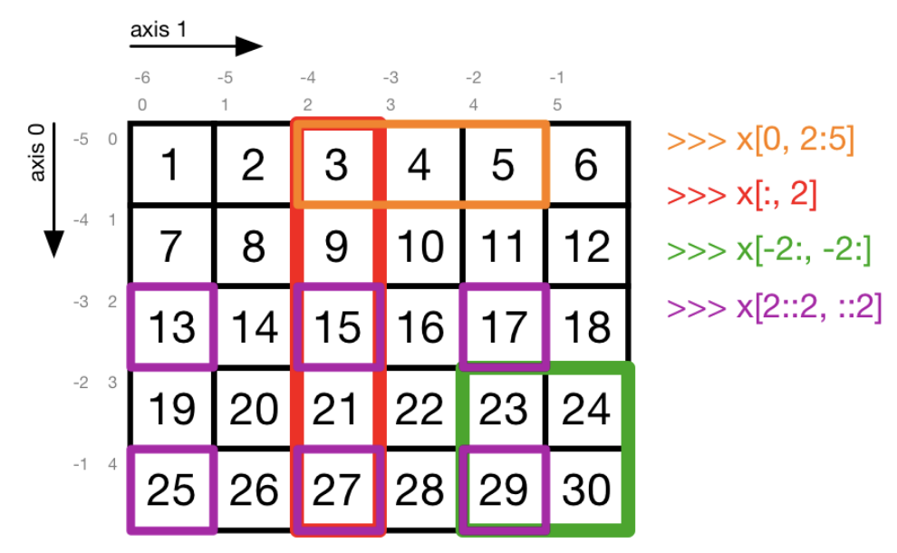
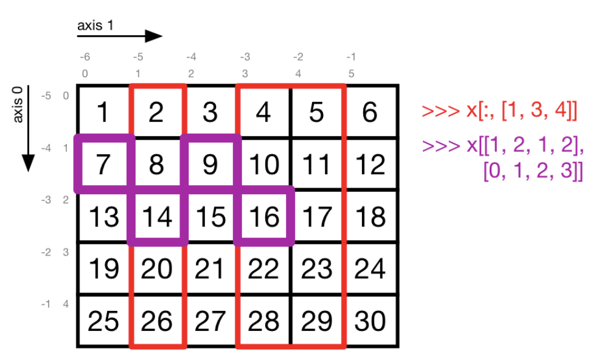
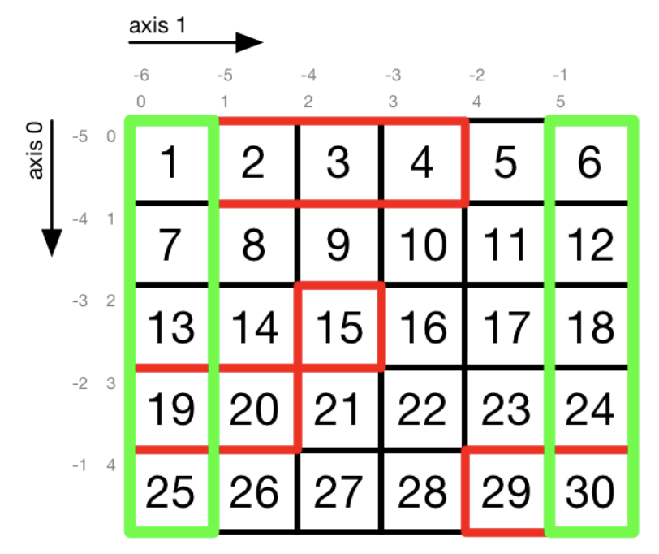

# [ML] Summary Exercises

[TOC]

## 1.0	[???]()

## 2.0	[Numpy](https://docs.scipy.org/doc/numpy/reference/)

```python
import numpy as np										# importing as np is a convention
```


### 2.1	Creating arrays

```python
x = np.array([1, 3, 5, 7])						# from a python list
x = np.array([1, 3, 5], (1, 2, 8))		# mix of lists and tuples
```

```python
x = np.zeros((2, 3))									# 2x3 matrix filled with 0's
x = np.ones((2, 3, 4))								# 2 matrixes 3x4 filled with 1's
x = np.eye(4)													# identity matrix I_4
x = np.arange(5, 10, 2)								# vector of numbers from 5 to 11 with step 2
x = np.ones_like(x_other)							# sequence of 1's the same shape as x_other
x = np.full((2, 3), 15)								# matrix 2x3 full of 15's
```

```python
x = np.arange(5, 10, dtype=np.int32)	# array of 32 bits integers
x = x_other.astype(np.float32)				# cast integer array to 32 bits float array
```

```python
x = np.random.randint(2, size=10)			# vector of length 10 filled with 0's and 1's
x = np.random.randint(1, 3, (2, 3))		# 2x3 matrix filled with 1's and 2's
```

---


### 2.2	Inspecting arrays

```python
print(x)															# print array x
print(x.ndim)													# print #dimensions of x
print(x.size)													# print #elements in x
print(x.shape)												# print shape of x
print(x.dtype)												# print data type of x
```

```python
np.allclose(x1, x2)										# returns if x1's and x2's elements are the same
```

---


### 2.3	Reshaping arrays

```python
x = np.arange(12).reshape(4, 3)				# reshape the 1x12 matrix into a 4x3 matrix
x = np.ones(8).reshape((2, 2, -1))		# reshape the 1x8 matrix into 2 matrix 2xN where n
																			# is computed automatically (here 2)
x = np.ones((2, 3, 4)).reshape(-1, )	# reshape the 2 3x4 matrix into a vector of length
																			# automatically computer (here 2 * 3 * 4 = 24)
  
x = x[:, np.newaxis]									# creates a new empty axis (dimension)
x = x[:, None]												# same as x = x[:, np.newaxis]
```

---


###2.4	Accessing array elements

```python
s_1 = x[0, 2:5]												# select row 0, col 2 to 5 (orange)
s_2 = x[:, 2]													# select all rows of col 2 (red)
s_3 = x[-2:, -2:]											# select last 2 rows of last 2 col (green)
s_4 = x[2::2, ::2]										# (violet)

x[-2:, :] = 0													# replace two last rows with 0's
```



```python
s_5 = x[:, [1, 3, 4]]									# select all rows of col 1, 3 and 4 (red)
s_6 = x[[1, 2, 1, 2], range(4)]				# (violet)

x[[1, 2, 1, 2], range(4)] = 0					# replace s_6 with 0's
```



```python
# Create a mask corresponding to the red squares
mask = np.zeros((5, 6), dtype=np.bool)
mask[0, 1:4] = True
mask[2, 2] = True
mask[3, :2] = True
mask[-1, -2:] = True

s_7 = x[mask]													# select every cell in x where the mask is True (red)


# Create a mask corresponding to the green squares
mask = np.array([True, False, False, False, False, True])

s_8 = x[:, mask]											# select every row of each col where the mask is True 																			# (green)
```



```python
# x[boolean_condition] (boolean_condition IS a mask as well)

s_9 = x[x > 20]												# select every cell which value is greater than 20
s_10 = x[x % 2 == 1]									# select every cell which value is an odd number
```

```python
y = np.ones((3, 4, 5, 6))

s_11 = y[0, :, :, 3]									# select every 3 element of each row of each matrix in 																			 # the 0-th tensor
s_12 = y[0, ..., 3]										# same as s_11 = y[0, :, :, 3]. "..." is translated to
																			# "as many consecutive ':' as needed" (ellipsis 
  																		# operator)
```

---


### 2.5	Concatenating, stacking, splitting

```python
x = np.concatenate([x1, x2])					# glue together a list of i matrix of size n_i x m 																													# (m common for all x_i) into a (n_1 + ... + n_i) x m 
																			# matrix
  
x = np.stack([x1, x2, x3])						# stack a list of i matrix of size n x m (common for 
 																		 	# all x_i) into a N+1 dimensional array with x_i as 
  																		# elements

# for both, optional parameter axis is set to default 0
```

```python
x = np.split(x, <width_or_indices>)		# if second parameter is an integer N, the array will 																		 	# be split in N equal arrays. if second parameter is a
																			# 1-D array (list) of sorted integers, the entries 
  																		# indicate where (index) the array is split

# optional parameter axis is set to default 0
```

---


### 2.6	Basic Arithmetic, linear algebra

Basic arithmetic operators `+`, `-`, `*`, `/`, `//`, `**`, `%` are applied element-wise as long as one of the operands is a scalar or both operands are arrays of the same shape.

```python
x = np.zeros((2, 3))
x += 1																# 2x3 matrix of all 1's
2 ** np.arange(5)											# vector of 5 powers of 2

y = np.arange(6).reshape((2, 3))
z = x - y															# 2x3 matrix : [[1, 0, -1], [-2, -3, -4]]
```
```python
x.T																		# matrix transposition (or vector)
```

```python
v1 = np.array([0, 1, 2])
v2 = np.array([3, 4, 5])

v = np.dot(v1, v2)										# dot product of v1 and v2 (scalar)
np.linalg.norm(v)											# norm of a vector


m1 = np.eye(3)
m2 = np.random.randint(2, size=(3, 3))

m = np.dot(m1, m2)										# matrix product of m1 and m2 (matrix)
m = m1 @ m2														# same as m = np.dot(m1, m2)
np.linalg.inv(m)											# matrix inversion
```

```python
A = np.random.randint(-1., 1., (10, 10))
b = np.random.randint(-1., 1., (10, ))
x = np.linalg.solve(A, b)							# solves Ax = b (=> np.dot(A, x) - b = 0)
```

---


###2.7	Broadcasting

Broadcasting allows for performing arithmetic and other operations on arrays of **different shape**. For instance, adding a column vector $v$ to a matrix $M$, $M + v$, will effectively take every column of the matrix and add the vector $v$ element-wise.

The dimensions of the 2 arrays must satisfy one of the following:

- have the same dimensions
- one of the dimensions is 1

Furthermore, non-existent dimensions are treated as 1

```python
for i in range(m.shape[0]):						# matrix and vector multiplication
    m[i] *= v

m *= v																# vectorization. same as for loop just before
```

---


###2.8	Other useful commands

- [Random package](https://docs.scipy.org/doc/numpy-1.16.0/reference/routines.random.html)
- ```python
	np.random.randint											
	np.random.randint											 
	np.random.shuffle											 
	np.random.uniform											 
	np.random.randn												 
	np.random.permute											
	```

- other

  ```python
  np.min, np.max
  np.argmin, np.argmax
  np.prod, np.sum
  np.mean, np.std
  
  np.sqrt, np.abs
  
  np.copy
  
  np.absolute
  np.argsort
  np.bincount
  np.argmax
  np.apply_along_axis
  np.hstack
  np.logspace
  ```


```python
# Standard python interpreter
print(np.logspace.__doc__)

# Jupyter Lab
np.logspace?
```

