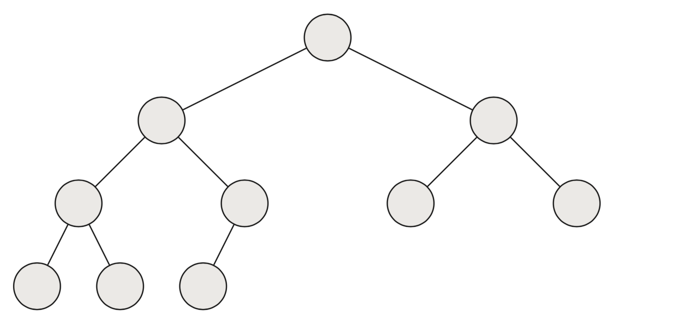

# [CS-250] Summary Algorithms

An **algorithm** can we seen as a **tool for solving a well-specified computational problem**

| Topic        | data structures and algorithms                  |
| ------------ | ----------------------------------------------- |
| data types   | lists, stack, queue, union-find, priority queue |
| sorting      | insertion sort, mergesort, heapsort, quicksort  |
| searching    | binary search, BST, hash table                  |
| graphs       | BFS, DFS, Prim, Kruskal, Bellman-Ford           |
| and so on... | max-flow min-cut, probabilistic analysis        |

[TOC]

## 1.	Introduction

An **instance** of a problem is **an** (a.k.a *ONE*) input to a problem

Most problems in this course can be solved by an efficient algorithm that runs in time $O(n)$, $O(n^2)$ or $O(n^3)$. Many more complex problems do not have efficient algorithms (they are classified as **NP-hard**)


**First example**

Our first algorithm : given a number $n$, what is the value of $\sum_{i = 1}^{n}i$ ?

- **Dumb method**

  ```pseudocode
  ans = 0
  for i = 1, ..., n
  	ans = ans + i
  return ans
  ```

  - Space efficient ? *Yes (2 numbers stored)*
  - Time efficient ? *So so... O(n)*

- **Clever method (Gauss)**

  ```pseudocode
  return n(n+1)/2
  ```

  - Space efficient ? *Yes*
  - Time efficient ? *Yes* $O(1)$


> A fast algorithm on a slow computer will be **faster** than a slow algorithm (dumb method) on a fast computer as n grows bigger


##2.	Sorting

> **Input** : A sequence of $n$ numbers $(a_1, a_2, ..., a_n)$
>
> **Output** : A permutation $(a_1', a_2', ..., a_n')$ of the input sequence such that $a_1' \leq  a_2'\leq ... \leq a_n'$


### 2.1	Insertion sort

- Start with an empty left hand of playing cards and the cards face down on the table
- Then remove one card at a time from the table, and insert it into the correct position in the left hand
- To find the correct position for a card, compare it with each of the cards already in the hand, from right to left

```pseudocode
for j = 2 to n
	key = A[j]
	
	// Insert A[j] into the sorted sequence A[1, ..., j-1]
	i = j - 1
	while i > 0 and A[i] > key
		A[i + 1] = A[i]
		i -= 1
	A[i + 1] = key
```


We usually concentrate on the **worst-case running time** because it gives a guaranteed upper bound on the running time for any input


### 2.2	Merge sort

**Divide-and-conquer**

**Powerful** algorithm relying on the divide-and-conquer principle :

- **Divide** the problem into subproblems that are smaller instances of the **same** problem
- **Conquer** the subproblems by solving them recursively
- **Combine** the subproblems solutions to give a solution to the original problem

For the merge sort on the array $A[p,...,r]$, this translates into :

- **Divide** by splitting $A$ into subarrays $A[p,...,q]$ and $A[q+1,...,r]$ where $q$ is in the middle of $p$ and $r$
- **Conquer** by recursively sorting the two arrays (with merge sort)
- **Combine** by merging the two sorted subarrays $A[p,...,q]$ and $A[q+1,...,r]$ to produce a single subarray $A[p,...,r]$


```pseudocode
MergeSort(A, p, r)
	if p < r										// check for base case
		q = floor((p + 2) / 2)		// divide
		MergeSort(A, p, q)				// conquer
		MergeSort(A, p + 1, r)		// conquer
		Merge(A, p, q, r)					// combine
```

---


**Algorithm**

**Merge** algorithm : (combine part)

- Think of two pile of cards that are placed face up
- Pick the smaller of the two cards and place it in the output pile (repeat $\le n$ times (therefore, it should take $\Theta (n)$))

---


**Simplification**

Instead of checking whether a pile is empty, we put in the bottom of each input pile a special **sentinel** card of value $\infin$. We stop after we picked $n = r-p+1$ cards (there will be no cards left, only 2 sentinel cards)

---


**Analysis of Merge Sort**

​		$T(n) =
  \begin{cases}
​        \Theta (1) & \text{if $n \le c$} \\
  		aT(n/b) + D(n) + C(n) & \text{otherwise}
  \end{cases}$

- **Divide** takes constant time $\Rightarrow$ $D(n) = \Theta (1)$ where $D(n)$ is the time to divide

- **Conquer** recursively solve two subproblems, each of size $n/2 \Rightarrow 2T(n/2)$

- **Combine** takes linear time $\Rightarrow$ $C(n) = \Theta (n)$ where $C(n)$ is the time to combine

  $T(n) =
    \begin{cases}
          \Theta (1) & \text{if $n = 1$} \\
    		2 T(n/2) + \Theta (n) & \text{otherwise}
    \end{cases}$


Solving the recurrence shows that it runs in time $\Theta (n \log(n))$


### 2.3	Heapsort

**Heapsort** is a mix of insertion sort and merge sort. The trick is to create a smart **data-structure** called the **heap**. We must be able to perform basics operations on heaps such as :

- modifying operations : insertion, deletion, ...
- query operations : search, maximum, minimum, ...

------


**Heaps**

A heap is a nearly complete binary tree **(each row except the last is complete and the last row is filled from left to right)**

- The example below is a **heap of size** `10` (10 circles)
- **Height of heap** = height of root = $\Theta(\log(n))$
- **Height of node** = # of edges on the longest simple path from the node down to a leaf



A **max-heap** is a heap where the children's value of node `i` is **smaller or equal** to `i`'s value (max element is on the root). Example below :

- Heap of size `10`
- Height of heap is `3`
- The height of the node "7" is `1`, the height of the node "8" is `2`, the height of the node "1" is `0`, the height of the node "9" is `3`

A **min-heap** is a heap where the children's value of node `i` is **greater or equal** to `i`'s value (min element is on the root)


------


**Storing heaps**

We store the "almost complete tree" in an array (and **NOT** with a pointer to the left/right child)


------


**Maintaining the heap property**

`Max-Heapify(A, i, n)` is important for manipulating heaps : given an `i` such that the **subtrees of `i` are heaps**, it ensures that the subtree rooted at `i` is a heap satisfying the heap property :

- Compare `A[i]`, `A[left(i)] = A[2i]` and `A[right(i)] = A[2i + 1]`
- If necessary, **swap** `A[i]` with the largest of the two children to preserve heap property
- Continue this process of comparing and swapping down the heap, until subtree rooted at `i` is max-heap

$\implies$ running time : $\Theta(height \space of \space i) = O(\log(n))$

$\implies$ space : $\Theta(n)$

------


**Building a heap**

> see lecture 5 with animations, slides 166-176

Given an unordered array `A` of length `n`, `Build-Max-Heap(A, n)` outputs a heap

```pseudocode
Build-Max-Heap(A, n) is
	for i = floor(n/2) downto 1
		Max-Heapify(A, i, n)
```

$\implies$ runtime : $O(n)$ calls to `Max-Heapify` each taking $O(\log(n))$ time $\implies$ $O(n \log(n))$. (tighter analysis possible $\implies$ $O(n)$)

---


**Algorithm** 

> see lecture 5 with animations, slides 181-201

```pseudocode
Heapsort(A, n)
	Build-Max-Heap(A, n)						// Builds a heap from an unsorted array
	for i = n downto 2
		swap A[1] with A[i]
		Max-Heapify(A, 1, i - 1)
```

---


**Runtime analysis**

- `Build-Max-Heap(A, n)` : $O(n)$
- `for` loop : n - 1 times
- `swap` elements : $O(1)$
- `Max-Heapify(A, i, i - 1)` : $O(\log(n))$

$\implies$ runtime : $O(n \log (n))$


##3.	Solving recurrences

As an example, consider the following recurrence

​		$T(n) =
  \begin{cases}
​        c & \text{if $n = 1$} \\
  		2 T(n/2) +  cn & \text{otherwise}
  \end{cases}$

Recurrences can be solved using three techniques :

- The **substitution method** (informal)
- **Recursion trees** (informal)
- **Master method** (formal)


### 3.1	The substitution method

Guess the form of the solution using mathematical induction to find the constatns and show that the solution works

$T(n) = 2 T(\frac{n}{2}) +  cn = 2 [2 T(\frac{n}{4}) +  c\frac{n}{2}] + cn = 2 [2 [2 T(\frac{n}{8}) +  c\frac{n}{4}] +  c\frac{n}{2}] + cn = 8 T(\frac{n}{8}) +  cn + cn + cn = 8T(\frac{n}{8}) + 3cn =$

  		$= \,\, ... \,\,= 2^k \, T(\frac{n}{2^k}) + kcn$

En posant $k = \log_2(n)$,

$T(n) = 2^{\log_2(n)} \, T(\frac{n}{2^{\log_2(n)}}) + \log_2(n) \, cn = n \, T(\frac{n}{n}) + \log_2(n) \, cn = n \, T(1) + \log_2(n) \, cn$

$T(n) = n(T(1) + c\log_2(n)) = \Theta (n \log(n))$


> The substitution method is *informal*, the result found is a qualified guess, not an exact result


### 3.2	Recursion trees

- Each node corresponds to the cost of a subproblem
- Sum the costs within each level of the tree to obtain a set of per-level costs
- Sum all the per-level costs to determine the total cost of all levels of the recursion

Let's see what it looks like with the example ($T(1) = c$ and $T(n) = 2T(\frac{n}{2}) + cn$)


One could guess $T(n) = cn \cdot \log_2(n) = \Theta (n \log(n))$


Another example with the recurrence $T(n) = T(\frac{n}{3}) + T(\frac{2n}{3}) + cn$


$\exist a, b > 0 \:\: st. a \cdot n \log_3(n) \le T(n) \le b \cdot n \log_{3/2}(n) \implies T(n) = \Theta (n \log(n))$ (by definition)


> Recursion trees are *informal*, the result found is a qualified guess, not an exact result


###3.3	Master method

The Master method is used to solve recurrence of the form $T(n) = a \, T(\frac{n}{b}) + f(n)$

> **Theorem (Master Theorem)**
>
> Let $a \ge 1$ and $b \ge 1$ be constants, let $T(n)$ be defined on the nonnegative integers by the recurrence
>
> ​		$T(n) = a \, T(\frac{n}{b}) + f(n)$
>
> Then, $T(n)$ has the following asymptotic bounds
>
> - if $f(n) = O(n^{log_b(a-\epsilon)})$ for some constant $\epsilon > 0$, then $T(n) = \Theta (n^{\log_b(a)})$
> - if $f(n) = \Theta (n^{log_b(a)})$, then $T(n) = \Theta (n^{\log_b(a)}  \log(n))$
> - if $f(n) = \Omega(n^{log_b(a+\epsilon)})$ for some constant $\epsilon > 0$, and if $a \cdot f(\frac{n}{b}) \le c \cdot f(n)$ for some constant $c < 1$ and all sufficiently large $n$, then $T(n) = \Theta (f(n))$


Let's see what it looks like with the example ($T(1) = c$ and $T(n) = 2T(\frac{n}{2}) + cn$)

$f(n) = cn = O(n)$ and $a=b=2$ so $\log_b(a) = 1$ and $f(n) = \Theta (n^{log_b(a)})$

By the Master theorem (option 2), $T(n) = \Theta (n^{\log_b(a)}  \log(n)) \implies T(n) = \Theta (n \log(n))$


##4.	Divide and conquer : other applications


- **Integer multiplication** :
  - by hand : $\Theta (n^2)$
  - Karatsuba's method : $\Theta (n^{\log_2(3)}) \approx \Theta (n^{1.58})$

- **Matrix multiplication** :
  - by hand : $\Theta (n^3)$
  - Strassen : $\Theta (n^{\log_2(7)}) \approx \Theta (n^{2.8})$
  - Coppersmith and Winograd's method : $\Theta (n^{2.376})$ (experimental method)
  - Vassilevska Williams' method : $\Theta (n^{2.3727})$ (experimental method)


**The maximum-subarray problem**

- **Divide** the subarrays into two subarrays of as equal size as possible. Find the midpoint `mid` of the subarrays, and consider the subarrays `A[low ... mid]` and `A[mid + 1 ... high]`
- **Conquer** by finding maximum subarrays of `A[low ... mid]` and `A[mid + 1 ... high]`
- **Combine** by finding a maximum subarray that crosses the midpoint and using the best solution out of the three. Here's how to find the maximum subarray crossing midpoint
  - Any subarray crossing the midpoint `A[mid]` is made of two subarrays `A[i ... mid]` and `A[mid + 1 ... j]` where `low <= i <= mid` and `mid <= j <= high`
  - Find maximum array of the form `A[i ... mid]` and `A[mid + 1 ... j]` and then combine them


## 5.	Data Structures

### 5.1	Priority queues

> see lecture 7 with animations, slides 91-126

Each set element of the set `S` has a **key** associated with its value that determines its importance

- `Insert(S, x)` : inserts element `x` in `S`
- `Maximum(S)` : returns the element of `S` with the largest **key**
- `Extract-Max(S)` : removes and returns element of `S` with largest **key** 
- `Increase-Key(S, x, k)` : increases value of element `x`’s key to `k` (assume` k`$\ge$ `x`’s current key value)


- Finding maximum element in heap `A` :

  ```pseudocode
  Heap-Maximum(A)
  	return A[1]
  ```

  $\implies \space \Theta(1)$

- Extracting maximum element (removes it from the heap) from `A` a heap of length `n` :

  ```pseudocode
  Heap-Extract-Max(A, n)
  	if n < 1 then error "Heap underflow!"
  	max = A[1]																// copy of max element
  	A[1] = A[n]																// last element is new root
  	n -= 1																		// delete last element
  	Max-Heapify(A, 1, n)											// max heapify on n-1 size heap
  	return max
  ```

  $\implies \space \text{constant time} \space + \space \text{runtime of Max-Heapify} \space = \space O(1) \space + \space O(\log (n)) = O(\log (n))$

- Increasing key value (given a heap `A`, index `i` and a new value `key`) :

  ```pseudocode
  Heap-Increase-Key(A, i, key)
  	if key < A[i] then error "new key is smaller than current one"
  	A[i] = key																// updates A[i]'s value to key
  	while ((i > 1) and (A[parent(i)] < A[i]))
  		swap A[i] and A[parent(i)]
  		i = parent(i)
  ```

  $\implies \space O(\log (n))$

- Inserting into the heap (given a new `key` to insert into heap) :

  ```pseudocode
  Max-Heap-Insert(A, key, n)
  	n += 1																		// increase heap size by 1
  	A[n] = -Infinity													// insert new node with key -inf
  	Heap-Increase-Key(A, n, key)
  ```

  $\implies \space \text{constant time + runtime of Heap-Increase-Key} = O(1) + O(\log (n)) = O(\log (n))$


### 5.2	Stacks

> see lecture 7 with animations, slides 141-155

Rule : **last-in, first-out**

- `Push(S, x)` : insert operation
- `Pop(S)` : deletion operation

Implementation using an array `S` of elements `S[1, ..., S.top]`

- `S[1]` is the element at the bottom
- `S[S.top]` is the element at the top


- Check if stack is empty

  ```pseudocode
  Stack-Empty(S)
  	return S.top == 0
  ```

- Push (add) an element

  ```pseudocode
  Push(S, x)
  	S.top += 1
  	S[S.top] = x
  ```

- Pop (remove) an element

  ```pseudocode
  Pop(s)
  	if Stack-Empty(S) then error "Stack underflow"
  	S.top -= 1
  	return S[S.top + 1]
  ```


### 5.3	Queues

> see lecture 7 with animations, slides 158-170

Rule : **first-in, first-out**

- `Enqueue(Q, x)` : insert operation
- `Dequeue(Q)` : deletion operation

Implementation using an array `Q` of elements `Q[Q.head, ..., Q.tail - 1]`

- `Q[Q.head]` points to the first element
- `Q[Q.tail]` points at the next location where a new element would be placed
- `Q.length` is the length (fixed) of the array the queue lives in


- Enqueue (add) an element

  ```pseudocode
  Enqueue(Q, x)
  	Q[Q.tail] = x
  	if Q.tail = Q.length then Q.tail = 1
  	else Q.tail += 1
  ```

- Dequeue (remove) an element

  ```pseudocode
  Dequeue(Q)
  	x = Q[Q.head]
  	if Q.head = Q.length then Q.head = 1
		else Q.head += 1
  	return x
  ```
  
  


### 5.4	Linked lists

> see lecture 7 with animations, slides 174-196

Objects are arranged in a linear order (not indexed in array but pointers towards each object)


- **Searching** in a linked list (*Task* : given `k` return pointer to first element with key `k`) :

   ```pseudocode
  List-Search(L, k)
  	x = L.head
  	while x != nil and x.key != k
  		x = x.next
  	return x
  ```

  $\implies O(n)$

  *Note* : if `k` is not in `L`, `nil` will be returned (last `x.next`)

- **Inserting** in a linked list (*Task* : insert new element `x` in `L`)

  ```pseudocode
  List-Insert(L, x)														// Note : in a linked list, we insert at the 
  	x.next = L.head														// beginning
  	if L.head != nil then L.head.prev = x
  	L.head = x
  	x.prev = NIL
  ```

  $\implies O(1)$

  ```pseudocode
  List-Insert-Simplified(L, x)
  	x.next = L.nil.next
  	L.nil.next.prev = x
  	L.nil.next = x
  	x.prev = L.nil
  ```

- **Deleting** in a linked list (*Task* : given a pointer to an element `x` remove it from `L`)

  ```pseudocode
  List-Delete(L, x)
  	if x.prev != nil then x.prev.next = x.next
  	else L.head = x.next
  	if x.next != nil then x.next.prev = x.prev
  ```

  $\implies O(1)$

  ```pseudocode
  List-Delete-Simplified(L, x)
  	x.prev.next = x.next
  	x.next.prev = x.prev
  ```


**Summary**

- Insertion $O(1)$
- Deletion  $O(1)$ if double-linked
- Search $O(n)$... not *that* good...


### 5.5	Binary Search Trees

> see lecture 8 with animations, slides 147-213

**Rule** :

- if `y` is in the left subtree of `x`, then `y.key` $\lt$ `x.key`
- if `y` is in the right subtree of `x`, then `y.key` $\ge $ `x.key`


- The **root** of tree `T` is the mother node
- The **height** `h` of tree `T` is #edges in the longest path from the root to a leaf
- The **successor** of a node `x` is the node `y` such that `y.key` is the "smallest-key" $\gt$ `x.key`
- The **predecessor** of a node `x` is the node `y` such that `y.key` the "largest-key" $\lt$ `x.key`
- If `T` is a BST, then `T.left` and `T.right` also are BST


- `Tree-Search(x, k)` : returns the node containing value `k` (or `nil` if not found) in the BST `x` //TODO confusion

  ```pseudocode
  Tree-Search(x, k)											// k : what we are looking for, x : current node searched
  	if x == NIL or k == key[x]
  		return x
    if k < x.key
    	return Tree-Search(x.left, k)
    else return Tree-Search(x.right, k)
  ```

  $\implies O(h)$

- `Tree-Minimum(x)` : returns the minimum value in the BST `x` (left-most leaf)

  ```pseudocode
  Tree-Minimum(x)
  	while x.left != NIL
  		x = x.left
  	return x
  ```

  $\implies O(h)$

- `Tree-Maximum(x)` : returns the maximum value in the BST `x` (right-most leaf)

  ```pseudocode
  Tree-Maximum(x)
  	while x.right != NIL
  		x = x.right
  	return x
  ```

  $\implies O(h)$

- `Tree-Successor(x)` : returns the successor of `x`

  ```pseudocode
  Tree-Successor(x)
  	if x.right != nil
  		return Tree-Minimum(x.right)
  	y = x.parent
  	while y != nil and x == y.right
  		x = y
  		y = y.parent
  	return y
  ```

  $\implies O(h)$

---


**Printing a BST**

There are multiple ways to print a BST :

- `Inorder-Tree-Walk(x)` : prints **inorder** (prints elements in order) :

  ```pseudocode
  Inorder-Tree-Walk(x)
  	if x != nil
  		Inorder-Tree-Walk(x.left)
  		print key[x]
  		Inorder-Tree-Walk(x.right)
  ```

  $\implies \Theta(n)$

- `Preorder-Tree-Walk(x)` : prints **preorder** :

  ```pseudocode
  Preorder-Tree-Walk(x)
  	if x != nil
  		print key[x]
  		Preorder-Tree-Walk(x.left)
  		Preorder-Tree-Walk(x.right)
  ```

  $\implies \Theta(n)$

- `Postorder-Tree-Walk(x)` : prints **postorder** :

  ```pseudocode
  Postorder-Tree-Walk(x)
  	if x != nil
  		Preorder-Tree-Walk(x.left)
  		Preorder-Tree-Walk(x.right)
      print key[x]
  ```

  $\implies \Theta(n)$

---


**Insertion and deletion**

- `Tree-Insert(T, z)` : inserts element `z` inside tree `T`:

  - Search for `z.key`
  - When arrived at `NIL`, insert `z` at that position

  ```pseudocode
  Tree-Insert(T, z)
  
  	// "Search" phase :
  	y = NIL
  	x = T.root
  	while x != NIL
  		y = x
  		if z.key < x.key then x = x.left
  		else x = x.right
  	z.parent = y
  	
  	// "Insert" phase
  	if y == NIL then T.root = z 														// T was empty
  	else if z.key < y.key then y.left = z
  	else y.right = z
  ```

  $\implies O(h)$

- `Tree-Delete(T, z)` : deletes element `z` inside tree `T` :

  - If `z` has no child, remove `z`
  - If `z` has one child, then make that child take `z`'s position in the tree
  - If `z` has two children, then find its successor `y` and replace `z` by `y`

  ```pseudocode
  Tree-Delete(T, z)
  	if z.left == NIL then Transplant(T, z, z.right)					// z has no left child
  	else if z.right == NIL then Transplant(T, z, z.left)		// z has just a left child
  	else																										// z has 2 children
  		y = Tree-Minimum(z.right)							// in this case, y is the successor
  		if y.p != z
  			// y lies within z's right subtree but is not the root of this
  			Transplant(T, y, y.right)
  			y.right = z.right
  			y.right.p = y
  			
  		// Replace z by y
  		Transplant(T, z, y)
  		y.left = z.left
  		y.left.p = y
  ```

  ```pseudocode
  Transplant(T, u, v)																				// Replaces subtree u with subtree v
  	if u.parent == NIL then T.root = v
  	else if u == u.parent.left
  		u.parent.left = v
  	else
  		u.parent.right = v
  		
  	if v != NIL
  		v.parent = u.parent
  ```

  $\implies O(h)$ (for deletion)


## ---

## ?. Misc

### ?.0	Loop invariants

- **Loop invariant** = "a statement that is satisfied during the loop"

- Need to verify : (similar to induction)
  - **Initialization:** It is true prior to the first iteration of the loop
  - **Maintenance:** If it is true before an iteration of the loop, it remains true before the next iteration
  - **Termination:** When the loop terminates, the invariant — usually along with the reason that the loop terminated — gives us a useful property that helps show that the algorithm is correct

- Examples :
  - **Insertion sort** : At the start of each iteration of the “outer” **for** loop – the loop indexed by j – the subarrary A[1, . . . , j - 1] consists of the elements originally in A[1, . . . , j - 1] but in sorted order.
    - Initialization : 
      - before the first iteration of the loop we have j = 2
      - the subarray A[1 . . . j − 1], therefore, consists of just the single element A[1]
      - this is the original element in A[1] and trivially sorted
    - Maintenance : 
      - Assume invariant holds at the beginning of the iteration when j = k, i.e., forA[1 . . . k − 1]
      - The body of the **for** loop works by moving A[k − 1],A[k − 2] and so on one step to the right until it finds the proper position for A[k], at which point it inserts the value of A[k]
      - The subarray A[1 . . . k] then consists of the elements originally in A[1 . . . k] in a sorted order. Incrementing j (to k + 1) for the next iteration of the **for** loop then preserves the loop invariant :)
    - Termination : 
      - The condition of the **for** loop to terminate is that j > n
      - Hence, j = n + 1 when loop terminates
      - The loop invariant then implies that A[1 . . . n] contain the original elements in sorted order
    
  - **Linear search** : At the start of each iteration of the **for** loop we have A[j] 􏰃 v for all
  
    j < i


### ?.1	Table

| Algorithm                | Worst case           | Best case   | Average | In-place |
| ------------------------ | -------------------- | ----------- | ------- | -------- |
| Insertion sort           | $\Theta(n^2)$        | $\Theta(n)$ |         | Yes      |
| Merge sort               | $\Theta (n \log(n))$ |             |         | No       |
| Heap sort                | $\Theta (n \log(n))$ |             |         | Yes      |
| Maximum-subarray problem | $\Theta (n \log(n))$ |             |         |          |


A sorting algorithm is **in place** if the numbers are rearranged within the array (ex: insertion sort) while using at most a constant amount of additional space

Insertion sort is **incremental** : having sorted the subarray A[1 . . . j − 1], we inserted the single element A[j] into its proper place, yielding the sorted subarray A[1...j].

Merge sort is **divide-and-conquer** : break the problem into smaller subproblems and then combine the solutions to the subproblems


## A.	Annexe

### Problem from midterm using Stacks


> Solution : think of the depot as a **stack**
