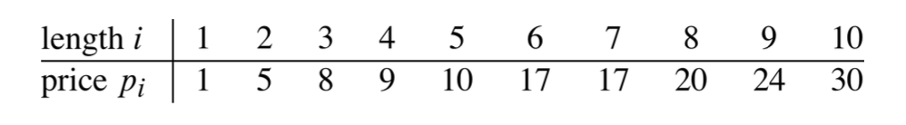
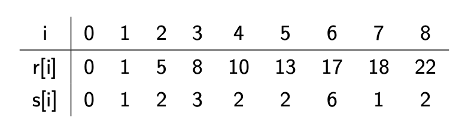

# [CS-250] Dynamic Programming (DP)

[TOC]

## 0.	Introduction

> **Main idea** : emember calculations already made, thus saving enormous amounts of computation


**Example** : Calculating the $n$-th Fibonacci number $(1, 1, 2, 3, 5, ...)$
$$
F_0 = 1, F_1 = 1 \\ F_n = F_{n-1} + F_{n-2}
$$
Without DP, our first idea could be to use recursion

```pseudocode 
Fib(n)
	if n == 0 or n == 1 then return 1
	else return Fib(n - 1) + Fib(n - 2)
```

$\implies$ exponential time... 


We need to remember what we already calculated, for that, we have two different ways :

- **Top-down with memoization**

  - Solving recursively but storing each result in a table to be used again for further computation

  - **Memoization** is remembering what we have computed previously

  - For our example :

    ```pseudocode
    Memoized-Fib(n)
    	Let r = [0, ..., n] be a new array
    	for i = 0 to n
    		r[i] = -Infinity
    	return Memoized-Fib-Aux(n, r)
    ```

    ```pseudocode
    Memoized-Fib-Aux(n, r)
    	if r[n] >= 0 then return r[n]									// subproblem already calculted previously
    	if n == 0 or n == 1 then
    		ans = 1
    	else
    		ans = Memoized-Fib-Aux(n - 1, r) + Memoized-Fib-Aux(n - 2, r)
    	r[n] = ans
    	return r[n]
    ```

    $\implies \Theta(n)$

- **Bottom-up**

  - Sort the subproblems and solve the smaller ones first (e.g., `Fib(0)`, `Fib(1)`)

  - That way, when solving a subproblem, we already have the solutions for the smaller ones required

  - For our example :

    ```pseudocode
    Bottom-Up-Fib(n)
    	Let r = [0, ..., n]
    	r[0] = 1, r[1] = 1
    	for i = 2 to n
    		r[i] = r[i - 1] + r[i - 2]
    	return r[n]
    ```

    $\implies \Theta(n)$


**key elements** in designing a DP-algorithm

- optimal substructure : when a problem consists of **making a choice** which leaves one or serveral subproblems to solve, DP is a good idea. The subproblems must overlap (e.g., `Fib(1)` is needed multiples times)... otherwise the DP approach is useless
- Choosing Top-down with memoization or bottom-up accordingly


## 1.	Rod-cutting problem

We have a rod of length $n$ and a table of prices $p_i$ for rods of length $i = 1, ..., n$



The objective is to decide how to cut the rod into pieces and maximise the price


> **Theorem**
>
> If :
>
> - the leftmost cut in an optimal solution is after $i$ units, and
> - an optimal way to cut a solution of size $n-i$ is into rods of sizes $s_1, s_2, ..., s_k$
>
> Then, an optimal way to cut our rod is into rods of size $i, s_1, s_2, ..., s_k$


If we let $r(n)$ be the optimal revenue from a rod of length $n$, then, by the structural theorem, we can express $r(n)$ recursively as follows
$$
r(n) =
\begin{cases} 
      0 & \text{if } n = 0, \\
      \max_{1 \le i \le n}{\{p_i + r(n-i)\}} & \text{otherwise if } n \ge 1 
 \end{cases}
$$


To avoid a standard recursive algorithm (which would lead to an exponential runtime), we will apply DP on the problem

- **Top-down dynamic programming**

  - Memoize (store) the result of every recursive call
  - At each recursive call, try to avoir work using memoized results

  ```pseudocode
  Memoized-Cut-Rod(p, n)
  	Let r[0, ..., n] be a new array
  	for i = 0 to n
  		r[i] = -Infinity
  	return Memoized-Cut-Rod-Aux(p, n, r)
  ```

  ```pseudocode
  Memoized-Cut-Rod-Aux(p, n, r)
  	if r[n] >= 0 then return r[n]
  	
  	if n == 0 then q = 0
  	else
  		q = -Infinity
  		for i = 1 to n
  			q = max(q, p[i] + Memoized-Cut-Rod-Aux(p, n - i, r))
  		
  		r[n] = q
  		return q
  ```

  $\implies O(n^2)$

- **Bottom-up dynamic programming**

  - Sort subproblems by size, solve the smaller ones first
  - When reaching a subproblem, the smaller ones are already solved

  ```pseudocode
  Bottom-Up-Cut-Rod(p, n)
  	Let r[0, ..., n] be a new array
  	r[0] = 0
  	for j = 1 to n
  		q = -Infinity
  		for i = 1 to j
  			q = max(q, p[i] + r[j - i])
  		
  		r[j] = q
  	return r[n]
  ```

  $\implies O(n^2)$


Sometimes, one needs to also *find* an optimal solution... Each cell of the memoization table corresponds to a decision, the location of the left most cut, we store the decision corresponding to every cell in a separate table

- Each cell of the memoization table corresponds to a decision, the location of the left most cut
- Store the decision corresponding to every cell in a separate table

```pseudocode
Extended-Bottom-Up-Cut-Rod(p, n)
	Let r[0, ..., n] be a new array
	Let s[0, ..., n] be a new array

	r[0] = 0

	for j = 1 to n
		q = -Infinity
		for i = 1 to j
			if q < p[i] + r[j - i] then										// "better solution" found
				q = p[i] + r[j - i]
				s[j] = i
	r[j] = q
	
	return r and s
```

 




## 2.	Change-making problem

How can a given amount of money be made with the least number of coins of given denominations?

- **Input** : $n \in \N$ distinct coin denominators st. $0 < w_1 < ... < w_n$ and an amount $W \in \N$ (the change)

- **Output** : the minimum number of coins need in order to make the change
  $$
  \min \bigg\{ \sum_{j = 1}^n x_j : \sum_{j = 1}^n w_j x_j = W \text{ and } x_j \text{'s are integers} \bigg\}
  $$

- Example : on input $w_1 = 1, w_2 = 2, w_3 = 5$ and $W = 8$, the output should be 3 since the best way of giving 8 is $x_1 = x_2 = x_3 = 1$


It is obvioulsy exactly the same problem as the *rod cutting problem*, but phrased differently! (and we just need to take into account that we are trying to minimize and not maximize)


## ---

## A.	Temp (lecture notes 11)


$O = (A_1 ... A_i)(A_{i+1} ... A_n) = (O_L)(O_R)$

what is the cost of $O$ ? 

$M(O)= p_0 p_i p_n+ M(O_L) + M(O_R)$ 			($p_0 p_i p_n$ is the cost to multiply matrices $A \in M_{p_0 \times p_i}$ and $B\in M_{p_i \times p_n}$)

but $P_L$ is the optimal parenthetisation of $A_1 ... A_i$ so,

- $M(O_L) \ge M(P_L)$
- $M(O_R) \ge M(P_R)$

thus, $\ge p_0 p_i p_n+ M(P_L) + M(P_R) \implies ((P_L) (P_R))$ is an optimal parenthesization of $A_1 A_2 ... A_n$


Number of scalar multiplications (recursively) :

$m[i, j]=(A_i ... A_k)(A_{k+1} ... A_j) = m[i, k] + m[k+1, j]+p_{i-1}p_k p_j$


Bottom-up approach===
`Matrix-Chain-Order(p)`
`i` is the left most index, `j` is the right most index
we try all possible breakpoint `k` between `i` and `j`

> cf slide 77

we use a new way of writing the solution (triangle). Bottom line is all 0's. The top cell is the solution (#scalar multiplications) of the problem

Where is the outermost parentheses placed? We need to look at $s[1, n] = 3$. It means that the outermost parenthesize is placed after $A_3 \implies (A_1 A_2 A_3)(A_4 A_5 A_6)$. Then we recurse on the problem

We have the subproblems $s[i = 1, j = 3]$ and $s[i = 4, j = 6]$. We look at the table and see that $s[i = 1, j = 3] = 1$ and $s[i = 4, j = 6] = 5$

At last, our final solution is $(A_1 (A_2 A_3))((A_4 A_5) A_6)$


`Print-Optimal-Parens(s, i, j)`

```pseudocode
Print-Optimal-Parens(s, i, j)
	if i == j then print "A_i"
	else print "("
		Print-Optimal-Parens(s, i, s[i, j])
		Print-Optimal-Parens(s, s[i, j] + 1, j)
		print ")"
```


Longest common subsequence===

exemple : with "heroically" and "scholarly", the longest common subsequence (doesn't need to be contiguous) is "holly" because "h\_\_o\_\_\_lly" and "\_\_hol\_\_ly"

First idea : brute force (for every subsequence of $X$, check whether it's a subsequence of $Y$) $\implies \Theta(n2^m) \implies$ :(

Dynamic programming approach :

start from the right hand side, put a point on each end. If they correspond, we are lucky, the letter will be in the solution.

- If both letter match, do the same thing on the i-1 th letter
- If the don't match ... we need "hints" to know what letter to discard and go on


Optimal structure :

Let $X_i$ and $Y_i$ denote de prefixes [... slide 114]

we have seen until end of proof for theorem


## B.	Temp (lecture notes 12)


Longest common subsequence===

Let $X_i = \langle x_1, x_2, \dots, x_i \rangle$ and $Y_i = \langle y_1, y_2, \dots, y_i \rangle$

**Choice** : (OPT is "optimal solution")

- if $x_i = y_i$ then either :
  - OPT "matches" $x_i$ with $y_i$ and remaining OPT is in $(X_{i-1}, Y_{j-1})$
  - OPT is in $(X_{i-1}, Y_{j})$
  - OPT is in $(X_{i}, Y_{j-1})$
- if $x_i \ne y_i$ then either :
  - OPT is in $(X_{i-1}, Y_{j})$
  - OPT is in $(X_{i}, Y_{j-1})$

> We prove that we can assume that OTP "matches" $x_i$ with $y_i$ if they are equal, so we can simplify the first case


```pseudocode
Print-LCS(b, X, i, j)
	if i == 0 or j = 0 then return ""
	
	if b[i, j] == 'diagonal_arrow' then
		Print-LCS(b, C, i - 1, j - 1)
		Print(x_i)																				// "thing that prints the sequence"
	else if b[i, j] == 'upper_arrow' then
		Print-LCS(b, X, i - 1, j)
	else																								// 'left_arrow'
		Print-LCS(b, X, i, j - 1)
```


Optimal BST ===

Given a sequence $K = \langle k_1, k_2, \dots, k_n \rangle$ of $n$ distinct keys sorted st. $k_1 < k_2 < ... < k_n$ and that for each $k_i, \forall i \le k$, the probability $p_i$ that someone searches for $k_i$. We want to create a BST with the minimum expected cost (for each key $k_i$, the cost is $\text{depth}_T(k_i) + 1$ where $\text{depth}_T(k_i)$ denotes the depth of $k_i$ in BST $T$)
$$
\mathbb{E}[\text{"search cost in }T \text{ "}] = 
\sum_{i = 1}^n (\text{depth}_T(k_i) + 1) p_i \stackrel{\text{*}}{=}
1 + \sum_{i = 1}^n \text{depth}_T(k_i) p_i
$$

> **Note** : An optimal BST $\ne$ Huffman code tree

> **Note** : $(*)$ if $\sum_{p_i} = 1$


## Questions

- In the top-down `Memoized-Cut-Rod`, why is the runtime $O(n^2)$ ?