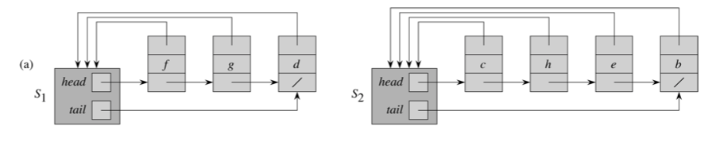
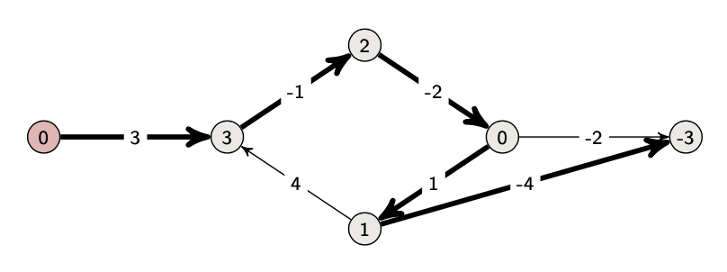

# [CS-250] Elementary Graph Algorithms

[TOC]

## Graphs basics

A **graph** $G = (V, E)$ consists of a set of vertices ($V$) and a set of edges $E$ that contain (ordered) pair of vertices. A graph can be **directed** or **undirected**


- The **adjacency list** `Adj` is a linked-list of $|V|$ linked-lists (one per vertex). Vertex's $u$'s list has all vertices $v$ st. $(u, v) \in E$. In pseudo-code, we will denote the array as attribute `G.Adj` (e.g. `G.Adj[u]` is the list of all paths going from $u$ to a neighbor)

  $\implies \begin{cases} 
        \text{Space} & \Theta(V+E) \\ 
		  \text{Time to list all vertices adjacent to } u & \Theta(\text{degree}(u)) \\
        \text{Time to determine whether } (u, v) \in E & O(\text{degree}(u))
  \end{cases}$

- The **adjacency matrix** $A=(a_{ij})$ is a $|V| \times |V|$ matrix st.
  $$
  a_{ij} = 
  \begin{cases} 
        1 & \text{if } (i, j) \in E \\
        0 & \text{otherwise}
  \end{cases}
  $$
  **Note** : The matrix is symmetric. Moreover, if you accept self-loops, the diagonal could contain ones

  $\implies \begin{cases} 
        \text{Space} & \Theta(V^2) \\ 
  	  \text{Time to list all vertices adjacent to } u & \Theta(V) \\
        \text{Time to determine whether } (u, v) \in E & \Theta(1)
  \end{cases}$


> **Note** : $\text{degree}(u) :$
>
> - in an undirected graph : $\text{degree}(u) = \text{# of neighbors}$
> - in a directed graph :
>   - $\text{in-degree}(u) = |\{ u : (v, u) \in E \}|$
>   - $\text{out-degree}(u) = |\{ u : (u, v) \in E \}|$
>
> 
>
> In an adjacency matrix $A$, $\begin{cases} 
>       \text{out-degree}(u) & \text{# of non non-zeroes in $u$'s row} \\ 
>       \text{in-degree}(u) & \text{# of non non-zeroes in $u$'s column}
> \end{cases}$


## Searching a graph

### Breadth-first search

> - **INPUT** : Graph $G = (V,E)$ and a source vertex $s \in V$
> - **OUTPUT** : $\text{v.d} =$ distance (smallest number of edges) from $s$ to $v \space \forall v \in V$

```pseudocode
BFS(V, E, s)
	for each u in V - {s}
		u.d = Infinity
	s.d = 0
	Q = new Queue()
	Enqueue(Q, s)
	
	while Q != Nil
		u = Dequeue(Q)
		for each v in G.Adj[u]
			if v.d = Inf then
				v.d = u.d + 1
				Enqueue(Q, v)
```

$\implies O(V+E)$


**Notes** :

- `BFS` may not reach all the vertices

- the shortest path tree can be obtained by keeping track of the edge that discovered the vertex

---


### Depth-first search

> - **INPUT** : Graph $G=(V, E)$
> - **OUTPUT** : 2 timestamps on each vertex : $\text{v.d}$ is the discovery time and $\text{v.f}$ is the finishing time

```pseudocode
DFS(G)
	foreach u in G.V
		u.color = WHITE
	time = 0
	
	foreach u in G.V
		if u.color == WHITE
			DFS-Visit(G, u)
```

```pseudocode
DFS-Visit(G, u)
	time += 1
	u.d, u.color = time, GRAY						// discover u
	
	for each v in G.Adj[u]							// explore (u, v)
		if v.color == WHITE
			DFS-Visit(G, v)
	
	u.color = BLACK
	time += 1
	u.f = time													// finish u
```

$\implies \Theta(V+E)$


**Note** : `DFS` forms a **depth-first forest** comprised of $\ge$ 1 depth-first trees. Each tree is made of edges $(u,v)$ such that $u$ is gray and $v$ is white when $(u,v)$ is explored


>**Theorem (Parenthesis Theorem)**
>
>For all $u, v$, exactly **one** of the following holds
>
>- $u.d < u.f < v.d < v.f$ Or $v.d < v.f < u.d < u.f$ and neither of $u$ and $v$ are descendant of each other
>- $u.d < v.d < v.f < u.f$ and $v$ is a descendant of $u$
>- $v.d < u.d < u.f < v.f$ and $u$ is a descendant of $v$

---


### Classification of edges

- **Tree edge** : (orange) found by exploring $(u, v)$
- **Black edge** : (black) $(u, v)$ where $u$ is a descendant of $v$
- **Forward edge**  : (red) $(u, v)$ where $v$ is a descendant of $u$, but not a tree edge
- **Cross edge** : (green) any other edge


> **Note** : In `DFS` of an undirected graph, we only get tree and black edges


## Topological sort

>**Lemma (Acyclic graphs)**
>
>A directed graph $G$ is **acyclic** $\iff$ a `DFS` of $G$ yields no black edges

> - **INPUT** : a directed acyclic graph ($DAG$) $G = (V, E)$
>
> - **OUTPUT** : a linear ordering of vertices st. if $(u, v) \in E$, then $u$ appears somewhere before $v$

```pseudocode
Topological-Sort(G)
	1. Call DFS(G) to compute v.f \forall v in G.V
	2. Output vertices in order of decreasing finishing time
```

$\implies \Theta(V+E)$


## Strongly connected components

**Notation** : $u \leadsto v$ denotes that there exists a path from $u$ to $v$

**Definition:** A strongly connected component ($SCC$) of a directed graph $G=(V,E)$ is a **maximal** set of vertices $C \sube V$ st. $\forall u, v \in C$, both $u \leadsto v$ and $v \leadsto u$. In blue, a depiction of all SCCs of the graph


The **component graph** $G^{SCC} = (V^{SCC}, E^{SCC})$ of a graph $G= (V, E)$ is defined by

- $V^{SCC}$ has a vertex for each $SCC$ in $G$
- $E^{SCC}$ has an edge if there's an edge between the corresponding $SCC$'s in $G$

Nodes in $G^{SCC}$ are called supernodes


> **Lemma** : $G^{SCC}$ is a $DAG$


```pseudocode
SCC(G) :
	1. Call DFS(G) to compute finishing times u.f \forall u in G
	2. Compute G^T = {(u, v) : (v, u) \in E} (= G with all edges reversed)
	3. Call DFS(G^T) but consider vertices in order of decreasing u.f (computed in (1))
	4. Output the vertices in each tree of the depth-first forest formed in the 2nd DFS as a separate SCC
```

$\implies \Theta(V+E)$

**Notes** : 

- $G^T$ is the transpose of $G$
- $G^T = \{(u, v) : (v, u) \in E \}$
- $G^T$ is $G$ with all edges reversed


## Flow networks

**Example** : transfer as much cheese as possible from Gruyère to Lausanne. Each edge (pipe) has a capacity (upper bound on the flow rate). We want to maximise the flow from the source $s$ to the sink $t$


Formally a flow network is a directed graph $G=(V, E)$ where each edge $(u, v)$ has a capacity $c(u, v) \ge 0$. The source is called $s$ and the sink $t$ is the end. Finally, there are no antiparallel edges (assumed without loss of generality using the technique below)


A **flow** is a function $f: V \times V \to \R$ satisfying :

- **capacity constraint** : $\forall u, v \in V : 0 \le f(u, v) \le c(u, v)$
- **flow conservation** : $\forall u \in V \setminus \{s, t\}, \space \sum_{v \in V} f(v, u) = \sum_{v \in V} f(u, v)$

The **value of a flow** $|f| = \sum_{v \in V} f(s, v) - \sum_{v \in V} f(v, s) = \text{"flow out of the source } - \text{ flow into the source"}$


### Maximum-flow problem (Ford-Fulkerson Method)

**Idea** : as long as there is a path $p$ from source $s$ to sink $t$, with available capacity on all edges in the path, send flow along one of these paths. Find another path and so on...

```pseudocode
Ford-Fulkerson-Method(G, s, t):
	1. Initialize flow f to 0
	2. while an augmenting path p exists in the residual network G_f :
				augment flow f along p
	3. return f
```


Given a flow $f$ and a network $G=(V, E)$, the **residual network** consists of edges with capacities that represent how we can change the flow on the edges
$$
c_f(u, v) =
\begin{cases}
	c(u, v) - f(u, v) 		& \text{if } (u, v) \in E \\
	f(v, u)								& \text{if } (v, u) \in E \\
	0											& \text{otherwise}
\end{cases}
$$
The first case is the *amount of capacity left* and the second the *amount of flow that can be reversed*

$G_f = (V, E_f)$ where $E_f = \{(u, v) \in V \times V: c_f(u, v) > 0 \}$


> **Note** : for more on residual networks construction, see this [YouTube video](https://www.youtube.com/watch?v=XPpmzulEmjA) which was also downloaded an put in `./images/graphs/residual-network-explanation.mp4`

---


### Max-flow and min-cut

A **cut** of a flow network is a partition of $V$ into two sets $S$ and $T=V \setminus S$ st. $s \in S \and t \in T$ 

There are $2^{n-2}$ possible cuts in a flow network (since we need $s$ to be black and $t$ white)

The **net flow** across the cut $(S, T)$ is
$$
f(S, T) = \sum_{u \in S, v \in T} f(u, v) - \sum_{u \in S, v \in T} f(v, u) =
\text{"flow leaving S } -  \text{flow entering S"}
$$

> **Theorem**
>
> For any cut $(S, T)$, $f(S, T) = |f|$

The **capacity** of a cut $(S, T)$ is
$$
c(S, T) = \sum_{u \in S, v \in T} c(u, v)
$$
This is equivalent to the total capacity of the edges *leaving* $S$

If no augmenting path exists in a residual network, then define :

- $S$ is the set of reachable nodes from $s$ in *residual network*
- $T = V \setminus S$

Then $S$ and $T$ define a **minimum cut**

> **Theorem (max-flow min-cut theorem)**
>
> A *max-flow* problem is equivalent to a *min-cut* problem
>
> The following assumptions are equivalent :
>
> - $f$ is a maximum flow
> - $G_f$ has no augmenting path
> - $|f| = c(S, T)$ for a minimum cut $(S, T)$


Time for finding max-flow or min-cut

| Augmenting path   | Number of iterations               |
| ----------------- | ---------------------------------- |
| BFS shortest path | $\le \frac{1}{2} \space E \cdot V$ |
| Fattest path      | $\le E \cdot \log(E \cdot U)$      |

where $U$ is the maximum flow value. The fattest path consists of choosing an augmenting path with largest minimum capacity (bottleneck)


## Data structures for disjoint sets

### Union find

The **union find** is a disjoint-set data structure that maintains a collection $S = \{S_1, \dots, S_k \}$ of disjoint dynamic sets. Each set is identified by a **representative** $\in S_i$

Operations on union finds : ($x, y$ are *pointers* **NOT** elements!)

- `Make-Set(x)` : make a new set $S_i = \{x\}$ and add $S_i$ to $S$ $\implies \Theta(1)$
- `Union(x, y)` : if $x \in S_x, y \in S_y$, then $S = (S \setminus S_x \setminus S_y) \cup \{S_x \cup S_y\}$ — see further
- `Find(x)` : returns the representative of the set containing $x$ $\implies \Theta(1)$


```pseudocode
Connected-Components(G)										// for disjoint sets
	for each vertex v \in G.V
		Make-Set(v)														// creates |G.v| single element sets
		
	for each edge (u, v) \in G.E
		if Find-Set(u) != Find-Set(v)					// if representative differs
			Union(u, v)
```

$\implies O(V \log V + E)$


List representation of an union find. Each object in the union find has

- a pointer to the *set object* (that has a pointer to the *head* of the list (assumed to be the representative) and a pointer to the *tail* of the list)
- a pointer to the *next* object



A couple of ways of doing `Union(x, y)` :

- Append `y`'s list onto the end of `x`'s list. Use `x`'s tail pointer to find the end

- **Weighted-union heuristic** : always append the smaller list to the larger list

  $\implies O(m+n \log n)$

---


### Disjoint-set forest

Another way of representing a collection $S = \{S_1, \dots, S_k \}$ of disjoint dynamic sets is using a **forest of tree** where one tree is one set and the root is the representative. Each node only points to its parent. Note that the root points to itself

- `Make-Set(x)` : make a single-node tree
- `Union(x, y)` : make one root a child of another
- `Find(x)` : follow pointers to the root


**Union by rank** : make the root of the smaller tree a child of the root of the larger tree. We don't use the size, but the **rank**. The rank is an upper bound on height of node. We then only need to make the root with the smaller rank a child of the root with the larger rank

**Path compression** : the **find path** is all the nodes visited during `Find` on the trip to the root. We make them all direct children of the root

```pseudocode
Make-Set(x)
	x.parent = x
	x.rank = 0
```

```pseudocode
Find-Set(x)
	if x != x.parent then Find-Set(x.parent)
	return x.parent
```

```pseudocode
Union(x, y)
	Link(Find-Set(x), Find-Set(y))
	
	
Link(x, y)
	if x.rank > y.rank then y.parent = x
	else
		if x.rank == y.rank then y.rank += 1
```

> **Note** : `Link` is called on roots, `Find-Set` is called on pointers

> **Note**: `Connected-Component` from the union find is still valid. This time, the runtime is $O(V+E)$


## Minimum spanning trees

A **spanning tree** of a graph is a set $T$ of edges that is acyclic and spanning (that connects all vertices)

Minimum spanning tree (MST) algorithm

- **input** : an undirected graph $G = (V, E)$ with weight $w(u, v)$ for each edge $(u, v) \in E$
- **output** : a spanning tree of minimum total weight

A **cut** $(S, V \setminus S)$ is a partition of the vertices into two nonempty disjoint sets $S$ and $V \setminus S$

A **crossing edge** is an edge connecting a vertex from $S$ to a vertex from $V \setminus S$

> **Cut property** :
>
> Consider a cut $(S, V \setminus S)$ and let $T$ be a tree on $S$ which is part of a MST and $e$ be a crossing edge of minimum weight, then there is a MST of $G$ containing $e$ and $T$


### Prim's algorithm

Start with any vertex $v$ and transform it into a singleton tree $T$. Greedily grow tree $T$ by adding a minimum weight crossing edge with respect to the cut induced by $T$

```pseudocode
Prim(G, w, r)										// implementation with min-priority queue
	Q = new min-priority queue
	for each u \in G.V
		u.key = inf
		u.pi = Nil																// ?
		Insert(Q, u)
	Decrease-Key(Q, r, 0)												// ?
	
	while !Q.isEmpty
		u = Extract-Min(Q)
		for each v \in G.Adj[u]
			if v \in Q and w(u, v) < v.key then
				v.pi = u
				Decrease-Key(Q, v, w(u, v))
```

$\implies O(E + V \log V)$ with careful queue implementation

---


### Kruskal's algorithm

Start from an empty forest $T$. Each vertex is considered as a singleton tree. At each step, add the cheapest edge that does not create a cycle to $T$. At the end, we get an MST

```pseudocode
Kruskal(G, w)									// implementation with union-find
	A = empty																// what is A?
	for each vertex v in G.V
		Make-Set(v)
		
	sorted = sort the edges of G.E into nondecreasing order by weight w
	for each (u, v) in sorted
		if Find-Set(u) != Find-Set(v)					// if not the same representative
			A = A \cup {(u, v)}
			Union(u, v)
			
	return A
```

$\implies O(E \log V)$ (if edges are already sorted, $O(E \, \alpha(V))$ which is almost linear)


## Shortest path problem

>**Shortest path problem**
>
>---
>
>**input** : directed graph $G = (V, E)$, edge-weights $w(u, v)$ for $(u, v) \in E$ 
>
>**output** : multiple problem variants :
>
>- Single-source : find shortest paths from *source* vertex to every vertex
>- Single-destination : find shortest paths to given *destination* vertex
>   - can be solved by single-source by reversing edge directions
>- Single-pair : find shortest paths from $u$ to $v$
>   - no better algorithm (in worst case) than solving single-source
>- All-pairs : find shortests paths from $u$ to $v$ for all pairs $(u, v)$ of vertices
>   - can be solved by solving single-source for each vertex. Better algorithms known
>
>
>
>**Note** : the shortest path may not be unique
>
>**Note** : for the shortest path problem, we introduce negative weights
>
>**Note** : the weight of path $\langle v_0, v_1, \dots v_k \rangle = \sum_{i = 1}^k w(v_{i-1}, v_i)$
>
>In other words, the weight of a path is the sum of the weights of the edges that are part of the path.


### Bellman-Ford algorithm

**input** : directed graph with edge weights, a source $s$ and **no negative cycles**. 

For each vertex $v$, keep track of

- $I(v)$ : the current upper estimate of length of shortest path to $v$
- $\pi(v)$ : the predecessor of $v$ in this shortest path


```pseudocode
Init-Single-Source(G, s)
	for each v in G.V
		v.d = inf									// distance from s to v
		v.pi = Nil								// predecessors in the current shortest path found
	s.d = 0
```


Improving the shortest-path estimate. "Can we improve the shortest path estimate for $v$ by going through $u$ and taking $(u, v)$ ?" = "can we replace $s \leadsto v$ by $s \leadsto u \leadsto v$ st. the path is shorter?"

```pseudocode
Relax(u, v, w)
	if v.d > u.d + w(u, v)				// if d(s => u => v) < d(s => v)
		v.d = u.d + w(u, v)					// update the cost
		v.pi = u										// update predecessor 
```

```pseudocode
Bellman-Ford-Part(G, w, s)
	Init-Single-Source(G, s)
	for i = 1 to |G.V| - 1				// do it #V-1 times
		for each edge (u, v) in G.E
			Relax(u, v, w)
```


Distances are represented as the node's value. The predecessors are represented via the arrows



If $\langle s, v_1, \dots, v_k, v_{k+1} \rangle$ is a shortest path from $s$ to $v_{k+1} \space \implies \langle s, v_1, \dots, v_k \rangle$ is a shortest path from $s$ to $v_k$


**Detecting negative cycles**

There is a negative cycle reachable from the source $\iff$ the $l$-value of at least one node changes if we run one more iteration of Bellman-Ford ($n^{th}$ iteration). `Bellman-Ford(G, w, s)` returns `true` if there are no negative cycles

```pseudocode
Bellman-Ford(G, w, s)
	Init-Single-Source(G, s)
	for i = 1 to |G.V| - 1								// do it #V-1 times
		for each edge (u, v) in G.E
			Relax(u, v, w)
			
	for each edge (u, v) in G.E					// do it one more time
		if v.d > u.d + w(u, v) then
			return false
	
	return true
```

$\implies \Theta(E \cdot V)$


### Djikstra algorithm

**input** : directed graph with **non-negative** edge weights and a source $s$.

We start with $S = \{s\}$ and, at each step, greedily add to $S$ the vertex that is closer to $S$ (minimum over $v \not\in S$ of minimum over $u \in S, u.d + w(u, v)$)

```pseudocode
Djikstra(G, w, s)
	Init-Single-Source(G, s)
	Let S be a new empty Stack
	Q = G.V					// add every vertex into a new empty queue Q
	
	while !Q.empty
		u = Extract-Min(Q)
		S = S \union {u}
		for each vertex v in G.adj[u]
			Relax(u, v, w)
```

$\implies O(V \log (V) + E)$


## ---

## A.	Temp

- white path theorem, for `DFS` only?


> **Theorem (White-path Theorem)**
>
> Vertex $v$ is a descendant of $u$ if and only if at time $u.d$ there is a path from $u$ to $v$ consisting of only white vertices (except for $u$, which was just colored gray) 


- add this?

A min-cut of a flow network is a partition of $V$ into two sets $S$ and $T=V \setminus S$ st. $s \in S \and t \in T$. $S$ is the set of all vertices reachable from S (that have a path with capacity $>0$ leading to them)


## B.	Lecture notes 18.11 (L.17)


### Exam questions

#### Angry Birds


> **Solution** : flow network where we put pipes of capacity 1 representing each street. The sink is the workspace. Finally, we add a source $S$ with $k$ edges connected to each $s_i$ via a pipe of capacity 1. The goal is to optimize this flow network

---


#### ALGO


> **Solution** : Besides adding pipes of capacity 1 between each letter (vertex), we need to "add a capacity to each vertex". To do that, a simple solution is the cut 		// **TODO FINISH**
