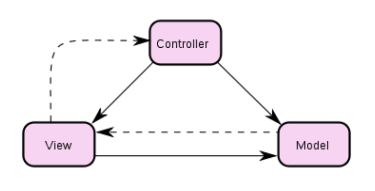
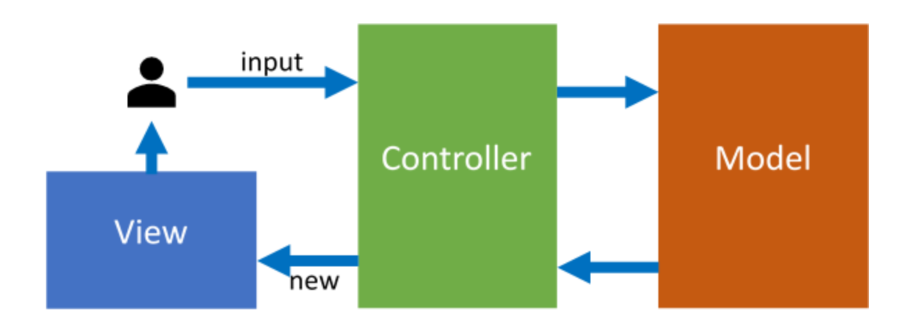
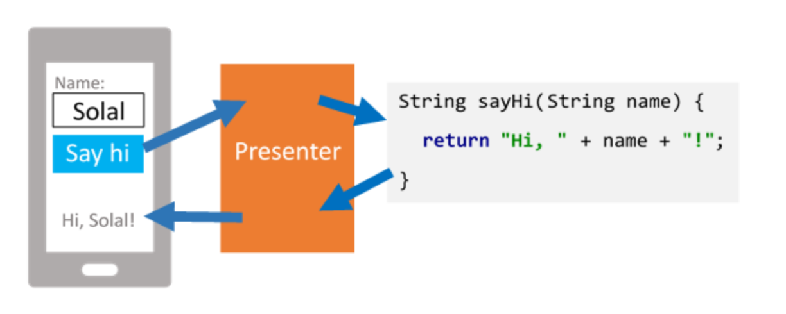
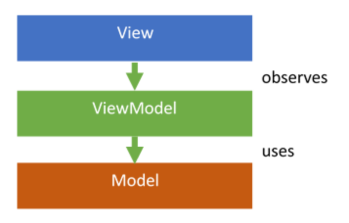

# [CS-305] Summary SwEng

[TOC]

## 1.	Complexity

### What is complexity?

> Large teams need managers

A manager coordinates the energies of the team. The larger the team is, the harder it is to manage


**Complexity** is the number 1 challenge in software engineering (e.g. we have been building bridges for 3k years; yet some still fail and have to be rebuilt. In comparison, we have been building softwares for 60-70 years). Running a program is essentially going through a decision tree : a small difference in the input (parameters) can totally change the output of the program.

The most common practice to avoid failures is **testing** (trying multiple input values and check if the result corresponds to what is expected). Problem : we cannot test everything since
$$
\text{\#paths} \approx 2^{\text{program size}}
$$
(the number of paths is exponential $\implies$ called **path explosion**). In general, this is a lower bound since we often have loops (they add a lot of branches). There are ways using **machine proofs** to prove (check all inputs) the corresctness of a program, but these methods cannot achieve nowhere near as many lines of code as for example Firefox (firefox is WAY to big to be checked even by a machine). The biggest program checked by a machine has 100k lines of code, firefox has $\gt 5$M lines of code and Windows over $50$M lines of code $\implies$ these programs are *impossible* to test entirely


Symptoms of complexity :

- **many components** : high number of components in the software $\implies$ more chances for things to break
- **many interconnections** : components interacting with each other in too many ways $\implies$ hard to decipher the intent of these interconnections and hard to understand any component as it requires knowing all the other components it interacts with
- **irregularites and exceptions** : extensive use of exceptions can disrupt the normal control flow and make it difficult to understand how one can arrive at a particular point in the code
- **high Kolmogorov index** : complexity of the description of something (way of describing ir/regularity)

---


### Modularity

> **Modularity** is a way to deal with a complex system by breaking it into smaller pieces and deal with each piece in isolation. Those pieces are **modules** that work together to achieve the function of the system while being only weakly connected to each other compared to the strong connections within each module
>
> Modularity can help us tame complexity

Let's take an example

- Let's assume that the number of bugs in the program is proportional to its size, and that the bugs are randomly distributed throughout the code. The programmer compiles the program, runs it, notices a bug, finds and fixes the bug, and recompiles before looking for the next bug. Assume also that the time it takes to find a bug in a program is roughly proportional to the size of the program. We can then model the time spent debugging as follows:
  - $BugCount \sim N$
  - $DebugTime \sim N \times BugCount \sim N^2$
- Now suppose that the programmer divides the program into $K$ modules, each of roughly equal size, so that each module contains $N/K$ statements. To the extent that the modules implement independent features, one hopes that the discovery of a bug usually will require examining only one module. The time required to debug any one module is thus reduced in two ways: the smaller module can be debugged faster, and since there are fewer bugs in smaller programs, any one module will not need to be debugged as many times. These two effects are partially offset by the need to debug all $K$ modules. Thus our model of the time required to debug the system of $K$ modules becomes :
  - $DebugTime \sim (N/K)^2 \times K \sim N^2/K$

---


### Abstraction

> An **abstraction** is a simplified model of a module or collection of modules.
>
> - Abstractions can be high-level, such as representing a mechanical printing press as "something that can write text", which is a description that could also apply to a human with a pencil.
> - Abstractions can also be low-level, such as representing that same printing press as a machine that takes in a template, ink, sheets of paper, and performs operations resulting in modified sheets of paper.

In the context of modularity, abstraction allows us to create modules whose *interface* to the external world makes them easy to reason about and thus easy to work with. We hide the complexity within each module behind a simpler interface. Once that’s done, we can use a module without having to know what happens inside. Modularity and abstraction are often equated with "information hiding".


## 2.	DevOps

The term **DevOps** is the contraction of software development and IT operations. It aims to shorten the software development life cycle and to provide continuous delivery of functionality while preserving high software quality. In this context, we will discuss tools like **version control systems** (git), which allow developers to track code and code changes, ensuring that all members of a team can work on the same codebase without unnecessary conflicts. **Build systems** (gradle, maven, sbt, make, ...) allow developers to automatically compile and run their code, removing the risk of human error in complex manual processes. **Continuous integration systems** allow developers to see the effect of their changes as they go, providing fast feedback that is essential to reduce defects.

> A **software** is a bunch of programs assembled into a system whose pieces all work together. A software has 5 key attributes :
>
> - **reliability** : does what it is supposed to do
> - **safety** : fail-safe default
> - **security** : confidentiality, integrity, ...
> - **performance** : latency, fps, ...
> - **manageability** : keping the software operational


### Version control systems

> **Keywords** : sharing, master version, commits, merges


Here's a quick git cheatsheet from [project 3](../course-github/project/03-Operations/Handout.md) :

- Create a new repository at `pwd`:

  ```bash
  git init   		# Initialize a new repository
  git add .  		# Add all the files in the current folder to the repository
  git commit 		# Create a first commit
  ```

- Take a file from `tracked` to `untracked` :

  ```bash
  git rm --cached <file>
  ```

- Add (or remove) files from the last commit :

  ```bash
  git commit --amend
  ```

- Publishing a repository to GitHub :

  ```bash
  # Add GitHub as a "remote" to the repository
  git remote add origin https://github.com/RaulinN/your-repository-name.git
  # Push commits to GitHub
  git push -u origin master
  ```

- Modifying a repository URL :

  ```bash
  git remote set-url origin <the correct URL>
  ```

- Branches in git :

  ```bash
  git checkout -b <branch-name>				# Create the branch (from current branch)
  git push -u origin <branch-name>		# Push the branch to remote
  git checkout <branch-name>					# Travel to another branch
  git branch -a												# List all branches
  git merge <branch-name>							# Merges <branch-name> into current branch
  ```

---


### Build systems

A development team needs to compile every source file, resource and dependency into a single package containing one or multiple binary artifacts. This is a critical and non-trivial step in the development process (many files, e.g. 62k+ files for the linux kernel). To help in this task, developers use a **build system**, which automates all stages of the process of transforming a collection of source files into a shippable artifact


The first step is to make the code easily manageable by organizing the codebase’s **file structure**. A good file tree structure should make it easy to understand the overall project architecture so that, if a bug occurs in a certain module, the files containing the problematic code can be easily tracked down. Unfortunately, no single solution exists for this problem. It is very much dependent on the language/framework used. 

- Example: Java – the file structure is enforced by the compiler and reflects the package structure defined in the code. This makes it very easy to find a specific file but this can also lead to very deep directory structures (e.g. `ch.epfl.sweng.project.module`)

- Example: C/C++ –  the file structure is entirely created by the developer. Public headers and the source code are usually stored in separate directories. This is done specifically because of how libraries are exported. The source files are compiled into a *.lib/*.dll file that contain the executable and the public headers define the interface available in a specific library.


The next logical step is to **compile** your source code. Some languages/frameworks have already great tools as simple as clicking a button. Some lower level languages like C/C++ delegate this complexity to the user (tools such as CMake and Make have been created to automate the build). The goal of a good build system is to efficiently compile a large amount of source files. It should also report compilation errors to the user along with all the necessary information to fix the error quickly. Of course, the build system needs to be run on instances of each different platform to be able to compile to them (you cannot compile for macOS on a Windows machine). 

The build process can also include **unit tests**. These tests validate the basic functionality of the program and are the first line of defense against bugs. However, these are run "offline", meaning they do not interact with the outside world (Web API, Database, ...) but rather a fake, predefined version of it called "Mock".


Large projects can depend on a lot of third party code that needs to be integrated in the build pipeline using **dependencies**. For example, dependencies for C/C++ need to be either built from source or the library for the correct platform needs to be manually downloaded and linked in your final assembly. Other languages, like Rust and Go, have specific ways of dealing with dependencies that are enforced by the compiler itself that mostly automate this task. Today, most programming languages have tools that provide easy access to dependencies (vcpkg for C/C++, Maven for Java, ...).


The last step called **packaging and versioning** combines all binary artifacts, resources and dependencies that a product needs to fully run in a single package (installer, archive, ...). The package is assigned a unique version number (conventionally follows a pattern of the form MAJOR.MINOR.PATCH)

---


### Continuous integration

**Continuous integration** (**CI**) is the practice of merging all developers' working copies to a shared mainline (could be a dedicated branch in the repo) several times a day and automatically building the software, allowing teams to detect problems early. That is why this integration is called continuous. By integrating so frequently, there is significantly less back-tracking to discover where things went wrong, so you can spend more time building features and less time debugging. 

To increase the chances of finding important problems early, test in a clone of the production environment. Test environments often differ dramatically from production environments (e.g., the environment is controlled: the versions of used software are known, there are no or few other applications installed that can interfere with yours, the configuration of the machine is also known, data is controlled and not the user’s), and many failures manifest in production but not in test environments. 

Important steps in CI :

1. maintain a single source code repository (mainline) with configurations files and dependencies
2. automate the build process (e.g. make, gradle) and test process (test suite automatically invoked when project is built)
3. building project after every commit to the mainline, so that devs can see very quickly when the project started not building
4. keep the builds as fast as possible (e.g. making tests as optimized as possible, or parallelizing them)


## 3.	Testing

Obviously, code should not crash, cause damage or loose data...

We can use **formal verification** to check that our code is correct. However, this is hard and time-consuming. This is why we might have to resort to **testing**. Testing is *not* a proof but gives confidence in code correctness by checking behaviour in certain known cases. 

**Manual testing** is not enough (write code, manually run it and manually check it) because we might forget tests, misread results, miss location dependencies, or time dependencies, ... This is why we have **automated testing** (write code, write test code, run tests). Here's an example of an automated test using the `JUnit` framework (`Java`) :

```java
@Test
void onePlusOneIsTwo() {
  assertEquals(2, 1 + 1);
}

// Using the function
public static void assertEquals(int expected, int actual)
```

We can also pair `JUnit` with `Hamcrest` :

```java
@Test
void onePlusOneIsTwo() {
  assertThat(1 + 1, is(2));
}

@Test
void emptyOrOneTwoThree() {
  List<Integer> values = ...;
  assertThat(values, either(empty()).or(contains(1, 2, 3)));
}
```

`JUnit` has other useful annotations such as

```
@BeforeAll				// run before all tests
@AfterAll					// run after all tests
@BeforeEach				// run before each test
@AfterEach				// run after each test
```

We can also tag some tests (e.g. `@Tag("fast")`) and then only run tests that have a certain tag

```java
@Tag("fast")
@Test
void cannotAddNullUser() { ... }
```


Testing functions and modules are the two most common kinds of tests. Sometimes, functions are harder to check :

```java
/** 
 * Posts <message> on the Piazza forum
 * as the current user
 */
void postMessage(String message) {
  ...
}
```

To check those functions, can use a technique called **dependency injection** to artificially fake some data (for example, make the Piazza forum think the message was posted by an Instructor)

**Stress tests** is the idea of testing if an application can resist high activity peaks at a moment in time (for example, IS-Academia when the semester starts...). They are less common because they require more setup

---


### When to test

The most common way is to test only after writing code. It is by far the easiest option but it will probably too late to fix design if the tests uncover a major flaw in the model

We could also apply the TDD method (**test-driven development**) which consists of writing tests, then the code and finally test it. The advantage is that is force us to think before coding $\implies$ less debugging needed. Moreover, there's an instant feedback when coding. The problem is that this is a higher time investment and it wastes time if the model changes a lot

Finally, we can apply the **regression testing method** (testing after release). The idea is simple : you will have bugs, but how to deal with them? A user report it, you simulate it, fix it, and report that the bug was fixed

---


### Test evaluation

We can evaluate tests using two criteria :

- **coverage** : how much code is tested? (how much code is tested divided by total code amount)
  
  - **Line coverage** (number of lines the program the program considered divided by total code amount) : not useful at all
  
  - **Statement coverage** (number of statements the program the program considered divided by total code amount) : better but still not perfect (e.g. 2 `if` can be covered with one test... which feels wrong)
  
  - **Branch coverage** (same idea as statement coverage, but count an `if` (for example) only if the branch was taken) : even better but still not perfect since same value can be obtain by taking different paths. The idea behind this is to cover 100% of the code, all branches must have evaluated once to “false” and once to “true”
  
  - **Path coverage** (tests how many paths the tests go through, if the program has 5 paths, we need 5 tests to check all of them (have 100% coverage)) : gives us 100% path coverage
  
    :warning: some programs may have infinite paths. In these cases, we cannot use path coverage (since any finite amount, let's say $N$, tests we write, the coverage will be 0% (since $N/\infin = 0$)), e.g.
  
    ```c
    do {
      fprintf(stdout, "Enter a number between 1 and 10 : ");
      n = getUserInputInt();
    } while (n < 1 || n > 10);
    ```
- **performance** : how fast can the tests be run?
  
  - How fast does each test run?
    - Avoid timeouts, use callbacks instead
    - Since tests must be independent, enable parallelism
  - How fast do all tests run?
  - How many tests run?

Let's evaluate the coverage on this function

```java
int getPriority(User user) {
  if (user == null) throw ...;
  int priority = 100;
  
  if (user.isInfluencial()) priority += 100;
  if (user.hasUnpaidBills()) priority /= 2;

  return priority;
}
```


## 4.	Requirements

### Software validation

The question is "are we building the right thing?". We can use different techniques to answer this question :

- **Development processes** : change the development process to include more user feedback
- **Acceptance testing** : let a user use the system and tell you whether it is what they wanted. Even if your code is correct according to the requirements, you may discover that there was a misunderstanding and the requirements you wrote down are not what the user wanted
- **A/B testing** : giving some users version “A” of your software and some users version “B”, then giving versions a score based on some metric and keeping the one with the highest score

---


### Requirements

A user's problem is a **set of requirements** (e.g. a telephone should be able to make calls). A requirement is not always objective (e.g. he may require a "good sound qualify" on his headphones, but the definition of "good" will diverge depending if the user is a random, a musician or a gamer)

Something to remember is that what users want is not always what they need (partly because it's hard to ask for something you don't know)!

The first step to define requirements is to *talk to users*, this process is often called **requirements elicitation**

It is sometimes useful to "simulate" users, these are called **Persona** and are fictional users representing a group (e.g. "Alice is a manager who uses her phone all the time between meetings mainly for emails and calendar" or "Bob is an office worker who rarely uses his phone for work but frequently browses the web and listens to podcasts on his commuts to work")

A **user story** is an informal description in natural language and follows the template "*As a [role], I want to [action], so that [reason]*"

A **structured definition** follows the pattern *Given [context], when [smth happens], then [reaction]*


The concept of **validation** is asking to customer(s) if the requirements correspond to the user(s) need. If the programer has access to a wide network (Facebook, ...), he can validate "in the wild". These validations may help prioritise which features must be implemented first, this is called **prioritization**. To implement priorization, we often put features in priority classes ($P_0, P_1, P_2$) where $P_0$ has the highest priority and $P_2$ the lowest


## 5.	Writing good code

### Design patterns

What differenciate an experienced programer from a nooby? The experienced programer has a "toolbox" of useful stuff / solutions that he is using, those are called **design patterns**

> "A **pattern** is a careful description of a perennial solution to a recurring problem [...]" – Christopher Alexander (1977)


The difference between a pattern and a library, is that libraries as used "as is", whereas patterns are templates that need to be customised. There are 4 basic design patterns : encapsulation, inheritance, iteration and exceptions

Here are other design patterns commonly used :

- **Builder** : helps building objects

  The following constructor has a lot of arguments! Instanciating can become hard to read

  ```java
  Rectangle(
    int width, int height,
    int borderThickness, Color borderColor, boolean isBorderDotted,
    Color backgroundColor,
    boolean hasShadow, int shadowLeftOffset, int shadowTopOffset, 
    ...
  ) { ... }
  
  // Instantiation
  Rectangle r = new Rectangle(
  	100, 200,
    10, Colors.BLACK, false,
    Colors.RED,
    true, 0, 10,
    ...
  );
  ```

  Instead we use the **builder pattern** to express construction in a nicer way

  ```java
  new RectangleBuilder(100, 200)
     .withBorder(10, Colors.BLACK)
     .withBackground(Colors.RED)
     .withOffsetShadow(0, 10)
     .build();
  
  
  class RectangleBuilder {
    RectangleBuilder(...) { ... }
    RectangleBuilder withBorder(...) { ... }
    RectangleBuilder withDottedBorder(...) { ... }
    RectangleBuilder withBackground(...) { ... }
    RectangleBuilder withOffsetShadow(...) { ... }
    Rectangle build() { ... }
  }
  ```

  The methods to configure the `RectangleBuilder` return the builder itself while `build` return the object (`Rectangle`) itself

  

- **Decorator** : the core idea is that a decorator “wraps” a class to augment it

  Given an interface representing a social network with users and an implementation

  ```java
  interface SocialNetwork {
      List<User> getUsers();
  }
  
  class GitHub implements SocialNetwork {
    ...
  }
  ```

  We can write a decorator that wraps a network and adds retry logic

  ```java
  class RetryingSocialNetwork implements SocialNetwork {
    SocialNetwork wrapped;
  
    RetryingSocialNetwork(SocialNetwork wrapped) {
      this.wrapped = wrapped;
    }
   
    List<User> getUsers() {
      try { return wrapped.getUsers(); }
      catch (...) { ... }
    }
  }
  ```

  

- **Composite** : represents all items in a uniform fashion

  Applications often needs to handle groups of items, such as files and folders. Folders can contain files, and they can also contain other folders

  ```java
  class File { ... }
  
  class Folder {
    List<File> files;
    List<Folder> folders;
    ...
  }
  ```

  Any code dealing with folders must explicitly deal with both files and folders, this gets exponentially worse as more kinds of items are added, such as libraries that can contain folders, files and other libraries. Instead, we can use the **composite pattern** to represent all items in a uniform fashion:

  ```java
  interface Item {
    List<Item> children();
  }
  
  class File implements Item { ... }
  class Folder implements Item { ... }
  class Library implements Item { ... }
  ```

  From an outside perspective, all items look the same. Internally, each item can behave in its own way: for instance, a “search” operation on a file will search the contents of the file, while a folder will delegate the search to its children

  

- **Adapter** : an object that wraps one interface and exposes another

  When building complex systems from parts such as third-party libraries, it is unlikely that all parts use the same models to represent various concepts. This is a problem for integrating parts because they cannot interact if they do not speak the same language. This problem also exists in real life: one cannot use a Swiss three-pronged electrical plug on a European power outlet. The solution is an electrical adapter

  Fore example, consider the following service that gets the temperature of places

  ```java
  interface Place {
    double getLongitude();
    double getLatitude();
  }
  
  interface WeatherService {
    int getTemperature(Place place);
  }
  
  // Another part of the system may represent cities as follows :
  interface City {
    String getName();
  }
  ```

  To get the temperature of a city, we must write an adapter

  ```java
  class CityPlace implements Place {
    CityPlace(City city) { ... }
  
    double getLongitude() { ... }
    double getLatitude() { ... }
  }
  ```

  This adapter will internally use location service to get coordinates from a city name. Using the adapter, we can now get the temperature of a city by wrapping it in an adapter

  

- **Observer** :

  Polling is inefficient if the answer is “no” most of the time, such as whether the user has clicked on a button. Instead, we should ask the button to let us know whenever something happens. This is the **observer pattern**, implemented by keeping track of who has asked for notifications, such as in this `Button` that remembers a list of click handlers

  ```java
  class Button {
    private List<Runnable> handlers;
  
    void add(Runnable handler) { ... }
  
    void remove(Runnable handler) { ... }
  }
  ```

  


Moreover, here are four new design patterns (not seen in 1st year at EPFL) :

- **Singleton** : used if there is only one instance of an object allowed to exist

  Some objects must only have a single instance. Consider a user interface: many applications only have a single main window, and do not want users to create more than one since they manage multi-tasking within the application, such as with tabs. One way to solve this problem would be to synchronize all instances of some objects, so that they always have the same value. However, this is tedious and bug-prone. Instead, we can use the **singleton pattern** to ensure there is only a single instance of an object

  For instance, this configuration class can only be accessed through a static method, which can internally make sure that it always returns the same instance

  ```java
  class Config {
    private Config() { /* ... */ }
  
    private static Config INSTANCE;
    public static getInstance() {
      if (INSTANCE == null) { INSTANCE = new Config(); }
      return INSTANCE;
    }
  }
  ```

  

- **Factory** : used to create objects without having to specify the exact class of the object

  Let's say users can choose which file to open, the file may be XML or JSON (thus the code cannot know this at compile time). We must have a way to select the implementation at runtime. We can use the **factory pattern** by creating a method that chooses which subtype to return based on its argument:

  ```java
  interface RecordReader { /* methods to read records */ }
  class XmlRecordReader implements RecordReader { /* XML implementation */ }
  class RecordReaderFactory {
    static RecordReader get(String path) {
      if (path.endsWith(".xml")) {
        return new XmlRecordReader(path);
      }
      ... // JSON, CSV, ...
    }
  }
  
  // Usage
  var reader = RecordReaderFactory.get("file.xml");
  ```

  

- **Proxy** : used to access a remote ressource as if it was a local ressource

  Some resources can be present either locally or remotely, apps could handle these cases separately, but this increases code complexity, and implies that existing apps will not be compatible with any new remote cases. Instead, we can use the **proxy pattern** to treat remote resources as if they were local. The application believes it is communicating with a local resource, but in fact this resource is a proxy that communicates with a remote resource under the covers.

  ```java
  interface WebClient { /* methods to talk to a remote server */ }
  
  class RemoteFileSystem implements FileSystem {
    private final WebClient client;
  
    public RemoteFileSystem(WebClient client) { this.client = client; }
  
    public Folder getRootFolder() {
      // ... create a web request corresponding to the "get root folder" operation ...
      // ... get a response ...
      // ... translate the response to a Folder, this method's return type ...
    }
  }
  ```

  

- **Visitor** : used to decouple data from the entities that operate on it (e.g. can add new operations to a data structure without the data structure)

  ```java
  interface Shape { }
  
  class Square implements Shape { ... }
  class Triangle implements Shape { ... }
  class Circle implements Shape { ... }
  ```

  Imagine you want to add a feature that draws these shapes. You could add a method to the interface and implement it in every class. However, you may want multiple drawing methods for specialized tasks, such as drawing as PNG, as JPEG, as SVG… and shapes should not be aware of the intricate implementation details of image file formats.

  This is equivalent to Scala pattern matching. We implement using the **visitor pattern**, which allows us to emulate double dispatch

  Let us begin by declaring a visitor interface, with the methods we wanted to write in the first place:

  ```java
  interface ShapeVisitor {
    void visit(Square square);
    void visit(Triangle triangle);
    void visit(Circle circle);
  }
  
  // we can then add a single method to the interface allowing visitors to visit it
  interface Shape {
    void visit(ShapeVisitor visitor);
  }
  ```

  We will be able to use this method with any visitor, thus we only need one method on the interface to add any number of methods to the hierarchy. Calling the `visit` method on a `Square` call will end up calling the `visit(Square)` method on the visitor, since `this` is statically typed to be a `Square` in this context. Other implementations of the interface should have the exact same code, whose effect will change due to the static type of `this`

  ```java
  class Square implements Shape {
    void visit(ShapeVisitor visitor) {
      visitor.visit(this);
    }
  }
  ```

  Our drawing problem from earlier can thus be solved by writing a visitor:

  ```java
  class DrawingVisitor implements ShapeVisitor {
    public void visit(Square square) { /* ... */ }
    public void visit(Triangle triangle)  { /* ... */ }
    public void visit(Circle circle)  { /* ... */ }
  }
  
  // usage, assuming a "getSomeShape" method returning a Shape:
  getSomeShape().visit(new DrawingVisitor());
  ```

  


Here are three additional patterns used for UI :

- **Model-View-Controller** : MVC

  The **Controller** is a class that dictates the lifecycle of the View and updates the Model data. The Controller decides how to mutate the Model and optionally the View after each user input.

  Model, View and Controller form a triangle as follows: the Controller holds an instance of the View and the Model, while the Model notifies the View of its data changes, and the View notifies the Controller of user inputs. The View must also keep a reference of the model, as it must know the shape and types of the Model and transform them to some corresponding UI displays. All models and views inherit from the Object class, which implements the Observable pattern: views observe models and delegate decisions to the Controller. Note that data updates in the model require no changes from the Controller in the View if the layout does not change, i.e. values of the Model are automatically updated in the view! The Controller will only mutate the View if, for instance, a different View must be selected

  

  However, following the evolution of web systems, in which the View lives in a client browser while Model and Controller sit remotely on a back-end server, modern usage of the MVC pattern usually refer to the implementation in which the **Controller** is an entity which receives user input, and creates a View to display based on the Model. From the users’ point of view, they talk to the Controller by interacting with the View (e.g. clicking a link) and receive back another View. Internally, the Controller talks to the Model

  

  

- **Model-View-Presenter** : MVP

  The MVP pattern is a natural consequence of the way frameworks like Android work: user inputs must go through the View. In MVP, the **Presenter** is a mediator between the View and the Model. The View calls the Presenter whenever it receives input, and the Presenter calls the View whenever it needs to update a part of the View. Similarly, the Presenter calls the Model when it needs to execute core logic. The View and the Model never talk to each other. Usually, there is a 1-to-1 mapping of Presenter to View. The difference between MVC and MVP lies in the fact that MVP allows the Presenter to update the View imperatively, without the need to rebuild a complete View object. For instance, a web page may use a Javascript presenter to detect user inputs, fetch data from the server directly, and mutate the HTML in-place, rather than load an entire webpage at each request.

  

  When the user clicks the button, the View tells the Presenter, which calls the Model. The Model then returns the proper greeting, which the Presenter tells the View to display

  In practice, MVP is the default way to write applications in Android, and a common way to write UI applications in general

  

- **Model-View-ViewModel** : MVVM

  The core idea of this pattern is that the View can observe data changes, instead of explicitly being called to update something specific. Indeed, in the MVP model, each change from the model must be explicitly forwarded to the view and vice-versa: however, modern applications are very complex with thousands of UI elements and models and any forgotten call will cause a desynchronization of state and view, which proved to be major source of bugs. To solve this issue, MVVM systems automate the bindings between them. Rather than imperatively mutating the state and the view at each user input, data flows automatically from the model to the view. Thus, View, ViewModel and Model have a “depends-on” relationship as follows:

  

  The ViewModel is an intermediate representation which contains data and commands, as well as an implementation of the Observer pattern to allow Views to be notified of changes. Importantly, it does not describe how the data should be displayed, but only what to display. To reuse the example above, while in MVP the Presenter would tell the View “display this text in that specific text block”, in MVVM the ViewModel would update its “current text” property and let the View decide where to show it.

  The View is a function of the ViewModel, i.e. the underlying MVVM system will compute and derive the view automatically from the current state of the ViewModel. While it can incrementally update itself as an optimization (e.g., Svelte), it can also recompute itself at any time. This is useful in scenarios where the View is thrown away when not in focus, such as mobile apps. Data flow may be unidirectional (React.js, Flutter, ...), i.e. the model state must be explicitly modified, and changes are automatically pushed down to the view, or bidirectional (Vue.js), i.e. the view also binds backwards to the ViewModel such that user interactions on the View affect the model state directly and automatically

  In practice, MVVM is used in many modern frameworks: Windows with the “Universal Windows Platform”, Android (Jetpack Compose), React.js and Vue.js on the Web…

---


### Inheritance & Containment

**Inheritance** is a tool that allows to reuse code and make classes be used under common interfaces. We can then use polymorphisms (operations that adjust at runtime). You should use inheritance only when it simplifies design. Before designing something with inheritance, first ask "is containment a better choice than inheritance in this case?"

Inheritance (= "is a") should be used when two objects share common data and methods. Containment ("has a"), on the other hand is the idea of implementing a class with the help of another

```java
class Passenger {
  FullName name;									// Example of containment
  Address address;
  PhoneNumber number;
}

class VIP extends Passenger {			// Example of inheritance
  FrequentFlyerNumber account;
}
```


This concept of the "is a" relationship is known as the **Liskov substitution principle** (**LSP**) : a subclass is a specialized version of the base class and all methods of subclass are usable through base class interface without knowing the type. Moreover, the base class can be replaced by a subclass, and client code will still be correct

The following code *does not* follow the LSP principle because of the assertion in the test part. The `assert` would return `false` in case the object passed in `initialize` a `Square` ($10^2=100 \ne 50$)

```java
public class Rectangle {
  private int width; private int height;
  
  public void setWidth(int width) { this.width = width; }
  public void setHeight(int height) { this.height = height; }
  public int getArea() { return width * height; }
}

public class Square extends Rectangle {
  public void setWidth(int width) { super.setWidth(width); super.setHeight(width); }
  public void setHeight(int height) { super.setWidth(height); super.setHeight(height); }
}

// TEST
void initialize(Rectangle r) {
  r.setWidth(5);
  r.setHeight(10);
  assert(r.getArea() == 50);
}
```

To make our code LSP friendly, we could use the following approach (making classes immutable) :

```java
public class Rectangle {
  private int width; private int height;
  
	Rectangle(int width, int height) { this.width = width; this.height = height; }
  public int getArea() { return width * height; }
}

public class Square extends Rectangle {
	Square(int height, int width) throws BadParametersException {
    super(width, height);
    if (height != width)
      throw new BadParametersException();
  }
}

// TEST
Rectangle r = new Rectangle(5, 10);
Square s = new Square(10, 10);
Square f = new Square(5, 10);						// throws an exception
```

Note that if we don't want any class to extend our class, then use the keyword `final`

---


### Defensive programming

Inputs should be checked at the beginning of a function to avoid unexpected outputs/behaviours

This should be done using Exceptions on public methods and assertions on private methods. Note that assertions are disabled by default (use `java -ea` to enable when running the program). An **invariant** is something that is always true and are often checked using asserts: Assertions should be used to catch the impossible (e.g. empty default statement)

```java
enum Suit { CLUBS, DIAMONDS, HEARTS, SPADES; }

switch (suit) {
  case CLUBS:
    // ...
    break;
  case DIAMONDS:
    // ...
    break;
  case HEARTS:
    // ...
    break;
  case SPADES:
    // ...
    break;
  default:
    assert false : suit;				// or throw new AssertionError(suit);
}
```


Let's look at defensive copies : is this code immutable?

```java
public final class Period {
  private final Date start;
  private final Date end;
  
  public Period(Date dateStart, Date dateEnd) {
    if (...) throw ... 		// checks that end > start
      
    this.start = dateStart;
    this.end = dateEnd;
  }
  
  public Date start() { return start; }
  public Date end() { return end; }
}
```

This code has two problems : the constructor and the accessors. Indeed, someone could break the immutability by exploiting the fact that `Date` is not immutable. E.g.

```java
Date s = new Date();
Date e = new Date();
Period p = new Period(s, e);

e.setYear(78);								// modifies internals of p
```

```java
Date s = new Date();
Date e = new Date();
Period p = new Period(s, e);

p.start().setYear(78);
```

To solve this problem, we use **defensive copies** on both the constructor and the accessors

```java
public final class Period {
  private final Date start;
  private final Date end;
  
  public Period(Date dateStart, Date dateEnd) {
    this.start = new Date(dateStart.getTime());
    this.end = new Date(dateEnd.getTime());
    
    if (...) throw ... 		// checks that this.end > this.start
  }
  
  public Date start() { return (Date) start.clone(); }
  public Date end() { return (Date) end.clone(); }
}
```


## 6.	Code evolution

A **code smell** is a sign that something is not ok with your code. Here's a [cheatsheet](https://moodle.epfl.ch/pluginfile.php/2850341/mod_resource/content/1/Smells-to-Refactorings%20cheat%20sheet.pdf) that maps code smells to the refactoring method used to eliminate them

Refactor = good thing! Do it as often as possible!

No need to refactor stuff that nobody uses...


## 7.	Ethics & responsabilities

The **programmer's oath** (from R.C. Martin): in order to defend and honor the profession of computer programmers, I promise that:

1. I will not produce harmful code
2. The code that I produce will always be my best work
3. I will provide, with each release, a quick, sure and repeatable proof that every element of the code works as it is supposed to (aka. tests)
4. I will make frequent small releases that will not impeed progress
5. I will fearlessly and relentlessly improve the code at every opportunity; I will never make the code worse
6. I will keep productivity (my own and my team) high; I will do nothing that decreases this productivity
7. I will continuously ensure that others can cover for me and that I can cover for them
8. I will produce estimates that are honest, both in magnitude and precision; I will not make promises without certainty
9. I will never stop learning and improving my craft


## 8.	Performance

There are two facets to the performance of a software system: *throughput* and *latency*. Throughput is the number of work items passing through the system per unit of time, such as the number of requests a Web server can process per second. Latency is the time it takes for a single work item to be processed, such as the time between a Web server receiving an HTTP request and that same machine receiving the response from the server.

Some software systems have specific performance requirements. These are often called **Service Level Objectives** (**SLO**), which are part of a **Service Level Agreement** (**SLA**). For instance, an SLO could be "the system must handle at least 1000 requests per second", or "99% of requests must be served in less than 2 seconds".

Here are a few ideas to improve performances: **caching**, **batching**, **parallelism**, **lazy execution**, **speculative execution** (perform a task before it is even asked for (used in CPUs)), optimizing common cases, **algorithm choices** (quick sort $>$ buble sort), **avoid copying** (pointers)


### Benchmarking

Estimating software performance via direct measurement is called **benchmarking**: write down the current time, execute an operation, write down the current time, then subtract the two times to know how long the operation took.

Measuring time itself is not trivial! Some methods are faster than others, such as obtaining the time from the CPU directly rather than going through the operating system’s timezone-handling logic. One also cannot rely on measuring a single operation, due to likely variance in the distribution of operation times, thus a benchmark needs to run the operation enough times to get statistically meaningful results. Some run times have warmup effects, such as tiered just-in-time compilation in the Java runtime, meaning that the first few times a piece of code is run will be slower than the next ones. Benchmark results are only meaningful if you compare them to **baselines**, to know how much you improved and how much further you could go. 

There are two general categories of benchmarks: **end-to-end benchmarks**, which measure the performance of an entire system, and *microbenchmarks*, which measure the performance of a small part of a system, such as a single function or class. 

End-to-end benchmarks are more representative of what you'd expect from the system as a whole, but they are more complex to set up and run, and their results are harder to interpret. Microbenchmarks allow you to precisely know how fast a specific part of your code is on some inputs, at the risk of over-interpreting these results and optimizing the wrong thing. Micro-benchmarks also have a higher risk of not measuring what you think they measure due to compiler optimizations; for instance, a common microbenchmarking mistake is to execute a side-effect-free operation in a loop without doing anything with the operation’s result, thereby allowing the compiler to surreptitiously optimize your code by removing the loop entirely – you end up benchmarking a very fast and empty piece of code.


### Profiling

If your system is not as fast as you need it to be, the next question is "why". The answer is obtained by **profiling**: building a performance profile of your software, you will know which part is the **bottleneck** that slows the system down. It is crucial to obtain a performance profile before benchmarking specific operations or attempting to improve your code’s performance; if you do not know why the software is slow, you will likely waste time optimizing operations that are already fast enough (Amdahl's law). 

There are two main ways to profile software: **instrumentation** and **sampling**. Instrumenting a piece of code means modifying it to add code that keeps track of what is happening, which provides detailed and accurate information at the cost of slowing down the code. Sampling a piece of code means periodically pausing it while it runs and checking which part of the code is executing, which has less overhead but is less accurate. 


### Modeling

Another way to analyze a system’s performance is **modeling**. Instead of measuring the real system’s performance, one can build a high-level model of it instead and compute theoretical limits on the system’s performance. This can be done before any code is written, which avoids wasting time building a system that is slow by design. 

Using such models helps to predict the speedup achievable by a given change in the program or the theoretical maximum speedup you can achieve. This is useful to know where you need to put your effort. One such model is *Amdahl’s law*. One of its intuitive interpretations is the following: “A program cannot be faster than the slowest of its components”. Here is the formal definition of the law for the parallel computing:
$$
S_{\text{latency}} (s) = ((1-p)+p/s)^{-1}
$$
where $S_{\text{latency}}$ is the speedup of the whole task, $s$ is the number of threads and $p$ is the portion of original execution time that will benefit from parallelisation. By taking the limit of the speedup with $s \rightarrow \infin$, we obtain the maximum theoretical speedup achievable. 

Another interpretation of this law gives a good point to keep in mind while working on performance: "improving the performance of a part of the program that takes $x\%$ of the total execution time, can only improve the total execution time by $x\%$"


## 9.	Asynchrony

Asynchronous code execution allows some code to execute independently from the "main" execution thread. This code is referred to as **asynchronous code**. It allows multiple actions to happen at the same time by separating the main program’s execution from independent events like I/O operations. For example, when a request to a server is made, the request is sent and the rest of the program keeps running. In a synchronous fashion, the program would’ve waited until the server’s reply. 

Instead, an extra parameter is provided to the asynchronous function: it specifies to the function what to do with the result once it completes. This parameter, a function, is referred to as a **callback**: as its name suggests, it "calls back" the calling program with the asynchronous result. This callback parameter is **registered** (i.e. stored) to the result event at runtime, and only executed later, when it actually occurs. The callback registration call itself usually **immediately returns**. The program will obtain the value later inside the **callback body only**.

In an asynchronous regime with multiple independent asynchronous tasks, the execution order is not defined: tasks can run simultaneously, sequentially, or in an interleaved order, each on a separate thread. That behavior is called **concurrent**. A key point to remember when dealing with asynchrony is that we never want to block while waiting for a computation to finish. 


> > ***TODO*** continue summary from "how does one write async code"


## 10.	Software development

Software product lifecycle:

1. Requirements gathering & research
2. Specification, planning & design
3. Implementation & testing
4. Deployment
5. Support & maintenance


The **waterfall model** consists of 6 phases: requirements specification, system design, design implementation, verification and testing, system deployment, software maintenance. The key property of the model is that it is linear, it always flows forward. We have documentation and review at each phase transition; specifications serve as "contracts". It has certain strengh (e.g. early validation, structure & discipline). However requirements must be known upfront, it is inflexible and customer does not get to preview the product. The waterfall model could be used with an inexperienced team (for structure), when objectives & solutions are clear or for large & complex projects

**Agile development** prioritize individuals & interactions, working software, customer collaboration and responding to change over processes and tools, comprehensive documentation, contract negotiation and following a plan. Agile development (e.g. Scrum, Kanban, ...) is the opposite as waterfall


Here's the description of one of the most well know agile methods: Scrum. The essence of scrum is Scrum is the **sprint**: a 1-2 weeks rigid fixed length period at the end of which we have a working product (demo). People meet daily. We have multiple peope involved:

- **product owner**: represents customer's or end-user's interests. He translates customer needs into a priority list. It is equivalent to a traditional product manager
- **the team**: builds the product (cross-functional: developers, UI designers, testers, analysts, ...). The team is small (3-9 people)
- **scrum master**: his role is to ensure the team's success (he is NOT a manager). He protects the team from outside inteference (e.g. may push back on product owner). The scrum master could be a member of the team. He is a problem solver (help resolve issues)
- **manager**: advisor

> >***TODO*** finish summary from video SCRUM II