# [CS-307] Summary Multiprocessor architecture

[TOC]


## 1.	Introduction

> **Moore's law** : CPU performance doubled in performance roughly every 18 months for four decades (58% / year)

> **Dennard's scaling** : reduing transistor size also reduces power needs (thus no overheat)

## 2.	Parallelism

> **Amdahl's law** : if you speed up only a small fraction of the execution time of a computation, the speedup you achieve on the whole computation is limited
>
> $\implies$ focus on the big parts of the program

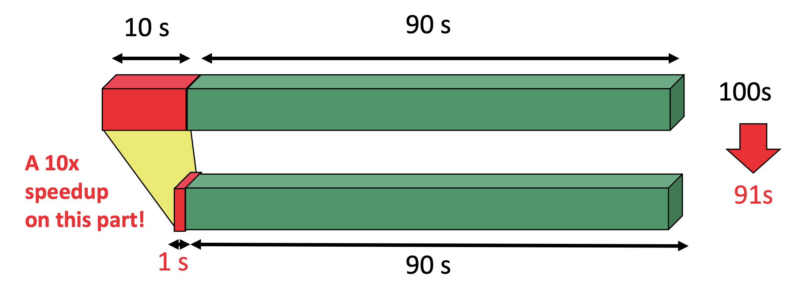
$$
speedup = \frac{1}{\frac{Fraction_{enhanced}}{Speedup_{enhanced}}+(1-Fraction_{enhanced})}
$$
- $Fraction_{enhanced}$ : fraction of the program that can be parallelized
- $Speedup_{enhanced}$ : speedup with number of cores (e.g. a multi-processor with 10 cores $\implies Speedup_{enchanced} = 10$)

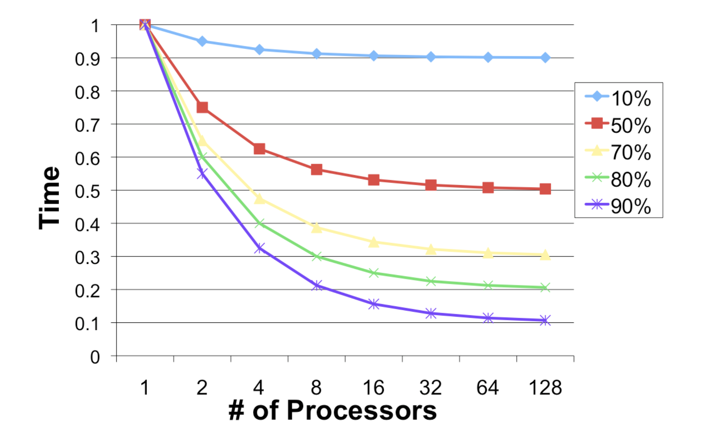


### Introduction to OpenMP

OpenMP is a portable, threaded, shared-memory programming specification with light syntax. Let's take a look at how to parallelise `Hello World`

```c
int main() {
  printf("Hello World!\n");
  return 0;
}
```

```c
#include <omp.h>
int main() {
  omp_set_num_threads(4);
  
  // Do this in parallel
  #pragma omp parallel
  {
  	printf("Hello World!\n");
  }
  return 0;
}
```

OpenMP easily parallelizes `for` loops (that have canonical shape : don't contain `break`, `return`, `exit` or `goto`). It works if loop iterations are independant from one another

```c
#pragma omp parallel for
for (int i = 0; i < N; ++i) {
  float x = 1.f;
  
	for (int j = 0; j < 10; ++j)
		x = (1.f / 3.f) * (2.f*x + v[j] / (x*x));
  result[i] = x;
}
```

We can also specify when we want to parallelize a `for` loop

```c
#pragma omp parallel for if (n > 5000)
for(i = 0; i < n; i += 1) {
	printf(“Hello World!”);
}
```

We can control the number of threads used

```c
#pragma omp num_threads (expression)
```


## 3.	Cache coherence

Caches don't change program semantics, they just exist for performance optimisation (fast data access). The goal of **cache coherence** is to be invisible : given a program executing on CPUs with their own caches, make it operate as if the caches are not present, providing the illusion of simple global memory.


### Valid/Invalid protocol

This protocol is conceptually simple and naïve. The protocol tracks cache block validity with a single bit in cache tag, then broadcast all updated values for a block. Other copies in the system are invalidated and re-read for the new value

`read` succeeds if `valid`, otherwise fetch from memory. When the cache controller sees `write` from another core, invalidate the block. When a core `write` a value, the value is also transfered to memory

When a cache `write`, the signal `BusWr` is sent


### MSI protocol

The MSI protocol has 3 states :

- `modified` (dirty) : this cache has updated the value and holds the authoritative copy + memory is stale, needs to be updated on eviction
- `shared` : one or more caches hold the value, read permissions only
- `invalid` : invalid

We have two core actions : `PRd` (processor read $\implies$ processor attempts to read a line) and `PWr` (processor write $\implies$ processor attempts to write a line)

We have four remote actions :

- `BusRd` : read a line
- `BusRdX` : read a line with intend to modify it
- `BusInv` : get rid of other copies
- `DataWB` : put updated value of a line on the bus

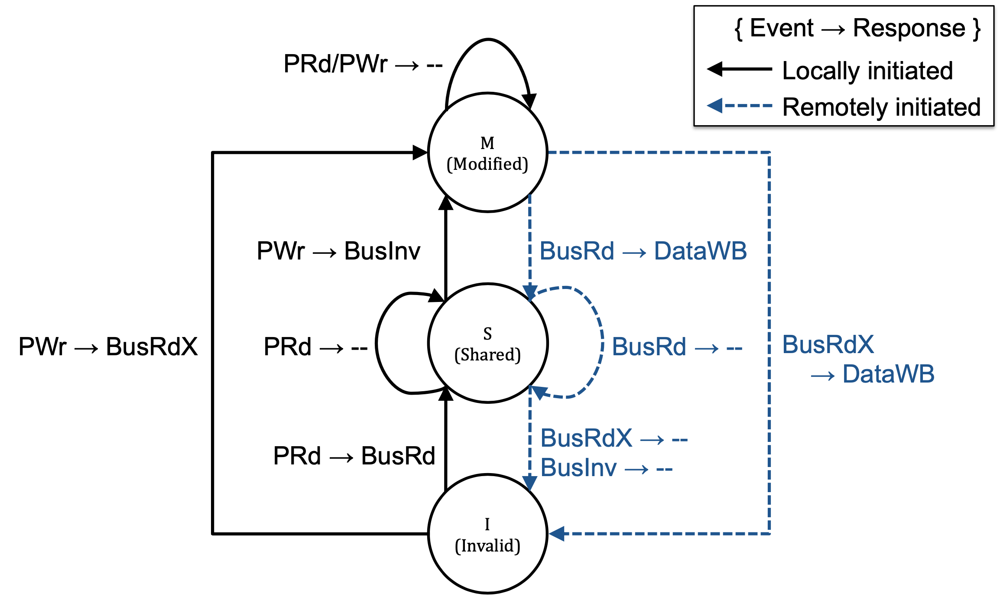

### MESI protocol

This is an extension of the MSI protocol. We add a state called the `exclusive` state. This is the same idea as the shared state, but when we know that the cache contains the only copy in the system. When writing / evicting from an `exclusive` block, we can do it without broadcast / writeback.

MESI protocol reduces bus contention by eliminating `BusInv` messages


### Directoy based protocol

Previously, the bus served as a global “ordering point” for all coherence activity. Instead, we use a **coherence directory** :

- The directory tracks all caches that contain a particular block
- All messages leaving the core are first sent to the directory
- The directory takes the appropriate actions, and then responds to the original cache’s request
- The directory serves as a per-block address “ordering point”

In the directory, each entry stores :

- Bits storing the MSI cache coherence
- Cache tag
- Bits identifying the core ID

> \+ see exo 3 resolution for more infos on directories


## 4.	Optimizing Software


Cache coherence adds extra misses due to transfers. They are called **coherence misses** and are of two types :

- **true sharing** : producer/consumer communication when processors read and write the same variable
- **false sharing** : processors updating different data which are placed *in the same cache block*


> Useful note : generally, a cache line contains 64B and an `Int` is generally approximately 8B


### True/False sharing : histogram

Let's take an example of a program taking a file as input and counting the number of occurences of each of the 26 letters of the alphabet, storing the result in an array. The task can easily be parallelized with a `#pragma omp parallel for` directive.

```c
int histogram[N_BUCKETS];
int in_data[INPUT_SIZE];

#pragma omp parallel for shared (in_data, histogram)
for (size_t i = 0; i < INPUT_SIZE; i += 1) {
  size_t bucket = calc_hist( in_data[i] );
  
  #pragma omp critical
  histogram[bucket] += 1;
}
```

We protect the output array `histogram` with a critical section (only one thread at a time can execute it)... This completely negates the usefulness of parallelism! Let's look at a better solution :

```c
int histogram[N_BUCKETS];
int tmp_hist[N_THREADS][N_BUTCKETS];
int in_data[INPUT_SIZE];

#pragma omp parallel for shared (in_data, tmp_hist)
for (size_t i = 0; i < INPUT_SIZE; i += 1) {
  int tid = omp_get_thread_num();
  size_t bucket = calc_hist( in_data[i] );
  tmp_hist[tid][bucket] += 1;
}

# pragma omp parallel shared (tmp_hist, histogram)
for (size_t i = 0; i < N_BUCKETS; i += 1) {
  int tid = omp_get_thread_num();
  
  #pragma omp critical
  histogram[i] += tmp_hist[tid][i]
}
```

 Here threads update their own `tmp_hist` and merge them later... The problem is that our merge loop has the exact same problem as our first approach! It is running faster only because the merge loop is executing less times. We can surely do better!

```c
int histogram[N_BUCKETS];
int tmp_hist[N_THREADS][N_BUTCKETS];
int in_data[INPUT_SIZE];

#pragma omp parallel for shared (in_data, tmp_hist)
// same as before

# pragma omp parallel shared (tmp_hist, histogram)
for (size_t i = 0; i < N_BUCKETS; i += 1) {
  int tid;
  for (tid = 0; tid < omp_get_num_threads(); tid += 1)
		histogram[i] += tmp_hist[tid][i]
}
```

This method divides the buckets by the threads and eliminates all critical sections but every thread accesses a fraction of everyone's histogram. Now we have a false sharing problem! If two values of `histogram[i]` are updated at the same time by two different processors and happen to live in the same cache block, then the `+=` operation is not atomic anymore.

True sharing is inherent to the algorithm. We can only optimize it, but not eliminate it

---


### False sharing : number counting

```c
int counters[N_THREADS]; // an int is approx 8B. So approx 8 counters per cache line
int in_data[INPUT_SIZE];

#pragma omp parallel for shared (in_data, counters)
for (size_t i = 0; i < INPUT_SIZE; i += 1) {
  int tid = omp_get_thread_num();
  
  if (in_data[i] % 2) counters[tid] += 1;
}
```

We have no true sharing since threads update their own counter, therefore no need to use `#pragma omp critical` as we did previously. The problem is that now, we have false sharing (note : good [YouTube video](https://www.youtube.com/watch?v=dznxqe1Uk3E) explaining what false sharing (and what padding (see later)) is). To solve this issue, we introduce **data padding** which essentially moves the counters into different cache blocks. It introduces excess space that is never used, but eliminates false sharing

```c
typedef struct {
  size_t count;
  size_t padding[BLOCK_SIZE / SIZE_T_SIZE - 1];
} PaddedCounter;

PaddedCounter counters[N_THREADS];

#pragma omp parallel for
for (size_t i = 0; i < INPUT_SIZE; i += 1) {
  int tid = omp_get_thread_num();
  
  if (in_data[i] % 2) counters[tid].count += 1;
}
```

Note that padding is not the perfect solution either! By adding padding, we create a lot of empty space in cache lines. The more "unused but occupied" spots we have, the higher the C/C miss rate will be (Capacity/Conflict misses (not enough room in cache/already another block at the location)). The number of coherence misses is affected by 3 factors : *cache size* (bigger cache $\implies$ more padding $\implies$ more C/C misses), *number of processors* and *cache block size* (for 32B counters, we have false sharing on $\gt$ 32B cache lines, but no false sharing on $\le$ 32B cache lines).

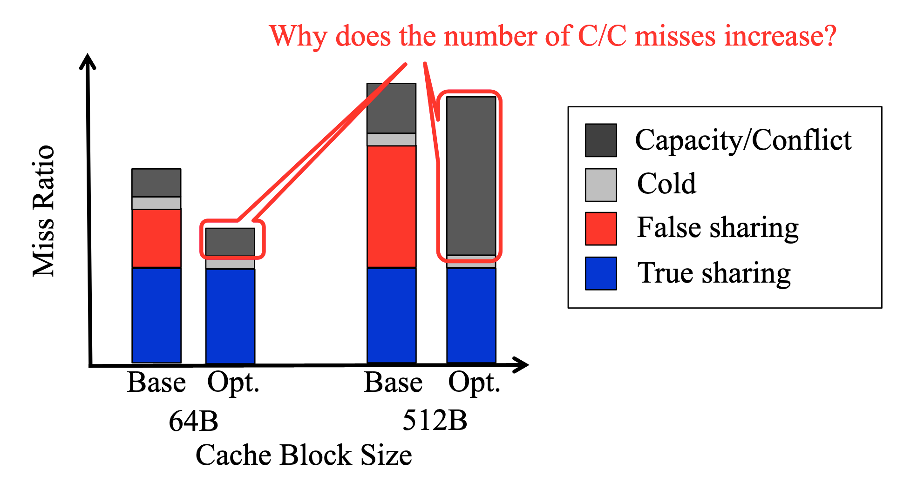

---


### Locality problem

> The **locality problem** :
>
> Originally came from the first VM systems in 60’s
>
> - Problem: Bad page replacement policies led to swapping and unusable machines
> - Solution: Design memory to prioritize the “working set” of the currently executing applications

Example : matrix multiplication. Let's assume $C=A \times B$ such that $A, B, C \in M_{n \times n}(\R)$. Assuming big matrices of $10^5$ elements of 4B size each, the entire matrix will never fit in any cache (waaay too big!). Assume we have 16B cache lines (so 4 elements per line) and that our data is stored row-wised (traversing memory will traverse the matrix from left to right and up to down). 

For each element in $C$, we have :

- for matrix (array) $A$, we have 1 miss for every $\text{16} / 4 = 4$ elements (cache line size over element size, so 1 miss, then 3 hits and then cycle)
- for matrix (array) $B$, we have 1 miss on every element

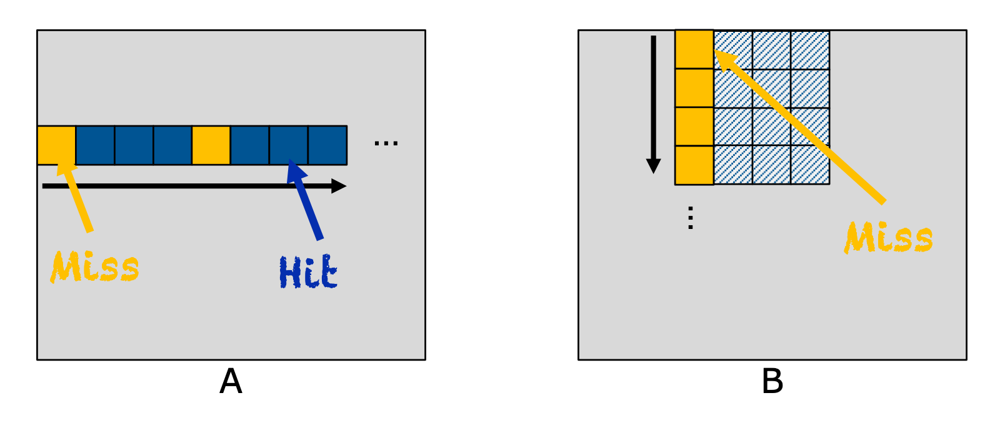

Problem : arrays are too large to fit in caches! $\#$Total cache misses $\approx 1 + N \cdot (4/cacheLineSize) + N$ for $N^2$ elements in each matrix. For the multiplication as a whole, we have roughly $(N^3(1+c) + N^2)=O(N^3)$ misses with $c=\frac{elementSizeBytes}{cacheLineSize}$

To solve this problem, we divide the matrix into sub-matrices, small enough to fit in the cache. We reuse them on every "block iteration". For the whole array, we have $(N/n)^2$ tiles created each having $2 \cdot (\frac{4n}{cacheLineSize})$ misses. Thus the number of total cache misses is $O(N^2)$. Using `cachegrind`, the first approach produces 170M cache misses, while the "smart" one only 650k

---


### Optimization using OpenMP

Remember that OpenMP uses a Fork/Join model

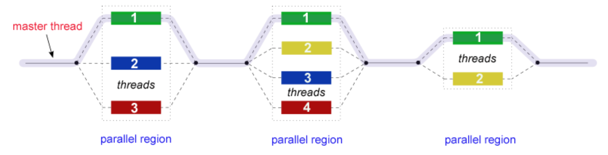

Consider the following program :

```c
#pragma omp parallel for
for (size_t i = 0; i < n; i += 1) {...}
```

What if $n$ turns out to be smal (e.g. 100)? The parallel version would thus probably be slower than a sequential version. We can add an `if` clause to `#pragma`. It allows to parallelize the loop only if it's worth it

```c
#pragma omp parallel for if (n > 5000)
for (size_t i = 0; i < n; i += 1) {...}
```


Fork/Join come with an overhead! For example, here's a bad and better version of the same code. The problem is that the inner loop does fork/join every iteration ($N$ times)

```c
for (size_t i = 1; i < N; i += 1) {
  #pragma omp parallel for
  for (size_t j = 0; j < M; j += 1)
    array[i][j] = 2 * a[i-1][j];
}

// Better version (only 1 fork/join)
#pragma omp parallel for
for (size_t i = 1; i < N; i += 1) {
  for (size_t j = 0; j < M; j += 1)
    array[i][j] = 2 * a[i-1][j];
}
```


Another example this time using an excessive number of fork/join. The solution is to maximize `parallel` regions

```c
#pragma omp parallel for
for (...)
#pragma omp parallel for
for (...)
#pragma omp parallel for
for (...)
  
// Better version
#pragma omp parallel
{
	#pragma omp for
  for (...)
  #pragma omp for
  for (...)
  #pragma omp for
  for (...)
}
```


Here's a more subtle one : this code translates into the following assembly code

```c
#pragma omp parallel for
for (size_t i = 0; i < n; i += 1) { a[i] += 10; }
```

```assembly
loop:		ld		r2, addr[r1]
				addi	r2, r2, 10
				st		addr[r1], r2
				add 	r1, r1, 1							# loop counter
				bne		r1, r3, loop					# loop branch
```

In this example, 2/5 of the loop is overhead, why not perform **loop unrolling**? Note that compilers do this for simple patterns

```c
#pragma omp parallel for
for (size_t i = 0; i < n; i += 4) {
  a[i] 		 += 10;
  a[i + 1] += 10;
  a[i + 2] += 10;
  a[i + 3] += 10;
}
```


Here are other **loop optimizations** :

- **loop fusion** : combine two back-to-back loops with exactly the same iteration pattern (e.g `for (size_t i = 0; i < n; i += 1)`) $\implies$ reduces loop overhead
- **loop fission** : split a big loop into smaller loops $\implies$ can improve L1 data and instruction cache miss rate

Compilers can do these for simple loop bodies


**Schedule clauses** determine how loop iterations are divided among the thread team `schedule(<type>[, <chunk> ])` :

- `static([chunk])` : divides iterations statically between threads (each thread receives `chunck` iterations) rounding if necessary (default `chunck` is $\lceil \# iterations / \# threads\rceil$) :
  - low overhead
  - may exhibit high workload imbalance
- `dynamic([chunk])` : allocates `chunck` iterations per thread, allocating an additional `chunck` iterations when a thread finished (default `chunck` is 1) :
  - high overhead
  - can reduce workload imbalance
- `guided([chunk])` : allocates dynamically, but `chunck` is exponentially reduced with each allocation :
  - less overhead than dynamic
  - comparable to dynamic in reduce imbalance


We can also use **work scheduling** implemented using a task queue (processing items from a list of tasks to do). As long as there is a task in the queue, each thread picks up a task from the queue and processes it (which might lead to adding new tasks to the queue). The program stop when there's no more task to process. We model the queue as a linked-list of elements. Each element is a task-wrapper (`wrapper_struct`) and includes a pointer to the task (`task_struct`) and a pointer to the next element. Here's an example implementation of it :

```c
int main(int arc, char* argv[]) {
  wrapper_struct* wrapper_ptr;
  task_struct* task_ptr;
  ...
  
  #pragma omp parallel private (task_ptr)
  {  
    task_ptr = get_next_task(&wrapper_ptr);
    while (task_ptr != NULL) {
      complete_task(task_ptr);
      task_ptr = get_next_task(&wrapper_ptr);
    }
  }
}


task_struct* get_next_task(wrapper_struct** wrapper_ptr) {
  task_struct* next_task;
  
  #pragma omp critical
  {
    if (*wrapper_ptr == NULL) next_task = NULL;
    else {
      next_task = (*wrapper_ptr) -> task;
      *wrapper_ptr = (*wrapper_ptr) -> next;
    } 
  }
  
  return next_task;
}
```


Finally, let's take a look at **functional parallelism** (or task parallelism) which is performing distinct computations at the same time

```c
a = A();
b = B();
c = C(a, b); 			// uses a and b
d = D();
e = E(c, d);			// uses c and d
```

Independant tasks can be executed in parallel. We use `parallel sections` pragma to indicate it

```c
#pragma omp parallel sections
{
  #pragma omp section
  a = A();
  #pragma omp section
  b = B();
  #pragma omp section
  d = D();
}
c = C(a, b);
e = E(c, d);
```


## 5.	Memory consistency

**Memory consistency** defines the behaviour R/W operations across different addresses

Let's imagine two threads

```c
// Thread 1 (A = r0 = 0)
A = 1;
r0 = B;
return r0;

// Thread 2 (B = r1 = 0)
B = 1;
r1 = A;
return r1;
```

Reading $(r_0, r_1) = (0, 0)$ *is possible* ($(r_0, r_1) \in \{(0, 1), (1, 0), (1, 1), (0, 0)\}$) in the majority of today's CPUs (and this satisfies cache coherence). This is possible when both processors issue the stores (`A = 1` and `B = 1`) at the same time. While we wait for the requests to be injected into the network, CPUs issure the reads. Non-blocking caches proceed while messages are in the network, and thus return a hit (`A = 0` and `B = 0`). Thus, at the end, we return $(r_0, r_1) = (0, 0)$ eventhough, logically, this shouldn't be possible

What we originally expect is called **sequential consistency** (**SC**) : basically do one instruction at a time and wait for it to finish. Formally, it executes each processor’s memory accesses atomically and in program order. If we use SC, the only values for $r_0$ and $r_1$ we can get for the last program are : $(r_0, r_1) \in \{(0, 1), (1, 0), (1, 1)\}$

SC is the strongest memory model :

- Memory accesses happen in program order

- Memory operations appear instantaneously to other processors in the system

---


### In hardware

Here's a reminder of OoO (out of order) CPUs. Imagine $I_1, I_3$ are misses, adds take 1 cycle and loads take 100 cycles.

| Instructions | Code             | In-order cycle count | OoO cycle count |
| ------------ | ---------------- | -------------------- | --------------- |
| 1            | `Load r2, 0(r3)` | 100                  | 100             |
| 2            | `Addi r2, r2, 4` | 101                  | 101             |
| 3            | `Load r4, 0(r5)` | 201                  | 102             |
| 4            | `Addi r4, r4, 4` | 202                  | 103             |
| 5            | `Add r6, r2, r4` | 203                  | 104             |

In the OoO CPU, the second load is executed while waiting for the first load (why not after all?). At the end, all instructions get reordered in program order by the reorder buffer

To do this, we have a structure called a **load-store queue** ([**LSQ**](https://www.youtube.com/watch?v=utRgthVxAYk)) which :

- tracks the FIFO program order of loads & stores
- Resolves the addresses when they are ready
- on a load, check for the yougest store to this address

A LSQ accomplishes two key tasks : resolve which Ld/St addresses overlap and hold all store operation until they retire (= committed = visible by everyone). We only remove an LSQ entry when the store exits the ROB

We can also add a second data structure called **store buffer** (**SB**) which sits between the core and L1 cache. It holds committed stores which *cannot* be rolled back (they are already commited/retired). Note that now, loads must also check SB as well as L1 since there are no guarantee on when values will be written on the cache (from SB)

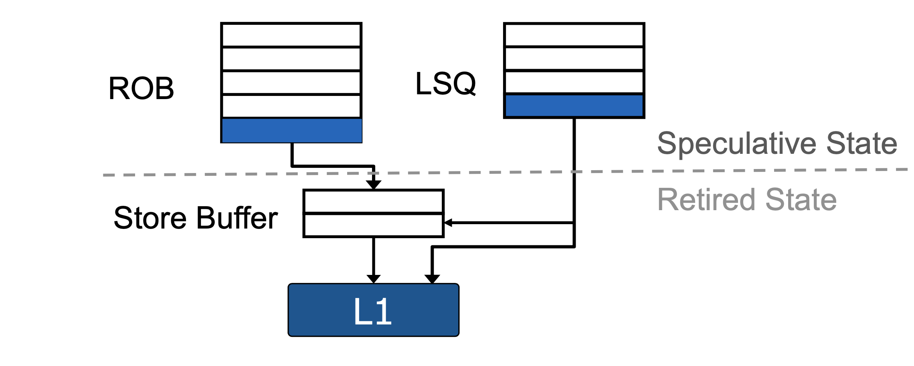

---


For sequential consistency, the program maintains program order in the CPU (using LSQ/SB) and **must** maintain atomicity in the memory results. There are problems with the SC model... A true SC multiprocessor would be extremely slow, modern processors are superscalar, OoO, ... And caches are non-blocking, multi-ported, ...


To improve our LSQ & SB model, we could add a **peeking** mechanism (taking a look at L1 to check if an address is already in there) for loads. If the peek fails, the value is brought from lower levels to L1, if we find it, we do nothing (if `Load B` peeks, the value is brought into still need to be read when executed)

*Note* : if `Load B` peeks, it means that it couldn't be found in L1


This can lead to LSQ and SB being blocked! To solve this, we use the idea of relaxing (on a read, if address is the same, result comes from LSQ or SB, if different, let it pass and unblock the processor). These are called **relaxed consistency models**. An example implementation is **processor consistency** (**PC**) which states : reads can bypass writes

| Instruction | Behaviour | Naïve SC | SC + SB + L1 peeking |  PC  |
| ----------- | :-------: | :------: | :------------------: | :--: |
| `store X`   |  L2 miss  |   100    |                      |      |
| `store B`   |  L1 hit   |    1     |         TODO         |      |
| `load  A`   |  L1 hit   |    1     |                      |      |
| `add    `   |     –     |    1     |                      |      |
| `store A`   |  L1 hit   |    1     |                      |      |
| `load  Y`   |  L2 miss  |   100    |                      |      |
| `store Z`   |  L2 miss  |   100    |                      |      |
| Total :     |     –     |   304    |                      |      |


Finally, we could follow a **weak consistency model** (**WC**) which introduces `Fences` instructions in the ISA. Theses `Fences` act as barriers : everything must have been completed for the execution to continue past the `Fence`.

With weak consistency, we have no gurarantees expect if we use `Fences`

Note that most mobile phones use weak ordering today

---


### In higher levels (C, C++, ...)

We can use special instructions to create a **barrier** :

- `asm volatile("":::"memory")` : tells the compiler to not reorder operations in this section
- `__sync_synchronize()` : insert an explicit memory fence instruction

We could also use `atomic int` in C


Programmers must write “correctly synchronized” or “well-labelled” code, containing no **data races** (called data race free code (**DRF**)). Two operations conflict if they access the same location, and at least one is a write. A data race is when :

- Two conflicting operations from different threads occur simultaneously
- Simultaneous operations are defined as back-to-back accesses in any sequentially consistent interleaving

---


### [YT] Complement

> Online youtube lectures explaining memory consistency found [here](https://www.youtube.com/watch?v=fT4DJcNCisM&list=PLAwxTw4SYaPndXEsI4kAa6BDSTRbkCKJN&index=1)

**Memory consistency** defines the order of accesses to *different* addresses. It is different from cache coherence, because the latter defines order of accesses to the *same* address

The **program order** is the order we expect using standard parallelism while the **execution order** order the processor executes the instructions (e.g. inverting two `lw` because it is better in this case). Imagine two *out of order execution* cores running in parallel

```assembly
# Initial : D = F = R0 = R1 = 0

# Core 1 :
sw		1 into D
sw		1 into F

# Core 2 :
lw		F into R0
lw 		D into R1
```

In program order, only three outputs could occur : $(R_0, R_1) \in \{(0, 0), (0, 1), (1, 1)\}$, this is what we expected. In reality, the second core could have chosen to invert both `lw` instructions order. This would result in : $(R_0, R_1) \in \{(0, 0), (0, 1), (1, 0), (1, 1)\}$


**Sequential consistency** (**SC**) : the result of any execution should be as if accesses executed by each processor were executed in-order and accesses among different processors were arbitrarily interleaved. The result is what we expect, but performances suffer!

**Relaxed consistency** : in SC, all four types of ordering (`WAW`, `RAW`, `WAR` and `RAR`) are satisfied. In relaxed consistency, some are not obeyed (generally `RAR`). The programmer thus have to expect that his program will sometimes reorder `lw`s. When ordering matters, the programmer must use special **non-reorderable accesses** (e.g. `MSYNC` instruction in `x86`) which acts as a barrier (everything before the barrier will have been executed and ready for what is after the barrier). For example

```c
while (!flag) {} ;
MSYNC
printf("%d", data);
```

There are multiple types of relaxed consistency models such as weak consistency, processor consistency, release consistency, ... Note that *all* of them support some sort of synchronisation. These models improve performance over SC, but make program behaviour more difficult to reason about


A **data race** can occur when `WAW`, `RAW` or `WAR` between accesses on different cores that are not ordered by synchronisation (barrier, locks, flags, ...). For example, there's a data race in the following program :

```assembly
# Core 1 :
lw		t0, 0(A)

# Core 2 :
sw		t1, 0(A)
```

A **data-race-free** (**DRF**) program is a program that cannot create any data races in its execution. A DRF program behaves as SC in *any* consistency model


## 6.	Shared memory synchronization

The idea behind synchronization is to aim for low overhead, correctness and coordination of HW (hardware) and SW (software). Here are a few synchronization methods :

- mutual exclusion : locks
- piont to point synchronization : flags, barriers
- software methods (not in this course) : queues, counters, software pipelines
- Coarse-grain concurrency control : transactional memory (see next chapter)


There are 3 phases in synchronization : acquire method (how thread attempts to gain access to the ressouce), release emthod (how to enable other threads to access the resource) and waiting algorithm (how thread waits for access to a resource)


### Locks

We focus on how locks work and their interactions with hardware / OS. We have a few desirable characteristics : low latency (should be able to acquire free locks quickly), low traffic, scalability, low storage cost and fairness

:information_source: OpenMP provides locks as `omp_lock_t` (as well as `omp_init_lock(omp_lock_t*))` and `omp_destroy_lock(omp_lock_t*)`). Finally, we can set and unset the lock using `omp_set_lock(omp_lock_t*)` and `omp_unset_lock(omp_lock_t*)` as well as test the lock (doesn't block if the lock is unavailable) using `omp_test_lock(omp_lock_t*)`

The goal of locking is to force threads to access a location one at a time. This is called **mutual exclusion** because threads both exclude each other from executing. To implement: use a construct called a lock which is just a memory location where threads communicate wrt. who can execute and who must wait


Our first idea could be using a flag (if memory location holds 0, lock is free. Store 1 into it to acquire the lock other threads have to wait until the holder stores 0 again)

```c
// Lock
while (lock != 0);
lock = 1;

// Unlock
lock = 0;
```

This doesn't work for multiple reasons! For example, if $n$ threads are waiting for the lock, and the thread currently utiliszing the lock unlocks the lock, then potentially all $n$ threads could then access `lock = 1;` at the same time. Moreover, operations could be reordered!

Here's what it looks like in assembly

```assembly
lock:
	ld r1, mem[addr]					# load word (flag) into r1
	cmp r1, #0								# if 0, then dont execute line 4
	bnz lock									# try again (if r1 != 0 from line 3)
	st mem[addr], #1					# store 1 to address
	
unlock:
	st mem[addr], #0					# store 0 to address
```

---

### Test-and-set (TS)

So we need atomic in hardware! We create a new instruction "**test-and-set**" (**TS**) `ts reg, mem[addr]`. It **ATOMICALLY** load memory location into `reg` **AND THEN** (still atomically) set content of location to 1

```assembly
## Test and set lock sketch in assembly ##

lock:
	ts r1, mem[addr]
	bnz lock
	# critical section here
	
unlock:
	st mem[addr], #0
```

Note that this method provides no fairness. Moreover, the more processors you have, the more the bus will be overloaded

Here's what it looks like in `x86`:

```assembly
Test_and_Set:
	mv %eax, #1
	xchg %eax, %(MEM)			# swap two memory values (could also use the LOCK prefix)
	cmp %eax, #0
	bnz Test_and_Set
```

```c
/* Usage */
void lock(int* lock) {
  while (Test_and_Set(lock) != 0);
}

void unlock(volatile int* lock) {
  *lock = 0;
}
```

However, there's a HUGE problem : excessive coherence traffic (for 3 cores minimum). Here, processors 1 and 2 will continuously invalidate the same cache line (thus then have to refetch it from memory) while waiting for processor 0 to release the lock

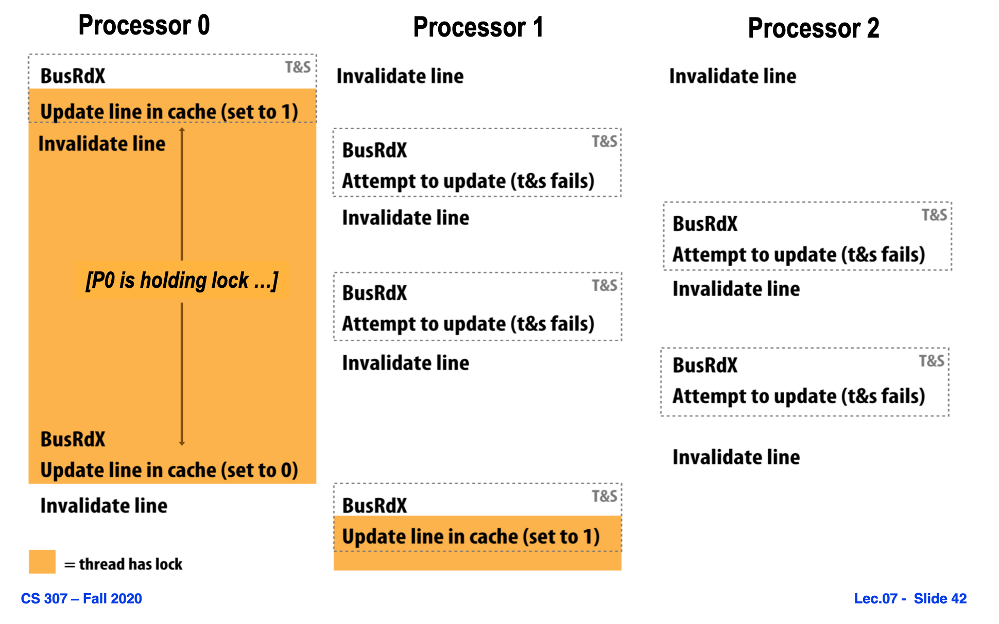

---

### Test-and-test-and-set (TTS)

Here's an upgraded version, the **test-and-test-and-set** (**TTS**) lock

```c
void lock(int* lock) {
  while (1) {
  	while (*lock != 0);			// additional test
    
    // when the lock is released, try to acquire it
    if (Test_and_Set(lock) == 0) return;
  }
}

void unlock(volatile int* lock) {
  *lock = 0;
}
```

```assembly
test:
	ld r1, mem[addr]					# load lock value (will be read from cache the second time
	cmp r1, #0							 	# this is executed and onwards) because we dont perform writes
	bnz test
	
lock:
	ts r1, mem[addr]
	bnz test									# if 0, lock is obtained
	
unlock:
	st mem[addr], #0
```

This generates much less interconnect traffic (one invalidation per waiting processor per lock release) and is more scalable (due to less traffic). Note that there's still no fairness (the fastest wins the lock)

The key idea is that we wait using reading operations and not writing operations

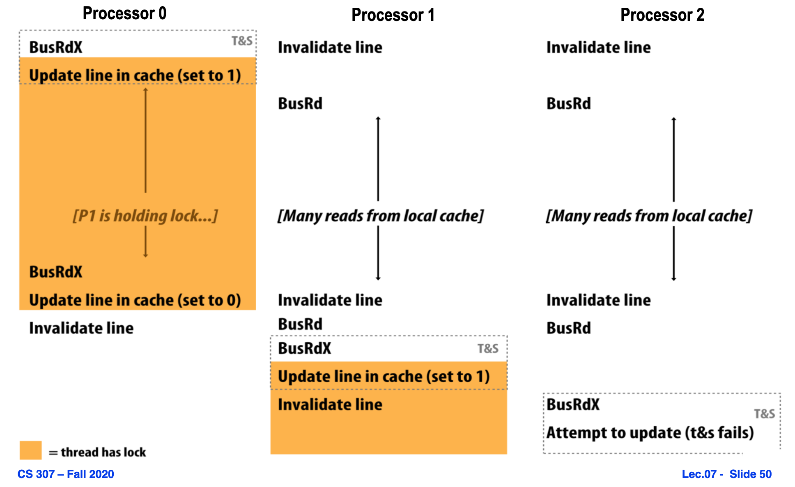

---

### TS with exponential backoff

The idea is to reduce contention traffic by adding waiting time after failing to acquire the lock

```c
void lock(volatile int* lock) {
  int amount = 1;
  while (1) {
    if (Test_and_Set(lock) == 0) return;
    
    delay(amount);
    amount *= 2;
  }
}
```

This method generates less traffic than TS but causes server unfairness (newer requesters back off for shorter intervals)

---

### Load-locked & Store conditional

Both TS and TTS require an instruction (`ts`) that is both a read and a write; this is a challenge for pipelined processors. Additionally, we must lock the bus (block all ops) until the read-modify-write completes

Modern processors use an alternative called **load-locked & stored conditional**. It provides atomic read-modify-write with two instructions :

- **load-locked** (LL) : `l.l r, mem[addr]`
- **store-conditional** (SC) : `s.c r, mem[addr]`

The idea is to keep a "cookie" that says: "I have loaded $X$", and its value was unchanged. If a write on $X$ occurs before the SC operation, then the cookie is invalidated. When executing SC operation, the store will only occur if the cookie is still valid (if invalid, then we need to retry LL)

```assembly
lock:
	ll r2, [X]
	cmp r2, #0
	bnz lock
	addi r2, #1
	sc [X], r2
```

---

### Blocking synchronization

If progress cannot be made because a resource cannot be acquired, then itr'rs desirable to ffree up executing resources for another thread. The **blocking synchronization** preempts the running thread (suspend) for the OS to schedule another thread

---

### Implementing barriers

`counter` represents how many threads to wait for, `flag` tells threads to proceed or wait and `lock` is a lock that protect it all

```c
struct Barrier_t {
  lock_t lock;
  size_t counter;
  int flag;
}
```


## 7.	Transactional memory

Our base code looks like this

```c
void editHash(HashTbl tbl, int key) {
	// read objects
  HashObj obj = tbl.get(key);
  // update
  obj.update();
}
```

This is a hash table and we edit informations within it

### Coarse grained locks

:information_source: *idea* : lock large swathes of program code in one big chunk. That way, you can *guarantee* that only one path of execution at a time will interact with a complex part of the system

Here's a C pseudocode implementing it

```c
void editHash(HashTbl tbl, int key) {
  synchronized(tbl) {
    // read objects
    HashObj obj = tbl.get(key);
    // update
    obj.update();
  }
}
```

It has a simple implementation but creates lots of contention. There can be no concurrency whatsoever in the system

### Fine grained locks

```c
void editHash(HashTbl tbl, int key) {
  // read objects
  HashObj obj = tbl.get(key);
  synchronized(tbl) {
    // update
    obj.update();
  }
}
```

This time, there's contention only on objects themselves

If we want to remove a node from a bucket (one possibility (hash) of the hash table), the smart way is to only lock the nodes we will modify (aka. the node we will remove and the node just before (because it stores a pointer to the node we want to remove)). This allows two different threads to remove two different nodes from the same bucket at the same time 

**Hand over hand** locking is an algorithm implementing this. The thread that wants to remove a node start at the beginning of the bucket (first element), locks it. Then lock the next element and check that it is not the element we want to remove; if it is then remove it by updating the first element's pointer; if it's not, then lock the next element in the list and unlock the first one. We continue like this until we remove the element

### Lock-free data structures

They have the best performance, but are very hard to code


### Hardware lock elision (HLE)

```assembly
lock:
	ts r1, mem[LCK]					# executes as LD not RMW
		// SPECULATE
	bnz lock
	
crit:
	ld r1, mem[obj]
	addi r1, #10
	st mem[obj], r1
	
unlock:
	st mem[LCK], #0
		// END SPECULATE
```

Here, `ts` executes as a `LOAD`, critical section executes. At the end of the critical section, if there's coherence traffic for `obj` (meaning other core(s) try reading/writing `obj`, then **roll back**). If there was no traffic, then the operation is a success! We don't even need to execute the `st` instruction 

Conservative Locking (HLE) is easier to show correctness than fine grained locking. This is a tradeoff between performance and complexity. Note that it allows some thread-unsafe libraries to run with multiple threads safely

When does the lock elision fail?

- atomicity violation (detected by coherence protocol, see above)
- resource constraints (critical section bigger than ROB)
- interrupts

In Intel processors, we use HLE using two new instructions `xacquire` (beginning of critical section) and `xrelease` (end of critical section)


### Transactional memory (TM)

New instructions `xbegin` (start transaction, takes pointers to fallback address in case of abort), `xend` (end of transaction) and `xabort` (software-initiated transaction abort)


## 8.	Multithreading

Multithreading always increases single threaded latency but increases pipeline utilization as well.

Real programs are not simple! So many CPU cycles are wasted! There are two types of **wastes**: **vertical wastes** and **horizontal wastes**

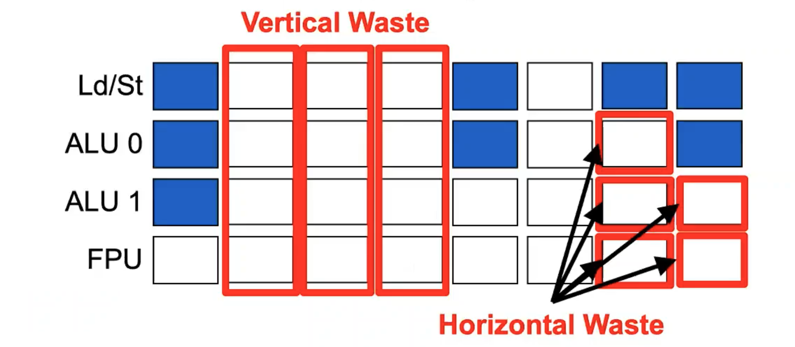


### Types of multithreading

 We have different types of multithreading: 

- blocked (**coarse grained**) **multithreading** (**CGMT**): when a thread is waiting on a long operation (e.g. store, load, miss), we give the CPU to another thread:
  - critical decision: when to switch threads
  
  - requirements for improving throughput: `thread switch + pipe fill time << block latency`
  
  - advantage: small changes to existing hardware
  
  - drawback: single thread performance suffer
  
  - Note : cannot address horizontal waste
  
    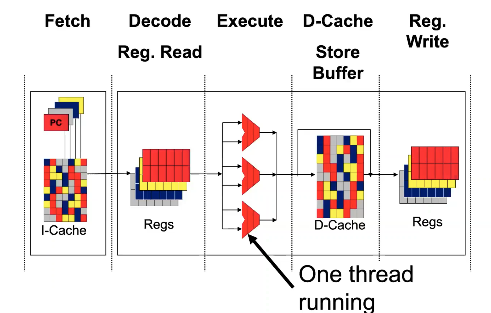
- **fine grained multithreading** (**FGMT**): the idea is to eliminate the switch time (from CGMT) by keeping all threads hot (aka. performing round robing on them):
  - critical decision: none
  
  - Requirements for improving throughput: enough threads to eliminate vertical waste (e.g. pipeline depth of 8 using 8 threads is not enough)
  
  - advantage: with flexible interleaving (see below: CGMT vs FGMT), we have reasonalbe single thread performance with high processor utilization (especially with many threads). Without flexible interleaving, it suits regular applications with repetitive latency

  - drawback: more complicated hardware to track dependencies, many more context means we need many registers and withtout flexible interleaving, we have limited single thread performances
  
  - Note : cannot address horizontal waste
  
    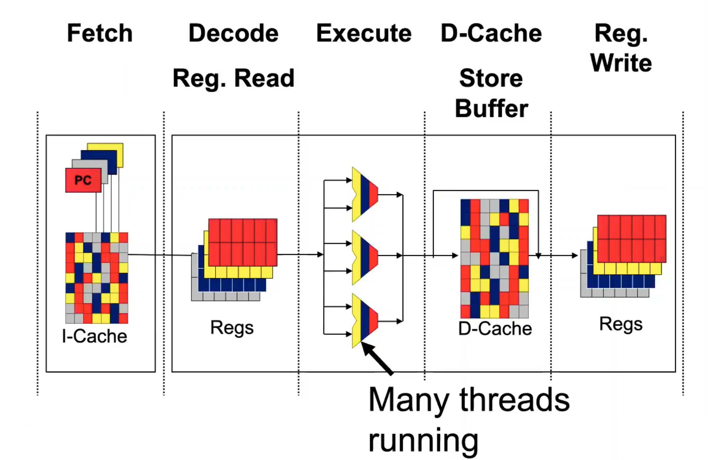
  
- **simulataneous multithreading** (**SMT**): the idea is to fill (interleave) vertical waste slots with instructions from other threads. We decide which threads to fetch instructions from depending on if their instructions will be able to do progress or not (we want fast instructions, not cache miss that will stay forever in the queue)
  
  - critical decision: fetch interleaving policy
  
  - Requirements for improving throughput: enough threads to utilize resources
  
  - Note: very difficult to implement
  
    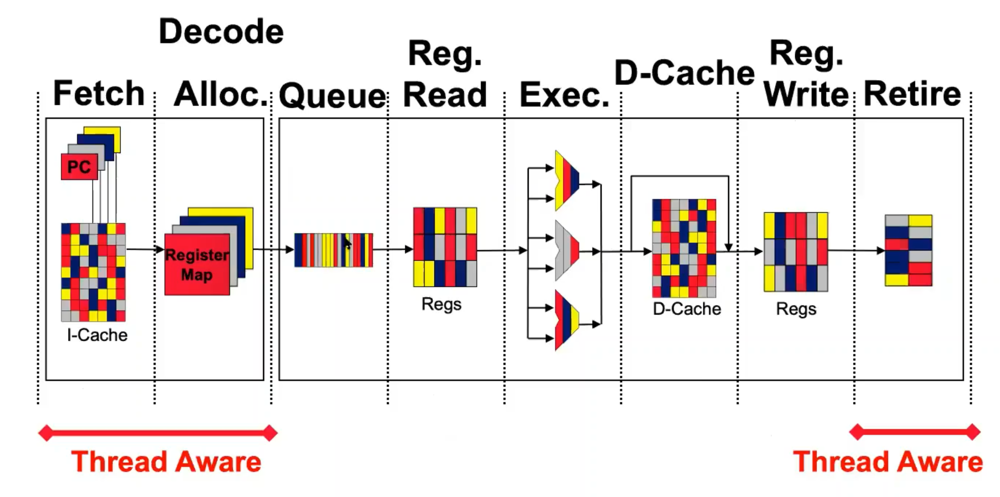


### CGMT vs FGMT

- CGMT swaps on long latency events while FGMT uses round robin
- FGMT addresses much shorter latencies
- For threads with abundant parallelism, FGMT could suffer

> Note: we can combine both into something called **flexible interleaving** to solve the last bullet point


A common policy for SMT is **ICOUNT**: thread with fewest instructions in pipe has priority. It adapts to all sources of stalls (cache, FP units, ...)


To the extreme, we get **GPU**s (see next lecture), they are good when a program is embarassingly parallizable with a lot of ALU operations and few memory operations (e.g. displaying pixels on a screen, performing simulations, ...). Before, we had what we call a thread vector in a particular cycle using FGMT (one slice of the CPU used by a thread), now we call that a **warp**. Note that multiple warps can share the pipeline

GPUs run many warps in a core and take throughput-latency trade-off to the extreme by performing trillions of integer operations per second... but performing reaaaally bad on single thread latency. 


## 9.	GPUs

In a CPU, we can't add an unlimited amount of ALUs (it has an upper limit due to the bookkeeping the needs to be done (ROB))

A better idea is to have one instruction for all ALUs, thus the fetch/decode part is reduced by A LOT as well as the bookkeeping part; this is called a **vector processor**

SIMD instructions have configurable width and actually move data there whereas vector processors operate in **strides**: it gathers elements from memory and operate in parallel on all of them; GPUs are more like vector processors

The typical example used in GPUs is image processing (e.g. take every pixel and multiply by a constant) $\implies$ we need to loop over all pixels. Ideally, we would want something like

```c
/* hypothetically: not real code */
for_all_pixels {
  array[i] *= 0.7;
}
```

For example, the NVIDIA Volta (GPU) has 5.5k integer and 2.5k FP ALUs. The ALUs in a GPU are also called **CUDA cores** (or sometimes just cores, but it is confusing)


A **streaming multiprocessor** (**SM**) is a component of a GPU and is the equivalent of a CPU (instruction cache $\implies$ register file $\implies$ ALUs $\implies$ LD/ST $\implies$ SFU) with a few more things (e.g. texture cache, vertex fetch, tesselator, ...) used for graphical purposes

A **warp** is 32 threads running together (note that in a GPU, threads share the same execution context and all have the same execution stream). If 1 thread out of 32 is waiting (e.g. memory), then SM will not schedule the warp leading to *huge* vertical pipeline waste. We "solve" this by hiding this flaw with many warps (see next lecture for better alternative)


### CUDA

NVIDIA CUDA programming language is an extension of C to allow PGU programming without explicit mode abstractions (OpenGL)

Here's a simple example

```c
/* on a CPU */
void image_fade(int* array, int a_size, int fade) {
  for (int i = 0; i < a_size; i += 1)
    array[i] *= fade;
}


/* on a GPU */
__global__
void image_fade(int* array, int* output, int a_size, int fade) {
  int element_id = ...; // assume this works, more to come
  if (element_id >= a_size) return;
  
  int value = input[element_id] * fade;
  if ( value > 255 ) value = 255;
  output[element_id] = value;
}
```

The `__global__` keyword specifies that the code is running on the entire GPU


The general execution workflow on a GPU looks like :

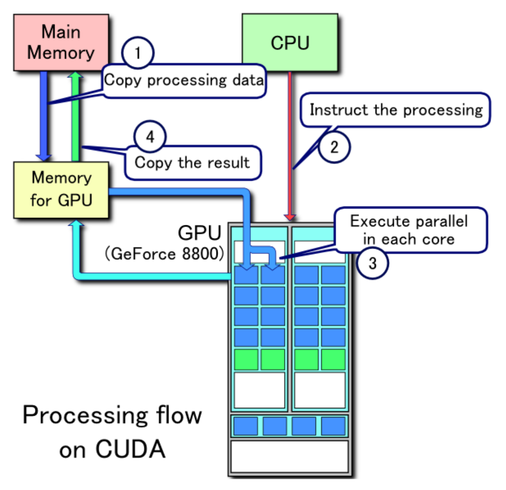

1. **Allocate memory on the GPU** : we allocate/deallocate using `cudaMalloc(...)` and `cudaFree(...)` (e.g. `cudaMalloc( (void**) &gpu_array, SIZE_N)`). The result of `cudaMalloc` is *not* a regular C pointer (dereferencing it results in undefined behaviour)!

2. **Copy data from CPU to GPU memory** : now that both arrays are set up, invoke copy

   ```c
   cudaMemcpy(
   	(void*) gpu_array, 				 // DST (destination)
   	(void*) host_array,				 // SRC (source)
   	SIZE_N,								 // NBYTES
   	cudaMemcpyHostToDevice			// DIR(ection)
   );
   ```

   :information_source: the direction matters! it could be one of those :

   ```c
   enum MemCpyKind {
   	cudeMemcpyHostToDevice,
      cudeMemcpyDeviceToHost,
      cudeMemcpyDeviceToDevice
   }
   ```

   :warning: `cudaMemcpy` is **asynchronous** (because it is a DMA (direct memory access))

3. **Invoke the GPU kernel** : we organize threads in to blocks (**TBs**); each TB contains a bunch of threads organized as a **grid**. The blocks can be 1D, 2D or 3D. When calling a kernel, you specify the number of TBs and threads per TB. For example, for a $3 \times 4$ thread layout in a block and $2 \times 3$ block layout in a grid, we would write

   ```c
   __global__ void image_fade(...) {...}
   
   int main(void) {
     dim3 thsPerBlock(3, 4);		// int or dim3
     dim3 nBlks(2, 3);
     image_fade <<< nBlks, thrsPerBlock >>> (args); // specify arguments of image_fade in args
   }
   ```

   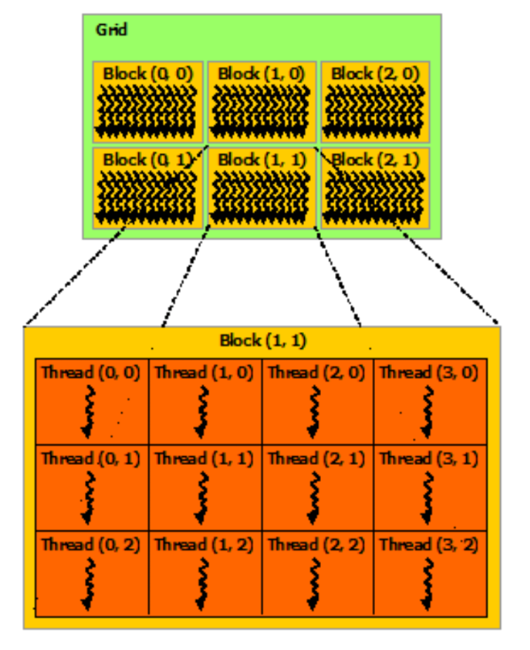

   :information_source: the **kernel** is the function that will be called by the GPU (here `image_fade`)

4. **Wait until GPU is done (synchronization)** : using `cudaDeviceSynchronize` (see point 5)

5. **Copy data back to CPU memory** : we use `cudaMemcpDeviceToHost`which is **SYNCHRONOUS**, thus here's what we have to do

   ```c
   __global__ void image_fade(...) {...}
   
   int main(void) {
     dim3 thrsPerBlock(3, 4);		// int or dim3
     dim3 nBlks(2, 3);
     image_fade <<< nBlks, thrsPerBlock >>> (args); // specify arguments of image_fade in args
     
     cudaDeviceSynchronize();
     other_kernel <<< nBlks, thrsPerBlock >>> (...); // if we want other operations
   }
   ```


Here's how we compute `element_id` (see code snippet above the 5 bullet points list). CUDA runtime exposes the dimensions through: `gridDim.x` and `gridDim.y`. To determine which thread block we are in, we use `blockIdx.x` and `blockIdx.y` ($(0, 0)$ is on the top left of the image). To determine how big those blocks are, we use `blockDim.x` and `blockDim.y`. Finally, within a block, we get which thread we are in using `threadIdx.x` and `threadIdx.y`

Thus to get the global coordinates, we use 

- `x_glob = (blockIdx.x * blockDim.x) + threadIdx.x;`
- `y_glob = (blockIdx.y * blockDim.y) + threadIdx.y;`

Note that we transform it into a 1D indexed array since C stores array in row-major order


### GPU optimizations

- Optimize algorithms for GPU (SIMT)
  - Maximize parallelism
  - Maximize use of available memory bandwidth
- Take advantage of on-chip shared memory
  - Hundreds of times faster than global memory
  - Shared memory is fast as long as there are no bank conflicts (see below)
- Optimize memory access pattern for coalescing
  - Coalescing greatly improves throughput
  - The idea is to access for contiguous addresses aligned in 128-byte region (otherwise, the LOAD split into multiple 128 byte accesses). If we have the warp request 32 aligned consecutive 4-byte words (= 128 consecutive bytes aligned), then all addresses fall within one cache line $\implies$ 100% bus utilization (what we want). If we have misaligned addresses (still consecutive), then we need to LOAD 256 bytes across the bus on a miss $\implies$ 50% bus utilisation. Finally, if all threads in a warp request the same 4-byte word, then all adresses fall within a single cache line $\implies$ warp needs 4 byte but 128 are transferred $\implies$ 3.125% bus utilization. If we have 32 scattered 4-byte words, then again, we get 3.125% bus utilization
- Use parallelism and resources efficiently
  - Partition computation efficiently
  - Keep resource usage low
  - For max performance, the GPU should be fully occupied
  - **Control-flow divergence** (or **thread divergence**) refers to the fact that threads in a warp might execute different paths (branch instructions in the code). A GPU will execute one path at a time, disabling diverging threads (those that are not on the same path as the current one) in the process. This limits parallelism and lowers performances


### GPU memory system

- Global and local memories
- Shared memory and L1 cache
- Registers
- Constants & Texture memories
- L2 cache


The **global memory** is shared by all threads and is the GPU's main memory (separated HW from GPU core). The **local memory** is per thread (private per thread) and is the collection of everything on the stack that can't fit in registers. The local memory is stored in global memory. 

The **shared memory** is managed by the programmer and is shared within a thread block (all threads in the block can access it); it is very fast and located in the SM. Shared memory is organized in 32 **banks** such that each bank can service one address at a time (thus at most 32 simultaneous accesses). If we have simultaneous access to the same bank with different 4-byte words, then we have a **bank conflict**; if the words are the same then we have **multicast** (only 1 fetch). Each bank has a bank width (BW) of 32 bits per clock cycle and modern GPUs have 32 banks (bank = address % 32)

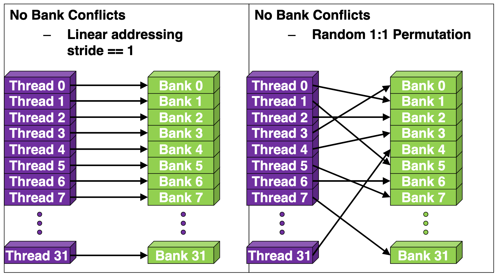

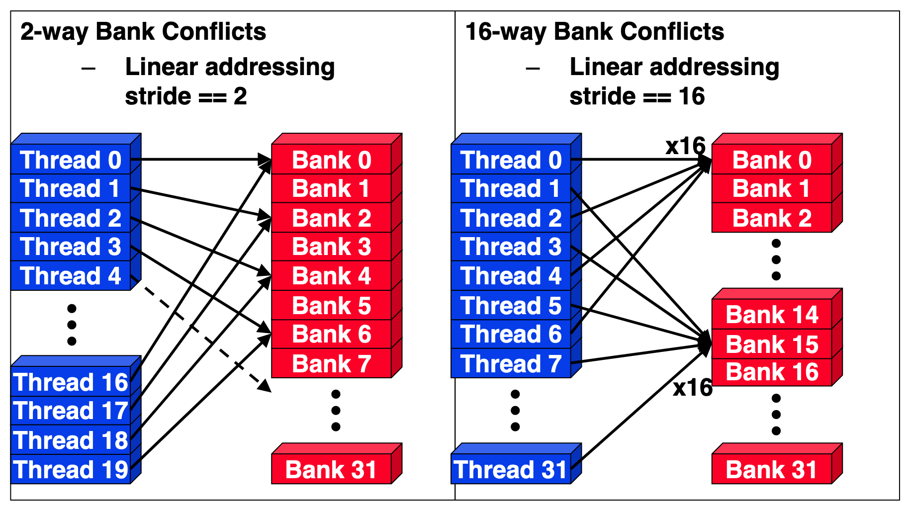

For the **caches**, each SM has its own L1 cache. The L2 cache however is shared by all SMs and caches all global & local memory accesses. L1 caches cache local memory accesses (as well as global memory accesses on old GPUs)

The **registers** are the fastest access to data (10x faster than shared memory). In a GPU, the register file is really big (and power hungry) compared to a CPU's. Each thread has its own set of registers. Example (fermi architecture): 32K 32-bits registers per SM. Assuming 48 warps per SM $\implies$ 1536 threads per SM $\implies$ 21 registers / thread. The register file weights 2MB $\implies$ (assuming 16 SMs) 128KB per SM


### Reductions on a GPU

A **reduction** reduces multiple values to a single one (e.g. we have a list and we want to compute the sum). To implement a reduction on a GPU, we use the divide and conquer method. The same kernel is used for all reduction levels

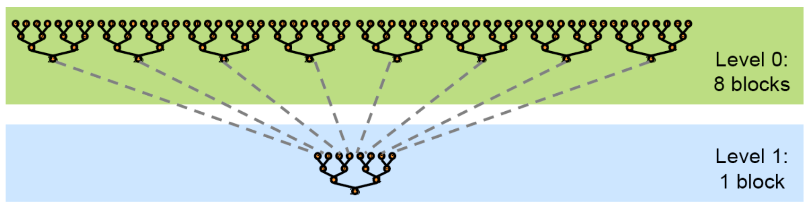

Let's see a few reduction methods and their associated performances (at the end)

:information_source: see slides for the code of each reduction

Reduction 1: interleaved addressing. We load 1 element/thread from global to shared memory. The reduction proceed in $\log_2N$ steps (a thread reduces two elements). We terminate when we have 1 thread left


:information_source: we specify shared memory allocation using `extern __shared__ int data[];`

:information_source: we specify third argument when calling the kernel `smemSize` gives shared memory size in bytes (e.g. `kernel <<< blocks, threads, smemSize >>> ();`)

---

Reduction 2: non-divergent branching

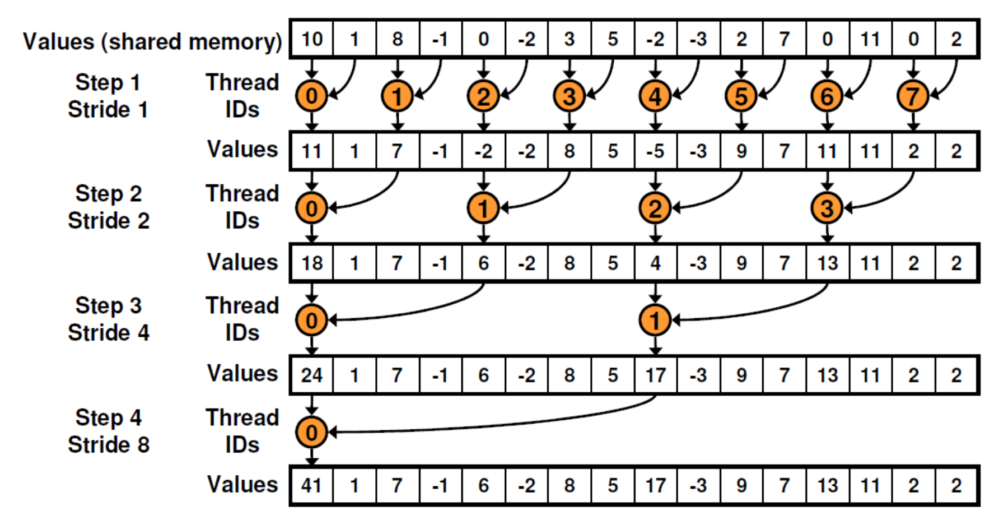

:arrow_double_up: *doubles performances!* (see below)

We still have some problems, for example, we have bank conflicts (2 way bank conflicts every time)

---

Reduction 3: sequential accessing

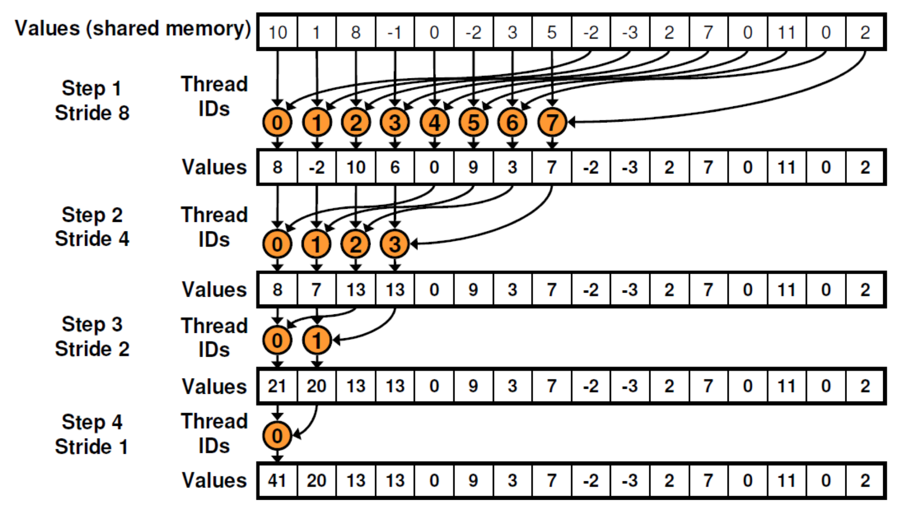

:arrow_double_up: *doubles performances!* (see below)

We still have problems, for example, half of the threads in the first iteration are doing nothing (are idle)

---

Reduction 4: reduce during `LOAD` : indeed of each thread loading one element, we allow each thread to load two elements (now all threads in the first iteration will be busy)

:arrow_double_up: *x1.78 performances!* (see below)

Bandwidth is only at 20% utilization; the bottleneck si addres arithmetic and loop overhead (maybe unroll loops!)

---

Reduction 5: unroll last warp: when `s < 32`, then there is only one active warp $\implies$ all threads will run even if they don't have to; they are also waiting on each other (with the `__syncthreads()`) which is a waste! Thus we can unroll the last 6 iterations of the loop (since we load two elements at once, a warp can treat 64 elements ($\log_264 = 6$))

:arrow_double_up: *x1.80 performances!* (see below)

---

Reduction 6: complete unrolling: if we knew the # of loop iterations at the compile time, we could unroll the loop entirely! But kernel could create any block size at runtime... How to unroll for a fixed size known only at runtime? 

In CUDA we can do this using function templates

```c
template <unsigned int blockSize>
__global__ void reduce6(int* g_in_data, int* g_out_data)
```

See slides 72-74 of lecture 11 – GPUs 2 for syntax

:arrow_double_up: *x1.41 performances!* (see below)

For now, we have $O(\log N)$ steps and $O(N)$ operations in each step. Thus the time complexity is $O(N/P + \log N)$ with $P$ the number of parallel processors. The cost complexity is $O(N \times \log N)$ (since $O(N)$ threads and 1 allocated per element)... This is way too much according to Brent's theorem! It suggests $O(N / \log N)$ threads. Cost complexity would become $O((N/ \log N) \times \log N)$ (each thread does $O(\log N)$ sequential work)

---

Reduction 7: more work per thread (e.g. replace the loading two elements part (reduction 4) with a loop to add multiple elements)

:arrow_double_up: *x1.42 performances!* (see below)


Here's a summary of the reduction performances

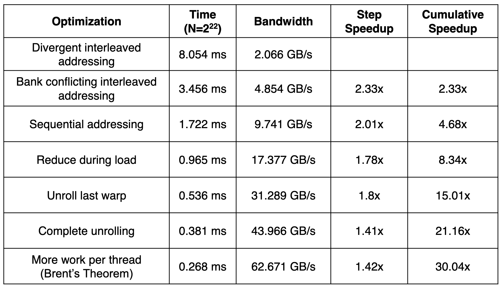

With those 7 optimizations, we get a total of :arrow_double_up: $30\text{x}$​ speedup! This is *huge*
