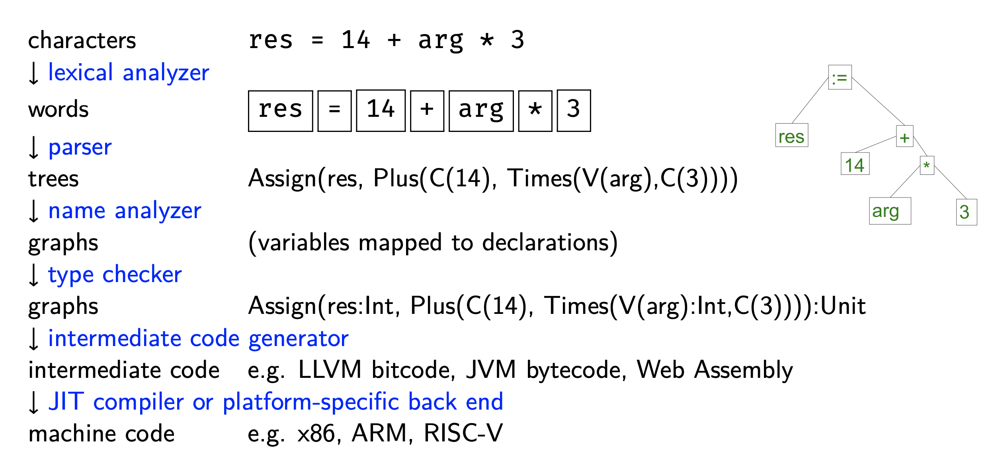
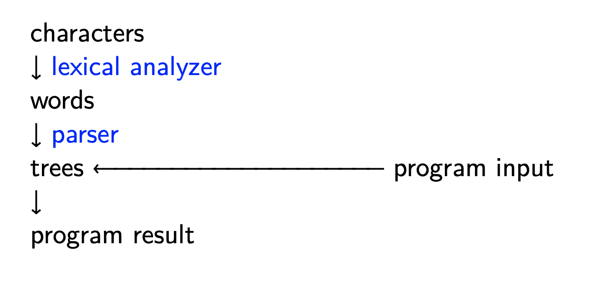
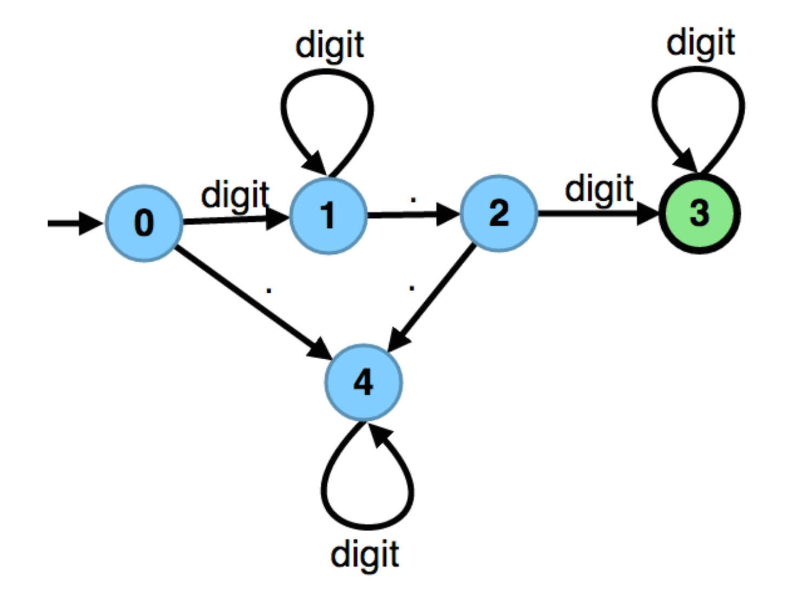
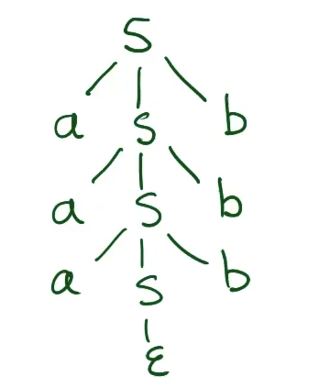
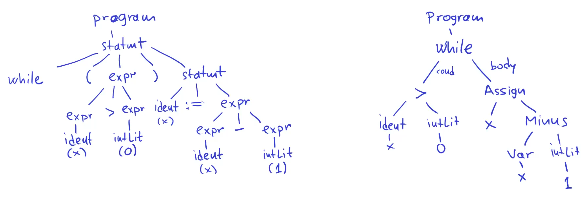
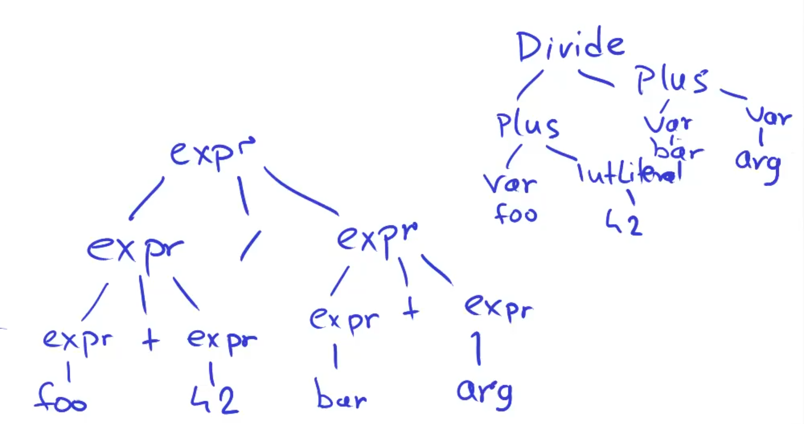

# [CS-320] Summary CLP

[TOC]


## 1.	Introduction

A **language** can be :

- natural language (English, French, ...)
- computer languages (Scala, Java, C, SQL, ...)
- language used to write mathematical statements : $\forall \epsilon \,\, \exist \delta \, st. \forall x \,[\cdots]$

> A language is defined mathematically as a **set of strings** that we can process using algorithms working on **strings** (elements of the language)

In this course, we study algorithms to process computer languages


Two main approaches :

- **interpreter** : execute instructions while traversing the program (Python)
- **compiler** : traverse program, generate executable code to run later (Rust, C, ...)

Compilers bridge the gap between two worlds : **Source code** (high level and programmer friendly (e.g. Scala, Java, C)) and **Target code** (low level, low power use, fast to execute and designed to efficiently run on hardware (e.g. x86, arm, JVM, .NET)). They do that in phases :



On the other hand, interpreters only have 4 parts :



Those trees are called **Abstract Syntax Trees** (**AST**). Here's an example of how we could implement them (in Scala using case classes)

```scala
abstract class Expression
	case class C(n: Int) extends Expression				// Constant
	case class V(s: String) extends Expression 		// Variable
	case class Plus(e1: Expression, e2: Expression) extends Expression
	case class Times(e1: Expression, e2: Expression) extends Expression

abstract class Statement
	case class Assign(id: String, e: Expression) extends Statement
	case class Block(s: List[Statement]) extends Statement
```

---


### Formal languages

Here a a few important concepts :

- **Alphabet** $A$ : any finite non-empty set of letters
- **Word** $w$ (or string) : finite sequence of letters (elements of $A$) st. $w \in A^*$ where $A^*$ is the set of all finite sequences of elements of $A$ (the empty string $\epsilon$ is an elements of $A^*$)
- The **length** of the word $w$ denoted $|w|$ is the number of symbols in $w$ (note : $|w| = 0 \iff w = \epsilon$)
- **Language** $L$ : a set of words (possibly empty or infinite) st. $L \sube A^*$
- We define strings of length $n$ as the set $A^n$ (note : $A^0 = \{\epsilon\}$ and $A^* = \cup_{n \ge 0} A^n$)


We say that two strings are equal if they have the same length and same letters in the same order :

Let $u, v \in A^*$. Then $u =v \iff (|u| = |v| \and \forall \, 0 \le i \le |u|, u_{(i)} = v_{(i)})$


We could also see strings as `List`s in Scala

```scala
sealed abstract class List[A] // A is the alphabet
	def ::(t: A): List[A] = Cons(t, this)
	def length: BigInt = this match {
    case Nil() => BigInt(0)
    case Const(h, t) => 1 + t.length
  }
	def apply(index: BigInt): A = {
    this match {
      case Cons(h, t) =>
      	if (index == BigInt(0)) h
      	else t(index - 1)
    }
  }

	case class Nil[A]() extends List[A]
	case class Cons[A](h: A, t: List[A]) extends List[A]


val w = 1 :: 0 :: 1 :: 1 :: Nil[Int]() // 1011
val n = w.length // 4
val z = w(1) // 0
```


We could also see strings as **Inductive Structures** :

If $a \in A$ and $u \in A^*$, let $a \cdot u$ denote the string that starts with $a$ and then follows with symbols from $u$ (like `Cons`)

- > **Theorem – Decomposing a word** : Given $w \in A^*$, either $w = \epsilon$ or $w = a \cdot u$

- > **Theorem – Equality** : Given $u, v \in A^*$, we have $u = v \iff ((u=\epsilon \and v=\epsilon) \or (\exist a \in A \text{ and } u', v' \in A^* : u = a \cdot u', v = a \cdot v' \text{ and } u' = v'))$

- > **Theorem – Structural induction for words** : Given a property of words $P: A^* \rightarrow \{true, false\}$, if $P(\epsilon)$ and, if $\forall a \in A$ and $\forall u \in A^*$, if $P(u) \implies P(a \cdot u), \implies \forall u \in A^*, P(u)$


A **concatenation** is a fundamental operation on strings. $u \cdot v$ is the unique string $w$ such that $|w| = |u|+|v|$ and $\forall 0 \le i \lt |w|$, we have
$$
w_{(i)} = 
\begin{cases} 
      u_{(i)}, & \text{if } 0 \le i \lt |u|\\
      v_{(i-|u|)}, & \text{if } |u| \le i \lt |u| + |v|
\end{cases}
$$
Note that it follows : $w \cdot \epsilon = w$ and $\epsilon \cdot w = w$

> **Theorem – Associativity of Concatenation** : $\forall u, v, w \in A^*$, we have $u \cdot (v \cdot w) = (u \cdot v) \cdot w$

The neutral element $\epsilon$ and associativity law imply that the structure $(A^*, \cdot, \epsilon)$ is an algebraic structure called **monoid**. A monoid of strings is called a **free monoid** and satisfy the following additional properties (which do not hold for all monoids) :

- > **Theorem – Left cancellation law** : $\forall u, v, w \in A^*, \, wu = wv \implies u=v$

- > **Theorem – Right cancellation law** : $\forall u, v, w \in A^*, \, uw = vw \implies u = v$


The **reversal** of a word is a word of the same length with symbols in the reverse order. Given $w \in A^*$, its reversal $w^{-1}$ is the unique word such that $|w^{-1}| = |w|$ and $w^{-1}_{(i)} = w_{(|w|-i-1)}\space \forall \, 0 \le i \lt |w|$. It follows that $\epsilon^{-1} = \epsilon$ and that $a^{-1} = a \space \forall a \in A$

> **Theorem** : $\forall u, v \in A^*, (u^{-1})^{-1}=u$ and $(uv)^{-1} = v^{-1}u^{-1}$


Let $u, v, w \in A^*$ such that $uv = w$. Then we say that $u$ is a **prefix** of $w$ and that $v$ is a suffix of $w$

Given a word $w \in A^*$ and $p, q \in \N : 0 \le p \le q \le |w|$, the $[p,q)$-**slice** of $w$ denoted $w_{[p,q)}$ is the word $u$ such that $|u| = q-p$ and $u_{(i)}=w_{(p+i)} \space \forall \, 0 \le i \lt q-p$

> **Theorem** : Let $w \in A^*$ and $u = w_{[p,q)}$ where $0 \le p \le q \le |w|$, then $\exist x, y \in A^*: |x|=p, |y|=|w|-q, {\text{ and } w=xuy}$

> **Theorem** : Let $w, u, x, y \in A^*$ and $w = xuy$. Then $x = w_{[0,|x|)}, u= w_{[|x|,|x|+|u|)} \text{ and } v= w_{[|x|+|u|,|w|)}$

Here's an example of slices in Scala

```scala
def slice(i: BigInt, j: BigInt): List[T] = {
  require(0 <= i && i <= j && j <= length)
  this match {
    case Nil() => Nil()
    case Cons(h, t) =>
    	if (i == 0 && j == 0) Nil()
    	else if (i == 0) Cons(h, t.slice(0, j - 1))
    	else t.slice(i - 1, j - 1)
  }
} ensuring(_.size == j - i)
```


> **Language concatenation** : Given $L_1 \sube A^*$ and $L_2 \sube A^*$, define $L_1 \cdot L_2 = \{w_1 w_2 | w_1 \in L_1, w_2 \in L_2\}$
>
> - Example : $\{\epsilon, 0, 00\} \cdot \{1, 11\} = \{1, 11, 01, 011, 001, 0011\}$

> **Language exponentiation** : Given $L \sube A^*$, define :
> $$
> L^0 = \{\epsilon\} \\ L^{n+1} = L \cdot L^n
> $$
> 
>
> **Theorem** : Given $L \sube A^*$, $L^n = \{w_1 \space \dots \space w_n | w_1, \space\dots, w_n \in L^n\}$

> **Kleen Star** : Given $L \sube A^*$, define
> $$
> L^* = \bigcup_{n \ge 0} L^n
> $$
>
> - Example : $\{0\}^* = \{\epsilon, 0, 00, 000, \space\dots\}$
> - Example : $\{0,11\}^* = \{\epsilon, 0, 11, 011, 00, 1111, 0011, \space\dots\}$
>
> 
>
> **Note** : $\{\epsilon\}^* = \{\epsilon\}, \emptyset^* = \{\epsilon\}$ are the two Kleen stars with finite cardinality

---


### Representing languages in programs

A reasonably powerful rerpesentation is a computable characteristic function
$$
f_L(w) =
\begin{cases} 
      1 & \text{if } w \in L \\
      0 & \text{otw.}
\end{cases}
$$
Here's an example for $L_2 = \{(01)^n | n \ge 1\}$

```scala
case class Lang[A](contains: List[A] => Boolean)
def f(w: List[Int]): Boolean = w match {
  case Cons(0, Cons(1, Nil())) => true
  case Cons(0, Cons(1, wRest)) => f(wRest)
  case _ => false
}

val L2 = Lang(f)
val test = L2.contains(0::1::0::1::Nil()) // true
```


If $L$ is computable (has a computable characteristic function), is $L^*$ also computable? Yes


## 2.	Lexical Analysis

### Regular Expressions

One way to denote (often infinite) languages is using **regular expression** that are built only from :

- empty language $\emptyset$
- the set containing the empty string $\{\epsilon\}$ denoted $\epsilon$ 
- $\{a\}$ for $a\in A$ denoted simply $a$
- the union of sets of strings denoted by $|$ or $+$
- the concatenation of sets of strings denoted by $\cdot$ or not written
- the kleen star $*$ (repetition)

Example : letter (letter | digit)*


Here are some shorthands that can be useful (and that can be defined using the basic operators listed above) :

- $[a..z] = a |b|...|z$ (using ASCII ordering)
- $e^?$ : optional expression
- $e^+$ : repeat at least once ($= ee^*$ with our basic operators)
- $e^{k..*} = e^k e^*$ and $e^{p..q} = e^p (\epsilon|e)^{q-p}$ : $e$ repeated minimum $k$ times (or between $p$ and $q$ times)
- $!e$ : complement ($A^* \setminus e$)
- $e1 \space \& \space e2$ : intersection ($e1 \cap e2$)

---


### Lexical Analysis

> The **lexical analyser** is the part of a compiler which takes as input a stream of characters (text file) and returns a token stream (list of tokens)

The key idea behind a lexical analyser is to use the **longest match rule** (accept the longest token that it can recognize from this point, even if this means that later characters will not form valid tokens). Always get the longest possible token at this time. Otherwise, there would be too many ways to split input into tokens! Longest match rule is greedy, but that's ok. For example, consider a language with ONLY these 3 operators :

```scala
LT:		<
LE:		<=
IMP:	=>
```

If the given sequence is `<=>`, then the lexer would split it as `<=, >`, return the `LE` token and then report an unknown token error on `>`. Eventhought we could split the sequence as `<, =>`, reporting an error is what we expect. In practice, programmers use an extra space to stop longest match rule from taking too many characters

What if our token classes intersect? Longest match rule does not help, because the same string belongs to two regex (e.g. a keyword is also an identifier; a constant that can be integer or floating point). The solution is **priority** : order all tokens and in case of overlap, take one earlier in the list (higher priority). This avoids having to subtract language of one token from another. E.g. :

- if it matches regex for both a keyword and an identifier, then we define that it is a keyword
- if it matches both integer constant and floating point constant regex, then we define it to be (for example) integer constant


Here's how we could recognize identifiers and tokens (letter (letter | digit)*)

```scala
if (isLetter) {
  b = new StringBuffer
  while (isLetter || isDigit) {
    b.append(ch.current)
    ch.next
  }
  
  keywords.lookup(b.toString) {
    case None => token = ID(b.toString)
    case Some(kw) => token = kw
  }
}
```

Here's how we could recognize constants and their value (digit digit*)

```scala
if (isDigit) {
  k = 0
  while (isDigit) {
    k = 10 * k + toDigit(ch.current)
    ch.next
  }
  token = IntConst(k)
}
```

We decide which token is coming using **lookahead** (next symbol in the stream). We compute `first(e)` which is the set of characters with which $e$ can start. Then we check in which `first(e)` the current token is. If $L \sube A^*$ is a language, then `first(L)` is the set of all alphabet symbols that start some word in $L$. Note that $first(L) \sube L$
$$
first(L) = \{a \in A \space | \space \exist v \in A^* : av \in L\}
$$


To find `first(e)` of a regex, we can use two methods :

- use automata (see later)
- rules directly compute them

Examples :

- $first(ab^*) = \{a\}$
- $first(ab^*|c) = \{a, c\}$
- $first(a^*b^*c^*) = \{a, b, c\}$
- $first( (cb | a^*c^*)d^*e) = \{a, c, d, e\}$

Finally we define the notion of `nullable(r)` which is whether the empty string belongs to the regular language ($\epsilon \in L(regex)$). Here are a few examples :

| Language (L) | nullable(L)                            | first(L)                                                     |
| ------------ | -------------------------------------- | ------------------------------------------------------------ |
| $\empty$     | false                                  | $\empty$                                                     |
| $\epsilon$   | true                                   | $\epsilon$                                                   |
| $a$          | false                                  | $\{a\}$                                                      |
| $e_1 | e_2$  | nullable($e_1$) $\or$ nullable($e_2$)  | first($e_1$) $\cup$ first($e_2$)                             |
| $e^*$        | true                                   | first($e$)                                                   |
| $e_1 e_2$    | nullable($e_1$) $\and$ nullable($e_2$) | if (nullable($e_1$)) then first($e_1$) $\cup$ first($e_2$)<br />else first($e_1$) |

---


### Automatas

We have tools and libraries that allow us to convert a set of regex into an automata to recognize a language. As an example, let's look at a lex that has two classes of tokens :

- $a^*b$
- $aaa$

Consider we run the lexer on $aaaab$ and on $aaaaaa$. After 3 characters read, we can't deduce in which class the strings fall. For the first one, we conclude that the string is in the first class when we see the letter $b$. For the second string, only after 6 characters read do we realise that it was in fact 2 strings (2 times $aaa$).


Here's (a review of) the description of a finite automaton :
$$
A = (\Sigma, Q, q_0, \delta, F)
$$
Where we have :

- $\Sigma$ : alphabet
- $Q$ : set of all states (finite)
- $q_0 \in Q$ : initial state
- $\delta \sube Q \times \Sigma \times Q$ : transition relations (e.g. $\delta = \{(q_0, a,q_1), (q_0, b, q_0), (q_1, a, q_1), (q_1, b, q_1)\}$)
- $F \sube Q$ : final (or accepting) states

Here's an example of a finite automaton that recognises floating point numbers



For a non-deterministic finite automaton, wse add the notion of **$\epsilon$-transitions** (go from a state $q_i$ to state $q_j$ without reading a character).  A NFA accepts a string if there exists (at least) one path from the starting to some accepting state. the $\delta$ is now a fonction st. 
$$
\delta : Q \times \Sigma \rightarrow 2^Q
$$
Aka, the image is now the powerset of $Q$ instead of $Q$ for a DFA

Recall that we can convert a DFA into a NFA and an NFA into a DFA


> **Theorem** : let $L$ be a language. There exists a regex that describes it $\iff$ there exists a finite automaton that accepts it


Not all language are recognised by a DFA (e.g. $L= \{a^nb^n|n \ge 0\}$). For some languages, we can use the **pumping lemma** to show that $L$ is not regular

> **Pumping lemma** : Let $L$ be a regular language, then there exists the **pumping length** $p \in \N^*$ such that every string $s \in L$ for which $|s| \ge p$ can be partitioned into three pieces $s=xyz$ such that :
>
> - $|y| > 0$
> - $|xy| \le p$
> - $\forall i \ge 0, xy^iz \in L$

---


### Grammars & Parse trees

To avoid the limitations of DFAs, we use **context-free grammars** described by a finite set of rules. For example, to describe $L= \{a^nb^n|n \ge 0\}$), we use two rules :

- $S::= \epsilon$
- $S ::= a \, S \, b$

The first rule says that that $S$ (the **starting symbol**) can be empty (empty string). We then give a recursive definition (second rule) for all the non-empty words which says that a word $S$ is of the form a symbol $a$, then another word ($S$) and then symbol $b$ afterwards. This grammar describes $L$

Example of derivation : $S \implies aSb\implies a \space aSb \space b\implies aa \space aSb \space bb\implies aaa \epsilon bbb \implies aaabbb$

Teacher build an [online tool](http://grammar.epfl.ch/) to get some intuition about grammars

We can also represent the derivation using **parse trees** such as




> A **context-free grammar** is the answer for the lack of expressiveness of regex and is defined as a quadruplet $G=(A, N, S, R)$ such that :
>
> - $A$ : the **terminals** (alphabet for generated words $w \in A^*$). Note that $L(G) \sube A^*$
> - $N$ : the **non-terminals** symbols with (recursive) definitions
> - A derivation in $G$ starts from the **starting symbol** $S \in N$
> - The grammar **rules** in $R$ are pairs $(n, v)$ written $n::=v$ where
>   - $n \in N$ is a non-terminal
>   - $v\in (A \cup N)^*$ is a sequence of terminal and non-terminals
>
> Example for $L= \{a^nb^n|n \ge 0\}$ : $G=(\{a,b\}, \{S\}, S, \{(S, \epsilon), (S, aSb)\})$

> Given a grammar $G=(A,N,S,R)$, we define $t$ to be a **parse tree** of $G$ iff $t$ is a node-labelled tree with ordered children that satisfies :
>
> - the root is labeled by $S$
> - the leaves are labelled by elements of $A$
> - each non-leaf node is labelled by an element of $N$
> - for each non-leaf node labelled by $n$ whose children left to right are labelled by $p_1,\dots p_n$, we have a rule $(n::=p_1 \dots p_n)\in R$
>
> The **yield** of a parse tree $t$ is the unique word in $A^*$ obtained by reading the leaves of $t$ from left to right. The language of a grammar $G$ is all the words of all yields of parse trees of $G$
> $$
> L(G) = \{\text{yield}(t) : \text{isParseTree}(G, t)\} \\
> w \in L(G) \iff \exists t : (w=\text{yield}(t)\and \text{ isParseTree}(G, t))
> $$
> *Note* : $\text{isParseTree}$ is easy to check given $t$, but it is harder to know if, for a word, thee exists a parse tree

> A **derivation** for $G$ is any sequence of words $p_i \in (A \cup N)^*$, whose :
>
> - first word is $S$
> - each subsequent word is obtained from the previous one by replacing one of its letters by right-hand side of a rule in $R$ :
>   - $p_i = unv$ with $(n::=q) \in R$ and $q \in (A \cup N)^*$
>   - $p_{i+1}=uqv$
> - the last word has only letters from $A$
>
> Each parse tree of a grammar has one or more derivations, which result in epxanding tree gradually from $S$. Different orders of expanding non-terminals may generate the same tree.
>
> - Leftmost derivation : always exapnds leftmost non-terminal
> - Rightmost derivation : always expands rightmost non-terminal


We abbreviate the two rules $S::=p$ and $S::=q$ as $S::=p|q$

Let's consider the language $L=\{x \in \R : x \text{ has as many digits before as after the decimal point}\}$. We can't describe it using an automaton (they are bad at counting), but we could use the following rules to create a grammar :

- $S::= \cdot$ 
- $S ::= a S b, \quad a, b \in \{0, 1, \dots, 9\}$

Before, with automata, we couldn't define the language consisting of balanced parentheses. Now we could do it using a grammar :

- $G_1 \quad S::= \epsilon \space| \space S(S)S$
- $G_2 \quad S ::= \epsilon \space | \space S \, S \space | \space (S)$
- ...


## 3.	Parse trees and Syntax trees

### Parse trees VS abstract syntax trees

**Parse tree** vs **Abstract syntax tree** (AST). Here's what a parse tree (left) and an AST (right) would look like for the `program`

```pseudocode
while (x > 0) x = x - 1
```



Each node in a parse tree has children corresponding *precisely* to right-hand side of grammar rules. The definition of parse trees is fixes given the grammar. Nodes in AST contain useful information and usually omit the punctuation signs. We can choose our own syntax trees, to make it conenient for both construction in parsing and for later stages of our compiler or interpreter

Another (simpler) example would be to expand the `expr`

```pseudocode
foo + 42 / bar + arg
```

Using the grammar

```pseudocode
expr ::= intLiteral | ident | expr + expr | expr / expr
```




Sometimes, we encounter **ambiguous grammars**. If some token sequence has multiple parse trees (then it has multiple AST). For example, with the grammar from the last example, the input

```pseudocode
ident + intLiteral / ident
```

has two parse trees, namely :

```pseudocode
ident			+			intLiteral / ident
ident + intLiteral		/		ident
```

We know that division has priority over addition, but our compiler doesn't. The solution is to modify the grammar using fresh non-terminal. For example :

```pseudocode
exp ::= expr + expr | divExpr
divExpr ::= intLiteral | ident | divExpr / divExpr
```


We still have errors! For example, the input

```pseudocode
ident / intLiteral / ident
```

has two parse trees, namely :

```pseudocode
ident / intLiteral			/			ident
ident				/				intLiteral / ident
```

We do not want the second one! Our solution would look like

```pseudocode
exp ::= expr + divExpr | divExpr
divExpr ::= factor | divExpr / factor
factor ::= intLiteral | ident
```

---


### Scallion

**Scallion** is a **parsing library** in Scala based on combinators and tailored to LL(1) languages. A **parser** takes a sequence of tokens and outputs yes/no depending if the sequence is recognized or not. If yes, the parser creates an AST of the program, or returns an helpful error if the answer is no

In Scallion, we have different types :

```scala
Iterator[Token]			// iterator of tokens
Parser[A]						// type of the parser. A is the type of values parsed
ParseResult[A]			// output type (see below)
```

```scala
abstract class ParseResult[A]

case class Parsed[A](value: A, res: Parser[A]) extends ParseResult[A]
case class UnexpectedToken[A](token: Token, rest: Parser[A]) extends ParseResult[A]
case class UnexpectedEnd[A](rest: Parser[A]) extends ParseResult[A]
```

We build a `parser[A]` using some `Syntax[A]` using the parser companion object `apply` method. We build a `Syntax[A]` using syntax combinator. Here are a few basic syntaxes

```scala
def elem(kind: Kind): Syntax[Token]			// different tokens can have the same kind (~ group/meaning)
def accept[A](kind: Kind)(function: PartialFunction[Token, A]): Syntax[A]
def epsilon[A](value: A): Syntax[A]			// represents empty string
def failure[A]: Syntax[A]								// doesn't recognize any sequence


// Examples
val eof: Syntax[Token] = elem(EOFKind)
def kw(string: String): Syntax[Token] = elem(KeywordKind(string))
implicit def delimiter(string: String): Syntax[Token] = elem(DelimiterKind(string))

val identifer: Syntax[String] = accept(IdentifierKind) { case IdentifierToken(name) => name }
```

We combine `Syntax[A]`s using **combinators** :

```scala
def | (that: Syntax[A]): Syntax[A]				// disjunction
def ~[B](that: Syntax[B]): Syntax[A ~ B]	// pair of A and B
def map[B](function: A => B): Syntax[B]
def recursive[A](inner: => Syntax[A]): Syntax[A]


// Examples
lazy val typeTrees: Syntax[TypeTree] = primitiveType | identifierType

val objIdent = kw("object") ~ identifier

lazy val module: Syntax[ModuleDef] =
	(kw("object") ~ identifier ~ "{" ~ many(definition) ~ opt(expr) ~ "}").map {
    case obj ~ id ~ _ ~ defs ~ body ~ _ => ModuleDef(id, defs.toList, body).setPos(obj)
  }

lazy val expr: Syntax[Expr] = recursive {
  ...
  // expr can be used in the body, as well as syntaxes dependant on expr
}
```

We also built more advanced combinators

```scala
many			// 0 or more
many1			// 1 or more
opt				// 0 or 1
repsep		// repetition separated by a certain separator
up, ~>~, ~<~, operators // see https://epfl-lara.github.io/scallion/scallion/index.html
```


We can inspect syntaxes (useful to provide errors, or debug)

```scala
expr.first							// kinds of all syntaxes recognized
expr.isProductive				// checks that \exists a kind recognized
expr.isNullable					// checks that is accepts the empty string
expr.isLL1							// checks that the syntax is LL1
```


LL1 conflicts can be fixed using left factoring

```scala
val unitLit = ("(" ~ ")").map { case _ ~ _ => UnitLiteral() }
laz val parensExpr = ("(" ~ e ~ ")").map { case _ ~ e ~ _ => e }

lazy val problematic = unitLit | parensExpr				// LL1 conflict

// Here's a solution using left factoring
laz val leftFactored = ("(" ~ opt(expr) ~ ")").map {
  case _ ~ None ~ _ => UnitLiteral()
  case _ ~ Some(e) ~ _ => e
}
```


## 4.	Name analysis

The **name analyser** is the component that comes just after the parser. The idea is to match identifers refering to the same object together, for example :

```scala
val arg = 2;
val res = 14 + arg * 3; // arg is the same as the line above
```

The name analyser will return an error (e.g. "Unknown identifier : amount") for the following example :

```scala
val res += amount;
```

Here are a few examples of errors the name analyser can detect :

```scala
def p(amount: Int) { total += amount }

def p(x: Int, y: Int, x: Int) { ... }

object Program {
  def m(x: Int) = { x + 1 }
  def m(x: Int) = { x + 3 }
}

class List extends Expr
class Cons extends List
class Expr extends Cons
```


The name analyser stores a **symbol table** which maps identifier names to there types and values, e.g. `arg -> (Int, 2)`. If we have a variable inside a pattern, we introduce the name for part of the value in pattern matching. If we have a function, we specify its signature (arguments and their types) and its body. If we have the definition of an algebraic data type (e.g. case classes), we specify its alterantives and fields of each alternative


## 5.	Type checking

A **sound** type system prevents certain kinds of errors by guaranteeing certain properties. For example, let's define $r \sube \Z^2$. A property look like :
$$
\frac{}{(0, 0) \in r} \\
\frac{(x, y) \in r}{(x, y+1) \in r} \\
\frac{(x, y) \in r}{(x+1, y+1) \in r} \\
\frac{(x, y) \in r}{(x-1, y-1) \in r}
$$
The second rules reads : "if $(x, y) \in r$, then $(x, y+1) \in r$ and the first rule is the base case, aka. "if `true`, then $(0, 0) \in r$". Let's try to find a relation that satifies all four rules :

- $r= \{(x, y) : x=0 \or y=0\}$ doesn't follow all four rules (e.g. rule 2)
- $r= \{(x, y) : x\le0 \and y\ge0\}$ doesn't follow all four rules (e.g. rule 3)
- $r = \Z \times \Z$ does follow all four rules!

But what is the *smallest* relation (wrt. $\sube$) for which rules hold? $r= \{(x, y) : y \ge x\}$


### Operational semantics

Let's define Amyli, a tiny function language that supports recursive functions and works with integers and booleans. A program is a pair $(e_{top}, t_{top})$ where :

- $e_{top}$ is the top-level environment mapping function names to function definitions 
- $t_{top}$ is the top-level term (expression) that starts execution

The idea is to evaluate $t_{top}$ using what's inside $e_{top}$

A function definition for a given function name is a tuple of : parameter list $\bar x$, parameter types $\bar \tau$, expression representing function body $t$ and a result type $\tau_0$

Expressions are formed by invoking primitive functions ($+, -, \le, \&\&$), invocations of defined functions and *if* expressions. Note that we don't have local *val* definitions nor *match*
$$
t:= \text{true }|\text{ false }| \space c_I \space | \space f(t_1, \dots, t_n) \space | \space \text{if }( t) \space t_1 \text{ else } t_2
$$
with $c_I \in \Z$ and $f$ either an application of a user-defined function or one of the primitive operators

For example, the program "calculate two factorial" would be the tuple $(e, fact(2))$ where
$$
e(fact) =\begin{cases} 
      n, & \text{(parameters)} \\
      Int, & \text{(parameter types)} \\
      \text{if } (n \le 1) \space 1 \text{ else } n \cdot fact(n-1), & \text{(function body)} \\
      Int & \text{(result type)}
\end{cases}
$$


We specify the result of executing the program as an inductively defined binary (infix) relations "$\rightsquigarrow$" on expressions (e.g. $t_1 \rightsquigarrow t_2 \rightsquigarrow \dots \rightsquigarrow c$). If $e_{top}$ becomes a constant after some number of steps of $\rightsquigarrow$, we have computed the result : $t \stackrel{*}{\rightsquigarrow} c$

For the *if*, we only have 3 rules :
$$
\frac{b \rightsquigarrow b'}{(\text{if } (b) \space t_1 \text{ else } t_2) \rightsquigarrow (\text{if } (b') \space t_1 \text{ else } t_2)} \\ \space \\
\frac{}{(\text{if } (true) \space t_1 \text{ else } t_2) \rightsquigarrow t_1} \\\space \\
\frac{}{(\text{if } (false) \space t_1 \text{ else } t_2) \rightsquigarrow t_2}
$$
where $b, b', t_1, t_2$ range over expressions. Here's another example for logical operators
$$
\frac{b_1 \rightsquigarrow b_1'}{(b_1 \space \&\& \space b_2) \rightsquigarrow(b_1' \space \&\& \space b_2)} \\ \space \\
\frac{}{(true \space \&\& \space b_2) \rightsquigarrow b_2} \\ \space \\
\frac{}{(false \space \&\& \space b_2) \rightsquigarrow false}
$$
We can easily create such rules for arithmetic operations and user defined functions


Sometimes, our rules are not enough and the execution is **stuck** (e.g. `if (5) 3 else 7`). Such terms (stuck terms) indicate errors! Type checking is a way to detect them **statically** without trying to (dynamically) execute a program and see if it will get stuck or produce result

---


### Type rules

After the definition of operational semantics, we define type rules. Given a program $(e, t)$, define
$$
\Gamma_0 = \{(f, \tau_1 \times \dots \times \tau_n \rightarrow \tau_0) | (f, _, (\tau_1, \dots, \tau_n), t_f, \tau_0) \in e\}
$$
$\Gamma \vdash t : \tau$ means "In the environment $\Gamma$, some term $t$ has type $\tau$"


We say a program type checks iff :

1. $e_{top}$ type checks : $\Gamma_0 \vdash t : \tau$
2. each function body type checks : $\Gamma_0 \oplus \{(x_1, \tau_1), \dots, (x_n, \tau_n)\} \vdash t_f: \tau_0$

for each $(f, (x1, \dots, x_n), (\tau_1, \dots, \tau_n), t_f, \tau_0) \in e$

The operation $\oplus$ acts like the unions of $\Gamma_0$ (a map) and the set that follows


Here's an example of two type checking rules :
$$
\frac
	{\Gamma \vdash b : Bool, \quad \Gamma \vdash t_1 : \tau, \quad \Gamma \vdash t_2 : \tau}
	{\Gamma \vdash (\text{if } (b) \space t_1 \text{ else } t_2) : \tau} \\ \space \\
	
\frac
	{\Gamma \vdash f: \tau_1 \times \dots \times \tau_n \to \tau_0, \quad (\Gamma \vdash t_1: \tau_1),  \dots, \space (\Gamma \vdash t_n : \tau_n)}
	{\Gamma \vdash f(t_1, \dots, t_n): \tau_0}
$$
The first rule states that "if $b$ is a boolean and both $t_1$ and $t_2$ have type $\tau$ (arbitary), then the if expression has type $\tau$". The second one states that "if a user defined function $f$ has $n$ parameters of types $\tau_1, \dots \tau_n$, a result type $\tau_0$ and each argument $t_i$ has type $\tau_i$, then the function is of type $\tau_0$"

---


### Type inference

In a statically typed language, when a program expression type checks, we can usually assign a type to each of its part. For some parts the type is given directly (types of symbols propagated from declaration using type environment $\Gamma$). For other parts, the type is **inferred** so that the entire expression type checks. We will consider two different algorithms :

- **bottom up propagation of types** : requires types of parameters to be declared. We apply type system rules to compute the types of a tree node from the types of children

  Let's take an example :

  ```scala
  def message(s: String, verbose: Int): ??? = {
    (if (verbose: ???) > 1): ??? { print(s: ???): ??? }
    else { print("."): ??? }): ???
  }
  ```

  We first start by the leaves (parameters) :

  ```scala
  def message(s: String, verbose: Int): ??? = {
    (if (verbose: Int) > 1): ??? { print(s: String): ??? }
    else { print("."): ??? }): ???
  }
  ```

  Then, we can inferr that the condition `verbose > 1` has type `Boolean` since we know the type of both `verbose` and `1`. Similarly, `print` takes a `String` and returns a `Unit`. We can then conclude that both prints return `Unit`

  ```scala
  def message(s: String, verbose: Int): ??? = {
    (if (verbose: Int) > 1): Boolean { print(s: String): Unit }
    else { print("."): Unit }): ???
  }
  ```

  Since both branches of the `if` have same type `Unit` and the condition is a `Boolean`, we can infer the type of the if-the-else expression (aka. `Unit`). Since this is the body of the function, the function also returns the same type

  ```scala
  def message(s: String, verbose: Int): Unit = {
    (if (verbose: Int) > 1): Boolean { print(s: String): Unit }
    else { print("."): Unit }): Unit
  }
  ```

  

- **Hindley-Milner constraint based type inference** :

  We start with a program that may or may not have type annotations

  ```scala
  def message(s: ???, verbose: ???): ??? = {
    (if (verbose: ???) > 1): ??? { print(s: ???): ??? }
    else { print("."): ??? }): ???
  }
  ```

  For each different type, we generate a type variable (placeholder)

  ```scala
  def message(s: \tau_s, verbose: \tau_v): \tau_0 = {
    (if (verbose: \tau_v) > 1): \tau_c { print(s: \tau_s): \tau_1 }
    else { print("."): \tau_2 }): \tau_0
  }
  ```

  Now we apply the type rules by generating **constraints** looking at our syntax tree. A constraint is an equality between variable that must hold, e.g. $\tau_v = Int, Int =Int, \tau_c = Boolean$ from the condition `verbose > 1`. Looking at the print function (if branch), we get that $\tau_s=String, \tau_1=Unit$, the second print tells us that $String=String, \tau_2 = Unit$. The if-then-else expression tells us that $\tau_c = Boolean, \tau_1 = \tau_2, \tau_0=\tau_1$

  Finally, we now have to solve constraints. Here we eliminate variables using "defining" equations : 
  $$
  \tau_v = Int, \tau_c = Boolean, \tau_s = String, \tau_1 = Unit, \tau_2 = Unit
  $$
  

