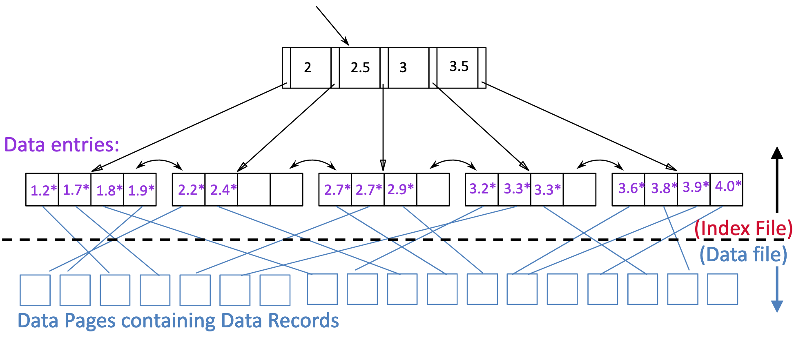

# [CS-322] Summary Database Systems

## 0.	Introduction to SQL

SQL is a **declarative language** (like VHDL) composed of two parts:

- DDL: data definition language
- DML: data manipulation language

In a database, the whole table is called the **relation**, a row is called a **tuple** and a column is called **attribute**. The **primary key** is underlined and is the minimal identifying attribute (it can uniquely define a row) $\implies$ two rows cannot have the same primary key.


As a first example, let's find all the students in the following database and display them:

| sid   | name  | login    | age  | gpa  |
| ----- | ----- | -------- | ---- | ---- |
| 53666 | Jones | jones@cs | 18   | 3.4  |
| 53688 | Smith | smtih@ee | 18   | 3.2  |
| 53777 | White | white@cs | 19   | 4.0  |

To find them all, we use

```sql
SELECT * FROM Students S
```

`S` is the alias we give to the table called `Students`. We can also just select names and login the following way

```sql
SELECT S.name, S.login FROM Students S
```

We may also retrieve all 18 year old students the following way

```SQL
SELECT * FROM Students S WHERE S.age=18
```


If we now have a second table with student grades, we can also combine those two

| sid (student id) | cid (course id) | Grade |
| ---------------- | --------------- | ----- |
| 53831            | Carnatic101     | C     |
| 53831            | Reggae203       | B     |
| 53650            | Topology112     | A     |
| 53666            | History105      | B     |

```sql
select S.name, E.cid from Students S, Enrolled E where S.sid=E.sid AND E.grade='B'
```

This latter queries all student names and course names that have a grade "B" in the course. Note that the student (sid) must be in both tables!


We also have **aggregate operators** such as `COUNT(*)`, `COUNT([DISTINCT] A)`, `SUM([DISTINCT] A)`, `AVG([DISTINCT] A)`, `MAX(A)`, and `MIN(A)` where $A$ is a single column.


> > > DONE UNTIL 28' (exercise session 1 found on forum). (do from 28' to 45'		)


## 1.	Entity-relationship (ER) model

A **data model** is a collection of concepts for describing data (e.g. xml, graph, object-oriented, ...). A **relational data model** (by far the most commonly used) is a set (in the mathematical sense) of records. The **relation** is the table (with rows and columns) and the **schema** describes the structure of a relation

A **key** identifies an object in a table. A foreign key is a key used in another table (from the same system)


Imagine we have an enterprise. The **entities** are employees, the boss, pcs, ... and the **relashionships** is a bond between two or more entities (e.g. an employee owns a pc, the boss employs employees, ...). The **integrity constraints** are rules that make sure that the data maintains its integrity (e.g. each student has a unique sciper number). A database "schema" in the ER model can be represented pictorially (ER diagrams). The **entity set** is a collection of similar entities (e.g. all employees). All entities in an entity set have the same set of attributes. Each entity set has a key (which is underlined) and each attribute has a **domain** (e.g. employee ages are natural numbers)

A **relationship** is an association among two or more entities (e.g. an employee works in a department) which can have their own attributes (e.g. an employee works in a department since march 2021). A **relationship set** is a collection of similar relationships (e.g. all employees working in some department)


We have 3 types of **constraints**

- **many-to-many** : e.g. an employee works in a department (many employees may work in a same department and a department can be constituted by many employees)
- **many-to-one** : e.g. an employee manages a department (a department can only have a manager). We describe this in a schema using an **arrow**. An arrow means *at most one*.
- **one-to-one** : e.g. a driver drives a vehicle


We use fat links to denote an "at least one" relationship


A **weak entity** can be identified uniquely only by considering the primary key of another (owner) entity (e.g. children of employees). We denote them using thick lines for the entity box and relastionship diamond. Weak entities have only a **partial key** (dashed underlined)

Ternary relationships (up to $N$-ary relationships) use the diamond shape where we link multiple entities to it (or attributes)


To build more complex schemas, we can also use **hierarchies**. The **ISA** ("is-a") hierarchy: if $A$ is-a $B$, then every $A$ entity is also considered to be a $B$ entity. We denote this using a triangle


We can also group a set of entities and relations together using **aggregations** (depicted using a dashed box)


## 2.	SQL ???

SQL is composed of two parts:

- Data definition language (DDL) : create, modify, and delete relations, specify constraints, administer users, security, etc.
- Data manipulation language (DML) : specify queries to find answers (add, modify, remove)

Here's an SQL overview

```sql
create table <name> ( <field> <domain>, ... )

insert into <name> ( <field names> ) values ( <field values> )

delete from <name> where <condition>

update <name> set <field name> = <value> where <condition>

select <fields> from <name> where <condition>
```


For example, we could create a student table this way:

```sql
create table Students (
	sid CHAR(20),
  name CHAR(20),
  login CHAR(10),
  age INTEGER,
  gpa FLOAT
)

create table Enrolled (
	sid CHAR(20),
  cid CHAR(20),
  grade CHAR(2)
)
```


A **superkey** is a set of attributes for which no two distinct tuples can have same values in all key fields. The **key** is the set of attributes for which it is a superkey and no subset of the fields is a superkey. If there are multiple keys, each of them is referred to as a **candidate key**. The **primary key** is one of the candidate key chosen by the DBA (database administrator)

Using this knowledge, here's how we create the Students database

```sql
create table Students (
	sid CHAR(20),
  name CHAR(20),
  login CHAR(10),
  age INTEGER,
  gpa FLOAT,
  PRIMARY KEY(sid)
)

create table Person (
	ssn CHAR(9),
  name CHAR(20),
  licenseNumber CHAR(10),
  PRIMARY KEY (ssn),
  UNIQUE (licenseNumber)
)
```

A **foreign key** refers to a tuple in another relation (must correspond to the primary key of the other relation like a "logical pointer"), thus Enrolled looks like this

```sql
create table Enrolled (
	cid CHAR(20), sid CHAR(20), grade CHAR(2),
  primary key (sid, cid),
  foreign key (sid) references Students(sid)
)
```


## 3.	Relational algebra

**Relational algebra** is a simple language composed of 5 operators capable of capturing many (SQL) queries

- selection: $\sigma$ selects a subset of rows from a relation
  - $\sigma_{rating<9}(S2)$ (where $S2$ is a table name)
  - $\sigma_{rating<9\and age>50}$
- projection: $\pi$ retains only wanted columns from a relation. Note that this operation could create duplicates (standard projection) unless specifically stated that we use set projection which removes duplicates!
  - $\pi_{sname, rating}(S2)$ (we only keep those two columns from the table)
  - $\pi_{name, rating}(\sigma_{rating<9}(S2))$ ($\sigma$ applied first, and then $\pi$)
- cross-product: $\times$ allows to combine two relations ($S_1 \times R_1$ is each row of $S_1$ paired with each row of $R_1$). Note that we may have naming conflicts (two fields with the same name) which can be solved using the renaming operator. For two tables with $c_i$ columns and $r_i$ rows for $i=1,2$, we have a total of $c_1+c_2$ columns and $r_1*r_2$ rows
- set-difference: $-$ tuples in first relation that are not in the second
- union: $\cup$ tuples in relation 1 and/or in relation 2


**Compound operators**:

- Intersection: $\cap$ tuples that are both in relation 1 and 2. It is compound because $R \cap S = R - (R-S)$, thus not an essential operator

- Natural join: $\bowtie$. Conceptually, $R \bowtie S$ does:

  1. compute $R \times S$
  2. select rows where attributes that appear in both relations have equal values
  3. project all unique attributes (remove duplicate columns)

  :information_source: the $\bowtie$ operation is slow! Minimize the number of rows/columns

- Condition join (or theta-join): $R \bowtie_C S$. Same as $R \bowtie S$ but replaces step 2 with "select rows that fullfil the condition"

  - $R \bowtie_{R.bid < S.bid} S$

- Equi-join is a special case of theta-join where condition $C$ contains only a conjunction of equalities
  
  - $R \bowtie_{R.age = S.age} S$


**Other operations**:

- renaming operator: $\rho$ renames a list of attributes in the form of "$oldName \rightarrow newName$". $oldName$ can also be an integer representing the index of the attributes (starting at one). It returns the same tuples as input
  - $\rho_{name \rightarrow fullName}(S2)$
  - $\rho_{name \rightarrow fullName, size \rightarrow height}(S2)$
  - $\rho_{2 \rightarrow fullName}(S2)$ (renames the second column)

- division operator: / useful to describe "for all" queries ($A/B$ contains all $x$ tuples such that for every $y$ tuple in $B$, there is an $xy$ tuple in $A$). Note that this is a compound operator as well ($\pi_x((\pi_x(A) \times B)-A)$)
  $$
  A/B = \{\langle x \rangle | \forall \langle y \rangle \in B, \exist \langle x, y \rangle \in A\}
  $$


## 4.	File organization and indexing

### File organization

A **file** is a (uniquely identified) set of pages; a **page** is a block of a certain size (e.g. 4kB) containing records; a **record** is a collection of values (called **fields**)


A simple way to store data is to store records one after the other in the page. This method is called the **N-ary storage mode**. We optimize for reads by adding some information (called **headers** that store information such as the length of each value) before each record. Moreover, we store pointers at the end of the page pointing to each header (for easy access to header $k$). Note that the last pointer points towards the first header

For simplicity, we assume for now that records have fixed length (e.g. value 1 is always $L1$ bytes), thus we can easily access value $j$. To handle deletions, we have two solutions: either move other records in empty spaces or use a bitmap to encode whether or not the slot is occupied (by a record)

In reality, we often have variable length values (e.g. a name). A solution could be to have $v$ pointers before a record (of $v$ values) which pointto the beginning of the values addresses


Another model is called **decomposition storage model** (**DSM**) which decomposes a relational table to sub-tables per attribute (it saves IO by bringing only the relevant attributes). The problem (that N-ary doesn't have) is a locality issue: the data is scattered all around


The **partition attributes across** (**PAX**) model is a mix of the two previous models to get the best of both worlds. The idea is to decompose a slottted-page in mini-pages per attributes

- for fixed size values, we have F-mini-pages that have a bitmap to encode whether or not the slot is filled
- for variables size values, we have mini-pages called V-mini-pages that have pointers that point to the end of each value

---


Instead of these file organizations, we could also use other alternatives such as **heap files** (append is fast), **sorted files** (best for retrieving often and adding data not often), or **index file organizations** (see next section):

- heap (unordered) file: contains records in no particular order. We put those data files in two double linked list. The first stores full pages and the other pages with free space. Instead of the linked-list, we could have a file directory (the header pages (now a collection of pages containing pointers to data pages) points to data pages)

### Indexing

**Indexing** is a way to make data access more efficient using redundancy. It is essentially a list of $(value, pointer)$. If we want a value that is 2.8, we follow the pointer located between 2.5 and 3



> There are *a lot* of index classifications. See course Week 5 @ 1h23


at most 1 custered index


### Storage

Anatomy of a disk. A **disk** is composed of a pile of platters (== like music cds) spinning around a spindle. A platter is composed of many tracks (circles/paths on the platter). Disk heads are immovable on the y-axis (the platter turns and the head reads thanks to the magnetic material on the plattern). Disk head can move horizontaly towards (or outwards) the spindle

So we have 3 delays to access info: seek time (move arms to position disk heads on the track), rotational delay (wait for block to rotate under the head), and transfer time (actually moving data to/from the disk)


A **flash disk** can be used as secondary storage or caching layer. Its main advantage is that random reads are as fast as sequential ready (but slow random writes)


### Tree indexing

Tree-structures indexing techniques support both range searches and equality searches. The idea is to create an **index file** which is a list of data file pointers

We implement that using a B+ tree which support insertions and deletions at $\log_F N$ cost where $F$ is the fanout and $N$ the number of leaf pages. The idea is to keep the tree short and fat (more than binary tree) and balanced

To insert a data entry into a B+ tree, we find the correct leaf $L$ and put data entry onto $L$. If $L$ has enough space, we are done. Otherwise, we must split $L$ (into $L$ and a new node $L2$) by 1) redistributing entries evenly and copying up the middle key, 2) inserting index entry pointing to $L2$ into parent of $L$

Here are a few examples:

> > TODO


## 5.	Hashing

> Tree based indexes can handle both range selections and equality searches. Hash based indexes are best for equality selection and cannot support range searches


A **hash file** is a collection of buckets (a **bucket** is a collection of pages). We decide in which bucket a page goes by computing the hash (using a hash function: e.g. $h(k) \mod N$ avec $N$ the number of buckets and $h$ the hashing function). This is called **static hashing**. If $N$ is too small for example, we can get long overflow chains (a bucket with many pages in the linked list); this is why we invented extensible hashing and linear hashing

With **extensible hashing**, we define the **global depth** for the directory depth (number of bits used to index) and **local depth** for each individual bucket. These depths will increase depending on the amount of data that needs to be stored and the bucket in which the data goes

A final option is called **linear hashing**. The idea is to remove the directory by using *temporary* overflow pages and remove long overflow chain by choosing the bucket to split in a *round-robin* fashion. The main idea is to use a family of hash functions $h_0, h_1, \dots$ (instead of a single hash function) such that $h_{i+1}$ doubles the range of $h_i$. For this, we use $h_i(k) = h(k) (\mod 2^i N)$ where $N$ is the initial number of buckets and $h$ some hash function


## 6.	Sorting

Sorting in memory is simple (e.g. insertiong sort, bubble sort, quick sort, ...). The problem with DBs is that we have to sort e.g. 100 GB with 100 MB of RAM. We use merge sort in multiple passes

- Number of runs on the first pass : $\lceil N / B \rceil$ ($B$ est le nombre de buffer pages disponibles et $N$ le nombre de pages à trier)
- Number of passes required to sort everything: $1+\lceil \log_{B-1}(\lceil N / B\rceil)\rceil$

:information_source: "sorted runs" == "sub-files"

## ?.	Query operators

Each operator implements an `Iterator` interface:

- `open()`: initializes operator state and sets parameters such as selection condition
- `next()`: operator invokes `get_next()` recursively on its inputs
- `close()`: clean-up state


Here's the example we will use below

- Sailors(<u>sid: integer</u>, sname: string, rating: integer, age: real):
  - Each tuple is 50 bytes long, 80 tuples per page, 500 pages
  - $N=500$, $p_S=80$
- Reserves(<u>sid: integer, bid: integer, day: dates</u>, rname: string):
  - Each tuple is 40 bytes long, 100 tuples per page, 1000 pages
  - $M=1000, p_R=100$


### Selection

Simple selection. E.g `select * from Reserves R where R.rname < 'C%'`. How to best perform it? It depends on factors such as available indexes/access paths, the expected size of the result (number of tuples and/or number of pages). The **size of the result** is approximated by $\text{size of R * reduction factor}$. The reduction factor is usually called **selectivity** (number between 0 and 1 telling the percentage of tuples that survived the selection):

- with no index and unsorted, we must essentially scan the whole relation. Cost of $M$ = 1000 I/Os
- With no index but sorted, we have the cost of binary search + number of pages containing results. Then the cost of $M$ is 10 I/Os + (selectivity * number of pages)

For a general selection (e.g. `select ... where (day < 8/9/94 and rname = 'Paul') or bid = 5 or sid = 3`). First, we convert it to conjunctive normal form (conjunction of disjunctions). A B+ tree index on day can be used (then bid and sid must be checked for every retrieved tuple). Similarly a hash index on <bid, sid> could be used (and then day < 8/9/94 must be checked). Note: a B+ tree index on <day, rname> is decent whereas a B+ tree index on <rname, day> is terrbile (might as well check the whole file). A Hash index on <day, rname> is also terrible (we cannot use it at all)


### Projection

When we are dealing with projections (e.g. `select distinct R.sid, R.bid from Reserves R`), the issue is to remove duplicates. The basic approach is to use sorting:

1. Scan R and extract only needed attributes
2. Sort the resulting set
3. Remove adjacent duplicates

We could also do it using hashing (remove duplicates based on hash)


### Joins

We will discuss three techniques used to handle joins:

- Nested-loops join:

  ```pseudocode
  for each tuple r in R do
  	for each tuple s in S do
  		if r_i == s_j then add <r, s> to result
  ```

  Here, for each tuple in the **outer relation R**, we scan the entire **inner relation S**. If we assume M pages in R, p_R tuples per page and N pages in S with p_S tuples per pages, then the cost is M + M * p_R * N

  Here's the page-oriented nested loop join

  ```pseudocode
  for each page b_r in R do
  	for each page b_s	in S do
  		for each tuple r in b_r do
  			for each tuple s in b_s do
  				if r_i == s_j then add <r, s> to result
  ```

  This version has cost M + M * N (which is way better than the last cost)

  Finally, we could use block nested loops join (give all but one page to the outer relation and 1 page to the inner). The cost is M + #outer blocks * N. We calculate #outer blocks with 
  $$
  \#outer \space blocks = \lceil \#pages \space of \space outer / blocksize \rceil
  $$

- Sort-merge join. We scan R and sort in main memory, then scan S and sort in main memory. Then we merge R and S. The cost is M + N and we need to have enough memory to store M + N for a one-pass algorithm (note: this is typically NOT a one pass algorithm)

- Hash join. We scan R, build buckets in main memory. Then scan S, probe and join. The cost is M + N. The only (but huge) assumption we do (for a one-pass algorithm) is that we have enough memory so store M and its hashtable)

- Two-pass hash join:

  1. Phase 1
  2. Phase 2


## Query optimizations

Before optimizations, queries are flattened (remove nested queries) and decorrelated (remove exists)


Costs for single relation plans

- Cost of b+ tree index = Height(index) + 1; cost of hash index = 2.2 (environ)
- Clustered index : (NPages(index) + NPages(relation)) * selectivity
- Unclustered index : (NPages(index) + NTuples(relation)) * selectivity
- Sequential scan of file: NPages(relation)


Costs for multiple relations


## Concurrency

A DBMS assures all or nothing (if 5 transactions are sent and the system crashes, we either have 0 or 5 visible changes). A DBMS assures the **ACID properties**:

- A : atomicity (all or nothing)
- C : consistency (if consistent transactions enter the system, the DB starts consitent and ends consistent)
- I : isolation (execution of a transaction is isolated from another)
- D : durability (if a transaction commits, its effect persists)


How to handle consitency?

- System checks integrity constraints; if they fail, the transaction rolls back


How to handle isolation?

- Strict two phase locking (Strict 2PL): lock object we are going to use before using them. Each transaction obtain a S (shared) lock on object before reading and a X (exlusive) lock on object before writing. If a transaction hold a X lock on an object, no other transaction can acquire a lock (S or X) on that object. If a transaction holds an S lock, no other transaction can get an X lock on that object


How to deal with atomicity?

- logging : log all actions so that we can undo actions of aborted transactions (heavy performances). We are using WAL (write ahead logging), i.e. log record must go to disk before the changed page (so that we can roll back if needed)
- shadow pages


How do deal with durability (i.e. when the system crashes between commit and flush)?

- We do it in three phases:
  1. analysis: scan the log to identify all transactions that were active at the time of the crash
  2. redo: redo updates as needed to ensure that all logged updates are in fact carried out and written to disk
  3. Undo: undo writes of all transactions that were active at the crash


