# [CS-323] Summary Introduction to Operating System

[TOC]


## 1.	Introduction

What is the role of an OS :

- The OS provides common functionality to access resources
- The OS abstracts hardware, provides a unified interface (e.g. entwork chips A and B are accessed using the same API)
- The OS shares resources between applications

> The OS is like a waiter that serves individual clients. The waiter knows the menu, records orders, and delivers food to the right table while keeping track of the bill


OS separates into 3 pillars (Virtualization, Concurrency and Persistence) with security as a transcendantal layer covering all pillars :

- **Virtualization** : each application believes it has unlimited resources for itself
- **Concurrency** : OS must handle concurrent events and untangle them as necessary
- **Persistence** : lifetime of information is greater than lifetime of a process (non-volatile information, resilient to failure, ...)
- **Security** : OS is a gatekeeper that enforces security (OS is priviliged and thus frequently attacked)


A **program** consists of static code and data (e.g. on the disk) whereas a **process** is an instance of a program. A process is an **execution stream** in the context of a process state. The execution stream is the sequence of executing instructions (i.e. the "thread of control"). We create a process by taking a snapshot of some code somewhere and storing it somewhere else.

To virtualize the CPU (giving each process the illusion of exclusive CPU access and memory access), we have two approaches : **time sharing** (exclusive use, one at a time – e.g. CPU (alternates between tasks)) and **space sharing** (everyone gets a small chunck all the time – e.g. memory and disk).


When the user executes a program, the OS creates a process, time-shares CPU across multiple processes. The OS scheduler picks ONE of the executable processes to run (he keeps a list of processes and some metadata for policy). The **policy** is which process to run whereas the **mechanism** is how to switch from one process to another. This distinction enables **modularity**.

To create a process, the OS allocates internal data structures, allocates and address space (loads data from disk, creates runtime stack and heap), opens basic streams (STDIN, STDOUT, STDERR), initialises CPU registers. Processes have different states :

- **Running** : currently executing
- **Ready** : ready to execute (will be scheduled when the policy decides so)
- **Blocked** : suspended (e.g. waiting for some action)
- **New** : being created (to ensure it will not be scheduled)
- **Dead** : terminated (e.g. if the parent process has not read out the return value yet)

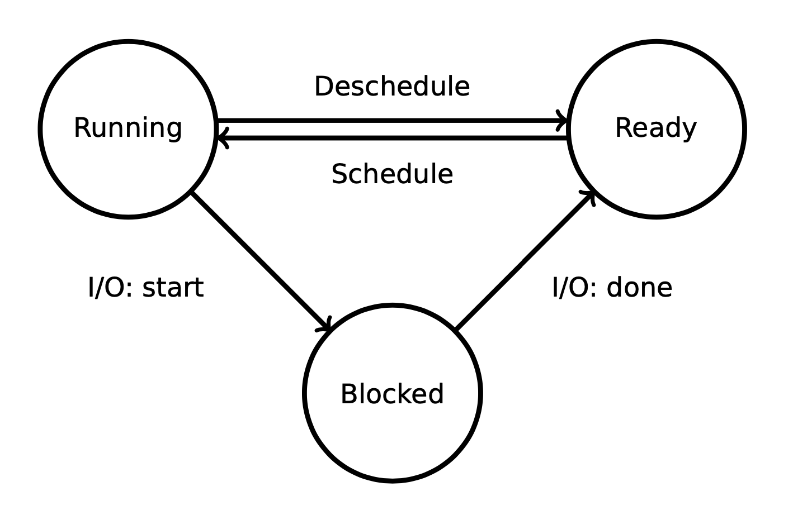

If all processes are blocked, then the **idle process** is scheduled (never blocks or executes any I/O and is generally a while loop counting to infinity). It is a simple solution to a challenging problem (withtout the idle process, the scheduler would have to check if no processes are ready to run and would have to conservatively take action. The idle process guarantees that there's always at least one process to run).


A process can have multiple **threads** in the same address space (computing on the same data). A tread is a **lightweight process** (LWP) (consists of a stack and register state). For example two processes reading at address `0xc03f` may read different values while two threads in the same process will read the same value.


Processes can request OS services through the system call API :

- `fork()`: creating a new child process (copy of a process) (note : it returns twice!)
- `exec()` : executing a program
- `exit()` : terminates the current process
- `wait()` : waiting for a child
- ...


## 2.	Scheduling

### Overview

**Scheduling** has two aspects :

- how to switch from one process to another
- what process should run next

involving the mechanism (how to switch (context switch) and keep control (preemption)) and the policy (where to switch to)


Imagine we have several `ready` processes and, for simplicity, one CPU. How does the kernel switch from one process to the other. The kernel stays in control using configurable timers that allow the OS to regain control. The kernel switches from one process to another as follows :

- Context switch saves the running process' state in the kernel structure
- Context switch restores the state of the next process
- Context switch transfers control to the next process and "returns"

> A **context switch** is a mechanism that allows the OS to store the current process state and switch to some other (store stack pointer and registers, then changes address space, then load new registers and stack)

> The **preemption** is the mechanism that puts a timer on each process executing to avoid inifnite execution of a process. At the end of the timer, the process is forced to interrupt. The kernel then takes the reigns back and decides if the process timed out may continue or not.

> The **scheduling policy** determines which process should run next. If there's only one `ready` process then the answer is easy. If there are more processes then the policy decides in which order processes execute. Note that if no prrocesses are `ready`, then the idle process gets scheduled. 

There are different ways to implement a scheduling policy; to analyze its "performances", we use the following terms :

- **Utilization** : fraction of the time the CPU is executing a program (goal : maximize this value)
- **Turnaround time** : total global time from process creation to process exit (goal : minimize this value)
- **Response time** : total time from becoming ready to being scheduled (goal : minimize this value)
- **Fairness** : all processes get the same amount of CPU over time (goal : no starvation)
- **Progress** : allow processes to make forward progress (goal: minimize kernel interrupts)

We can implement a very simple scheduler where each state has an associated queue of tasks

```c
task_struct_t* get_next_task() {
  // consult task queues to find next runnable task
}

void enqueue_task(task_struct_t* task) {
  // set task to ready
  // update ready queue so that it can run at its turn
}
```

---


### Scheduling policies examples

#### First In, First Out (FIFO)

Tasks A, B and C of length $len = 2$ arrive at $T=0$. The average turnaround is $(2+4+6) / 3 = 4$ and the average response time is $(0+2+4)/3=2$

Task A is now $len=6$. Then the average turnaround is $(6+8+10)/3=8$ and the average response time $(0+6+8)/3=4.7$ $\implies$ turnaround and response time suffer when short jobs are waiting for long jobs! (e.g. 2 race cars behind a tractor on a road)


#### Shorter job first (SJF)

Long running tasks delay other tasks. Our new scheduler then chooses `ready` job with the shortest runtime

With the last example, the average turnaround is $(2+4+10)/3=5.3$ and the average response time $(0+2+4)/3=2$ (order : B -> C -> A or C -> B -> A)

Task B and C now arrive at $T=1$. the average turnaround is $(6+7+9)/3=7.3$ and the average response time $(0+5+7)/3=4$


#### shortest time to completion (STCF)

Preemptive schedulers may take control of the CPU at any time, switching to another process according to the scheduling policy. Our new scheduler thus choose a task according to the shortest time to completion first (always run the job that will complete the fastest)

For the last example, the average turnaround is $(2+4+10)/3 =5.3$ and average response time $(0+0+2)/3 = 0.7$


#### Round robin (RR)

Previous schedulers optimize for turnaround. Now we alternate `ready` processes every fixed-length time slice

For task A, B and C of length $len=3$ all arriving at time $T=0$, the average response time is $(0+1+2)/3=1$


#### Multi-level feedback queue (MLFQ)

So far, the scheduler only considers preemptive events (i.e., the timer runs out) or process termination to reschedule. If the scheduler is aware of I/O (e.g., loading data from disk) then another process can execute until the data is fetched. I/O operations are incredibly slow and can be carried out asynchronously

The scheduler must support both long running background tasks (**batch processes**) and low latency foreground tasks (**interactive processes**). For batch processes, the response time is not important (we care we long run time). For interactive processes, response time is critical

The idea of MLFQ is to use multiple layers of round robin (multiple queues with different priorities). Processes at higher level will always be scheduled first. In general, high levels have short time slices and lower levels run for longer.

Here are a few rules for MLFQ :

```pseudocode
- if priority(A) > priority(B) then A runs
- if priority(A) == priority(B) then A and B run in RR
// Use past behaviour as a predictor for futur behaviour
- processes start at top priority
- if process uses up whole time slice, demote it to lower priority (with longer time slices)
// Low priority tasks may never run on a busy system
- periodically boost priority of all tasks that haven't run
// High priority process could yield before its time slice is up, remaining at high priority
- account for total time at priority level (and not just time of the last slice scheduled in RR), downgrade when threshold is exceeded
```

*Note* : we say that a running process **yields** when he decides to give up control


#### Completely fair scheduler (CFS)

The idea is that each task runs in parallel and consumes equal CPU share. We calculate the time a process receives on an ideal processor (e.g. assume 4 processes are `ready`, then they would each receive $1/4$ of the CPU)

*Note* : On real hardware, we can run only a single task at once, so we have to introduce the concept of “**virtual runtime**.” The virtual runtime of a task specifies when its next timeslice would start execution on the ideal multi-tasking CPU described above. In practice, the virtual runtime of a task is its actual runtime normalized to the total number of running tasks.

We implement it keeping all processes in a red-black tree sorted by maximum execution time


## 3.	Virtualization

Virtualization is the process of isolating processes (and their faults) from each other. It enables isolation but requires separation. A process must be prohibited to access memory/register of another process.

- Step 1 : Virtual CPU provides illusion of private CPU registers
- Step 2 : Virtual RAM provides illusion of private memory

Initially, an OS was a set of library routines executing one process at a time. If the program crashes, a human had to walk up to the machine, reset and restart it; that was called **uniprogramming**. Now, we have multiprogramming (multiple processes) which goals are :

- Transparency : processes are unaware of memory sharing and existence of other processes
- Protection : OS/other processes are isolated from process (read/write)
- Efficiency (1) : do not waste resources (e.g. fragmentation)
- Efficiency (2) : run as close to the metal as much as possible
- Sharing : processes may share part of address space


**Address space** : each process has a set of addresses that map to data (i.e. map from pointers to bytes)

- static : code and global variables
- dynamic : stack, heap

Note : we need dynamic memory because the amount of required memory may be task dependent (a list of employees, a buffer for a file, ...), the input size may be unknown at compile time (list of all the students in a certain class, how many?), pre-allocation would be wasteful (sometimes wayyy to big) and recursive functions (invocation frames)

Calling a function allocates an invocation frame to store all variables and the necessary context to return to the callee. For example, in the invocation frame of `called()` (from line 7), we have a slot for the `int tmp`, slots for parameters `a` and `b`, a slot for the return pointer and some information according to the ABI

```c
int called(int a, int b) { 
  int tmp = a * b;
	return tmp / 42;
}

void main(int argc, char *argv[]) {
	int tmp = called(argc, argc); 
}
```


### Simple solutions for virtualisation

Virtualizing memory is hard : how can we run multiple programs in parallel (addresses are hardcoded in the code and static allocation? (what about execution the same task twice)). Here are a few possible sharing mechanisms :

- **time sharing** :

  - Reuse idea from CPU virtualisation. We could virtualize memory by storing state to disk
  - Incredibly bad performance due to I/O latency (write to disk)

- **Static relocation / allocation** :

  - Imagine running this assembly code :

    ```assembly
    0x10: mov -0x4(%rbp),%edx 	# Load 0x10 to x12, then exec
    0x13: mov -0x8(%rbp),%eax 	# Load 0x13 to 0x15, then exec
    0x16: add %edx,%eax 				# Load 0x16 and 0x17
    0x18: call 560 <printf@plt>
    ```

    The OS relocate the text segment when a new task is created. So we end up with

    ```assembly
    ### TASK 1 ###
    0x1010: mov -0x4(%rbp),%edx
    0x1013: mov -0x8(%rbp),%eax
    0x1016: add %edx,%eax
    0x1018: call 560 <printf@plt>
    
    ### TASK 2 ###
    0x5010: mov -0x4(%rbp),%edx
    0x5013: mov -0x8(%rbp),%eax
    0x5016: add %edx,%eax
    0x5018: call 560 <printf@plt>
    ```

  - When loading a program, relocate it to an assigned area and carefully adjusts all pointers in code and globals, set the stack pointer to the assigned stack 
  - Issue 1 : no separation between processes (no integrity or confidentiality)
  - Issue 2 : fragmentation: address space is occupied/fixed as long as program runs

- Base (+ bounds) : see below (MMU)

- Segmentation : see below

- Virtual memory


How can the OS provide the illusion of a private address space to each process? What if, instead of relocating the memory accesses ahead of time, the hardware could help us relocate accesses just-in-time? In **dynamic relocation**, a hardware mechanism translates each memory address from the program’s viewpoint to the hardware’s viewpoint. This is done use the **memory management unit** (**MMU**) : process runs on the CPU, the OS controls CPU and MMU and MMU translates the virtual address to physical address

*Note* : we need to develop different **privilege modes** in order to keep the process from modyfing the MMU configuration


The simplest MMU we can imagine is called **base register** : the idea is to translate virtual to physical addresses by adding an offset (offset stored in a special register controlled by OS and used by MMU). Each process has a different offset in their base register. For example, if process 1 (that has a base register equal to `0x1000`) wants to access the memory at address `0x100`, then MMU translates the virtual address (`0x100`) to the physical address `0x1100` ($0x1000 + 0x100 = 0x1100$). If process 2 (that has a base register equal to `0x3000`) wants to access the memory at address `0x100`, then MMU translates it to `0x3100`

This design is simple but has problem (if p1 wants to access `0x2000`(virutal), then it would access p2's memory part). In order to avoid that, we also introduce **bounds** such as

```c
if (base + addr < bounds) return *(base + addr);
else throw new SegFaultException();
```


A better (and still simple) solution would, instead of a single base/bounds register pair, use one pair per memory area; this is called **segmentation**. We allow a process to have several regions of continuous memory mapped from a virtual address space to a physical address space

---


### Fragmentation

The **address space** encapsulate all addressable memory

For simplicity, we assume that each address points to a byte


The seven layers of memory abstraction complexity :

- No virtualisation, program runs on bare metal (a program has access to the entire memory)
- Time sharing, one program at a time (still has access to the entire memory)
- Space sharing, relocate programs in one shared address space
- Space sharing, virtual address space through segment (base)
- Space sharing, virtual address space through segment (base + bounds)
- Space sharing, virtual address space through multiple segments
- Space sharing, virtual address space through paging


For now, we have seen everyseen except paging. Segmentation allow reasonable sharing of a physical address space among serveral processes. However, each segment must be fully backed by memory, the physical memory area must be contiguous (fragmentation) and instructions implicitly or explicitly encode target segment

There are two types of **fragmentation** :

- **External fragmentation** : visible to allocator (OS), e.g. between segments
- **Internal fragmentation** : visible to requester, e.g. rounding if segment size is a power of 2

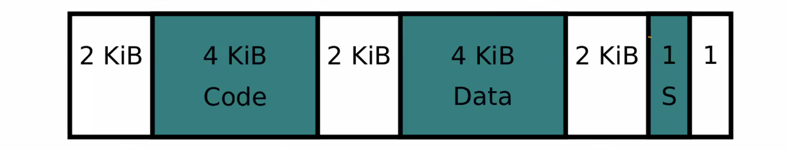


### A more complex MMU : paging

- Goal : eliminate requirement that physical memory is contiguous
- Idea : break address spaces and physical memory into pages


For processes (virtual address space) this is called a (virtual) page. As part of the physical address space this is called a frame (or physical page). A system with 12 bit pages that the lowest 12 bit of the address specify the page offset and a page’s size is 2^12 bytes (4 KiB). Note that both virtual pages and physical pages have the same size

MMU translates virtual to physical address the following way :

- High order bits designate page numbers

- Low order bits designate offset in the page

:information_source: size of virtual and physical address space may be different

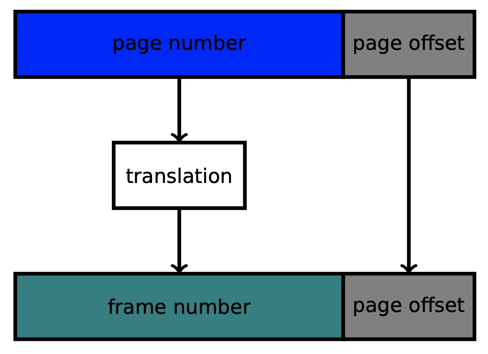

*Example* : virtual address space is 4 GiB (i.e. 32 bits), the physical address space is 256 TiB (i.e. 48 bits) and page size is 4 KiB (i.e. 12 bits). The page number use $32-12$ bits, i.e. each process may reference $2^{20}$ pages. Frame numbers use $48-12=36$ bits

*Example* : assume 16 bit virtual adresses space, 20 bit physical address space and 12 bit for page (offset). The simplest approach to translate from virtual to physical addresses is through a **lookup table** for each process. The pointer to the lookup table is stored in a special register (`CR3` on `x86`). 


The advantages of paging is that there's no external fragmentation and it is fast to allocate (no searching for space) + free (no coalescing). However, there's internal fragmentation (regarding page size), additional memory references to page table (maybe use a cache?). To avoid additional memory access, we use a simple idea: remember previous lookups. We store the last accessed pages in a cache called **TLB** (**Translation Lookaside Buffer**). It reduces requirement memory accesses for page walk and if there is an entry in the TLB, reuse!


Nowadays we use **multi-level tables** (one or more levels of indirection allow space efficient encoding, but each level adds one more memory lookup during address translation). Our virtual address is now separated in three parts : the first level (select the entry in the main table (gray table)), the second level (select the entry in a sub-table (lime or cyan)) and the page offset (select entry in a page (yellow, light green, brown or green-brown))

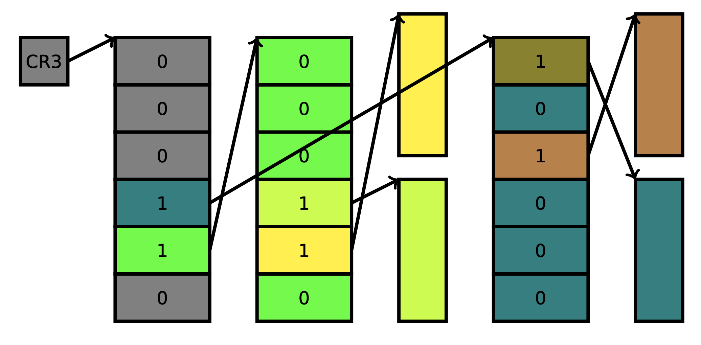


When the main memory runs out, we store unused pages of address space on disk. This allows the OS to reclaim memory when necessary and to over-provision (hand out more memory than physically available).


**Swapping : page fault handling** : The MMU translates virtual to physical addresses using the OS provided data structures (page tables). The **present bit** for each page table entry at each level indicates if the reference is valid, i.e., resides in memory, or not. MMU checks present bit during translation. If a page is not present then the MMU triggers a **page fault**. Virtual to physical translation is transparent to executed instructions, requires HW support

If a page fault occured, MMU signals CPU to trap and switch to the OS. The **page fault handler** checks where (which process (locate data structures) and what address (search page in page table)) the fault happened. If the page is on disk, then OS issues load request and tells scheduler to switch to another process. If the page is still in memory or can be reproduced (e.g., a zero page), then the OS creates it and updates data structures. The OS then continues the faulting process by reexecuting the faulting instruction.

Why does the MMU switch to the OS during a page fault? This is because the OS handles policy, MMU is the mechanism. MMU handles common case: path to page is valid, page is present


**Summary** : CPU issues a load for a virtual address (as part of a memory load/store or an executed instruction). MMU checks TLB for virtual address :

- TLB miss: MMU executes page walk
  - page table entry is present: update TLB, continue 
  - not present but valid: page fault, switch to OS 
  - invalid: trigger segmentation fault, switch to OS

- TLB hit: obtain physical address, fetch memory location and return to CPU

Fragmentation: space lost due to internal or external padding

Paging: MMU fully translates between virtual and physical addresses

Paging and swapping allows process to execute with only the working set resident in memory, remaining pages can be stored on disk


## 4.	Concurrency

- **Parallelism**: multiple threads (or processes) working on a single task using multiple CPU cores
- **Concurrency**: tasks can start, run, and complete in overlapping time periods, e.g., through time multiplexing by interleaving their executions, or through parallelism when they are executed at the same time

Note that processes can share information through partially overlapping address spaces or by communicating (future lectures).


### Introduction

Concurrent execution leads to race conditions Access to shared data must be mediated

- **Critical section:** part of code that accesses shared data 
- **Mutual exclusion:** only one process is allowed to execute critical section at any point in time
- **Atomicity:** critical section executes as an uninterruptible block (a mechanism to achieve it is through **locking**)

A **lock** variable protects a critical section by allowing only one thread to succeed at acquiring the lock (at a time), all threads competing for a certain critical section share the lock. Other threads must wait until the lock is released

```c
void lock(lock_t* lck)			// acquires lock, current thread owns the lock when fct returns
void unlock(lock_t* lck) 		// releases the lock
```


On a single-core computer, the simplest way to do it is to disable interrupts :

```c
void acquire(lock_t* lck) { disable_interrupts(); }
void release(lock_t* lck) { enable_interrupts(); }
```

Note that hardware interrupts may get lost and processes may keep the lock for an arbitrary length. This system can be useful for low-complexity code


Another simple way of designing a lock is using a shared variable to synchronise access to critical section, this is called a **spin lock** because of polling :

```c
// CARE : NOT WORKING
volatile bool lock1 = false;

void acquire(bool* l) {
  while (*lock) {};
  *lock = true;
}

void release(bool* l) {
  *lock = false;
}
```

Note that this version is **NOT** working (acquire is not atomic). It fails about 40% of the time

```c
typedef struct __lock_t {
  int flag;
} lock_t;

void init(lock_t *lock) {
  // 0: lock is available, 1: lock is held
  lock->flag = 0;
}
  
void acquire(lock_t* lock) {
  // CARE : Use TestAndSet from the atomic library (see below)
  while (TestAndSet(&lock -> flag, 1) == 1) { /* spin */ };
}

void release(lock_t* lock) {
  lock -> flag = 0;
}
```

:warning: a strandard C implmentation of `TestAndSet` will not work, you should use a function from the [atomic library](https://en.cppreference.com/w/c/atomic).


Another way is to use a **Peterson's spin lock** :

```c
struct lock {
  unsigned int turn = 0;
  bool lock[2] = {false, false}; /* 2 threads max */
} lock1;

/* thread-local id */
__thead unsigned int tid = TID; /* assign {0, 1} */

void acquire(struct lock* l) {
  l -> lock[tid] = true;
  l -> turn = 1 - tid; /* give priority to the other thread */
  while (l -> lock[1 - tid] && l -> turn == 1 - tid) {}; /* wait */
}

void release(struct lock* l) {
  l -> lock[tid] = false;
}
```

The idea here is that `l -> turn = 1 - tid` gives priority to the *other* thread. This method works 99.9% of the time on modern hardware due to the fact that some instructions are reordered


Locking requires an atomic **test-and-set** instruction which does :

1. an instruction that updates memory location and returns old value and
2. executes the instruction atomically 

```c
type __sync_lock_test_and_set(type *ptr, type val);
```

```c
int lock1;
void acquire(int *l) {
	while (__sync_lock_test_and_set(l, 1) == 1); /* spin */
}
void release(int *l) {
  *l = 0;
}

acquire(&lock1); 
critical_section(); 
release(&lock1);
```

This method works 100% of the time

Another option is using a **compare-and-set** method. The function compares the value at `*ptr` and if it is equal to `expt` then the value is overwritten with `new`. The function returns true if the swap happened

```c
bool __sync_bool_compare_and_swap(T *ptr, T expt, T new);
```

We would use it like this :

```c
void acquire_cas(bool* lck) {
  while (__sync_bool_compare_and_swap(lck, false, true) == false) {};
}
```

A simple way to reduce the cost of spinning is to `yield()` whenever lock acquisition fails. This is no longer a “strict” spin lock as we give up control to the scheduler every loop iteration

```c
void acquire(bool *lck) {
	while (__sync_lock_test_and_set(l, 1) == 1) {
		yield(); 
  }
}
```


The idea of a **queue lock** is instead of spinning, put threads on a queue. Wake up thread(s) when the lock is released :

- Wake up all threads to have them race for the lock 
- Selectively wake one thread up for fairness


A spinlock works well when the critical section is short and rare and we execute on more than one CPU (i.e., no context switch, likely to acquire lock soon). Queue locks work well when the critical section is longer or more frequent (i.e., high contention, likelihood that thread must wait). Hybrid approach: spin for a while, then yield and enqueue


Locks enforce mutual exclusion for critical section (i.e., an object that can only be owned by a single thread). There are trade-offs between spinlock and queue lock (time lock is held, contention for lock, how many concurrent cores execute)

Locking requires kernel support or atomic instructions such as **test-and-set** atomically modifies the contents of a memory location, returning its old value or **compare-and-swap** which atomically compares the contents of a memory location to a given value and, iff they are equal, modifies the contents of that memory location to a given new value

---


### Semaphores

In concurrent programming, a common scenario is one thread waiting for another thread to complete an action

```c
bool done = false;

/* called in the child to signal termination */
void thr_exit() { done = true; }

/* called in the parent to wait for a child thread */
void thr_join() { while (!done); }
```

This code has problems! For single cores, we are needlessly waisting cycles (delaying completion). For multiple cores, we are prohibiting other processes by waiting

Locks enable mutual exclusion of a shared region, a **condition variable** allows a thread to wait for a condition (usually implemented as queues). We can use `wait` (wait until a condition is satisfied), `signal` (wake up one waiting thread) and `broadcast` (wake up all waiting threads) on CVs. Using this knowledge, our code becomes

```c
bool done = false;
pthread_mutex_t m = PTHREAD_MUTEX_INITIALIZER;
ptrhead_cond_t c  = PTHREAD_COND_INITIALIZER;

/* called in the child to signal termination */
void thr_exit() { 
  pthread_mutex_lock(&m);
  done = true;											// 2
  pthread_cond_signal(&c);					// 3
  pthread_mutex_unlock(&m);
}

/* called in the parent to wait for a child thread */
void thr_join() {
  pthread_mutex_lock(&m);
  while (!done)											// 1
    pthread_cond_wait(&c, &m);			// 4
  pthread_mutex_unlock(&m);
}
```

Imagine code is executed following the numbers, then the parent waits forever since he missed the `pthread_cond_signal()` signal. This is why we used `pthread_mutex_un/lock()`


Let's implement producer/consumer synchronization using semaphores. We make producers wait while the buffer is full and consumers wait while the buffer is empty. One or more producers create items and store them in the buffer. One or more consumers process items from the buffer

A **semaphore** extends a CV with an integer as internal state :

```c
/* creates a new semaphore with `value` slots */
int sem_init(sem_t* sem, unsigned int value);
/* wait until the semaphore has at least one slot, decrements the number of slots */
int sem_wait(sem_t* sem);
/* increments the semaphore (and wakes one waiting thread) */
int sem_post(sem_t* sem);
/* destroys the semaphore and releases any waiting threads */
int sem_destroy(sem_t* sem);
```

```c
void* producer(void* arg) {
  unsigned int max = (unsigned int) arg;
  for (unsigned int i = 0; i < max; i += 1) {
    put(i); // store in shared buffer
  }
  retrun NULL;
}

void* consumer(void* arg) {
  unsigned int max = (unsigned int) arg;
  for (unsigned int i = 0; i < max; i += 1) {
    printf("%d\n", get(i)); // receive from buffer
  }
  return NULL;
}

pthread_t p, c;
pthread_create(&p, NULL, &producer, (void*)NUMITEMS); 
pthread_create(&c, NULL, &consumer, (void*)NUMITEMS);
```

There are a few problems about this first draft! 

- Producers may overwrite unconsumed entries
- Consumers may consume uninitialized or stale entries

```c
unsigned int buffer[BUFSIZE] = { 0 }; 
unsigned int cpos = 0, ppos = 0;

void put(unsigned int val) { 
  buffer[ppos] = val;
	ppos = (ppos + 1) % BUFSIZE;
}

unsigned int get() {
	unsigned long val = buffer[cpos]; 
  cpos = (cpos + 1) % BUFSIZE; 
  return val;
}
```

Let's try another version using semaphores this time

```c
sem_t csem, psem;

/* BUFSIZE items are available for producer to create */
sem_init(&psem, 0, BUFSIZE);
/* 0 items are available for consumer */
sem_init(&csem, 0, 0);
```

```c
/* mutex handling mutual exclusive access to ppos */
pthread_mutex_t pmutex = PTHREAD_MUTEX_INITIALIZER;

void put(unsigned int val) {
  unsigned int mypos;
  
	/* we wait until there is buffer space available */
  sem_wait(&psem);
  
  
  /* ppos is shared between all producers */ 
  pthread_mutex_lock(&pmutex);
	mypos = ppos;
	ppos = (ppos + 1) % BUFSIZE;
  
  /* store element in buffer */
	buffer[mypos] = val;
	pthread_mutex_unlock(&pmutex);
  
  /* notify consumer that data is available */
	sem_post(&csem); 
}

unsigned int get() {
	/* wait until data is produced */ 
  sem_wait(&csem);
  
  /* consumer entry */
	unsigned long val = buffer[cpos]; 
  cpos = (cpos + 1) % BUFSIZE;
  
  /* notify producer that a space has freed up */
	sem_post(&psem);
	return val; 
}
```

We can implement a **reader/writer lock** (multiple concurrent readers and a single exclusive writer) using two semaphores


### Common concurrency bugs

- **Atomicity bug:** concurrent, unsynchronized modification (lock!) 
- **Order-violating bug:** data is accessed in wrong order (use CV!) 
- **Deadlock:** program no longer makes progress (locking order)


## 5.	Persistency

### Drivers and IO

RAM is volatile! When powering the computer, nothing is stored. How

Hardware support for devices

- **Northbridge** is also called memory controller hub
- **Southbridge** is also called I/O Controller Hub (ICH / Intel) or Fusion Controller Hub (FCH / AMD)
- The southbridge is connected to the CPU through the northbridge which has a direct connection

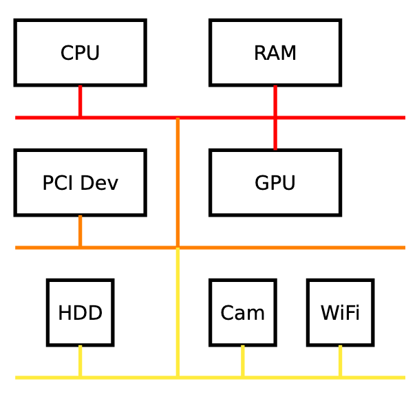


### RAIDS

Goal: increase the flexibility of disk (making a virtual disk). This is where **Redundant Array of Inexpensive Disks** (**RAID**) come into play. The idea is to combine multiple real disks into a virtual disk:

- **RAID0**: striping (separate data over $n$ disks with no mirroring or parity) $\implies \times n$ performance, $\times n$ capacity, but if one fails, the whole system fails
- **RAID1**: data mirroring (copy data from one disk to a another disk with no parity or striping) $\implies \times n$ performance, and all $n$ disks must fail in order for the system to break (as long as one stand, the whole system stands)
- RAID2: bit level striping (not used anymore), one parity drive
- RAID3: byte level striping (not used anymore), one parity drive
- RAID4: block level striping (not used anymore), one drive holds parity
- **RAID5**: block level striping with distributed parity (inside drives, not a separate one). It requires at least 3 disks and 1 disk is allowed to fail for the system to still be running. Data is distributed among the disks and parity as well. We have $\times n$ performance, but $n-1$ capacity
- **RAID6**: block level striping with distributed parity (inside drives, not a separate one). This is a more clever version of RAID5 but needs at least 4 disks to work. We have $\times n$ performance, but $n-2$ capacity. Moreover, 2 of the disks are allowed to fail for the system to still be running

RAIDs can also be combined:

- **RAID01**: two stripes (RAID0) that are mirrored (RAID1)
- **RAID10**: stipe (RAID0) a set of mirrored devices (RAID1)


## 6.	File system

The goal of a **file system** is to manage a set of persistent blocks efficiently (access, initialisation/bootstraping, structural organization)

Sharing and concurrency is hard!


### Introduction / API

A **file** is a linear persistent array of bytes. We have two **operations**: read or write on the file. Some examples of **metaoperations** are create, delete, modify permissions/users/..., ...

We can see files with different perspectives: 

- file name (human readable)
- inode and device number (persistent ID)
- file descriptor (process view of the file)

The file system has different functionalities:

- naming: specifies name syntax and encoding (e.g. a URL)
- directory access: maps name to file objects and resolves a string to an object
- file access: file operations (e.g. create/delete/read/write)

:information_source: *Note* : we consider directories to be files as well!


Historically, we had two philosophies: **typed files** and **untyped files**. In a typed files system, the system defines *all* possible file types (e.g. text document, source file, C file, html file). Finally, the file type speccifies the operations that are available on it. In an untyped system, a file is a sequence of bytes and the system does neither understand nor care about contents. Moreover, file operations apply to all files (set of common operations that can be used on all files). Modern setup settled on untyped files

:information_source: file extension (e.g. `.txt`)


Nowadays, here are the operations that can be used on a file:

- `create` : create a new file
- `unlink` : destroy a file
- `open` 
- `close` 
- `read`
- `write`
- `seek` : modify the file position
- `control` : various control operations such as changing permissions or user
- `createdir`
- `rmdir`
- `readdir` : return all files in a directory

There operators should be designed with cost in mind! For example, it would be desirable to have `read` and `write` (common operations) operate in $O(sizeOfTransfer)$. On the other hand, random access (`seek`) is infrequent, thus $O(\log(fileLength))$ is fine


To manage the files, the system uses `inode`s. An `inode` is unique and contains metadata about the file (location and size). Each file has exactly one associated `inode` and all `inode`s are stored in the **Table of inodes**. For the inverse mapping, we use a dedicated file (let's say stored at `inode 0`) to store a mapping from file names to `inode`s

Humans use filenames: we find a file with a given filename using the table of inodes. Here's an example of someone looking for the file `usr/tmp/test.txt`

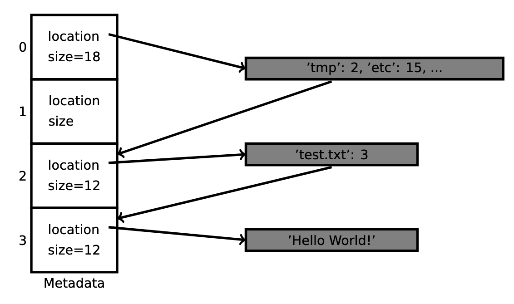

From a process point of view, we read a file using a file descriptor (basically we keep an offset (where we are in the file right now (read increases offset)), the inode where the file is stored and the device id)


There's no system call to delete a file! Inodes are marked free if there are no more references to them. Note that file descriptors are freed upon `close()` or when the process exits. This means that some programs create a temporary file, keep the descriptor but unlink the file from the directory right after creation. This results in a private temporary file that is recycled when the process exits


### Implementation

A file system uses different data structures such as a **virtual file system** (**VFS**) which abstracts the FS as objects with specific operations:

- superblock (mount) : a life filesystem
- file (open) : a file opened by a process
- directory entry cache : speeds up path to inode translation
- inode (lookup) : a filesystem object (e.g. file or directory)

Given a large set of $N$ blocks, we need data structures to encode file hierarchy and per file metadata (overhead metadata size vs file size should be low, internal fragmentation should be low, file content must be accessed efficiently)

There are multiple approaches (contiguous, linked blocks (blocks end with a next pointer), file-allocation tables (table that contains block reference), indexed (inode contain data pointers) or multilevel indexed (tree of pointers))! 

For each of them, think about fragmentation, ability to grow/shrink files, sequential access performance, random access performance and overhead of metadata. Let's take a look at all of them

- **Contiguous** : each file is allocated contiguously. This method has terrible external fragmentation and is likely to unable to grow file, but it is excellent read and seek performance and small overhead for metadata. This method is great for read-only file systems (e.g. CD/DVD/BlueRay)

  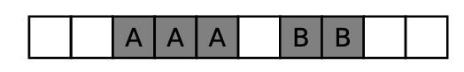

- **Linked blocks** : each file consists of a linked list of blocks. No external fragmentation, reasonable read cost and files can grow easily. On the other hand, we have a high seek cost 

  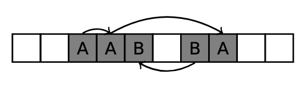

- **File allocation table** (**FAT**) : keep linked list information in a single table. Instead of storing the next pointer at the end of the block, store all next pointers in a central table

  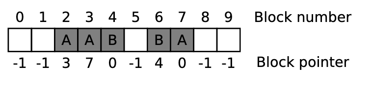

- **Indexed** : metadata contains an array of block pointers. We have no external fragmentation, file can grow easily up to maximum size and we have read and low seek cost. However, we have a large metadata overhead (wastes space as most files are small)

  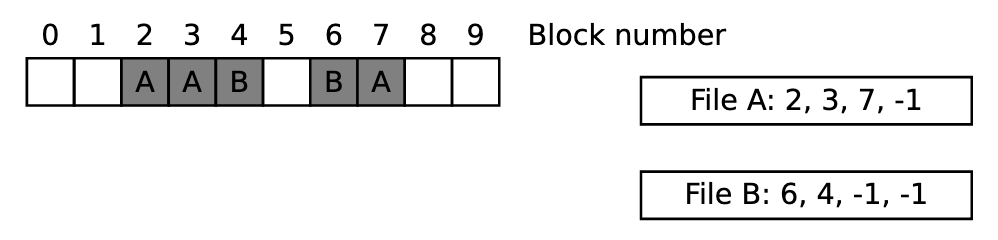

- **Multi-level indexing** : have a mix of direct, indirect (I), double indirect (D) and triple indirect pointers (T)

  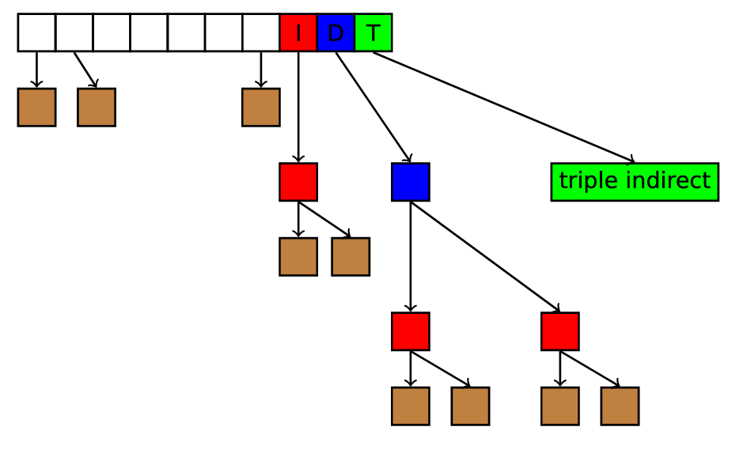


In a simple FS, here's (in order) what we have

- A superblock : file system metadata
- Bitmaps blocks : indicate free blocks
- Inodes : hold file/directory metadata
- Data blocks : file contents


## 7.	Security

We can have functional requirements (e.g. features a, b, c, ...) or operational requirements (performance, usability, ...). What about security requirements?


### Fuzzing

We have different types of testing:

- manual testing (writing test cases)

- fuzz testing (automated software testing technique: it generates new inputs): generate new inputs and see if the program crashes. The fuzzer generates new inputs based on random mutations, leveraging input structure, and leveraging program structure

  We have two types of fuzzers:

  - generation based: input generation produces new input seeds in each round, independant from each other
  - mutation based: input generation leverages existing inputs and modifies them based on feedback from previous rounds

  We have two types of fuzzing algorithm:

  - dumb fuzzing: is unaware of the underlying structure
  - smart fuzzing: is aware of the protocol and modifies the input accordingly

  Finally, we have three types of fuzzer program structure awareness:

  - white box: fuzzing leverages semantic program analysis to mutate input
  - grey box: leverages program instrumentation based on previous inputs
  - black box: fuzzing is unaware of the program strucutre

- symbolic and concolic testing


One of the most well-known fuzzers is called the **American Fuzzy Lop** (**AFL**); it uses grey box instrumentation to track branch coverage and mutate fuzzing seeds based on previous branch coverage

Fuzzers stumble upon a wall: the **coverage wall**. After certain iterations the fuzzer no longer makes progress (e.g. hard to satisfy some checks, chains of checks)


### Sanitization

How do we detect program faults? We could detect them trough test cases... This is extremely tedious and probably not exhaustive. We can improve this using **sanitizers**.

ASan detects memory errors. It places red zones around objects and checks those objects on trigger events. The tool can detect the following type of bugs: out-of-bounds accesses to heap, stack and globals, use-after-free, use-after-return, use-after-scope, double-free, invalid free and memory leaks

:information_source: ASan introduces a 2x slowdown

The idea behind ASan is to store the state of each word in shadow memory (i.e. is it accessible or not?)

```c
long* addr = getAddr();
long val;
char* shadow = (addr >> 3) + shadowbse;

// 8 byte access (read/write)
if (*shadow) report_error(a);
val = *addr;

// N byte access instead
if (*shadow && *shadow <= ((addr & 7) + N - 1))
```

For the stack, Asan inserts red zones around the object on the stack and poison them when entering stack frames


**LeakSanitizer** detects run-time memory leaks. It can be combined with ASan to get both memory error and leak detection. LSan adds almost no performance overhead until process termination

**MemorySanitizer** detects uninitialized reads. Memory allocation are tagged and uninitialised reads are flagged! Typical slowdown of Mean is 3x!

**UndefinedBehaviourSanitizer** detects undefined behaviour. It instruments code to trap on typical undefined behaviour in C/C++ (e.g. unsigned/misaligned pointers, signed integer overflow, conversion between floating point types leading to overflow, illegal use of NULL pointers, illegal pointer arithmetic). The slowdown os UBSan depends on the amount and frequency of checks. This is the only sanitizer that can be used in production. For production use, a special minimal runtime library is used with minimal attack surface

**ThreadSanitizer** detects data races between threads (5-15x slowdown!)

**HexType** detects type safety violation. It records the true type of allocated objects and makes all type casts explicit (0.5x slowdown)

:information_source: **Dynamic testing** leverages concrete executions to find bugs and vulnerabilities.  For each concrete execution these techniques require some input.  As program state is approximateively infinite, not all states can be tested. Dynamic testing techniques are therefore incomplete and only as good as the input generation mechanism that allows them to explore a part of the program state space.


### Mitigations

The set of deployed mitigations is **Data Execution Prevention** (**DEP**) to protect against code injection, **Address SpaceLayout** **Randomization** (**ASLR**) to probabilistically protectagainst information leaks, **stack canaries** to protect backwardedge control-flow, safe exception handling to protect against injected C++ exception frames, and fortify source to protect against format string attacks. Some stronger mitigations such as **Control-Flow Integrity** (**CFI**), **sandboxing**, **stack integrity**, and **software-based fault isolation** are being deployed on highly exposed software with broad dissemination likely coming up soon.


#### DEP

Most wide-spread hardware did initially not distinguish between code and data. Any readable data in a process’ address space could be executed by simply transferring control-flow to that data location.

**Data Execution Prevention** (DEP) or WˆX (writable xor executable) enforces that any location in memory is either executable or writable but never both. DEP enforces code integrity, i.e., code cannot be modified or injected by an adversary. In the absence of a just-in-time compiler or self-modifying code in the process, code remains static and limited to the initial set of executable code as loaded when the process started.

This mitigation is a prime example of a successful mitigation that results in negligible overhead due to a hardware extension.

---

#### ASLR

Any successful control-flow hijack attack depends on the attacker overwriting a code pointer with a known alternate target. **Address space randomization** changes (randomizes) the process memory layout. If the attacker does not know where a piece of code (or data) is, then it cannot be reused in an attack. Under ASLR, an attacker must first learn and recover the address layout.

It can include randomization of start of heap, start of stack, start of code, of code at instruction layer, of mmap allocation regions, of individual allocations (malloc), of the code itself (e.g. gap between functions, order of functions), of struct members (e.g. padding, order).

ASLR requires virtual memory and support from the operating system, linker/loader, and compiler

--- FROM LECTURE

**Address space randomization** (**ASR**): the idea is to shuffle address space around. It depends on the available entropy for randomized locations, the completeness of randomization and the absence of information leaks. If the attacker doesn't know where a piece of code (or data) is, then it cannot be reused in an attack; the attacker must first learn or recover the address layout

We could for example randomization the start of the heap, start of the stack or start of code; these are easy changes. Randomizing individual memory allocations (malloc) is already decently hard. Finally, randomizing the code itself (gap between functions, order of functions, ...) and randomizing members of structs (e.g. padding, order, ...) is really hard

--- END LECTURE

---

#### Stack integrity

Early code execution attacks often targeted stack-based buffer overflows to inject code. An early defense targeted precisely these buffer overflows. While memory safety would mitigate this problem, adding full safety checks is not feasible due to high performance overhead. The goal for this mitigation is to protect an application against stack-based overflows that change the stored return instruction pointer or saved stackbase pointer.

**Stack canaries** are an example of stack integrity defense mechanisms. The key insight for stack canaries is that, in order to overwrite the return instruction pointer or base stack pointer, all other data on the way to those pointers must be overwritten as well. This mitigation places a canary before the critical data and adds instrumentation to (i) store the canary when the functionis entered and (ii) check its integrity right before the function returns. The weakness of this defense is that the stack canary only protects against continuous overwrites as long as the attacker does not know the canary.

Other defense mechanisms include **fortify source** (protect against string attacks), and **safe exception handling** (**SEH**) (protect against popping exception frames).

---

#### Control-flow integrity

**CFI** is a defense mechanism that protects applications against control-flow hijack attacks.  A successful CFI mechanism ensures that the control-flow of the application never leaves the predetermined, valid control-flow that is defined at the sourcecode/application level.  This means that an attacker cannot redirect control-flow to alternate or new locations.

---

Mini-summary:

- Deployed mitigations do not stop all attacks
- Data Execution Prevention : stops code injection attacks, but does not stop code reuse attacks
- Address Space Layout Randomization is probabilistic, shuffles memory space, prone to information leaks
- Stack Canaries are probabilistic, do not protect against direct overwrites, prone to information leaks
- CFI restricts control-flow hijack attacks, does not protect against data-only attacks


## A.	Quizzes

- Quizz 01 : Virtualization/Processes
  - An OS process is a running instance of a program,  comprised of that program's code, its execution state, its memory  address space, and its allocated resources.
  - PID stands for Process IDentifier.
  - A program is comprised of  static code and data, whereas a process is a running instance of a  program describing its execution state and resources.
  - What is the difference between a scheduling policy and a mechanism? A policy defines the criteria for  selecting the next process to execute, whereas a mechanism specifies the method used to switch between processes.
- Quizz 02 : Virtualization/Scheduling
  - Processes that are ready to run and waiting to execute are kept on a list called ready queue.
- Quizz 03 : Virtualization/Segmentation
  - Stored on the stack: static variables `int x = 2;`, `arc` and `argv` for the main function and "pointer variables" (in the example `char* buf = malloc(N * sizeof(char));`, `buf` is stored on the stack, but `*buf` is **NOT**).
- Quizz 04 : Virtualization/Paging
  - A process running on a machine with a page size of 4KiB requests 2KiB of physical memory. Does this cause internal or external fragmentation? Internal fragmentation
  - The MMU raises a page fault when a process tries to access an illegal page and when a process tries to access memory that has been swapped out.
  - A system with virtual memory can use both paging and segmentation at the same time.
- Quizz 05 : Concurrency/Locking
- Quizz 06 : Concurrency/Semaphores
  - A semaphore tracks how many of a resource is available, not which  resources. Therefore, it can be used in the case of the library rooms  where each room is equivalent and any room can be used by any of the  waiting students. However, it is not useful in the case of a restaurant  where each meal is prepared for a particular customer, and cannot be  served to other customers. In the case of the patinoire, there must be  different semaphores for each size/type of skates.
  - Which of the following statements are true?
    - A semaphore can be implemented with locks
    - A lock can be implemented by a semaphore
    - A CV can be implemented with a semaphore
- Quizz 07 : Persistence/Drivers
  - In which of these scenarios would you prefer RAID-1 over RAID-0? You can buy cheap, used HDDs for CHF 1. However, the risk of any disk failing is very high
  - In which of these scenarios would you prefer RAID-0 over RAID-1? You need high IO throughput. Data loss is not a concern.
  - In which of these scenarios would you prefer RAID-5 over RAID-4? You want to perform random read/writes while keeping the disk utilization as high as possible.
- Quizz 08 : Persistence/Filesystems (1/2)
  - The functions create, read, and rmdir work on names for the first and the third, and file descriptors for the second
  - Soft links do not increase the reference count for a given file.
  - Assume a file is opened by process A. While process A is running, another program deletes this file. What happens next? Process A can still read the file, but the file will be deleted when it terminates
  - FS generally have sequential reads in O(read size)
- Quizz 09 : Persistence/Filesystems (2/2)
- Quizz 10 : Security/Testing
  - Which of these is a shortcoming of fuzzing? Fuzzers often struggle to achieve high code coverage.
  - Which of this is an advantage of static analysis over dynamic analysis? Static analysis always covers the entire target. 
- Quizz 11 : Security/Mitigation
  - Which of the following are a form of control-flow hijacking? code re-use and code injection
  - DEP protects against code injection
  - ASR limits control-flow hijacking
  - Stack canaries limit buffer overflows overwriting the return address
  - CFI limits control-flow hijacking

