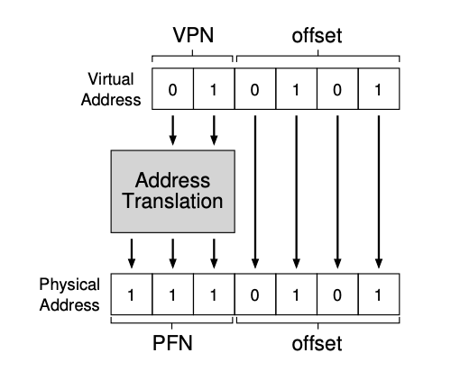
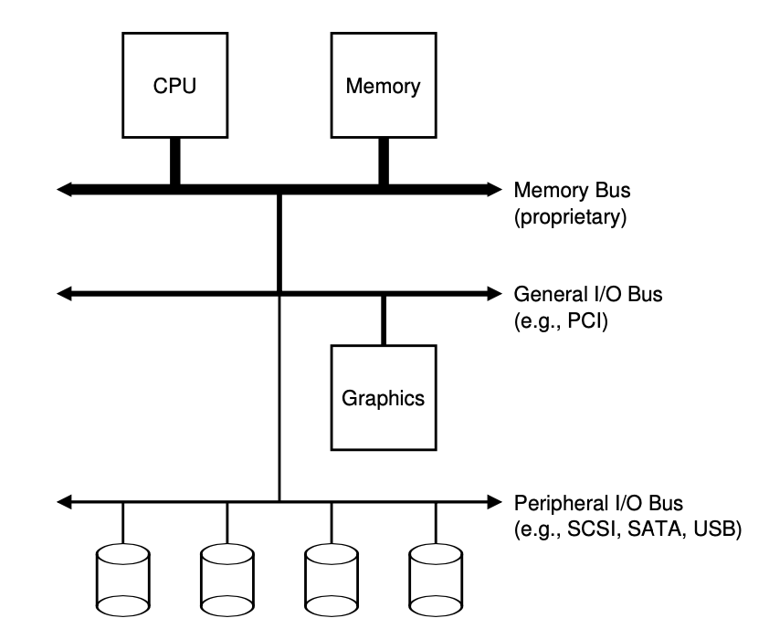
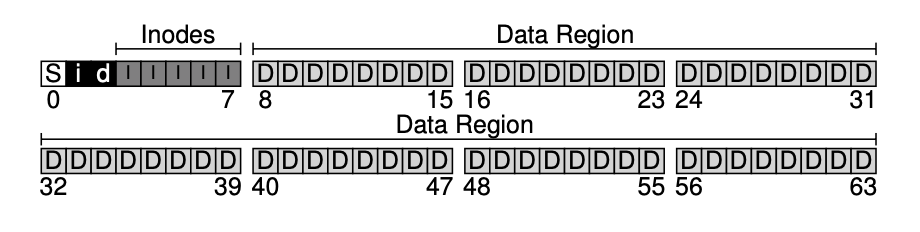

# CS-323 Summary OSTEP

> This summary was based on the [OSTEP book](http://pages.cs.wisc.edu/~remzi/OSTEP/)

[TOC]

## INTRODUCTION

### Virtualizing the CPU

It turns out that the operating system, with some help from the hardware, is in charge of an **illusion**, i.e., the illusion that the system has a very large number of virtual CPUs. Turning a single CPU (or small set of them) into a seemingly infinite number of CPUs and thus allowing many programs to seemingly run at once is what we call **virtualizing the CPU**. If two programs want to run at a particular time, which *should* run? This question is answered by a **policy** of the OS; policies are used in many different places within an OS to answer these types of questions, and thus we will study them as we learn about the basic **mechanisms** that operating systems implement.

### Virtualizing the memory

The OS is **virtualizing memory** : each process accesses its own private **virtual address space** (sometimes just called its **address space**), which the OS somehow maps onto the physical memory of the machine. A memory reference within one running program does not affect the address space of other processes (or the OS itself); as far as the running program is concerned, it has physical memory all to itself. The reality, however, is that physical memory is a shared resource, managed by the operating system. Exactly how all of this is accomplished is also the subject of the first part of this book, on the topic of **virtualization**.

### Concurrency

Another main theme of this book is **concurrency**. We use this conceptual term to refer to a host of problems that arise, and must be addressed, when working on many things at once (i.e., concurrently) in the same program. The problems of concurrency arose first within the operating system itself; the OS is juggling many things at once, first running one process, then another, and so forth. As it turns out, doing so leads to some deep and interesting problems.

### Persistence

The third major theme of the course is **persistence**. In system memory, data can be easily lost, as devices such as DRAM store values in a **volatile** manner; when power goes away or the system crashes, any data in memory is lost. Thus, we need hardware and software to be able to store data **persistently**; such storage is thus critical to any system as users care a great deal about their data.


## VIRTUALISATION

### Process

The definition of a process, informally, is quite simple: it is a **running program**. It turns out that one often wants to run more than one program at once; for example, consider your desktop or laptop where you might like to run a web browser, mail program, a game, a music player, and so forth. In fact, a typical system may be seemingly running tens or even hundreds of processes at the same time. Doing so makes the system easy to use, as one never need be concerned with whether a CPU is available; one simply runs programs.

> **THE CRUX OF THE PROBLEM: HOW TO PROVIDE THE ILLUSION OF MANY CPUS?**
>
> Although there are only a few physical CPUs available, how can the OS provide the illusion of a nearly-endless supply of said CPUs?

The OS creates this illusion by **virtualizing** the CPU. By running one process, then stopping it and running another, and so forth, the OS can promote the illusion that many virtual CPUs exist when in fact there is only one physical CPU (or a few). This basic technique, known as **time sharing** of the CPU.

**Mechanisms** are low-level methods or protocols that implement a needed piece of functionality (e.g. context switch). On top of these mechanisms resides some of the intelligence in the OS, in the form of **policies**. Policies are algorithms for making some kind of decision within the OS. For example, given a number of possible programs to run on a CPU, which program should the OS run (scheduling policies) ?


One obvious component of machine state that comprises a process is its *memory*. Instructions lie in memory; the data that the running program reads and writes sits in memory as well. Thus the memory that the process can address (called its **address space**) is part of the process. Also part of the process’s machine state are *registers*; many instructions explicitly read or update registers and thus clearly they are important to the execution of the process.


One mystery that we should unmask a bit is how programs are transformed into processes. The first thing that the OS must do to run a program is to **load** its code and any static data (e.g., initialized variables) into memory, into the address space of the process. Programs initially reside on **disk** in some kind of **executable format**. Then some memory must be allocated for the program’s **run-time stack** (or just **stack**). The OS may also create some initial memory for the program’s **heap**. In C programs, the heap is used for explicitly requested dynamically-allocated data; programs request such space by calling `malloc()` and free it explicitly by calling `free()`. Finally, the OS starts the program running at the entry point, namely `main()`.


A process can be in one of three **states** : 

- **Running**: In the running state, a process is running on a processor. This means it is executing instructions.
- **Ready**: In the ready state, a process is ready to run but for some reason the OS has chosen not to run it at this given moment.
- **Blocked**: In the blocked state, a process has performed some kind of operation that makes it not ready to run until some other event takes place. A common example: when a process initiates an I/O request to a disk, it becomes blocked and thus some other process can use the processor.


Interlude : process API : in this interlude, we discuss process creation in UNIX systems. UNIX presents one of the most intriguing ways to create a new process with a pair of system calls: `fork()` and `exec()`. A third routine, `wait()`, can be used by a process wishing to wait for a process it has created to complete :

- The `fork()` system call is used to create a new process. When the process calls the `fork()` system call, the process that is created is an (almost) *exact copy of the calling process*. That means that to the OS, it now looks like there are two copies of the program running, and both are about to return from the `fork()` system call. The newly-created process (called the **child**, in contrast to the creating **parent**). While the parent receives the **PID** (**process identifier** that you can get using `getpid()`) of the newly-created child, the child is simply returned a 0. This differentiation is useful, because it is simple then to write the code that handles the two different cases. Note that the output is not **deterministic**.

- Sometimes, as it turns out, it is quite useful for a parent to wait for a child process to finish what it has been doing. This task is accomplished with the `wait()` system call (or its more complete sibling `waitpid()`)

- `exec()` is useful when you want to run a program that is different from the calling program. Given the name of an executable, and some arguments, it **loads** code (and static data) from that executable and overwrites its current code segment (and current static data) with it; the heap and stack and other parts of the memory space of the program are reinitialized. Then the OS simply runs that program, passing in any arguments as the argv of that process. Thus, it does *not* create a new process; rather, it transforms the currently running program into a different running program. After the `exec()` in the child, it is almost as if the program corresponding to the parent code never ran; a successful call to `exec()` never returns.

Here's an example of the 3 system calls combined :

```c
#include <stdio.h>
#include <stdlib.h>
#include <unistd.h>
#include <string.h>
#include <sys/wait.h>

int main(int argc, char *argv[]) {
	printf("hello world (pid:%d)\n", (int) getpid());
	int rc = fork();
	
  if (rc < 0) { // fork failed; exit
		fprintf(stderr, "fork failed\n"); exit(1);
	
  } else if (rc == 0) { // child (new process)
		printf("hello, I am child (pid:%d)\n", (int) getpid());
		char *myargs[3];
		myargs[0] = strdup("wc"); // program: "wc" (word count)
		myargs[1] = strdup("p3.c"); // argument: file to count
		myargs[2] = NULL; // marks end of array
		execvp(myargs[0], myargs); // runs word count
		printf("this shouldn’t print out");
	
  } else { // parent goes down this path (main)
		int wc = wait(NULL);
		printf("hello, I am parent of %d (wc:%d) (pid:%d)\n", rc, wc, (int) getpid());
	}
	return 0;
}
```

```bash
prompt> ./p3
hello world (pid:29383) 
hello, I am child (pid:29384)
29 107 1030 p3.c
hello, I am parent of 29384 (wc:29384) (pid:29383)
```

---


### Mechanisms : LDE

In order to virtualize the CPU, the operating system needs to somehow share the physical CPU among many jobs running seemingly at the same time. The basic idea is simple: run one process for a little while, then run another one, and so forth. By **time sharing** the CPU in this manner, virtualization is achieved.

OS developers came up with a technique, which we call **limited direct execution**. The “direct execution” part of the idea is simple: just run the program directly on the CPU. Direct execution has the obvious advantage of being fast; the program runs natively on the hardware CPU and thus executes as quickly as one would expect. But running on the CPU introduces a problem: what if the process wishes to perform some kind of restricted operation, such as issuing an I/O request to a disk, or gaining access to more system resources such as CPU or memory?

Thus, the approach we take is to introduce a new processor mode, known as **user mode**; code that runs in user mode is restricted in what it can do. For example, when running in user mode, a process can’t issue I/O requests; doing so would result in the processor raising an exception; the OS would then likely kill the process. In contrast to user mode is **kernel mode**, which the operating system (or kernel) runs in. In this mode, code that runs can do what it likes, including privileged operations such as issuing I/O requests and executing all types of restricted instructions. We are still left with a challenge, however: what should a user process do when it wishes to perform some kind of privileged operation, such as reading from disk? To enable this, virtually all modern hardware provides the ability for user programs to perform a **system call**.

To execute a system call, a program must execute a special **trap** instruction. This instruction simultaneously jumps into the kernel and raises the privilege level to kernel mode; once in the kernel, the system can now perform whatever privileged operations are needed (if allowed), and thus do the required work for the calling process. When finished, the OS calls a special **return-from-trap** instruction, which returns into the calling user program while simultaneously reducing the privilege level back to user mode.

The next problem with direct execution is achieving a switch between processes. One approach is known as the **cooperative** approach. In this style, the OS *trusts* the processes of the system to behave reasonably. Processes that run for too long are assumed to periodically give up the CPU so that the OS can decide to run some other task (**yield**). Without some additional help from the hardware, it turns out the OS can’t do much at all when a process refuses to make system calls (or mistakes) and thus return control to the OS. The answer turns out to be simple: a **timer interrupt**. A timer device can be programmed to raise an interrupt every so many milliseconds; when the interrupt is raised, the currently running process is halted, and a pre-configured **interrupt handler** in the OS runs. At this point, the OS has regained control of the CPU, and thus can do what it pleases (e.g. stop the current process and start a different one).

Now that the OS has regained control, a decision has to be made: whether to continue running the currently-running process, or switch to a different one. This decision is made by a part of the operating system known as the **scheduler**. If the decision is made to switch, the OS then executes a low-level piece of code which we refer to as a **context switch**. A context switch is conceptually simple: all the OS has to do is save a few register values for the currently-executing process (onto its kernel stack, for example) and restore a few for the soon-to-be-executing process (from its kernel stack). By doing so, the OS thus ensures that when the return-from-trap instruction is finally executed, instead of returning to the process that was running, the system resumes execution of another process.

> **SUMMARY**
>
> We have described some key low-level mechanisms to implement CPU virtualization, a set of techniques which we collectively refer to as **limited direct execution**. The basic idea is straightforward: just run the program you want to run on the CPU, but first make sure to set up the hardware so as to limit what the process can do without OS assistance.
>
> This general approach is taken in real life as well with the concept of **baby proofing** a room: locking cabinets containing dangerous stuff and covering electrical sockets. When the room is thus readied, you can let your baby roam freely, secure in the knowledge that the most dangerous aspects of the room have been restricted. In an analogous manner, the OS “baby proofs” the CPU, by first (during boot time) setting up the trap handlers and starting an interrupt timer, and then by only running processes in a restricted mode. By doing so, the OS can feel quite assured that processes can run efficiently, only requiring OS intervention to perform privileged operations or when they have monopolized the CPU for too long and thus need to be switched out.

---


### Schedulers

#### Scheduling introduction

Let us quantify scheduling policies with a few metrics: **turnaround time**, the turnaround time of a job is defined as the time at which the job completes minus the time at which the job arrived in the system. 
$$
T_{turnaround} = T_{completion} - T_{arrival}
$$
**Response time** is defined as the time from when the job arrives in a system to the first time it is scheduled.
$$
T_{response} = T_{firstscheduled} - T_{arrival}
$$


The most basic algorithm a scheduler can implement is known as **First In, First Out** (**FIFO**) scheduling, this performs really poorly for different sized jobs (problem called the **convoy effect** (e.g. 3 jobs arrive at the same time, but the first one to get scheduled takes 1000x more time than the two others)) but is very simple to implement. 

**Shortest Job First** (**SJF**) runs the shortest job first, then the next shortest, and so on. This method performs badly if some short jobs arrive a fraction of a second after a long job (which thus will take priority).

>In the old days of batch computing, a number of **non-preemptive** schedulers were developed; such systems would run each job to completion before considering whether to run a new job. Virtually all modern schedulers are **preemptive**, and quite willing to stop one process from running in order to run another. This implies that the scheduler employs the mechanisms we learned about previously; in particular, the scheduler can perform a **context switch**, stopping one running process temporarily and resuming (or starting) another.

**Preemptive Shortest Job First** (**PSJF** – or shortest time-to-completion first (STCF)) : any time a new job enters the system, it determines of the remaining jobs and new job, which has the least time left, and then schedules that one. PSJF is not particularly good for response time but achieves great turnaround time.

**Round-Robin (RR)**: the basic idea is simple: instead of running jobs to completion, RR runs a job for a **time slice** (sometimes called a **scheduling quantum**) and then switches to the next job in the run queue. It repeatedly does so un- til the jobs are finished. This method is good response-time wise (the smaller the slice is, the smaller the response time will be).


Examples : 

- if 3 jobs taking $T=10$ time to complete arrive at time $T = 0$ in FIFO, then average turnaround is $(10+20+30)/3=20$
- if 3 jobs taking $T=10$ time to complete for two of them and $T=100$ for the third arrive at time $T = 0$ in FIFO, then (assuming the longest gets unluckily scheduled first) average turnaround is $(100+110+120)/3=110$
- if 3 jobs taking $T=10$ time to complete for two of them and $T=100$ for the third arrive at time $T = 0$ in SJF, then average turnaround is $(10+20+120)/3=50$
- if 1 job taking $T=100$ time to complete arrives at $T=0$ and 2 jobs taking $T=10$ time to complete arrive at $T=10$ in SJF, then average turnaround is $(100+100+110)/3=103.33$
- if 1 job taking $T=100$ time to complete arrives at $T=0$ and 2 jobs taking $T=10$ time to complete arrive at $T=10$ in PSJF, then average turnaround is $((120-0)+(20-10)+(30-10))/3=50$
- if 1 job taking $T=100$ time to complete arrives at $T=0$ and 2 jobs taking $T=10$ time to complete arrive at $T=10$ in PSJF, then average response time is $((0-0)+(10-10)+(20-10))/3=3.33$

> **SUMMARY**
>
> We have introduced the basic ideas behind scheduling and developed two families of approaches. The first runs the shortest job remaining and thus optimizes turnaround time; the second alternates between all jobs and thus optimizes response time. Both are bad where the other is good, alas, an inherent trade-off common in systems.

---


#### Multi-level feedback queue

The fundamental problem **Multi-level Feedback Queue** (**MLFQ**) tries to address is two-fold. First, it would like to optimize *turnaround time*, which  is done by running shorter jobs first; unfortunately, the OS doesn’t generally know how long a job will run for. Second, MLFQ would like to make a system feel responsive to interactive users (i.e., users sitting and staring at the screen, waiting for a process to finish), and thus minimize *response time*; unfortunately, algorithms like Round Robin reduce response time but are terrible for turnaround time. 

The MLFQ has a number of distinct **queues**, each assigned a different **priority level**. At any given time, a job that is ready to run is on a single queue. MLFQ uses priorities to decide which job should run at a given time: a job with higher priority (i.e., a job on a higher queue) is chosen to run. More than one job may be on a given queue, and thus have the same priority. In this case, we will just use round-robin scheduling among those jobs.

Thus, the key to MLFQ scheduling lies in how the scheduler sets priorities. Rather than giving a fixed priority to each job, MLFQ varies the priority of a job based on its observed behavior. If, for example, a job repeatedly relinquishes (yields) the CPU while waiting for input from the keyboard, MLFQ will keep its priority high, as this is how an interactive process might behave. If, instead, a job uses the CPU intensively for long periods of time, MLFQ will reduce its priority. In this way, MLFQ will try to *learn* about processes as they run, and thus use the history of the job to predict its future behavior.

Thus, we arrive at the first two basic rules for MLFQ:

- **Rule 1:** If `Priority(A) > Priority(B)`, A runs (and thus B doesn’t);
- **Rule 2:** If `Priority(A) == Priority(B)`, A & B run in RR.


We now must decide how MLFQ is going to change the priority level of a job (and thus which queue it is on) over the lifetime of a job. To do this, we must keep in mind our workload: a mix of interactive jobs that are short-running (and may frequently relinquish the CPU), and some longer-running “CPU-bound” jobs that need a lot of CPU time but where response time isn’t important. Here is our first attempt at a priority-adjustment algorithm:

- **Rule 3:** When a job enters the system, it is placed at the highest priority (the topmost queue);

- **Rule 4a:** If a job uses up an entire time slice while running, its priority is *reduced* (i.e., it moves down one queue);

- **Rule4b:** If a job gives up the CPU before the time slice is up, it stays at the same priority level.

You can hopefully understand one of the major goals of the algorithm: because it doesn’t know whether a job will be a short job or a long-running job, it first assumes it might be a short job, thus giving the job high priority. If it actually is a short job, it will run quickly and complete; if it is not a short job, it will slowly move down the queues, and thus soon prove itself to be a long-running more batch-like process. In this manner, MLFQ approximates SJF.


However, we have a few problems! First, there is the problem of **starvation**: if there are “too many” interactive jobs in the system, they will combine to consume all CPU time, and thus long-running jobs will never receive any CPU time (they **starve**). We’d like to make some progress on these jobs even in this scenario. Second, a smart user could rewrite their program to **game the scheduler**. Gaming the scheduler generally refers to the idea of doing something sneaky to trick the scheduler into giving you more than your fair share of the resource. The algorithm we have described is susceptible to the following attack: before the time slice is over, issue an I/O operation (to some file you don’t care about) and thus relinquish the CPU; doing so allows you to remain in the same queue, and thus gain a higher percentage of CPU time. When done right (e.g., by running for 99% of a time slice before relinquishing the CPU), a job could nearly monopolize the CPU. Finally, a program may change its behavior over time; what was CPU-bound may transition to a phase of interactivity. With our current approach, such a job would be out of luck and not be treated like the other interactive jobs in the system.

Let's try to come up with a solution to avoid starvation. The simple idea here is to periodically **boost** the priority of all the jobs in system. There are many ways to achieve this, but let’s just do something simple: throw them all in the topmost queue; hence, a new rule:

- **Rule 5:** After some time period $S$, move all the jobs in the system to the topmost queue.

Our new rule solves two problems at once. First, processes are guaranteed not to starve, and second, if a CPU-bound job has become interactive, the scheduler treats it properly once it has received the priority boost.


We now have one more problem to solve: how to prevent gaming of our scheduler ("allowed" by rules 4a and 4b)? The solution here is to perform better **accounting** of CPU time at each level of the MLFQ. Instead of forgetting how much of a time slice a process used at a given level, the scheduler should keep track; once a process has used its allotment, it is demoted to the next priority queue. Whether it uses the time slice in one long burst or many small ones does not matter. We thus rewrite Rules 4a and 4b to the following single rule:

• **Rule 4:** Once a job uses up its time allotment at a given level (regardless of how many times it has given up the CPU), its priority is reduced (i.e., it moves down one queue).


>The refined set of MLFQ rules are reproduced here for your viewing pleasure:
>
>- **Rule 1:** If `Priority(A) > Priority(B)`, A runs and B doesn’t;
>- **Rule 2:** If `Priority(A) == Priority(B)`, A & B run in RR;
>- **Rule 3:** When a job enters the system, it is placed at the highest priority;
>- **Rule 4:** Once a job uses up its time allotment at a given level (regardless of how many times it has given up the CPU), its priority is reduced (i.e., it moves down one queue);
>- **Rule 5:** After some time period $S$, move all the jobs in the system to the topmost queue.
>
>MLFQ is interesting because instead of demanding a priori knowledge of the nature of a job, it instead observes the execution of a job and prioritizes it accordingly. In this way, it manages to achieve the best of both worlds: it can deliver excellent overall performance (similar to SJF/STCF) for short-running interactive jobs, and is fair and makes progress for long-running CPU-intensive workloads. 

---


#### Completely fair schedulers

The idea is that each task runs in parallel and consumes equal CPU share. We calculate the time a process receives on an ideal processor (e.g. assume 4 processes are `ready`, then they would each receive $1/4$ of the CPU)

*Note* : On real hardware, we can run only a single task at once, so we have to introduce the concept of “**virtual runtime**.” The virtual runtime of a task specifies when its next timeslice would start execution on the ideal multi-tasking CPU described above. In practice, the virtual runtime of a task is its actual runtime normalized to the total number of running tasks.

We implement it keeping all processes in a red-black tree sorted by maximum execution time

---


#### Proportional-share schedulers

Proportional-share is based around a simple concept: instead of optimizing for turnaround or response time, a scheduler might instead try to guarantee that each job obtain a certain percentage of CPU time.

An excellent modern example of proportional-share scheduling is known as **lottery scheduling**. The basic idea is quite simple: every so often, hold a lottery to determine which process should get to run next; processes that should run more often should be given more chances to win the lottery. Underlying lottery scheduling is one very basic concept: **tickets**, which are used to represent the share of a resource that a process (or user or whatever) should receive. The percent of tickets that a process has repre- sents its share of the system resource in question.

Let’s look at an example. Imagine two processes, $A$ and $B$, and further that $A$ has 75 tickets while $B$ has only 25. Thus, what we would like is for $A$ to receive 75% of the CPU and $B$ the remaining 25%. Lottery scheduling achieves this probabilistically (but not deterministically) by holding a lottery every so often (say, every time slice). Holding a lottery is straightforward: the scheduler must know how many total tickets there are (in our example, there are 100). The scheduler then picks a winning ticket and the winning job gets scheduled.

:information_source: OSTEP book also covers **stride schedulers** very quickly in chapter 9.6

---


### Memory virtualization

#### Address spaces

:information_source: History of OS as a library and memory virtualisation in OSTEP chapters 13.1 and 13.2

The OS to creates an **easy to use** abstraction of physical memory: the **address space**, and it is the running program’s view of memory in the system. The address space of a process contains all of the memory state of the running program. For example, the **code** of the program (the instructions) have to live in memory somewhere, and thus they are in the address space. The program, while it is running, uses a **stack** and a **heap**. Of course, there are other things in there too (e.g., statically-initialized variables), but for now let us just assume those three components: code, stack, and heap.


Of course, when we describe the address space, what we are describing is the **abstraction** that the OS is providing to the running program. The program really isn’t in memory at physical addresses 0 through 16KB (for example); rather it is loaded at some arbitrary physical address(es). When the OS does this, we say the OS is **virtualizing memory**, because the running program thinks it is loaded into memory at a particular address (say 0) and has a potentially very large address space (say 32-bits or 64-bits); the reality is quite different. When, for example, process $A$ tries to perform a load at address 0 (which we will call a **virtual address**), somehow the OS, in tandem with some hardware support, will have to make sure the load doesn’t actually go to physical address 0 but rather to physical address 320KB (where $A$ is loaded into memory). This is the key to virtualization of memory, which underlies every modern computer system in the world.


Thus we arrive at the job of the OS in this set of notes: to virtualize memory. The OS will not only virtualize memory, though; it will do so with style. To make sure the OS does so, we need some goals to guide us. 

One major goal of a virtual memory (VM) system is **transparency**. The OS should implement virtual memory in a way that is invisible to the running program. Thus, the program shouldn’t be aware of the fact that memory is virtualized; rather, the program behaves as if it has its own private physical memory.

Another goal of VM is **efficiency**. The OS should strive to make the virtualization as efficient as possible, both in terms of time (i.e., not making programs run much more slowly) and space (i.e., not using too much memory for structures needed to support virtualization).

Finally, a third VM goal is **protection**. The OS should make sure to **protect** processes from one another as well as the OS itself from processes. When one process performs a load, a store, or an instruction fetch, it should not be able to access or affect in any way the memory contents of any other process or the OS itself (that is, anything outside its address space). Protection thus enables us to deliver the property of **isolation** among processes.


> **SUMMARY**
>
> We have seen the introduction of a major OS subsystem: virtual memory. The VM system is responsible for providing the illusion of a large, sparse, private address space to programs, which hold all of their instructions and data therein. The OS, with some serious hardware help, will take each of these virtual memory references, and turn them into physical addresses, which can be presented to the physical memory in order to fetch the desired information. The OS will do this for many processes at once, making sure to protect programs from one another, as well as pro- tect the OS.

---


#### Address translation

In virtualizing memory, we will pursue a similar strategy as LDE, attaining both efficiency and control while providing the desired virtualization. 

:information_source: Efficiency dictates that we make use of hardware support, which at first will be quite rudimentary (e.g., just a few registers) but will grow to be fairly complex (e.g., TLBs, page-table support, and so forth, as you will see). Control implies that the OS ensures that no application is allowed to access any memory but its own; thus, to protect applications from one another, and the OS from applications, we will need help from the hardware here too. Finally, we will need a little more from the VM system, in terms of flexibility; specifically, we’d like for programs to be able to use their address spaces in whatever way they would like.

The generic technique we will use, which you can consider an addition to our general approach of limited direct execution, is something that is referred to as **hardware-based address translation**, or just **address translation**. With address translation, the hardware transforms each memory access (e.g., an instruction fetch, load, or store), changing the **virtual** address provided by the instruction to a **physical** address where the desired information is actually located. Thus, on each and every memory reference, an address translation is performed by the hardware to redirect application memory references to their actual locations in memory.

Of course, the hardware alone cannot virtualize memory, as it just provides the low-level mechanism for doing so efficiently. The OS must get involved at key points to set up the hardware so that the correct translations take place; it must thus **manage memory**, keeping track of which locations are free and which are in use, and judiciously intervening to maintain control over how memory is used. Once again the goal of all of this work is to create a beautiful **illusion**: that the program has its own private memory, where its own code and data reside.


---


#### Dynamic (hardware-based) relocation

To gain some understanding of hardware-based address translation, we’ll first discuss its first incarnation. Introduced in the first time-sharing machines of the late 1950’s is a simple idea referred to as **base and bounds** (the technique is also referred to as **dynamic relocation**). 

Specifically, we’ll need two hardware registers within each CPU: one is called the **base** register, and the other the **bounds** (sometimes called a **limit** register). This base-and-bounds pair is going to allow us to place the address space anywhere we’d like in physical memory, and do so while ensuring that the process can only access its own address space. In this setup, each program is written and compiled as if it is loaded at address zero. However, when a program starts running, the OS decides where in physical memory it should be loaded and sets the base register to that value. Now, when any memory reference is generated by the process, it is **translated** by the processor in the following manner:

```
physical address = virtual address + base
```

Each memory reference generated by the process is a **virtual address**; the hardware in turn adds the contents of the base register to this address and the result is a **physical address** that can be issued to the memory system.

The processor will first check that the memory reference is within bounds to make sure it is legal. If a process generates a virtual address that is greater than the bounds, or one that is negative, the CPU will raise an exception, and the process will likely be terminated. The point of the bounds is thus to make sure that all addresses generated by the process are legal and within the “bounds” of the process. We should note that the base and bounds registers are hardware structures kept on the chip (one pair per CPU). Sometimes people call the part of the processor that helps with address translation the **memory management unit (MMU)**.


:exclamation: Example :exclamation: To understand this better, let’s trace through what happens when a single instruction is executed. Specifically, let’s look at one instruction from our earlier sequence:

```assembly
128: movl 0x0(%ebx), %eax
```

The program counter (PC) is set to 128; when the hardware needs to fetch this instruction, it first adds the value to the the base register value of 32 KB (32768) to get a physical address of 32896; the hardware then fetches the instruction from that physical address. Next, the processor begins executing the instruction. At some point, the process then issues the load from virtual address 15 KB, which the processor takes and again adds to the base register (32 KB), getting the final physical address of 47 KB and thus the desired contents.

Imagine a process with an address space of size 4 KB has been loaded at physical address 16 KB. Here are the results of a number of address translations (VA = virtual address, PA = physical address):

- VA 0 → PA 16 KB 
- VA 1KB → PA 17KB
- VA 3000 → PA 19384
- VA 4400 → Fault (out of bounds)


> **SUMMARY**
>
> In this chapter, we have extended the concept of limited direct execution with a specific mechanism used in virtual memory, known as **address translation**. With address translation, the OS can control each and every memory access from a process, ensuring the accesses stay within the bounds of the address space. 
>
> We have also seen one particular form of virtualization, known as base and bounds or dynamic relocation. Base-and-bounds virtualization is quite *efficient* (only a little bit of hardware logic need for base and bound registers). Base-and-bounds also offers *protection* (doesn't exceed the bounds).
>
> Unfortunately, this simple technique of dynamic relocation does have its inefficiencies. For example, the relocated process could be using physical memory from 32 KB to 48 KB; however, if the process stack and heap are not too big, all of the space between the two is simply wasted. This type of waste is usually called **internal fragmentation**.
>
> 
>
> :information_source: allocators generally follow one of these 3 policies:
>
> - first fit: find the first object in the list and split it
> - best fit: find the object that is closest to the size
> - worst fit: find the largest object and split it

---


#### Segmentation

So far we have been putting the entire address space of each process in memory. Sometimes, although the space between the stack and heap is not being used by the process, it is still taking up physical memory when we relocate the entire address space somewhere in physical memory; thus, the simple approach of using a base and bounds register pair to virtualize memory is wasteful.


To solve this problem, an idea was born, and it is called **segmentation**: instead of having just one base and bounds pair in our MMU, why not have a base and bounds pair per logical **segment** of the address space? A segment is just a contiguous portion of the address space of a particular length, and in our canonical address space, we have three logically-different segments: code, stack, and heap. What segmentation allows the OS to do is to place each one of those segments in different parts of physical memory, and thus avoid filling physical memory with unused virtual address space. The hardware structure in our MMU required to support segmentation is just what you’d expect: in this case, a set of three base and bounds register pairs.


:information_source: What if we tried to refer to an illegal address? The hardware detects that the address is out of bounds, traps into the OS, likely leading to the termination of the offending process. And now you know the origin of the famous term that all C programmers learn to dread: the **segmentation violation** or **segmentation fault**.


> **SUMMARY**
>
> Segmentation solves a number of problems, and helps us build a more effective virtualization of memory. Beyond just dynamic relocation, segmentation can better support sparse address spaces, by avoiding the huge potential waste of memory between logical segments of the address space. It is also fast, as doing the arithmetic segmentation requires in hardware is easy and well-suited to hardware; the overheads of translation are minimal. A fringe benefit arises too: code sharing. If code is placed within a separate segment, such a segment could potentially be shared across multiple running programs.
>
> However, as we learned, allocating variable-sized segments in memory leads to some problems that we’d like to overcome. The first is **external fragmentation**. Because segments are variable-sized, free memory gets chopped up into odd-sized pieces, and thus satisfying a memory-allocation request can be difficult. The second and perhaps more important problem is that segmentation still isn’t flexible enough to support our fully generalized, **sparse address space**. For example, if we have a large but sparsely-used heap all in one logical segment, the entire heap must still reside in memory in order to be accessed.

---


#### Paging

Segmentation has some problems; in particular, managing free space becomes quite a pain as memory becomes fragmented and segmentation is not as flexible as we might like. Thus comes along the idea of **paging**: instead of splitting up our address space into three logical segments, we split up our address space into fixed-sized units we call a **page**. 


Paging has a number of advantages over our previous approaches. Probably the most important improvement will be flexibility: with a fully-developed paging approach, the system will be able to support the abstraction of an address space effectively, regardless of how the processes uses the address space. Another advantage is the simplicity of free-space management that paging affords. For example, when the OS wishes to place a 64-byte address space into an 8-page (also called page frames for physical memory) physical memory of 16B, it simply finds four free pages; perhaps the OS keeps a **free list** of all free pages for this, and just grabs the first four free pages off of this list.


To record where each virtual page of the address space is placed in physical memory, the operating system keeps a per-process data structure known as a **page table**. The major role of the page table is to store **address translations** for each of the virtual pages of the address space, thus letting us know where in physical memory they live. For example, we could have (VP = virtual page, PF = phyisical frame): VP 0 → PF 3, VP1 → PF7, and VP3 → PF2.


:exclamation: Example :exclamation: Let’s imagine the process with that tiny address space (64 bytes) is performing a memory access:

```assembly
movl <virtual address>, %eax
```

Specifically, let’s pay attention to the explicit load of the data at `<virtual address>` into the register `eax` (and thus ignore the instruction fetch that must have happened prior).

To translate this virtual address that the process generated, we have to first split it into two components: the **virtual page number (VPN)**, and the **offset** within the page. For this example, because the virtual address space of the process is 64 bytes, we need 6 bits total for our virtual address ($2^6=64$). The page size is 16 bytes in a 64-byte address space; thus we need to be able to select 4 pages, and the top 2 bits of the address do just that. Thus, we have a 2-bit virtual page number (VPN). The remaining bits tell us which byte of the page we are interested in, 4 bits in this case; we call this the offset.

When a process generates a virtual address, the OS and hardware must combine to translate it into a meaningful physical address. For example, let us assume the load above was to virtual address 21:

```assembly
movl 21, %eax
```

Turning “21” into binary form, we get “010101”, and thus we can examine this virtual address and see how it breaks down into a virtual page number (VPN) and offset:

Thus, the virtual address “21” is on the 5th (“0101”th) byte of virtual page “01” (or 1). With our virtual page number, we can now index our page table and find which physical page that virtual page 1 resides within. In the page table above the physical page number (PPN) (a.k.a. physical frame number or PFN) is 7 (binary 111). Thus, we can translate this virtual address by replacing the VPN with the PFN and then issue the load to physical memory. Note the offset stays the same, because the offset just tells us which byte within the page we want. Our final physical address is "1110101" (117 in decimal).



:information_source: the page table entry at index $i$ contains both the PFN of virtual page $i$ and additional bits

:information_source: from the exercises : $\text{# entries in the table } \times \text{PTE size} = \text{page size}$ (e.g. with 4KiB pages and 4B per PTE, we have 1024 entries)

:information_source: from exercises : we can't get the PTE size from those only two infos: number of bits in PA and page size (eventhough we can calculate the number of bits for PFN and estimate the PTE size based on PFN and metadata (additional bits))


Page tables can get awfully large, much bigger than the small segment table or base/bounds pair. A 20-bit VPN implies that there are $2^{20}$ translations that the OS would have to manage for each process (that’s roughly a million); assuming we need 4 bytes per **page table entry (PTE)** to hold the physical translation plus any other useful stuff, we get an immense 4MB of memory needed for each page table! That is pretty big. Now imagine there are 100 processes running: this means the OS would need 400MB of memory just for all those address translations! 

Because page tables are so big, we don’t keep any special on-chip hardware in the MMU to store the page table of the currently-running process. Instead, we store the page table for each process in memory somewhere.


Let’s talk a little about page table organization. The page table is just a data structure that is used to map virtual addresses (or really, virtual page numbers) to physical addresses (physical page numbers). Thus, any data structure could work. The simplest form is called a **linear page table**, which is just an array. The OS indexes the array by the VPN, and looks up the page-table entry (PTE) at that index in order to find the desired PFN. 

As for the contents of each PTE, we have a number of different bits in there worth understanding at some level.

- A **valid bit** is common to indicate whether the particular translation is valid.

- We also might have **protection bits**, indicating whether the page could be read from, written to, or executed from. Again, accessing a page in a way not allowed by these bits will generate a trap to the OS.

- A **present bit** indicates whether this page is in physical memory or on disk (swapped out).
- A **dirty bit** is also common, indicating whether the page has been modified since it was brought into memory.

- A **reference bit** (a.k.a. **accessed bit**) is sometimes used to track whether a page has been accessed, and is useful in determining which pages are popular and thus should be kept in memory; such knowledge is critical during **page replacement**.


> **SUMMARY**
>
> We have introduced the concept of **paging** as a solution to our challenge of virtualizing memory. Paging has many advantages over previous approaches (such as segmentation). First, it does not lead to external fragmentation, as paging (by design) divides memory into fixed-sized units. Second, it is quite flexible, enabling the sparse use of virtual address spaces.
>
> :warning: However, implementing paging support without care will lead to a slower machine (with many extra memory accesses to access the page table) as well as memory waste (with memory filled with page tables instead of useful application data) $\implies$ see later chapters for solutions.

---


#### TLBs

Using paging as the core mechanism to support virtual memory can lead to high performance overheads. By chopping the address space into small, fixed-sized units (i.e., pages), paging requires a large amount of mapping information. Because that mapping information is generally stored in physical memory, paging logically requires an extra memory lookup for each virtual address generated by the program. Going to memory for translation information before every instruction fetch or explicit load or store is prohibitively slow.


When we want to make things fast, the OS usually needs some help. And help often comes from the OS’s old friend: the hardware. To speed address translation, we are going to add what is called a **translation-lookaside buffer**, or **TLB**. A TLB is part of the chip’s **memory-management unit** (**MMU**), and is simply a hardware **cache** of popular virtual-to-physical address translations; thus, a better name would be an **address-translation cache**. Upon each virtual memory reference, the hardware first checks the TLB to see if the desired translation is held therein; if so, the translation is performed (quickly) without having to consult the page table (which has all translations). Because of their tremendous performance impact, TLBs in a real sense make virtual memory possible.


The algorithm the hardware follows works like this: first, extract the virtual page number (VPN) from the virtual address, and check if the TLB holds the translation for this VPN. If it does, we have a **TLB hit**, which means the TLB holds the translation. If the CPU does not find the translation in the TLB, it is called a **TLB miss**.

The TLB, like all caches, is built on the premise that in the common case, translations are found in the cache (i.e., are hits). If so, little overhead is added, as the TLB is found near the processing core and is designed to be quite fast. When a miss occurs, the high cost of paging is incurred; the page table must be accessed to find the translation, and an extra memory reference (or more, with more complex page tables) results. If this happens often, the program will likely run noticeably more slowly.


Who handles a TLB miss? Two answers are possible: the hardware, or the software (OS). In the olden days, the hardware would handle the TLB miss entirely. To do this, the hardware has to know exactly where the page tables are located in memory (via a **page-table base register**), as well as their exact format; on a miss, the hardware would “walk” the page table, find the correct page-table entry and extract the desired translation, update the TLB with the translation, and retry the instruction. More modern architectures have what is known as a **software-managed TLB**. On a TLB miss, the hardware simply raises an exception, raises the privilege level to kernel mode, and jumps to a **trap handler** (code withing OS that handles TLB misses). When run, the code will lookup the translation in the page table, update the TLB, and return from the trap; at this point, the hardware retries the instruction (resulting in a TLB hit).


Let’s look at the contents of the hardware TLB in more detail. A typical TLB might have 32, 64, or 128 fully associative entries. Basically, this just means that any given translation can be anywhere in the TLB, and that the hardware will search the entire TLB in parallel to find the desired translation. A typical TLB entry might look like this:

```
VPN | PFN | other bits
```

Note that both the VPN and PFN are present in each entry, as a translation could end up in any of these locations. More interesting are the “other bits”. For example, the TLB commonly has a **valid** bit, which says whether the entry has a valid translation or not. Also common are **protection** bits, which determine how a page can be accessed (as in the page table). For example, code pages might be marked *read and execute*, whereas heap pages might be marked *read and write*. There may also be a few other fields, including an **address-space identifier**, a **dirty bit**, and so forth.

---


#### Smaller tables

We could reduce the size of the page table in one simple way: use bigger pages. The major problem with this approach, however, is that big pages lead to waste *within* each page, a problem known as **internal fragmentation**.

Let's see an approach called **multi-level page table**. The basic idea behind a multi-level page table is simple. First, chop up the page table into page-sized units; then, if an entire page of page-table entries (PTEs) is invalid, don’t allocate that page of the page table at all. To track whether a page of the page table is valid (and if valid, where it is in memory), use a new structure, called the **page directory**. The page directory thus either can be used to tell you where a page of the page table is, or that the entire page of the page table contains no valid pages.


The page directory, in a simple two-level table, contains one entry per page of the page table. It consists of a number of **page directory entries** (**PDE**). A PDE (minimally) has a **valid bit** and a **page frame number** (PFN), similar to a PTE. However, the meaning of this valid bit is slightly different: if the PDE entry is valid, it means that at least one of the pages of the page table that the entry points to (via the PFN) is valid, i.e., in at least one PTE on that page pointed to by this PDE, the valid bit in that PTE is set to one. If the PDE entry is not valid (i.e., equal to zero), the rest of the PDE is not defined.

Multi-level page tables have some obvious advantages over approaches we’ve seen thus far. First, and perhaps most obviously, the multi-level table only allocates page-table space in proportion to the amount of address space you are using; thus it is generally compact and supports sparse address spaces. Second, if carefully constructed, each portion of the page table fits neatly within a page, making it easier to manage memory.

It should be noted that there is a cost to multi-level tables; on a TLB miss, two loads from memory will be required to get the right translation information from the page table (one for the page directory, and one for the PTE itself), in contrast to just one load with a linear page table. Thus, the multi-level table is a small example of a **time-space trade-off**.

---


#### Page-fault handler

Recall that with TLB misses, we have two types of systems: hardware-managed TLBs (where the hardware looks in the page table to find the desired translation) and software-managed TLBs ((not seen in summary) where the OS does). In either type of system, if a page is not present, the OS is put in charge to handle the page fault. The appropriately-named OS **page-fault handler** runs to determine what to do. 

If a page is not present and has been swapped to disk, the OS will need to swap the page into memory in order to service the page fault. Thus, a question arises: how will the OS know where to find the desired page? In many systems, the page table is a natural place to store such information. Thus, the OS could use the bits in the PTE normally used for data such as the PFN of the page for a disk address. When the OS receives a page fault for a page, it looks in the PTE to find the address, and issues the request to disk to fetch the page into memory.

When the disk I/O completes, the OS will then update the page table to mark the page as present, update the PFN field of the page-table entry (PTE) to record the in-memory location of the newly-fetched page, and retry the instruction which would find the translation in the TLB (assuming the TLB is informed when a new page is being swapped) and thus proceed to fetch the desired data or instruction from memory at the translated physical address.

Note that while the I/O is in flight, the process will be in the **blocked** state. Thus, the OS will be free to run other ready processes while the page fault is being serviced.


## CONCURRENCY

### Introduction

We introduce a new abstraction for a single running process: that of a **thread**. Instead of our classic view of a single point of execution within a program (i.e., a single PC where instructions are being fetched from and executed), a **multi-threaded** program has more than one point of execution (i.e., multiple PCs, each of which is being fetched and executed from). Perhaps another way to think of this is that each thread is very much like a separate process, except for one difference: they *share* the same address space and thus can access the same data.

Let's take the famous example of two threads incrementing a common variable 10 million times each. What we have demonstrated here is called a **race condition**: the results depend on the timing execution of the code. With some bad luck (i.e., context switches that occur at untimely points in the execution), we get the wrong result. In fact, we may get a different result each time; thus, instead of a nice **deterministic** computation, we call this result **indeterminate**, where it is not known what the output will be and it is indeed likely to be different across runs. Because multiple threads executing this code can result in a race condition, we call this code a **critical section**. A critical section is a piece of code that accesses a shared variable (or more generally, a shared resource) and must not be concurrently executed by more than one thread. What we really want for this code is what we call **mutual exclusion**. This property guarantees that if one thread is executing within the critical section, the others will be prevented from doing so.

What we will do is ask the hardware for a few useful instructions upon which we can build a general set of what we call **synchronization primitives**. By using these hardware synchronization primitives, in combination with some help from the operating system, we will be able to build multi-threaded code that accesses critical sections in a synchronized and controlled manner, and thus reliably produces the correct result despite the challenging nature of concurrent execution.

---


### Thread API

To use this API, include `<pthread.h>` and link the pthread library by adding `-pthread` flag

:warning: check for error code (e.g. `pthread_create`)!

The first thing you have to be able to do to write a multi-threaded program is to create new threads, and thus some kind of thread creation interface must exist. However, what happens if you want to wait for a thread to complete? You need to do something special in order to wait for completion; in particular, you must call the routine `pthread_join()`.

```c
int pthread_create(
  pthread_t* thread, const pthread_attr_t* attr, void* (*start_routine)(void*), void* arg
);

int pthread_join(pthread_t thread, void** value_ptr);
```

Beyond thread creation and join, probably the next most useful set of functions provided by the POSIX threads library are those for providing mutual exclusion to a critical section via **locks**. The most basic pair of routines to use for this purpose is provided by this pair of routines:

```c
int pthread_mutex_lock(pthread_mutex_t* mutex); 
int pthread_mutex_unlock(pthread_mutex_t* mutex);

// static initialisation
pthread_mutex_t lock = PTHREAD_MUTEX_INITIALIZER;

// dynamic initialisation
int rc = pthread_mutex_init(&lock, NULL); 
assert(rc == 0); // always check success!
```

The other major component of any threads library, and certainly the case with POSIX threads, is the presence of a **condition variable**. Condition variables are useful when some kind of signaling must take place between threads, if one thread is waiting for another to do something before it can continue. Two primary routines are used by programs wishing to interact in this way:

```c
int pthread_cond_wait(pthread_cond_t* cond, pthread_mutex_t* mutex); 
int pthread_cond_signal(pthread_cond_t* cond);
```

To use a condition variable, one has to in addition have a lock that is associated with this condition. When calling either of the above routines, this lock should be held. Here's a typical usage :

```c
pthread_mutex_t lock = PTHREAD_MUTEX_INITIALIZER; 
pthread_cond_t init = PTHREAD_COND_INITIALIZER;

// Thread 1 (waiting on thread 2 to complete smth):
pthread_mutex_lock(&lock); 
while (initialized == 0)
	pthread_cond_wait(&init, &lock);
pthread_mutex_unlock(&lock);

// Thread 2 :
pthread_mutex_lock(&lock); 
// Doing stuff ...
initialized = 1; 
pthread_cond_signal(&init); 
pthread_mutex_unlock(&lock);
```

Note that `pthread_cond_wait` releases the lock when putting a thread to sleep, but re-acquires the lock before returning after being woken up

---


### Locks

Programmers annotate source code with **locks**, putting them around critical sections, and thus ensure that any such critical section executes as if it were a single atomic instruction. To use a lock, we add some code around the critical section like this:

```c
lock_t mutex; // some globally-allocated lock ’mutex’
 // ...
lock(&mutex);
balance = balance + 1;
unlock(&mutex);
```

A lock is just a variable, and thus to use one, you must declare a **lock variable** of some kind (such as mutex above). This lock variable (or just “lock” for short) holds the state of the lock at any instant in time. It is either **available** (or **unlocked** or **free**) and thus no thread holds the lock, or **acquired** (or **locked** or **held**), and thus exactly one thread holds the lock and presumably is in a critical section.

Calling the routine `lock()` tries to acquire the lock; if no other thread holds the lock, the thread will acquire the lock and enter the critical section; this thread is sometimes said to be the **owner** of the lock. If another thread then calls `lock()` on that same lock variable (mutex in this example), it will not return while the lock is held by another thread. Once the owner of the lock calls `unlock()`, the lock is now available (free) again. If no other threads are waiting for the lock (i.e., no other thread has called `lock()` and is stuck therein), the state of the lock is simply changed to free. If there are waiting threads (stuck in `lock()`), one of them will (eventually) notice (or be informed of) this change of the lock’s state, acquire the lock, and enter the critical section.

:information_source: there are tree basic criterias for a lock evalutation: correctness (does the lock provide mutual exclusion), fairness, and performance (time overheads introduced by the lock?)

---


### Test-and-set & Compare-and-swap

What the **test-and-set instruction** does is as follows. It returns the old value pointed to by the ptr, and simultaneously updates said value to new. The key, of course, is that this sequence of operations is performed **atomically**. The reason it is called “test and set” is that it enables you to “test” the old value (which is what is returned) while simultaneously “setting” the memory location to a new value.

```c
// C pseudocode
int TestAndSet(int* ptr, int new) {
	int old = *ptr; // fetch old value at ptr 
  *ptr = new; // store ’new’ into ptr 
  return old; // return the old value
}
```

Another hardware primitive that some systems provide is known as the **compare-and-swap** instruction. The basic idea is for compare-and-swap to test whether the value at the address specified by ptr is equal to expected; if so, update the memory location pointed to by ptr with the new value. If not, do nothing. In either case, return the actual value at that memory location, thus allowing the code calling compare-and-swap to know whether it succeeded or not.

:information_source: compare-and-swap is a more powerful instruction than test-and-set

```c
// C pseudocode
int CompareAndSwap(int* ptr, int expected, int new) { 
  int actual = *ptr;
	if (actual == expected) *ptr = new;
  return actual;
}
```

---


### Condition variables

To wait for a condition to become true, a thread can make use of what is known as a **condition variable**. A **condition variable** is an explicit queue that threads can put themselves on when some state of execution (i.e., some **condition**) is not as desired (by **waiting** on the condition); some other thread, when it changes said state, can then wake one (or more) of those waiting threads and thus allow them to continue (by **signaling** on the condition).

To declare such a condition variable, one simply writes something like this: `pthread_cond_t c;`, which declares `c` as a condition variable (note: proper initialization is also required). A condition variable has two operations associated with it: `wait()` and `signal()`. The `wait()` call is executed when a thread wishes to put itself to sleep; the `signal()` call is executed when a thread has changed something in the program and thus wants to wake a sleeping thread waiting on this condition. Specifically, the POSIX calls look like this:

```c
pthread_cond_wait(pthread_cond_t* c, pthread_mutex_t* m); 
pthread_cond_signal(pthread_cond_t* c);
```

One thing you might notice about the `wait()` call is that it also takes a mutex as a parameter; it assumes that this mutex is locked when `wait()` is called. The responsibility of `wait()` is to release the lock and put the calling thread to sleep (atomically); when the thread wakes up (after some other thread has signaled it), it must re-acquire the lock before returning to the caller.

:information_source: When the parent spins on the lock due to a shared variable (instead of CV), it wastes CPU cyles. When using a CV, the parent thread will be put to sleep until the condition (e.g., the child is done executing) comes true. Thereafter, the OS can schedule a different thread to execute on the core, and the CPU cycles can be used for useful work.

:information_source: Always use `while` loops instead of `if` statements when waiting on condition variable! This way we avoid the producer/consumer**s** problem.

---


### Semaphores

A semaphore is as an object with an integer value that we can manipulate with two routines; in the POSIX standard, these routines are `sem_wait()` (decrement the value of semaphore by 1 and wait it if the resulting value of semaphore is negative (then try again when result not negative anymore)) and `sem_post()` (increment the value of the semaphore by 1 and if there are one or more threads waiting, wake one). Because the initial value of the semaphore determines its behavior, before calling any other routine to interact with the semaphore, we must first initialize it to some value using `sem_init()` (initializes a semaphore to the value provided as the third argument (in this example, `sem_init(&s, 0, 1)`, semaphore $s$ is initialized to the value 1).  Its second argument indicates that the semaphore is shared between threads in the same process). After a semaphore is initialized, we can call one of two functions to interact with it, `sem_wait()` or `sem_post()`.

We can see that `sem_wait()` will either return right away (because the value of the semaphore was one or higher when we called `sem_wait()`), or it will cause the caller to suspend execution waiting for a subsequent post. Of course, multiple calling threads may call into `sem_wait()`, and thus all be queued waiting to be woken.

Second, we can see that `sem_post()` does not wait for some particular condition to hold like `sem_wait()` does. Rather, it simply increments the value of the semaphore and then, if there is a thread waiting to be woken, wakes one of them up.


## PERSISTENCE

### I/O Devices

To begin our discussion, let’s look at the structure of a typical system. The picture shows a single CPU attached to the main memory of the system via some kind of **memory bus** or interconnect. Some devices are connected to the system via a general **I/O bus**, which in many modern systems would be **PCI** (or one if its many derivatives); graphics and some other higher-performance I/O devices might be found here. Finally, even lower down are one or more of what we call a **peripheral bus**, such as **SCSI**, **SATA**, or **USB**. These connect the slowest devices to the system, including **disks**, **mice**, and other similar components.




Let us now look at a canonical device (not a real one), and use this device to drive our understanding of some of the machinery required to make device interaction efficient. A device has two important components. The first is the hardware **interface** it presents to the rest of the system. Just like a piece of software, hardware must also present some kind of interface that allows the system software to control its operation. Thus, all devices have some specified interface and protocol for typical interaction. The second part of any device is its **internal structure**. This part of the device is implementation specific and is responsible for implementing the abstraction the device presents to the system.


In the picture above, the (simplified) device interface is comprised of three registers: a **status** register, which can be read to see the current st tus of the device; a **command** register, to tell the device to perform a certain task; and a **data** register to pass data to the device, or get data from the device. By reading and writing these registers, the operating system can control device behavior.


The invention that many engineers came upon years ago to improve this interaction is something we’ve seen already: the **interrupt**. Instead of polling the device repeatedly, the OS can issue a request, put the calling process to sleep, and context switch to another task. When the device is finally finished with the operation, it will raise a hardware interrupt, causing the CPU to jump into the OS at a pre-determined **interrupt service routine (ISR)** or more simply an **interrupt handler**. Interrupts thus allow for **overlap** of computation and I/O, which is key for improved utilization.

Note that using interrupts is not always the best solution. Switching to another process, handling the interrupt, and switching back to the issuing process is expensive. Thus, if a device is fast, it may be best to poll; if it is slow, interrupts, which allow overlap, are best. If the speed of the device is not known, or sometimes fast and sometimes slow, it may be best to use a **hybrid** that polls for a little while and then, if the device is not yet finished, uses interrupts.

Another interrupt-based optimization is **coalescing**. In such a setup, a device which needs to raise an interrupt first waits for a bit before delivering the interrupt to the CPU. While waiting, other requests may soon complete, and thus multiple interrupts can be coalesced into a single interrupt delivery.


Unfortunately, there is one other aspect of our canonical protocol that requires our attention. In particular, when using **programmed I/O** (**PIO**) to transfer a large chunk of data to a device, the CPU is once again over-burdened with a rather trivial task, and thus wastes a lot of time and effort that could better be spent running other processes.

The solution to this problem is something we refer to as **Direct Memory Access (DMA)**. A DMA engine is essentially a very specific device within a system that can orchestrate transfers between devices and main memory without much CPU intervention. To transfer data to the device, the OS would program the DMA engine by telling it where the data lives in memory, how much data to copy, and which device to send it to. At that point, the OS is done with the transfer and can proceed with other work. When the DMA is complete, the DMA controller raises an interrupt, and the OS thus knows the transfer is complete.


How does the OS communicates with the device? Over time, two primary methods of device communication have developed. The first, oldest method is to have explicit **I/O instructions**. These instructions specify a way for the OS to send data to specific device registers. Such instructions are usually **privileged**. The OS controls devices, and the OS thus is the only entity allowed to directly communicate with them. Imagine if any program could read or write the disk...

The second method to interact with devices is known as **memory-mapped I/O**. With this approach, the hardware makes device registers available as if they were memory locations. To access a particular register, the OS issues a load (to read) or store (to write) the address; the hardware then routes the load/store to the device instead of main memory.


How to a build a device-neutral OS (for example, we'd like the file system to be relatively oblivious to the difference between fetching from disk, a USB, IDE disks, etc.) ? The problem is solved through **abstraction**. At the lowest level, a piece of software in the OS must know in detail how a device works. We call this piece of software a **device driver**, and any specifics of device interaction are encapsulated within.

Note that such encapsulation can have its downside as well. For example, if there is a device that has many special capabilities, but has to present a generic interface to the rest of the kernel, those special capabili- ties will go unused.


> **SUMMARY**
>
> You should now have a very basic understanding of how an OS interacts with a device. Two techniques, the interrupt and DMA, have been introduced to help with device efficiency, and two approaches to accessing device registers, explicit I/O instructions and memory-mapped I/O, have been described.

---


### Hard disk drives

These drives have been the main form of persistent data storage in computer systems for decades and much of the development of file system technology is based on their behavior.


The basic interface for all modern drives is straightforward. The drive consists of a large number of sectors (512-byte blocks), each of which can be read or written. The sectors are numbered from $0$ to $n − 1$ on a disk with $n$ sectors. Thus, we can view the disk as an array of sectors; $0$ to $n − 1$ is thus the **address space** of the drive. Multi-sector operations are possible; indeed, many file systems will read or write 4KB at a time (or more). However, when updating the disk, the only guarantee drive manufactures make is that a single 512- byte write is **atomic**; thus, if an untimely power loss occurs, only a portion of a larger write may complete (sometimes called a **torn write**).

There are some assumptions most clients of disk drives make. Specifically, one can usually assume that accessing two blocks that are near one-another within the drive’s address space will be faster than accessing two blocks that are far apart. One can also usually assume that accessing blocks in a contiguous chunk is the fastest access mode, and usually much faster than any more random access pattern.

---


#### Geometry

Let’s start to understand some of the components of a modern disk. We start with a **platter**, a circular hard surface on which data is stored persistently by inducing magnetic changes to it. A disk may have one or more platters; each platter has 2 sides, each of which is called a **surface**. These platters are usually made of some hard material (such as aluminum), and then coated with a thin magnetic layer that enables the drive to persistently store bits even when the drive is powered off.

The platters are all bound together around the **spindle**, which is connected to a motor that spins the platters around at a constant rate. The rate of rotation is often measured in **rotations per minute (RPM)**, and typical modern values are in the 7,200 RPM to 15,000 RPM range. Note that we will often be interested in the time of a single rotation, e.g., a drive that rotates at 10,000 RPM means that a single rotation takes about 6 milliseconds.

Data is encoded on each surface in concentric circles of sectors; we call one such concentric circle a **track**. A single surface contains many thousands and thousands of tracks, tightly packed together, with hundreds of tracks fitting into the width of a human hair. To read and write from the surface, we need a mechanism that allows us to either sense (i.e., read) the magnetic patterns on the disk or to induce a change in (i.e., write) them. This process of reading and writing is accomplished by the **disk head**; there is one such head per surface of the drive. The disk head is attached to a single **disk arm**, which moves across the surface to position the head over the desired track.


Let’s understand how disks work by building up a model one track at a time. Assume we have a simple disk with a single track. This track has just 12 sectors, each of which is 512 bytes in size. The single platter we have here rotates around the spindle, to which a motor is attached. Of course, the track by itself isn’t too interesting; we want to be able to read or write those sectors, and thus we need a disk head, attached to a disk arm. In the figure, the disk head, attached to the end of the arm, is posi- tioned over sector 6, and the surface is rotating counter-clockwise.


Imagine we now receive a request to read block 0. How should the disk service this request? In our simple disk, the disk doesn’t have to do much. In particular, it must just wait for the desired sector to rotate under the disk head. The wait is called the **rotational delay** (or **single-track latency**).

Modern disks have many millions tracks. Let’s thus look at ever-so-slightly more realistic disk surface, this one with three tracks (on the left).


To understand how the drive might access a given sector, we now trace what would happen on a request to a distant sector, e.g., a read to sector 11. To service this read, the drive has to first move the disk arm to the cor- rect track (in this case, the outermost one), in a process known as a **seek**. Seeks, along with rotations, are one of the most costly disk operations. After the seek, the disk arm has positioned the head over the right track (on the right).

During the seek, the arm has been moved to the desired track, and the platter of course has rotated (maybe not fully). When sector 11 passes under the disk head, the final phase of I/O will take place, known as the **transfer**, where data is either read from or written to the surface. And thus, we have a complete picture of I/O time: first a seek, then waiting for the rotational delay, and finally the transfer.
$$
T_{I/O} = T_{seek} + T_{rotation} + T_{transfer}
$$
We may also calculate the **I/O rate** the following way:
$$
R_{I/O} = Size_{transfer}/ T_{I/O}
$$
:information_source: average seek time can be approximated to $1/3$ of maximum seek time. Average rotation time can be approximated to half the total time needed for a full rotation. 

---


#### Disk scheduler

Because of the high cost of I/O, the OS has historically played a role in deciding the order of I/Os issued to the disk. More specifically, given a set of I/O requests, the **disk scheduler** examines the requests and decides which one to schedule next. We can make a good guess at how long a “job” (i.e., disk request) will take. By estimating the seek and possible the rotational delay of a request, the disk scheduler can know how long each request will take, and thus (greedily) pick the one that will take the least time to service first. Thus, the disk scheduler will try to follow the **principle of SJF (shortest job first)** in its operation.


One early disk scheduling approach is known as **shortest-seek-time-first** (**SSTF**) (also called **shortest-seek-first** or **SSF**). SSTF orders the queue of I/O requests by track, picking requests on the nearest track to complete first. However, SSTF is not a panacea, for the following reasons. First, the drive geometry is not available to the host OS; rather, it sees an array of blocks. Fortunately, this problem is rather easily fixed. Instead of SSTF, an OS can simply implement **nearest-block-first** (**NBF**), which schedules the request with the nearest block address next. The second problem is more fundamental: **starvation**. Imagine in our example above if there were a steady stream of requests to the inner track, where the head currently is positioned. Requests to any other tracks would then be ignored completely by a pure SSTF approach.


The answer to this query is called **SCAN** (or **elevator**): simply move across the disk servicing requests in order across the tracks. Let us call a single pass across the disk a **sweep**. Thus, if a request comes for a block on a track that has already been serviced on this sweep of the disk, it is not handled immediately, but rather queued until the next sweep. Unfortunately, SCAN does not represent the best scheduling technology. It does not adhere as closely to the principle of SJF as itcould. In particular, it ignores rotation. **C-SCAN** is the same idea as SCAN, but resets the head to track 0 once it reached the end (instead of going back).


Let's discuss **shortest positioning time first** or **SPTF** scheduling (sometimes also called **shortest access time first** or **SATF**), which is the solution to our problem. On modern drives, as we saw above, both seek and rotation are roughly equivalent (depending, of course, on the exact requests), and thus SPTF is useful and improves performance. However, it is even more difficult to implement in an OS, which generally does not have a good idea where track boundaries are or where the disk head currently is (in a rotational sense).

---


#### Optimisations

Simple optimisations: 

- use a buffer (cache between the disk and the higher level of the OS keeps most recently used disk blocks around)
- Proactively fetches blocks that are likely accessed
- Keep track of dirty blocks that need to be written back

Another important related task performed by disk schedulers is **I/O merging**. For example, imagine a series of requests to read blocks 33, then 8, then 34. In this case, the scheduler should **merge** the requests for blocks 33 and 34 into a single two-block request; any reordering that the scheduler does is performed upon the merged requests. Merging is particularly important at the OS level, as it reduces the number of requests sent to the disk and thus lowers overheads.

One final problem that modern schedulers address is this: how long should the system wait before issuing an I/O to disk? One might naively think that the disk, once it has even a single I/O, should immediately issue the request to the drive; this approach is called **work-conserving**, as the disk will never be idle if there are requests to serve. However, research on **anticipatory disk scheduling** has shown that sometimes it is better to wait for a bit, in what is called a **non-work-conserving** approach. By waiting, a new and “better” request may arrive at the disk, and thus overall efficiency is increased.

---


### File systems

In this section, we add one more critical piece to the virtualization puzzle: **persistent storage**. A persisten storage device, such as a classic hard disk drive or a more modern solid-state storage device, stores informa- tion permanently (or at least, for a long time). Unlike memory, whose contents are lost when there is a power loss, a persistent-storage device keeps such data intact.


A **file** is simply a linear array of bytes, each of which you can read or write. Each file has some kind of low-level name called **inode number**. In most systems, the OS does not know much about the structure of the file (e.g., whether it is a picture, or a text file, or C code).

A **directory**, like a file, also has a low-level name (i.e., an inode number), but its contents are quite specific: it contains a list of $\text{(user-readable name, low-level name)}$ pairs (aka. typical filename maps to inode number). Each entry in a directory refers to either files or other directories. By placing directories within other directories, users are able to build an arbitrary **directory tree** (or **directory hierarchy**), under which all files and directories are stored.

The directory hierarchy starts at a **root directory** (in UNIX-based systems, the root directory is simply referred to as `/`) and uses some kind of **separator** (`/`) to name subsequent **sub-directories** until the desired file or directory is named.

---


#### FileSystem API

##### Creating and opening files

Creating a file can be accomplished with the *open* system call; by calling `open()` and passing it the `O_CREAT` flag, a program can create a new file. Here is some example code to create a file called “foo” in the current working directory.

```c
int fd = open("foo", O_CREAT | O_WRONLY | O_TRUNC);
```

The routine `open()` takes a number of different flags. In this example, the program creates the file (`O_CREAT`), can only write to that file while opened in this manner (`O_WRONLY`), and, if the file already exists, first truncate it to a size of zero bytes thus removing any existing content (`O_TRUNC`).

One important aspect of `open()` is what it returns: a **file descriptor**. A file descriptor is just an integer, private per process, and is used in UNIX systems to access files; thus, once a file is opened, you use the file de- scriptor to read or write the file.

:information_source: The older way of creating a file is to call `creat()`, e.g. `int fd = creat("foo");`


##### Reading and writing files

Let’s start by reading an existing file.

We’ll use an incredibly useful tool to trace the system calls made by a program. On Linux, the tool is called `strace` (`dtruss` on Mac OSX). What `strace` does is trace every system call made by a program while it runs, and dump the trace to the screen for you to see. Here's an example of the utilization:

```bash
prompt> strace cat foo
...
open("foo", O_RDONLY|O_LARGEFILE) 		= 3 
read(3, "hello\n", 4096) 							= 6 
write(1, "hello\n", 6) 								= 6 
hello
read(3, "", 4096) 										= 0 
close(3) 															= 0 
...
prompt>
```

Why does the first call to `open()` return 3, not 0 or perhaps 1 as you might expect? As it turns out, each running process already has three files open, standard input, standard output, and standard error. These are represented by file descriptors 0, 1, and 2, respectively. Thus, when you first open another file (as `cat` does above), it will almost certainly be file descriptor 3.

After the open succeeds, cat uses the `read()` system call to repeatedly read some bytes from a file. The first argument to `read()` is the file descriptor, thus telling the file system which file to read. The second argument points to a buffer where the result of the `read()` will be placed. The third argument is the size of the buffer, which in this case is 4 KB. The call to `read()` returns successfully as well, here returning the number of bytes it read.

At this point, you see another interesting result of the strace: a single call to the `write()` system call, to the file descriptor 1. This is used to write the word “hello” to the screen. But does it call `write()` directly? Maybe (if it is highly optimized). But if not, what `cat` might do is call the library routine `printf()`; internally, `printf()` figures out all the formatting details passed to it, and eventually calls `write()`.

The `cat` program then tries to read more from the file, but since there are no bytes left in the file, the `read()` returns 0 and the program knows that this means it has read the entire file. Thus, the program calls `close()` to indicate that it is done with the file “foo”, passing in the corresponding file descriptor.

Writing a file is accomplished via a similar set of steps. First, a file is opened for writing, then the `write()` system call is called, perhaps repeatedly for larger files, and then `close()`.


##### Reading and writing (not sequentially)

Thus far, we’ve discussed how to read and write files, but all access has been **sequential**; that is, we have either read a file from the beginning to the end, or written a file out from beginning to end.

Sometimes, however, it is useful to be able to read or write to a specific offset within a file. To do so, we will use the `lseek()` system call. Here is the function prototype:

```c
off_t lseek(int fildes, off_t offset, int whence);
```

The first argument is a file descriptor. The second argument is the offset, which positions the **file offset** to a particular location within the file. The third argument, called whence for historical reasons, determines exactly how the seek is performed.

For each file a process opens, the OS tracks a “current” offset, which determines where the next read or write will begin reading from or writing to within the file. Thus, part of the abstraction of an open file is that it has a current offset, which is updated in one of two ways. The first is when a read or write of $N$ bytes takes place, $N$ is added to the current offset; thus each read or write implicitly updates the offset. The second is explicitly with lseek, which changes the offset as specified above. Note that this call `lseek()` has nothing to do with the **seek** operation of a disk, which moves the disk arm.

`whence` may take mutliple values including `SEEK_SET` which sets the offset to given offset value, `SEEK_CUR` which sets the offset to current offset plus the given offset value, and `SEEK_END`  which sets offset to size off a file plus given offset value.

Upon successful completion, `lseek()` returns the resulting offset location as measured in bytes from the beginning of the file. Otherwise, a value of $-1$ is returned and `errno` is set to indicate the error.


##### Writing immediately with `fsync()`

The file system, for performance reasons, will **buffer** `write()`s in memory for some time; at that later point in time, the write(s) will actually be issued to the storage device.

However, some applications require something more than this eventual guarantee.

Most file systems provide some additional control APIs. In the UNIX world, the interface provided to applications is known as `fsync(int fd)`. When a process calls `fsync()` for a particular file descriptor, the file system responds by forcing all **dirty** (i.e., not yet written) data to disk, for the file referred to by the specified file descriptor. The `fsync()` routine returns once all of these writes are complete.

Here is a simple example of how to use `fsync()`. The code opens the file foo, writes a single chunk of data to it, and then calls `fsync()` to ensure the writes are forced immediately to disk. Once the `fsync()` returns, the application can safely move on, knowing that the data has been persisted.

```c
int fd = open("foo", O_CREAT | O_WRONLY | O_TRUNC); 
assert(fd > -1);
int rc = write(fd, buffer, size);
assert(rc == size);

rc = fsync(fd); 
assert(rc == 0);
```


##### Renaming files

When typing at the command line, renaming is accomplished with `mv` command:

```bash
prompt> mv foo bar
```

Using `strace`, we can see that `mv` uses the system call `rename(char *old, char *new)`, which takes precisely two arguments: the original name of the file and the new name.

One interesting guarantee provided by the `rename()` call is that it is (usually) implemented as an **atomic** call with respect to system crashes; if the system crashes during the renaming, the file will either be named the old name or the new name.

Imagine that you are using a file editor (e.g., emacs), and you insert a line into the middle of a file. What the editor does to guarantee that the new file has the original contents plus the line inserted is simple: write out the new version of the file under temporary name, force it to disk with `fsync()`, and then, when the application is certain the new file metadata and contents are on the disk, rename the temporary file to the original file’s name.


##### Getting information about files

Beyond file access, we expect the file system to keep a fair amount of information about each file it is storing. We generally call such data about files **metadata**. To see the metadata for a certain file, we can use `stat()` or `fstat()` system call. These calls take a pathname (or file descriptor) to a file and fill in a stat structure. 

There is a lot of information kept about each file, including its size (in bytes), its low-level name (i.e., inode number), some ownership information, and some information about when the file was accessed or modified, among other things. To see this information, you can use the command line tool `stat <file>`. As it turns out, each file system usually keeps this type of information in a structure called an **inode**.


##### Removing Files

You probably think: just run the program `rm`. But what system call does `rm` use to remove a file?

```bash
prompt> strace rm foo
...
unlink("foo") 								= 0 
...
```

`unlink()` just takes the name of the file to be removed, and returns zero upon success. But this leads us to a great puzzle: why is this system call named “unlink”? To understand the answer to this puzzle, we must first understand more than just files, but also directories.


##### Making Directories

Beyond files, a set of directory-related system calls enable you to make, read, and delete directories. Note you can never write to a directory directly; because the format of the directory is considered file system meta- data, you can only update a directory indirectly by, for example, creating files, directories, or other object types within it. 

To create a directory, a single system call, `mkdir()`, is available. The eponymous `mkdir` program can be used to create such a directory. 

```bash
prompt> strace mkdir foo ...
mkdir("foo", 0777)						= 0
...
prompt>
```

When such a directory is created, it is considered “empty”, although it does have a bare minimum of contents. Specifically, an empty directory has two entries: one entry that refers to itself, and one entry that refers to its parent. The former is referred to as the `.` (dot) directory, and the latter as `..` (dot-dot).


##### Reading directories

Now that we’ve created a directory, we might wish to read one too. Indeed, that is exactly what the program `ls` does.

Because directories are light on information (basically, just mapping the name to the inode number, along with a few other details), a program may want to call `stat()` on each file to get more information on each, such as its length or other detailed information. Indeed, this is exactly what ls does when you pass it the `-l` flag.


##### Deleting directories

Finally, you can delete a directory with a call to `rmdir()` (which is used by the program of the same name, `rmdir`). Unlike file deletion, however, removing directories is more dangerous, as you could potentially delete a large amount of data with a single command. Thus, `rmdir()` has the requirement that the directory be empty (i.e., only has `.` and `..` entries) before it is deleted.


##### Hard links

We now come back to the mystery of why removing a file is performed via `unlink()`, by understanding a new way to make an entry in the file system tree, through a system call known as `link()`. The `link()` system call takes two arguments, an old pathname and a new one; when you “link” a new file name to an old one, you essentially create another way to refer to the same file. The command-line program `ln` is used to do this, as we see in this example:

```bash
prompt> echo hello > file 
prompt> cat file
hello
prompt> ln file file2 
prompt> cat file2
hello
```

Here we created a file with the word “hello” in it, and called the file "file". We then create a hard link to that file using the `ln` program. After this, we can examine the file by either opening "file" or "file2".

The way link works is that it simply creates another name in the directory you are creating the link to, and refers it to the *same* inode number of the original file. The file is not copied in any way; rather, you now just have two human names (file and file2) that both refer to the same file.

:information_source: By passing the `-i` flag to `ls`, it prints out the inode number of each file (as well as the file name). And thus you can see what link really has done: just make a new reference to the same exact inode number.

By now you might be starting to see why `unlink()` is called `unlink()`. When you create a file, you are really doing two things. First, you are making a structure (the inode) that will track virtually all relevant infor- mation about the file, including its size, where its blocks are on disk, and so forth. Second, you are linking a human-readable name to that file, and putting that link into a directory.

After creating a hard link to a file, to the file system, there is no difference between the original file name (file) and the newly created file name (file2); indeed, they are both just links to the underlying metadata about the file.

```bash
prompt> rm file
removed ‘file’
prompt> cat file2
hello
```

Thus, to remove a file from the file system, we call `unlink()`. In the example above, we could for example remove the file named "file", and still access the file without difficulty:

The reason this works is because when the file system unlinks file, it checks a **reference count** within the inode number. This reference count (sometimes called the **link count**) allows the file system to track how many different file names have been linked to this particular inode. When `unlink()` is called, it removes the “link” between the human-readable name (the file that is being deleted) to the given inode number, and decrements the reference count; only when the reference count reaches zero does the file system also free the inode and related data blocks, and thus truly “delete” the file.

:information_source: You can see the reference count of a file using `stat()` of course.


##### Symbolic (soft) Links

There is one other type of link that is really useful, and it is called a **symbolic link** or sometimes a **soft link**. As it turns out, hard links are somewhat limited: you can’t create one to a directory (for fear that you will create a cycle in the directory tree); you can’t hard link to files in other disk partitions (because inode numbers are only unique within a particular file system, not across file systems); etc. Thus, a new type of link called the symbolic link was created.

To create such a link, you can use the same program `ln`, but with the `-s` flag. Here is an example:

```bash
prompt> echo hello > file 
prompt> ln -s file file2 # file2 is a soft link to file
prompt> cat file2
hello
```

Symbolic links are actually quite different from hard links. The first difference is that a symbolic link is actually a file itself, of a different type. We’ve already talked about regular files and directories; symbolic links are a third type the file system knows about. A `stat` on the symlink reveals all:

```bash
prompt> stat file
 ... regular file ...

prompt> stat file2
 ... symbolic link ...
```

Running `ls` also reveals this fact. If you look closely at the first character of the long-form of the output from `ls`, you can see that the first character in the left-most column is a `-` for regular files, a `d` for directories, and an `l` for soft links.

```bash
prompt> ls -al
drwxr-x---  2 remzi remzi   29 May 3 19:10 ./
drwxr-x--- 27 remzi remzi 4096 May 3 15:14 ../ 
-rw-r-----  1 remzi remzi    6 May 3 19:10 file 
lrwxrwxrwx  1 remzi remzi    4 May 3 19:10 file2 -> file
```

The reason that "file2" is 4 bytes is because the way a symbolic link is formed is by holding the pathname of the linked-to file as the data of the link file. Because we’ve linked to a file named "file", our link file "file2" is small (4 bytes). If we link to a longer pathname, our link file would be bigger:

```bash
prompt> echo hello > alongerfilename # len("alongerfilename") == 15
prompt> ln -s alongerfilename file3
prompt> ls -al alongerfilename file3
-rw-r----- 1 remzi remzi  6 May 3 19:17 alongerfilename 
lrwxrwxrwx 1 remzi remzi 15 May 3 19:17 file3 -> alongerfilename
```

Finally, because of the way symbolic links are created, they leave the possibility for what is known as a **dangling reference**:

```bash
prompt> echo hello > file 
prompt> ln -s file file2 
prompt> cat file2
hello

prompt> rm file
prompt> cat file2
cat: file2: No such file or directory
```

As you can see in this example, quite unlike hard links, removing the original file named file causes the link to point to a pathname that no longer exists.

---


#### FS implementation

The first thing we’ll need to do is divide the disk into **blocks**; simple file systems use just one block size (e.g. 4KiB). Thus, our view of the disk partition where we’re building our file system is simple: a series of blocks, each of size 4 KB. The blocks are addressed from 0 to $N − 1$, in a partition of size $N$ 4-KB blocks.

Let’s now think about what we need to store in these blocks to build a file system. Most of the space in any file system is user data. Let’s call the region of the disk we use for user data the **data region**, and, again for simplicity, reserve a fixed portion of the disk for these blocks, say the last 56 of 64 blocks (64 chosen for convience in the figures).

The file system has to track information about each file. This information is a key piece of **metadata**, and tracks things like which data blocks (in the data region) comprise a file, the size of the file, its owner and access rights, access and modify times, and other similar kinds of information. To store this information, file system usually have a structure called an **inode**. To accommodate inodes, we’ll need to reserve some space on the disk for them as well. Let’s call this portion of the disk the **inode table**, which simply holds an array of on-disk inodes. Thus, our on-disk image now looks like this picture, assuming that we use 5 of our 64 blocks for inodes (denoted by I’s in the diagram):


One primary component that is still needed is some way to track whether inodes or data blocks are free or allocated. Such **allocation structures** are thus a requisite element in any file system. Many allocation-tracking methods are possible. For example, we could use a **free list** that points to the first free block, which then points to the next free block, and so forth. We instead choose a simple and popular structure known as a **bitmap**, one for the data region (the **data bitmap**), and one for the inode table (the **inode bitmap**). A bitmap is a simple structure: each bit is used to indicate whether the corresponding object/block is free (0) or in-use (1). And thus our new on-disk layout, with an inode bitmap ($i$) and a data bitmap ($d$):


The first block is reserved for the **superblock**, denoted by an $S$ in the diagram below. The superblock contains information about this particular file system, including, for example, how many inodes and data blocks are in the file system (80 and 56, respectively in this instance), where the inode table begins (block 3), and so forth.




One of the most important on-disk structures of a file system is the **inode**; virtually all file systems have a structure similar to this. The name inode is short for **index node**. Each inode is implicitly referred to by a number (called the **inumber**), which we’ve earlier called the **low-level name** of the file. Given an i-number, you should directly be able to calculate where on the disk the corresponding inode is located. For example, take the inode table of vsfs as above: 20-KB in size (5 4-KB blocks) and thus consisting of 80 inodes (assuming each inode is 256 bytes); further assume that the inode region starts at 12KB (i.e, the superblock starts at 0KB, the inode bitmap is at address 4KB, the data bitmap at 8KB, and thus the inode table comes right after). In vsfs, we thus have the following layout for the beginning of the file system partition (in closeup view):


Inside each inode is virtually all of the information you need about a file: its type (e.g., regular file, directory, etc.), its size, the number of blocks allocated to it, protection information (such as who owns the file, as well as who can access it), some time information, including when the file was created, modified, or last accessed, as well as information about where its data blocks reside on disk (e.g., pointers of some kind). We refer to all such information about a file as **metadata**.

One of the most important decisions in the design of the inode is how it refers to where data blocks are. One simple approach would be to have one or more **direct pointers** (disk addresses) inside the inode; each pointer refers to one disk block that belongs to the file. Such an approach is limited: for example, if you want to have a file that is really big (e.g., bigger than the size of a block multiplied by the number of direct pointers), you are out of luck.


To support bigger files, file system designers have had to introduce different structures within inodes. One common idea is to have a special pointer known as an **indirect pointer**. Instead of pointing to a block that contains user data, it points to a block that contains more pointers, each of which point to user data. Thus, an inode may have some fixed number of direct pointers (e.g., 12), and a single indirect pointer. If a file grows large enough, an indirect block is allocated (from the data-block region of the disk), and the inode’s slot for an indirect pointer is set to point to it. Assuming that a block is 4KB and 4-byte disk addresses, that adds another 1024 pointers; the file can grow to be (12 + 1024) · 4K or 4144KB.

Not surprisingly, in such an approach, you might want to support even larger files. To do so, just add another pointer to the inode: the **double indirect pointer**. This pointer refers to a block that contains pointers to indirect blocks, each of which contain pointers to data blocks. A double indirect block thus adds the possibility to grow files with an additional 1024 · 1024 or 1-million 4KB blocks, in other words supporting files that are over 4GB in size. You may want even more, though, and we bet you know where this is headed: the **triple indirect pointer**.

Overall, this imbalanced tree is referred to as the **multi-level index** approach to pointing to file blocks. 

---


#### Crash consistency

One major challenge faced by a file system is how to update persistent data structures despite the presence of a **power loss** or **system crash**. Specifically, what happens if, right in the middle of updating on-disk structures, someone trips over the power cord and the machine loses power? Or the operating system encounters a bug and crashes? Because of power losses and crashes, updating a persistent data structure can be quite tricky, and leads to a new and interesting problem in file system implementation, known as the **crash-consistency problem**.


##### FSCK

Early file systems took a simple approach to crash consistency. Basically, they decided to let inconsistencies happen and then fix them later (when rebooting). A classic example of this lazy approach is found in a tool that does this: **fsck**. fsck is a UNIX tool for finding such inconsistencies and repairing them. Note that such an approach can’t fix all problems.

The tool fsck operates in a number of phases. It is run before the file system is mounted and made available; once finished, the on-disk file system should be consistent and thus can be made accessible to users. Here is a basic summary of what fsck does:

- Q: Two directory entries point to the same inode, link count is 1
- A: Update the link count to 2
- Q: Inode link count is 1 but no directory links this file
- A: Link the file in alost+found directory
- Q: A referenced block is marked as free in the bitmap
- A: Update the bitmap to 1
- Q: Two inodes reference the same data block
- A: Make a copy of the data block
- Q: An inode points to an inexistent block
- A: Remove the reference


As you can see, building a working fsck requires intricate knowledge of the file system. However, fsck (and similar approaches) have a bigger and perhaps more fundamental problem: they are *too slow*. With a very large disk volume, scanning the entire disk to find all the allocated blocks and read the entire directory tree may take many minutes or hours.

At a higher level, the basic premise of fsck seems just a tad irrational. Consider our example above, where just three blocks are written to the disk; it is incredibly expensive to scan the entire disk to fix prob- lems that occurred during an update of just three blocks.


##### Journaling

Probably the most popular solution to the consistent update problem is to steal an idea from the world of database management systems. That idea, known as **write-ahead logging**. In file systems, we usually call write-ahead logging **journaling** for historical reasons.

The basic idea is as follows. When updating the disk, before overwriting the structures in place, first write down a little note (somewhere else on the disk, in a well-known location) describing what you are about to do. Writing this note is the “write ahead” part, and we write it to a structure that we organize as a “log”; hence, write-ahead logging. By writing the note to disk, you are guaranteeing that if a crash takes places during the update (overwrite) of the structures you are updating, you can go back and look at the note you made and try again; thus, you will know exactly what to fix (and how to fix it) after a crash, instead of having to scan the entire disk. By design, journaling thus adds a bit of work during updates to greatly reduce the amount of work required during recovery.

:information_source: The end of the "Journaling" section is based on the slides instead of the book

**Goal**: limit the amount of required work after crash and get correct state, not just consistent state as fsck

**Strategy**: never delete (or overwrite) ANY old data until you have received confirmation that ALL new data is committed $\implies$ add redundancy to fix the problem with redundancy

**Example**: we want to update file $X$ with content $Y$ and thus update metadata $f(X)$ with $f(Y)$:

- Classic strategy: no matter if we start by overwriting data or metadata before, a crash in the middle is bad!

- Journaling strategy:

  - commit $Y$ and $f(Y)$ to the journal
  - update $X$ with $Y$ and update $f(X)$ with $f(Y)$
  - delete journal entries

  This method is resilient to crash in the middle (since journal allows recovery)

**Example** (atomic writes): write 10 to block 0 and 5 to block 1 atomically. Solution: add a valid bit (aka use journaling). Start by making a copy of the new values and set the valid bit to 1 once it's done. Copy values from the copies to the original block. Set valid bit to 0.


**Notes:**

- the extra blocks are called **journal**
- writes to the journal are called **journal transactions**
- the valid bit is called the **journal commit block**


**Possible optimizations:**

- small journals: 
  - problem: allocating a shadow (duplicate) block per data block is wasteful
  - solution: dedicate a few blocks for the journal (so that for example 3 changes can be written in one block instead of 3)
- write barriers ($\implies$ we can reorder blocks now): 
  - problem: enforcing total write order is costly (seek cost)
  - solution: only wait until blocks of writes have completed (instead of 1 write each time). This way, we have 3 "wait points":
    1. wait before journal commit (at this point, we know that all data blocks (new versions) were written)
    2. *wait after journal commit (at this point, we know that the journal was committed)* (we get rid of this one using checksums)
    3. wait after data blocks are written (at this point, we know that the original data blocks are updated, the journal can be safely be freed)
- checksums:
  - problem: can we get rid of the write barrier after journal commit?
  - solution: replace valid bit with checksum of written blocks
- circular journals: 
  - problem: after data is written to journal, there is no rush to update/write back (since journaled data can be recovered by definition)
  - solution: delay journaling for some time for better performance (keep journal transaction in circular buffer and flush when the buffer space is used up)
- logical journals: 
  - problem: appending a block to the file causes writes to the data block, the data inode and the data bitmap
  - solution: only write difference between old and new instead of full blocks in journal ($\approx$ `diff`)
- ordered journals: 
  - problem: can we avoid writing all data twice? 
  - solution: only store metadata in journal (write data to new block, store updates to metadata in logical journal, commit journal (and new data blocks), update metadata, free journal). Thus the data is directly updated in the actual block but the metadata is kept in the journal and then updated.
