# §[CS-330] Summary Intelligence artificielle

Aujourd'hui, on realise que les connaissances d'un système utilisant l'intelligence artificielle peuvent être **apprises** au lieu d'être codées par un humain. On pourrait implémenter les connaissances directement (par exemple au moyen de `if-else` statements); c'est très fastidieux et les ingénieurs ont besoin de maintenir le programme constamment.

La solution est d'utiliser une **représentation en calcul de prédicats**. Les **symboles** sont les objtets et paramètres et les **prédicats** sont les propriétés et realtions. On utilise ces building blocks pour créer des **expressions logiques** ($=$ **propositions**), e.g. *il-fait-beau*, *valeur(vitesse, 3.543)*. On peut aussi créer des **propositions composées** telles que $jeune(Jacques) \and vieux(Jean)$ ou $étudie(moi) \implies réussit(moi)$

Une **inférence** suit le schéma suivant: à partir d'un ensemble de propositions $\{P\}$, on trouve une nouvelle proposition $x$ tq. si toutes les propositions de $\{P\}$ sont vraies, $x$ le sera aussi. On note $\{P\} \vdash x$


## Moteurs d'inférence

Une **clause de Horn** est une clause (disjonction de littéraux) avec au maximum un littéral positif (non-negated)

### Sans variable

Un **moteur d'inférence** est un algorithme qui trouve des conséquences logiques $q$ d'un ensemble de prémisses $\{P\}$:
$$
\{P\} \vdash q
$$
Par exemple, avec les prémisses $lapin \implies animal$ et $animal \implies bouge$, le moteur pourrait inférer que $lapin \implies bouge$

Un algorithme est **fondé** si $q$ est toujours une conséquence de $\{P\}$ ou **complet** s'il trouve tous les $q$. Malheureusement, aucun algorithme n'est fondé et complet!


L'inférence est composé de trois étapes. Tout d'abord, on transforme les prémisses en leur **forme normale**. Il convient d'utiliser la **forme normale conjonctive**:
$$
\{P\} = a_1 \and a_2 \and ...
$$
On appelle $a_i$ des **clauses** qui sont soit une proposition simple ou une disjonction de propositions simples (e.g. $a_i = b_1 \or b_2 \or ...$). On représente une proposition simple par une liste commençant par le prédicat (e.g. $\mathbb{(oncle, Jacques, Charles)}$). On peut également représenter des propositions composées (e.g. $\mathbb{(AND, (jeune, Charles), (OR, exp1, exp2))}$ qui est $\mathbb{true}$ iff $exp1$ ou $exp2$ est vraie *et* Charles est jeune)

Exemples de transformations:
$$
v \and (d \or (y \and b)) 
\implies v \and (d \or y) \and (d \or b) 
\implies \mathbb{(AND, v, (OR, d, y), (OR, d, b))} \\

m \or (d \or (y \and b)) 
\implies (m \or d \or y) \and (m \or d \or b) 
\implies \mathbb{(AND, (OR, m, d, y), (OR, m, d, b))} \\

(e \and y) \or (\neg e \and (d \or y)) 
\implies (e \or \neg e) \and (e \or d \or y) \and (y \or \neg e) \and (y \or d \or y)
\implies (e \or d \or y) \and (y \or \neg e) \and (y \or d)
\implies \\ \mathbb{(AND, (OR, e, d, y), (OR, y, (NOT, e)), (OR, y, d))}
$$
Ensuite, pour résoudre l'inférence, on prend toutes nos propositions et on les met dans une base de données. On procède ensuite en simplifiant les propositions. Par exemple
$$
\begin{cases}
	p_1: & a_1 \or ... \or a_n \or X \\
	p_2: & b_1 \or ... \or b_m \or \neg X
\end{cases}

\implies

q: a_1 \or \ldots \or a_n \or b_1 \or \ldots \or b_m
$$


Exemple de preuve par contradiction. On veut prouver que si $lapin \implies animal$ et $animal \implies bouge$, alors $lapin \implies bouge$. On commence avec deux prémisses auxquels on ajoute la négation de ce que l'on veut prouver ($q$):
$$
\begin{cases}
	1. & \neg lapin \or animal & (= lapin \implies animal) \\
  2. & \neg animal \or bouge & (= animal \implies bouge) \\
  3. & lapin & (= \neg(\neg lapin \or bouge) = \neg(lapin \implies animal)) \\
  4. & \neg bouge
\end{cases}
$$
On simplifie $1.$ et $2.$ et on obtient
$$
\begin{cases}
  3. & lapin \\
  4. & \neg bouge \\
  5. & \neg lapin \or bouge
\end{cases}
$$
Puis on simplifie $4.$ et $5.$
$$
\begin{cases}
  3. & lapin \\
  6. & \neg lapin
\end{cases}
$$
Finalement, quand on résout $3.$ et $6.$, on obtient $lapin \and \neg lapin \implies \bot$ (symbol de contradiction). Donc $\neg q$ est faux


### Avec variable

Jusqu'à maintenat, on a vu du calcul de prédicat du 0ème ordre (e.g. $vole(Titi)$). On a aussi des prédicats du 1er ordre (e.g. $(\forall x) \space oiseau(x) \implies vole(x)$) ou du 2ème ordre (e.g. $(\forall p) \space p(Charles) \implies p(Pierre)$)

:information_source: Il n'existe pas d'algorithme d'inférence pour des prédicats du 2ème ordre!

On peut donc construire des expressions plus compliquées! Par exemple

- Tout le monde parle une langue: $(\forall x) \space personne(x) \implies (\exists y) \space (langue(y) \and parle(x, y))$
- Je n'ai aucun livre mince: $\neg (\exist x) (livre(x) \and possède(moi, x) \and mince(x))$

A noter que l'on peut transformer les quantificateurs suivant certaines règles

- $(\forall x) P(x) \iff (\forall y) P(y)$
- $(\exist x) P(x) \iff (\exist y) P(y)$
- $\neg(\forall x) P(x) \iff (\exist x) \neg P(x)$
- $\neg(\exist x) P(x) \iff (\forall x) \neg P(x)$
- $(\forall x)(P(x) \and Q(x)) \iff (\forall x) P(x) \and (\forall y) Q(y)$
- $(\exist x)(P(x) \or Q(x)) \iff (\exist x) P(x) \or (\exist y) Q(y)$

Pour transformer en forme normale, on essaie de supprimer les quantificateurs par des **fonctions de Skolem**. Par exemple, on transforme $(\forall x) [(\exist y) \space p(x,y)]$ en $(\forall x) \space p(x, f(x))$. On note les variables avec un "**?**" devant leur nom (ou alors, en minuscule et les constantes en majuscule). Par exemple, on transforme $(\forall x) \space personne(x) \implies (\exists y) \space (langue(y) \and parle(x, y))$ en $(\forall x) \space personne(x) \implies (langue(l(x)) \and parle(x, l(x)))$, puis finalement en $personne(?x) \implies langue(l(?x)) \and parle (?x, l(?x))$ avec $l(x)$ la fonction de Skolem.

On appelle **pattern** une expression avec variable et **datum** la même expression sans variable


## Système expert

Un **système expert** est un programme qui reproduit le raisonnement d'un expert. On continue de faire de l'inférence par modus ponant, par contre, on fait un *chaînage arrière*. C'est à dire que l'on commence par la solution (but) et l'on essaie de trouver les faits nécessaires. Le système maintient donc un agenda de buts

On peut voir le chaînage arrière comme une preuve par contradiction

Il est possible de combiner chaînage avant et arrière en faisant du chaînage arrière


Le monde n'est malheureusement pas parfait. Au lieu d'utiliser des booléens (vrai/faux) comme building block des faits, on utilise une variable correspondant à la probabilité d'être vraie. Ceci complique la logique de résolution (voir chapitre suivant)

Pour caractériser la "possibilité" (probabilité) de la manière la plus objective possible, on utilise les **facteurs de certitude** (**CF**). Les CFs sont compris entre $-1$ (certainement faux) et $1$ (certainement vrai). Le $0$ correspond à inconnu et, par exemple, la valeur $0.735$ correspondrait à un résultat $\pm$ probablement vrai. 

On peut ensuite calculer la CF de $X$ pour la règle $A \and B \and \ldots \implies X$ en utilisant la **règle de combinaison en série** :
$$
CF(X) = CF(règle) * \max(\min(CF(A), CF(B), \ldots), 0)
$$

On a aussi la **règle de combinaison en parallèle** pour combiner deux chemins d'inférence pour la même proposition $A$ (e.g. $CF(A)=x$ et $CF(A) = y$) :
$$
CF_{combine}(x, y)=
\begin{cases}
	x+y-xy 											& \text{si } x \ge 0, y \ge 0 \\
	x+y+xy 											& \text{si } x \lt 0, y \lt 0 \\
	\frac{x+y}{1-\min(|x|,|y|)} & \text{sinon}
\end{cases}
$$


## Réseaux bayesiens

Prenons l'exemple d'un système d'alarme qui se déclenche avec le M(ouvement), l'E(ntrée) et les V(itres). Le problème est que l'alarme peut-être déclenchée par les cambrioleurs mais aussi par les propriétaires (fausse alerte). On aimerait trouver une fonction d'alarme qui détecte les cambrioleurs mais pas les propriétaires

Nous modélisons ceci avec des facteurs de certitude:
$$
\begin{cases}
	M= \text{"Détecteur de mouvement enclenché"} & CF=1.0 \\
	R1: M \implies C = \text{"Cambrioleur présent"} & CF=0.1 \\
	R2: M \implies P = \text{"Propriétaire présent"} & CF=0.9
\end{cases}
$$
On rappelle que si $A \implies B$, alors $CF(B) = CF(A) * CF(Règle)$ où $Règle$ est la règle entre $A$ et $B$

Cependant, ce modèle a des lacunes. Par exemple, supposons que le propriétaire est enregistré à un autre endroit (propriétaire pas à la maison), alors on a $\neg P$ avec certitude, ce qui veut dire que $M \implies C >> 0.1$ (par exemple 99% que ce soit un cambrioleur). Il faut donc modéliser l'interdépendance de $P$ et $C$

Une autre lacune: supposons que nous savons qu'un cambrioleur est présent. Le détecteur sera sûrement déclenché ce qui implique (par $R2$) que c'est sûrement le propriétaire. Ca ne fait aucun sens! Encore une fois un problème d'interdépence


Logique probabiliste

On dénote $p(A)$ la probabilité que la proposition $A$ soit vraie et $P(A)$ la distribution $[p(A), p(\neg A)]$. On rappelle que $p(X|Y) = p(X, Y) \, / \, p(Y)$


Raisonnement bayesien

On définit le concept de **probabilité à priori** et **probabilité à postériori** (après une observation). Par exemple, s'il on a une probabilité à priori de 1% qu'il y ait un cambrioleur ($p_0(C) = 0.01$), alors on a
$$
\begin{cases}
	p(C|M) & = 0.18 \\
	p(C|\neg M) &= 0.0036
\end{cases}
$$
On calcule ces probabilités à postériori avec la **règle de Bayes**:
$$
p(P|M)=p_0(P) \, p(M|P) \, / \, p_0(M)
$$
On nomme $p(M|P)/p_0(M)$ l'**incertitude de l'inférence**

En sachant ceci, s'il on a $p(M)$ et la règle $M \implies C$, on peut calculer $p(C)$ de la manière suivante
$$
p(C) = p(C|M) \cdot p(M) + p(C | \neg M) \cdot p(\neg M)
$$


Prenons un exemple de chaînage d'inférences. On sait que $P(ropriétaire) \implies M(ouvement) \implies A(larme))$
$$
\begin{cases}
	P(P) & = [0.9, 0.1] \\
	P(M|P) & = [0.84, 0.16] \\
	P(M|\neg P) & = [0.06, 0.94] \\	
\end{cases}

\implies p(M)  =  p(M|P) \cdot p(P) + p(M|\neg P) \cdot p(\neg P) = 0.762
$$
De plus,
$$
\begin{cases}
	P(A|M) & = [1.0, 0.0] \\
	P(A| \neg M) & = [0.01, 0.99]
\end{cases}
\implies p(A) = 0.762 \cdot 1 + 0.238 \cdot 0.01 = 0.764
$$
Le problème, c'est qu'en utilisant un raisonnement similaire pour $P \implies M \implies C$, on trouve que $p(C)=13.8\%$, ce qui semble beaucoup trop élevé! Pour résoudre ce problème, on considère l'interdépendence entre $P, M$ et $C$
$$
\begin{align}
p(C) &= p(C|M, P) \cdot p(M, P)  \\
&+ p(C|\neg M, P) \cdot p(\neg M, P) \\
&+ p(C|M, \neg P) \cdot p(M, \neg P) \\
&+ p(C|\neg M, \neg P) \cdot p(\neg M, \neg P)
\end{align}
\\
p(C) = 0 \cdot 0.76 + 0 \cdot 0.14 + 0.99 \cdot 0.006 + 0.01 \cdot 0.094 = 0.00634
$$


Un **réseau bayesien** est un graphe dirigé qui montre les causalités

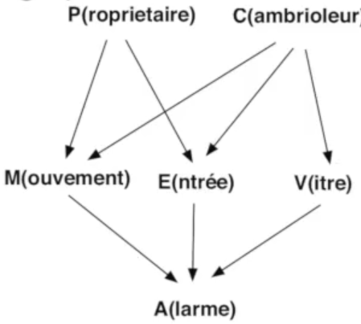

> > Semaine 4 : résumé fait jusqu'à 1h (1h/1h31)	


## Algorithmes de recherche

Avec
$$
\begin{cases}
a) & oiseau(Tweety) & (prémisse)\\
b) & vole(Tweety) & (conclusion)\\
c) & (\forall x) \space oiseau(x) \implies vole(x) & (modèle)
\end{cases}
$$
On se rappelle les trois types d'inférences

- déduction: $a), \space c) \rightarrow b)$
- induction: $a), \space b) \rightarrow c)$
- abduction: $b), \space c) \rightarrow a)$

L'abduction n'est valable que sous l'hypothèse du monde clos (e.g. on connait tout objet/animal qui peut voler)


Dans un graphe, pour trouver un chemin entre la node $A$ et la node $B$, on peut utiliser plusieurs algorithmes

### DFS

Expansion du premier noeud trouvé jusqu'à ce qu'il n'y ait plus de successeurs puis retour à un niveau supérieur et essai de la prochaine possibilité. Peu de mémoire est require (la liste des noeuds "ouverts" et les successeurs non explorés). La faiblesse de cette approche est que l'on peut chercher très loin dans un chemin totalement inutile

```pseudocode
Q = Noeud-initial
do {
	n = first(Q), Q = rest(Q)
	if (n est un noeud but) return n
	S = successeur(n)
	Q = append(S, Q) // S à la tête de la queue
} while Q != empty

return ECHEC
```

### BFS

Recherche par couche. BFS trouve toujours le chemin le plus court. Il exige beaucoup de mémoire (exponentiel) pour stocker toutes les alternatives à toutes les couches

L'algorithme du BFS est le même que DFS à part la ligne 6. On la remplacera par `Q = append(Q, S)`

### DLS

La rechcer en profondeur limitée (DLS) est l'algorithme DFS auquel on ajoute une profondeur maximale $l$ (pour tout noeud à profondeur $l$, on ne considère pas ses successeurs)

```pseudocode
depth-limit(Noeud-initial) = l
Q = Noeud-initial
do {
	n = first(Q), Q = rest(Q)
	if (n est un noeud but) return n
	S = successeur(n)
	for nn \in S do
		depth-limit(nn) = depth-limit(n) - 1
		if (depth-limit(nn) >= 0) then Q = append(nn, Q)
} while Q != empty

return ECHEC
```

Comment trouver la valeur $l$? On procède itérativement avec une valeur initiale (par exemple $l=2$). Si l'on ne trouve rien, on recommence avec $l += 1$

D'emblée cette solution semble très coûteuse (chaque étape refait les calculs de la précédente). Cependant, avec un petit peu de maths, on trouve que cela ne complique pas plus de deux fois la recherche où l'on aurait deviné la profondeur initiale parfaite

### DFS sans cycles

Une manière plus efficace du DFS est de détecter les cycles pour ne pas faire plusieurs fois les même calculs. Pour ce faire, on rajoute simplement une liste $C$ représentant la liste des noeuds déjà visités

### DFS shortest path

Quand un noeud but est trouvé, on mémoriser si son coût est meilleur que le meilleur trouvé. Si un noeud est trouvé mais à un coût supérieur au meilleur coût actuel, on ne génère pas ses successeurs (car cela ne pourrait qu'augmenter le coût)

```pseudocode
Q = Noeud-initial; cout = Infinity; solution = ECHEC
do {
	n = first(Q); Q = rest(Q)
	if (n est un noeud but) then
		if cout(n) < cout then { c = cout(n); solution = n }
  else
  	S = successeur(n)
		for m in S do
			if cout(m) < cout then Q = append(m, Q)
} while Q != empty

return solution
```

### Recherche heuristique $A^*$

On veut guider la recherche pour explorer d'abord les solutions prometteuses au moyen d'une fonction heuristique
$$
h(n) = \text{"estimation du coût minimal à partir du noeud n jusqu'à un noeud but"}
$$
Si $g(n)$ est le coût du chemin jusqu'au noeud $n$, alors la fonction $f(n)=g(n)+h(n)$ est une estimation du coût du chemin optimal passant par $n$. On veut donc privilégier l'exploration des noeuds dont la valeur de $f(n)$ est basse

```pseudocode
Q = Noeud-initial; C = empty
do {
	n = first(Q); Q = rest(Q)
	if ((n not in C) || (n === n_ in C tq. g(n) < g(n_))) then
		if (n est un noeud but) return n
		append(n, C)
		S = successeur(n)
		S = sort(S, f) // tri dans l'ordre croissant par rapport à f
		Q = merge(S, Q, f) // on intègre la queue triée dans Q (aussi triée)
} while Q != empty

return ECHEC
```

On peut montrer que $A^*$ trouve toujours la solution optimale tant que $h(n)$ ne sur-estime pas le vrai coût jusqu'au noeud final

La complexité de $A^*$ est la meilleure (si l'on choisit bien la fonction heuristique) des algorithmes que l'on a vu. On peut aussi appliquer des améliorations à l'algorithme $A^*$


Terminologie

Exemple d'un set de **conditions** entraînant une **conclusion** : `[('père', '?x', '?y'), ('père', '?z', '?x')]` alors `('grand-père', '?z', '?y')`. Le tout (conditions + conclusion) est appelé une **règle**

Un **fait** pourrait être (dans cet exemple) `('père', 'Jean', 'Paul')`


## Satisfaction de contraintes (PSC)

On peut prendre par exemple l'ordonnancement et la plannification de tâches: le but est de trouver un ensemble d'actions qui resepecte les contraintes décrivant le but à atteindre et les moyens à disposition (e.g. l'EPFL cherche a placer ses $N$ différents cours dans ses $M$ salles à disposition. Les cours commencent et finissent à une heure précise (ie. pas deux cours en même temps dans une salle) et certains cours ne peuvent être enseignés que dans certaines salles)

Formellement, on a:

- des variables $X = \{x_1, x_2, ..., x_n\}$
- des domaines $D_1, D_2, ..., D_n$ des variables
- des contraintes $C=\{c_1(x_k, x_l, ...), c_2, ..., c_m\}$

Le but et de trouver des solutions $\{x_2=v_k, x_2 = v_l, ..., x_n = v_o\}$ de sorte que toutes les contraintes soient satisfaites. Nous considérons des variables discrètes (i.e. les domaines sont finis). Un problème de satisfaction de contraintes binaires peut être représenté comme un graphe avec les noeuds  $\approx$ variables et les arcs $\approx$ contraintes

:information_source: Pour traiter des problèmes de contraintes non-binaires, on peut transformer le problème en un problème binaire au moyen de projections, variables supplémentaires, ou graphes dual. Ces méthodes ne seront pas vues dans ce cours


L'algorithme le plus général et le plus simple pour la résolution de PSC discret est celui de **generate-and-test** (essayer toutes les combinaisons de valeurs admissibles pour les variables en retenant celles qu irespectent toutes les contraintes). Sa complexité est en général exponentielle par rapport au nombre de variables

On voit maintenant des algorithmes adaptés pour résoudre des PSC. Pour la recherche systématique, on a le **backjumping**, le **forward checking**, et le **lookahead**. Pour les méthodes basées sur la recherche locale, on a le **recuit simulé**, le **GSAT**, et le **min-conflicts**.

Comme exmple, nous utiliserons le problème simple avec $d=[(B,C), (A,C),(B,C),(A,B)]$ avec des contraintes d'inégalité entre toutes les variables sauf $x_3$ et $x_4$:

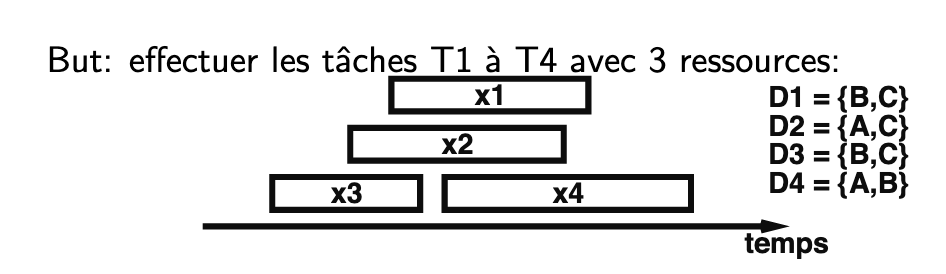


### Recherche systématique

On peut utiliser le principe de DFS pour améliorer le generate-and-test en transformant le problème en un arbre. A la profondeur $l=1$, on génère toutes les possibilités pour la première variable en laissant les autres libres. On continue avec $l=2$ et on s'arrête lorsque qu'une contradiction est atteinte. Cette méthode est toujours exponentielle, mais moins coûteuse

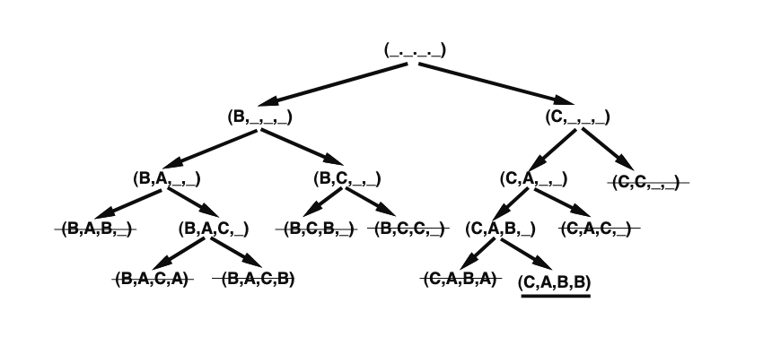

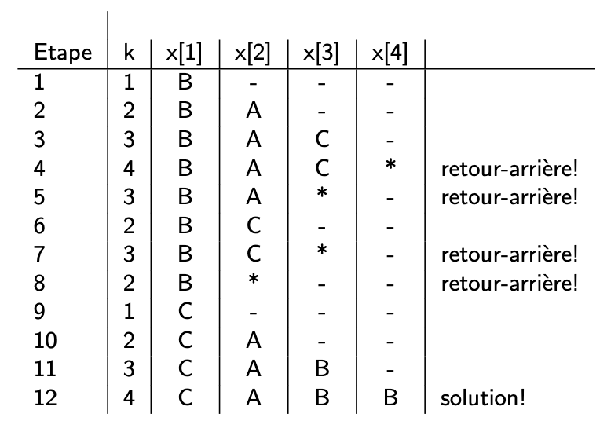

On peut rendre la recherche plus efficace en optimisant:

- la manière de revenir en arrière d'un conflit:

  - **backjumping**: revenir à la dernière variables qui a une contrainte avec $x_{k+1}$

    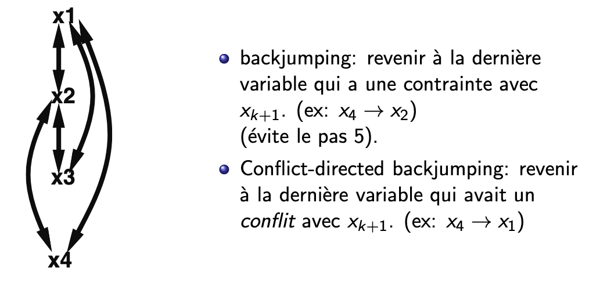

  - **forward checking**: éviter les valeurs qui ne laissent plus aucune possibilité d'instantiation consistante pour d'autres variables en ajoutant un label $l[i]$ pour chaque variable (initialement, label = domaine). A chaque instantiation, on élimine du label les variables non instantiées toutes les valeurs inconsistantes avec l'instantiation. Lorsqu'un label est vide $\implies$ instantiation non admise et donc backtrack

    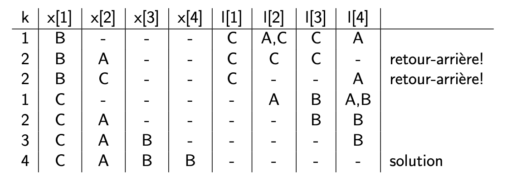

  - **lookahead**: même idée que forward checking, mais vérifier aussi entre toute paire de variables non instantiée (e.g. si $l[i] = l[j]$ avec toutes deux une seule valeur possible, alors l'instantiation est impossible)

    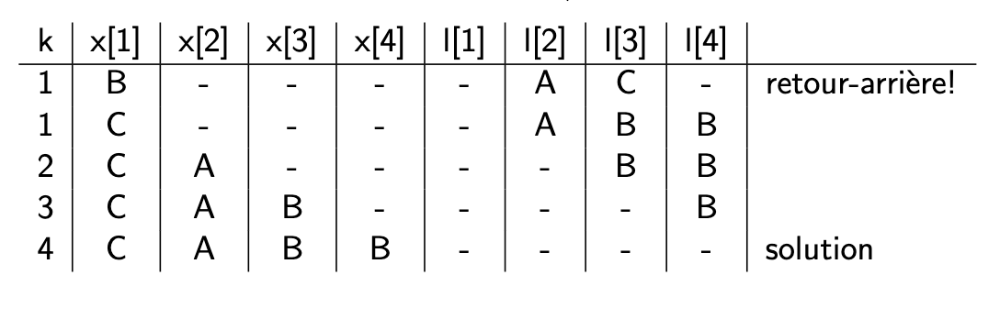

-  les valeurs considérées:

- l'ordre d'instantiation des variables:

  - **dynamic variable ordering** (**DVO**): prendre la variables dont le label est le plus petit (le set le plus petit). Se combine donc bien avec forward checking ou lookahead

    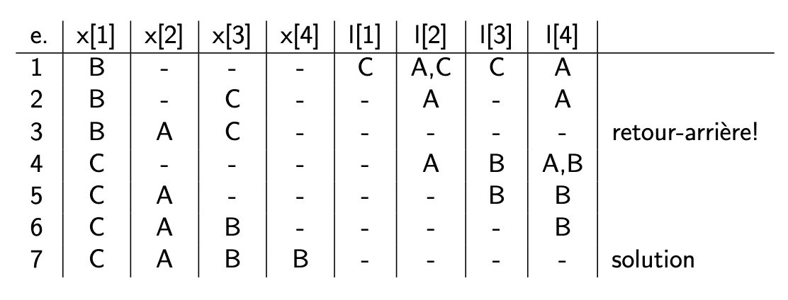

  - **min-width ordering**: prendre la variable qui a des contraintes avec le plus petit nombre de variables encore ouvertes

    Exemple avec DVO + tiebreaking avec min-width

    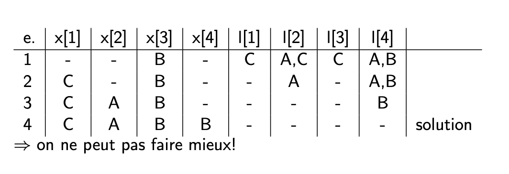

  - **max-degree ordering**: prendre la plus connectée dans le PSC original

> Regarder la demo java "CSPDemo.jar"


### Consistance

On peut aussi simplifier les domaines avant de faire des calculs avec l'**algorithme de Waltz**. Par exemple ici, pour $l_1 = c(1, 2)$ (la contrainte $>=$), on voit que $x_1=1$ ne peut jamais être $>=$ à une valeur de $x_2$. On biffe donc $x_1=1$ et $x_2 = 4$ pour les mêmes raison. On procède ainsi pour chaque contrainte. On procède donc en deux temps: 

1. éliminer les valeurs ou combinaisons de valeurs ne pouvant respecter toutes les contraintes
2. effectuer la recherche sur l'espace réduit

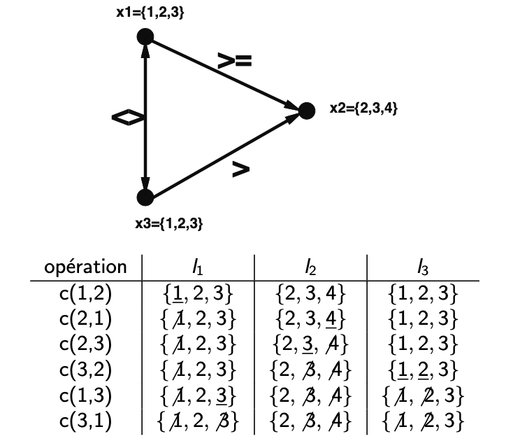


### Recherche locale

Correspond à un "hill-climbing": continuellement augmenter le nombre de contraintes satisfaites. Il existe deux versions:

- déterministique: 
  - **min-conflicts**: changer l'assignation de la variable qui réduira le plus le nombre de conflits. C'est une sorte de descente du gradient $\implies$ on arrive donc à un minimat local (souvent solution de bonne qualité), mais il existe peut être un minima global différent meilleur
  - **GSAT**: pas vu dans ce cours

- probabiliste: **recuit simulé**: on pourrait parfois faire des changement non-optimal (algorithme inspiré de la physique: solidification des verres). On a un chiffre $T$ entre 0 et 1 qui décroit dans le temps. Il correspond à la probabilité d'accepter une solution trouvée qui n'est pas optimale (pas mieux que la précédente)

  


## Diagnostic

Il y a 2 types de tâches abductives qui trouvent beaucoup d'applications pratiques:

- le **diagnostic**: trouver les composants d'un système responsables d'un dysfonctionnement
- la **planification**: trouver une séquence d'actions qu iatteint un certain ensemble de buts


La difficulté du diagnostic vient du fait que chaque système est différent. Formellement, étant donné un modèle du système (MS) et un ensemble d'observations (OBS), on veut trouver des candidats (CAND) de diagnostic (où un candidat est une combinaison de composantes défectueuses). Un comportement défaillant existe si
$$
MS \cup OBS \vdash \perp
$$
On peut le voir de deux façons:

- le candidat explique les observations: $MS \cup CAND \vdash OBS$
- le candidat rend les observations consistantes: $(MS - CAND) \cup OBS \not \vdash \perp$


Prenons un exemple: on cherche à trouver les câbles déféctueux dans le circuit en observant les 3 ampoules avec l'hypothèse que seuls les câbles peuvent tomber en panne

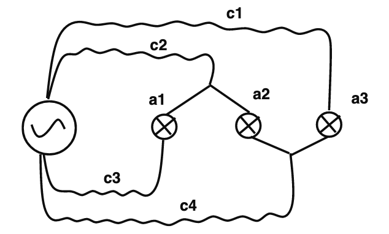

Ici, on pourrait créer une abduction d'une simulation (modèle):
$$
defecteux(c2) \implies eteint(a1) \\
defecteux(c3) \implies eteint(a1) \\
...
$$
On définit le circuit avec une description des 3 ampouples, 4 câbles, et des connexions. On définit ensuite la règle suivante:
$$
ampoule(x) \and cable(y) \and connexion(y, src, x) \and cable(z) \and connexion(z, x, src) \implies allumee(x)
$$


On peut implémenter un problème abductif (tel que le diagnostic) de 3 techniques principales différentes:

- abduction explicite
- transformation en déduction
- raisonnement incertain (probabilités, logique floue)


### Abduction explicite

On a un générateur d'hypothèses (génère des candidats), suivi d'une prédiction du modèle, suivi d'une évaluation, puis on recommence (l'évaluation influe le générateur)

Pour notre exemple, on commencerait avec l'état initial avec 0 défaut (ensemble vide), qui nous donne $(1,1,1)$ (les 3 ampoules allumées). On essaie ensuite d'introduire un défaut ($c_1$ défectueux par exemple), puis on regarde ce que le système produirait (état des ampoules). On continue jusqu'à trouver une solution

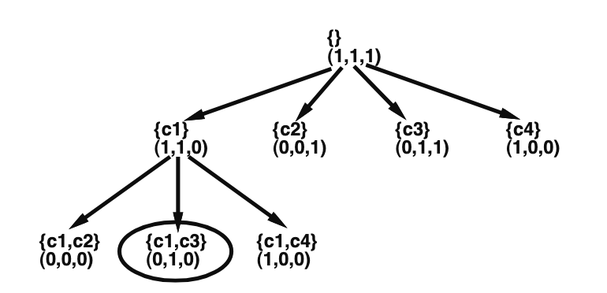


### Transformation en déduction

On pourrait transformer l'abduction en déduction en 2 étapes:

1. simuler le comportement pour *tous* les défauts possibles
2. construire des règles pour la déduction du diagnostic à partir des observations


Pour notre exemple, on calcule l'état des 3 ampoules pour toutes les combinaisons des 4 câbles déféctueux ou non (16 résultats), puis on en crée des clauses. Par exemple,
$$
\begin{cases}
(a_1=1,a_2=1,a_3=1) \implies \{\} \\
(a_1=1,a_2=1,a_3=0) \implies c_1 \\
(a_1=1,a_2=0,a_3=0) \implies c_4 \or (c_1 \and c_4) \\
(a_1=1,a_2=0,a_3=1) \implies - \space\text{(cas impossible)}
\end{cases}
$$
On peut donc ensuite créer des règles déductives à partir de cela (puis un système expert). Par exemple,
$$
eteint(a_3) \and \neg eteint(a_2) \implies defectueux(c1)
$$
On note que pas tous les cas donnent lieu à des clauses de Horn, c'est impossible de traîter les situations non prévues par le programmeur, tout changement requiert une reprogrammation globale, ...


### Raisonnement incertain

On pourrait également faire de l'abduction par réseaux bayesiens

> Voir cours 10 slides 20 à 24


### Diagnostic basé sur la consistance

Le principe est que les candidates doivent rendre les observations consistantes: $(MS - CAND) \cup OBS \not \vdash \perp$ (i.e. en enlevant le fait que les candidats fonctionnent, le système est consitant avec les observations)

Toute différence entre prévision et mesure, ou 2 prévisions est un **symptôme**


## Planification

Etant donné:

- un ensemble d'opérateurs
- un état initial
- des conditions qui doivent être satisfaites dans l'état final (on a donc pas l'état final précis, seules des conditions qui doivent être respectées)

Le but est de trouver une séquence d'actions qui va assurer que l'état initial est transformé en un état final qui replit les conditions


Le **monde des blocs** est un exemple standard de la littérature sur les systèmes de planification. Il comporte un ensemble de blocs tous de même taille, la main d'un robot capable de tenir et de déplacer un bloc à la fois, et une table qui a suffisamment de place pour placer tous les blocs qui existent. On a aussi les prédicats suivants: `ON(x, y)` (bloc $x$ est au-dessus de bloc $y$), `ONTABLE(x)` (block $x$ est sur la table), `CLEAR(x)` (il n'y a rien sur bloc $x$), `HOLDING(x)` (la main tient $x$), `HANDEMPTY` (la main est vide)


En général, un opérateur effectuera une transformation quelconque de $S_i$ en $S_{i+1}$ tq. $S_{i+1} = f(S_i)$. L'opérateur se caractérise par:

- ses préconditions $P$: des propositions qui doivent être vraies dans $S_i$ pour que l'opérateur puisse s'appliquer
- ses postconditions $A$ (add): les propositions qui sont réalisées dans $S_{i+1}$ par l'application de l'opérateur (et donc ajoutées)
- ses suppressions $D$ (delete): les propositions qui ne seront plus vraies dans $S_{i+1}$ (et donc supprimées)

Un exemple d'opérateur serait l'opérateur `PUTON(x, y)` qui modélise l'action de mettre un bloc $x$ sur un bloc $y$. Ses préconditions sont `CLEAR(y)` et `HOLDING(x)`, ses postconditions sont `ON(x, y)`, `CLEAR(x)` et `HANDEMPTY`, et ses suppressions sont `CLEAR(y)` et `HOLDING(x)`


### Planification linéaire

On peut implémenter la planification au moyen du chaînage arrière, au moyen de $A^*$

### Planification non-linéaire

???

### Planification par contraintes

???


## Apprentissage

On aborde le 3ème type d'inférence: l'**induction** (= apprentissage à partir d'exemples). Le plus d'exemples considérés, le moins probable que l'hypothèse soit fausse ("Big Data")

Il existe deux types d'apprentissages: apprentissage **supervisé** (trouver un modèle à partir d'exemples classifiés) et **non-supervisé** (trouver un modèle en structurant des exemples non-classifiés)

Les exemples doivent être représentés par des attributs (par exemple un piment peut être allongé, rond, rouge, jaune, vert, fort, ...)

On peut viser différents buts en utilisant l'apprentissage:

- **classification**: appartenance à une classe (e.g. spam, chien/chat, ...)
- **régression**: valeur d'un attribut (e.g. un prix, une couleur)
- **renforcement**: amélioration incrémentale en renforçant le succès et supprimant les échecs
- autres structures de données (par exemple des recommandations de produit)


### Classification supervisée

Etant donné un ensemble $P$ d'instances d'un concept et $N$  un ensemble de non-instances du concept. On aimerait trouver un modèle du concept qui couvre toutes les instances de $P$ et aucune de $N$ (e.g. $P$ sont des photos de chats, et $N$ des photos d'autres animaux)

| taille    | forme       | couleur   |                |
| --------- | ----------- | --------- | -------------- |
| grand (1) | allongé (1) | rouge (1) | piquant        |
| grand (1) | rond (0)    | vert (2)  | $\neg$ piquant |
| petit (0) | allongé (1) | rouge (1) | piquant        |
| petit (0) | rond (0)    | rouge (1) | $\neg$ piquant |
| petit (0) | allongé (1) | jaune (0) | $\neg$ piquant |

On peut exprimer un résultat de plusieurs manières:

- logique: $allongé \and rouge \implies piquant$
- frontière: $couleur + 2 * forme \ge 3$
- instance: chercher un exemple de la même forme et couleur

On peut chercher un résultat de deux manières (types de recherche):

- spécialisation: commencer avec une description ayant peu d'attributs et spécialiser en rajoutant des attributs pour n'inclure que des éléments positifs. Par exemple, on commence avec $\{rouge\} \implies piquant$, puis l'on remarque que $\{rouge, allongé\} \implies piquant$ est toujours vraie
- généralisation: commencer avec une description avec beaucoup d'attributs et généraliser en laissant tomber des attributs en veillant à ne pas inclure des exemples négatifs. Par exemple, $\{rouge, allongé\} \implies piquant$ devient $\{rouge\} \implies piquant$

On note que l'on rencontre des exmples qui ne peuvent pas être transformé dans le modèle conjonctif ($allongé \and rouge \implies piquant$). Par exemple, si l'on rajoute la règle 
$$
grand \and rond \and vert \implies piquant
$$
dans le tableau ci-dessus, on ne peut plus utiliser le modèle conjonctif

---

#### Frontières de décision linéaires

Formellement, on prend des exemples notés par des vecteurs d'attributs continus $X = (x_1, ..., x_n)$ auxquels on rajoute toujours $x_0 = 1$ pour pouvoir s'éloigner de l'origine. La frontière (fonciton linéaire) devient donc:
$$
\delta(W, X) = \sum_{i=0}^n w_i \cdot x_i
$$
où $W$ est un vecteur des poids. On décide de l'appartenance à une classe ($+/-$) en utilisant une fonction de seuil:
$$
\begin{cases}
	C(X) = 1 \implies X \in + & \text{si } \delta(W, X) \ge 0 \\
	C(X) = 0 \implies X \in -& \text{sinon}
\end{cases}
$$


Ce modèle de frontières est implémentés par les **perceptrons** (inspirés des neurones). En paramètres, on prend un vecteur de poids $W=(w_0, ..., w_n)$. En entrée, on a $X = x_1, ..., x_n$ avec une constante $x_0$. On applique la frontière linéaire $\delta(W, X)$ et l'on reçoit en sortie 1 si $\delta \ge 0$, ou 0 sinon

Il existe un algorithme permettant d'apprendre le vecteur de poids avec $P$ et $N$. $\sigma$ est un coefficient d'apprentissage (hyperparamètre)

```pseudocode
Perceptron(P, N):
	W = (1, 0, ..., 0)
	do {
		X_i = "choix aléatoire" \in P \cup N
		if C(W, X_i) != class(X_i) then
			if class(Xi) = (+) then
				W += \sigma * X_i
			else
				W -= \sigma * X_i
	} until "W ne change plus"
	return W
```

C'est un exemple de descente de gradient (si la classification est erronée, on corrige $W$) de pas $\sigma$


**Support vector machines** (**SVM**) permet de trouver une frontière en maximisant la séparation des exemples. C'est un problème d'optimisation quadratique. Pour $n$ exemples, c'est résolable en temps $O(n^3)$ (avec mémoire $O(n^2)$)

Lorsque les exemples ne sont pas séparables, on peut soit admettre que certains exemples ne sont pas correctement classifiés, ou introduire une transformation non-linéaire qui les rend séparable (kernel function). Par exemple, en appliquant une transformation $\phi(x)$ sur tous les exemples, on pourrait trouver (ou non) une séparation linéaire dans l'espace d'arrivée


### Régression

Pour la prévision d'une valeur inconnue $y$, il faut un modèle $y=f(X)$ où $X$ est un vecteur de traits. On note $X(i)$ le i-ème exemple et $\underline X = \{X(1), X(2), ...\}$ l'ensemble des exemples connus

On veut choisir $W$ pour minimiser $L$ (loss function) sur les exemples:
$$
y = L + \sum_{i=0}^k w_i \cdot x_i
$$
avec $x_0=1$. Formellement, on veut choisir $W$ le plus probable étant donné l'ensemble des observations $\underline X$, donc maximiser
$$
p(W| \underline X) = \frac{p(\underline X | W) p(W)}{p(\underline X)}
$$
Pour ce faire, on réécrit $L$
$$
L(i) = y(i) - (\sum_{j=0}^k w_j \cdot x_j(i))
$$
La probabilité $p(i)$ d'observer $y(i)$ et la probabilité de $L(i)$. On suppose ensuite que les erreurs sont distribuées selon une distribution gaussienne
$$
p(i) = p(L(i)) = \alpha e ^ {w L(i)^2}
$$
Pour maximiser la probabilité de tous les exmples $\Pi_{X(i) \in \underline X} \space p(i)$, on doit minimiser l'expression
$$
\sum_{X(i) \in \underline X} - \log p(i) =  \sum_i L(i)^2
$$
On utilise la méthode des moindres carrés. Attention cependant au surapprentissage (overfitting) où le modèle est "trop fidèle" aux exmples (et ne correspondra pas très bien à d'autres nouveaux exemples)


### Régularisation

Supposons que certains $W$ sont plus probables que d'autres. Il suffit de minimiser
$$
- \ln p(\underline X | W) - \ln p(W)
$$
où $\ln p(W)$ est un **régularisateur** très courant qui permet de limiter l'overfitting. Un autre régularisateur très utilisé est $\sum_k w_k$ (correspond à une distribution exponentielle)


### Classification par régression

On peut le faire au moyen de la **transformation logistique**
$$
p(y = c_1 | X, W) = \frac{e^{W \cdot X}}{1+e^{W \cdot X}}
$$
toujours entre 0 et 1 ayant une courbe sigmoïdale et souvent appelée **softmax**. C'est le principe de la **régression logistique**


### Modèles structurés

L'idée des **modèles structurés** est de diviser pour régner (quand le modèle à apprendre est trop complexe pour des modèles paramétriques simples)


#### Arbres de classification (random forest)

Un **arbre de classification** est une structure servant à déterminer la classe d'un exemple $X$. Chaque noeud est un prédicat $P$. Si $P(X)$ est vrai, on passe au successeur gauche, sinon, au successeur droit. Les noeuds terminaux désignent les classes. Cet arbre permet de représenter une décomposition disjonctive de l'espace d'exemples

Un algorithme de classification utilisant ces arbres s'appelle **ID3** dont le but est: étant donné un ensemble d'exemples appartenant à $k$ classes différentes, construire l'arbre de classification optimal (profondeur moyenne minimale) qui permet de distinguer lese classes

```pseudocode
function id3(examples) { // examples est un ensemble d'exemples
	if len(examples) == 0 then return NIL
	else
		if \forall e in examples, classe(e) == c then return c
		else // si examples contient plusieurs classes
			// pour P, on choisit un attribut (see below)
			P = attribut \in A qui réduit au plus l'entropie de la classe
			L = {e | e \in examples && P(e) est vraie}
			R = {e | e \in examples && P(e) est fausse}
			N = noeud vide
			N.P = P
			N.left = id3(L)
			N.right = id3(R)
			return N
}
```

Comment choisir le meilleur attribut (ligne 6)? Idéalement, un attribut qui sépare au mieux les exemples et qui sépare bien les classes. Pour cela, on utilise le concept d'**entropie** (i.e. l'incertitude de la valeur d'une variable aléatoire $X$ à valeurs $v_1, v_2, ..., v_k$):
$$
H(X) = - \sum_{i=1}^k p(X=v_i) \cdot \log_2 p(X = v_i) \\
H(X|Y = y) = - \sum_{i=1}^k p(X=v_i|Y=y) \cdot \log_2 p(X = v_i|Y=y)
$$
De plus, si la valeur de $Y \in \{y_1, ..., y_m\}$ est connue, on a:
$$
H(X|Y) = - \sum_{i=1}^m p(Y=y_i) \cdot H(X|Y=y_i)
$$
Donc si $C$ est la classe d'un exemple $e$ parmi $k$ classes et $Y$ la valeur d'un attribut $A$ parmi $m$ valeurs, on choisit l'attribut $A$ qui donne la plus petite incertitude (entropie) restante, i.e. la valeur la moins élevée de $H(C|A)$ avec
$$
H(C|A) = - \sum_{i=j}^m p(a_j) \cdot \sum_{i=1}^k p(c_i|a_j) \cdot \log_2 p(c_i|a_j)
$$


Calculer l'entropie est coûteux! On peut aussi calculer la variance des sous-classes:
$$
1/N \cdot \sum_{i=1}^n (c_i - \bar c)^2
$$
ou alors la fraction d'exemples n'appartenant pas à la classe la plus fréquente:
$$
1/N \cdot |\{c_i|c_i \ne \text{classe la plus frequente}\}|
$$


:information_source: On peut aussi utiliser ces arbres pour la régression

ID3 est un algorithme très efficace et beaucoup utilisé en pratique mais la classification n'est pas toujours bonne pour de nouveaux exemples, certaines décisions peuvent être un hasard de la sélection des exemples, et les arbres de classification qui en résultent sont souvent diffcile à interpréter

Pour améliorer cet algorithme, on peut:

- élaguer l'arbre: les décisions introduites vers les feuilles sont basées sur très peu d'exemples. On pourrait estimer le taux d'erreurs et élaguer le sous-arbre (i.e. remplacé par une seule feuille dont la classe est celle qui était la plus fréquente)
- transformer l'arbre en règles: on construit les règles en traversant l'arbre de haut en bas pour chaque path possible


Pour réduire l'overfitting, on pourrait soit choisir de garder une partie des exemples en réservre pour évaluer le taux d'erreur de la classification, ou alors utiliser des méthodes statistiques telles que **PAC** (probablement approximativement correct). En supposant que l'on donne $N$ exemples dont la distribution correspond à la réalité pour apprendre un concept par $|H|$ possibilités, l'algorithme rend un résultat correct sur tous les exemples. On peut chiffrer la relation entre $N, |H|, \delta$ (la classification n'est pas approximativement corrected avec probabilité $\delta$), et $\epsilon$ (la probabilité d'erreur de classification est inférieure à $\epsilon$). Pour garantir une borne $\delta$, il faut que:
$$
N \ge \frac{\log(\delta/|H|)}{\log(1- \epsilon)}
$$
On peut donc estimer le nombre d'exemples qu'il faut pour obtenir la qualité voulue. Par exemples, pour 10 attributs, $\delta < 0.01$, et $\epsilon < 0.001$, on a 11 choix pour le premier noeud (10 attributs + arbre vide), 10 choix pour chacun des deux 2ème noeuds, ... On a donc
$$
|H| = 11 \cdot 10^2 \cdot 9^4 \cdot 8^8 \cdot \ldots \cdot 2^{2^9} \approx 2.6579 \cdot 10^{35}
\implies
N \ge 86131
$$


---

#### Combinaison pondérée (boosting)

Le **boosting** permet d'apprendre une combinaison (= vote pondéré) modèles faibles (i.e. taux d'erreur $\lt 50\%$) pour obtenir une plus grande précision. Supposant que l'on a $n$ exemples $(x_i, c_i)$ pour $i \in 1, \ldots, n$ et $c_i \in \{0, 1\}$, avec une distribution de probabilités $p_i$ tq $\sum_{i=1}^n p_i = 1$. Alors, le méthode apprend un classificateur $h(x)$ avec probabilité d'erreur $\lt 50 \%$: $\epsilon = \sum_{i=1}^n p_i \cdot |h(x_i) - c_i| \lt 0.5$ pour toute distribution de probabilité $p_i$

On peut utiliser l'algorithme Adaboost pour cela


### Apprentissage non-supervisé

Remplace le critère d'un modèle correct par un critère de performance plus général (utile pour par exemple classifier des segments d'ADM similaires pour reconnaître la structure, ou donner des recommandations de produits dans le commerce électronique, ou alors trouver des classes d'utilisateurs similaires pour les fournir des chemins d'accès spécifiques sur un site web)


#### Clustering

Le but est d'apprendre une sous-division qui couvre les exemples de la meilleure manière. Avec $n$ exemples, il existe $k^n$ manières de les diviser en $k$ agrégats, c'est donc vraiment top complexe pour une recherche exhaustive. Le clustering est fait en trois étapes:

1. représentation des exemples
2. mesure de similarité: définition de la proximité de deux exemples suivant le domaine d'application (e.g. distance euclidienne)
3. regroupement d'exemples


Il existe plusieurs types d'algorithmes: **clustering hiérarchique** qui crée une structure de regroupement de clusters à différents niveaux (e.g. single-link, complete-link), **clustering de partitionment** qui crée une partition unique des exemples (e.g. k-means clustering, clustering sur la base de la théorie des graphes), ou **clustering flou** qui définit une probabilité d'appartenance à un cluster


##### Clustering hiérarchique

Il crée un **dendrogramme** qui représente les regroupements d'exemples et des niveaux de similarité

> > > >>>IMAGE

Algorithme:

1. placer chaque exemple dans son propre cluster
2. trouver la paire de clsuters la plus similaire (suivant une définition de distance entre cluster) et la fusionner en un seul cluster
3. calculer la distance entre ce nouveau cluster et tous les autres clusters
4. répéter 2 et 3 jusqu'à ce qu'il n'existe plus qu'un seul cluster contenant tous les exemples


Pour mesurer la similarité, on peut suivre l'idée du **single-link** qui prend le minimum des distances entre toutes les paires d'exemples des deux clusters (implique une similarité transitive), ou **complete-link** qui prend le maximum des distances (implique une similarité non-transitive)

On peut implémenter le clustering hierarchique avec un MST inversé ou du clustering spectral (avec des matrices où $W$ est la matrice de similarité des arcs (similarité de 5 = maximum), $D$ la matrice des arcs sortant (c'est une matrice diagonale qui pour un noeud lui assigne la somme de tous les arcs qui partent du noeud (en n'oubliant pas l'arc invisible qui fait le chemin noeud-noeud et vaut 5)), puis enfin la matrice Laplacien $L=I - D^{-1} W$. Le vecteur propre associé à la deuxieme plus petite valeur propre est le vecteur de Fiedler tel qu'il y a des composantes positives pour des instances de $C_1$ et négatives pour les instances de $C_2$)

---

##### Clustering de partitionnement

Pour le clustering de partitionment, l'algorithme le plus connu est **k-means**. C'est une itération qui associe chaque exemple $x_i$ à l'aggrégat dont le noyau est le plus proche, i.e. $C_j$ tq $\delta(c_j, x_i)$ est minimal, puis pour chaque aggrégat $C_j$, remplacer le noyau par l'exemple qui est le plus au centre des exemples de l'aggrégat (i.e. $x_c \in C_j : \sum_{x_i \in C_j} \delta(x_c, x_i)^2$ est minimal). Note: on initialise l'algorithme en choisissant $k$ noyaux

Il n'y a aucune garantie de convergence et il est difficile de choisir le bon $k$. K-means implique une mesure de similarité non-transitive

Avec $n$ objets et $m$ attributs, el clustering hiérarchique atteind au moins $O(n^2 \cdot m)$, tandis que k-means $O(l \cdot k \cdot n \cdot m)$ avec $l$ le nombre d'itérations. On voit que k-means est linéaire au niveau du nombre d'exemples!


On peut aussi utiliser du clustering probabiliste où l'appartenance à un cluster est défini par une distribution de probabilités. On suppose souvent que les exemples sont générés par un mélange de $k$ processus à distribution gaussienne. On peut utiliser l'algorithme **expectation maximization** (EM)


### Apprentissage semi-supervisé

Souvent, beaucoup de données mais que peu d'exemples classifiés. On peut ajuster les frontières de l'apprentissage supervisé pour correspondre à la distribution des isntances, ou utiliser les classifications pour identifier les clusters distincs à partir de l'apprentissage non-supervisé


### Réseaux de neurones artificiels

Le réseaux est agencé en couches et inspiré du cerveau humain

#### Neurone artificiel

Chaque **neurone** calcule une somme des entrées $e_i$ pondérée par le poids des connexions $w_i$ et joutune un biais $w_0$:

$$
x = \sum_{i \in \text{entrees}} w_i e_i + w_0
$$
La sortie est appellée l'**activation** et est obtenue par une **fonction d'activation** non-linéaire $f(x)$ appliquée à $x$. On prendra par exemple la fonction sigmoïde:
$$
f(x) = (1+e^{-x})^{-1}
\\
\frac{df}{dx}=\frac{e^{-x}}{(1+e^{-x})^2} = f(x)(1-f(x))
$$
:information_source: Une fonction encore plus simple est la fonction de seuil:
$$
f(x) = \begin{cases}
1 & \text{si } x > 0 \\
0 & \text{si } x \le 0 
\end{cases}
$$
:information_source: On pourrait aussi utiliser la fonction redresseur: $f(x) = \max(0, x)$


Pour entraîner un réseau, on passe des exemples choisis aléatoirement et on corrige les poids à chaque erreur. On utilise le concept de **backpropagation** (rétropropager l'erreur aux couches cachées). C'est une forme de descente du gradient

---

#### Deep learning

Quand on augmente le nombre de couches (par exemple 30), on obtient ce que l'on appelle le **deep learning**. C'est souvent difficile à faire converger et exige une expérimentation avec les paramètres et la connectivité du réseau. Cela nécessite une grande quantité de données!

Dans un **perceptron** (= un seul neurone artificiel), on arrive à distinguer des formes simples. Avec un **multicouche**, on peut distinguer des frontières plus complexes (e.g. distinguer un oeil d'une bouche). Pour cela, on construit le **réseau de neurones convolutionel** avec trois types de couches:

- couches `CONV`: application de filtres (apprises par les données)
- couch `RELU`: combinaison des filtres
- couche `POOL`: mise en commun des réponses des filtres (présence/absence d'attributs)

Le résultat de l'apprentissage est obtenu par optimisation $\implies$ on ne peut pas garantir la qualité

---

#### Autoencoders

Un **réseau encoder** est un réseau profond qui représente des entrées de haute dimension dans une couche à plus faible dimension. Un **réseau decoder** fait l'inverse. Un **autoencoder** couple les deux (donc input $\leadsto$ espace de grande dimension $\leadsto$ encoder $\leadsto$ espcae de petite dimension $\leadsto$ decoder $\leadsto$ output)


### Apprentissage par découverte

Est-ce qu'un ordinateur peut "créer" de nouvelles connaissances sans entrées extérieures? Oui. Il existe deux types de connaissances:

- connaissances explicites: comment peindre un joli tableau
- connaissances implicites: comment évaluer un tableau

Un programme peut-être créatif en générant différents tableaux et retenant ceux qui sont jugés jolis $\implies$ apprentissage par découverte


#### Algorithmes génétiques

Etant donné une population initiale de $n$ solutions potentielles (**chromosomes**) et une fonction d'évaluation d'une solution, un **algorithme génétique** génère de nouvelles solutions en appliquant deux opérateurs sur les solutions de la population initiale:

- la **mutation**: change une seule solution de la population de manière aléatoire
- la **combinaison**: créer une nouvelle solution à partir de deux solutions

La prochaine génération consiste en $k$ solutions dont la fonction d'évaluation est la plus élevée et un nombre $n-k$ de solutions choisies au hasard parmi les autres. L'avantage est que le critère d'évaluation peut être arbitrairement complexe

:information_source: l'opérateur combinaison est utile uniquement si la population contient une bonne diversité. On peut améliorer les performances en tenant compte de la diversité. Par exemple, on peut caractériser le degré d'individualisme par
$$
g(s) = (\sum_i (\delta^2(s, s_i))^{-1})^{-1}
$$
et utiliser comme fonction d'évaluation la somme $f(s) + g(s)$ où $f(s)$ est la fonction d'évaluation
