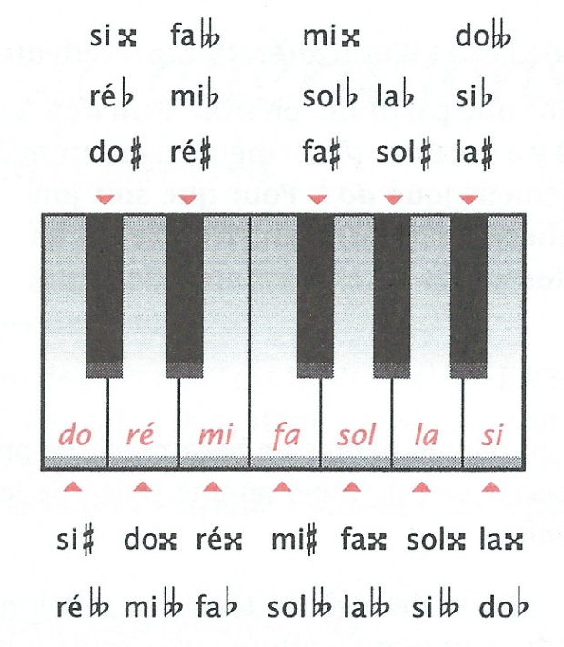
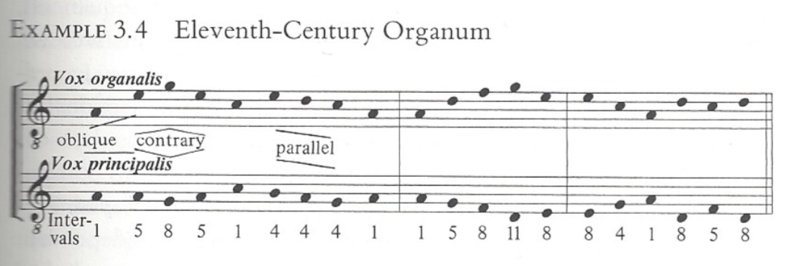

# [HUM-242] Summary SHS Musicologie

[TOC]

## 1.	Introduction

### 1.0	Ressources utiles

- [IMSLP](https://imslp.org/)
- Groove dictionary (disponible gratuitement à l'UNIL) sous abonnement
- g store (?)

---

### 1.1	Improvisation

> "L'idée vient en parlant", *Heinrich von Kleist (1805)*

> "Improviser c'est composer vite, composer c'est improviser lentement", *C.A. Bériot (1852)*

> "L'**improvisation** est le fait de composer sans préparation", *Michel Brenet Dictionnaire (1926)*

Improviser = composer "sur le champ", composer "ex tempore"

**Exemples** : 

- [Improvisation](https://www.youtube.com/watch?v=RTW_2d3kPUo&feature=youtu.be) à la manière de Liszt sur Happy Birthday (Marina Yakhlakova)
- [Improvisation](https://www.youtube.com/watch?v=BSLisbaLh-I&feature=youtu.be) sur une basse dans le style baroque (Matthieu Camilleri)
- [Improvisation](https://www.youtube.com/watch?v=ATC44nm04UY&feature=youtu.be) sur une Ductia (Jordi Savall)

---

### 1.2	"Frise" du temps

- **avant** : Moyen-Age
- **1420 - 1600** : Renaissance
  - **1501** : début de l'**imprimerie** $\Rightarrow$ spread the knowledge
- **1600 - 1750** : Baroque
  - **1607** : début de l'opéra avec L'*Orfeo* de Monteverdi
  - **1750** : Mort de Jean-Sébastien Bach
- **1750 - 1827** : Classique
  - **1827** : Mort de Beethoven
- **1827 - 1900** : Romantique
- **XXème siècle** : compliqué... (Epoque moderne + contemporaine)
  - tout est remis en question
  - fragmenté
  - mosaïque

---

###1.3	Mise à niveau

#### 1.3.1 Enharmonie

L'**enharmonie** : deux notes fondamentalement différentes mais qui sont les mêmes lorsque jouées:

- ré# = mi♭
- mi# = fa
- la = sol&#119082; = si♭♭

#### 1.3.2 Intervalles

| Nombre de tons | Description intervalle | Exemple intervalle |
| -------------- | ---------------------- | ------------------ |
| 1 x ½ ton      | seconde mineure        | Do - Ré♭           |
| 2 x ½ ton      | seconde majeure        | Do - Ré            |
| 3 x ½ ton      | tierce mineure         | Do - Mi♭           |
| 4 x ½ ton      | tierce majeure         | Do - Mi            |
| 5 x ½ ton      | **quarte juste**       | Do - Fa            |
| 6 x ½ ton      | **quarte augmentée**   | Do - **Fa#**       |
| 7 x ½ ton      | **quinte juste**       | Do - Sol           |
| 8 x ½ ton      | sixte mineure          | Do - La♭           |
| 9 x ½ ton      | sixte majeure          | Do - La            |
| 10 x ½ ton     | septième mineure       | Do - Si♭           |
| 11 x ½ ton     | septième majeure       | Do - Si            |
| 12 x ½ ton     | octave juste           | Do - Do            |

---

###1.4	Glossaire (basics)

- La **tonalité** est le ton de référence d'où part le morceau pour y revenir. On change de tonalité dans un morceau, on parle de **modulation** et on veut revenir sur ses pattes à la fin en terminant la pièce sur le ton de référence
  - Introduire une nouvelle tonalité (intermédaire) =~ introduire un nouveau personnage dans une histoire
- On choisit un **mode** en fonction de ce que l'on veut exprimer :
  - dans la musique **tonale**, il n'y a que 2 modes : mineur et majeur
  - dans la musique **atonale**, il peut y avoir 7 modes (le mode de do, de ré, ...)
    - L'enchaînement des tons et ½ tons caractérise un mode
    - Le mode de do est : do - ré - mi - ... - si (seulement notes blanches, pareil pour les autres modes)

- Une **gamme** est une succession de notes conjointes et dont la dernière reprend la première à l'octave
- [Différence](https://www.youtube.com/watch?v=DZwcoIIzOE8) entre un mode et une gamme : un mode est une suite d'intervalles, une gamme est une suite de notes
- On parle d'**accord** dès que l'on joue 3 notes ou plus simultanément avec une main
- L'**harmonie** est l'art de la formation et de l'enchaînement des accords
- Le **rythme** est l'indication musicale de la durée
- Le **contrepoint** est l'art de superposer harminieusement des lignes mélodiques distinctes
  - Le premier contrepoint improvisé est l'organum (Moyen-Age). C'était de la musique vocale
  - certains intervalles étaient "autorisés" (quartes & quintes)
  - d'autres comme la tièrce étaient proscrits
- La **forme** est la structure interne d'une composition, qui en découpe le temps en différentes parties //TODO exemple?
- La **cadence** a deux définitions :
  - La cadence est une formule de fin de phrase musicale ($\equiv$ ponctuation dans un texte)
  - La cadence est une plage d'improvisation laissée au soliste dans un concerto

---

###1.5	Histoire de la notation musicale

- Portée à une ligne, hauteur des notes imprécise
- Ajout de lignes pour la hauteur des notes (de 2 à 4 lignes) $\implies$ début de la portée
- Système de notation utile pour la transmission des mélodies

---

##2	Improvisation : musique vocale

Dans la période baroque, il était **inconcevalbe** de jouer une pièce sans y ajouter quelque chose, exemple :

- ornements : rajouter pleins de notes pour embellir
- Diminution : transformer une note en d'autres notes dont la somme des longueurs vaut autant que la note de départ

###2.1	L'organum

Le premier contrepoint improvisé date du Moyen-Age et s'appelait l'Organum. Il devient ensuite un genre polyphonique du IXe au XIIIe siècle

Un organum peut être :

- parallèle (ou stricte) : toujours des mouvements parallèles
- [libre](https://www.youtube.com/watch?v=YjCN9lhCQWo&feature=youtu.be) : mélange de mouvements contraires, obliques et parallèles

Si un des "chanteurs" fait plus de notes que le second, l'organum est alors :

- mélismatique : avec les intervalles acceptés de l'époque, aka quarte, quinte et octave (exemples : [(1)](https://www.youtube.com/watch?v=ngCRm7uLirA&feature=youtu.be) & [(2)](https://www.youtube.com/watch?v=EMyWnCf2Anc&feature=youtu.be))
- fleuri : mélismatique avec tièrces et sixtes

---

