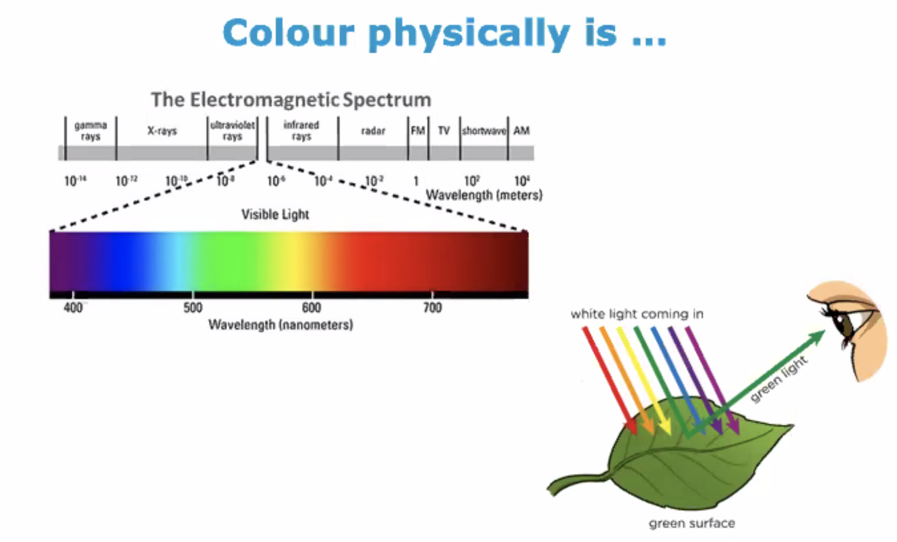
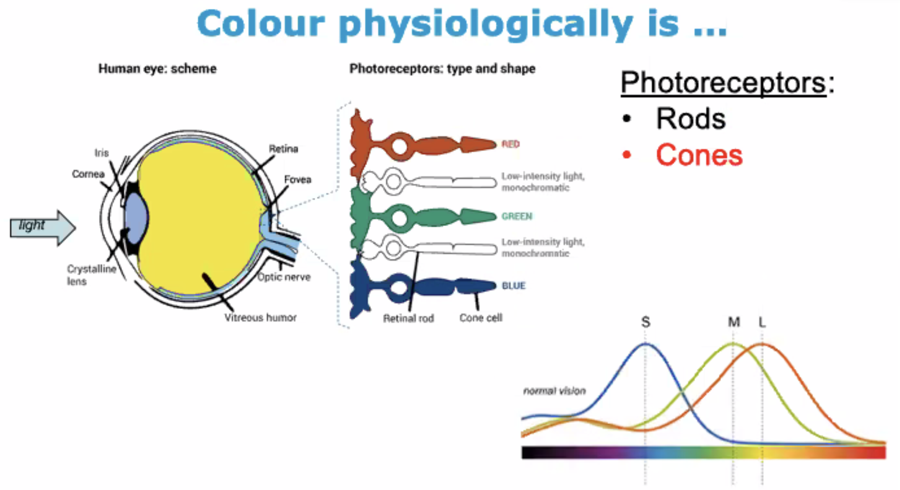

# [HUM-381] SHS Colour Psychology

[TOC]

> Oral (45%) : discuss a popular statement in colour psychology

## 1.	What colour could/would/might/does

- influences the mood of someone (e.g. waking up with a dull sky makes us glum)
- colour of food (people say the same aliment has a different taste depending on the colour)
- colourful notes/summary = better grades?
- red car can more easily be seen on the road $\implies$ safer

## 2.	What is colour?

- **Student discussion** :
  - Objects absorb & reflect light (wavelength of light)
  - Eyes perceive colours
  - Individual differences
  - Explain colour through association
  - Animals have differnet number of cones and rods $\implies$ see colours differently
- **Dictionary definition** :
  - The property possessed by an object of producing different sensations on the eye as a result (??? TODO SLIDES 2)
  - The colour of something is the appearance that it has as a result of the way in which it reflects light.
  - The quality of an object of substance with respect to light reflected by the object, usually determined visually by measurement of hue, saturation, and brightness.

Physically, here's how we see colours

Physiologically, here's how we see colours

**Colour blindness** is when we miss one of those columns in the graph

**Colour after-effect** : when our eyes get tired of a colour (e.g. looking at a green disc for a minute), then looking at a white page, we will see a disc where the green disc was with colour inverted (e.g. green -> red)

**Colour constancy** : some colours seem very different (e.g. orange vs brown) when the surrounding colors change

**Impairments** in the visual vertex lead to :

- **Colour anomalia** : inability to name visually presented colours
- **Colour agnosia** : inability to recognize colours
- **Cerebral achymatopsia** : complete colour blindness
- **Blindness**

## 3.	Emotions

**Keywords** : experiences, body reaction, behavioral changes, disruptive states, adaptation, subjective mental states

> "Everyone knows what an emotion is, until asked to give a definition of it"

Significant components of emotions :

- A situational trigger
- Some attentional redirection
- A cognitive process [TODO ???]

Here are the differences between a few close concepts

|                          |    Emotion     |         Mood         | Preference |   Disposition    | Interpersonnal attitude |
| ------------------------ | :------------: | :------------------: | :--------: | :--------------: | :---------------------: |
| **Situational trigger**  |      +++       |          +           |     +      |        +         |           +++           |
| **Cognitive evalution**  |      +++       |          +           |    +++     |        +         |            +            |
| **Responsive synchrony** |      +++       |          +           |     +      |        +         |            +            |
| **Rapidity of changes**  |      +++       |          ++          |     +      |        +         |           +++           |
| **Behavioral responses** |      +++       |          +           |     ++     |        ++        |           +++           |
| **Intensity**            |      +++       |          ++          |     ++     |        +         |           ++            |
| **Duration**             |       +        |          ++          |    +++     |       +++        |           ++            |
| e.g.                     | Anger, Sadness | Irritable, Depressed | Love, Like | Nervous, Anxious |      Warm, Distant      |

> **Emotion** is a set of episodic variations in several **components** of the organisms in response to **events** that are assessed as **important** for the person (Scherer, 2001)

Two major functions of emotions :

- Adaptive function :
  - Confronted to physical environment
  - Emotion recruits our for immediate responses (flight (fear), fight (anger), ...)
- Integration /integration function (social) :
  - Knowledge on emotions help us communicate, decode other's emotions, have an appropriate behaviour, ...
  - Indicate the quality of the interaction, help the maintain or dissolution of relationships
  - Emotions are meant to be shared

