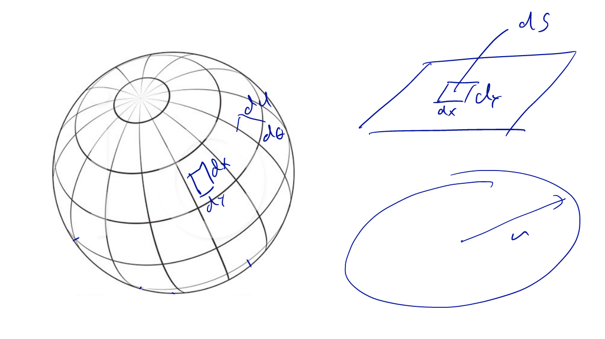

# [PHYS-114] Summary Electromagnetism

[TOC]

## 0.	Introduction

[Experiments](https://auditoires-physique.epfl.ch)

### The Goal

>  Understand Maxwell's equations which describe and predict all electromagnetic phenomena

| Equation | Description                                                  |
| -------- | ------------------------------------------------------------ |
| $\nabla \cdot \vec{E} = \frac{\rho}{\epsilon_0}$ | L2 - L6 : Charges are the source of eletric fields           |
| $\nabla \cdot \vec{B} = 0$ | L7 - L8 : Magnetic field lines close on themselves and have no start or end |
| $\nabla \times \vec{E} = -\frac{\partial \vec{B}}{\partial t}$ | L9 - L10 : A changing B-field creates and E-filed (induction) |
| $\nabla \times \vec{B} = \mu_0\vec{I} + \frac{1}{c^2} \frac{\partial \vec{E}}{\partial t}$ | L12 : Electromagnetic waves L7 - L8 : Currents (moving charges) are the source of magnetic fields |

## 1.	Electric charge and current

### 1.1	Basics

- There are only **2 types of charges** (㊉ and ㊀)
  - Two charges of the **same type repel** each other
  - Two charges of the **opposite type attract** each other
- **Conservation of charge** : charges cannot be created nor destroyed
- Charges in conductor / insulator
  - If we approach, say a ㊉ charge from a **metal piece/conductor**, then all ㊀ charges will be attracted closer to the charge we approached. At the same time, ㊉ charges will be repelled as far as possible. If we then remove the introduced charge, the ㊉ and ㊀ charges inside the conductor will stay separated
  - If we approach, say a ㊉ charge from an **insulator**, charges inside the insulator will only move very little distances (because they in an insulator). If we then remove the introduced charge, the ㊉ and ㊀ charges will be mixed
- Notation :
  - $q$ : a charge
  - $Q$ : sum  of charges
- Experiment : [Kelvin's Thunderstorm](https://www.youtube.com/watch?v=rv4MjaF_wow)
- How to express a surface ($dA$) as a vector $d\vec{A}$
  - direction : $\bot$ to the surface $d\vec{A}$
  - magnitude : area of the surface ($A$)

### 1.2	Relation between charges and current

| Name                  |                           Picture                            | Explanation                                                  |
| --------------------- | :----------------------------------------------------------: | ------------------------------------------------------------ |
| **Transient current** | &emsp;&emsp;&emsp;&emsp;&emsp;&emsp;&emsp;&emsp;&emsp;&emsp;&emsp;&emsp;&emsp;&emsp;&emsp;&emsp;&emsp;&emsp;&emsp;&emsp; | If we put a wire between them, then there will be a current between the two. We can "see" the current by the heat expulsed from the wire. It will stop after a certain amount of time because no more charges will be available (e.g. lightning / spark) |
| **Steady current**    |  | In this situation (if we put a "device" between them), the current will flow "forever" |

**Experiment** : Rowland experiment (no link?), we learn that :	$I$ ~ $\frac{dQ}{dt}$

### 1.3	Definitions

- Units :  $1 [A] = 1 [C/s]$
  - current : **Ampère** $[A]$
  - charge : **Coulomb** $[C]$

- Relation between current and charge :
  - $I = \frac{dQ}{dt}$
  - $Q  = \int dt I(t)$
- Electrons :
  - charge : $e^{-} = 1.6 \cdot 10^{-19} [C]$
  - mass : $m_{e} = 9.1 \cdot 10^{-31} [kg]$

#### Example

> We have a current $I(t) = 2 - 0.2t \: [A]$. How much charge passes in $5[sec]$?

$Q = \int_{t_{1}}^{t_{2}}dt I(t) = \int_{0}^{5}dt\;2-0.2t = 2t-0.4t^{2}|_{0}^{5} = 7.5[C] $ 

###1.4	Point charge & charge density

- A **point charge** is a mathematic concept to simplify problems. It is a charge $Q$  located on a point without spacial extension (**NOT** the same as $e^{-}$)

- **Volume charge density** $\rho$

  - $\rho(x, y, z)$ or $\rho(r,\theta)$
  - $Q = \int_{x}\int_{y}\int_{z}\rho(x, y, z) \: dxdydz = \int_r \rho(r) dr =\int\!\!\int \!\!\int_{\tau} d\tau\rho$

  

- **Surface charge density** $\sigma$ 

  - $\sigma(x,y)$ (plane, sphere), or $\sigma(\phi,\rho)$ (sphere), or $\sigma(r)$ (circle)
  - $Q = \int_{x} \!\int_{y}\sigma(x,y) \: dxdy$

- **Line charge density** $\lambda$
  - (**ONLY** one dimension)
  - $\lambda(x)$ (straight line)
  - $Q = \int_xdx\:\lambda = \int_LdL\:\lambda$

###1.5	Current densities

- Volume current density : **J** (direction of current)
- Surface current density :  J*s*
- "Current flowing through" : $dI = \vec{J} \cdot d \vec{A} \Rightarrow I =\int_A d\vec{A} \: \vec{J} = \int_A dA \: J\cos\theta$
  - $dI = 0 \Rightarrow d\vec{A} \bot\vec{J}$
  - $dI \: max \Rightarrow d\vec{A} \parallel \vec{J}$

## 2.	Coulomb's law

$$
\boxed {\vec F = \frac{1}{4 \pi \epsilon_0} \frac{|Q_1 Q_2|}{r_{12}^2} \hat{r}_{12}}
\implies
||\vec F|| = k \frac{|Q_1 Q_2|}{r^2}
$$

- $k = \frac{1}{4 \pi \epsilon_0} \approx 9 \times 10^9 \space [Nm^2C^{-2}]$ or $[mF^{-1}]$
- $\epsilon_0 \approx 8.8 \times 10^{-12} [Fm^{-1}]$ is the **electric constant** or **permittivity of free space**
- $\hat{r}_{12} = \frac{\vec{r_{12}}}{|r_{12}|}$ is the unit vector between $Q_1$ and $Q_2$

**Superposition principle**
$$
\vec F = \sum_n \vec F_n = Q \sum_i \frac{Q_i \hat r_i}{4 \pi \epsilon_0 r_i^2}
$$

**Force due to continuous distribution**
$$
\vec F = \int_\tau d \vec F = Q \int_\tau \frac{\rho \hat r d\tau}{4 \pi \epsilon_0 r^2}
$$

**Mutual potential energy of charges**

By convention, $U=0$ if $x \rightarrow \infin$, then we can define
$$
\boxed {U = \frac{Q_1 Q_2}{4 \pi \epsilon_0 r}}
$$
With 3 charges,
$$
U = \frac{Q_1 Q_2}{4 \pi \epsilon_0 r_{12}} + \frac{Q_2 Q_3}{4 \pi \epsilon_0 r_{23}} + \frac{Q_1 Q_3}{4 \pi \epsilon_0 r_{13}}
$$
Relation between potential energy and (internal) force
$$
\vec F = - \nabla U
$$

- Equilibrium if $\sum \vec F = 0 \implies \frac{\partial U}{\partial x} = \frac{\partial U}{\partial y} = \frac{\partial U}{\partial z} = 0$
- Stable equilibrium if minimum

 

## 3.	Electric fields

An **electric field** is the *force* that would be exerted on a **positive** charge if placed at any point relative to other charges

The density of the lines give the electric field strength (the closer they are, the stronger it is)

**For a single point charge** 
$$
\vec E = \frac{Q}{4 \pi \epsilon_0 r^2} \hat r \approx
\frac{\vec F(Q_t)}{Q_t} 
\qquad \qquad \qquad in \space [NC^{-1}] \space or \space [Vm^{-1}]
$$

**For a [collection of point charges](http://demonstrations.wolfram.com/LinesOfForceForTwoPointCharges/)**
$$
\vec E =
	\frac{Q_1}{4 \pi \epsilon_0 r_1^2} \hat r_1 + 
	\frac{Q_2}{4 \pi \epsilon_0 r_2^2} \hat r_2 + 
	\dots
= \frac{1}{4 \pi \epsilon_0} \sum_i \frac{Q_i \hat r_i}{r_i^2}
$$

//TODO homogenous field? (slide 7 lecture 3)

## 4.	Electric potential

The **electric potential** is the energy per charge, this is a scalar field (can be seen as contour lines on a map)

E-field lines are **always** normal to equipotential lines

$$
V_B = \int_A^B - \vec E \cdot d \vec L
$$
if we set $V = 0$ at point $A$ with $A$ and $B$ two points in an electric field
$$
V_P = \frac{Q}{4 \pi \epsilon_0 r_P}
$$

$$
\Delta V = V_1 - V_2 = \frac{Q}{4 \pi \epsilon_0} \bigg(\frac{1}{r_1} - \frac{1}{r_2} \bigg) 
$$

For a collection of point charges,
$$
V = \frac{Q_1}{4 \pi \epsilon_0 r_1} + \frac{Q_2}{4 \pi \epsilon_0 r_2} + \dots
= \frac{1}{4 \pi \epsilon_0} \sum_i \frac{Q_i}{r_i}
$$
The potential for continuous distribution is defined as
$$
V_P = \int_\tau \frac{\rho \, d\tau}{4 \pi \epsilon_0 r}
$$
For a uniform field
$$
V = \int - \vec E \cdot d \vec L
$$
The relation between and E-field and $V$ is
$$
\vec E (\vec r) = - \nabla V(x,y,z)
$$

**Charges in E-field**
$$
\vec F = Q \vec E = m \vec a
$$
An **electronvolt** is the energy of an e- passing $1V$ potential difference
$$
1 \space [eV] = 1.6 \times 10^{-19} \space [J]
$$

## 5.	Lecture 4

### Trajectories in E-field

Trajectories of charge particules in $\vec E$-field with initial speed $\vec v_i$ (neglecting $\vec F_G$)

- if $\vec v_i \parallel \vec E \implies \vec v_f \parallel \vec v_i$ with $v_f > v_i$

- if $\vec v_i \perp \vec E \implies$

  - time : $t = \frac{L}{v_i}$
  - $a_{\perp} = \frac{QE}{m}$
  - $v_{\perp} = a_{\perp} t = \frac{QEL}{m v_i}$
  - $\tan(\alpha) = \frac{v_{\perp}}{v_i} = \frac{QEL}{m v_i^2}$
  - deflection $s = \frac{1}{2} a_{\perp} t^2 = \frac{1}{2} \frac{QE}{m} \frac{L^2}{v_i^2}$

- if $\vec v_i \not\parallel \vec E$ and $\vec v_i \not\perp \vec E \implies \frac{\sin \alpha_1}{\sin \alpha_2} = \frac{v_2}{v_1} = \sqrt{\frac{V_2}{V_1}}$ 

  > This one is for information only

  

    
    
  

  

### Electric dipole

An **electric dipole** is a set of two charge $+q$ and $-q$ (positive and negative) at a distance $a$ fixed st. $\sum Q = 0$

  
  
  

- we use the approximation that : $r_1 \approx r_2 \implies r$

- the dipole moment is : $\vec p$
  $$
  \vec p = q \vec a
  $$

- the potential due to a dipole is (for point $P$ starting from $O$) : $V_p$
  $$
  V_p = \frac{\vec p \cdot \hat r}{4 \pi \epsilon_0 r^2}
  $$

  $$
  V_p = \frac{\vec p \cdot \hat r}{4 \pi \epsilon_0 r^2} \implies
  \begin{cases} 
  	E_{\theta} = \frac{p \sin(\theta)}{4 \pi \epsilon_0 r^3} \\ 
  	E_{r} = \frac{2p \cos(\theta)}{4 \pi \epsilon_0 r^3}
  \end{cases} \qquad \text{(figure (3))}
  $$

- dipole in an $\vec E$-field (figure (2)) : (right hand rule : dipole = pouce, E = index, torque = majeur)
  $$
  \vec \tau = \vec p \times \vec E
  $$

- the potential energy due to a dipole in an $\vec E$-field is : $u$
  $$
  u = - \vec p \cdot \vec E = - p E \cos\theta
  $$
  

### Flux

**Flux** = "how much of the field goes through" : $\Phi$

- If it is going outside, we call that a positive flux
- If it is going inside, we call that a negative flux

> sometimes we need to project the area $A \implies A_{\perp} = A \cos\theta$ so that $d \vec A \parallel \vec E$

$$
\Phi_{dA} = \vec E \cdot d \vec A
$$

where $d \vec A$ is the vectorized representation of the surface $A$

- Total flux : $\Phi$
  $$
  \Phi = \int_A \Phi_{dA} = \int_A \vec E \cdot d \vec A
  $$
  

 Flux of an electrostatic field : point charge ($d \vec A \parallel \vec r$ and $d \vec A \parallel \vec E$) $\implies \Phi = \frac{q}{\epsilon_0}$

### Gauss's Law

Review : **solid angle** $d\Omega = \frac{dS \cdot \cos\theta}{r^2} \implies \oiint d\Omega = 4 \pi$

Flux of the $\vec E$-field over **any** closed surface : 
$$
\oiint \vec E \cdot d \vec S = \frac{Q}{\epsilon_0}
$$
superposition : flux of the $\vec E$-field over **any** closed surface $=$ total enclosed charge divided by $\epsilon_0$ :
$$
\oiint_S \vec E \cdot d \vec S = \sum_i \frac{Q_i}{\epsilon_0}
$$

- In a **conductor**, charges can move freely and cancel the $\vec E$-field $\implies$ *no $\vec E$-field inside a conductor* $\implies$ *all charges are located on the surface of the conductor*. Furthermore, *charge inside a **hollow** conductor is **screened*** (can't be located from the outside)
- In an **insulator**, charge can only move atomic distances $\implies$ *$\vec E$-field possible inside an insulator*

## 6.	Lecture 5

### Gauss's divergence theorem

$$
\nabla . \vec E = \frac{\rho}{\epsilon_0}
$$

**For an uniformly charged cylinder (wire or $e^-$ beam) :**

- for $r \ge r_0$ :
  $$
  E = \frac{\lambda}{2 \pi \epsilon_0 r}\\
  V = \frac{\lambda}{2 \pi \epsilon_0} \ln \bigg(\frac{r0}{r} \bigg)
  $$

- for $r \lt r_0$ :
  $$
  E = \frac{\lambda r}{2 \pi \epsilon_0 r_0^2}
  $$

**For an uniformly charged sphere (*not* conductor) :**

- for $r \ge r_0$ :
  $$
  E = \frac{Q}{4 \pi \epsilon_0 r^2} \\
  V = \frac{Q}{4 \pi \epsilon_0 r}
  $$

  > Note : $V$ is the same as for a point charge

- for $r \lt r_0$ :
  $$
  E = \frac{Qr}{4 \pi \epsilon_0 r_0^3} \\
  V = \frac{Q}{8 \pi \epsilon_0 r_0} \bigg(3-\frac{r^2}{r_0^2} \bigg)
  $$

**For a conducting sphere or shell (charges on surface)**

- for $r \ge r_0$ :
  $$
  E = \frac{Q}{4 \pi \epsilon_0 r^2} \\
  V = \frac{Q}{4 \pi \epsilon_0 r}
  $$
  
- for $r \lt r_0$ :
  $$
  E = 0 \\
  V = \frac{Q}{4 \pi \epsilon_0 r_0}
  $$

**For a plane conductor with surface charge $\sigma$ :**
$$
E = \frac{\sigma}{2 \epsilon_0}
$$

> Note : [Corona discharge](https://auditoires-physique.epfl.ch/experiment/535/effet-corona) due to high field at sharp points

### Circuital law

The 2nd expression is the differential form of the first
$$
\oint \vec E . d \vec L = 0 \Longleftrightarrow \nabla \times \vec E = 0
$$

> **Note** : we can show with this that **field lines are always $\perp$ to a conductor**

## 7.	Lecture 6

The **capacitance of a conductor** $C$ is the amount of charge a conductor can hold for a given potential. $C$ only depends on the geometry
$$
C = \frac{Q}{V} \qquad \text{units : } CV^{-1} \text{ or } F \text{ (Farad)}
$$
For a spherical capacitor ($R_b < R_a$)
$$
C = \frac{Q}{\Delta V} = 4 \pi \epsilon_0 \frac{R_a R_b}{R_a - R_b}
$$
For a parallel plate capacitor ($A$ the area of a plate, $d$ the distance between them)
$$
E = \frac{\sigma}{\epsilon_0} = \frac{Q}{\epsilon_0 A} \\
\Delta V = E d \\
C = \epsilon_0 \frac{A}{d}
$$
For a cylindrical capacitor ($L$ is the length of the cylindre, $R_b > R_a$)
$$
V = \frac{Q}{2 \pi \epsilon_0 L} \ln(R_b/R_a) \\
C = \frac{2 \pi \epsilon_0 L}{\ln(R_b/R_a)}
$$
For a co-axial cable ($b > a$)
$$
C = \frac{2 \pi \epsilon_0}{\ln(b/a)}
$$
For twin wires (at distance $d$ between them)
$$
C = \frac{\pi \epsilon_0}{\ln(d/r_a)}
$$

No true insulator exists, matter can be polarised. The **polarization** of material $\vec P$ is a collection of dipoles
$$
d \vec p = \vec P d \tau
$$
Dielectric in external E-field (for $\vec E_\text{ext} =$ cst), we make an assumption : $\vec p, \vec E, \vec E^{\text{pol}}$ depend on each other linearly
$$
\vec p = \epsilon_0 \, \chi_e \, \vec E
$$
$\chi_e$ represents "how easy it is to polarise a material" and is called **electric susceptibility**

We define the **$\vec D$-field** (if no dielectircs, then $\vec p = 0$ and $\vec D = \epsilon_0 \vec E$). Only conduction charges $Q_c$ are source of D-field
$$
\vec D = \epsilon_0 \vec E + \vec p = 
\epsilon_0(1 + \chi_e) \vec E
$$
We define the **relative permittivity** (in vacuum, $\epsilon_r = 1$)
$$
\epsilon_r = 1 + \chi_e \space (\in \R \text{ for us})
$$
Using the relative permittivity, we get
$$
\vec D = \epsilon_0 \epsilon_r \vec E \\
\vec E = \frac{\vec D}{\epsilon_0 \epsilon_r}
$$

## 8.	Lecture 7

Direlectric in capacitor ($A$ the area of a plate, $d$ the distance between them) :

Note that we have an alternative definition of $\epsilon_r$ : $\epsilon_r = \frac{C}{C_0}$

- when "empty" : $E_0 = \frac{\sigma_0}{\epsilon_0}$ the E-field, $C_0$ the capacitance, $V_0 = \frac{Q_0}{C_0}$ the voltage difference and $D_0 = \sigma_0 = \frac{Q_0}{A}$
- when isolated ($Q$ constant) : $E = \frac{E_0}{\epsilon_r}$ the E-field, $V = \frac{V_0}{\epsilon_r}$ the voltage difference and $D = D_0$
- when connected ($V$ constant) : $Q = Q_0 \epsilon_r$, $E = E_0$ the E-field, $V = \frac{V_0}{\epsilon_r}$ the voltage difference and $D = D_0 \epsilon_r$

stored energy in a capacitor (and then $i$ capacitors)
$$
u_E = 1/2 \frac{Q^2}{C} = 1/2 QV = 1/2 CV^2 \\
u_E = \frac{1}{2} \sum_i Q_i V_i
$$
stored energy in a capacitor with dielectric ($\epsilon_r = \frac{C}{C_0}$)
$$
u_E = 
\begin{cases}
\text{without dielectric}			&	u_E^0 = \frac{1}{2} C_0 V_0^2 \\
\text{isolated (Q constant)}	& u_E = \frac{1}{\epsilon_r} u_E^0 \\
\text{connected (V constant)}	& u_E = \epsilon_r u_E^0
\end{cases}
$$

Resistivity : Ohm's law ($\sigma$ is the **conductivity** (and **NOT** the charge density!), $\Sigma$ is the **conductance** and $\rho$ the **resistivity**)
$$
\vec j = \sigma \vec E \\
\Sigma = \frac{\sigma A}{l} = \frac{1}{R} \\
V = RI \\
R = \frac{\rho l}{A}
$$
Microscopic Drude model : $\sigma = \frac{ne^2 \lambda}{2mv}$

Power : energy dissipation (we drop the 1/2 factor and get $u_E = Q V$). $p$ is the **power** (units : $[J/S]$ or $[W]$)
$$
p = IV = RI^2 = \frac{V^2}{R}
$$
Kirchhoff's laws

- conservation of charges : total current going in a node is equal to what goes out
- path independant of potential difference
- look for loops (closed) to apply 2nd law

$$
\sum_i I_i = 0 \\
\sum_i^N \Delta V_i = 0 \\
\oint \vec E . d \vec L = 0
$$

Combination of resistors

- in series : $R' = \sum_i R_i$
- in parallel : $\frac{1}{R'} = \sum_i \frac{1}{R_i}$

Combination of capacitors

- in series : $\frac{1}{C'} = \sum_i \frac{1}{C_i}$
- in parallel : $C' = \sum_i C_i$

Combination of capacitor and resistor : 

Charging a capacitor ($\tau = RC$)
$$
Q(t) = C V_0(t) \\
V_C(t) = V_0 (1 - e^{-t/\tau}) \\
I(t) = \frac{V_0}{R} e^{-t/\tau}
$$
Discharging a capacitor (no source) ($\tau = RC$)
$$
V_C(t) = V_0 e^{-t/\tau} \\
I(t) = \frac{V_0}{R} e^{-t/\tau}
$$

## 9.	Lecture 8

